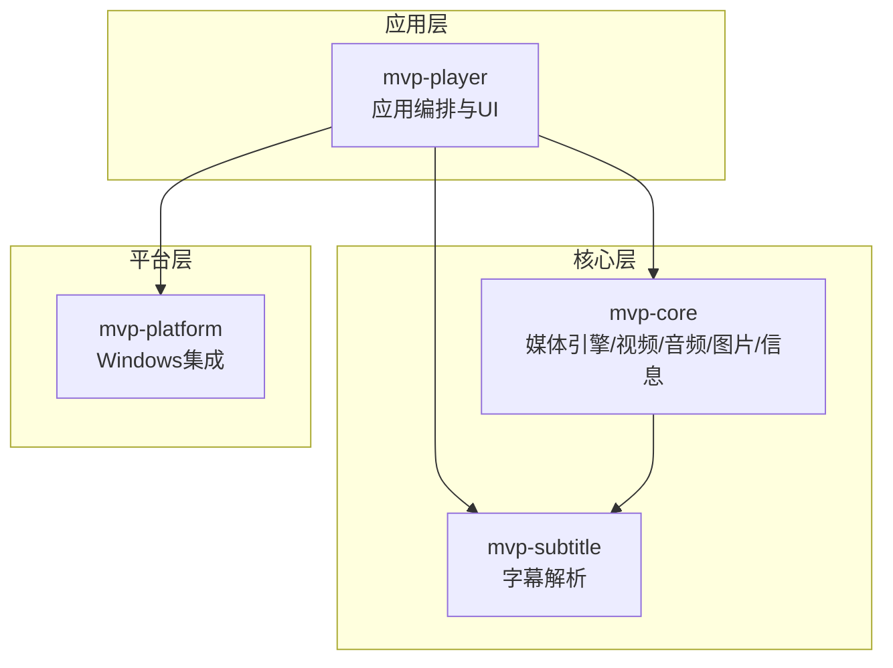
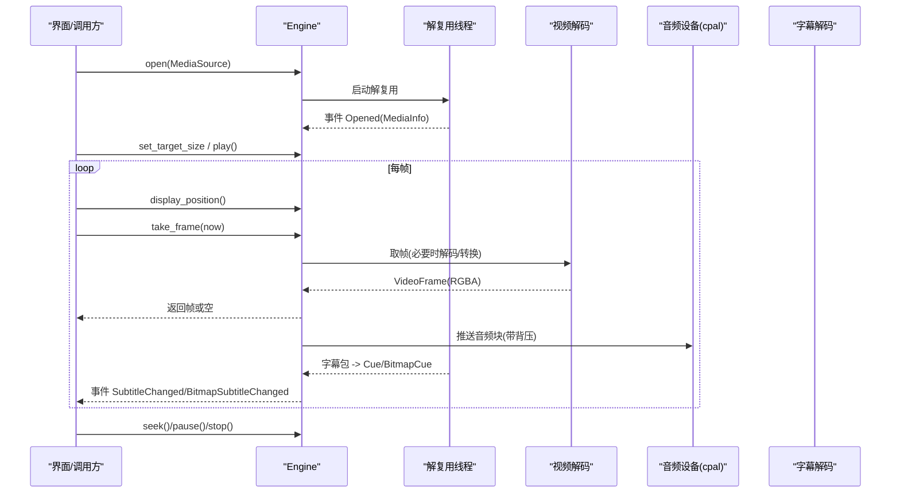
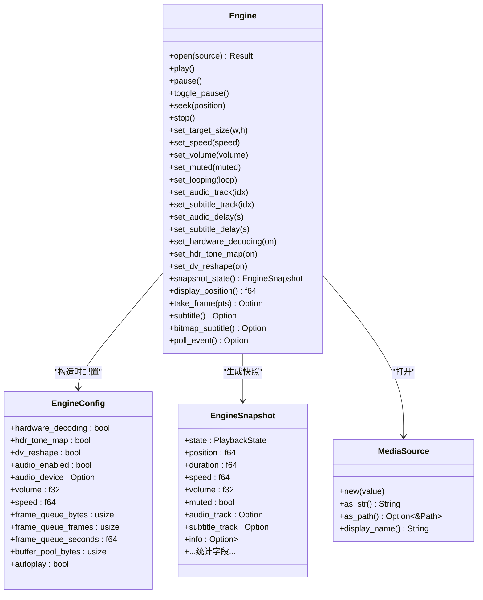
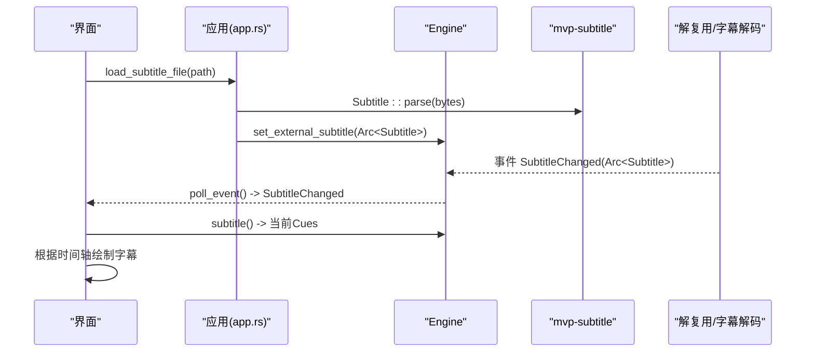
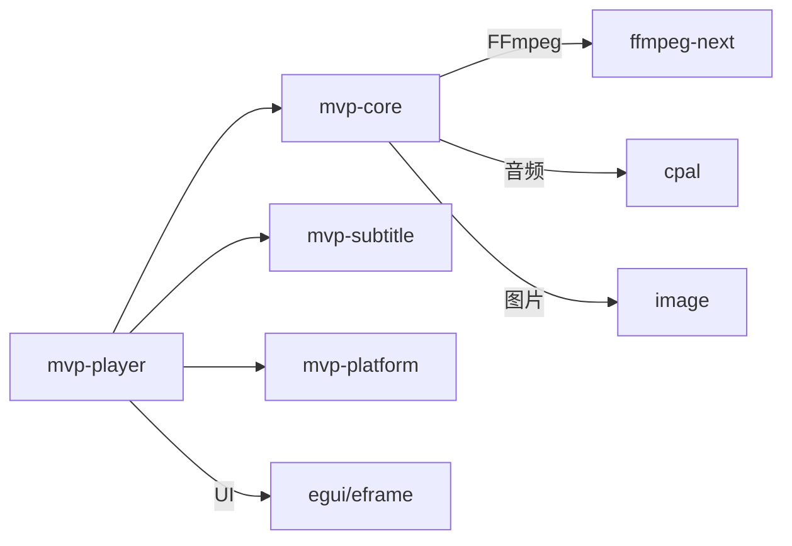

# API 参考

<cite>
**本文引用的文件**
- [README.md](file://README.md)
- [Cargo.toml](file://Cargo.toml)
- [mvp-core/lib.rs](file://crates/mvp-core/src/lib.rs)
- [mvp-core/engine.rs](file://crates/mvp-core/src/engine.rs)
- [mvp-core/video.rs](file://crates/mvp-core/src/video.rs)
- [mvp-core/audio.rs](file://crates/mvp-core/src/audio.rs)
- [mvp-core/bitmap_subtitle.rs](file://crates/mvp-core/src/bitmap_subtitle.rs)
- [mvp-core/info.rs](file://crates/mvp-core/src/info.rs)
- [mvp-core/error.rs](file://crates/mvp-core/src/error.rs)
- [mvp-subtitle/lib.rs](file://crates/mvp-subtitle/src/lib.rs)
- [mvp-subtitle/model.rs](file://crates/mvp-subtitle/src/model.rs)
- [mvp-platform/lib.rs](file://crates/mvp-platform/src/lib.rs)
- [mvp-platform/assoc.rs](file://crates/mvp-platform/src/assoc.rs)
- [mvp-player/app.rs](file://crates/mvp-player/src/app.rs)
- [mvp-player/settings.rs](file://crates/mvp-player/src/settings.rs)
</cite>

## 目录
1. [简介](#简介)
2. [项目结构](#项目结构)
3. [核心组件](#核心组件)
4. [架构总览](#架构总览)
5. [详细组件分析](#详细组件分析)
6. [依赖关系分析](#依赖关系分析)
7. [性能考量](#性能考量)
8. [故障排查指南](#故障排查指南)
9. [结论](#结论)
10. [附录](#附录)

## 简介
本 API 参考面向使用 MVP-Versatile-Player 引擎的开发者与集成方，覆盖三类公共接口：
- Engine API（媒体引擎控制）：打开/关闭、播放/暂停/停止、跳转、帧/字幕获取、状态快照等。
- Subtitle API（字幕解析接口）：文本字幕与图形字幕的数据模型、解析与查询。
- Platform API（平台功能接口）：Windows 文件关联、单实例、电源管理等。

文档同时说明核心数据结构（MediaSource、VideoFrame、AudioBuffer、SubtitleCue 等）、配置选项（播放参数、画质设置、音效配置、界面偏好）、事件类型与回调机制（播放状态变化、用户交互响应、错误处理），并提供函数签名要点、参数说明、返回值描述与使用示例路径。

## 项目结构
仓库采用多 crate 分层组织：
- mvp-core：FFmpeg 直连的媒体引擎（解复用、解码、时钟、队列、图片查看器、信息）。
- mvp-subtitle：纯逻辑的字幕解析（SRT/ASS/VTT/MicroDVD）与编码识别。
- mvp-platform：Windows 集成（文件关联、单实例 IPC、外壳、电源）。
- mvp-player：egui 界面与应用编排（将 UI 与引擎、设置、播放列表组合）。

图表来源
- [README.md:315-323](file://README.md#L315-L323)
- [Cargo.toml:1-8](file://Cargo.toml#L1-L8)

章节来源
- [README.md:315-323](file://README.md#L315-L323)
- [Cargo.toml:1-8](file://Cargo.toml#L1-L8)

## 核心组件
- 媒体引擎（Engine）：封装解复用线程、音视频解码线程、字幕解码、队列与时钟，提供对外控制与状态快照。
- 视频管线：硬件/软件解码、色彩空间选择、缩放/转换、HDR 色调映射、杜比视界重塑（可配置）。
- 音频管线：设备枚举与打开、缓冲与背压、音量/静音/变速、音效增强链（EQ/响度/空间感/限制器）。
- 字幕系统：文本字幕（SRT/ASS/VTT/MicroDVD）与图形字幕（PGS/VobSub/DVB）双通道；外部与内嵌字幕统一接入。
- 图片查看器：多格式图像加载、动画帧序列、EXIF 方向校正、超大图降采样。
- 平台能力：文件关联注册、单实例、阻止休眠、显示器 DPI/工作区探测。

章节来源
- [mvp-core/lib.rs:1-47](file://crates/mvp-core/src/lib.rs#L1-L47)
- [mvp-core/engine.rs:1-41](file://crates/mvp-core/src/engine.rs#L1-L41)
- [mvp-core/audio.rs:82-112](file://crates/mvp-core/src/audio.rs#L82-L112)
- [mvp-core/bitmap_subtitle.rs:63-106](file://crates/mvp-core/src/bitmap_subtitle.rs#L63-L106)
- [mvp-subtitle/lib.rs:1-34](file://crates/mvp-subtitle/src/lib.rs#L1-L34)
- [mvp-platform/lib.rs:1-33](file://crates/mvp-platform/src/lib.rs#L1-L33)

## 架构总览
引擎以“解复用 + 并行解码 + 有界队列”为核心，UI 通过轮询事件与快照驱动渲染。

图表来源
- [mvp-core/engine.rs:1-41](file://crates/mvp-core/src/engine.rs#L1-L41)
- [mvp-core/engine.rs:215-287](file://crates/mvp-core/src/engine.rs#L215-L287)
- [mvp-core/engine.rs:310-372](file://crates/mvp-core/src/engine.rs#L310-L372)

## 详细组件分析

### Engine API（媒体引擎控制）
- 数据源
  - MediaSource：支持本地路径与网络 URL，提供 as_str/as_path/display_name 等辅助。
- 生命周期与状态
  - PlaybackState：Idle/Opening/Playing/Paused/Ended/Error(String)。
  - EngineEvent：Opened(Arc<MediaInfo>)、StateChanged、SubtitleChanged、BitmapSubtitleChanged、Ended、Error。
- 配置
  - EngineConfig：hardware_decoding、hdr_tone_map、dv_reshape、audio_enabled、audio_device、volume、speed、frame_queue_bytes/frames/seconds、buffer_pool_bytes、autoplay。
- 常用方法（按职责分组）
  - 打开/关闭：open(MediaSource)、stop()。
  - 播放控制：play()、pause()、toggle_pause()、seek(f64)、time_until_next_frame()。
  - 轨道与延迟：set_audio_track(Option<usize>)、set_subtitle_track(Option<i64>)、set_audio_delay(f64)、set_subtitle_delay(f64)。
  - 画面与速率：set_target_size(u32,u32)、set_speed(f64)、set_volume(f32)、set_muted(bool)、set_looping(bool)。
  - 画质开关：set_hardware_decoding(bool)、set_hdr_tone_map(bool)、set_dv_reshape(bool)。
  - 数据读取：snapshot_state() 返回 EngineSnapshot；display_position() 当前显示时间；take_frame(f64) 取帧；subtitle() 获取当前文本字幕；bitmap_subtitle() 获取图形字幕。
  - 事件：poll_event() 异步事件队列。
- 状态快照（EngineSnapshot）关键字段
  - state、position、duration、speed、volume、muted、audio_track、subtitle_track、info、audio_clock、queued_frames、video_queue_seconds、audio_queue_seconds、dropped_frames、decoded_frames、skipped_frames、presentation_drops、download_ms、convert_ms、tone_map_ms、queue_wait_ms、dropped_audio、underruns、seeking、audio_delay、subtitle_delay、ab_loop、looping、audio_ended。

使用示例（路径）
- 打开并等待就绪、拉取帧与字幕：[player_loop.rs:35-120](file://crates/mvp-core/tests/player_loop.rs#L35-L120)
- 快速跳转风暴与健壮性：[seek_storm.rs:50-101](file://crates/mvp-core/tests/seek_storm.rs#L50-L101)
- 自动播放与暂停行为：[playback.rs:108-144](file://crates/mvp-core/tests/playback.rs#L108-L144)

章节来源
- [mvp-core/engine.rs:46-92](file://crates/mvp-core/src/engine.rs#L46-L92)
- [mvp-core/engine.rs:106-153](file://crates/mvp-core/src/engine.rs#L106-L153)
- [mvp-core/engine.rs:155-213](file://crates/mvp-core/src/engine.rs#L155-L213)
- [mvp-core/engine.rs:215-287](file://crates/mvp-core/src/engine.rs#L215-L287)
- [mvp-core/engine.rs:310-372](file://crates/mvp-core/src/engine.rs#L310-L372)
- [mvp-core/tests/player_loop.rs:35-120](file://crates/mvp-core/tests/player_loop.rs#L35-L120)
- [mvp-core/tests/seek_storm.rs:50-101](file://crates/mvp-core/tests/seek_storm.rs#L50-L101)
- [mvp-core/tests/playback.rs:108-144](file://crates/mvp-core/tests/playback.rs#L108-L144)

#### 类图（Engine 相关）

图表来源
- [mvp-core/engine.rs:46-92](file://crates/mvp-core/src/engine.rs#L46-L92)
- [mvp-core/engine.rs:155-213](file://crates/mvp-core/src/engine.rs#L155-L213)
- [mvp-core/engine.rs:215-287](file://crates/mvp-core/src/engine.rs#L215-L287)

### Subtitle API（字幕解析接口）
- 文本字幕
  - SubFormat：Srt、Ass、WebVtt、MicroDvd、Unknown。
  - Subtitle：包含 format/title/cues/encoding；parse(bytes) 自动检测编码并解析；active_at(t) 查询当前可见 Cue。
  - Cue：start/end 半开区间、contains(t)/duration()。
  - Align：九宫格对齐方式。
- 图形字幕
  - BitmapCue：start/end + Vec<BitmapRect>，contains(t)。
  - BitmapSubtitle：cues + canvas(可选坐标空间)，empty()/is_empty()/len()。
- 用法要点
  - 外部字幕：读取字节后 Subtitle::parse，再交由引擎 set_external_subtitle。
  - 内嵌字幕：引擎在解复用阶段解码为 Cue/BitmapCue，通过事件与 subtitle()/bitmap_subtitle() 暴露。

使用示例（路径）
- 文本字幕解析与查询：[acceptance.rs:1-42](file://crates/mvp-subtitle/tests/acceptance.rs#L1-L42)
- 外部字幕加载到引擎：[app.rs:613-645](file://crates/mvp-player/src/app.rs#L613-L645)
- 内嵌字幕解码与查找：[workers.rs:562-592](file://crates/mvp-core/src/engine/workers.rs#L562-L592), [workers.rs:2135-2167](file://crates/mvp-core/src/engine/workers.rs#L2135-L2167)

章节来源
- [mvp-subtitle/lib.rs:1-34](file://crates/mvp-subtitle/src/lib.rs#L1-L34)
- [mvp-subtitle/model.rs:9-24](file://crates/mvp-subtitle/src/model.rs#L9-L24)
- [mvp-subtitle/model.rs:26-48](file://crates/mvp-subtitle/src/model.rs#L26-L48)
- [mvp-subtitle/model.rs:86-119](file://crates/mvp-subtitle/src/model.rs#L86-L119)
- [mvp-subtitle/model.rs:121-156](file://crates/mvp-subtitle/src/model.rs#L121-L156)
- [mvp-core/bitmap_subtitle.rs:63-106](file://crates/mvp-core/src/bitmap_subtitle.rs#L63-L106)
- [mvp-core/engine/workers.rs:562-592](file://crates/mvp-core/src/engine/workers.rs#L562-L592)
- [mvp-core/engine/workers.rs:2135-2167](file://crates/mvp-core/src/engine/workers.rs#L2135-L2167)
- [mvp-player/app.rs:613-645](file://crates/mvp-player/src/app.rs#L613-L645)

#### 时序图（字幕加载与显示）

图表来源
- [mvp-player/app.rs:613-645](file://crates/mvp-player/src/app.rs#L613-L645)
- [mvp-subtitle/model.rs:121-156](file://crates/mvp-subtitle/src/model.rs#L121-L156)
- [mvp-core/engine.rs:138-153](file://crates/mvp-core/src/engine.rs#L138-L153)

### Platform API（平台功能接口）
- 文件关联
  - register(FileKinds, set_default, add_context_menu) -> AssocReport：写入 HKCU，无需管理员权限；报告是否需要用户确认。
  - 刷新外壳、写 Application Entry、ProgID、SupportedTypes、上下文菜单。
- 单实例与 IPC
  - AppInstance/IpcMessage：命名互斥体 + 隐藏窗口 WM_COPYDATA。
- 电源管理
  - SleepBlocker：播放时阻止屏幕/系统休眠。
- 显示器与 DPI
  - monitor：工作区与缩放测量，用于窗口尺寸适配。

使用示例（路径）
- 注册文件关联与报告：[assoc.rs:727-767](file://crates/mvp-platform/src/assoc.rs#L727-L767)
- 模块导出与能力说明：[lib.rs:1-33](file://crates/mvp-platform/src/lib.rs#L1-L33)

章节来源
- [mvp-platform/lib.rs:1-33](file://crates/mvp-platform/src/lib.rs#L1-L33)
- [mvp-platform/assoc.rs:727-767](file://crates/mvp-platform/src/assoc.rs#L727-L767)

### 核心数据结构
- MediaSource：本地路径或网络 URL，提供 as_str/as_path/display_name。
- VideoFrame：RGBA 像素缓冲（由引擎视频管线产出，供 UI 上传至 GPU）。
- AudioBuffer：f32 交错样本流（由音频管线产出，经 cpal 输出）。
- SubtitleCue（文本）：start/end（秒，半开区间）、text、可选样式标志。
- BitmapCue/BitmapSubtitle：图形字幕的时间区间与矩形位图集合。
- MediaInfo：容器/流元数据（视频/音频/字幕/章节/HDR/杜比视界信息等）。

章节来源
- [mvp-core/engine.rs:46-92](file://crates/mvp-core/src/engine.rs#L46-L92)
- [mvp-core/video.rs:749-811](file://crates/mvp-core/src/video.rs#L749-L811)
- [mvp-core/audio.rs:82-112](file://crates/mvp-core/src/audio.rs#L82-L112)
- [mvp-subtitle/model.rs:86-119](file://crates/mvp-subtitle/src/model.rs#L86-L119)
- [mvp-core/bitmap_subtitle.rs:63-106](file://crates/mvp-core/src/bitmap_subtitle.rs#L63-L106)
- [mvp-core/info.rs:37-77](file://crates/mvp-core/src/info.rs#L37-L77)

### 配置选项
- 播放参数
  - 初始音量、速度、静音、循环模式、A-B 循环、音轨/字幕轨选择、音/字幕延迟。
- 画质设置
  - 硬件解码开关、HDR 色调映射开关、杜比视界重塑开关、目标分辨率（set_target_size）。
- 音效配置
  - 十段均衡器、低音/清晰度增强、响度归一化、空间感（Schroeder 残响）、峰值限制器；通过引擎 set_audio_enhance 发布。
- 界面偏好
  - 主题配色、侧边栏可见性、最小图/控制栏显隐、截图是否包含画面调节、记住位置策略等。

使用示例（路径）
- 应用启动构建 EngineConfig 并同步设置：[app.rs:221-263](file://crates/mvp-player/src/app.rs#L221-L263)
- 运行时同步引擎参数：[app.rs:970-984](file://crates/mvp-player/src/app.rs#L970-L984)
- 音效增强发布与就绪检查：[app.rs:940-968](file://crates/mvp-player/src/app.rs#L940-L968)
- 默认设置项：[settings.rs:774-809](file://crates/mvp-player/src/settings.rs#L774-L809)

章节来源
- [mvp-player/app.rs:221-263](file://crates/mvp-player/src/app.rs#L221-L263)
- [mvp-player/app.rs:940-984](file://crates/mvp-player/src/app.rs#L940-L984)
- [mvp-player/settings.rs:774-809](file://crates/mvp-player/src/settings.rs#L774-L809)

### 事件类型与回调机制
- 事件类型
  - Opened(MediaInfo)：文件探测完成，携带媒体信息。
  - StateChanged(PlaybackState)：播放状态变更。
  - SubtitleChanged(BitmapSubtitle/Subtitle)：字幕可用。
  - Ended：媒体结束。
  - Error(String)：非致命或致命错误。
- 回调/轮询
  - 引擎不主动回调，而是通过 poll_event() 异步事件队列；UI 每帧消费。
  - 状态快照 snapshot_state() 提供一次性一致性视图。
- 典型流程
  - 打开文件 -> 等待 Opened -> 设置目标尺寸 -> 开始播放 -> 每帧取帧/读字幕 -> 处理 Ended/Error。

使用示例（路径）
- 事件消费与状态更新：[app.rs:859-889](file://crates/mvp-player/src/app.rs#L859-L889)
- 端到端播放测试中的事件轮询：[player_loop.rs:54-71](file://crates/mvp-core/tests/player_loop.rs#L54-L71)

章节来源
- [mvp-core/engine.rs:138-153](file://crates/mvp-core/src/engine.rs#L138-L153)
- [mvp-player/app.rs:859-889](file://crates/mvp-player/src/app.rs#L859-L889)
- [mvp-core/tests/player_loop.rs:54-71](file://crates/mvp-core/tests/player_loop.rs#L54-L71)

### 错误码定义与异常处理模式
- 错误类型（MediaError）
  - Ffmpeg、Io、Unsupported、MissingStream、AudioDevice、Image、Cancelled、Other。
- 处理模式
  - 工作线程捕获 panic 并转为错误状态，避免进程崩溃。
  - 错误通过 EngineEvent::Error 与 PlaybackState::Error 两种途径上报。
  - UI 对特定错误（如音频设备不可用）降级提示而非阻断视频播放。

使用示例（路径）
- 错误类型定义：[error.rs:1-52](file://crates/mvp-core/src/error.rs#L1-L52)
- 错误事件收集与状态检查：[seek_storm.rs:30-48](file://crates/mvp-core/tests/seek_storm.rs#L30-L48)
- 缺失文件/损坏输入的错误表现：[playback.rs:667-699](file://crates/mvp-core/tests/playback.rs#L667-L699)

章节来源
- [mvp-core/error.rs:1-52](file://crates/mvp-core/src/error.rs#L1-L52)
- [mvp-core/tests/seek_storm.rs:30-48](file://crates/mvp-core/tests/seek_storm.rs#L30-L48)
- [mvp-core/tests/playback.rs:667-699](file://crates/mvp-core/tests/playback.rs#L667-L699)

### 最佳实践建议
- 打开前禁用不需要的轨道（如 set_subtitle_track(None)、set_audio_track(None)），避免解复用器空转。
- 先设置目标尺寸再开始播放，减少无效转换。
- 频繁 seek 时配合 snapshot_state() 与 time_until_next_frame() 控制节奏。
- 音效增强参数通过 set_audio_enhance 整块发布，避免逐参数抖动。
- 大文件/高码率场景关注 frame_queue_bytes/seconds 与 buffer_pool_bytes，防止内存膨胀。
- 遇到错误优先消费 poll_event() 并清理状态，再尝试恢复。

章节来源
- [mvp-core/tests/player_loop.rs:45-71](file://crates/mvp-core/tests/player_loop.rs#L45-L71)
- [mvp-core/engine.rs:215-287](file://crates/mvp-core/src/engine.rs#L215-L287)
- [mvp-player/app.rs:940-984](file://crates/mvp-player/src/app.rs#L940-L984)

## 依赖关系分析
- 模块耦合
  - mvp-player 依赖 mvp-core（引擎）、mvp-subtitle（字幕）、mvp-platform（系统集成）。
  - mvp-core 内部 video/audio/bitmap_subtitle 通过共享状态与队列协作。
- 外部依赖
  - FFmpeg（解码/转码/色彩/重采样）、cpal（音频输出）、image（图片）、egui/eframe（UI）。

图表来源
- [Cargo.toml:17-51](file://Cargo.toml#L17-L51)
- [README.md:315-323](file://README.md#L315-L323)

章节来源
- [Cargo.toml:17-51](file://Cargo.toml#L17-L51)
- [README.md:315-323](file://README.md#L315-L323)

## 性能考量
- 队列预算：视频队列按字节数与帧数双重上限，避免 4K RGBA 帧占用过多内存；同时限制媒体超前量（seconds）。
- 主时钟：使用系统时钟，避免设备计数器漂移导致画面加速/冻结。
- 零拷贝优化：swscale 直接写入池化缓冲区，UI 零拷贝解释为纹理。
- 关闭速度：丢弃积压、声卡回调不再运行、设置落盘轻量。
- 音效链旁路：当所有控件中性值时自动旁路，保证与未启用一致。

章节来源
- [README.md:325-358](file://README.md#L325-L358)
- [README.md:439-453](file://README.md#L439-L453)
- [mvp-core/engine.rs:215-287](file://crates/mvp-core/src/engine.rs#L215-L287)

## 故障排查指南
- 常见问题定位
  - 无声音：检查 audio_enabled、设备名称、音量/静音、设备回调 primed 状态。
  - 画面卡顿：关注 dropped_frames/presentation_drops、queue_wait_ms、convert_ms/tone_map_ms。
  - 字幕不显示：确认字幕轨道选择、外部字幕加载成功、事件 SubtitleChanged 已消费。
  - 打开失败：查看 EngineEvent::Error 与 PlaybackState::Error，区分 Io/Unsupported/MissingStream/AudioDevice。
- 日志与诊断
  - 日志路径：%APPDATA%\MVP-Versatile-Player\mvp.log；发布版无控制台，日志是主要排错依据。
  - 使用 dv_probe/seek_probe 示例工具定位 HDR/跳转问题。

章节来源
- [README.md:435-438](file://README.md#L435-L438)
- [mvp-core/tests/seek_storm.rs:30-48](file://crates/mvp-core/tests/seek_storm.rs#L30-L48)
- [mvp-core/tests/playback.rs:667-699](file://crates/mvp-core/tests/playback.rs#L667-L699)

## 结论
本 API 参考覆盖了媒体引擎控制、字幕解析与平台集成的关键接口与数据结构，提供了从配置到事件处理的完整链路说明。遵循队列预算、主时钟与旁路优化等设计原则，可在 Windows 桌面环境下获得稳定高效的播放体验。实际集成时建议严格消费事件、合理设置队列与画质开关，并在错误路径上做好降级与恢复。

## 附录
- 命令行参数（影响 EngineConfig 与初始行为）
  - --fullscreen、--no-autoplay、--no-audio、--volume、--speed、--subtitle。
- 快捷键（部分）
  - 空格/K 播放/暂停、←→ 快退/快进、↑↓ 音量、N/P 下一/上一项、S 截图、F 全屏、Z/R/A 比例/旋转/置顶、Ctrl+P 画面调节、T/Ctrl+L 侧边栏、Ctrl+O/U 打开文件/网络串流、Ctrl+, 设置。

章节来源
- [README.md:266-313](file://README.md#L266-L313)