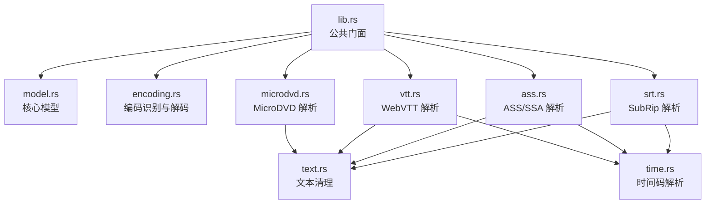
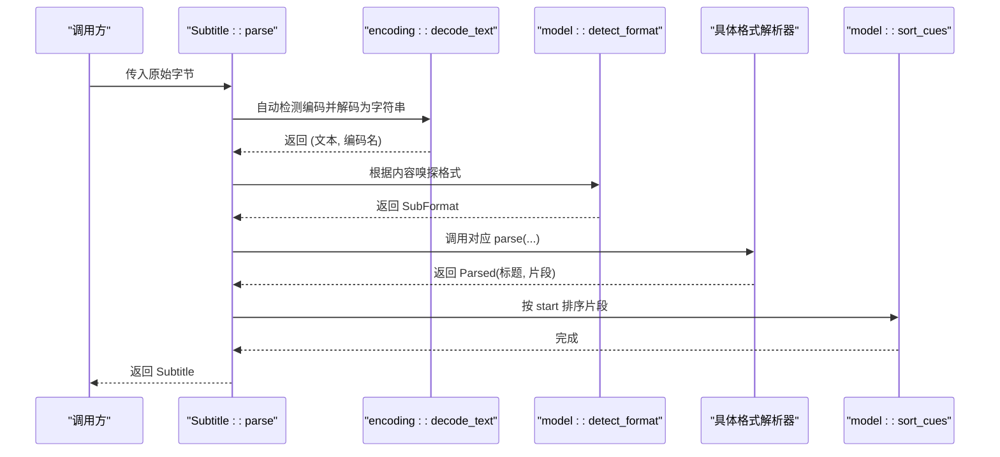
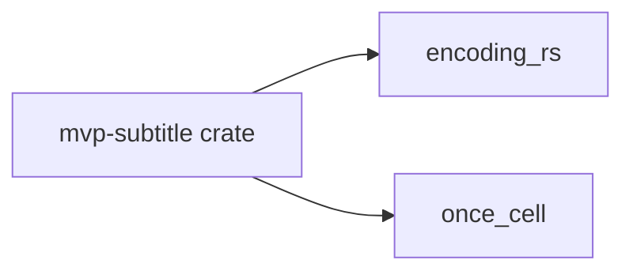

# 字幕 API

<cite>
**本文引用的文件**   
- [lib.rs](file://crates/mvp-subtitle/src/lib.rs)
- [model.rs](file://crates/mvp-subtitle/src/model.rs)
- [encoding.rs](file://crates/mvp-subtitle/src/encoding.rs)
- [srt.rs](file://crates/mvp-subtitle/src/srt.rs)
- [ass.rs](file://crates/mvp-subtitle/src/ass.rs)
- [vtt.rs](file://crates/mvp-subtitle/src/vtt.rs)
- [microdvd.rs](file://crates/mvp-subtitle/src/microdvd.rs)
- [text.rs](file://crates/mvp-subtitle/src/text.rs)
- [time.rs](file://crates/mvp-subtitle/src/time.rs)
- [acceptance.rs](file://crates/mvp-subtitle/tests/acceptance.rs)
</cite>

## 目录
1. [简介](#简介)
2. [项目结构](#项目结构)
3. [核心组件](#核心组件)
4. [架构总览](#架构总览)
5. [详细组件分析](#详细组件分析)
6. [依赖关系分析](#依赖关系分析)
7. [性能考虑](#性能考虑)
8. [故障排查指南](#故障排查指南)
9. [结论](#结论)
10. [附录：API 参考与示例](#附录api-参考与示例)

## 简介
本仓库中的 `mvp-subtitle` 是一个纯逻辑的字幕解析库，负责将多种字幕格式统一解析为内部模型，并提供时间轴查询、轨道元数据、编码识别、样式归一化等能力。它不依赖 FFmpeg 或平台相关代码，因此可在任意主机上测试并被播放器复用。

设计原则：
- 永不失败：解析器对损坏输入降级处理，不会因一个坏块丢弃整个文件。
- 永不 panic：对用户输入进行安全容错，无效 UTF-8、异常时间戳和截断文件均优雅降级。
- 单一模型：所有格式被归一化为统一的字幕片段（Cue）与样式（CueStyle）。

支持格式：
- SubRip（`.srt`）
- Advanced SubStation Alpha / Sub Station Alpha（`.ass` / `.ssa`）
- WebVTT（`.vtt`）
- MicroDVD（`.sub`）

已知限制：
- Big5 与 Shift_JIS 在可被 GBK 解码时可能被报告为 GBK。
- SRT/WebVTT 内联标签会被剥离，但不会设置 CueStyle 标志；只有 ASS/SSA 的覆盖会填充样式。
- ASS `\r` 恢复行级样式；命名恢复目标近似为同一恢复。
- ASS 对齐值 `9` 被读作数字小键盘右上角，`10`/`11` 作为旧式 SSA 中间居中/中间右对齐。

## 项目结构
该 crate 以“公共模型 + 多格式解析器 + 通用工具”的方式组织：
- 公共模型：`model.rs` 定义 `SubFormat`、`Cue`、`CueStyle`、`Align`、`Parsed`、`Subtitle` 等核心类型。
- 解析器：`srt.rs`、`ass.rs`、`vtt.rs`、`microdvd.rs` 分别实现各格式到 `Parsed` 的转换。
- 编码与文本工具：`encoding.rs` 提供编码检测与解码；`text.rs` 提供标签剥离、实体解码、换行转义等；`time.rs` 提供跨格式的时长解析。
- 顶层门面：`lib.rs` 暴露公共 API，并组合上述模块。

图表来源
- [lib.rs:47-59](file://crates/mvp-subtitle/src/lib.rs#L47-L59)
- [model.rs:9-136](file://crates/mvp-subtitle/src/model.rs#L9-L136)
- [encoding.rs:1-178](file://crates/mvp-subtitle/src/encoding.rs#L1-L178)
- [srt.rs:1-152](file://crates/mvp-subtitle/src/srt.rs#L1-L152)
- [ass.rs:1-81](file://crates/mvp-subtitle/src/ass.rs#L1-L81)
- [vtt.rs:1-64](file://crates/mvp-subtitle/src/vtt.rs#L1-L64)
- [microdvd.rs:1-104](file://crates/mvp-subtitle/src/microdvd.rs#L1-L104)
- [text.rs:1-155](file://crates/mvp-subtitle/src/text.rs#L1-L155)
- [time.rs:1-51](file://crates/mvp-subtitle/src/time.rs#L1-L51)

章节来源
- [lib.rs:1-59](file://crates/mvp-subtitle/src/lib.rs#L1-L59)

## 核心组件
- SubFormat：字幕格式枚举，包括 Srt、Ass、WebVtt、MicroDvd、Unknown。
- Align：字幕在视频帧内的锚点位置（九宫格对齐）。
- CueStyle：单条字幕的呈现属性（粗体、斜体、下划线、删除线、颜色、对齐、垂直边距）。
- Cue：半开区间 `[start, end)` 的时间范围，加上纯文本与样式。
- Parsed：解析结果（标题与字幕片段列表），由各格式解析器返回。
- Subtitle：完整解析后的轨道，包含格式、标题、已排序的片段、编码名称，并提供查询与编辑方法。

关键行为：
- 所有解析器从不失败，错误输入降级为“更少片段”。
- 片段按 start 排序；active_at 返回“最佳”活跃片段（重叠时取开始最晚者）。
- active_all 返回所有活跃片段（用于卡拉 OK 或多行叠加）。
- index_at 返回当前或下一个片段的索引，便于“跳到下一条字幕”。
- shift 可整体偏移时间并重新排序。
- merge_adjacent 可合并相邻且文本相同的片段，减少重复。

章节来源
- [model.rs:9-136](file://crates/mvp-subtitle/src/model.rs#L9-L136)
- [model.rs:138-295](file://crates/mvp-subtitle/src/model.rs#L138-L295)

## 架构总览
下图展示从原始字节到可渲染字幕的完整流程：

图表来源
- [lib.rs:149-165](file://crates/mvp-subtitle/src/lib.rs#L149-L165)
- [model.rs:272-295](file://crates/mvp-subtitle/src/model.rs#L272-L295)
- [model.rs:302-352](file://crates/mvp-subtitle/src/model.rs#L302-L352)
- [encoding.rs:150-178](file://crates/mvp-subtitle/src/encoding.rs#L150-L178)

## 详细组件分析

### 公共 API：Subtitle 与 SubtitleParser
虽然名为“SubtitleParser”，但在该 crate 中，对外暴露的是 `Subtitle` 类型及其静态方法，以及若干独立函数：
- `Subtitle::parse(bytes)`：自动检测编码与格式，返回可用轨道。
- `Subtitle::parse_with_format(bytes, format)`：强制指定格式，仍自动检测编码。
- `Subtitle::format_from_extension(ext)`：从扩展名猜测格式。
- `Subtitle::active_at(t)`：获取时间点 t 的最佳活跃片段。
- `Subtitle::active_all(t)`：获取时间点 t 的所有活跃片段。
- `Subtitle::index_at(t)`：获取覆盖 t 的片段索引，或下一个片段索引。
- `Subtitle::shift(delta_secs)`：整体偏移时间并排序。
- `Subtitle::merge_adjacent(gap)`：合并相邻且文本相同的片段。
- `parse_microdvd(bytes, fps)`：直接解析 MicroDVD 字节流。
- `detect_encoding(bytes)`：仅做编码检测。
- `decode_text(bytes, hint)`：带提示的解码，返回文本与编码名。

这些方法共同构成“字幕解析系统”的公共接口。

章节来源
- [lib.rs:57-59](file://crates/mvp-subtitle/src/lib.rs#L57-L59)
- [model.rs:138-295](file://crates/mvp-subtitle/src/model.rs#L138-L295)
- [microdvd.rs:90-104](file://crates/mvp-subtitle/src/microdvd.rs#L90-L104)
- [encoding.rs:124-178](file://crates/mvp-subtitle/src/encoding.rs#L124-L178)

### 数据结构：Cue 与 CueStyle
- Cue：
  - start/end：秒级浮点时间，半开区间。
  - text：去标记后的纯文本，可能含换行。
  - style：样式信息。
- CueStyle：
  - bold/italic/underline/strikeout：布尔样式。
  - color：RGB 三元组（可选）。
  - align：对齐方式（九宫格）。
  - margin_v：垂直边距（可选，单位像素）。

Cue 还提供：
- contains(t)：判断 t 是否在半开区间内。
- duration()：计算时长，非正数返回 0。

章节来源
- [model.rs:26-105](file://crates/mvp-subtitle/src/model.rs#L26-L105)

### 编码识别与自动检测
编码优先级：
1. BOM（UTF-8、UTF-16LE、UTF-16BE）。
2. 整段合法 UTF-8。
3. GBK 解码无错误且包含 CJK 字符。
4. Big5 解码无错误且包含 CJK 字符。
5. Shift_JIS 解码无错误且包含 CJK 或假名。
6. 回退到 Windows-1252。

decode_text 会：
- 尊重 BOM 与显式 hint。
- 剥离 BOM。
- 使用 lossy 解码，非法序列替换为 U+FFFD，保证“有字幕总比没字幕好”。

章节来源
- [encoding.rs:11-35](file://crates/mvp-subtitle/src/encoding.rs#L11-L35)
- [encoding.rs:60-94](file://crates/mvp-subtitle/src/encoding.rs#L60-L94)
- [encoding.rs:110-178](file://crates/mvp-subtitle/src/encoding.rs#L110-L178)

### 多轨道字幕与轨道切换
当前模型为“单轨道”：每个 `Subtitle` 表示一个字幕轨道。若需要多轨道：
- 在应用层维护多个 `Subtitle` 实例，分别解析不同轨道文件。
- 通过 UI 或控制层切换当前激活的轨道。
- 使用 `Subtitle::active_at`/`active_all` 查询当前时间点的显示内容。

注意：该 crate 未提供“在同一文件中解析多轨道”的能力；多轨道应由上层管理。

章节来源
- [model.rs:121-136](file://crates/mvp-subtitle/src/model.rs#L121-L136)

### 各格式解析方法与行为

#### SubRip（SRT）
- 入口：`srt::parse(input)`。
- 特点：
  - 容忍缺失序号、缺少小时字段、逗号/点毫秒分隔、BOM、空行、尾部垃圾、最后一个片段无换行。
  - 剥离 `<i>`/`` 等内联标签与 `{...}` 覆盖块，`\N`/`\n` 转为真实换行。
  - 无法解析的时间块被跳过，不影响其他片段。

章节来源
- [srt.rs:1-152](file://crates/mvp-subtitle/src/srt.rs#L1-L152)

#### ASS/SSA
- 入口：`ass::parse(input)`。
- 特点：
  - 读取 `[Script Info]` 的 Title。
  - 构建样式表（`[V4+ Styles]` 或 `[V4 Styles]`），支持列重排。
  - 解析 Dialogue 行，支持 `\b`/`\i`/`\u`/`\s`/`\c`/`\an`/`\a`/`\pos`/`\r`/`\p` 等覆盖。
  - 忽略 Comment/Picture/Sound/Movie/Command 等非对话行。
  - 颜色为 BGR 顺序，对齐值兼容数字小键盘布局及旧式 SSA。

章节来源
- [ass.rs:1-81](file://crates/mvp-subtitle/src/ass.rs#L1-L81)
- [ass.rs:83-156](file://crates/mvp-subtitle/src/ass.rs#L83-L156)
- [ass.rs:239-302](file://crates/mvp-subtitle/src/ass.rs#L239-L302)
- [ass.rs:304-351](file://crates/mvp-subtitle/src/ass.rs#L304-L351)
- [ass.rs:429-551](file://crates/mvp-subtitle/src/ass.rs#L429-L551)

#### WebVTT
- 入口：`vtt::parse(input)`。
- 特点：
  - 处理 WEBVTT 头、NOTE/STYLE/REGION 块、可选标识符。
  - 支持 HH:MM:SS.mmm 与 MM:SS.mmm。
  - 解析 align:/position: 设置映射到对齐；line: 语法识别但不消费。
  - 剥离角度标签并解码实体。

章节来源
- [vtt.rs:1-64](file://crates/mvp-subtitle/src/vtt.rs#L1-L64)
- [vtt.rs:101-154](file://crates/mvp-subtitle/src/vtt.rs#L101-L154)

#### MicroDVD
- 入口：`microdvd::parse(input, fps)` 与 `parse_microdvd(bytes, fps)`。
- 特点：
  - 帧号转秒：默认 FPS 23.976，可被首行声明覆盖。
  - 支持 `{y:...}` 样式与 `{c:$..}` 颜色（BGR）。
  - `|` 作为换行分隔。

章节来源
- [microdvd.rs:1-29](file://crates/mvp-subtitle/src/microdvd.rs#L1-L29)
- [microdvd.rs:48-104](file://crates/mvp-subtitle/src/microdvd.rs#L48-L104)
- [microdvd.rs:106-162](file://crates/mvp-subtitle/src/microdvd.rs#L106-L162)

### 时间轴与查询
- Cue.contains(t)：半开区间判断。
- Subtitle.active_at(t)：返回最佳活跃片段（重叠时选择开始最晚者）。
- Subtitle.active_all(t)：返回所有活跃片段。
- Subtitle.index_at(t)：返回当前或下一个片段索引，便于“跳到下一条字幕”。

图表来源
- [model.rs:86-105](file://crates/mvp-subtitle/src/model.rs#L86-L105)
- [model.rs:180-213](file://crates/mvp-subtitle/src/model.rs#L180-L213)

章节来源
- [model.rs:86-105](file://crates/mvp-subtitle/src/model.rs#L86-L105)
- [model.rs:180-213](file://crates/mvp-subtitle/src/model.rs#L180-L213)

### 文本与时间工具
- text.rs：
  - strip_angle_tags：剥离 `<tag>` 类标签。
  - strip_brace_blocks：剥离 `{...}` 覆盖块。
  - convert_newline_escapes：将 `\N`/`\n` 转为换行。
  - decode_entities：解码 HTML 实体。
  - finish_text：规范化文本（去除首尾空行）。
- time.rs：
  - parse_timecode：统一解析多种时间码格式。

章节来源
- [text.rs:1-155](file://crates/mvp-subtitle/src/text.rs#L1-L155)
- [time.rs:1-51](file://crates/mvp-subtitle/src/time.rs#L1-L51)

## 依赖关系分析
- lib.rs 导出公共类型与函数，聚合 model、encoding、microdvd、srt、ass、vtt。
- 各解析器依赖 model 提供的数据结构，以及 text/time 工具。
- encoding.rs 依赖 encoding_rs 库进行编码处理。
- 测试 acceptance.rs 通过公共 API 验证端到端行为。

图表来源
- [Cargo.toml:8-11](file://crates/mvp-subtitle/Cargo.toml#L8-L11)

章节来源
- [lib.rs:47-59](file://crates/mvp-subtitle/src/lib.rs#L47-L59)
- [Cargo.toml:1-11](file://crates/mvp-subtitle/Cargo.toml#L1-L11)

## 性能考虑
- 解析复杂度：线性扫描输入文本，O(n)。
- 格式探测：bounded scan（最多扫描约 2000 行），避免大文件探测开销。
- 片段排序：使用稳定比较（NaN 视为相等），保持稳定性。
- 查询：active_at 线性扫描；如需频繁查询大量时间点，可在上层缓存最近命中索引。
- 文本处理：标签剥离与实体解码均为线性操作，长度上限受输入限制。
- 内存：Parsed 与 Subtitle 持有 Vec<Cue>，建议按需合并（merge_adjacent）以减少冗余。

[本节为通用指导，不直接分析具体文件]

## 故障排查指南
常见问题与定位：
- 中文乱码：检查编码检测是否正确，必要时使用 `EncodingHint` 强制编码。
- 时间错位：确认 MicroDVD 的 FPS 是否正确；检查时间码格式是否符合预期。
- 样式丢失：SRT/WebVTT 内联标签不会设置样式；需使用 ASS/SSA 的覆盖来保留样式。
- 空白片段：某些片段可能仅有时间而无文本，会被过滤掉。
- 对齐异常：ASS 对齐值 9/10/11 的特殊语义；WebVTT position% 的对齐推断仅在 align 缺失时生效。

调试建议：
- 使用 `Subtitle::format_from_extension` 与 `Subtitle::parse_with_format` 固定格式进行回归测试。
- 打印 `subtitle.encoding` 与 `subtitle.format` 确认解析路径。
- 使用 `active_all` 查看重叠片段情况。
- 使用 `shift` 与 `merge_adjacent` 调整时间轴与片段粒度。

章节来源
- [encoding.rs:110-178](file://crates/mvp-subtitle/src/encoding.rs#L110-L178)
- [microdvd.rs:14-29](file://crates/mvp-subtitle/src/microdvd.rs#L14-L29)
- [ass.rs:429-551](file://crates/mvp-subtitle/src/ass.rs#L429-L551)
- [vtt.rs:101-154](file://crates/mvp-subtitle/src/vtt.rs#L101-L154)

## 结论
`mvp-subtitle` 提供了稳健、可扩展的字幕解析能力：
- 统一的模型与 API，屏蔽格式差异。
- 健壮的编码识别与文本清洗。
- 丰富的样式与对齐支持（尤其 ASS/SSA）。
- 面向播放器的查询与编辑接口（active_at、shift、merge_adjacent）。
- 良好的错误降级策略，确保用户体验。

对于多轨道场景，建议在应用层管理多个轨道并在 UI 层切换。

[本节为总结性内容，不直接分析具体文件]

## 附录：API 参考与示例

### 公共 API 速览
- `Subtitle::parse(bytes)`：自动检测编码与格式。
- `Subtitle::parse_with_format(bytes, format)`：强制格式，自动编码。
- `Subtitle::format_from_extension(ext)`：从扩展名推断格式。
- `Subtitle::active_at(t)`：最佳活跃片段。
- `Subtitle::active_all(t)`：所有活跃片段。
- `Subtitle::index_at(t)`：当前或下一个片段索引。
- `Subtitle::shift(delta_secs)`：整体偏移时间。
- `Subtitle::merge_adjacent(gap)`：合并相邻相同文本片段。
- `parse_microdvd(bytes, fps)`：MicroDVD 专用解析。
- `detect_encoding(bytes)`：编码检测。
- `decode_text(bytes, hint)`：带提示的解码。

章节来源
- [lib.rs:57-59](file://crates/mvp-subtitle/src/lib.rs#L57-L59)
- [model.rs:138-295](file://crates/mvp-subtitle/src/model.rs#L138-L295)
- [microdvd.rs:90-104](file://crates/mvp-subtitle/src/microdvd.rs#L90-L104)
- [encoding.rs:124-178](file://crates/mvp-subtitle/src/encoding.rs#L124-L178)

### 示例用法（路径引用）
- 基本 SRT 解析与查询：见 [acceptance.rs:9-42](file://crates/mvp-subtitle/tests/acceptance.rs#L9-L42)
- SRT 标点与缺小时字段：见 [acceptance.rs:44-62](file://crates/mvp-subtitle/tests/acceptance.rs#L44-L62)
- SRT 标记清理：见 [acceptance.rs:64-77](file://crates/mvp-subtitle/tests/acceptance.rs#L64-L77)
- GBK 中文 SRT 往返：见 [acceptance.rs:79-105](file://crates/mvp-subtitle/tests/acceptance.rs#L79-L105)
- BOM 编码处理：见 [acceptance.rs:107-135](file://crates/mvp-subtitle/tests/acceptance.rs#L107-L135)
- ASS 重排 Format 与覆盖：见 [acceptance.rs:137-176](file://crates/mvp-subtitle/tests/acceptance.rs#L137-L176)
- WebVTT NOTE/标识符/align：见 [acceptance.rs:178-212](file://crates/mvp-subtitle/tests/acceptance.rs#L178-L212)
- 半开区间查询：见 [acceptance.rs:214-239](file://crates/mvp-subtitle/tests/acceptance.rs#L214-L239)
- 时间偏移与排序：见 [acceptance.rs:241-276](file://crates/mvp-subtitle/tests/acceptance.rs#L241-L276)
- 损坏输入容错：见 [acceptance.rs:278-311](file://crates/mvp-subtitle/tests/acceptance.rs#L278-L311)
- 合并相邻片段：见 [acceptance.rs:313-345](file://crates/mvp-subtitle/tests/acceptance.rs#L313-L345)

### 配置选项
- 编码提示：`EncodingHint::Auto`、`Utf8`、`Utf16Le`、`Utf16Be`、`Gbk`、`Big5`、`ShiftJis`、`Latin1`。
- MicroDVD FPS：DEFAULT_FPS = 23.976；可通过 `parse_microdvd(bytes, fps)` 指定。
- 片段合并阈值：`merge_adjacent(gap)`，gap 为非有限或负数时视为 0。

章节来源
- [encoding.rs:11-35](file://crates/mvp-subtitle/src/encoding.rs#L11-L35)
- [microdvd.rs:14-29](file://crates/mvp-subtitle/src/microdvd.rs#L14-L29)
- [model.rs:241-270](file://crates/mvp-subtitle/src/model.rs#L241-L270)

### 扩展新格式的指导
步骤：
1. 新增解析器模块（例如 `myfmt.rs`），实现 `pub fn parse(input: &str) -> Parsed`。
2. 在 `model.rs` 的 `SubFormat` 中添加新变体。
3. 在 `model.rs` 的 `from_text` 中增加分支，将新格式路由到新解析器。
4. 在 `model.rs` 的 `detect_format` 中加入内容嗅探规则（如头部关键字）。
5. 在 `lib.rs` 中导出新解析器函数（可选）。
6. 编写单元测试与验收测试，覆盖正常、边界与损坏输入。

注意事项：
- 保持“永不失败”的设计：解析失败应跳过坏块而非 panic。
- 文本清洗：尽量复用 `text.rs` 的工具函数。
- 时间解析：复用 `time.rs::parse_timecode`。
- 样式映射：尽可能映射到 `CueStyle`；无法映射的属性应丢弃而非报错。

章节来源
- [model.rs:272-352](file://crates/mvp-subtitle/src/model.rs#L272-L352)
- [lib.rs:47-59](file://crates/mvp-subtitle/src/lib.rs#L47-L59)