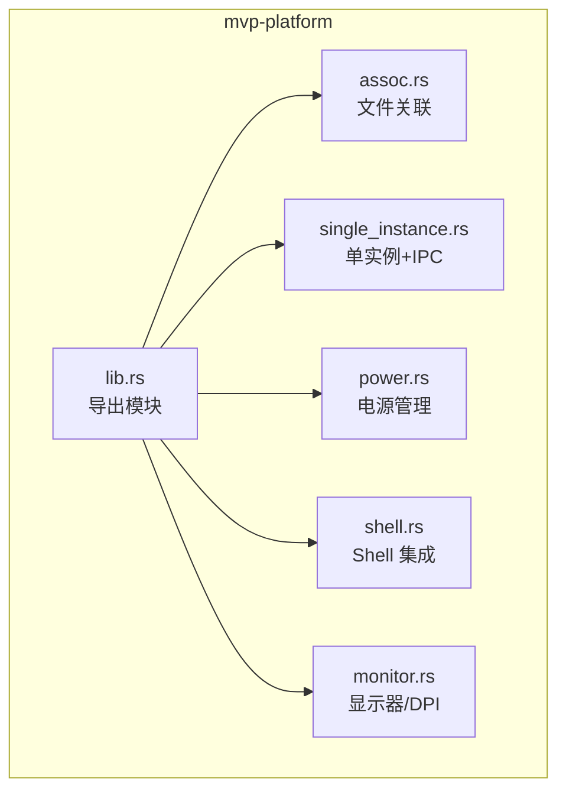
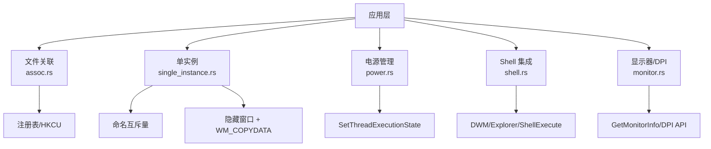
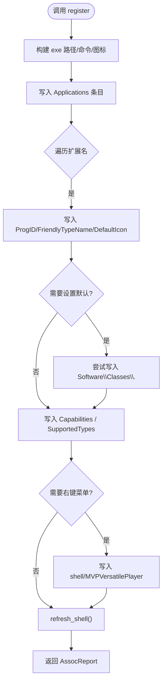
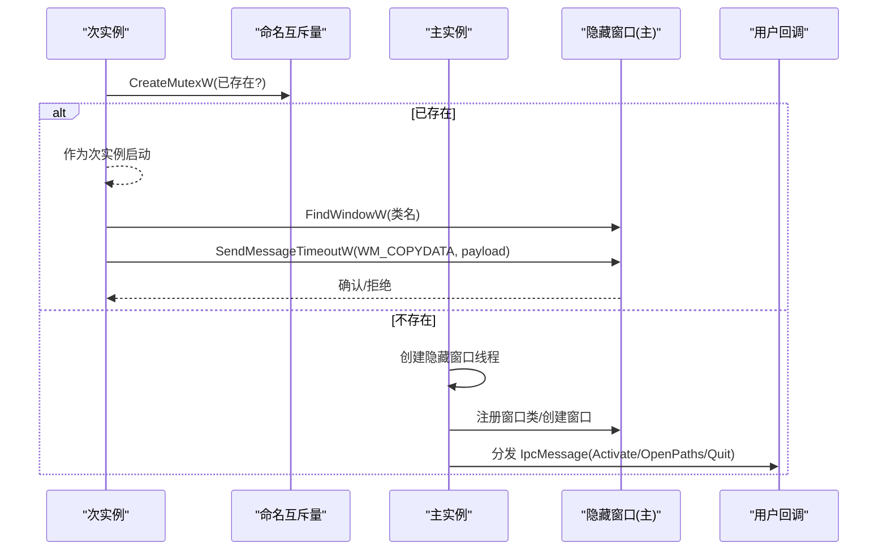
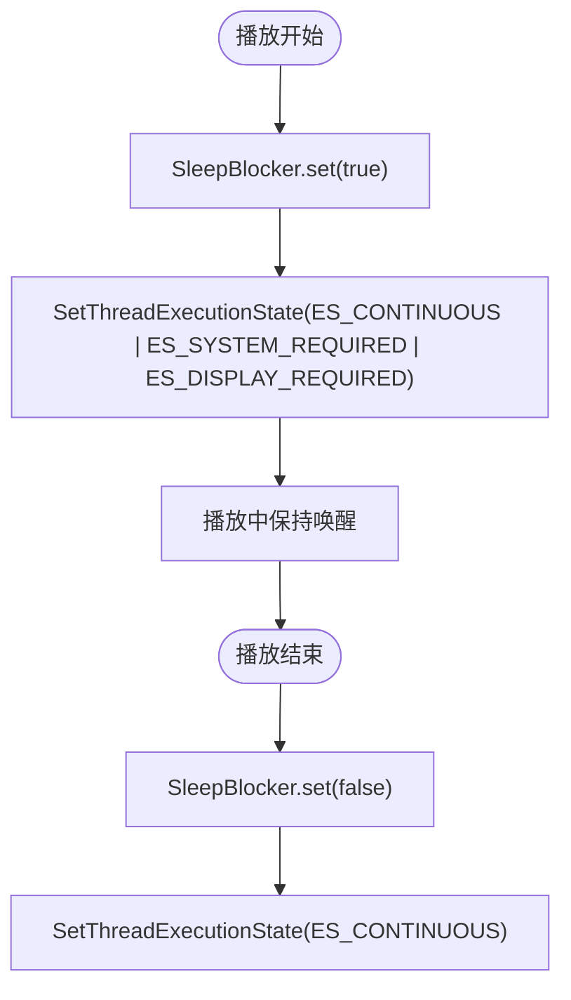
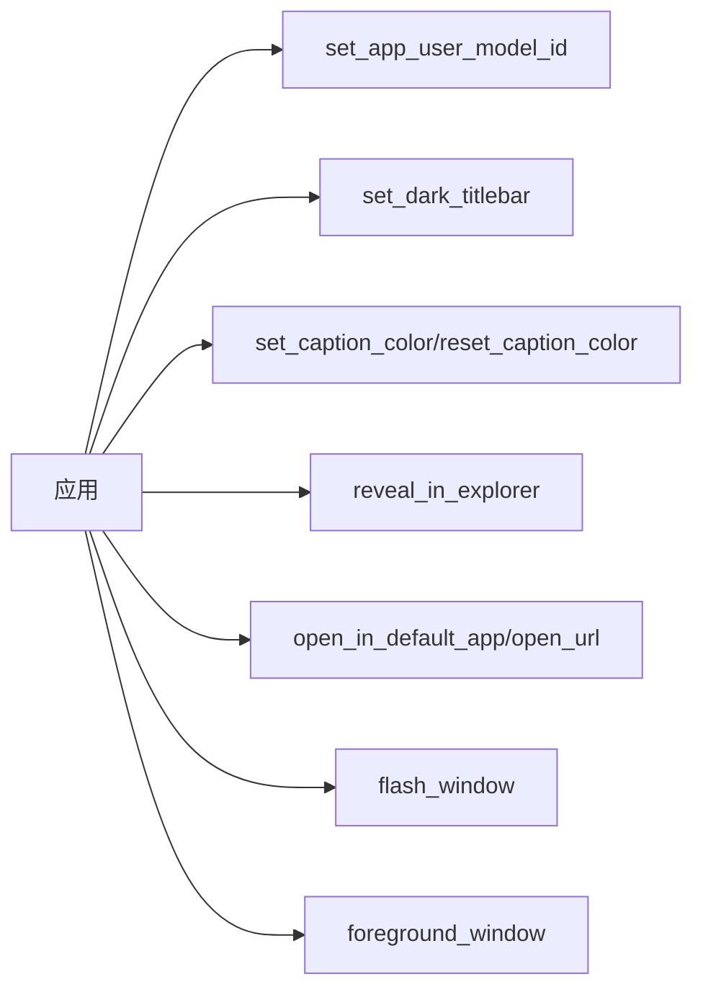
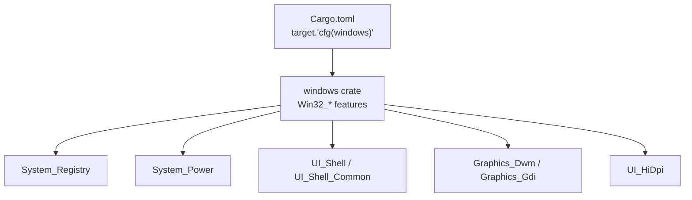

# 平台 API

<cite>
**本文引用的文件**   
- [lib.rs](file://crates/mvp-platform/src/lib.rs)
- [assoc.rs](file://crates/mvp-platform/src/assoc.rs)
- [single_instance.rs](file://crates/mvp-platform/src/single_instance.rs)
- [power.rs](file://crates/mvp-platform/src/power.rs)
- [shell.rs](file://crates/mvp-platform/src/shell.rs)
- [monitor.rs](file://crates/mvp-platform/src/monitor.rs)
- [Cargo.toml](file://crates/mvp-platform/Cargo.toml)
</cite>

## 目录
1. [简介](#简介)
2. [项目结构](#项目结构)
3. [核心组件](#核心组件)
4. [架构总览](#架构总览)
5. [详细组件分析](#详细组件分析)
6. [依赖关系分析](#依赖关系分析)
7. [性能与行为特性](#性能与行为特性)
8. [故障排查指南](#故障排查指南)
9. [结论](#结论)
10. [附录：调用示例、权限与兼容性](#附录调用示例权限与兼容性)

## 简介
本仓库的 `mvp-platform` crate 提供 Windows 平台的系统集成能力，包括：
- 文件关联注册与卸载（仅 HKEY_CURRENT_USER，无需管理员）
- 单实例控制与进程间通信（命名互斥量 + 隐藏窗口 + WM_COPYDATA）
- 电源管理（阻止系统休眠/显示关闭）
- Shell 集成（AppUserModelID、深色标题栏、任务栏闪烁、打开资源管理器、默认程序打开等）
- 显示器几何与 DPI 测量（用于窗口尺寸与位置计算）

该 crate 在 Windows 上实现具体功能，在非 Windows 平台上提供“无操作”或返回错误的兼容实现，使上层应用可在多平台编译。

## 项目结构
`mvp-platform` 按功能模块划分：
- `assoc.rs`：文件关联、Capabilities、上下文菜单、注册表读写
- `single_instance.rs`：单实例守卫、IPC 消息类型与编解码、Windows 后端
- `power.rs`：阻止休眠/显示关闭
- `shell.rs`：Shell 小工具（AppUserModelID、DWM 主题、任务栏闪烁、打开 URL/文件）
- `monitor.rs`：工作区矩形、DPI 换算、位置可达性判断
- `lib.rs`：对外暴露模块与公共类型

图表来源
- [lib.rs:23-33](file://crates/mvp-platform/src/lib.rs#L23-L33)

章节来源
- [lib.rs:1-34](file://crates/mvp-platform/src/lib.rs#L1-L34)

## 核心组件
- 文件关联：`register`、`unregister`、`is_registered`、`current_handler_for`、`open_default_apps_settings`、`refresh_shell`
- 单实例：`AppInstance::acquire`、`set_handler`、`shutdown`、`send_to_primary`、`IpcMessage`
- 电源管理：`SleepBlocker::new`、`set`、`is_enabled`
- Shell 集成：`set_app_user_model_id`、`set_dark_titlebar`、`set_caption_color`、`reset_caption_color`、`reveal_in_explorer`、`open_in_default_app`、`open_url`、`flash_window`、`foreground_window`
- 显示器/DPI：`primary_work_area_points`、`position_is_reachable`、`system_dpi`、`dpi_of_window`

章节来源
- [lib.rs:23-33](file://crates/mvp-platform/src/lib.rs#L23-L33)
- [assoc.rs:343-441](file://crates/mvp-platform/src/assoc.rs#L343-L441)
- [single_instance.rs:81-169](file://crates/mvp-platform/src/single_instance.rs#L81-L169)
- [power.rs:21-59](file://crates/mvp-platform/src/power.rs#L21-L59)
- [shell.rs:18-353](file://crates/mvp-platform/src/shell.rs#L18-L353)
- [monitor.rs:223-274](file://crates/mvp-platform/src/monitor.rs#L223-L274)

## 架构总览
下图展示各模块的职责与交互关系，以及它们如何共同支撑播放器在 Windows 上的体验。

图表来源
- [assoc.rs:447-800](file://crates/mvp-platform/src/assoc.rs#L447-L800)
- [single_instance.rs:337-715](file://crates/mvp-platform/src/single_instance.rs#L337-L715)
- [power.rs:62-78](file://crates/mvp-platform/src/power.rs#L62-L78)
- [shell.rs:18-353](file://crates/mvp-platform/src/shell.rs#L18-L353)
- [monitor.rs:90-226](file://crates/mvp-platform/src/monitor.rs#L90-L226)

## 详细组件分析

### 文件关联注册接口
- 目标：为视频、音频、图片、播放列表扩展名注册程序，并在“设置 > 应用 > 默认应用”中可见；可选写入经典 `Software\Classes\.<ext>` 默认值；可选添加右键菜单项。
- 关键函数：
  - `register(kinds, set_default, add_context_menu)`：注册并返回 `AssocReport`
  - `unregister()`：清理所有可能创建的键值
  - `is_registered()`：检查是否已注册
  - `current_handler_for(ext)`：查询当前处理器 ProgID
  - `open_default_apps_settings()`：打开“默认应用”页面
  - `refresh_shell()`：通知外壳刷新

图表来源
- [assoc.rs:728-767](file://crates/mvp-platform/src/assoc.rs#L728-L767)
- [assoc.rs:770-800](file://crates/mvp-platform/src/assoc.rs#L770-L800)

要点
- 所有写操作均在 `HKEY_CURRENT_USER`，无需 UAC。
- Windows 8+ 会保护 `UserChoice`，因此即使写了默认值也可能无效；`AssocReport.requires_user_confirmation` 指示是否需要引导用户到“默认应用”确认。
- 卸载时会对共享容器（如 `OpenWithProgids`）进行修剪，避免误删其他应用的键。

调用示例（概念步骤）
- 注册视频/音频/图片/播放列表，并尝试设置默认：
  - 构造 `FileKinds { video: true, audio: true, image: true, playlist: true }`
  - 调用 `register(&kinds, set_default: true, add_context_menu: false)`
  - 若 `report.requires_user_confirmation` 为真，调用 `open_default_apps_settings()` 引导用户确认
- 卸载：
  - 调用 `unregister()` 清理注册表项

权限要求
- 普通用户权限即可（HKCU）。

错误处理
- 首次失败的注册表写入会中止并返回错误；可调用 `unregister()` 清理残留。
- 非 Windows 平台返回“windows only”错误。

章节来源
- [assoc.rs:126-142](file://crates/mvp-platform/src/assoc.rs#L126-L142)
- [assoc.rs:343-441](file://crates/mvp-platform/src/assoc.rs#L343-L441)
- [assoc.rs:728-767](file://crates/mvp-platform/src/assoc.rs#L728-L767)

### 单实例控制机制（SingleInstance）
- 目标：确保同一应用在同一用户会话下只有一个主实例运行；后续启动将把请求转发给主实例。
- 机制：
  - 命名互斥量 `Local\MVPVersatilePlayer.<app_id>.Mutex` 决定主实例
  - 主实例创建隐藏顶层窗口作为 IPC 端点，使用 `WM_COPYDATA` 接收消息
  - 次实例通过 `FindWindowW` 定位窗口并使用 `SendMessageTimeoutW` 发送消息，避免阻塞

图表来源
- [single_instance.rs:378-458](file://crates/mvp-platform/src/single_instance.rs#L378-L458)
- [single_instance.rs:494-553](file://crates/mvp-platform/src/single_instance.rs#L494-L553)
- [single_instance.rs:658-715](file://crates/mvp-platform/src/single_instance.rs#L658-L715)

主要 API
- `AppInstance::acquire(app_id)`：成为主实例或返回 None（已有主实例）
- `AppInstance::set_handler(f)`：安装消息处理回调
- `AppInstance::shutdown()`：停止 IPC 线程并释放互斥量
- `send_to_primary(app_id, msg)`：从次实例向主实例发送消息

消息类型 `IpcMessage`
- `Activate`：激活现有窗口
- `OpenPaths(paths)`：打开一个或多个文件
- `Quit`：请求主实例退出

调用示例（概念步骤）
- 主实例：
  - 启动时调用 `AppInstance::acquire("your-app-id")`
  - 若返回 `Some(instance)`，则安装 `set_handler` 处理 Activate/OpenPaths/Quit
  - 退出时调用 `instance.shutdown()`
- 次实例：
  - 启动时调用 `AppInstance::acquire("your-app-id")`
  - 若返回 `None`，则调用 `send_to_primary("your-app-id", &IpcMessage::OpenPaths(vec![path]))`
  - 根据返回值决定是否继续正常启动

权限要求
- 普通用户权限（命名对象和窗口均为用户级）。

错误处理
- 主实例初始化失败会回滚互斥量和窗口，并返回错误。
- 次实例发送消息超时或被拒绝时返回 `Ok(false)`，调用方可降级为正常启动。

章节来源
- [single_instance.rs:1-51](file://crates/mvp-platform/src/single_instance.rs#L1-L51)
- [single_instance.rs:81-169](file://crates/mvp-platform/src/single_instance.rs#L81-L169)
- [single_instance.rs:337-715](file://crates/mvp-platform/src/single_instance.rs#L337-L715)

### 电源管理 API
- 目标：播放期间阻止系统休眠和显示关闭。
- 关键类型：`SleepBlocker`
  - `new(enable)`：创建并立即应用状态
  - `set(enable)`：请求或释放 keep-awake 状态
  - `is_enabled()`：查询最后成功调用的状态

图表来源
- [power.rs:62-78](file://crates/mvp-platform/src/power.rs#L62-L78)

调用示例（概念步骤）
- 播放开始时：`blocker.set(true)`
- 播放结束时：`blocker.set(false)`

权限要求
- 普通用户权限。

注意事项
- 该请求是进程范围的；必须从 UI 线程驱动，因为线程退出会导致请求失效。
- 析构不会自动恢复默认状态，需显式调用 `set(false)`。

章节来源
- [power.rs:1-20](file://crates/mvp-platform/src/power.rs#L1-L20)
- [power.rs:21-59](file://crates/mvp-platform/src/power.rs#L21-L59)
- [power.rs:62-86](file://crates/mvp-platform/src/power.rs#L62-L86)

### Shell 集成接口
- 目标：提升任务栏分组、跳转列表、通知、标题栏主题、资源管理器集成等体验。
- 关键函数：
  - `set_app_user_model_id(id)`：设置进程 AppUserModelID
  - `set_dark_titlebar(hwnd, dark)`：切换原生标题栏深色模式
  - `set_caption_color(hwnd, bg, text, border)`：着色标题栏/文本/边框
  - `reset_caption_color(hwnd)`：恢复系统颜色
  - `reveal_in_explorer(path)`：在资源管理器中高亮选中文件
  - `open_in_default_app(path)`：用默认程序打开文件
  - `open_url(url)`：用默认浏览器/handler 打开 URL
  - `flash_window(hwnd)`：任务栏按钮闪烁提示
  - `foreground_window(hwnd)`：恢复并置顶窗口

图表来源
- [shell.rs:18-353](file://crates/mvp-platform/src/shell.rs#L18-L353)

调用示例（概念步骤）
- 应用启动早期：`set_app_user_model_id("MVP-Versatile-Player")`
- 窗口创建后：`set_dark_titlebar(hwnd, dark_mode)`
- 用户点击“在资源管理器中显示”：`reveal_in_explorer(path)`
- 外部链接：`open_url(url)`
- 新文件打开且窗口被遮挡：`flash_window(hwnd)` 然后 `foreground_window(hwnd)`

权限要求
- 普通用户权限。

注意
- 这些函数对失败采用“静默降级”，不抛异常，便于 UI 层容错。

章节来源
- [shell.rs:1-8](file://crates/mvp-platform/src/shell.rs#L1-L8)
- [shell.rs:18-353](file://crates/mvp-platform/src/shell.rs#L18-L353)

### 显示器与 DPI（辅助）
- 目标：获取工作区大小、DPI，判断窗口位置是否可达，避免窗口出现在屏幕外。
- 关键函数：
  - `primary_work_area_points()`：主显示器可用区域（逻辑点）
  - `position_is_reachable(position, size)`：窗口位置是否至少部分可见
  - `system_dpi()` / `dpi_of_window(hwnd)`：系统/窗口 DPI

章节来源
- [monitor.rs:1-15](file://crates/mvp-platform/src/monitor.rs#L1-L15)
- [monitor.rs:223-274](file://crates/mvp-platform/src/monitor.rs#L223-L274)
- [monitor.rs:90-226](file://crates/mvp-platform/src/monitor.rs#L90-L226)

## 依赖关系分析
- `mvp-platform` 仅在 Windows 目标下引入 `windows` crate 的若干子模块，以访问注册表、DWM、Shell、Power、HiDPI 等 API。
- 非 Windows 平台通过条件编译提供 stub 实现，保证跨平台编译。

图表来源
- [Cargo.toml:14-39](file://crates/mvp-platform/Cargo.toml#L14-L39)

章节来源
- [Cargo.toml:1-48](file://crates/mvp-platform/Cargo.toml#L1-L48)

## 性能与行为特性
- 文件关联注册：一次性操作，涉及多次注册表写入与一次 `refresh_shell()`；失败即停，保留已写内容以便卸载清理。
- 单实例：
  - 主实例在独立线程泵送消息，避免阻塞 UI。
  - 次实例发送消息带超时，防止因主实例卡死而阻塞新进程。
- 电源管理：调用 Win32 API 设置执行状态，开销极低；应随播放生命周期开启/关闭。
- Shell 集成：多数为轻量 UI 调用，失败静默降级，不影响主流程。

[本节为通用指导，不直接分析具体文件]

## 故障排查指南
- 文件关联未生效
  - 检查 `AssocReport.requires_user_confirmation`，若为真，引导用户到“默认应用”确认。
  - 确认调用的是 HKCU 下的键，无需管理员权限。
  - 若注册中途失败，先调用 `unregister()` 清理残留再重试。
- 单实例无法识别
  - 确认 `app_id` 一致。
  - 检查次实例是否成功 `FindWindowW` 并发送 `WM_COPYDATA`。
  - 查看日志中是否有“no running primary instance found”或超时警告。
- 播放期间仍休眠
  - 确认 `SleepBlocker.set(true)` 在 UI 线程调用。
  - 播放结束后务必调用 `set(false)`。
- Shell 功能异常
  - 检查 DWM 是否可用（某些环境禁用合成）。
  - 对于 `reveal_in_explorer`，若目标不存在会回退到 `explorer.exe /select,...`。

章节来源
- [assoc.rs:701-725](file://crates/mvp-platform/src/assoc.rs#L701-L725)
- [single_instance.rs:658-715](file://crates/mvp-platform/src/single_instance.rs#L658-L715)
- [power.rs:1-20](file://crates/mvp-platform/src/power.rs#L1-L20)
- [shell.rs:183-230](file://crates/mvp-platform/src/shell.rs#L183-L230)

## 结论
`mvp-platform` 提供了面向 Windows 的完整系统集成能力：
- 安全、可逆的文件关联注册
- 健壮的单实例与 IPC 机制
- 简洁的电源管理封装
- 丰富的 Shell 集成工具
- 可靠的显示器/DPI 测量

这些能力共同提升了用户在 Windows 上的媒体播放体验，同时保持了跨平台编译的可行性。

[本节为总结，不直接分析具体文件]

## 附录：调用示例、权限与兼容性

### 文件关联
- 调用入口
  - 注册：`assoc::register(FileKinds, bool, bool) -> Result<AssocReport>`
  - 卸载：`assoc::unregister() -> Result<()>`
  - 查询：`assoc::is_registered() -> bool`
  - 当前处理器：`assoc::current_handler_for(&str) -> Option<String>`
  - 打开默认应用设置：`assoc::open_default_apps_settings() -> Result<()>`
  - 刷新外壳：`assoc::refresh_shell()`
- 权限：普通用户（HKCU）
- 兼容性：Windows；非 Windows 返回“windows only”

章节来源
- [assoc.rs:343-441](file://crates/mvp-platform/src/assoc.rs#L343-L441)

### 单实例
- 调用入口
  - 主实例：`AppInstance::acquire(&str) -> Result<Option<AppInstance>>`
  - 设置回调：`AppInstance::set_handler(Fn(IpcMessage))`
  - 关闭：`AppInstance::shutdown()`
  - 次实例发送：`send_to_primary(&str, &IpcMessage) -> Result<bool>`
- 权限：普通用户
- 兼容性：Windows；非 Windows 返回“windows only”

章节来源
- [single_instance.rs:81-169](file://crates/mvp-platform/src/single_instance.rs#L81-L169)
- [single_instance.rs:378-458](file://crates/mvp-platform/src/single_instance.rs#L378-L458)
- [single_instance.rs:658-715](file://crates/mvp-platform/src/single_instance.rs#L658-L715)

### 电源管理
- 调用入口
  - `SleepBlocker::new(bool)`
  - `SleepBlocker::set(bool)`
  - `SleepBlocker::is_enabled() -> bool`
- 权限：普通用户
- 兼容性：Windows；非 Windows 跟踪状态但不调用系统 API

章节来源
- [power.rs:21-59](file://crates/mvp-platform/src/power.rs#L21-L59)
- [power.rs:62-86](file://crates/mvp-platform/src/power.rs#L62-L86)

### Shell 集成
- 调用入口
  - `set_app_user_model_id(&str)`
  - `set_dark_titlebar(isize, bool)`
  - `set_caption_color(isize, [u8;3], [u8;3], [u8;3])`
  - `reset_caption_color(isize)`
  - `reveal_in_explorer(&Path)`
  - `open_in_default_app(&Path) -> Result<()>`
  - `open_url(&str) -> Result<()>`
  - `flash_window(isize)`
  - `foreground_window(isize)`
- 权限：普通用户
- 兼容性：Windows；非 Windows 多为无操作或返回“windows only”

章节来源
- [shell.rs:18-353](file://crates/mvp-platform/src/shell.rs#L18-L353)

### 部署注意事项
- 安装包/快捷方式应设置一致的 AppUserModelID，以确保任务栏分组与通知正确。
- 首次安装建议引导用户完成“默认应用”确认（当 `requires_user_confirmation` 为真）。
- 单实例的 `app_id` 应在整个应用中保持一致。
- 播放生命周期内务必开启/关闭 `SleepBlocker`，避免遗留电源策略。
- 非 Windows 平台调用 Windows 专属 API 时会得到“windows only”错误，需在业务层做分支处理。

[本节为通用指导，不直接分析具体文件]