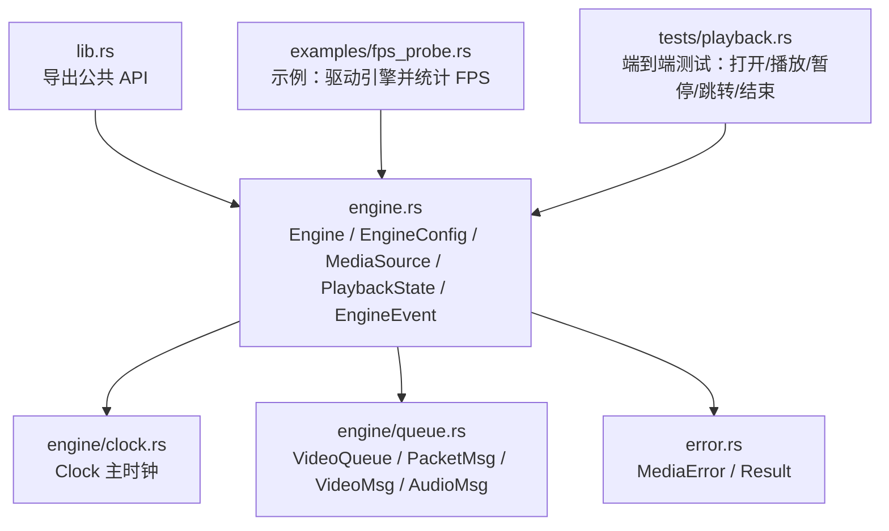
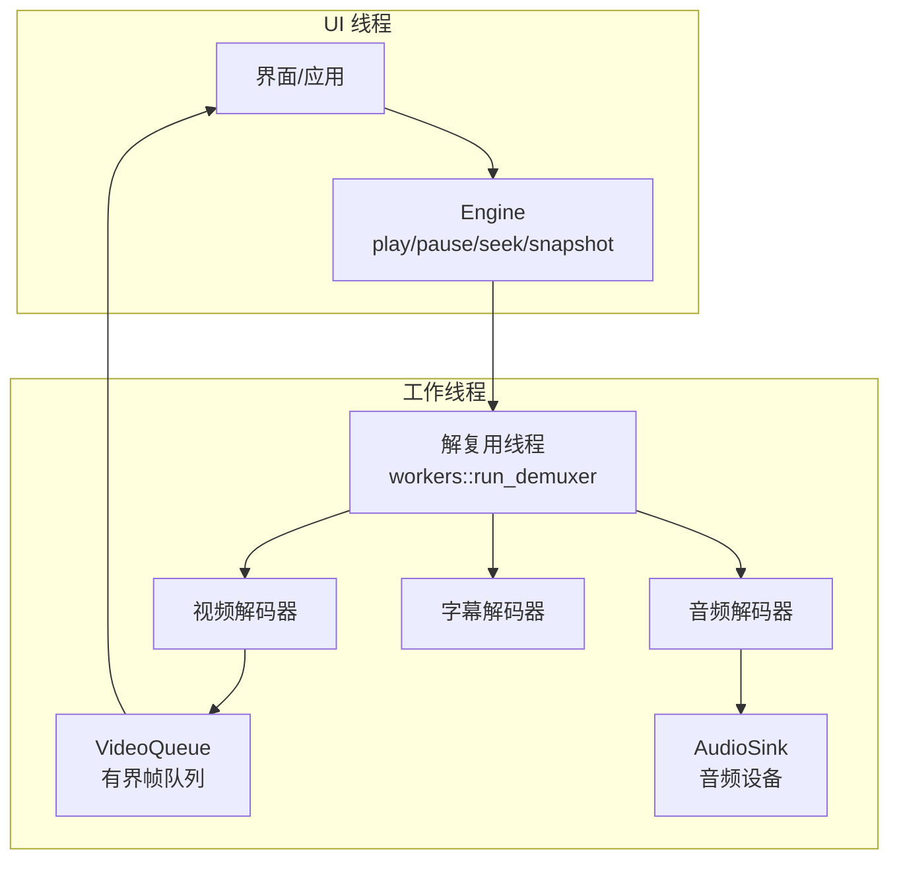
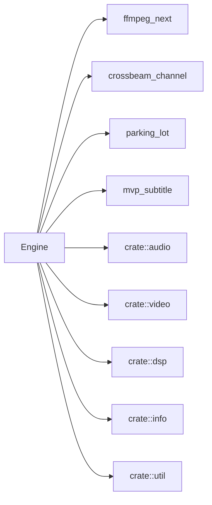

# 引擎 API

<cite>
**本文引用的文件**   
- [lib.rs](file://crates/mvp-core/src/lib.rs)
- [engine.rs](file://crates/mvp-core/src/engine.rs)
- [clock.rs](file://crates/mvp-core/src/engine/clock.rs)
- [queue.rs](file://crates/mvp-core/src/engine/queue.rs)
- [error.rs](file://crates/mvp-core/src/error.rs)
- [fps_probe.rs](file://crates/mvp-core/examples/fps_probe.rs)
- [playback.rs](file://crates/mvp-core/tests/playback.rs)
</cite>

## 目录
1. [简介](#简介)
2. [项目结构](#项目结构)
3. [核心组件](#核心组件)
4. [架构总览](#架构总览)
5. [详细组件分析](#详细组件分析)
6. [依赖关系分析](#依赖关系分析)
7. [性能与优化建议](#性能与优化建议)
8. [故障排查指南](#故障排查指南)
9. [结论](#结论)
10. [附录：API 参考与使用示例](#附录api-参考与使用示例)

## 简介
本文件面向媒体引擎的核心 API，重点说明以下能力：
- Engine 结构体的公共播放控制接口：Engine::new、Engine::open、Engine::play、Engine::pause、Engine::seek 等。
- EngineConfig 配置项：解码器选择、缓冲区大小、线程与队列参数、HDR/Dolby Vision 处理、音频开关与音量、自动播放等。
- MediaSource 媒体源抽象与 PlaybackState 播放状态枚举的定义与用法。
- EngineEvent 事件系统：打开完成、状态变更、字幕变化、结束、错误等事件的触发时机与处理方式。
- 函数签名、参数类型、返回值说明与实际使用示例。
- 错误处理模式、性能优化建议与最佳实践。

该引擎基于 FFmpeg 直接绑定，采用“解复用 + 解码 + 渲染”的三线程模型，所有队列均有字节数与帧数上限，避免高码率或高分辨率媒体导致内存膨胀；同时通过原子变量与小锁实现“类无锁”的控制通道，保证 UI 响应性。

## 项目结构
mvp-core 是媒体引擎所在 crate，对外暴露 Engine、EngineConfig、MediaSource、PlaybackState、EngineEvent、Clock、VideoQueue 等关键类型。核心入口在 lib.rs 中导出，引擎主逻辑集中在 engine.rs，时钟与队列分别位于 engine/clock.rs 与 engine/queue.rs。

图表来源
- [lib.rs:19-43](file://crates/mvp-core/src/lib.rs#L19-L43)
- [engine.rs:46-153](file://crates/mvp-core/src/engine.rs#L46-L153)
- [clock.rs:43-159](file://crates/mvp-core/src/engine/clock.rs#L43-L159)
- [queue.rs:11-86](file://crates/mvp-core/src/engine/queue.rs#L11-L86)
- [error.rs:1-53](file://crates/mvp-core/src/error.rs#L1-53)

章节来源
- [lib.rs:19-43](file://crates/mvp-core/src/lib.rs#L19-L43)

## 核心组件
本节概述引擎对外可见的类型与方法，后续章节将逐一深入。

- Engine：播放器核心，负责生命周期、播放控制、音视频轨道选择、字幕、时间轴、帧拉取、事件轮询与状态快照。
- EngineConfig：引擎可调参数，包括硬件解码、HDR 色调映射、Dolby Vision 重映射、音频设备与音量、速度、视频帧队列预算、缓冲池、自动播放等。
- MediaSource：媒体源抽象，支持本地路径与网络 URL。
- PlaybackState：播放生命周期状态（空闲、打开中、播放、暂停、结束、错误）。
- EngineEvent：异步事件，包含打开完成、状态变更、字幕变化、结束、错误等。
- Clock：主时钟，维护媒体位置、速率、是否运行、音频同步基准。
- VideoQueue：有界视频帧队列，按字节与时间预算限制，提供就绪帧提取与丢弃计数。

章节来源
- [engine.rs:46-153](file://crates/mvp-core/src/engine.rs#L46-L153)
- [engine.rs:155-213](file://crates/mvp-core/src/engine.rs#L155-L213)
- [engine.rs:529-549](file://crates/mvp-core/src/engine.rs#L529-L549)
- [clock.rs:43-159](file://crates/mvp-core/src/engine/clock.rs#L43-L159)
- [queue.rs:67-253](file://crates/mvp-core/src/engine/queue.rs#L67-L253)

## 架构总览
引擎内部由三个工作线程协作：解复用线程从容器读取数据包，分别送入视频解码器、音频解码器与字幕解码器；视频帧进入帧队列供 UI 拉取，音频数据输出到音频设备。控制命令（如 seek、轨道切换）通过共享状态传递，避免阻塞数据包通道。

图表来源
- [engine.rs:1-21](file://crates/mvp-core/src/engine.rs#L1-L21)
- [engine.rs:555-593](file://crates/mvp-core/src/engine.rs#L555-L593)
- [engine.rs:1188-1230](file://crates/mvp-core/src/engine.rs#L1188-L1230)

## 详细组件分析

### Engine 结构与公共方法
Engine 是播放器的门面，封装了共享状态、事件通道与工作线程句柄。其公共方法覆盖生命周期、播放控制、轨道与字幕管理、时间与显示位置、帧拉取、事件轮询与状态快照等。

- 构造与销毁
  - Engine::new(config)：创建引擎，初始化 FFmpeg，不立即打开设备或启动线程。
  - Drop：确保停止工作线程与释放资源，带超时保护，避免窗口关闭时卡死。

- 生命周期
  - Engine::open(source)：打开媒体源，重置每文件状态，启动解复用线程。
  - Engine::stop()：设置中止标志、唤醒视频解码器、关闭音频设备、等待线程退出、清空队列与池。

- 播放控制
  - Engine::play()：开始或恢复播放；若处于 Ended 且非直播，则重启回放。
  - Engine::pause()：暂停播放，冻结时钟与音频设备。
  - Engine::toggle_pause()：切换播放/暂停。
  - Engine::is_playing()：当前是否处于 Playing 状态。

- 定位与跳转
  - Engine::seek(position)：绝对跳转；Ended 时走 restart_after_end。
  - Engine::seek_relative(delta)：相对偏移跳转。
  - Engine::seek_fraction(fraction)：百分比跳转。
  - Engine::step_frame(steps)：逐帧步进（仅向前）。
  - Engine::set_playhead(position)：仅移动时钟，不触达容器（用于单帧步进）。

- 速度与音量
  - Engine::set_speed(speed)、Engine::speed()：设置/获取播放速率。
  - Engine::set_volume(volume)、Engine::volume()：设置/获取线性音量。
  - Engine::set_muted(muted)、Engine::is_muted()：静音开关。
  - Engine::effective_gain()：实际输出增益（考虑设备与静音）。

- 轨道与字幕
  - Engine::set_audio_track(index)、Engine::audio_track()：选择音频轨道。
  - Engine::set_subtitle_track(index/auto)、Engine::subtitle_track()：选择字幕轨道。
  - Engine::set_external_subtitle(subtitle)、Engine::set_external_bitmap_subtitle(bitmap)：外部字幕覆盖。
  - Engine::subtitle()、Engine::bitmap_subtitle()：当前活跃字幕。
  - Engine::has_external_subtitle()：是否有外部字幕。

- 时间与显示
  - Engine::duration()、Engine::position()、Engine::display_position()：时长、位置、含音频延迟的显示位置。
  - Engine::time_until_next_frame()：下一帧到达前的秒数。

- 帧与事件
  - Engine::take_frame(now)：拉取一帧；返回 Arc<VideoFrame>，调用方需尽快消费。
  - Engine::poll_event()：非阻塞读取 EngineEvent。
  - Engine::snapshot_state()：一次性快照，供 UI 每帧刷新。

- 其他
  - Engine::set_autoplay(autoplay)：下次 open 是否自动播放。
  - Engine::set_target_size(width, height)：设置目标分辨率，减少转换带宽。
  - Engine::set_hardware_decoding(enabled)、Engine::hardware_decoding()：硬件解码开关。
  - Engine::set_hdr_tone_map(enabled)、Engine::hdr_tone_map()：HDR 色调映射开关。
  - Engine::set_dv_reshape(enabled)、Engine::dv_reshape()：Dolby Vision 重映射开关。
  - Engine::set_audio_delay(seconds)、Engine::audio_delay()：音频延迟补偿。
  - Engine::set_subtitle_delay(seconds)、Engine::subtitle_delay()：字幕延迟补偿。
  - Engine::set_ab_loop(range)、Engine::ab_loop()：A-B 循环区间。
  - Engine::set_looping(looping)、Engine::is_looping()：循环播放开关。
  - Engine::source()：当前媒体源。

章节来源
- [engine.rs:529-549](file://crates/mvp-core/src/engine.rs#L529-L549)
- [engine.rs:555-593](file://crates/mvp-core/src/engine.rs#L555-L593)
- [engine.rs:613-661](file://crates/mvp-core/src/engine.rs#L613-L661)
- [engine.rs:663-709](file://crates/mvp-core/src/engine.rs#L663-L709)
- [engine.rs:721-770](file://crates/mvp-core/src/engine.rs#L721-L770)
- [engine.rs:773-800](file://crates/mvp-core/src/engine.rs#L773-L800)
- [engine.rs:802-883](file://crates/mvp-core/src/engine.rs#L802-L883)
- [engine.rs:885-1005](file://crates/mvp-core/src/engine.rs#L885-L1005)
- [engine.rs:1022-1115](file://crates/mvp-core/src/engine.rs#L1022-L1115)
- [engine.rs:1117-1181](file://crates/mvp-core/src/engine.rs#L1117-L1181)
- [engine.rs:1183-1299](file://crates/mvp-core/src/engine.rs#L1183-L1299)
- [engine.rs:1302-1346](file://crates/mvp-core/src/engine.rs#L1302-L1346)

### EngineConfig 配置选项
EngineConfig 提供引擎行为的可调参数，默认值兼顾性能与延迟。

- 解码与色彩
  - hardware_decoding：优先尝试硬件解码，失败回退软件。
  - hdr_tone_map：对 HDR（PQ/HLG）进行色调映射至 SDR。
  - dv_reshape：启用 Dolby Vision 重映射（默认关闭，因参考验证未完成）。

- 音频
  - audio_enabled：是否打开音频设备并播放声音。
  - audio_device：输出设备名，None 表示系统默认。
  - volume：初始线性音量。
  - speed：初始播放速率。

- 队列与缓冲
  - frame_queue_bytes：解码帧队列的像素字节预算。
  - frame_queue_frames：队列最大帧数上限。
  - frame_queue_seconds：以媒体秒数为单位的“超前”上限，控制延迟而非内存。
  - buffer_pool_bytes：RGB 缓冲池字节预算。

- 行为
  - autoplay：open 后是否自动开始播放。

章节来源
- [engine.rs:155-213](file://crates/mvp-core/src/engine.rs#L155-L213)

### MediaSource 媒体源抽象
MediaSource 统一表示本地文件或网络流。

- 变体
  - Path(PathBuf)：本地文件路径。
  - Url(String)：网络地址（http/rtsp 等）。

- 常用方法
  - MediaSource::new(value)：自动识别 URL 或路径。
  - as_str()：返回 FFmpeg 可用的字符串。
  - as_path()：本地路径形式（URL 返回 None）。
  - display_name()：短标签，用于标题与播放列表。

章节来源
- [engine.rs:46-92](file://crates/mvp-core/src/engine.rs#L46-L92)

### PlaybackState 播放状态
PlaybackState 描述引擎生命周期状态。

- 状态
  - Idle：未加载。
  - Opening：正在打开或缓冲。
  - Playing：正在播放。
  - Paused：已加载但暂停。
  - Ended：媒体结束。
  - Error(String)：失败，携带用户可读消息。

- 辅助方法
  - is_playing()：是否为 Playing。
  - is_active()：是否已加载（Playing/Paused/Ended）。

章节来源
- [engine.rs:106-136](file://crates/mvp-core/src/engine.rs#L106-L136)

### EngineEvent 事件系统
EngineEvent 是 UI 订阅的异步通知，常见事件如下：

- Opened(Arc<MediaInfo>)：文件成功打开，附带探测到的媒体信息。
- StateChanged(PlaybackState)：生命周期状态变更。
- SubtitleChanged(Arc<Subtitle>)：文本字幕 cues 可用。
- BitmapSubtitleChanged(Arc<BitmapSubtitle>)：图形字幕 cues 可用。
- Ended：媒体结束。
- Error(String)：发生错误（可致命或非致命），携带用户可读消息。

处理方式
- 通过 Engine::poll_event() 非阻塞读取。
- UI 应在每帧循环中轮询事件，更新界面与状态。
- 错误事件可用于提示用户并降级处理（例如关闭音频、重试或关闭媒体）。

章节来源
- [engine.rs:138-153](file://crates/mvp-core/src/engine.rs#L138-L153)
- [playback.rs:48-60](file://crates/mvp-core/tests/playback.rs#L48-L60)

### Clock 主时钟
Clock 维护媒体位置与速率，支持音频设备作为同步基准。

- 主要方法
  - new()：创建时钟，初始位置为 0，停止。
  - set_audio(sink)：安装/清除音频设备作为主参考。
  - seek(media)：跳转到媒体时间，不清除运行/暂停状态。
  - set_running(running)：启动/停止时钟。
  - set_speed(speed)：设置速率，保持当前位置。
  - now()：当前媒体位置。
  - is_audio_driven()：当前位置是否来自音频设备。

- 设计要点
  - 墙钟为主，音频设备用于同步；当音频停顿时，墙钟继续推进，避免末尾卡顿。
  - 速率范围被钳制，避免极端值。

章节来源
- [clock.rs:1-41](file://crates/mvp-core/src/engine/clock.rs#L1-L41)
- [clock.rs:43-159](file://crates/mvp-core/src/engine/clock.rs#L43-L159)

### VideoQueue 视频帧队列
VideoQueue 是有界 FIFO，按字节与时间预算限制，防止解码器超前过多导致延迟与内存浪费。

- 关键特性
  - try_push(frame)：入队；满时返回原帧，不丢弃旧帧。
  - pop_front()：出队最老帧。
  - take_ready(now, tolerance)：取出已到时间的最新帧，丢弃中间过时帧。
  - time_until_next(now)：下一帧到达前剩余秒数。
  - with_time_budget(...)：按媒体秒数限制“超前”。

- 复杂度
  - 入队/出队 O(1)。
  - 取就绪帧可能丢弃多个过时帧，但总体线性于丢弃数量。

章节来源
- [queue.rs:67-253](file://crates/mvp-core/src/engine/queue.rs#L67-L253)

## 依赖关系分析
Engine 依赖以下模块与类型：
- ffmpeg_next：FFmpeg 绑定，用于解复用与解码。
- crossbeam_channel：跨线程消息通道。
- parking_lot：高性能互斥与条件变量。
- mvp_subtitle：字幕解析与模型。
- 内部模块：audio、video、dsp、info、util 等。

图表来源
- [engine.rs:22-37](file://crates/mvp-core/src/engine.rs#L22-L37)

章节来源
- [engine.rs:22-37](file://crates/mvp-core/src/engine.rs#L22-L37)

## 性能与优化建议
- 合理设置目标分辨率：通过 Engine::set_target_size(width, height) 让解码阶段直接转换到显示尺寸，显著降低 GPU/CPU 带宽与内存占用。
- 调整帧队列预算：frame_queue_bytes 与 frame_queue_seconds 共同约束内存与延迟；对于低延迟场景，减小 seconds；对于高码率 4K，适当增大 bytes。
- 启用硬件解码：hardware_decoding=true 可降低 CPU 负载，但需关注兼容性。
- HDR 与 DV：仅在需要时开启 hdr_tone_map 与 dv_reshape，避免不必要的转换开销。
- 音频增强：set_audio_enhance 的参数变更会即时生效，注意回调频率与平滑处理，避免频繁抖动。
- 帧拉取节奏：UI 应依据 Engine::time_until_next_frame() 调度刷新，避免忙轮询。
- 避免阻塞通道：控制命令通过共享状态传递，不要向数据包通道发送控制消息，以免死锁。

[本节为通用指导，不直接分析具体文件]

## 故障排查指南
- 打开失败或错误
  - 观察 EngineEvent::Error 与 Engine::state() 是否为 Error。
  - 检查 MediaError 类型：FFmpeg 错误、I/O 失败、不支持的媒体、缺失流、音频设备错误等。
- 垃圾输入或损坏文件
  - 引擎具备 panic-proof 设计：工作线程捕获 panic 并转为错误状态，不会崩溃整个进程。
- 无法播放或卡顿
  - 检查帧队列是否已满（queued_frames 与 video_queue_seconds）。
  - 查看 dropped_frames、presentation_drops、skipped_frames 等指标。
  - 确认音频设备是否正常（underruns、dropped_audio）。
- 位置显示异常
  - 使用 Engine::display_position() 而非 raw clock.now()，它包含音频延迟并钳制不超过媒体时长。
- 结束后的重播
  - 在 Ended 状态下调用 play() 会重启回放；若为直播（duration==0），则保持 Ended。

章节来源
- [error.rs:1-53](file://crates/mvp-core/src/error.rs#L1-L53)
- [playback.rs:657-699](file://crates/mvp-core/tests/playback.rs#L657-L699)
- [engine.rs:1157-1181](file://crates/mvp-core/src/engine.rs#L1157-L1181)
- [engine.rs:663-688](file://crates/mvp-core/src/engine.rs#L663-L688)

## 结论
Engine API 提供了完整的媒体播放控制能力，涵盖生命周期管理、播放控制、轨道与字幕选择、时间轴与帧拉取、事件系统与状态快照。通过 EngineConfig 可精细调节解码、缓冲、音频与色彩处理策略；借助 Clock 与 VideoQueue 实现稳定、低延迟的播放体验。结合 EngineEvent 与 EngineSnapshot，UI 可以构建流畅、可观测的播放器界面。

[本节为总结，不直接分析具体文件]

## 附录：API 参考与使用示例

### Engine 公共方法摘要
- 构造与销毁
  - Engine::new(config) -> Result<Self>
  - Drop：自动 stop()

- 生命周期
  - Engine::open(source) -> Result<()>
  - Engine::stop()

- 播放控制
  - Engine::play()
  - Engine::pause()
  - Engine::toggle_pause()
  - Engine::is_playing() -> bool

- 定位
  - Engine::seek(position)
  - Engine::seek_relative(delta)
  - Engine::seek_fraction(fraction)
  - Engine::step_frame(steps)
  - Engine::set_playhead(position)

- 速度与音量
  - Engine::set_speed(speed)
  - Engine::speed() -> f64
  - Engine::set_volume(volume)
  - Engine::volume() -> f32
  - Engine::set_muted(muted)
  - Engine::is_muted() -> bool
  - Engine::effective_gain() -> f32

- 轨道与字幕
  - Engine::set_audio_track(index)
  - Engine::audio_track() -> Option<usize>
  - Engine::set_subtitle_track(index/auto)
  - Engine::subtitle_track() -> Option<usize>
  - Engine::set_external_subtitle(subtitle)
  - Engine::set_external_bitmap_subtitle(bitmap)
  - Engine::subtitle() -> Option<Arc<Subtitle>>
  - Engine::bitmap_subtitle() -> Option<Arc<BitmapSubtitle>>
  - Engine::has_external_subtitle() -> bool

- 时间与显示
  - Engine::duration() -> f64
  - Engine::position() -> f64
  - Engine::display_position() -> f64
  - Engine::time_until_next_frame() -> Option<f64>

- 帧与事件
  - Engine::take_frame(now) -> Option<Arc<VideoFrame>>
  - Engine::poll_event() -> Option<EngineEvent>
  - Engine::snapshot_state() -> EngineSnapshot

- 其他
  - Engine::set_autoplay(autoplay)
  - Engine::set_target_size(width, height)
  - Engine::set_hardware_decoding(enabled)
  - Engine::hardware_decoding() -> bool
  - Engine::set_hdr_tone_map(enabled)
  - Engine::hdr_tone_map() -> bool
  - Engine::set_dv_reshape(enabled)
  - Engine::dv_reshape() -> bool
  - Engine::set_audio_delay(seconds)
  - Engine::audio_delay() -> f64
  - Engine::set_subtitle_delay(seconds)
  - Engine::subtitle_delay() -> f64
  - Engine::set_ab_loop(range)
  - Engine::ab_loop() -> Option<(f64, f64)>
  - Engine::set_looping(looping)
  - Engine::is_looping() -> bool
  - Engine::source() -> Option<MediaSource>

章节来源
- [engine.rs:529-1299](file://crates/mvp-core/src/engine.rs#L529-L1299)

### EngineConfig 字段摘要
- hardware_decoding: bool
- hdr_tone_map: bool
- dv_reshape: bool
- audio_enabled: bool
- audio_device: Option<String>
- volume: f32
- speed: f64
- frame_queue_bytes: usize
- frame_queue_frames: usize
- frame_queue_seconds: f64
- buffer_pool_bytes: usize
- autoplay: bool

章节来源
- [engine.rs:155-213](file://crates/mvp-core/src/engine.rs#L155-L213)

### MediaSource 方法摘要
- MediaSource::new(value) -> Self
- as_str() -> String
- as_path() -> Option<&Path>
- display_name() -> String

章节来源
- [engine.rs:46-92](file://crates/mvp-core/src/engine.rs#L46-L92)

### PlaybackState 与 EngineEvent
- PlaybackState：Idle / Opening / Playing / Paused / Ended / Error(String)
- EngineEvent：Opened / StateChanged / SubtitleChanged / BitmapSubtitleChanged / Ended / Error

章节来源
- [engine.rs:106-153](file://crates/mvp-core/src/engine.rs#L106-L153)

### 使用示例与参考
- 示例：fps_probe.rs 展示了如何创建 Engine、设置 EngineConfig、打开 MediaSource、轮询 EngineEvent、拉取帧并统计性能指标。
- 测试：playback.rs 覆盖了打开、自动播放、解码帧、跳转、暂停/播放、结束重放、错误处理等端到端场景。

章节来源
- [fps_probe.rs:26-61](file://crates/mvp-core/examples/fps_probe.rs#L26-L61)
- [fps_probe.rs:63-177](file://crates/mvp-core/examples/fps_probe.rs#L63-L177)
- [playback.rs:37-75](file://crates/mvp-core/tests/playback.rs#L37-L75)
- [playback.rs:77-146](file://crates/mvp-core/tests/playback.rs#L77-L146)
- [playback.rs:148-197](file://crates/mvp-core/tests/playback.rs#L148-L197)
- [playback.rs:199-236](file://crates/mvp-core/tests/playback.rs#L199-L236)
- [playback.rs:324-354](file://crates/mvp-core/tests/playback.rs#L324-L354)
- [playback.rs:514-589](file://crates/mvp-core/tests/playback.rs#L514-L589)
- [playback.rs:657-699](file://crates/mvp-core/tests/playback.rs#L657-L699)