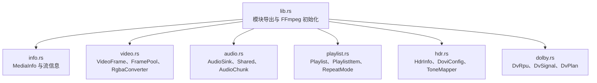
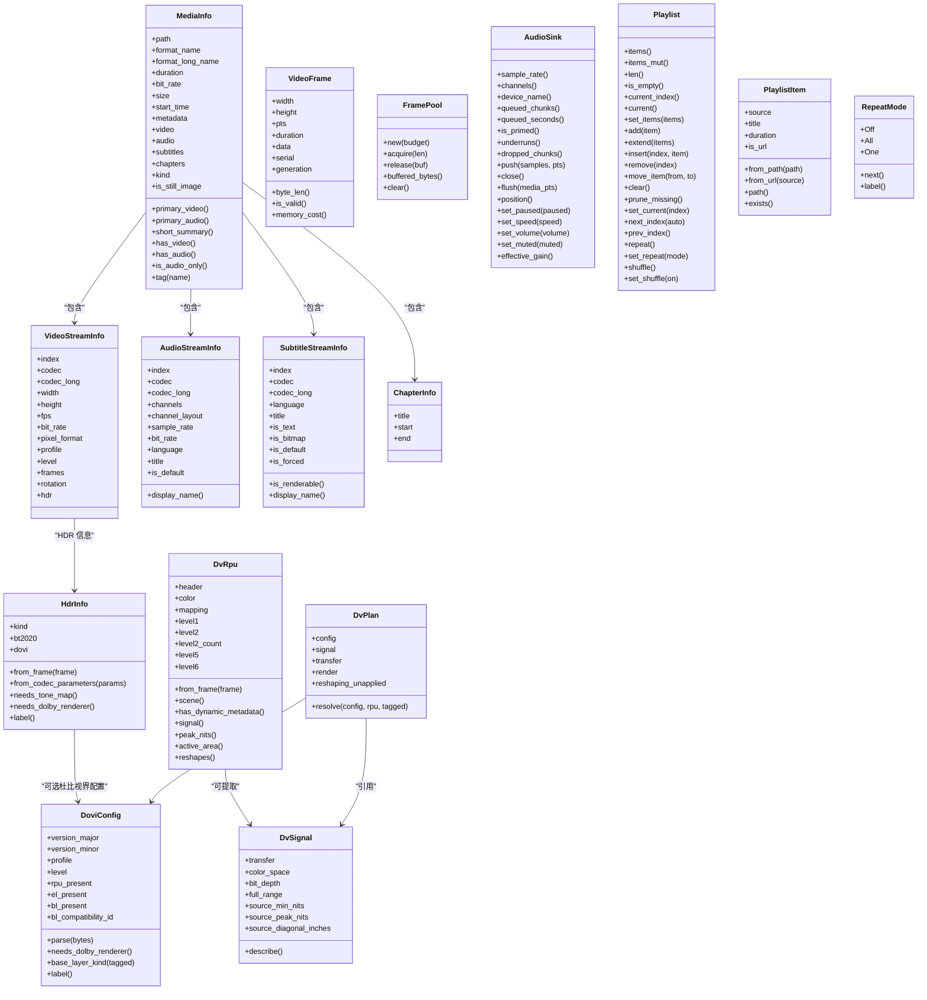
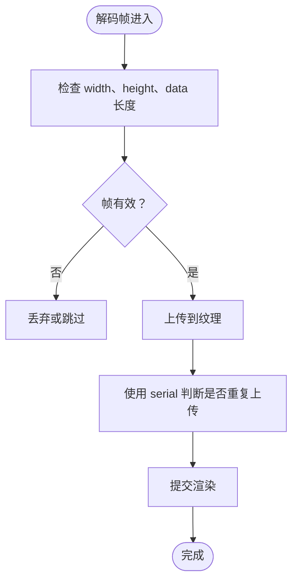
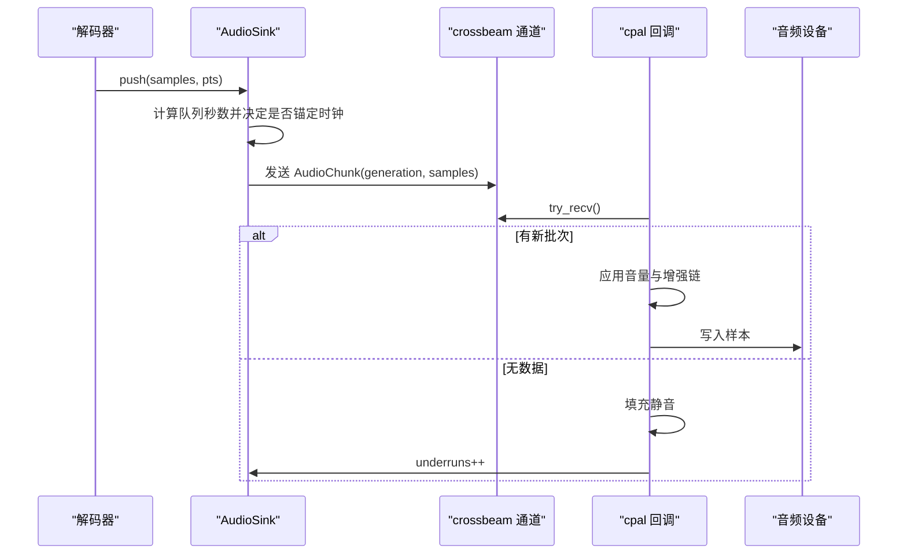
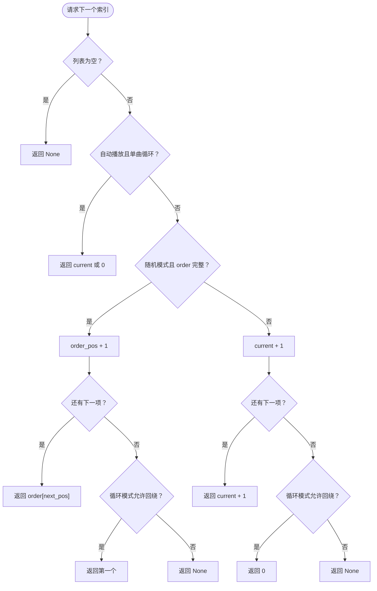
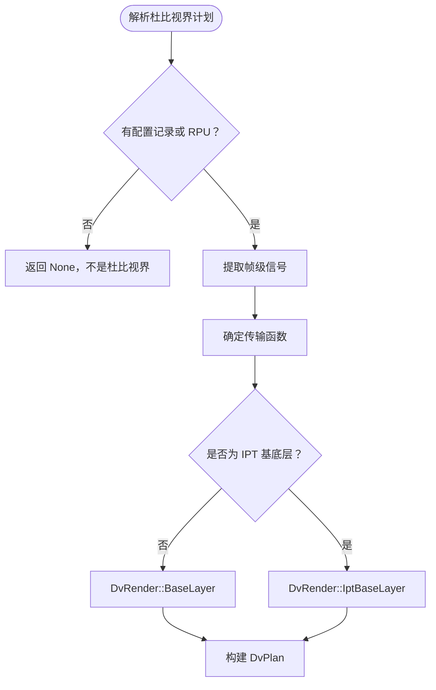
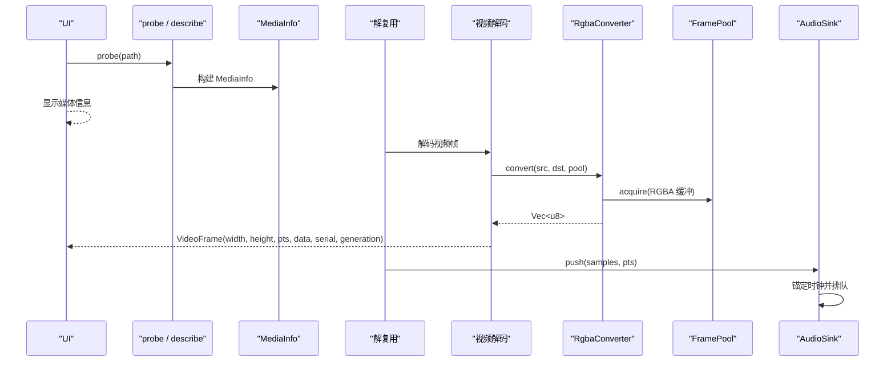
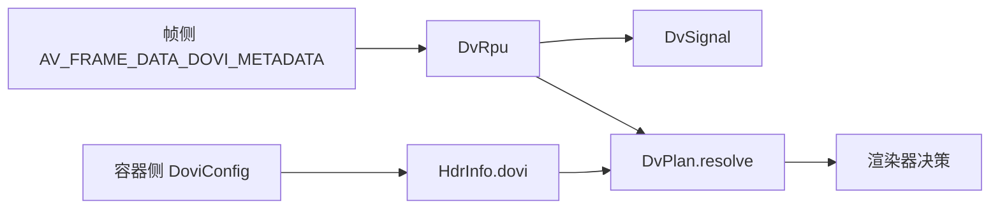

# 核心数据结构

<cite>
**本文引用的文件**   
- [info.rs](file://crates/mvp-core/src/info.rs)
- [video.rs](file://crates/mvp-core/src/video.rs)
- [audio.rs](file://crates/mvp-core/src/audio.rs)
- [playlist.rs](file://crates/mvp-core/src/playlist.rs)
- [hdr.rs](file://crates/mvp-core/src/hdr.rs)
- [dolby.rs](file://crates/mvp-core/src/dolby.rs)
- [lib.rs](file://crates/mvp-core/src/lib.rs)
</cite>

## 目录

1. [引言](#引言)
2. [项目结构](#项目结构)
3. [核心数据结构总览](#核心数据结构总览)
4. [媒体信息：MediaInfo 与流描述](#媒体信息mediainfo-与流描述)
5. [视频帧：VideoFrame、像素格式与纹理引用](#视频帧videoframe像素格式与纹理引用)
6. [音频缓冲区：AudioBuffer 与播放时钟](#音频缓冲区audiobuffer-与播放时钟)
7. [播放列表：Playlist、PlaylistItem 与 RepeatMode](#播放列表playlistplaylistitem-与-repeatmode)
8. [HDR 与杜比视界数据结构](#hdr-与杜比视界数据结构)
9. [依赖关系与数据流](#依赖关系与数据流)
10. [性能与内存安全](#性能与内存安全)
11. [故障排查](#故障排查)
12. [结论](#结论)

## 引言

本文聚焦 MVP-Versatile-Player 的 **核心数据结构**，目标是让读者在不深入渲染管线或 UI 代码的情况下，也能理解以下内容的完整语义：

- `MediaInfo` 如何描述一个媒体文件。
- 视频流、音频流、字幕流的元信息字段及其用途。
- `VideoFrame` 的视频帧结构：像素格式、尺寸、时间戳、RGBA 数据、序列号、生成代等。
- 音频输出侧的缓冲区组织方式、采样率、声道数、队列和时钟模型。
- `Playlist`、`PlaylistItem`、`RepeatMode` 的播放顺序控制。
- HDR 相关结构：`HdrInfo`、`DoviConfig`、`DvRpu`、`DvSignal`、`DvPlan` 等的职责和转换关系。
- 每个结构体的字段定义、生命周期管理、线程边界和内存安全考虑。

这些结构主要位于 `mvp-core` crate 中，由 `lib.rs` 统一暴露给上层播放器模块使用。

**章节来源**
- [lib.rs:1-43](file://crates/mvp-core/src/lib.rs#L1-L43)

## 项目结构

从“核心数据结构”的角度看，仓库中与本文相关的代码集中在 `crates/mvp-core/src`：

| 文件 | 主要职责 | 对应数据结构 |
|---|---|---|
| `info.rs` | 媒体探测、容器/流元信息、章节、语言名称 | `MediaInfo`、`VideoStreamInfo`、`AudioStreamInfo`、`SubtitleStreamInfo`、`ChapterInfo` |
| `video.rs` | 解码后的视频帧、RGBA 转换、帧缓冲池、杜比视界重塑状态 | `VideoFrame`、`FramePool`、`RgbaConverter`、`DvReshapeState` |
| `audio.rs` | 音频输出、设备回调、无锁队列、主时钟 | `AudioSink`、`Shared`、`AudioChunk` |
| `playlist.rs` | 播放列表模型、M3U/PLS 解析、自然排序 | `Playlist`、`PlaylistItem`、`RepeatMode` |
| `hdr.rs` | HDR 类型、杜比视界配置记录、色调映射器 | `HdrKind`、`DoviConfig`、`HdrInfo`、`ToneMapper` |
| `dolby.rs` | 杜比视界 RPU、信号描述、映射摘要、渲染计划 | `DvRpu`、`DvSignal`、`DvPlan`、`DvRender`、`DvColorSpace` |
| `lib.rs` | 模块导出、FFmpeg 初始化、公共 API 入口 | 所有核心结构的对外暴露 |

**图表来源**
- [lib.rs:19-43](file://crates/mvp-core/src/lib.rs#L19-L43)

**章节来源**
- [lib.rs:1-43](file://crates/mvp-core/src/lib.rs#L1-L43)

## 核心数据结构总览

下面用一张类图把本文重点的结构体串联起来。图中只展示与“核心数据结构”直接相关的字段和方法，不展开底层 FFmpeg 指针细节。

**图表来源**
- [info.rs:20-176](file://crates/mvp-core/src/info.rs#L20-L176)
- [video.rs:18-55](file://crates/mvp-core/src/video.rs#L18-L55)
- [audio.rs:76-162](file://crates/mvp-core/src/audio.rs#L76-L162)
- [playlist.rs:12-114](file://crates/mvp-core/src/playlist.rs#L12-L114)
- [hdr.rs:30-173](file://crates/mvp-core/src/hdr.rs#L30-L173)
- [dolby.rs:117-503](file://crates/mvp-core/src/dolby.rs#L117-L503)
- [dolby.rs:710-798](file://crates/mvp-core/src/dolby.rs#L710-L798)

## 媒体信息：MediaInfo 与流描述

### MediaInfo：单个媒体文件的完整描述

`MediaInfo` 是 UI 和引擎在“不解码任何一帧”的前提下构建的文件级描述对象。它负责聚合容器级别信息和各轨道信息。

| 字段 | 类型 | 含义 | 生命周期与注意事项 |
|---|---|---|---|
| `path` | `PathBuf` | 被探测的路径或 URL | 克隆成本较低，但路径可能很长；适合值语义传递。 |
| `format_name` | `String` | 容器短名，例如 `matroska,webm` | 来自 FFmpeg 容器描述，仅用于显示和分类。 |
| `format_long_name` | `String` | 容器长名，例如 `Matroska / WebM` | 同上。 |
| `duration` | `f64` | 总时长秒数；未知时为 `0.0` | 直播流可能为 `0.0`。 |
| `bit_rate` | `u64` | 整体比特率；未知时为 `0` | 不是每帧稳定值，仅用于概览。 |
| `size` | `u64` | 文件大小字节数；网络流可能为 `0` | 通过文件系统元信息获取。 |
| `start_time` | `f64` | 呈现起始偏移秒数 | 某些流可能有非零起始时间。 |
| `metadata` | `Vec<(String, String)>` | 容器级元数据键值对 | 已按 key 排序，查找时忽略大小写并去除空白。 |
| `video` | `Vec<VideoStreamInfo>` | 视频流列表，通常只有一个 | 静态元信息，不含像素数据。 |
| `audio` | `Vec<AudioStreamInfo>` | 音频流列表 | 静态元信息。 |
| `subtitles` | `Vec<SubtitleStreamInfo>` | 字幕流列表 | 静态元信息。 |
| `chapters` | `Vec<ChapterInfo>` | 章节标记 | 起止时间以秒表示。 |
| `kind` | `MediaKind` | 播放器应如何处理该文件 | 视频、音频、图像、播放列表等分类。 |
| `is_still_image` | `bool` | 是否为单张静态图片 | 图片不会推进时间轴。 |

常用方法：

| 方法 | 行为 |
|---|---|
| `primary_video()` | 返回第一个视频流，若存在。 |
| `primary_audio()` | 返回第一个音频流，若存在。 |
| `short_summary()` | 生成简短一行摘要，例如分辨率、帧率、编码。 |
| `has_video()` | 判断是否携带动态视频。 |
| `has_audio()` | 判断是否携带音频。 |
| `is_audio_only()` | 判断是否只有声音而没有动态视频。 |
| `tag(name)` | 按名称查找容器元数据，忽略大小写且空值视为未设置。 |

**章节来源**
- [info.rs:145-237](file://crates/mvp-core/src/info.rs#L145-L237)

### VideoStreamInfo：视频流详细信息

`VideoStreamInfo` 描述一个视频轨道的静态属性，不包含实际像素数据。

| 字段 | 类型 | 含义 |
|---|---|---|
| `index` | `usize` | 容器中的轨道索引。 |
| `codec` | `String` | 短编码名，例如 `h264`。 |
| `codec_long` | `String` | 长编码描述。 |
| `width` | `u32` | 编码宽度。 |
| `height` | `u32` | 编码高度。 |
| `fps` | `f64` | 标称帧率；未知时为 `0.0`。 |
| `bit_rate` | `u64` | 声明比特率；未知时为 `0`。 |
| `pixel_format` | `String` | 像素格式名称，例如 `yuv420p`。 |
| `profile` | `String` | 编码 profile。 |
| `level` | `i32` | 编码 level。 |
| `frames` | `i64` | 容器已知时的总帧数。 |
| `rotation` | `i32` | 从元数据读取的旋转角度。 |
| `hdr` | `HdrInfo` | 动态范围与杜比视界信息。 |

注意：`pixel_format` 是探测阶段得到的字符串名称，不是运行时像素缓冲区格式；实际像素格式会在解码后由 `ffmpeg::frame::Video` 提供。

**章节来源**
- [info.rs:20-50](file://crates/mvp-core/src/info.rs#L20-L50)

### AudioStreamInfo：音频流详细信息

`AudioStreamInfo` 描述一个音频轨道的静态属性。

| 字段 | 类型 | 含义 |
|---|---|---|
| `index` | `usize` | 容器中的轨道索引。 |
| `codec` | `String` | 短编码名，例如 `aac`。 |
| `codec_long` | `String` | 长编码描述。 |
| `channels` | `u16` | 声道数量。 |
| `channel_layout` | `String` | 声道布局描述，例如 `stereo` 或 `5.1`。 |
| `sample_rate` | `u32` | 采样率，单位 Hz。 |
| `bit_rate` | `u64` | 声明比特率；未知时为 `0`。 |
| `language` | `Option<String>` | ISO-639 语言标签。 |
| `title` | `Option<String>` | 人类可读轨道标题。 |
| `is_default` | `bool` | 是否为容器默认轨道。 |

常用方法：

| 方法 | 行为 |
|---|---|
| `display_name()` | 生成菜单显示名，优先使用标题和语言，否则回退到编码和声道数。 |

**章节来源**
- [info.rs:52-87](file://crates/mvp-core/src/info.rs#L52-L87)

### SubtitleStreamInfo：字幕流详细信息

`SubtitleStreamInfo` 描述字幕轨道，并区分文本字幕和图形字幕。

| 字段 | 类型 | 含义 |
|---|---|---|
| `index` | `usize` | 容器中的轨道索引。 |
| `codec` | `String` | 短编码名，例如 `subrip`。 |
| `codec_long` | `String` | 长编码描述。 |
| `language` | `Option<String>` | ISO-639 语言标签。 |
| `title` | `Option<String>` | 人类可读轨道标题。 |
| `is_text` | `bool` | 是否为可渲染为文本的字幕编码。 |
| `is_bitmap` | `bool` | 是否为可渲染为位图覆盖的字幕编码。 |
| `is_default` | `bool` | 是否为容器默认轨道。 |
| `is_forced` | `bool` | 是否为强制轨道。 |

常用方法：

| 方法 | 行为 |
|---|---|
| `is_renderable()` | 判断播放器是否能绘制该轨道：文本或图形字幕均可。 |
| `display_name()` | 生成菜单显示名，优先标题和语言，否则回退到轨道编号。 |

**章节来源**
- [info.rs:89-132](file://crates/mvp-core/src/info.rs#L89-L132)

### ChapterInfo：章节标记

| 字段 | 类型 | 含义 |
|---|---|---|
| `title` | `String` | 章节标题，缺失时使用 `Chapter N` 风格回退。 |
| `start` | `f64` | 起始时间秒。 |
| `end` | `f64` | 结束时间秒。 |

**章节来源**
- [info.rs:134-143](file://crates/mvp-core/src/info.rs#L134-L143)

## 视频帧：VideoFrame、像素格式与纹理引用

### VideoFrame：解码后可显示的视频帧

`VideoFrame` 是解码完成后交给渲染层的数据载体。它的像素数据已经是紧密排列的 8-bit RGBA，可以直接上传到 GPU 纹理。

| 字段 | 类型 | 含义 |
|---|---|---|
| `width` | `u32` | 像素宽度，已经缩放到目标尺寸。 |
| `height` | `u32` | 像素高度。 |
| `pts` | `f64` | 呈现时间戳，单位秒。 |
| `duration` | `f64` | 标称显示时长；未知时为 `0.0`。 |
| `data` | `Vec<u8>` | 紧密排列的 RGBA8，大小为 `width * height * 4` 字节，无填充。 |
| `serial` | `u64` | 单调递增帧序号，用于跳过冗余上传。 |
| `generation` | `u64` | 产生该帧的解码会话代数；seek 后旧代数的帧会被丢弃。 |

关键方法：

| 方法 | 行为 |
|---|---|
| `byte_len()` | 返回像素缓冲占用字节数。 |
| `is_valid()` | 判断帧是否有可用像素：宽高大于零且 `data` 足够大。 |
| `memory_cost()` | 估算内存占用，用于队列预算。 |

#### 像素格式说明

`VideoFrame.data` 固定为 RGBA8，因此它本身不再保存原始像素格式。原始像素格式（例如 YUV420P、NV12、PQ/HLG 色彩空间）出现在两个地方：

1. 探测阶段的 `VideoStreamInfo.pixel_format`：这是 FFmpeg 提供的像素格式名称字符串。
2. 解码阶段的 `ffmpeg::frame::Video`：由 `RgbaConverter.convert` 处理，最终转换为 RGBA8。

#### 时间戳与纹理引用

- `pts` 是媒体时间戳，用于音视频同步和进度显示。
- `data` 是 CPU 侧的 RGBA 字节数组，不是 GPU 纹理句柄。
- `serial` 可用于 UI 层判断是否需要重新上传纹理。
- `generation` 用于在 seek 后丢弃旧解码会话产生的帧。

**图表来源**
- [video.rs:18-55](file://crates/mvp-core/src/video.rs#L18-L55)

**章节来源**
- [video.rs:18-55](file://crates/mvp-core/src/video.rs#L18-L55)

### FramePool：帧缓冲池

`FramePool` 是一个有上限的 RGBA 字节缓冲回收池。视频帧可能达到几 MB，频繁分配会显著影响性能，因此这里采用“最佳适配”策略复用已有缓冲。

| 方法 | 行为 |
|---|---|
| `new(budget)` | 创建缓冲池，限制空闲缓冲总字节数。 |
| `acquire(len)` | 获取至少 `len` 字节的缓冲；内容未初始化，调用方必须完全覆盖。 |
| `release(buf)` | 归还缓冲；超出预算或过大缓冲直接丢弃。 |
| `buffered_bytes()` | 当前池中空闲缓冲总字节数。 |
| `clear()` | 停止播放时清空所有空闲缓冲。 |

设计要点：

- 使用 `parking_lot::Mutex` 保护空闲缓冲列表。
- `acquire` 选择“最小足够大”的缓冲，避免用 4K 缓冲渲染缩略图。
- `release` 最多保留 24 个空闲缓冲，防止无限增长。
- 归还前检查容量，避免缓存超大缓冲。

**章节来源**
- [video.rs:57-142](file://crates/mvp-core/src/video.rs#L57-L142)

### RgbaConverter：颜色转换与色调映射

`RgbaConverter` 负责将任意 FFmpeg 像素格式转换为 RGBA8，并支持：

- 缩放。
- 色彩空间转换。
- HDR → SDR 色调映射。
- 杜比视界重塑（默认关闭）。
- 场景峰值平滑。
- 多线程色调映射分带。

关键方法：

| 方法 | 行为 |
|---|---|
| `convert(src, dst_width, dst_height, pool)` | 将解码帧转换为 RGBA8，缓冲来自 `FramePool`。 |
| `set_dovi_config(config)` | 设置容器的杜比视界配置记录。 |
| `set_tone_map(enabled)` | 开启或关闭 HDR → SDR 色调映射。 |
| `set_dv_reshape(enabled)` | 开启或关闭杜比视界重塑。 |
| `dv_reshape_state()` | 返回当前帧的杜比视界重塑状态。 |
| `last_tone_map_ms()` | 上次转换中色调映射耗时毫秒数。 |

**章节来源**
- [video.rs:548-706](file://crates/mvp-core/src/video.rs#L548-L706)
- [video.rs:714-749](file://crates/mvp-core/src/video.rs#L714-L749)

## 音频缓冲区：AudioBuffer 与播放时钟

本项目没有名为 `AudioBuffer` 的公开结构体。音频缓冲区的相关概念由以下结构共同表达：

- `AudioChunk`：一次解码源帧重采样到设备采样率后的交错样本批次。
- `AudioSink`：音频输出句柄，持有设备流、发送通道、共享状态和设备参数。
- `Shared`：跨线程共享的原子状态，包括时钟锚点、音量、速度、暂停状态等。

### AudioChunk：音频批次

| 字段 | 类型 | 含义 |
|---|---|---|
| `generation` | `u64` | 所属 flush 代数，用于 seek 后丢弃旧数据。 |
| `samples` | `Vec<f32>` | 交错浮点样本。 |

### AudioSink：音频输出句柄

| 方法 | 返回值/行为 |
|---|---|
| `sample_rate()` | 打开设备的采样率。 |
| `channels()` | 打开设备的声道数。 |
| `device_name()` | 设备友好名称。 |
| `queued_chunks()` | 等待播放的批次数量。 |
| `queued_seconds()` | 队列中音频秒数。 |
| `is_primed()` | 是否已经有真实样本到达设备。 |
| `underruns()` | 设备缺音次数。 |
| `dropped_chunks()` | 因队列满而丢弃的批次数量。 |
| `push(samples, pts)` | 推送交错 f32 样本和首个样本 PTS。 |
| `close()` | 停止接受新音频。 |
| `flush(media_pts)` | 清空队列并重新锚定时钟。 |
| `position()` | 当前媒体位置秒数。 |
| `set_paused(paused)` | 暂停或恢复设备。 |
| `set_speed(speed)` | 设置播放速度。 |
| `set_volume(volume)` | 设置线性音量。 |
| `set_muted(muted)` | 静音开关。 |
| `effective_gain()` | 实际增益：音量乘以静音结果。 |

### Shared：实时线程共享状态

`Shared` 使用原子变量保证实时音频回调可以无锁读取音量、静音、速度、时钟锚点等状态。

关键字段：

| 字段 | 含义 |
|---|---|
| `played` | 自上次 flush 以来交给设备的帧数，仅统计。 |
| `anchored` | 是否已建立时钟锚点。 |
| `anchor_pts` | 锚点对应的媒体 PTS。 |
| `anchor_ns` | 锚点的纳秒时间。 |
| `chunk_frames` | 最近一批样本对应的帧数。 |
| `speed` | 播放速度。 |
| `volume` | 线性音量。 |
| `muted` | 静音标志。 |
| `flush_generation` | flush 代数，seek 时递增。 |
| `dropped` | 丢包计数。 |
| `underruns` | 欠载计数。 |
| `primed` | 是否已输出过真实样本。 |
| `paused` | 是否暂停。 |
| `paused_at_ns` | 暂停开始时间。 |
| `closing` | 是否正在关闭。 |

### 音频时钟模型

音频时钟不是简单累加“已写入样本数”，因为驱动可能一次性吞掉多秒音频，也可能延迟播放。系统使用：

1. 第一次 `push` 时建立锚点：`anchor_pts` 是即将听到的媒体时间。
2. 每次回调读取 `anchor_ns` 和当前时间差，计算经过时间。
3. 根据 `speed` 推算当前位置。
4. 如果 PTS 与估计位置偏差超过阈值，则重新锚定。
5. `flush` 会递增 `flush_generation`，回调看到不同代数后清空部分批次和队列。

**图表来源**
- [audio.rs:519-575](file://crates/mvp-core/src/audio.rs#L519-L575)
- [audio.rs:356-461](file://crates/mvp-core/src/audio.rs#L356-L461)

**章节来源**
- [audio.rs:66-116](file://crates/mvp-core/src/audio.rs#L66-L116)
- [audio.rs:153-170](file://crates/mvp-core/src/audio.rs#L153-L170)
- [audio.rs:172-318](file://crates/mvp-core/src/audio.rs#L172-L318)
- [audio.rs:320-461](file://crates/mvp-core/src/audio.rs#L320-L461)
- [audio.rs:463-696](file://crates/mvp-core/src/audio.rs#L463-L696)

## 播放列表：Playlist、PlaylistItem 与 RepeatMode

### RepeatMode：循环模式

| 枚举值 | 含义 | OSD 标签 |
|---|---|---|
| `Off` | 列表结束时停止。 | “不循环” |
| `All` | 回到第一个条目。 | “列表循环” |
| `One` | 永远重复当前条目。 | “单曲循环” |

常用方法：

| 方法 | 行为 |
|---|---|
| `next()` | 按 `Off → All → One → Off` 切换。 |
| `label()` | 返回 OSD 短标签。 |

**章节来源**
- [playlist.rs:12-42](file://crates/mvp-core/src/playlist.rs#L12-L42)

### PlaylistItem：播放列表项

| 字段 | 类型 | 含义 |
|---|---|---|
| `source` | `String` | 文件或 URL。 |
| `title` | `String` | 显示标题，回退到文件名。 |
| `duration` | `Option<f64>` | 已知时长秒数。 |
| `is_url` | `bool` | 是否为网络 URL。 |

构造方法：

| 方法 | 行为 |
|---|---|
| `from_path(path)` | 从本地路径构造，推断标题。 |
| `from_url(source)` | 从 URL 构造，标题取自最后一段路径。 |
| `path()` | 返回本地路径形式。 |
| `exists()` | 检查本地文件是否存在；URL 始终返回 true。 |

**章节来源**
- [playlist.rs:44-99](file://crates/mvp-core/src/playlist.rs#L44-L99)

### Playlist：播放列表

`Playlist` 维护有序条目、当前播放项、循环模式、随机模式和播放顺序。

关键字段：

| 字段 | 类型 | 含义 |
|---|---|---|
| `items` | `Vec<PlaylistItem>` | 播放列表条目。 |
| `current` | `Option<usize>` | 当前播放项索引。 |
| `repeat` | `RepeatMode` | 循环模式。 |
| `shuffle` | `bool` | 是否随机。 |
| `order` | `Vec<usize>` | 随机模式下的播放顺序。 |
| `order_pos` | `usize` | 当前在 `order` 中的位置。 |

常用方法：

| 方法 | 行为 |
|---|---|
| `items()` / `items_mut()` | 访问全部条目。 |
| `len()` / `is_empty()` | 列表长度和空判断。 |
| `current_index()` / `current()` | 当前播放项。 |
| `set_items(items)` | 替换整个列表，保持停止状态。 |
| `add(item)` / `extend(items)` | 追加条目。 |
| `insert(index, item)` | 插入条目。 |
| `remove(index)` | 删除条目，尽量保持 current 指向同一文件。 |
| `move_item(from, to)` | 拖拽移动条目。 |
| `clear()` | 清空列表并停止。 |
| `prune_missing()` | 删除磁盘上已消失的条目。 |
| `set_current(index)` | 标记某个索引为当前项。 |
| `next_index(auto)` | 计算下一个播放索引。 |
| `prev_index()` | 计算上一个播放索引。 |
| `repeat()` / `set_repeat(mode)` | 查询和设置循环模式。 |
| `shuffle()` / `set_shuffle(on)` | 查询和设置随机模式。 |

#### next_index 的控制逻辑

**图表来源**
- [playlist.rs:260-291](file://crates/mvp-core/src/playlist.rs#L260-L291)

**章节来源**
- [playlist.rs:101-380](file://crates/mvp-core/src/playlist.rs#L101-L380)

## HDR 与杜比视界数据结构

### HdrKind：传输函数类型

| 枚举值 | 含义 |
|---|---|
| `Sdr` | 标准动态范围。 |
| `Pq` | PQ，即 BT.2100 PQ / SMPTE ST 2084，HDR10 和杜比视界基底层常用。 |
| `Hlg` | HLG，Hybrid Log-Gamma。 |

常用方法：

| 方法 | 行为 |
|---|---|
| `is_hdr()` | 判断是否需要色调映射才能在 SDR 显示器上正确显示。 |
| `label()` | 返回信息面板短标签。 |

**章节来源**
- [hdr.rs:30-58](file://crates/mvp-core/src/hdr.rs#L30-L58)

### DoviConfig：杜比视界配置记录

`DoviConfig` 是从容器侧数据读出的九字节杜比视界配置记录。

| 字段 | 类型 | 含义 |
|---|---|---|
| `version_major` | `u8` | 规范主版本。 |
| `version_minor` | `u8` | 规范次版本。 |
| `profile` | `u8` | 杜比视界 profile。 |
| `level` | `u8` | 杜比视界 level。 |
| `rpu_present` | `bool` | 是否携带参考画面单元。 |
| `el_present` | `bool` | 是否携带增强层。 |
| `bl_present` | `bool` | 基底层是否可用。 |
| `bl_compatibility_id` | `u8` | 基底层兼容标识：0 无、1 HDR10、2 SDR、4 HLG、6 蓝光 HDR10。 |

常用方法：

| 方法 | 行为 |
|---|---|
| `parse(bytes)` | 解析九字节记录，长度不足返回 None。 |
| `needs_dolby_renderer()` | Profile 5 需要杜比视界专用渲染器。 |
| `base_layer_kind(tagged)` | 根据兼容性 ID 决定基底层传输函数。 |
| `label()` | 生成人类可读摘要。 |

**章节来源**
- [hdr.rs:60-162](file://crates/mvp-core/src/hdr.rs#L60-L162)

### HdrInfo：动态范围信息

`HdrInfo` 是渲染器需要的流级动态范围描述。

| 字段 | 类型 | 含义 |
|---|---|---|
| `kind` | `HdrKind` | 传输函数。 |
| `bt2020` | `bool` | 是否使用 BT.2020 色域。 |
| `dovi` | `Option<DoviConfig>` | 杜比视界配置记录。 |

常用方法：

| 方法 | 行为 |
|---|---|
| `from_frame(frame)` | 从解码帧的颜色特性读取。 |
| `from_codec_parameters(params)` | 从编解码参数读取，包括杜比视界配置记录。 |
| `needs_tone_map()` | 判断是否需要色调映射。 |
| `needs_dolby_renderer()` | 判断是否需要杜比视界渲染器。 |
| `label()` | 生成信息面板标签。 |

**章节来源**
- [hdr.rs:164-271](file://crates/mvp-core/src/hdr.rs#L164-L271)

### ToneMapper：色调映射器

`ToneMapper` 将 HDR 帧拉回 SDR 显示范围。它使用预计算表实现高效逐像素映射：

- `to_linear`：8-bit 码值 → 线性光。
- `gain`：线性亮度 → 压缩因子。
- `encode`：线性显示光 → 8-bit sRGB/BT.709 码值。
- `shoulder`：高光软肩参数。
- `scene_peak`：动态元数据的目标峰值。

常用方法：

| 方法 | 行为 |
|---|---|
| `new(info)` | 为整条流构建 mapper。 |
| `with_scene_peak(info, scene_peak_nits)` | 针对杜比视界场景峰值构建 mapper。 |
| `apply(rgba)` | 原地对 RGBA8 缓冲区进行色调映射。 |
| `is_identity()` | 判断是否不需要映射。 |
| `scene_peak_nits()` | 返回目标场景峰值。 |
| `shoulder()` | 返回软肩参数。 |
| `info()` | 返回构建时使用的 HDR 信息。 |

**章节来源**
- [hdr.rs:344-495](file://crates/mvp-core/src/hdr.rs#L344-L495)

### DvRpu：杜比视界参考画面单元

`DvRpu` 是帧级杜比视界元数据，包含头、颜色元数据、映射、Level 1/2/5/6 扩展块等。

关键字段：

| 字段 | 类型 | 含义 |
|---|---|---|
| `header` | `Option<DvRpuHeader>` | RPU 头。 |
| `color` | `Option<DvColorMetadata>` | 颜色元数据。 |
| `mapping` | `Option<DvMappingSummary>` | 重塑映射摘要。 |
| `level1` | `Option<DoviLevel1>` | 帧级亮度范围。 |
| `level2` | `Option<DoviLevel2>` | 目标显示器修剪。 |
| `level2_count` | `u8` | Level 2 块数量。 |
| `level5` | `Option<DoviLevel5>` | 活动区域。 |
| `level6` | `Option<DoviLevel6>` | 静态母版元数据。 |

常用方法：

| 方法 | 行为 |
|---|---|
| `from_frame(frame)` | 从解码帧的 side data 中读取 RPU。 |
| `scene()` | 从 Level 1 解码出场景明暗范围。 |
| `has_dynamic_metadata()` | 判断是否携带动态元数据。 |
| `signal()` | 提取 `DvSignal`。 |
| `peak_nits()` | 返回最亮样本尼特值。 |
| `active_area()` | 返回活动区域。 |
| `reshapes()` | 判断基底层是否需要重塑。 |

**章节来源**
- [dolby.rs:478-708](file://crates/mvp-core/src/dolby.rs#L478-L708)

### DvSignal：杜比视界信号描述

`DvSignal` 描述 RPU 认为解码像素是什么。

| 字段 | 类型 | 含义 |
|---|---|---|
| `transfer` | `Option<HdrKind>` | 传输函数，可能为 None。 |
| `color_space` | `DvColorSpace` | 基底层像素空间：YCbCr 或 IPT。 |
| `bit_depth` | `u8` | 信号位深。 |
| `full_range` | `bool` | 是否全范围。 |
| `source_min_nits` | `Option<f32>` | 母版最暗尼特值。 |
| `source_peak_nits` | `Option<f32>` | 母版最亮尼特值。 |
| `source_diagonal_inches` | `Option<u16>` | 母版显示器对角线英寸。 |

常用方法：

| 方法 | 行为 |
|---|---|
| `describe()` | 生成信息面板描述行。 |

**章节来源**
- [dolby.rs:399-459](file://crates/mvp-core/src/dolby.rs#L399-L459)

### DvPlan：杜比视界渲染计划

`DvPlan` 是播放器决策中心，决定一个杜比视界文件应该如何处理。

| 字段 | 类型 | 含义 |
|---|---|---|
| `config` | `Option<DoviConfig>` | 容器配置记录。 |
| `signal` | `Option<DvSignal>` | 帧级信号描述。 |
| `transfer` | `HdrKind` | 基底层传输函数。 |
| `render` | `DvRender` | 渲染类型：单层基底层、IPT 基底层或未知。 |
| `reshaping_unapplied` | `bool` | 是否描述了重塑但未应用。 |

常用方法：

| 方法 | 行为 |
|---|---|
| `resolve(config, rpu, tagged)` | 根据容器记录、帧 RPU 和标签决定渲染计划。 |

决策优先级：

1. 帧级 RPU 是最具体声明。
2. 容器配置记录次之。
3. 标签是最后手段。
4. Profile 5 的 IPT 基底层无法被普通 BT.2020 解码器正确显示。

**图表来源**
- [dolby.rs:756-798](file://crates/mvp-core/src/dolby.rs#L756-L798)

**章节来源**
- [dolby.rs:710-798](file://crates/mvp-core/src/dolby.rs#L710-L798)

## 依赖关系与数据流

### 媒体探测到播放的整体数据流

**图表来源**
- [info.rs:288-473](file://crates/mvp-core/src/info.rs#L288-L473)
- [video.rs:687-706](file://crates/mvp-core/src/video.rs#L687-L706)
- [audio.rs:519-575](file://crates/mvp-core/src/audio.rs#L519-L575)

### 杜比视界数据结构转换关系

**图表来源**
- [hdr.rs:186-223](file://crates/mvp-core/src/hdr.rs#L186-L223)
- [dolby.rs:505-537](file://crates/mvp-core/src/dolby.rs#L505-L537)
- [dolby.rs:756-798](file://crates/mvp-core/src/dolby.rs#L756-L798)

## 性能与内存安全

### 性能特征

| 组件 | 性能特点 |
|---|---|
| `MediaInfo` | 探测不解码帧，适合 UI 线程快速响应。 |
| `FramePool` | 复用 RGBA 缓冲，避免每帧分配。 |
| `RgbaConverter` | 缓存 `SwsContext`，只在几何或格式变化时重建。 |
| 色调映射 | 使用查表和近似曲线，CPU 可承受；支持分带并行。 |
| `AudioSink` | 实时回调使用无锁原子和 bounded channel，避免阻塞。 |
| `Playlist` | 随机顺序使用 Fisher–Yates 变体，种子来自系统时间。 |

### 内存安全考虑

| 结构 | 安全机制 |
|---|---|
| `VideoFrame.data` | 由 `Vec<u8>` 管理，`is_valid` 检查长度。 |
| `FramePool` | 使用 `Mutex` 保护空闲缓冲列表，限制总字节数。 |
| `AudioSink.Shared` | 所有共享状态使用原子类型，避免数据竞争。 |
| `DvRpu.parse` | 所有偏移都检查是否在 side data 范围内，拒绝越界。 |
| `DoviConfig.parse` | 要求至少 9 字节，截断记录直接拒绝。 |
| `RgbaConverter.prepare` | 检查帧尺寸、平面指针、像素格式，防止非法帧。 |
| `apply_reshape` | 检查 stride 和行跨度，防止读取其他平面内存。 |

### 生命周期管理

| 结构 | 生命周期 |
|---|---|
| `MediaInfo` | 探测阶段构建，可克隆，适合 UI 展示。 |
| `VideoFrame` | 解码后短暂持有，上传纹理后释放。 |
| `FramePool` | 随解码会话存在，停止播放时 clear。 |
| `AudioSink` | 随播放器生命周期存在，关闭时 stop stream。 |
| `Shared` | 通过 `Arc` 共享，关闭时标记 `closing`。 |
| `DvRpu` | 从帧 side data 临时解析，不长期持有原始指针。 |
| `DvPlan` | 决策结果，值类型，可克隆。 |

**章节来源**
- [video.rs:57-142](file://crates/mvp-core/src/video.rs#L57-L142)
- [video.rs:751-800](file://crates/mvp-core/src/video.rs#L751-L800)
- [audio.rs:27-116](file://crates/mvp-core/src/audio.rs#L27-L116)
- [audio.rs:519-602](file://crates/mvp-core/src/audio.rs#L519-L602)
- [dolby.rs:539-548](file://crates/mvp-core/src/dolby.rs#L539-L548)
- [hdr.rs:85-100](file://crates/mvp-core/src/hdr.rs#L85-L100)

## 故障排查

### 常见问题与定位建议

| 现象 | 可能原因 | 排查位置 |
|---|---|---|
| 视频画面灰白 | HDR 被当作 SDR 显示，或杜比视界基底层传输函数错误。 | `HdrInfo.kind`、`DoviConfig.base_layer_kind`、`DvPlan.transfer` |
| 杜比视界画面颜色异常 | Profile 5 的 IPT 基底层未被正确还原。 | `DviConfig.needs_dolby_renderer`、`DvSignal.color_space` |
| 杜比视界重塑未生效 | `dv_reshape` 默认关闭，或像素格式不支持重塑。 | `RgbaConverter.set_dv_reshape`、`DvReshapeState` |
| 音频卡顿或时钟漂移 | 设备默认采样率异常，或 PTS 不连续。 | `preferred_config`、`DISCONTINUITY_THRESHOLD`、`position()` |
| 音频无声 | 设备未 primed，或队列被关闭。 | `is_primed()`、`closed`、`underruns()` |
| 播放列表跳转后上一首残留 | flush 代数未更新或队列未清理。 | `flush_generation`、`AudioChunk.generation` |
| 播放列表随机播放顺序不稳定 | 随机种子来自系统时间，多次切换 shuffle 会重建顺序。 | `rebuild_order` |
| 视频帧无效 | 解码帧尺寸非法或缺少像素数据。 | `VideoFrame.is_valid`、`RgbaConverter.prepare` |

### 调试接口

| 接口 | 用途 |
|---|---|
| `AudioSink.underruns()` | 查看设备缺音次数。 |
| `AudioSink.dropped_chunks()` | 查看因队列满丢弃的批次。 |
| `AudioSink.queued_seconds()` | 查看队列深度秒数。 |
| `RgbaConverter.last_tone_map_ms()` | 查看色调映射耗时。 |
| `FramePool.buffered_bytes()` | 查看帧缓冲池占用。 |
| `MediaInfo.short_summary()` | 快速查看媒体摘要。 |
| `DvPlan.label()` / `DvRender.label()` | 查看杜比视界渲染计划描述。 |

**章节来源**
- [audio.rs:463-506](file://crates/mvp-core/src/audio.rs#L463-L506)
- [video.rs:677-681](file://crates/mvp-core/src/video.rs#L677-L681)
- [video.rs:132-141](file://crates/mvp-core/src/video.rs#L132-L141)
- [info.rs:189-207](file://crates/mvp-core/src/info.rs#L189-L207)
- [dolby.rs:724-732](file://crates/mvp-core/src/dolby.rs#L724-L732)

## 结论

MVP-Versatile-Player 的核心数据结构围绕“媒体描述、帧数据、音频输出、播放列表、HDR 与杜比视界”五个维度组织：

- `MediaInfo` 提供无解码的媒体概览。
- `VideoFrame` 承载解码后的 RGBA 帧，配合 `FramePool` 和 `RgbaConverter` 完成高效渲染。
- `AudioSink` 与 `Shared` 构成低延迟、时钟准确的音频输出模型。
- `Playlist`、`PlaylistItem`、`RepeatMode` 提供完整的播放顺序控制。
- `HdrInfo`、`DoviConfig`、`DvRpu`、`DvSignal`、`DvPlan` 共同解决 HDR 与杜比视界的识别、报告和渲染决策问题。

这些结构在设计上强调：

- 值语义优先，便于 UI 和引擎之间传递。
- 明确的生命周期和线程边界。
- 对 FFmpeg 原始指针的安全封装。
- 对损坏输入和异常数据的防御性处理。
- 对性能敏感路径的缓冲复用和近似优化。

对于后续扩展，最值得关注的方向包括：

- 将色调映射和杜比视界重塑迁移到 GPU shader。
- 完善增强层残差合成。
- 改进 Profile 5 的 IPT 基底层还原。
- 提供更细粒度的 HDR 元数据可视化。
- 继续强化音频时钟在极端驱动行为下的鲁棒性。