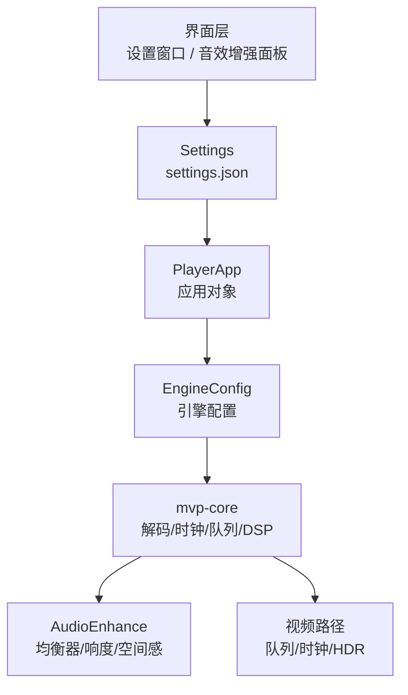
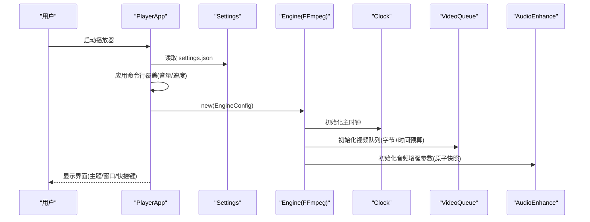
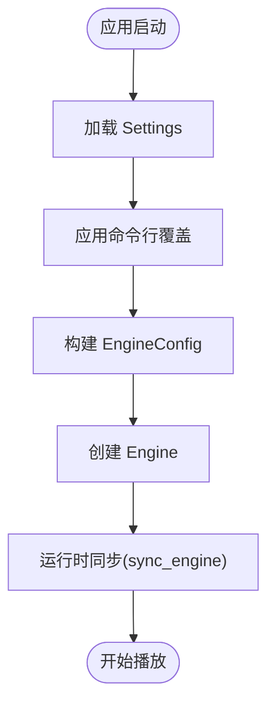
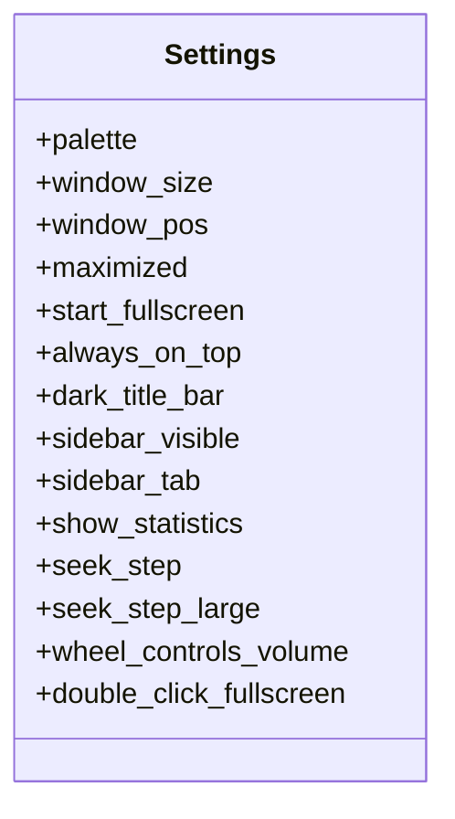
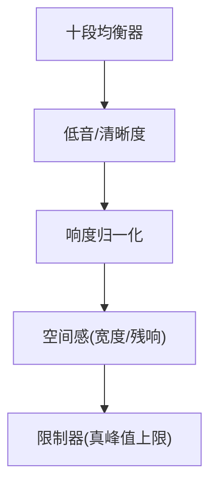
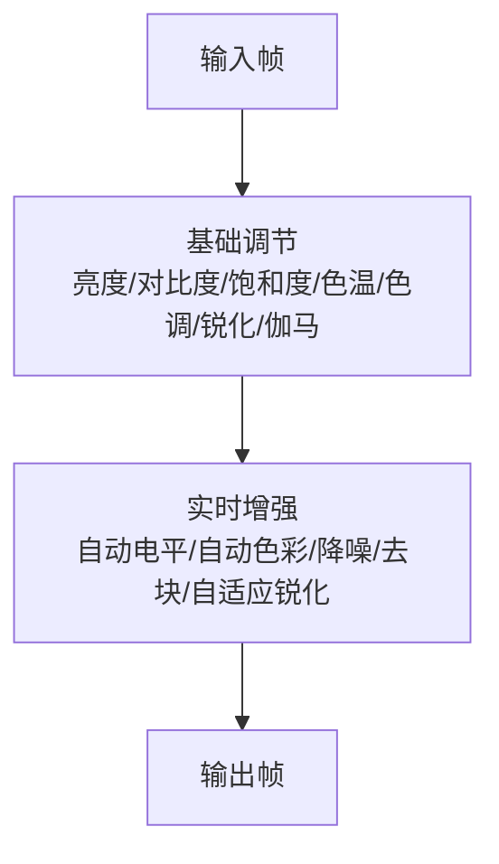
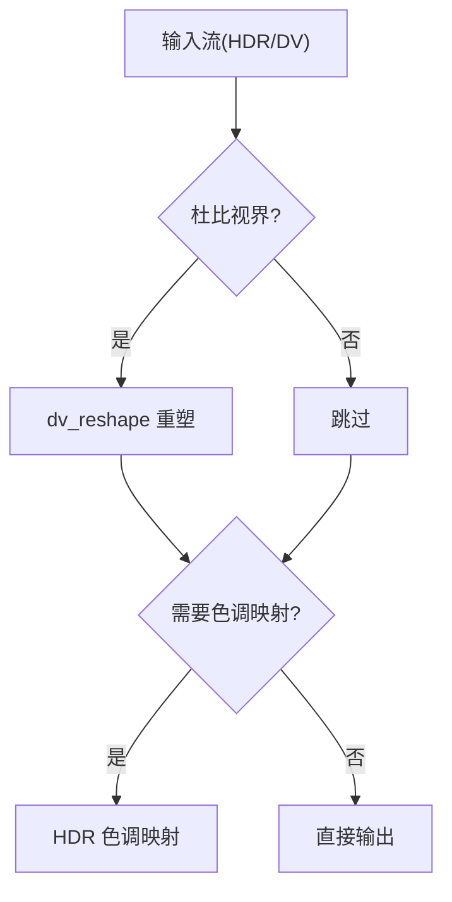
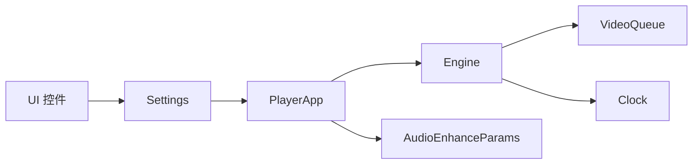

# 配置选项

<cite>
**本文引用的文件**   
- [settings.rs](file://crates/mvp-player/src/settings.rs)
- [app.rs](file://crates/mvp-player/src/app.rs)
- [audio_enhance.rs](file://crates/mvp-player/src/ui/audio_enhance.rs)
- [engine/workers.rs](file://crates/mvp-core/src/engine/workers.rs)
- [engine/queue.rs](file://crates/mvp-core/src/engine/queue.rs)
- [engine/clock.rs](file://crates/mvp-core/src/engine/clock.rs)
- [dsp.rs](file://crates/mvp-core/src/dsp.rs)
- [dsp/enhance.rs](file://crates/mvp-core/src/dsp/enhance.rs)
- [hdr.rs](file://crates/mvp-core/src/hdr.rs)
- [theme.rs](file://crates/mvp-player/src/theme.rs)
</cite>

## 目录
1. [简介](#简介)
2. [项目结构](#项目结构)
3. [核心组件](#核心组件)
4. [架构总览](#架构总览)
5. [详细组件分析](#详细组件分析)
6. [依赖关系分析](#依赖关系分析)
7. [性能与资源特性](#性能与资源特性)
8. [故障排查指南](#故障排查指南)
9. [结论](#结论)
10. [附录：配置参考表](#附录配置参考表)

## 简介
本文面向用户与开发者，系统化说明 MVP-Versatile-Player 的配置体系。内容覆盖：
- 引擎配置 EngineConfig：硬件解码、HDR 色调映射、杜比视界重塑、音频开关、音量、播放速度、自动播放等。
- 界面设置：主题、窗口行为、侧边栏、快捷键、画面比例、旋转与镜像、控制条行为等。
- 音效增强：十段均衡器、低音/清晰度提升、响度归一化、限制器、立体声宽度与空间残响。
- 画质调节：亮度、对比度、饱和度、色温、色调、锐化、伽马，以及实时增强（自动电平、自动色彩、降噪、去块、自适应锐化）。
- 配置文件格式、默认值、取值范围、校验规则、热重载与迁移策略。

## 项目结构
播放器将“用户持久化设置”与“运行时引擎配置”分层管理：
- 用户设置：保存在 settings.json，涵盖外观、播放、视频、图片、字幕、窗口、历史、快捷键等。
- 引擎配置：由应用启动时从用户设置派生，并随运行期操作同步到媒体引擎。
- DSP 参数：通过原子快照在 UI 线程与音频实时线程之间安全传递。

**图示来源**
- [settings.rs:596-772](file://crates/mvp-player/src/settings.rs#L596-L772)
- [app.rs:234-247](file://crates/mvp-player/src/app.rs#L234-L247)
- [dsp/enhance.rs:58-86](file://crates/mvp-core/src/dsp/enhance.rs#L58-L86)

**章节来源**
- [settings.rs:1-10](file://crates/mvp-player/src/settings.rs#L1-L10)
- [app.rs:1-26](file://crates/mvp-player/src/app.rs#L1-L26)

## 核心组件
- Settings：用户设置的持久化模型，包含主题、音频、播放、视频、图片、字幕、窗口、历史、快捷键等全部字段。
- PictureSettings：七项画面滑块（亮度、对比度、饱和度、色温、色调、锐化、伽马），支持按文件或全局记忆。
- EnhanceSettings：实时画面增强开关与强度，含自动电平、自动色彩、降噪、去块、自适应锐化。
- AudioEnhanceSettings：十段均衡器、低音/清晰度、响度目标、跟随速度、限制器上限、立体声宽度、空间残响。
- EngineConfig：传递给 mvp-core 的引擎配置，包括硬件解码、HDR 色调映射、杜比视界重塑、音频开关、设备、音量、速度、自动播放等。

**章节来源**
- [settings.rs:178-266](file://crates/mvp-player/src/settings.rs#L178-L266)
- [settings.rs:268-314](file://crates/mvp-player/src/settings.rs#L268-L314)
- [settings.rs:483-594](file://crates/mvp-player/src/settings.rs#L483-L594)
- [app.rs:234-247](file://crates/mvp-player/src/app.rs#L234-L247)

## 架构总览
引擎初始化与应用启动流程如下：

**图示来源**
- [app.rs:221-250](file://crates/mvp-player/src/app.rs#L221-L250)
- [engine/queue.rs:67-124](file://crates/mvp-core/src/engine/queue.rs#L67-L124)
- [engine/clock.rs:48-63](file://crates/mvp-core/src/engine/clock.rs#L48-L63)
- [dsp/enhance.rs:227-239](file://crates/mvp-core/src/dsp/enhance.rs#L227-L239)

## 详细组件分析

### 引擎配置 EngineConfig
EngineConfig 是媒体引擎的核心配置入口，决定解码、输出与时序行为。

- 关键参数
  - hardware_decoding：是否启用硬件解码。
  - hdr_tone_map：是否对 HDR(PQ/HLG)进行色调映射到 SDR。
  - dv_reshape：是否应用杜比视界 RPU 重塑（默认关闭，需用户知情选择）。
  - audio_enabled：是否启用音频输出。
  - audio_device：指定音频输出设备名称；None 使用系统默认。
  - volume：线性音量。
  - speed：播放速度。
  - autoplay：打开文件后是否自动播放。

- 默认值与来源
  - 多数字段来自 Settings，并在应用启动时构造 EngineConfig。
  - 部分行为受命令行覆盖（如音量、速度、自动播放）。

- 运行时同步
  - 应用可通过 sync_engine 将音量、静音、速度、音画延迟、循环、HDR 色调映射、杜比视界重塑等动态更新到引擎。

**图示来源**
- [app.rs:221-250](file://crates/mvp-player/src/app.rs#L221-L250)
- [app.rs:970-981](file://crates/mvp-player/src/app.rs#L970-L981)

**章节来源**
- [app.rs:234-247](file://crates/mvp-player/src/app.rs#L234-L247)
- [app.rs:970-981](file://crates/mvp-player/src/app.rs#L970-L981)

### 界面设置
- 主题选择
  - palette：界面调色板，启动时安装到 UI 框架，并在每次更改时重新安装。
- 窗口行为
  - window_size/window_pos/maximized/start_fullscreen/always_on_top/dark_title_bar/sidebar_visible/sidebar_tab/show_statistics。
- 快捷键绑定
  - seek_step/seek_step_large/wheel_controls_volume/double_click_fullscreen。
  - 快捷键帮助对话框列出常用键位与动作。

**图示来源**
- [settings.rs:596-772](file://crates/mvp-player/src/settings.rs#L596-L772)

**章节来源**
- [settings.rs:596-772](file://crates/mvp-player/src/settings.rs#L596-L772)
- [ui/dialogs.rs:106-147](file://crates/mvp-player/src/ui/dialogs.rs#L106-L147)

### 音效增强配置
- 十段均衡器
  - bands：每段增益(dB)，固定为 10 个频段，频率布局与 DSP 一致。
  - bandwidth：峰值频段的 Q 值。
  - preset：预设曲线（平直/温暖/明亮/人声/摇滚/低音增强/高音增强/流行/自定义）。
- 低音与清晰度
  - bass_db：低频提升(dB)。
  - bass_harmonics：二次谐波含量(0..=1)。
  - clarity_db：高频清晰度提升(dB)。
  - clarity_transient：瞬态增强(0..=1)。
- 响度与保护
  - loudness_db：响度目标(dBFS)，低于阈值表示关闭。
  - loudness_speed：跟随速度(秒)。
  - limiter_ceiling_db：真峰值限制上限(dBFS)。
- 空间感
  - width：立体声宽度(0..=2，1.0 为原样)。
  - room：空间残响(0..=1，0 为关闭)。

**图示来源**
- [dsp/enhance.rs:10-26](file://crates/mvp-core/src/dsp/enhance.rs#L10-L26)
- [settings.rs:483-594](file://crates/mvp-player/src/settings.rs#L483-L594)

**章节来源**
- [settings.rs:483-594](file://crates/mvp-player/src/settings.rs#L483-L594)
- [dsp/enhance.rs:58-138](file://crates/mvp-core/src/dsp/enhance.rs#L58-L138)
- [ui/audio_enhance.rs:127-238](file://crates/mvp-player/src/ui/audio_enhance.rs#L127-L238)

### 画质调节选项
- 基础画面滑块
  - brightness/contrast/saturation/temperature/tint/sharpness/gamma。
  - 默认值为“中性”，reset 可恢复默认。
  - clamp 确保所有值落在着色器预期范围内，NaN 会被处理。
- 实时增强
  - enabled/strength/auto_levels/auto_colour/denoise/deblock/sharpening。
  - 默认关闭，避免首次启动静默改变画面。
- 画面记忆
  - picture_scope：全局或按文件。
  - per_file_picture：最近使用的文件级覆盖，写入时会裁剪长度。

**图示来源**
- [settings.rs:178-266](file://crates/mvp-player/src/settings.rs#L178-L266)
- [settings.rs:268-314](file://crates/mvp-player/src/settings.rs#L268-L314)

**章节来源**
- [settings.rs:178-266](file://crates/mvp-player/src/settings.rs#L178-L266)
- [settings.rs:268-314](file://crates/mvp-player/src/settings.rs#L268-L314)

### HDR 与杜比视界
- hdr_tone_map：将 PQ/HLG 等高动态范围帧映射到 SDR 显示器。
- dv_reshape：根据 RPU 应用杜比视界重塑；默认关闭，因色度曲线未经完全验证，需用户明确开启。
- DoviConfig：解析 Dolby Vision 元数据，判断是否需要杜比渲染器。

**图示来源**
- [app.rs:234-247](file://crates/mvp-player/src/app.rs#L234-L247)
- [hdr.rs:63-100](file://crates/mvp-core/src/hdr.rs#L63-L100)

**章节来源**
- [app.rs:234-247](file://crates/mvp-player/src/app.rs#L234-L247)
- [hdr.rs:63-100](file://crates/mvp-core/src/hdr.rs#L63-L100)

## 依赖关系分析
- Settings 与 UI：UI 控件读写 Settings，并通过 store.mark_dirty() 触发保存。
- PlayerApp 与 Engine：应用负责构造 EngineConfig，并将运行期设置同步到引擎。
- DSP 参数：UI 修改 AudioEnhanceSettings，publish_audio_enhance 发布 Snapshot，音频实时线程通过原子快照读取。
- 队列与时钟：视频队列按字节与时间预算限制，时钟以音频设备为主参考，保证 A/V 同步。

**图示来源**
- [settings.rs:596-772](file://crates/mvp-player/src/settings.rs#L596-L772)
- [app.rs:970-981](file://crates/mvp-player/src/app.rs#L970-L981)
- [dsp/enhance.rs:206-239](file://crates/mvp-core/src/dsp/enhance.rs#L206-L239)
- [engine/queue.rs:67-124](file://crates/mvp-core/src/engine/queue.rs#L67-L124)
- [engine/clock.rs:48-63](file://crates/mvp-core/src/engine/clock.rs#L48-L63)

**章节来源**
- [settings.rs:596-772](file://crates/mvp-player/src/settings.rs#L596-L772)
- [app.rs:970-981](file://crates/mvp-player/src/app.rs#L970-L981)
- [dsp/enhance.rs:206-239](file://crates/mvp-core/src/dsp/enhance.rs#L206-L239)
- [engine/queue.rs:67-124](file://crates/mvp-core/src/engine/queue.rs#L67-L124)
- [engine/clock.rs:48-63](file://crates/mvp-core/src/engine/clock.rs#L48-L63)

## 性能与资源特性
- 视频队列
  - 按字节预算与最大帧数双重限制，防止高分辨率帧占用过多内存。
  - 可选时间预算，限制解码领先于播放头的媒体时长，减少跳转延迟。
- 音频增强
  - 参数通过原子快照传递，避免锁与分配，适合实时线程。
  - 当所有参数处于中性值时，链自动旁路，不引入额外延迟。
- 时钟
  - 以音频设备为主参考，墙钟作为后备，保证 A/V 同步与平滑结束。

**章节来源**
- [engine/queue.rs:67-124](file://crates/mvp-core/src/engine/queue.rs#L67-L124)
- [dsp/enhance.rs:108-138](file://crates/mvp-core/src/dsp/enhance.rs#L108-L138)
- [engine/clock.rs:133-158](file://crates/mvp-core/src/engine/clock.rs#L133-L158)

## 故障排查指南
- 设置文件损坏
  - 损坏的设置文件会被重命名而非删除，便于用户恢复。
  - 缺失或未知字段会被忽略，保持向后兼容。
- 音频设备不可用
  - 若音频输出不可用，引擎会记录警告并继续静音播放。
- 音效增强无效果
  - 检查是否已启用，确认当前有可用音频输出设备。
  - 所有参数为中性值时会自动旁路，表现为“未启用”。
- 画面异常
  - 检查 PictureSettings 是否超出范围，clamp 会修正非法值。
  - 确认 dv_reshape 与 hdr_tone_map 是否符合期望。

**章节来源**
- [settings.rs:843-888](file://crates/mvp-player/src/settings.rs#L843-L888)
- [engine/workers.rs:373-398](file://crates/mvp-core/src/engine/workers.rs#L373-L398)
- [ui/audio_enhance.rs:111-125](file://crates/mvp-player/src/ui/audio_enhance.rs#L111-L125)
- [settings.rs:232-249](file://crates/mvp-player/src/settings.rs#L232-L249)

## 结论
本项目的配置体系以 Settings 为中心，向下派生 EngineConfig 与 DSP Snapshot，向上支撑 UI 交互与持久化。通过严格的取值范围、校验与旁路机制，既保证了用户体验的一致性，也确保了实时音频处理的稳定性与安全性。HDR 与杜比视界的处理提供了专业级的视觉能力，同时保留用户可控的默认行为。

## 附录：配置参考表

### 引擎配置 EngineConfig
- hardware_decoding：布尔，默认来自 Settings。
- hdr_tone_map：布尔，默认来自 Settings。
- dv_reshape：布尔，默认来自 Settings。
- audio_enabled：布尔，可由命令行覆盖。
- audio_device：字符串或空，默认来自 Settings。
- volume：浮点，线性音量，可由命令行覆盖。
- speed：浮点，播放速度，可由命令行覆盖。
- autoplay：布尔，由命令行与文件打开逻辑决定。

**章节来源**
- [app.rs:221-250](file://crates/mvp-player/src/app.rs#L221-L250)

### 界面设置 Settings
- 主题：palette。
- 窗口：window_size/window_pos/maximized/start_fullscreen/always_on_top/dark_title_bar。
- 侧边栏：sidebar_visible/sidebar_tab/show_statistics。
- 快捷键：seek_step/seek_step_large/wheel_controls_volume/double_click_fullscreen。

**章节来源**
- [settings.rs:596-772](file://crates/mvp-player/src/settings.rs#L596-L772)

### 音效增强 AudioEnhanceSettings
- enabled：布尔，默认 false。
- preset：枚举，默认 Flat。
- bands：数组，长度固定为 10，取值 -12..=12 dB。
- bandwidth：浮点，Q 值，默认来自 DSP Snapshot。
- bass_db：浮点，0..=12 dB。
- bass_harmonics：浮点，0..=1。
- clarity_db：浮点，0..=12 dB。
- clarity_transient：浮点，0..=1。
- loudness_db：浮点，-60..=-10 dBFS，低于 -59 视为关闭。
- loudness_speed：浮点，0.5..=10 秒。
- limiter_ceiling_db：浮点，-6..=0 dBFS。
- width：浮点，0..=2，1.0 为原样。
- room：浮点，0..=1，0 为关闭。

**章节来源**
- [settings.rs:483-594](file://crates/mvp-player/src/settings.rs#L483-L594)
- [dsp/enhance.rs:58-138](file://crates/mvp-core/src/dsp/enhance.rs#L58-L138)

### 画质调节 PictureSettings 与 EnhanceSettings
- PictureSettings：brightness/contrast/saturation/temperature/tint/sharpness/gamma，默认中性，clamp 范围见实现。
- EnhanceSettings：enabled/strength/auto_levels/auto_colour/denoise/deblock/sharpening，默认关闭，strength 0..=1。

**章节来源**
- [settings.rs:178-266](file://crates/mvp-player/src/settings.rs#L178-L266)
- [settings.rs:268-314](file://crates/mvp-player/src/settings.rs#L268-L314)

### 配置文件格式与迁移
- 位置：%APPDATA%\MVP-Versatile-Player\settings.json。
- 写入策略：仅当变更时写入，临时文件+rename 防损坏。
- 兼容性：未知字段被忽略；SCHEMA_VERSION 用于未来迁移检测。
- 快照目录：Pictures\MVP Snapshots，可自定义。

**章节来源**
- [settings.rs:1-10](file://crates/mvp-player/src/settings.rs#L1-L10)
- [settings.rs:843-888](file://crates/mvp-player/src/settings.rs#L843-L888)