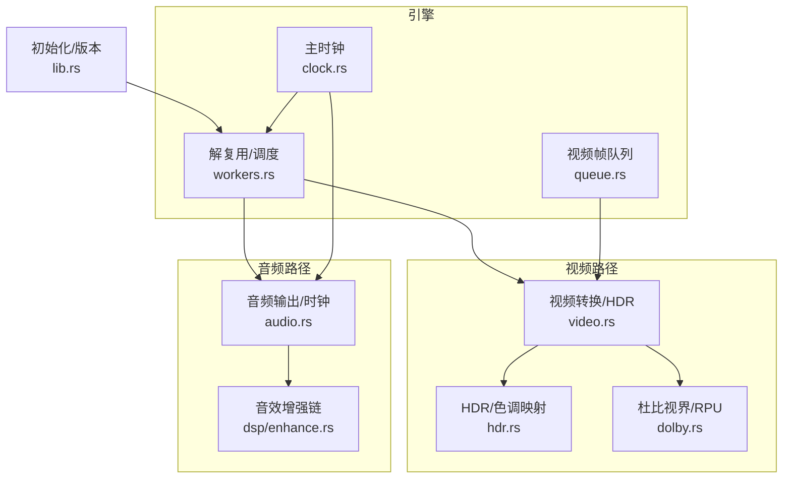
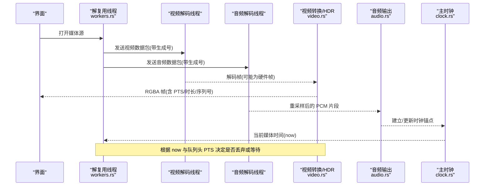
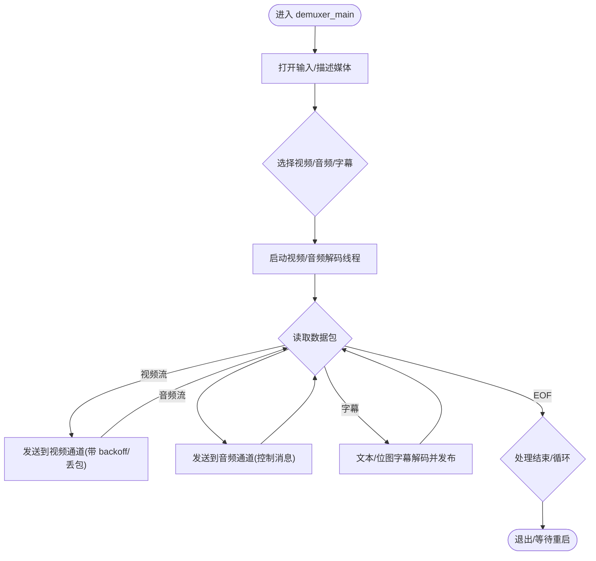
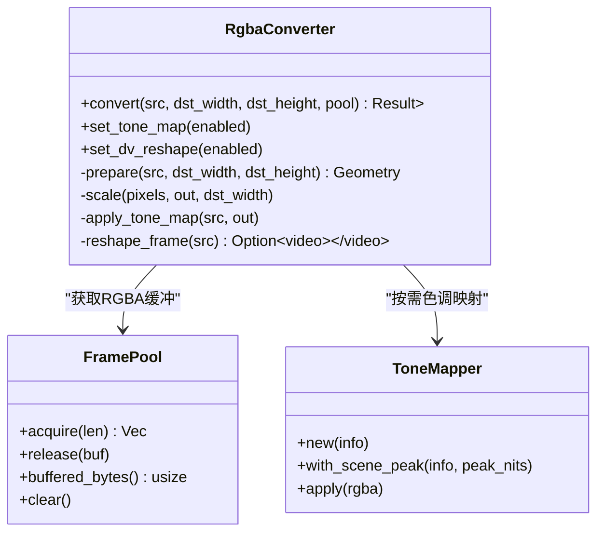
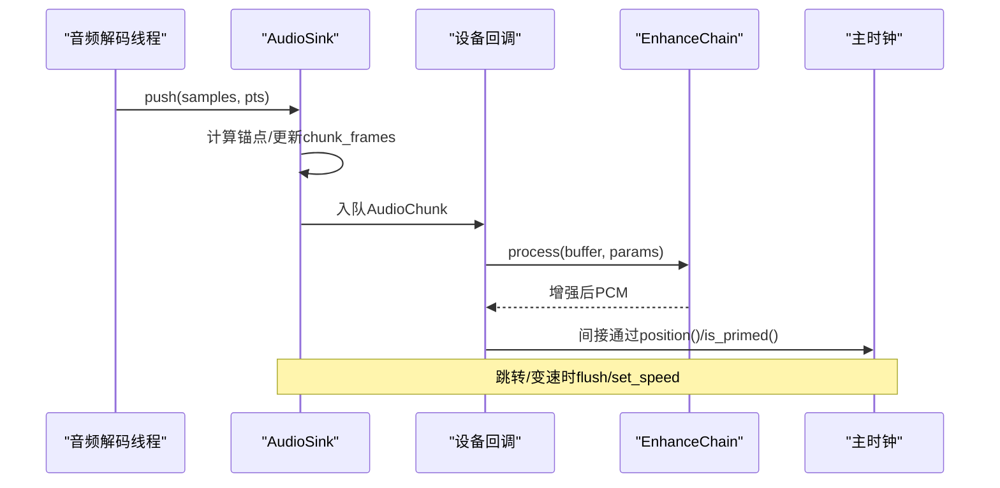
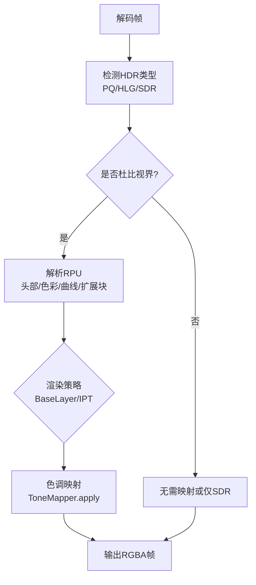
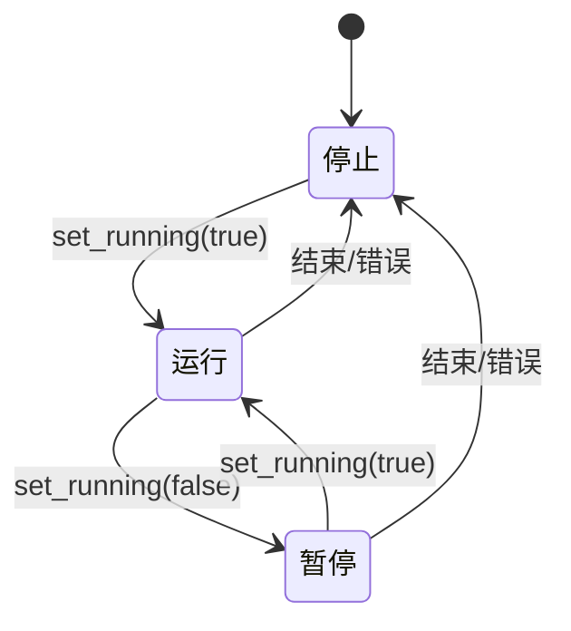
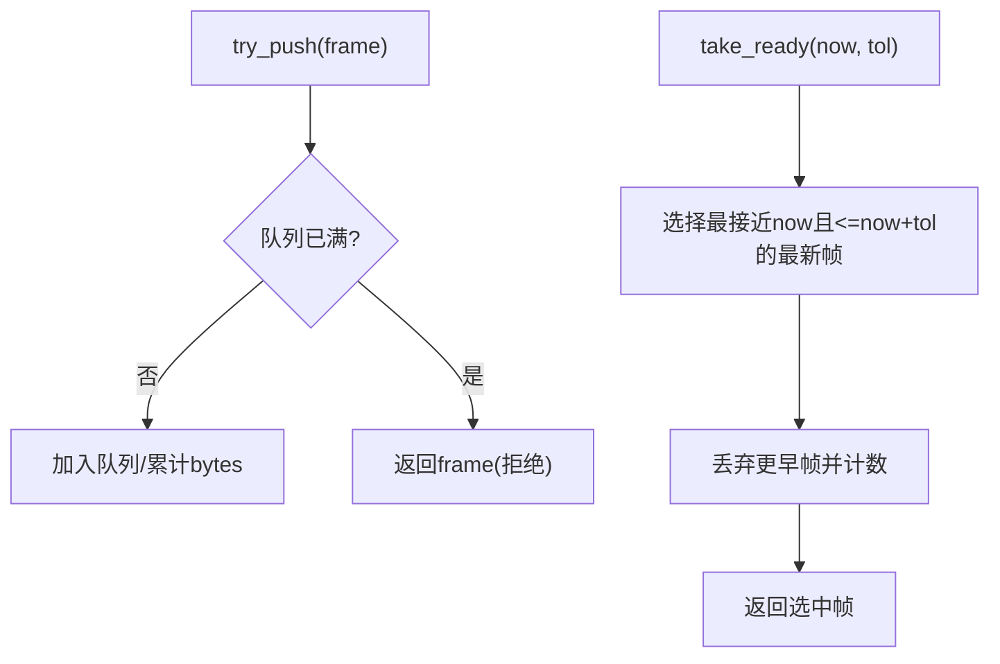
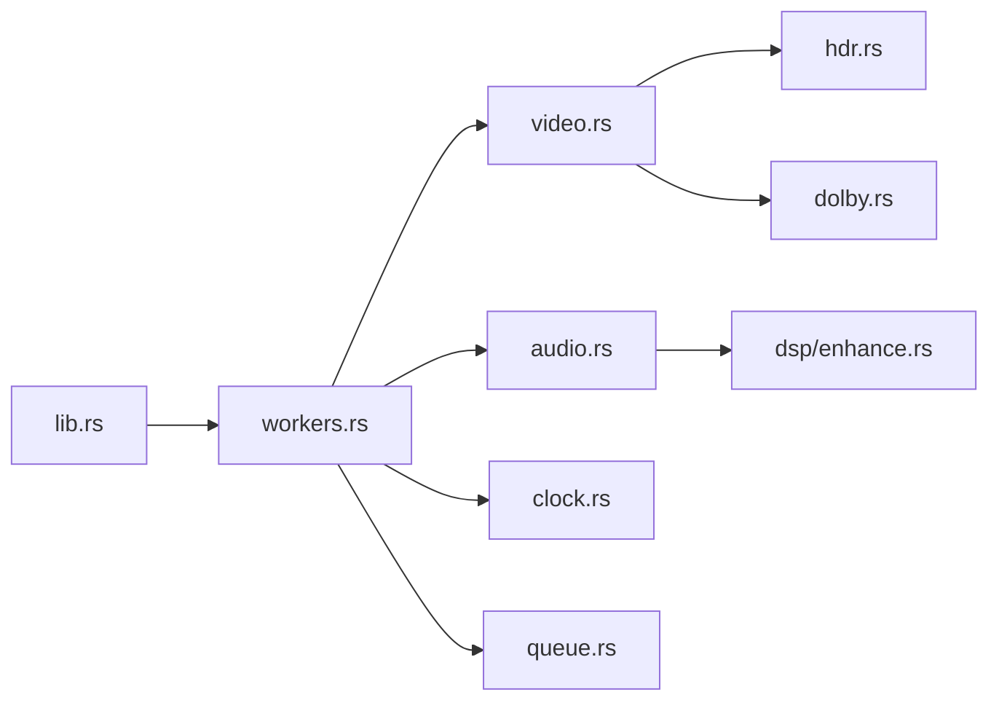

# 媒体引擎核心

<cite>
**本文引用的文件**
- [lib.rs](file://crates/mvp-core/src/lib.rs)
- [workers.rs](file://crates/mvp-core/src/engine/workers.rs)
- [clock.rs](file://crates/mvp-core/src/engine/clock.rs)
- [queue.rs](file://crates/mvp-core/src/engine/queue.rs)
- [video.rs](file://crates/mvp-core/src/video.rs)
- [audio.rs](file://crates/mvp-core/src/audio.rs)
- [hdr.rs](file://crates/mvp-core/src/hdr.rs)
- [dolby.rs](file://crates/mvp-core/src/dolby.rs)
- [enhance.rs](file://crates/mvp-core/src/dsp/enhance.rs)
</cite>

## 目录
1. [简介](#简介)
2. [项目结构](#项目结构)
3. [核心组件](#核心组件)
4. [架构总览](#架构总览)
5. [详细组件分析](#详细组件分析)
6. [依赖关系分析](#依赖关系分析)
7. [性能考量](#性能考量)
8. [故障排查指南](#故障排查指南)
9. [结论](#结论)
10. [附录](#附录)

## 简介
本技术文档面向“媒体引擎核心”，聚焦播放管线的实现细节与关键机制：解复用线程、视频解码线程、音频解码线程的协作；FFmpeg 的直接集成方式；硬件解码（D3D11VA/DXVA2）与软件解码回退；HDR 处理流程（HDR10、杜比视界识别、色调映射、RPU 元数据处理）；音频链路（解码、重采样、音效增强、输出管理）；时钟同步、帧队列管理与内存池化等。文档以代码级分析为基础，辅以流程图与时序图，帮助读者快速理解并优化该播放器核心。

## 项目结构
mvp-core 是媒体引擎的核心库，采用按职责划分的模块组织：
- 引擎与线程：engine（workers、clock、queue）负责解复用、解码调度、时钟与队列
- 音视频处理：video（帧缓冲、颜色转换、HDR 色调映射）、audio（设备输出、实时回调、时钟锚定）
- HDR/杜比视界：hdr（HDR 类型、色调映射器）、dolby（RPU 解析、重塑曲线、渲染策略）
- DSP：dsp（均衡器、响度、空间效果、限幅器等）
- 初始化与版本信息：lib.rs（FFmpeg 初始化、版本查询）

图表来源
- [workers.rs:134-687](file://crates/mvp-core/src/engine/workers.rs#L134-L687)
- [clock.rs:1-159](file://crates/mvp-core/src/engine/clock.rs#L1-L159)
- [queue.rs:67-253](file://crates/mvp-core/src/engine/queue.rs#L67-L253)
- [video.rs:548-706](file://crates/mvp-core/src/video.rs#L548-L706)
- [audio.rs:153-461](file://crates/mvp-core/src/audio.rs#L153-L461)
- [hdr.rs:344-495](file://crates/mvp-core/src/hdr.rs#L344-L495)
- [dolby.rs:478-708](file://crates/mvp-core/src/dolby.rs#L478-L708)
- [enhance.rs:1-33](file://crates/mvp-core/src/dsp/enhance.rs#L1-L33)
- [lib.rs:50-95](file://crates/mvp-core/src/lib.rs#L50-L95)

章节来源
- [lib.rs:1-43](file://crates/mvp-core/src/lib.rs#L1-L43)
- [workers.rs:1-133](file://crates/mvp-core/src/engine/workers.rs#L1-L133)

## 核心组件
- 解复用与调度（workers.rs）：单线程解复用，按流分发到视频/音频通道；支持跳转、A-B 循环、字幕处理；控制丢包与超时；启动解码线程并协调生命周期。
- 视频转换与 HDR（video.rs + hdr.rs + dolby.rs）：将任意像素格式转换为 RGBA，支持缩放、色彩空间选择、HDR→SDR 色调映射；可选 Dolby Vision 重塑；从 RPU 提取亮度范围用于动态映射。
- 音频输出与实时处理（audio.rs + dsp/enhance.rs）：基于 cpal 的输出流，实时回调中完成音量平滑、DSP 增强、限幅；通过原子参数块避免锁与分配；提供样本精确的主时钟锚点。
- 主时钟（clock.rs）：以系统单调时钟为主，结合音频设备位置进行漂移校正；支持暂停、速度变化、跳转。
- 帧队列（queue.rs）：字节预算+时间预算的视频帧队列，保证低延迟与内存可控；提供就绪帧抽取与丢弃计数。

章节来源
- [workers.rs:134-687](file://crates/mvp-core/src/engine/workers.rs#L134-L687)
- [video.rs:548-706](file://crates/mvp-core/src/video.rs#L548-L706)
- [hdr.rs:344-495](file://crates/mvp-core/src/hdr.rs#L344-L495)
- [dolby.rs:478-708](file://crates/mvp-core/src/dolby.rs#L478-L708)
- [audio.rs:153-461](file://crates/mvp-core/src/audio.rs#L153-L461)
- [enhance.rs:1-33](file://crates/mvp-core/src/dsp/enhance.rs#L1-L33)
- [clock.rs:1-159](file://crates/mvp-core/src/engine/clock.rs#L1-L159)
- [queue.rs:67-253](file://crates/mvp-core/src/engine/queue.rs#L67-L253)

## 架构总览
播放管线由“解复用 → 解码 → 转换/HDR → 显示/输出”组成，线程间通过有界通道和共享状态通信，确保背压与可恢复性。

图表来源
- [workers.rs:281-687](file://crates/mvp-core/src/engine/workers.rs#L281-L687)
- [video.rs:687-706](file://crates/mvp-core/src/video.rs#L687-L706)
- [audio.rs:519-618](file://crates/mvp-core/src/audio.rs#L519-L618)
- [clock.rs:122-159](file://crates/mvp-core/src/engine/clock.rs#L122-L159)

## 详细组件分析

### 解复用线程与三线程协作
- 职责：打开输入、描述媒体、选择流、启动解码线程、读取数据包并分发、处理跳转/A-B 循环、字幕解码与发布、结束与循环逻辑。
- 背压与丢包：当视频队列落后于时钟一定阈值时，直接丢弃后续视频包以避免进一步滞后；音频通道使用控制消息发送，避免阻塞导致无声。
- 跳转与刷新：通过共享状态中的 seek_request 与 generation 标记，通知解码线程丢弃旧数据并重置状态。

图表来源
- [workers.rs:281-687](file://crates/mvp-core/src/engine/workers.rs#L281-L687)
- [workers.rs:700-793](file://crates/mvp-core/src/engine/workers.rs#L700-L793)

章节来源
- [workers.rs:134-687](file://crates/mvp-core/src/engine/workers.rs#L134-L687)
- [workers.rs:700-793](file://crates/mvp-core/src/engine/workers.rs#L700-L793)

### 视频解码与转换（含硬件解码与回退）
- 解码阶段：视频解码线程接收数据包，调用 FFmpeg 解码；若启用硬件解码，则通过 get_format 回调选择 D3D11VA/DXVA2 等硬件格式，并在解码线程内下载至系统内存以便后续转换。
- 转换阶段：RgbaConverter 缓存 SwsContext，按目标尺寸与色彩空间进行缩放与转换；优先从 FramePool 获取 RGBA 缓冲区，避免重复分配。
- HDR 处理：根据帧元数据判断 HDR 类型（PQ/HLG），必要时应用 ToneMapper 将高动态范围映射到 SDR；可选 Dolby Vision 重塑（默认关闭）。

图表来源
- [video.rs:548-706](file://crates/mvp-core/src/video.rs#L548-L706)
- [video.rs:57-142](file://crates/mvp-core/src/video.rs#L57-L142)
- [hdr.rs:344-495](file://crates/mvp-core/src/hdr.rs#L344-L495)

章节来源
- [video.rs:548-706](file://crates/mvp-core/src/video.rs#L548-L706)
- [video.rs:57-142](file://crates/mvp-core/src/video.rs#L57-L142)
- [hdr.rs:344-495](file://crates/mvp-core/src/hdr.rs#L344-L495)

### 音频解码、重采样与输出管理
- 输出设备：AudioSink 在首次打开时选择设备与配置，保持单一输出流以降低延迟与避免点击声。
- 实时回调：在 cpal 回调中填充缓冲区，应用音量平滑、DSP 增强链（均衡器、响度、空间、限幅），最后写入设备。
- 时钟锚定：push 时根据已排队音频长度反推即将播放的媒体时间，建立/更新锚点；flush 时丢弃旧数据并重新锚定。

图表来源
- [audio.rs:519-618](file://crates/mvp-core/src/audio.rs#L519-L618)
- [audio.rs:320-461](file://crates/mvp-core/src/audio.rs#L320-L461)
- [enhance.rs:241-321](file://crates/mvp-core/src/dsp/enhance.rs#L241-L321)

章节来源
- [audio.rs:153-461](file://crates/mvp-core/src/audio.rs#L153-L461)
- [audio.rs:519-618](file://crates/mvp-core/src/audio.rs#L519-L618)
- [enhance.rs:241-321](file://crates/mvp-core/src/dsp/enhance.rs#L241-L321)

### HDR 处理流程（HDR10、杜比视界、RPU 与色调映射）
- 识别：从帧元数据与容器侧数据推断 HDR 类型（PQ/HLG/SDR），解析杜比视界配置记录（profile、level、RPU/EL 标志、兼容层）。
- RPU 解析：从 AV_FRAME_DATA_DOVI_METADATA 提取头部、色彩元数据、重塑曲线、Level 1/2/5/6 扩展块；决定是否需要重塑与渲染策略。
- 色调映射：构建 ToneMapper（固定表或按场景峰值调整肩部），对 BT.2020→BT.709 矩阵与亮度压缩进行近似映射；可选 DV 重塑（默认关闭）。

图表来源
- [hdr.rs:164-271](file://crates/mvp-core/src/hdr.rs#L164-L271)
- [dolby.rs:478-708](file://crates/mvp-core/src/dolby.rs#L478-L708)
- [video.rs:687-706](file://crates/mvp-core/src/video.rs#L687-L706)

章节来源
- [hdr.rs:164-271](file://crates/mvp-core/src/hdr.rs#L164-L271)
- [dolby.rs:478-708](file://crates/mvp-core/src/dolby.rs#L478-L708)
- [video.rs:687-706](file://crates/mvp-core/src/video.rs#L687-L706)

### 时钟同步机制
- 主时钟：以系统单调时钟为主，结合音频设备位置进行漂移校正；暂停时冻结，恢复时继续；变速时重锚点避免跳变。
- 音频锚点：push 时根据已排队音频长度反推即将播放的媒体时间，建立/更新锚点；flush 时丢弃旧数据并重新锚定。
- 视频同步：demuxer 根据 now 与队列头 PTS 决定是否丢弃或等待，避免画面滞后。

图表来源
- [clock.rs:48-159](file://crates/mvp-core/src/engine/clock.rs#L48-L159)
- [audio.rs:519-618](file://crates/mvp-core/src/audio.rs#L519-L618)
- [workers.rs:215-262](file://crates/mvp-core/src/engine/workers.rs#L215-L262)

章节来源
- [clock.rs:48-159](file://crates/mvp-core/src/engine/clock.rs#L48-L159)
- [audio.rs:519-618](file://crates/mvp-core/src/audio.rs#L519-L618)
- [workers.rs:215-262](file://crates/mvp-core/src/engine/workers.rs#L215-L262)

### 帧队列管理与内存池化
- 视频队列：字节预算+时间预算双重限制，防止 4K 大帧占用过多内存；提供 take_ready 抽取就绪帧并统计丢弃数。
- 帧缓冲池：FramePool 维护空闲 RGBA 缓冲列表，按最佳适配原则复用，限制总持有字节数，减少分配开销。

图表来源
- [queue.rs:180-253](file://crates/mvp-core/src/engine/queue.rs#L180-L253)
- [video.rs:57-142](file://crates/mvp-core/src/video.rs#L57-L142)

章节来源
- [queue.rs:180-253](file://crates/mvp-core/src/engine/queue.rs#L180-L253)
- [video.rs:57-142](file://crates/mvp-core/src/video.rs#L57-L142)

## 依赖关系分析
- 模块耦合：workers 依赖 video/audio 处理与 engine 共享状态；video 依赖 hdr/dolby；audio 依赖 dsp 增强链；所有模块通过 lib.rs 暴露统一接口。
- 外部依赖：FFmpeg（解复用/解码/颜色转换）、cpal（音频输出）、crossbeam（无锁通道）、parking_lot（高性能锁）。

图表来源
- [lib.rs:19-43](file://crates/mvp-core/src/lib.rs#L19-L43)
- [workers.rs:1-24](file://crates/mvp-core/src/engine/workers.rs#L1-L24)

章节来源
- [lib.rs:19-43](file://crates/mvp-core/src/lib.rs#L19-L43)
- [workers.rs:1-24](file://crates/mvp-core/src/engine/workers.rs#L1-L24)

## 性能考量
- 解码线程前导：视频/音频解码允许适度超前（约 0.5 秒），吸收抖动同时保证跳转响应迅速。
- 队列预算：视频队列按时间与字节双重限制，避免高分辨率材料占用过大内存；音频队列以 chunk 为单位，保证低延迟。
- 转换优化：SwsContext 缓存、FramePool 复用 RGBA 缓冲、色调映射查表与分块并行（受限于可用核心数）。
- 实时音频：回调中零分配、零锁（原子参数块），音量平滑与限幅在实时路径执行，避免卡顿。
- 硬件解码：优先选择 D3D11VA/DXVA2，减少 CPU 负载；解码线程内下载硬件帧至系统内存，便于后续转换。

[本节为通用指导，不直接分析具体文件]

## 故障排查指南
- 常见错误：音频设备不可用、无法创建音频流、解码帧无效、目标尺寸无效、像素格式未知等；这些错误会被上报为 EngineEvent::Error 并设置 PlaybackState::Error。
- 诊断建议：
  - 检查音频设备枚举与默认配置，确认采样率与格式支持；
  - 查看视频帧尺寸与像素格式是否合法，必要时调整目标分辨率；
  - 观察队列长度与丢弃计数，判断是否存在解码/转换瓶颈；
  - 对于杜比视界内容，确认 RPU 解析成功与重塑策略是否符合预期。

章节来源
- [workers.rs:148-162](file://crates/mvp-core/src/engine/workers.rs#L148-L162)
- [video.rs:751-800](file://crates/mvp-core/src/video.rs#L751-L800)
- [audio.rs:180-318](file://crates/mvp-core/src/audio.rs#L180-L318)

## 结论
该媒体引擎核心通过清晰的线程分工、严格的队列与内存预算、以及稳健的时钟同步机制，实现了高效可靠的播放管线。HDR 与杜比视界的支持兼顾准确性与性能，音频链路在实时约束下提供丰富的音效增强能力。未来可考虑将色调映射迁移至 GPU 以提升性能与精度，并完善杜比视界增强层的解码与合成。

[本节为总结性内容，不直接分析具体文件]

## 附录
- FFmpeg 集成要点：
  - 进程内初始化一次，设置日志级别以减少噪音；
  - 输入选项配置探测大小、网络超时与 RTSP 传输；
  - 通过 get_format 回调选择硬件像素格式，启用硬件解码。
- 性能调优建议：
  - 合理设置 VIDEO_LEAD/AUDIO_LEAD 以平衡延迟与鲁棒性；
  - 调整帧队列时间预算以控制跳转响应；
  - 在高端设备上启用硬件解码，降低 CPU 占用；
  - 谨慎开启杜比视界重塑，仅在验证通过后启用。

章节来源
- [lib.rs:50-95](file://crates/mvp-core/src/lib.rs#L50-L95)
- [workers.rs:164-189](file://crates/mvp-core/src/engine/workers.rs#L164-L189)
- [workers.rs:1456-1487](file://crates/mvp-core/src/engine/workers.rs#L1456-L1487)