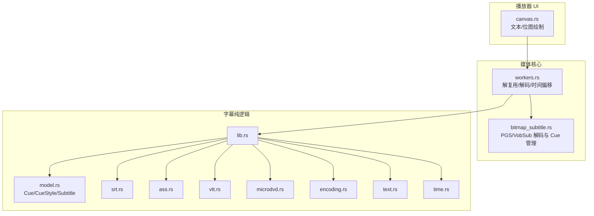
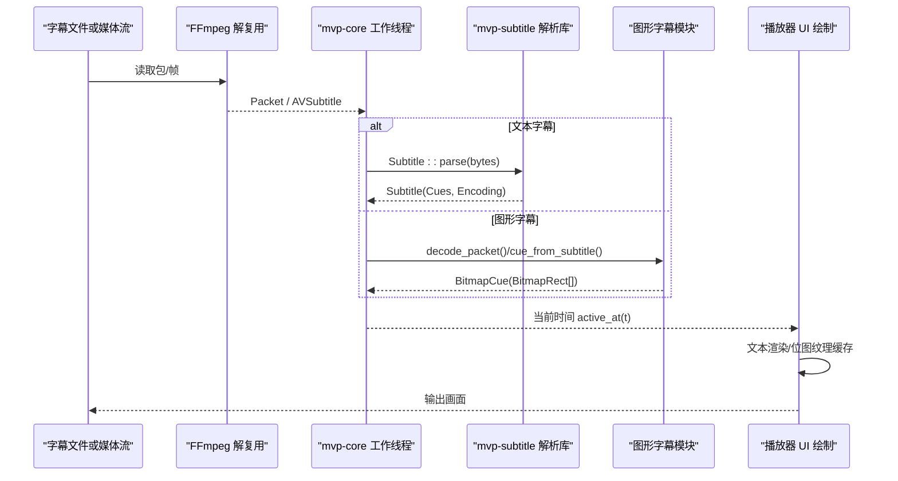
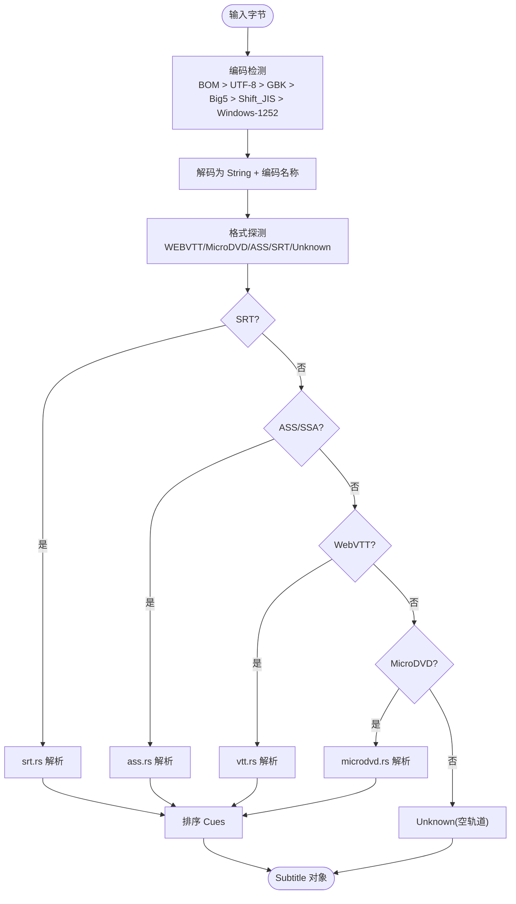
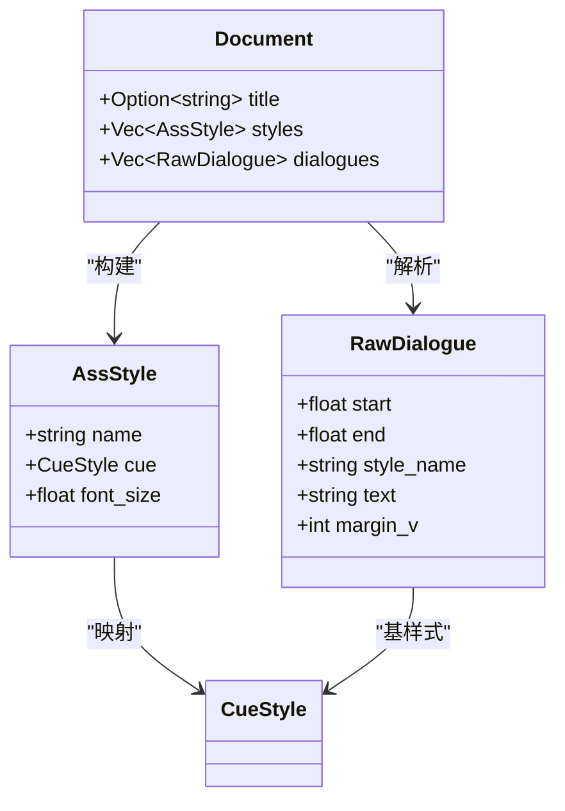
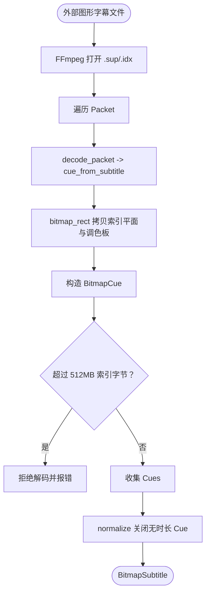
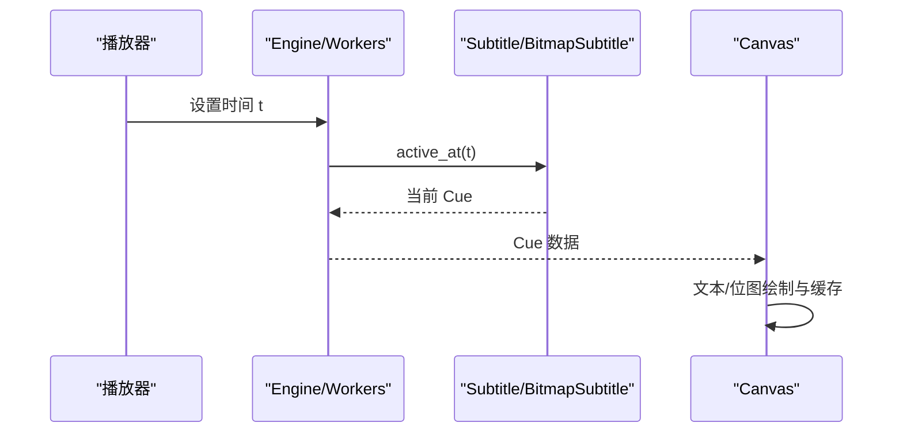
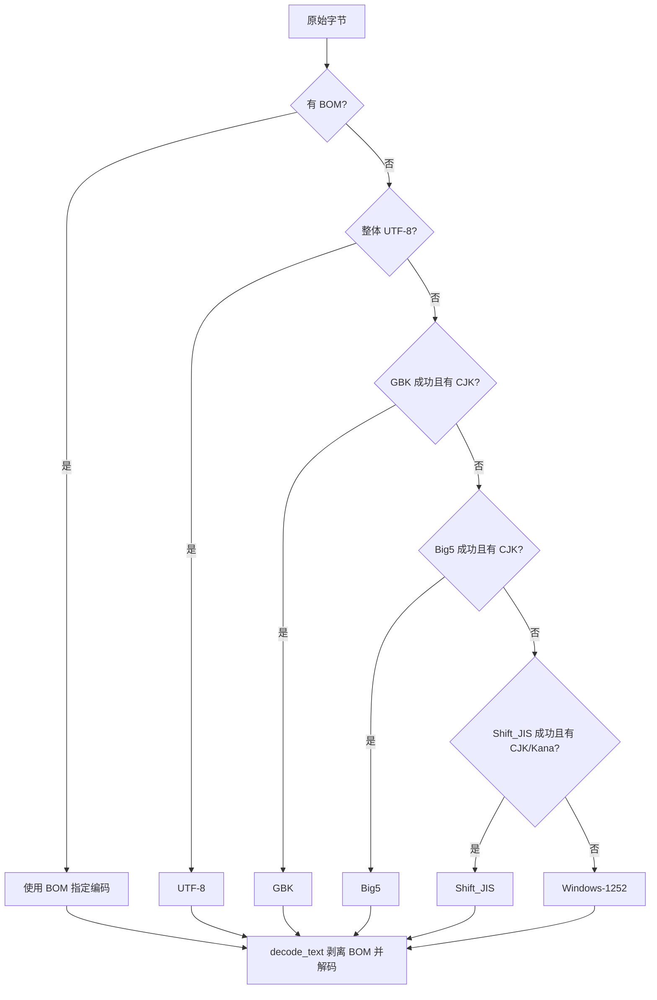
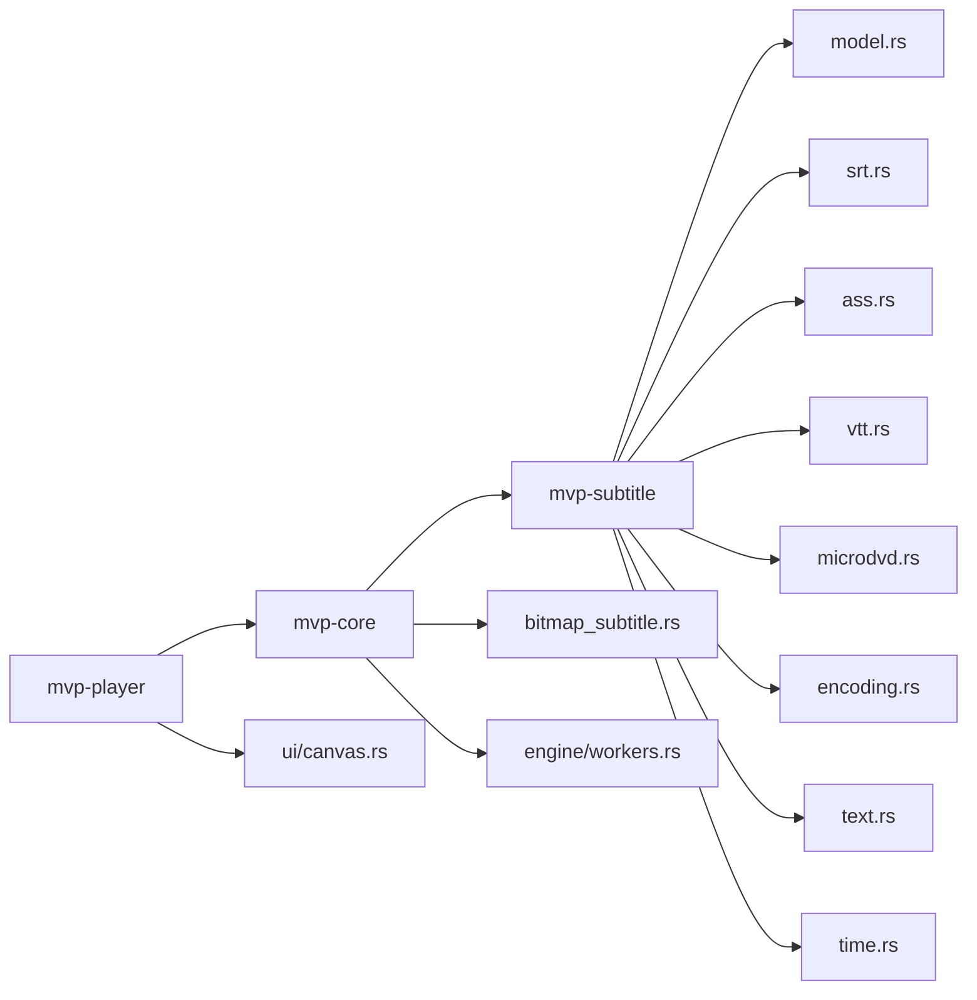

# 字幕渲染引擎

<cite>
**本文引用的文件**   
- [bitmap_subtitle.rs](file://crates/mvp-core/src/bitmap_subtitle.rs)
- [lib.rs](file://crates/mvp-subtitle/src/lib.rs)
- [model.rs](file://crates/mvp-subtitle/src/model.rs)
- [encoding.rs](file://crates/mvp-subtitle/src/encoding.rs)
- [srt.rs](file://crates/mvp-subtitle/src/srt.rs)
- [ass.rs](file://crates/mvp-subtitle/src/ass.rs)
- [vtt.rs](file://crates/mvp-subtitle/src/vtt.rs)
- [microdvd.rs](file://crates/mvp-subtitle/src/microdvd.rs)
- [text.rs](file://crates/mvp-subtitle/src/text.rs)
- [time.rs](file://crates/mvp-subtitle/src/time.rs)
- [workers.rs](file://crates/mvp-core/src/engine/workers.rs)
- [canvas.rs](file://crates/mvp-player/src/ui/canvas.rs)
</cite>

## 目录
1. [引言](#引言)
2. [项目结构](#项目结构)
3. [核心组件](#核心组件)
4. [架构总览](#架构总览)
5. [详细组件分析](#详细组件分析)
6. [依赖关系分析](#依赖关系分析)
7. [性能与内存优化](#性能与内存优化)
8. [故障排查指南](#故障排查指南)
9. [结论](#结论)
10. [附录：兼容性测试与调优建议](#附录兼容性测试与调优建议)

## 引言
本技术文档围绕 MVP-Versatile-Player 中的“字幕渲染引擎”展开，重点覆盖两类字幕：
- 图形（位图）字幕：PGS、VobSub/DVB，基于 FFmpeg 解码为调色板索引平面与调色板。
- 文本字幕：SRT、ASS/SSA、WebVTT、MicroDVD，统一归一化为时间区间、纯文本与轻量样式。

文档同时解释：
- 时间轴对齐与显示窗口管理；
- 外部图形字幕的内存限制与裁剪策略；
- 编码自动检测（UTF-8/GBK/Big5/Shift_JIS/Windows-1252/UTF-16）；
- 解析、渲染与缓存的关键路径；
- 兼容性测试方法与性能调优建议。

## 项目结构
本项目将字幕能力拆分为两个 crate：
- `mvp-subtitle`：纯逻辑层，负责格式解析、编码识别、时间码解析、Cue 模型与查询。
- `mvp-core`：媒体管线层，负责 FFmpeg 解复用/解码、图形字幕解码、时间偏移、Cue 归一化与裁剪。
- `mvp-player`：UI 层，负责文本与位图字幕的最终绘制与缓存。

**图表来源**
- [canvas.rs:458-468](file://crates/mvp-player/src/ui/canvas.rs#L458-L468)
- [workers.rs:2135-2167](file://crates/mvp-core/src/engine/workers.rs#L2135-L2167)
- [bitmap_subtitle.rs:1-23](file://crates/mvp-core/src/bitmap_subtitle.rs#L1-L23)
- [lib.rs:1-31](file://crates/mvp-subtitle/src/lib.rs#L1-L31)

**章节来源**
- [lib.rs:1-31](file://crates/mvp-subtitle/src/lib.rs#L1-L31)
- [bitmap_subtitle.rs:1-23](file://crates/mvp-core/src/bitmap_subtitle.rs#L1-L23)

## 核心组件
- 文本字幕模型与解析器：
  - `Subtitle`、`Cue`、`CueStyle`、`Align`、`SubFormat` 等定义在 `model.rs`。
  - 各格式解析器：`srt.rs`、`ass.rs`、`vtt.rs`、`microdvd.rs`。
  - 公共工具：`text.rs`（标签清理、实体解码）、`time.rs`（时间码解析）、`encoding.rs`（编码检测与解码）。
- 图形字幕模型与解码：
  - `BitmapRect`、`BitmapCue`、`BitmapSubtitle` 定义在 `bitmap_subtitle.rs`。
  - 外部 PGS/VobSub 解码入口 `decode_external`，以及 `normalize`、`prune`、`byte_size` 等内存与时间管理函数。
- 播放集成：
  - `workers.rs` 中解复用/解码流程，将 FFmpeg 的 `AVSubtitle` 转换为文本或图形 Cue。
  - `canvas.rs` 中最终绘制文本与位图字幕，并维护纹理缓存。

**章节来源**
- [model.rs:9-84](file://crates/mvp-subtitle/src/model.rs#L9-L84)
- [srt.rs:22-122](file://crates/mvp-subtitle/src/srt.rs#L22-L122)
- [ass.rs:45-81](file://crates/mvp-subtitle/src/ass.rs#L45-L81)
- [vtt.rs:14-64](file://crates/mvp-subtitle/src/vtt.rs#L14-L64)
- [microdvd.rs:48-88](file://crates/mvp-subtitle/src/microdvd.rs#L48-L88)
- [text.rs:1-155](file://crates/mvp-subtitle/src/text.rs#L1-L155)
- [time.rs:8-51](file://crates/mvp-subtitle/src/time.rs#L8-L51)
- [encoding.rs:110-178](file://crates/mvp-subtitle/src/encoding.rs#L110-L178)
- [bitmap_subtitle.rs:30-135](file://crates/mvp-core/src/bitmap_subtitle.rs#L30-L135)
- [workers.rs:2135-2167](file://crates/mvp-core/src/engine/workers.rs#L2135-L2167)
- [canvas.rs:458-468](file://crates/mvp-player/src/ui/canvas.rs#L458-L468)

## 架构总览
下图展示从“输入字节/流”到“屏幕像素”的完整路径：

**图表来源**
- [lib.rs:1-31](file://crates/mvp-subtitle/src/lib.rs#L1-L31)
- [workers.rs:2135-2167](file://crates/mvp-core/src/engine/workers.rs#L2135-L2167)
- [bitmap_subtitle.rs:230-276](file://crates/mvp-core/src/bitmap_subtitle.rs#L230-L276)
- [canvas.rs:458-468](file://crates/mvp-player/src/ui/canvas.rs#L458-L468)

## 详细组件分析

### 文本字幕数据模型与解析流水线
- 模型设计：
  - `Cue` 表示 `[start, end)` 半开区间、纯文本与轻量样式。
  - `CueStyle` 支持粗体、斜体、下划线、删除线、颜色、对齐、垂直边距。
  - `Subtitle` 提供格式、标题、排序后的 Cues、编码名称，并提供 `active_at`、`index_at`、`shift`、`merge_adjacent` 等方法。
- 解析流程：
  - `Subtitle::parse` 先通过 `encoding::decode_text` 进行 BOM 优先、内容启发式编码检测，再按扩展名或内容探测选择解析器。
  - 各解析器返回 `Parsed`，再由 `from_text` 统一排序。

**图表来源**
- [encoding.rs:110-178](file://crates/mvp-subtitle/src/encoding.rs#L110-L178)
- [model.rs:149-294](file://crates/mvp-subtitle/src/model.rs#L149-L294)
- [srt.rs:22-122](file://crates/mvp-subtitle/src/srt.rs#L22-L122)
- [ass.rs:45-81](file://crates/mvp-subtitle/src/ass.rs#L45-L81)
- [vtt.rs:14-64](file://crates/mvp-subtitle/src/vtt.rs#L14-L64)
- [microdvd.rs:48-88](file://crates/mvp-subtitle/src/microdvd.rs#L48-L88)

**章节来源**
- [model.rs:9-84](file://crates/mvp-subtitle/src/model.rs#L9-L84)
- [model.rs:149-294](file://crates/mvp-subtitle/src/model.rs#L149-L294)
- [encoding.rs:110-178](file://crates/mvp-subtitle/src/encoding.rs#L110-L178)

#### SRT 解析要点
- 容忍缺失序号、小时字段、逗号/点分隔符、行尾垃圾、空白行内嵌、末尾无换行。
- 清理 `<i>`、`` 等标签与 `{...}` 覆盖块，`\N`/`\n` 转为真实换行。
- 时间解析使用通用 `time.rs`，兼容多种时间码形状。

**章节来源**
- [srt.rs:22-122](file://crates/mvp-subtitle/src/srt.rs#L22-L122)
- [srt.rs:142-152](file://crates/mvp-subtitle/src/srt.rs#L142-L152)
- [time.rs:8-51](file://crates/mvp-subtitle/src/time.rs#L8-L51)

#### ASS/SSA 解析要点
- 解析 `[Script Info]` 标题、`[V4+ Styles]`/`[V4 Styles]` 样式表。
- 解析 `Dialogue:` 行，支持列重排与 `Text` 含逗号。
- 渲染覆盖标记：`\b`、`\i`、`\u`、`\s`、`\c`/`\1c`、`\an`、`\a`、`\pos`、`\r`、`\p`。
- 丢弃矢量绘图 `\p1` 载荷，保留普通文本。

**图表来源**
- [ass.rs:24-43](file://crates/mvp-subtitle/src/ass.rs#L24-L43)
- [ass.rs:88-93](file://crates/mvp-subtitle/src/ass.rs#L88-L93)

**章节来源**
- [ass.rs:45-81](file://crates/mvp-subtitle/src/ass.rs#L45-L81)
- [ass.rs:95-156](file://crates/mvp-subtitle/src/ass.rs#L95-L156)
- [ass.rs:239-302](file://crates/mvp-subtitle/src/ass.rs#L239-L302)
- [ass.rs:429-551](file://crates/mvp-subtitle/src/ass.rs#L429-L551)

#### WebVTT 解析要点
- 处理 `WEBVTT` 头、可选标题、跳过 `NOTE`/`STYLE`/`REGION`。
- 支持 `HH:MM:SS.mmm` 与 `MM:SS.mmm`。
- 解析 `align:`、`position:`，映射到 `Align`；`line:` 仅语法识别。
- 清理 HTML 实体与角度标签。

**章节来源**
- [vtt.rs:14-64](file://crates/mvp-subtitle/src/vtt.rs#L14-L64)
- [vtt.rs:101-154](file://crates/mvp-subtitle/src/vtt.rs#L101-L154)

#### MicroDVD 解析要点
- 帧号转秒：`{start}{end}text`，默认 FPS 23.976，可被首行声明覆盖。
- 支持 `{y:...}` 样式与 `{c:$..}` 颜色（BBGGRR）。
- 编码自动检测，返回 `Subtitle`。

**章节来源**
- [microdvd.rs:14-29](file://crates/mvp-subtitle/src/microdvd.rs#L14-L29)
- [microdvd.rs:48-88](file://crates/mvp-subtitle/src/microdvd.rs#L48-L88)
- [microdvd.rs:106-162](file://crates/mvp-subtitle/src/microdvd.rs#L106-L162)

### 图形字幕（PGS/VobSub）解码与管理
- 数据结构：
  - `BitmapRect`：包含坐标、宽高、调色板索引平面与 RGBA 调色板。
  - `BitmapCue`：半开时间区间与多个 `BitmapRect`。
  - `BitmapSubtitle`：排序后的 Cues 与可选画布尺寸（PGS 为视频分辨率，VobSub 为 DVD 帧大小）。
- 解码流程：
  - `decode_external` 打开 `.sup`/`.idx`（VobSub 会解析相邻 `.sub`），遍历包调用 `decode_packet`。
  - `cue_from_subtitle` 将 FFmpeg 的 `AVSubtitle` 转为 `BitmapCue`。
  - `bitmap_rect` 拷贝索引平面与调色板，处理负 stride 与不可用调色板回退为全白掩码。
- 时间与内存管理：
  - `normalize`：对无持续时间的 Cue（常见于 PGS）关闭到下一个 Cue 开始，或删除空 Cue。
  - `prune`：丢弃已结束且不再显示的 Cue，控制内存增长。
  - `byte_size`：统计所有索引字节数，用于外部文件上限检查。

**图表来源**
- [bitmap_subtitle.rs:389-453](file://crates/mvp-core/src/bitmap_subtitle.rs#L389-L453)
- [bitmap_subtitle.rs:230-276](file://crates/mvp-core/src/bitmap_subtitle.rs#L230-L276)
- [bitmap_subtitle.rs:278-346](file://crates/mvp-core/src/bitmap_subtitle.rs#L278-L346)
- [bitmap_subtitle.rs:137-172](file://crates/mvp-core/src/bitmap_subtitle.rs#L137-L172)

**章节来源**
- [bitmap_subtitle.rs:30-135](file://crates/mvp-core/src/bitmap_subtitle.rs#L30-L135)
- [bitmap_subtitle.rs:230-276](file://crates/mvp-core/src/bitmap_subtitle.rs#L230-L276)
- [bitmap_subtitle.rs:278-346](file://crates/mvp-core/src/bitmap_subtitle.rs#L278-L346)
- [bitmap_subtitle.rs:389-453](file://crates/mvp-core/src/bitmap_subtitle.rs#L389-L453)

### 字幕同步机制：时间轴对齐与显示窗口
- 时间基准：
  - 内部以秒为单位，`Cue.start`/`Cue.end` 为半开区间。
  - 外部容器时间通过 `stream_start_offset` 与 `time_base` 转换，避免 seek 错位。
- 活动 Cue 选择：
  - 文本与图形均实现 `active_at(t)`，优先选择重叠中“起始最晚”的 Cue，符合用户预期。
  - `index_at(t)` 用于“下一/上一字幕”跳转。
- 显示窗口：
  - 文本字幕在 UI 层根据对齐与边距计算位置。
  - 位图字幕坐标来自字幕流自身画布，需缩放至实际画面矩形。

**图表来源**
- [model.rs:180-213](file://crates/mvp-subtitle/src/model.rs#L180-L213)
- [bitmap_subtitle.rs:108-135](file://crates/mvp-core/src/bitmap_subtitle.rs#L108-L135)
- [workers.rs:2135-2167](file://crates/mvp-core/src/engine/workers.rs#L2135-L2167)
- [canvas.rs:458-468](file://crates/mvp-player/src/ui/canvas.rs#L458-L468)

**章节来源**
- [model.rs:180-213](file://crates/mvp-subtitle/src/model.rs#L180-L213)
- [bitmap_subtitle.rs:108-135](file://crates/mvp-core/src/bitmap_subtitle.rs#L108-L135)
- [workers.rs:830-838](file://crates/mvp-core/src/engine/workers.rs#L830-L838)
- [workers.rs:2135-2167](file://crates/mvp-core/src/engine/workers.rs#L2135-L2167)

### 位图字幕优化：裁剪、内存限制与渲染缓存
- 索引平面存储：
  - 位图字幕以 8-bit 调色板索引平面存储，仅在渲染时按需展开为 RGBA，显著降低内存占用。
- 内存限制：
  - 外部图形字幕解码累计索引字节超过 512MB 直接拒绝，防止恶意或畸形文件耗尽内存。
- 时间裁剪：
  - `prune(cues, floor)` 丢弃已结束且不再显示的 Cue，配合 demuxer 的前向读取窗口控制内存。
- 渲染缓存：
  - UI 层对位图字幕纹理进行缓存，仅在活动 Cue 变化时重建。

**图表来源**
- [bitmap_subtitle.rs:159-172](file://crates/mvp-core/src/bitmap_subtitle.rs#L159-L172)
- [bitmap_subtitle.rs:373-453](file://crates/mvp-core/src/bitmap_subtitle.rs#L373-L453)
- [canvas.rs:458-468](file://crates/mvp-player/src/ui/canvas.rs#L458-L468)

**章节来源**
- [bitmap_subtitle.rs:10-22](file://crates/mvp-core/src/bitmap_subtitle.rs#L10-L22)
- [bitmap_subtitle.rs:159-172](file://crates/mvp-core/src/bitmap_subtitle.rs#L159-L172)
- [bitmap_subtitle.rs:373-453](file://crates/mvp-core/src/bitmap_subtitle.rs#L373-L453)
- [canvas.rs:458-468](file://crates/mvp-player/src/ui/canvas.rs#L458-L468)

### 编码识别与处理：UTF-8/GBK/Big5/Shift_JIS
- 优先级：
  1. BOM（UTF-8/UTF-16LE/UTF-16BE）优先。
  2. 整体有效 UTF-8。
  3. GBK 解码成功且包含 CJK 字符。
  4. Big5 解码成功且包含 CJK 字符。
  5. Shift_JIS 解码成功且包含 CJK 或假名。
  6. 回退到 Windows-1252。
- 解码行为：
  - `decode_text` 剥离 BOM，返回 String 与人类可读编码名称。
  - 解码失败降级为替换字符，保证部分可见优于完全不可见。

**图表来源**
- [encoding.rs:60-94](file://crates/mvp-subtitle/src/encoding.rs#L60-L94)
- [encoding.rs:110-178](file://crates/mvp-subtitle/src/encoding.rs#L110-L178)

**章节来源**
- [encoding.rs:110-178](file://crates/mvp-subtitle/src/encoding.rs#L110-L178)

## 依赖关系分析
- `mvp-subtitle` 不依赖 FFmpeg 或平台 API，便于跨平台测试与复用。
- `mvp-core` 依赖 FFmpeg 进行解复用/解码，并通过 `bitmap_subtitle` 管理图形字幕。
- `mvp-player` 依赖 UI 框架（egui）进行文本与位图绘制。

**图表来源**
- [lib.rs:1-31](file://crates/mvp-subtitle/src/lib.rs#L1-L31)
- [bitmap_subtitle.rs:1-23](file://crates/mvp-core/src/bitmap_subtitle.rs#L1-L23)
- [workers.rs:2135-2167](file://crates/mvp-core/src/engine/workers.rs#L2135-L2167)
- [canvas.rs:458-468](file://crates/mvp-player/src/ui/canvas.rs#L458-L468)

**章节来源**
- [lib.rs:1-31](file://crates/mvp-subtitle/src/lib.rs#L1-L31)
- [bitmap_subtitle.rs:1-23](file://crates/mvp-core/src/bitmap_subtitle.rs#L1-L23)

## 性能与内存优化
- 文本解析：
  - 解析器对非法输入宽容，避免整文件解析失败；通过 `detect_format` 限制扫描行数，防止超大文件检测开销。
  - `merge_adjacent` 合并相邻相同文本 Cue，减少 UI 刷新频率。
- 图形字幕：
  - 索引平面存储，仅在渲染时展开 RGBA。
  - 外部文件解码上限 512MB 索引字节，超出即拒绝。
  - `prune` 定期丢弃过期 Cue，控制常驻内存。
- 渲染：
  - 位图纹理缓存，避免重复创建 GPU 资源。
  - 文本渲染采用 egui galley，结合软阴影背景提升可读性。

[本节为通用性能讨论，不直接分析具体代码文件]

## 故障排查指南
- 文本乱码：
  - 检查编码检测是否命中目标编码；必要时通过显式 hint 强制解码。
  - 确认 BOM 是否被正确剥离。
- 时间错位：
  - 检查 `stream_start_offset` 与 `time_base` 转换是否正确。
  - 确认 `normalize` 已关闭无持续时间 Cue。
- 图形字幕内存过高：
  - 检查外部文件是否触发 512MB 限制。
  - 确认 `prune` 是否按播放进度裁剪。
- 样式丢失：
  - ASS 中矢量绘图 `\p1` 会被丢弃；确认样式覆盖标记是否被正确解析。
  - SRT/WebVTT 内联标签被清理，不会设置 `CueStyle`。

**章节来源**
- [encoding.rs:110-178](file://crates/mvp-subtitle/src/encoding.rs#L110-L178)
- [workers.rs:830-838](file://crates/mvp-core/src/engine/workers.rs#L830-L838)
- [bitmap_subtitle.rs:137-172](file://crates/mvp-core/src/bitmap_subtitle.rs#L137-L172)
- [ass.rs:429-551](file://crates/mvp-subtitle/src/ass.rs#L429-L551)

## 结论
该字幕渲染引擎通过清晰的职责分层与鲁棒的解析策略，实现了：
- 多格式文本字幕的统一模型与稳定解析；
- 高效安全的图形字幕解码与内存控制；
- 精确的时间同步与显示窗口管理；
- 可扩展的编码检测与样式应用。

在实际使用中，建议结合兼容性测试与性能调优建议，确保在不同源文件与播放场景下的稳定性与流畅度。

[本节为总结性内容，不直接分析具体代码文件]

## 附录：兼容性测试与调优建议

### 兼容性测试方法
- 文本字幕：
  - 准备 SRT/ASS/VTT/MicroDVD 样本，覆盖不同时间码格式、编码（UTF-8/GBK/Big5/Shift_JIS/Windows-1252/UTF-16）。
  - 验证 `Subtitle::parse` 与 `active_at`/`index_at` 的行为是否符合半开区间与“起始最晚优先”。
- 图形字幕：
  - 准备 PGS `.sup` 与 VobSub `.idx`/`.sub` 样本，验证 `decode_external` 与 `normalize`。
  - 检查 `byte_size` 与 512MB 限制是否生效。
- 集成测试：
  - 使用 `workers.rs` 的解复用/解码路径，验证嵌入字幕与外部字幕的选择逻辑。
  - 在 UI 层验证文本与位图字幕的绘制与缓存。

**章节来源**
- [lib.rs:61-200](file://crates/mvp-subtitle/src/lib.rs#L61-L200)
- [bitmap_subtitle.rs:455-588](file://crates/mvp-core/src/bitmap_subtitle.rs#L455-L588)
- [workers.rs:2135-2167](file://crates/mvp-core/src/engine/workers.rs#L2135-L2167)

### 性能调优建议
- 文本：
  - 合理设置 `merge_adjacent` 阈值，减少频繁切换。
  - 避免过大的 ASS 样式表与过多覆盖标记。
- 图形：
  - 控制外部字幕文件大小与复杂度，避免触发内存限制。
  - 启用 `prune` 并保持合理的播放窗口。
- 渲染：
  - 利用纹理缓存，避免重复创建位图纹理。
  - 调整文本描边/背景开关以平衡可读性与性能。

[本节为通用指导，不直接分析具体代码文件]