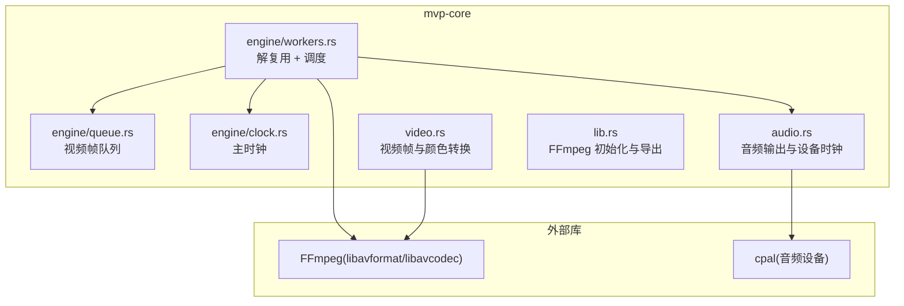
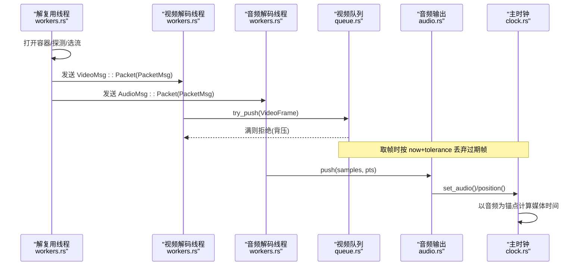
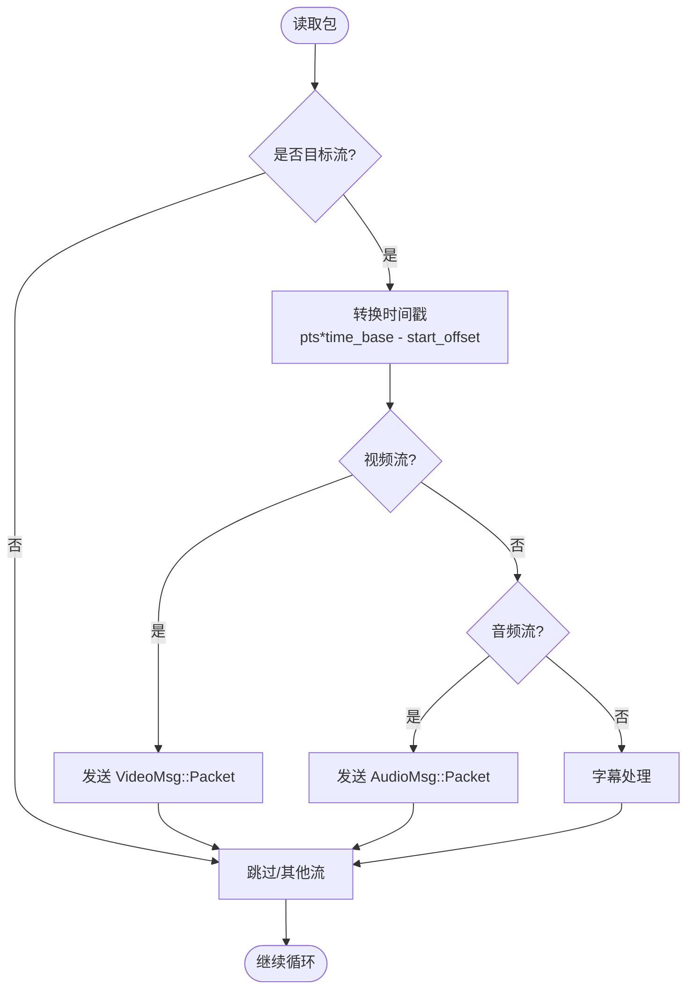
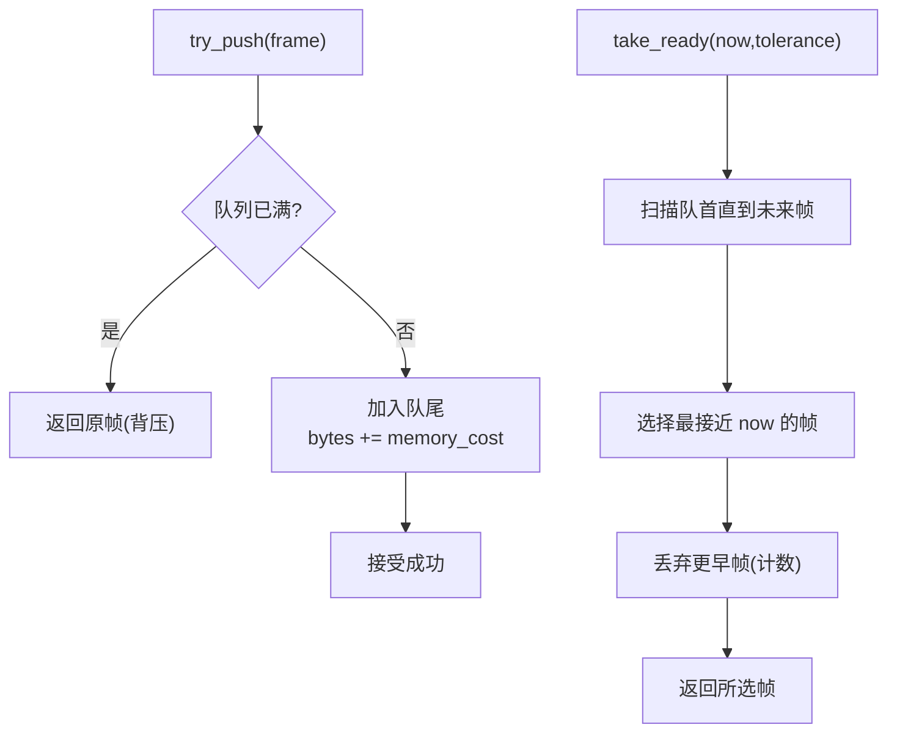
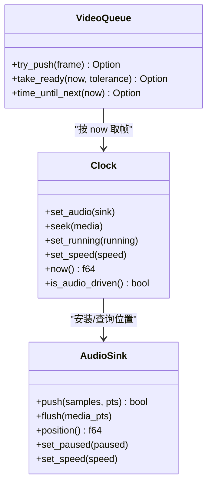
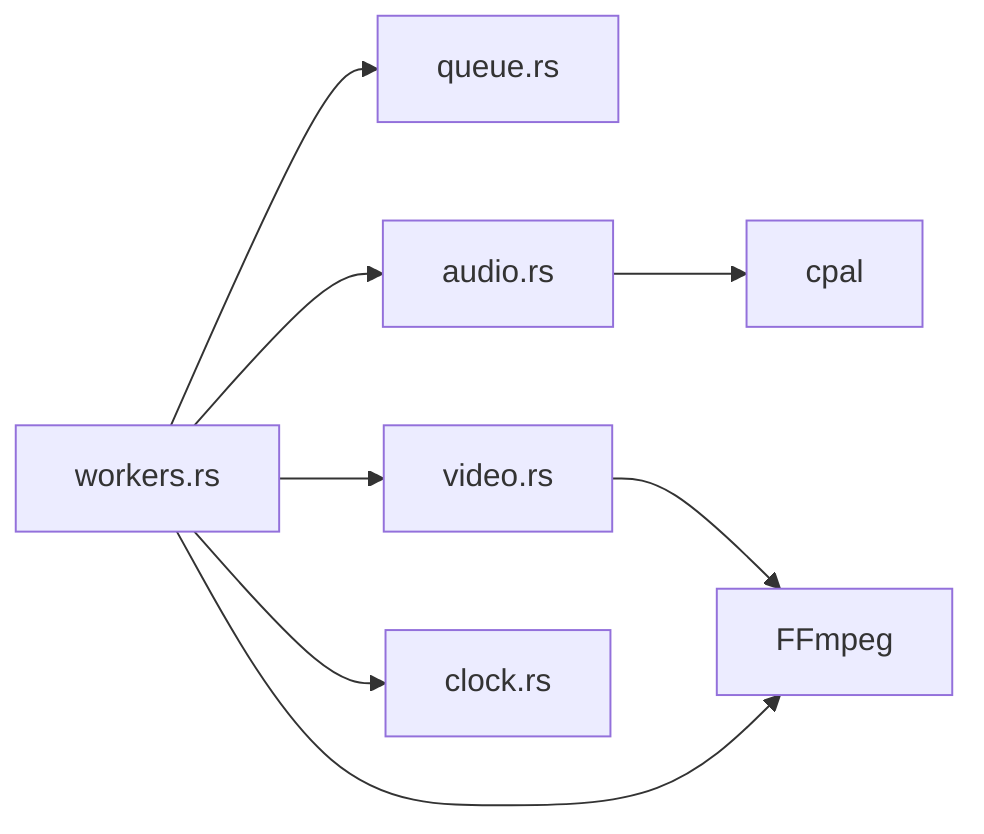

# 播放管线架构

<cite>
**本文引用的文件**   
- [lib.rs](file://crates/mvp-core/src/lib.rs)
- [workers.rs](file://crates/mvp-core/src/engine/workers.rs)
- [queue.rs](file://crates/mvp-core/src/engine/queue.rs)
- [clock.rs](file://crates/mvp-core/src/engine/clock.rs)
- [audio.rs](file://crates/mvp-core/src/audio.rs)
- [video.rs](file://crates/mvp-core/src/video.rs)
</cite>

## 目录
1. [引言](#引言)
2. [项目结构](#项目结构)
3. [核心组件](#核心组件)
4. [架构总览](#架构总览)
5. [详细组件分析](#详细组件分析)
6. [依赖关系分析](#依赖关系分析)
7. [性能考量](#性能考量)
8. [故障排查指南](#故障排查指南)
9. [结论](#结论)
10. [附录](#附录)

## 引言
本文面向“MVP-Versatile-Player”的播放管线，聚焦三线程模型（解复用、视频解码、音频解码）的职责分工与协作机制，解释数据包在管道中的流转、FFmpeg 集成、流选择策略、时间戳处理；说明队列管理机制（VIDEO_PACKET_QUEUE、AUDIO_PACKET_QUEUE）与背压控制；阐述时钟同步（主时钟、音视频同步、延迟补偿）；并提供可定位的代码路径、架构图表、性能调优建议与常见问题解决方案。

## 项目结构
本项目采用多 crate 组织：
- mvp-core：媒体引擎核心，包含 FFmpeg 绑定、解复用、解码、颜色转换、音频输出、时钟与队列等。
- mvp-player：基于 egui 的播放器 UI，驱动 Engine 并渲染画面。
- mvp-subtitle：字幕解析与模型。
- mvp-platform：平台相关能力（电源、单实例等）。

本技术文档重点围绕 mvp-core 的 engine 子模块及其周边组件展开。

**图表来源**
- [workers.rs:134-687](file://crates/mvp-core/src/engine/workers.rs#L134-L687)
- [queue.rs:74-253](file://crates/mvp-core/src/engine/queue.rs#L74-L253)
- [clock.rs:44-158](file://crates/mvp-core/src/engine/clock.rs#L44-L158)
- [audio.rs:154-318](file://crates/mvp-core/src/audio.rs#L154-L318)
- [video.rs:18-55](file://crates/mvp-core/src/video.rs#L18-L55)
- [lib.rs:57-69](file://crates/mvp-core/src/lib.rs#L57-L69)

**章节来源**
- [lib.rs:1-44](file://crates/mvp-core/src/lib.rs#L1-L44)
- [workers.rs:1-103](file://crates/mvp-core/src/engine/workers.rs#L1-L103)

## 核心组件
- 解复用与调度线程（demuxer）：负责打开容器、探测媒体信息、选择音视频/字幕流、读取数据包、分发到视频/音频解码通道，并处理跳转、轨道切换、A-B 循环、结束状态。
- 视频解码工作线程：从视频通道消费 PacketMsg，调用 FFmpeg 解码，进行 YUV→RGBA 转换、HDR 色调映射、Dolby Vision 重塑，产出 VideoFrame 进入视频队列。
- 音频解码工作线程：从音频通道消费 AudioMsg，解码为 PCM，重采样至设备格式，通过 AudioSink 推送到系统音频设备。
- 视频队列（VideoQueue）：有界 FIFO，按字节预算和时间预算限制缓冲深度，提供 take_ready 丢弃过时帧，实现背压。
- 主时钟（Clock）：以墙钟为主，音频设备就绪后以音频位置作为锚点，保证 A/V 同步与平滑暂停/恢复。
- 音频输出（AudioSink）：基于 cpal 的实时输出回调，使用带世代号的队列避免跳转时播放旧数据，提供样本级时钟锚定。

**章节来源**
- [workers.rs:134-687](file://crates/mvp-core/src/engine/workers.rs#L134-L687)
- [queue.rs:74-253](file://crates/mvp-core/src/engine/queue.rs#L74-L253)
- [clock.rs:44-158](file://crates/mvp-core/src/engine/clock.rs#L44-L158)
- [audio.rs:154-318](file://crates/mvp-core/src/audio.rs#L154-L318)
- [video.rs:18-55](file://crates/mvp-core/src/video.rs#L18-L55)

## 架构总览
播放管线由三个主要线程组成，通过跨线程通道和共享状态协作：

**图表来源**
- [workers.rs:281-687](file://crates/mvp-core/src/engine/workers.rs#L281-L687)
- [queue.rs:190-253](file://crates/mvp-core/src/engine/queue.rs#L190-L253)
- [audio.rs:519-618](file://crates/mvp-core/src/audio.rs#L519-L618)
- [clock.rs:123-158](file://crates/mvp-core/src/engine/clock.rs#L123-L158)

## 详细组件分析

### 三线程模型与职责分工
- 解复用线程
  - 打开 FFmpeg 输入上下文，设置探测参数、网络超时、RTSP 传输方式等。
  - 根据 MediaInfo 选择视频、音频、字幕流；若没有音频设备则继续静音播放。
  - 维护 generation 用于丢弃旧会话数据；处理 seek、轨道切换、A-B 循环、EOF。
  - 将 Packet 转换为 PacketMsg（含 timestamp、generation），分别发送到视频/音频通道。
- 视频解码线程
  - 接收 VideoMsg，解码为 AVFrame，进行颜色空间转换、缩放、HDR 色调映射、DV 重塑。
  - 将 RGBA 帧封装为 VideoFrame，放入 VideoQueue。
- 音频解码线程
  - 接收 AudioMsg，解码为 PCM，重采样到设备采样率，生成 AudioChunk。
  - 通过 AudioSink.push 推送，AudioSink 在实时回调中播放并更新时钟锚点。

**章节来源**
- [workers.rs:164-189](file://crates/mvp-core/src/engine/workers.rs#L164-L189)
- [workers.rs:330-417](file://crates/mvp-core/src/engine/workers.rs#L330-L417)
- [workers.rs:602-687](file://crates/mvp-core/src/engine/workers.rs#L602-L687)
- [video.rs:687-706](file://crates/mvp-core/src/video.rs#L687-L706)
- [audio.rs:519-618](file://crates/mvp-core/src/audio.rs#L519-L618)

### 数据包在管道中的流转与时间戳处理
- 时间基与起始偏移
  - 每个流的 time_base 与 start_offset 在首次遇到该流时缓存，后续复用，避免每包重复换算。
- 时间戳转换
  - 将 FFmpeg 包的 pts 乘以 time_base 再减去 start_offset，得到媒体秒级时间戳。
- EOF 与会话隔离
  - 当 demux 读到 EOF，向视频/音频通道各发送一次 Eof{generation}，确保旧会话不会干扰新会话。
- 字幕流
  - 文本字幕累积发布；位图字幕按窗口裁剪，保留最近一段时间内的位图提示。

**图表来源**
- [workers.rs:625-680](file://crates/mvp-core/src/engine/workers.rs#L625-L680)

**章节来源**
- [workers.rs:625-680](file://crates/mvp-core/src/engine/workers.rs#L625-L680)

### 队列管理与背压控制
- VIDEO_PACKET_QUEUE
  - 解复用线程到视频解码线程的有界通道容量，防止解码器被阻塞导致音频也停滞。
- AUDIO_PACKET_QUEUE
  - 解复用线程到音频解码线程的有界通道容量，配合 AudioSink 内部队列做双重缓冲。
- VideoQueue
  - 双预算：字节预算（memory_cost）与时间预算（time_budget）。
  - is_full 判断：达到最大帧数或超过字节预算且至少保留最小帧数。
  - try_push：满则返回原帧，不丢弃旧帧，迫使上游等待（背压）。
  - take_ready/take_ready_counted：按 now+tolerance 取出应展示的帧，丢弃更早的帧以避免越积越晚。
  - time_until_next：供上层决定何时唤醒展示。

**图表来源**
- [queue.rs:190-253](file://crates/mvp-core/src/engine/queue.rs#L190-L253)

**章节来源**
- [workers.rs:25-57](file://crates/mvp-core/src/engine/workers.rs#L25-L57)
- [queue.rs:74-253](file://crates/mvp-core/src/engine/queue.rs#L74-L253)

### 时钟同步与延迟补偿
- 主时钟（Clock）
  - 默认以 wall clock 推进；安装 AudioSink 后，优先以音频设备的 position 作为锚点。
  - 暂停/恢复时冻结 anchor，避免漂移；速度变化时重新锚定，保持位置连续。
- 音频时钟（AudioSink）
  - 首次 push 时建立 anchor_pts 与 anchor_ns；后续按 elapsed * speed 线性推进。
  - 对时间戳跳变（>DISCONTINUITY_THRESHOLD）进行安全重锚定。
  - flush 时提升 flush_generation，使回调丢弃旧数据，避免跳转后播放旧片段。
- 音视频同步策略
  - 视频侧通过 VideoQueue.take_ready(now, tolerance) 对齐主时钟；音频侧由设备驱动实际播放。
  - 当视频队列落后于时钟（RESYNC_LAG），解复用线程会丢弃视频包，让解码尽快追上。

**图表来源**
- [clock.rs:44-158](file://crates/mvp-core/src/engine/clock.rs#L44-L158)
- [audio.rs:519-618](file://crates/mvp-core/src/audio.rs#L519-L618)
- [queue.rs:190-253](file://crates/mvp-core/src/engine/queue.rs#L190-L253)

**章节来源**
- [clock.rs:44-158](file://crates/mvp-core/src/engine/clock.rs#L44-L158)
- [audio.rs:519-618](file://crates/mvp-core/src/audio.rs#L519-L618)
- [workers.rs:201-262](file://crates/mvp-core/src/engine/workers.rs#L201-L262)

### FFmpeg 集成与错误处理
- FFmpeg 初始化
  - init() 懒加载，仅注册编解码器，降低启动开销；日志级别设为 Error。
- 输入选项
  - analyzeduration/probesize/rw_timeout/user_agent；RTSP 走 TCP；网络断开自动重连。
- 中断回调
  - 解复用期间检查 abort/seek_request，支持快速跳转与停止。
- 异常防护
  - 所有入口 catch_unwind，将 panic 转为错误状态，UI 可恢复。

**章节来源**
- [lib.rs:57-69](file://crates/mvp-core/src/lib.rs#L57-L69)
- [workers.rs:164-189](file://crates/mvp-core/src/engine/workers.rs#L164-L189)
- [workers.rs:134-146](file://crates/mvp-core/src/engine/workers.rs#L134-L146)

### 流选择策略
- 视频流
  - 非静态图片时选择第一个视频流；否则无视频。
- 音频流
  - 根据 shared.audio_track 选择：-2 自动（首个）、-1 关闭、>=0 指定索引。
- 字幕流
  - 文本/位图共用一个解码器，按流类型区分处理方式。

**章节来源**
- [workers.rs:330-417](file://crates/mvp-core/src/engine/workers.rs#L330-L417)
- [workers.rs:795-800](file://crates/mvp-core/src/engine/workers.rs#L795-L800)

## 依赖关系分析
- 模块耦合
  - workers.rs 依赖 queue.rs、audio.rs、video.rs、clock.rs 以及 FFmpeg。
  - audio.rs 依赖 cpal 与 dsp 增强链。
  - video.rs 依赖 FFmpeg 与 HDR/Dolby Vision 模块。
- 外部依赖
  - FFmpeg：解复用、解码、颜色转换。
  - cpal：音频设备输出与时序。

**图表来源**
- [workers.rs:1-24](file://crates/mvp-core/src/engine/workers.rs#L1-L24)
- [audio.rs:1-35](file://crates/mvp-core/src/audio.rs#L1-L35)
- [video.rs:1-17](file://crates/mvp-core/src/video.rs#L1-L17)

**章节来源**
- [workers.rs:1-24](file://crates/mvp-core/src/engine/workers.rs#L1-L24)
- [audio.rs:1-35](file://crates/mvp-core/src/audio.rs#L1-L35)
- [video.rs:1-17](file://crates/mvp-core/src/video.rs#L1-L17)

## 性能考量
- 队列预算
  - VideoQueue 同时限制字节与时间，避免高码率/高分辨率下内存爆炸；最小帧数保底，防止抖动卡顿。
- 解码前导
  - VIDEO_LEAD/AUDIO_LEAD 控制解码提前量，兼顾抗抖与响应性；速率变化时减少滞后感。
- 颜色转换与色调映射
  - RgbaConverter 缓存 SwsContext，仅在几何/格式变化时重建；色调映射分块并行，限制线程数避免抢占界面线程。
- 音频输出
  - 优先 48kHz/44.1kHz 稳定时钟；音量渐变避免爆音；实时回调零分配。
- 丢帧策略
  - 视频队列落后 RESYNC_LAG 时丢弃包，避免越积越晚；统计丢弃帧数辅助诊断。

[本节为通用指导，无需特定文件引用]

## 故障排查指南
- 视频卡顿/掉帧
  - 检查 VideoQueue.is_full 与 dropped_frames；适当增大 VIDEO_PACKET_QUEUE 或调整 time_budget。
  - 确认 take_ready 丢弃计数是否异常升高，可能解码跟不上显示。
- 声音断续/爆音
  - 观察 AudioSink.underruns/dropped_chunks；检查设备采样率是否被强制切换；确认 push 是否频繁超时。
- 音视频不同步
  - 检查 Clock.is_audio_driven 是否为真；AudioSink.position 是否与 Clock.now 一致；必要时调整 audio_delay。
- 跳转后无声/黑屏
  - 确认 flush_generation 已提升，回调丢弃旧数据；Eof{generation} 是否正确发送。
- FFmpeg 初始化失败
  - 查看 lib.rs 的 init 返回值；确认系统已安装对应编解码器库。

**章节来源**
- [workers.rs:201-262](file://crates/mvp-core/src/engine/workers.rs#L201-L262)
- [audio.rs:478-505](file://crates/mvp-core/src/audio.rs#L478-L505)
- [clock.rs:123-158](file://crates/mvp-core/src/engine/clock.rs#L123-L158)
- [lib.rs:57-69](file://crates/mvp-core/src/lib.rs#L57-L69)

## 结论
该播放管线通过三线程模型清晰分离了解复用、视频解码与音频解码职责，借助有界队列与时间预算实现稳健的背压控制；主时钟以音频设备为锚点，确保 A/V 同步与平滑控制；FFmpeg 集成与错误处理保证了鲁棒性。整体设计在性能、稳定性与用户体验之间取得良好平衡。

[本节为总结，无需特定文件引用]

## 附录
- 关键常量参考
  - VIDEO_PACKET_QUEUE：视频通道缓冲深度
  - AUDIO_PACKET_QUEUE：音频通道缓冲深度
  - VIDEO_LEAD/AUDIO_LEAD：解码前导时间
  - RESYNC_LAG：视频落后阈值触发丢包
  - DISCONTINUITY_THRESHOLD：音频时钟重锚阈值
- 代码路径速查
  - 解复用主循环：workers.rs:451-687
  - 视频队列逻辑：queue.rs:74-253
  - 主时钟实现：clock.rs:44-158
  - 音频输出与时钟：audio.rs:154-618
  - 视频帧与转换：video.rs:18-706
  - FFmpeg 初始化：lib.rs:57-69

**章节来源**
- [workers.rs:451-687](file://crates/mvp-core/src/engine/workers.rs#L451-L687)
- [queue.rs:74-253](file://crates/mvp-core/src/engine/queue.rs#L74-L253)
- [clock.rs:44-158](file://crates/mvp-core/src/engine/clock.rs#L44-L158)
- [audio.rs:154-618](file://crates/mvp-core/src/audio.rs#L154-L618)
- [video.rs:18-706](file://crates/mvp-core/src/video.rs#L18-L706)
- [lib.rs:57-69](file://crates/mvp-core/src/lib.rs#L57-L69)