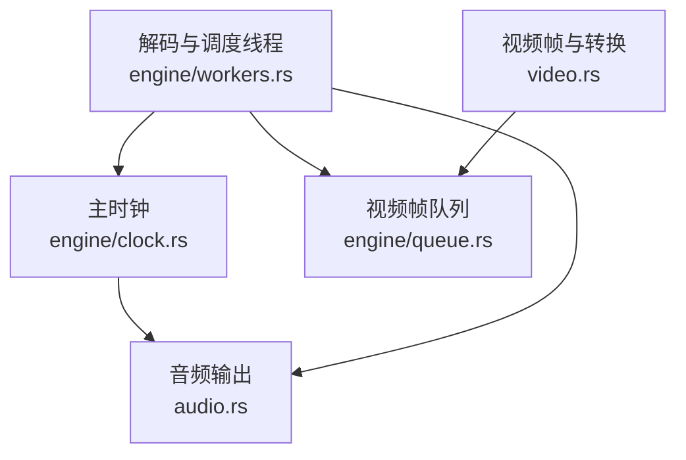
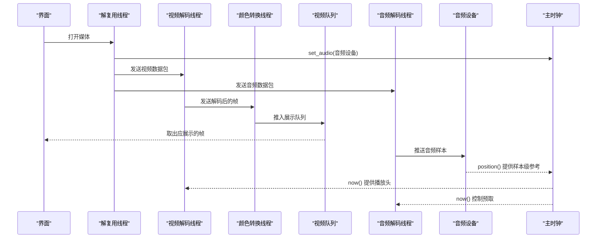
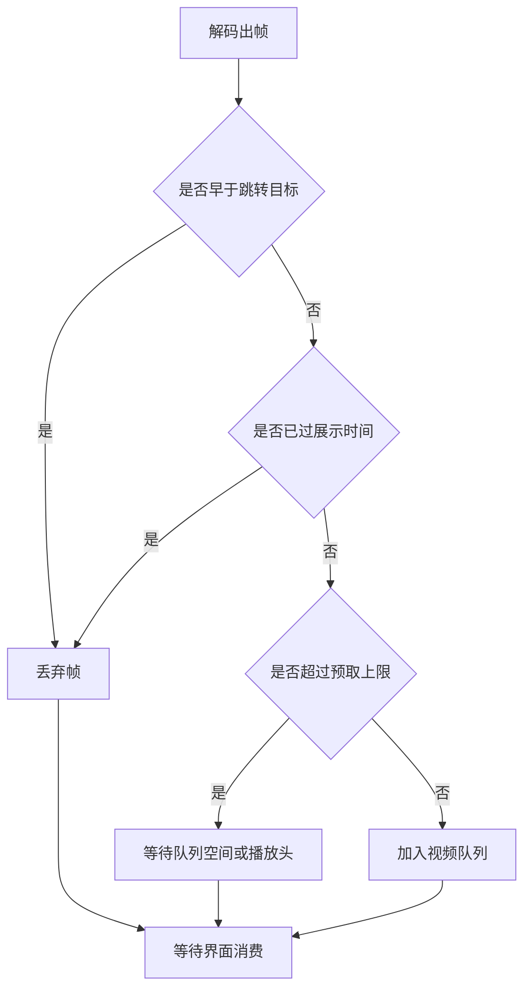
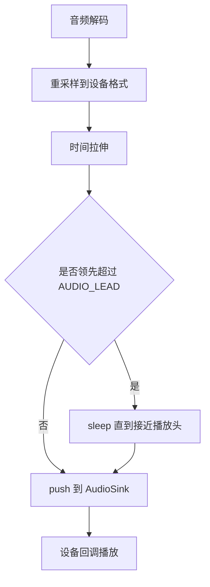
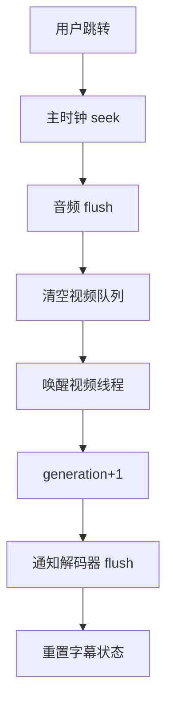
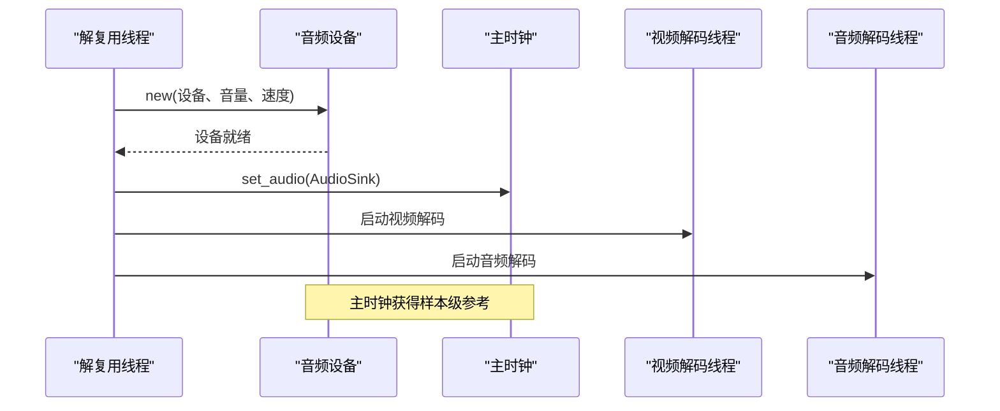
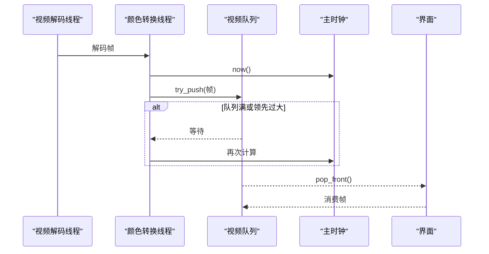
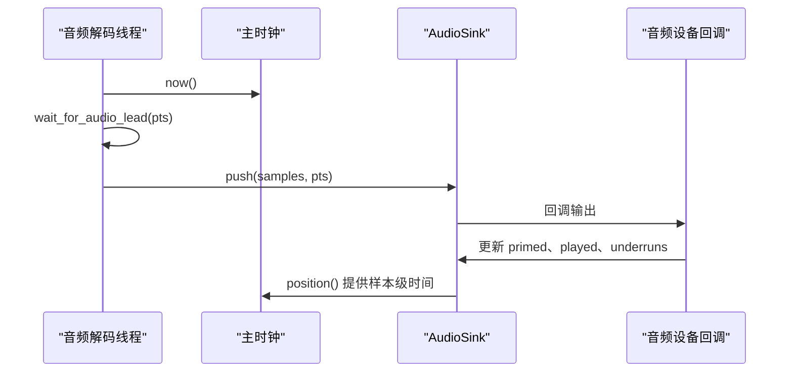

# 时钟同步机制

<cite>
**本文引用的文件**   
- [crates/mvp-core/src/engine/clock.rs](file://crates/mvp-core/src/engine/clock.rs)
- [crates/mvp-core/src/audio.rs](file://crates/mvp-core/src/audio.rs)
- [crates/mvp-core/src/engine/queue.rs](file://crates/mvp-core/src/engine/queue.rs)
- [crates/mvp-core/src/engine/workers.rs](file://crates/mvp-core/src/engine/workers.rs)
- [crates/mvp-core/src/video.rs](file://crates/mvp-core/src/video.rs)
</cite>

## 目录

1. [引言](#引言)
2. [项目结构与时钟相关模块](#项目结构与时钟相关模块)
3. [核心组件总览](#核心组件总览)
4. [架构总览：主时钟、音视频解码与渲染管线](#架构总览主时钟音视频解码与渲染管线)
5. [主时钟实现原理](#主时钟实现原理)
6. [音视频同步策略](#音视频同步策略)
7. [时钟状态管理](#时钟状态管理)
8. [与解码器的协调机制](#与解码器的协调机制)
9. [关键流程时序图](#关键流程时序图)
10. [性能特征与延迟分析](#性能特征与延迟分析)
11. [同步精度优化建议](#同步精度优化建议)
12. [故障排查指南](#故障排查指南)
13. [结论](#结论)

## 引言

本文件聚焦于该播放器中的“时钟同步机制”，目标是解释以下问题：

- 主时钟如何维护系统时间基准。
- 播放头推进算法如何实现暂停、恢复、变速和跳转。
- 视频显示同步与音频播放同步分别依赖什么时间源。
- 延迟补偿、预取缓冲、跳帧策略如何工作。
- 时钟状态 `running`、`seek`、时间戳校正如何影响整体播放。
- 解码器、重采样器、时间拉伸器、音频设备回调如何与主时钟协作。
- 如何在现有实现基础上进一步提升同步精度并降低延迟。

从代码组织看，时钟逻辑并非集中在单一类中，而是由“主时钟抽象”“音频输出设备时钟”“视频队列与展示缓冲”“解复用与解码线程”共同构成一个多阶段流水线。主时钟负责对外暴露统一的媒体时间；音频设备提供样本级参考；视频侧通过队列和时间预算控制展示节奏；解码线程根据主时钟决定何时丢弃、何时等待、何时推进。

## 项目结构与时钟相关模块

与“时钟同步”直接相关的核心文件如下：

| 文件 | 职责 | 与同步的关系 |
|---|---|---|
| `engine/clock.rs` | 主时钟 `Clock` | 对外统一暴露媒体时间，封装运行状态、速度、音频引用。 |
| `audio.rs` | 音频输出 `AudioSink` | 提供样本级位置、暂停/恢复、变速、flush、丢包统计。 |
| `engine/queue.rs` | 视频帧队列 `VideoQueue` | 控制展示缓冲大小、时间预算、过期帧丢弃。 |
| `engine/workers.rs` | 解复用、视频解码、颜色转换、音频解码线程 | 将主时钟与解码、重采样、展示串联起来。 |
| `video.rs` | 视频帧结构与 RGBA 转换 | 定义帧 PTS、内存成本、转换开销，间接影响队列与同步。 |



**图表来源**  
- [crates/mvp-core/src/engine/clock.rs:1-158](file://crates/mvp-core/src/engine/clock.rs#L1-L158)
- [crates/mvp-core/src/audio.rs:1-116](file://crates/mvp-core/src/audio.rs#L1-L116)
- [crates/mvp-core/src/engine/queue.rs:67-253](file://crates/mvp-core/src/engine/queue.rs#L67-L253)
- [crates/mvp-core/src/engine/workers.rs:25-129](file://crates/mvp-core/src/engine/workers.rs#L25-L129)
- [crates/mvp-core/src/video.rs:18-55](file://crates/mvp-core/src/video.rs#L18-L55)

**章节来源**  
- [crates/mvp-core/src/engine/clock.rs:1-158](file://crates/mvp-core/src/engine/clock.rs#L1-L158)
- [crates/mvp-core/src/audio.rs:1-116](file://crates/mvp-core/src/audio.rs#L1-L116)
- [crates/mvp-core/src/engine/queue.rs:67-253](file://crates/mvp-core/src/engine/queue.rs#L67-L253)
- [crates/mvp-core/src/engine/workers.rs:25-129](file://crates/mvp-core/src/engine/workers.rs#L25-L129)
- [crates/mvp-core/src/video.rs:18-55](file://crates/mvp-core/src/video.rs#L18-L55)

## 核心组件总览

### 主时钟 `Clock`

主时钟是播放器对外统一的“媒体时间”来源。它内部维护：

- `anchor_media`：当前墙钟周期对应的媒体起始时间。
- `anchor_instant`：当前墙钟周期的起点。
- `running`：是否推进。
- `speed`：播放速率。
- `audio`：可选的音频输出设备引用。
- `last_audio_position`：最近一次读取到的音频位置。
- `last_audio_advance`：最近一次读取音频位置的瞬间。
- `audio_engaged`：音频时钟是否已参与驱动。

主时钟的核心设计原则是：**墙钟是主时钟，音频设备是参考**。音频设备本身可能因为驱动回调吞掉大量样本、回调频率不稳定而不适合作为绝对时间源；但它在样本级上最接近真实播放位置。因此，主时钟用墙钟计算线性推进，同时把音频设备作为锚点校准依据。

### 音频输出 `AudioSink`

`AudioSink` 是真正的样本级时间源。它通过音频设备回调输出数据，并在回调中记录：

- 已播放帧数（仅用于统计）。
- 是否已真正开始播放。
- 暂停状态与暂停时刻。
- flush generation，用于处理 seek 后丢弃旧数据。
- 音量、静音、速度等实时参数。

关键点在于：`AudioSink::position()` 不是简单计数设备写入了多少样本，而是基于“锚点媒体时间 + 墙钟经过时间 × 速度”计算当前位置。这样即使驱动一次回调写入多个毫秒甚至秒级的音频，也不会让时钟跑飞。

### 视频队列 `VideoQueue`

视频队列是一个有界 FIFO，限制条件包括：

- 最大帧数。
- 像素字节预算。
- 可选的时间预算：允许解码器领先播放头多少秒。
- 最小帧数：保证至少有两个帧，避免单帧缓冲导致卡顿。

队列还提供：

- `take_ready(now, tolerance)`：取出所有不晚于 `now + tolerance` 的最老可展示帧。
- `time_until_next(now)`：下一个帧还需要等待多久。
- `is_full()`：判断是否应该停止解码器继续生产。

### 解码与调度线程 `workers.rs`

`workers.rs` 是时钟同步的实际执行层：

- 解复用线程负责读取数据包，并根据视频/音频流类型发送到对应通道。
- 视频解码线程负责解码、硬件帧下载、时间戳修正、丢弃过期帧。
- 颜色转换线程负责 YUV→RGBA、HDR 色调映射、杜比视界重塑。
- 音频解码线程负责解码、重采样、时间拉伸、按主时钟对齐后送入设备。

**章节来源**  
- [crates/mvp-core/src/engine/clock.rs:25-158](file://crates/mvp-core/src/engine/clock.rs#L25-L158)
- [crates/mvp-core/src/audio.rs:76-116](file://crates/mvp-core/src/audio.rs#L76-L116)
- [crates/mvp-core/src/engine/queue.rs:67-253](file://crates/mvp-core/src/engine/queue.rs#L67-L253)
- [crates/mvp-core/src/engine/workers.rs:25-129](file://crates/mvp-core/src/engine/workers.rs#L25-L129)

## 架构总览：主时钟、音视频解码与渲染管线



**图表来源**  
- [crates/mvp-core/src/engine/workers.rs:330-417](file://crates/mvp-core/src/engine/workers.rs#L330-L417)
- [crates/mvp-core/src/engine/workers.rs:906-1106](file://crates/mvp-core/src/engine/workers.rs#L906-L1106)
- [crates/mvp-core/src/engine/workers.rs:1297-1447](file://crates/mvp-core/src/engine/workers.rs#L1297-L1447)
- [crates/mvp-core/src/engine/workers.rs:1719-2095](file://crates/mvp-core/src/engine/workers.rs#L1719-L2095)
- [crates/mvp-core/src/engine/clock.rs:65-158](file://crates/mvp-core/src/engine/clock.rs#L65-L158)
- [crates/mvp-core/src/audio.rs:519-618](file://crates/mvp-core/src/audio.rs#L519-L618)

## 主时钟实现原理

### 系统时间基准

主时钟使用两种时间源：

1. **墙钟**：基于 `Instant`，单调且精确，用于线性推进播放头。
2. **音频设备位置**：当音频可用时，作为样本级参考，用于校准主时钟。

主时钟的 `compute` 方法在每次查询 `now()` 时：

- 克隆音频设备引用。
- 如果存在音频设备，读取其 `position()`。
- 更新 `last_audio_position`、`last_audio_advance`、`audio_engaged`。
- 如果未运行，返回 `anchor_media`。
- 如果运行，返回 `anchor_media + elapsed * speed`。

这意味着：**主时钟本质上是墙钟驱动的线性时间轴，音频设备只影响锚点和是否认为音频已参与驱动。**

### 播放头推进算法

播放头推进公式可以概括为：

```
播放头 = 锚点媒体时间 + (当前墙钟 - 锚点墙钟) × 播放速度
```

其中：

- 锚点媒体时间是当前运行周期开始时对应的媒体时间。
- 锚点墙钟是当前运行周期开始时的 `Instant`。
- 播放速度默认是 `1.0`，可通过 `set_speed` 调整。
- 暂停时 `running=false`，播放头不再推进。

这个设计避免了直接使用音频设备回调次数或写入样本数作为时间源，因为驱动可能一次性吞掉大量音频，也可能长时间不调用回调但仍继续播放已有缓冲。

### 暂停与恢复状态管理

暂停与恢复通过 `set_running` 控制：

- 切换前会先计算当前时间。
- 将 `anchor_media` 固定到当前值。
- 重置 `anchor_instant`。
- 设置 `running`。

这样暂停时播放头冻结，恢复时从暂停点继续推进，不会跳跃。

**章节来源**  
- [crates/mvp-core/src/engine/clock.rs:25-158](file://crates/mvp-core/src/engine/clock.rs#L25-L158)

## 音视频同步策略

### 基于主时钟的视频显示同步

视频侧并不直接以音频设备为展示时间源，而是：

1. 解码线程获取帧 PTS。
2. 颜色转换线程检查主时钟 `shared.clock.now()`。
3. 如果帧太早，进入队列等待。
4. 如果帧已经过旧，则丢弃。
5. 队列最多允许解码器领先 `VIDEO_LEAD` 秒。



**图表来源**  
- [crates/mvp-core/src/engine/workers.rs:1137-1266](file://crates/mvp-core/src/engine/workers.rs#L1137-L1266)
- [crates/mvp-core/src/engine/workers.rs:1393-1440](file://crates/mvp-core/src/engine/workers.rs#L1393-L1440)
- [crates/mvp-core/src/engine/queue.rs:212-253](file://crates/mvp-core/src/engine/queue.rs#L212-L253)

### 音频播放同步

音频侧更接近传统“音频驱动”模型，但做了更稳健的处理：

1. 音频解码线程解码出一帧音频。
2. 重采样到设备采样率。
3. 时间拉伸器按当前速度处理。
4. 计算音频帧 PTS 与主时钟 `now()` 的差值。
5. 如果音频领先太多，等待直到不超过 `AUDIO_LEAD`。
6. 将样本推入 `AudioSink`。
7. `AudioSink` 在设备回调中根据锚点与墙钟计算实际播放位置。



**图表来源**  
- [crates/mvp-core/src/engine/workers.rs:1909-2095](file://crates/mvp-core/src/engine/workers.rs#L1909-L2095)
- [crates/mvp-core/src/audio.rs:519-618](file://crates/mvp-core/src/audio.rs#L519-L618)

### 延迟补偿算法

延迟补偿主要体现在三个层面：

| 层级 | 机制 | 作用 |
|---|---|---|
| 视频预取 | `VIDEO_LEAD=0.5` 秒 | 允许解码器提前解码，吸收屏幕刷新抖动。 |
| 音频预取 | `AUDIO_LEAD=0.5` 秒 | 允许音频解码器提前处理，避免设备欠载。 |
| 队列时间预算 | `VideoQueue.with_time_budget` | 限制解码器领先播放头的媒体秒数。 |
| 重采样余量 | `RESAMPLE_MARGIN=4096` 帧 | 覆盖重采样器滤波器延迟，避免截断输出。 |
| 跳帧阈值 | `RESYNC_LAG=0.25` 秒 | 当视频队列落后时跳过数据包，恢复播放进度。 |

这些常量共同构成“缓冲—预测—补偿—丢弃”的闭环：缓冲吸收抖动，预测控制响应性，补偿维持同步，丢弃防止越落越远。

**章节来源**  
- [crates/mvp-core/src/engine/workers.rs:67-129](file://crates/mvp-core/src/engine/workers.rs#L67-L129)
- [crates/mvp-core/src/engine/queue.rs:103-147](file://crates/mvp-core/src/engine/queue.rs#L103-L147)
- [crates/mvp-core/src/engine/workers.rs:1909-1934](file://crates/mvp-core/src/engine/workers.rs#L1909-L1934)

## 时钟状态管理

### `running` 标志

`running` 表示主时钟是否推进。它不是音频设备的 pause/play 状态，也不是解码器是否解码的状态，而是“媒体时间是否线性增长”的标志。

- 暂停时，`now()` 返回固定值。
- 恢复时，从暂停点继续。
- 文件结束时，主时钟停止。
- 循环播放时，重新 seek 到开头并恢复。

### `seek` 操作处理

`seek` 不仅改变主时钟，还触发一系列清理：

1. 更新 `anchor_media` 和 `anchor_instant`。
2. 更新音频侧 `last_audio_position`。
3. 调用 `AudioSink::flush(media_pts)`。
4. 清空视频队列。
5. 唤醒视频线程。
6. 递增 decode session 的 `generation`。
7. 向音视频解码器发送 flush 请求。
8. 清理图形字幕窗口。
9. 重置字幕解码器。



**图表来源**  
- [crates/mvp-core/src/engine/clock.rs:74-84](file://crates/mvp-core/src/engine/clock.rs#L74-L84)
- [crates/mvp-core/src/engine/workers.rs:474-536](file://crates/mvp-core/src/engine/workers.rs#L474-L536)
- [crates/mvp-core/src/audio.rs:586-602](file://crates/mvp-core/src/audio.rs#L586-L602)

### 时间戳校正

时间戳校正发生在多个阶段：

| 阶段 | 校正方式 | 原因 |
|---|---|---|
| 容器时间基 | `stream_start_offset` | 容器时间可能不从 0 开始。 |
| 视频 PTS | `frame.pts * time_base - start_offset` | 将原始 PTS 转换为媒体秒。 |
| 无 PTS 视频帧 | 回退到上一帧 PTS + 帧步长 | 硬件解码可能不带 PTS。 |
| 音频 PTS | 同样使用 `time_base - start_offset` | 保持音视频时间域一致。 |
| 音频锚点 | `pts - queued_seconds * speed` | 把解码端远端的 PTS 折算成即将听到的媒体时间。 |
| 音频 discontinuity | 差值超过 `DISCONTINUITY_THRESHOLD` 时重新锚定 | 防止损坏时间戳或 seek 后漂移。 |

**章节来源**  
- [crates/mvp-core/src/engine/workers.rs:830-877](file://crates/mvp-core/src/engine/workers.rs#L830-L877)
- [crates/mvp-core/src/engine/workers.rs:1187-1224](file://crates/mvp-core/src/engine/workers.rs#L1187-L1224)
- [crates/mvp-core/src/engine/workers.rs:1975-2003](file://crates/mvp-core/src/engine/workers.rs#L1975-L2003)
- [crates/mvp-core/src/audio.rs:534-550](file://crates/mvp-core/src/audio.rs#L534-L550)

## 与解码器的协调机制

### 解码器预取控制

视频侧通过两个层次控制预取：

1. **解码线程到颜色转换线程**：通过 `VIDEO_SOURCE_QUEUE=4` 的通道缓冲。
2. **颜色转换线程到展示队列**：通过 `VideoQueue` 的字节预算、帧数预算、时间预算。

视频解码线程不会无限解码；当队列已满或领先超过 `VIDEO_LEAD` 时，它会等待。

音频侧通过 `wait_for_audio_lead` 控制预取：

- 计算音频帧 PTS 与主时钟的差值。
- 除以当前速度，得到真实时间差。
- 如果超过 `AUDIO_LEAD`，sleep 直到接近阈值。
- 这确保音频不会堆积过多，否则变速变化会被积压缓冲延迟感知。

### 播放头预测

播放头预测主要由主时钟完成：

- 视频侧用 `shared.clock.now()` 判断帧是否该展示。
- 音频侧用 `shared.clock.now()` 判断音频是否领先。
- 解复用线程用 `shared.clock.now()` 判断视频队列是否落后。
- 结束判断也依赖主时钟是否接近媒体时长。

### 缓冲管理

缓冲管理的关键规则：

- 视频队列从不为了腾空间丢弃最老的帧，因为最老帧正是界面即将展示的帧。
- 如果队列满，新帧被拒绝，解码器必须等待。
- 如果视频队列落后超过 `RESYNC_LAG`，解复用线程会丢弃后续视频数据包，而不是阻塞整个管道。
- 音频侧通过 flush generation 丢弃旧数据，保留新位置的数据。
- 图形字幕窗口有字节数和条目数上限，防止内存泄漏。

**章节来源**  
- [crates/mvp-core/src/engine/workers.rs:25-73](file://crates/mvp-core/src/engine/workers.rs#L25-L73)
- [crates/mvp-core/src/engine/workers.rs:201-262](file://crates/mvp-core/src/engine/workers.rs#L201-L262)
- [crates/mvp-core/src/engine/workers.rs:1382-1440](file://crates/mvp-core/src/engine/workers.rs#L1382-L1440)
- [crates/mvp-core/src/engine/workers.rs:1909-1934](file://crates/mvp-core/src/engine/workers.rs#L1909-L1934)
- [crates/mvp-core/src/engine/queue.rs:180-253](file://crates/mvp-core/src/engine/queue.rs#L180-L253)

## 关键流程时序图

### 播放启动与主时钟建立



**图表来源**  
- [crates/mvp-core/src/engine/workers.rs:366-417](file://crates/mvp-core/src/engine/workers.rs#L366-L417)
- [crates/mvp-core/src/engine/clock.rs:65-72](file://crates/mvp-core/src/engine/clock.rs#L65-L72)

### 视频展示同步



**图表来源**  
- [crates/mvp-core/src/engine/workers.rs:1297-1447](file://crates/mvp-core/src/engine/workers.rs#L1297-L1447)
- [crates/mvp-core/src/engine/queue.rs:190-253](file://crates/mvp-core/src/engine/queue.rs#L190-L253)

### 音频同步与设备回调



**图表来源**  
- [crates/mvp-core/src/engine/workers.rs:1909-2095](file://crates/mvp-core/src/engine/workers.rs#L1909-L2095)
- [crates/mvp-core/src/audio.rs:356-461](file://crates/mvp-core/src/audio.rs#L356-L461)
- [crates/mvp-core/src/audio.rs:519-618](file://crates/mvp-core/src/audio.rs#L519-L618)

## 性能特征与延迟分析

### 主要延迟来源

| 来源 | 典型范围 | 说明 |
|---|---:|---|
| 视频解码 | 几毫秒到几十毫秒 | 取决于分辨率、编码复杂度、硬件加速。 |
| 颜色转换 | 几毫秒到几十毫秒 | 4K、HDR、杜比视界重塑会增加 CPU 压力。 |
| 视频队列等待 | 动态 | 受 `VIDEO_LEAD`、界面刷新、GPU 上传影响。 |
| 音频重采样 | 几毫秒 | 取决于输入采样率与设备采样率差异。 |
| 音频设备缓冲 | 几毫秒到几十毫秒 | 由驱动和操作系统音频栈决定。 |
| 主时钟误差 | 极低 | 使用单调墙钟，误差主要来自音频锚点校准。 |

### 关键常量对延迟的影响

| 常量 | 默认值 | 影响 |
|---|---:|---|
| `VIDEO_PACKET_QUEUE` | 48 | 解复用到视频解码的包缓冲深度。 |
| `VIDEO_SOURCE_QUEUE` | 4 | 解码到颜色转换之间的帧缓冲。 |
| `VIDEO_LEAD` | 0.5 秒 | 视频解码领先播放头的上限。 |
| `AUDIO_PACKET_QUEUE` | 192 | 解复用到音频解码的包缓冲深度。 |
| `AUDIO_LEAD` | 0.5 秒 | 音频解码领先播放头的上限。 |
| `RESYNC_LAG` | 0.25 秒 | 视频落后阈值，超过后跳过数据包。 |
| `RESAMPLE_MARGIN` | 4096 帧 | 重采样输出余量。 |
| `CONTROL_POLL` | 50 毫秒 | 控制消息轮询间隔。 |
| `WORKER_POLL` | 25 毫秒 | 工作线程超时轮询间隔。 |

**章节来源**  
- [crates/mvp-core/src/engine/workers.rs:25-129](file://crates/mvp-core/src/engine/workers.rs#L25-L129)
- [crates/mvp-core/src/engine/queue.rs:88-147](file://crates/mvp-core/src/engine/queue.rs#L88-L147)

## 同步精度优化建议

### 1. 优先稳定音频设备采样率

代码已经主动选择 48 kHz 或 44.1 kHz，避免某些设备默认 192 kHz 导致的回调过快和时钟漂移。这是提升同步精度的基础。

建议：

- 保持设备采样率稳定。
- 避免频繁切换音频设备。
- 监控 `underruns` 和 `dropped_chunks`，发现异常时提示用户。

### 2. 合理调整 `VIDEO_LEAD` 和 `AUDIO_LEAD`

当前 0.5 秒是平衡响应性和鲁棒性的折中。对于低延迟场景：

- 可降低 `VIDEO_LEAD`，减少 seek 和变速响应延迟。
- 可降低 `AUDIO_LEAD`，让变速更快生效。
- 但要增加对网络抖动、磁盘抖动的容忍度。

### 3. 优化视频队列时间预算

`VideoQueue::with_time_budget` 允许按媒体秒限制缓冲。对于交互式播放：

- 设置较小的时间预算，例如 0.1~0.25 秒。
- 结合 `set_pacing(fps)`，让时间预算转为帧数。
- 注意不要低于最小帧数，否则会失去缓冲能力。

### 4. 利用音频 discontinuity 阈值

`DISCONTINUITY_THRESHOLD=0.30` 秒用于检测时间戳突变。如果媒体时间戳质量较差：

- 可适当增大阈值，避免频繁重锚定。
- 但过大会掩盖真实的 seek 或轨道切换。
- 最好结合日志观察 `anchor_pts` 和 `queued_seconds`。

### 5. 减少不必要的颜色转换和 HDR 处理

视频转换路径包含缩放、色调映射、杜比视界重塑。如果不需要：

- 关闭 HDR 色调映射。
- 关闭杜比视界重塑。
- 避免每帧重建转换上下文。

### 6. 控制解码线程并行度

软件解码默认限制线程数，避免独占所有 CPU 核。对于高性能机器：

- 可根据核心数适当调整。
- 但不要超过界面、音频、解复用线程的资源需求。

**章节来源**  
- [crates/mvp-core/src/audio.rs:698-743](file://crates/mvp-core/src/audio.rs#L698-L743)
- [crates/mvp-core/src/engine/queue.rs:103-147](file://crates/mvp-core/src/engine/queue.rs#L103-L147)
- [crates/mvp-core/src/engine/workers.rs:1675-1699](file://crates/mvp-core/src/engine/workers.rs#L1675-L1699)
- [crates/mvp-core/src/video.rs:651-675](file://crates/mvp-core/src/video.rs#L651-L675)

## 故障排查指南

### 现象：画面卡住但进度条还在走

可能原因：

- 视频解码没有输出帧。
- 解码线程检测到“解码无输出”。
- 文件损坏或容器误判。
- 硬件解码池耗尽。

排查步骤：

1. 查看是否出现“解码无输出”错误。
2. 检查 `decoded_frames` 是否增长。
3. 检查是否启用了硬件解码。
4. 检查是否有频繁的 seek。

**章节来源**  
- [crates/mvp-core/src/engine/workers.rs:1094-1103](file://crates/mvp-core/src/engine/workers.rs#L1094-L1103)

### 现象：声音中断或卡顿

可能原因：

- 音频设备欠载。
- 音频队列满，解码器被背压。
- 设备回调无法及时消费。
- 重采样配置异常。

排查步骤：

1. 查看 `underruns` 是否上升。
2. 查看 `dropped_chunks` 是否上升。
3. 检查设备采样率和声道数。
4. 检查是否频繁切换音轨。

**章节来源**  
- [crates/mvp-core/src/audio.rs:478-506](file://crates/mvp-core/src/audio.rs#L478-L506)
- [crates/mvp-core/src/audio.rs:519-575](file://crates/mvp-core/src/audio.rs#L519-L575)

### 现象：seek 后声音或画面错位

可能原因：

- flush generation 不一致。
- 旧数据包仍在通道中。
- 音频或视频解码器未正确 reset。
- 时间戳校正失败。

排查步骤：

1. 检查 `generation` 是否递增。
2. 检查 `seek_target` 是否正确清除。
3. 检查 `last_pts` 是否重置。
4. 检查 `AudioSink::flush` 是否被调用。

**章节来源**  
- [crates/mvp-core/src/engine/workers.rs:1108-1135](file://crates/mvp-core/src/engine/workers.rs#L1108-L1135)
- [crates/mvp-core/src/engine/workers.rs:1881-1907](file://crates/mvp-core/src/engine/workers.rs#L1881-L1907)
- [crates/mvp-core/src/audio.rs:586-602](file://crates/mvp-core/src/audio.rs#L586-L602)

### 现象：变速后声音延迟变化明显

可能原因：

- 音频缓冲中有历史速度下的数据。
- `stretcher` 尚未同步到新速度。
- `AUDIO_LEAD` 较大，导致变速效果滞后。

排查步骤：

1. 检查 `stretcher.speed()` 是否与主时钟速度一致。
2. 检查 `wait_for_audio_lead` 是否因缓冲过长而 sleep。
3. 降低 `AUDIO_LEAD` 测试响应性。

**章节来源**  
- [crates/mvp-core/src/engine/workers.rs:1953-1956](file://crates/mvp-core/src/engine/workers.rs#L1953-L1956)
- [crates/mvp-core/src/engine/workers.rs:2083-2094](file://crates/mvp-core/src/engine/workers.rs#L2083-L2094)

## 结论

该播放器的时钟同步机制采用“主时钟 + 音频设备参考 + 视频队列缓冲”的分层设计：

- 主时钟提供统一、单调、可暂停、可变速的媒体时间。
- 音频设备提供样本级参考，但不直接驱动主时钟。
- 视频侧通过队列和预取上限控制展示节奏。
- 音频侧通过重采样、时间拉伸和预取等待控制播放节奏。
- seek、flush generation、时间戳校正共同保证多阶段管道的状态一致性。
- 常量如 `VIDEO_LEAD`、`AUDIO_LEAD`、`RESYNC_LAG`、`DISCONTINUITY_THRESHOLD` 构成了同步精度与延迟之间的可调边界。

对于进一步优化，重点应放在：

- 稳定音频设备采样率。
- 根据场景调整预取缓冲。
- 减少不必要的视频转换。
- 监控 underrun、drop、decode stall 等指标。
- 在交互性强和播放稳定性之间找到合适的平衡点。

这套机制已经具备工业级播放器的基本特征：样本级音频参考、墙钟线性推进、多阶段缓冲、seek 安全、变速兼容、错误可恢复。文档读者可以在理解上述分层之后，针对自己的业务场景调整常量、扩展统计信息，或替换底层音频后端而不破坏整体同步语义。