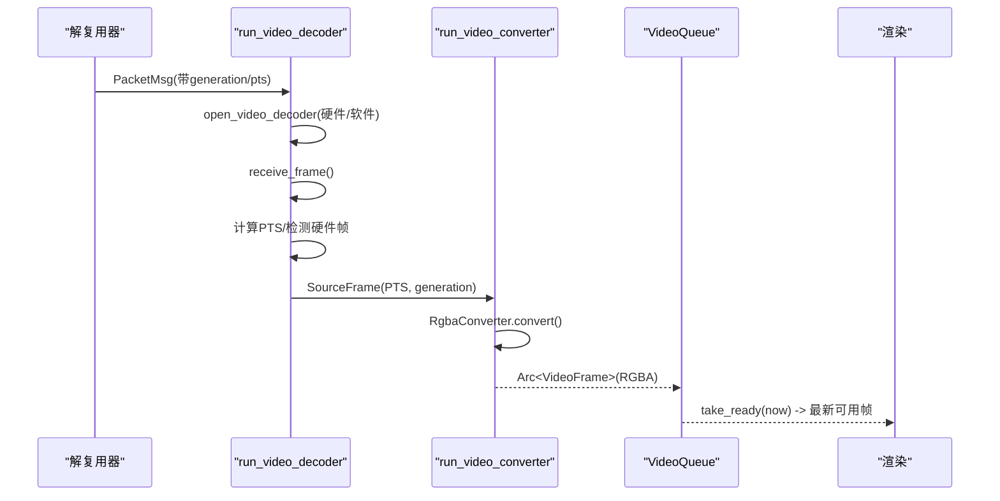
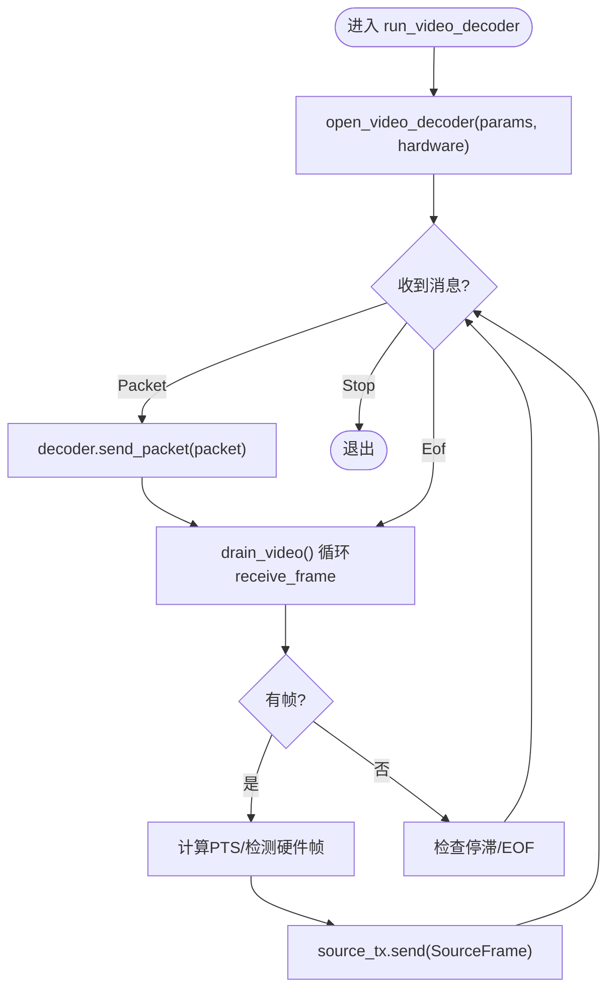
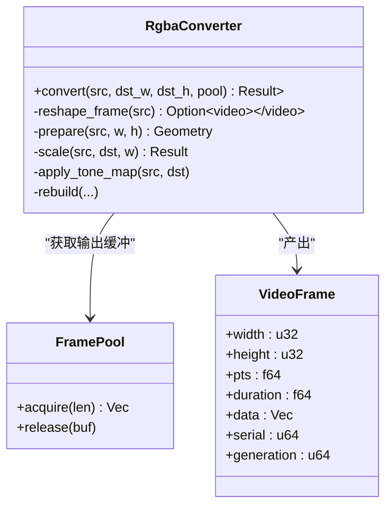
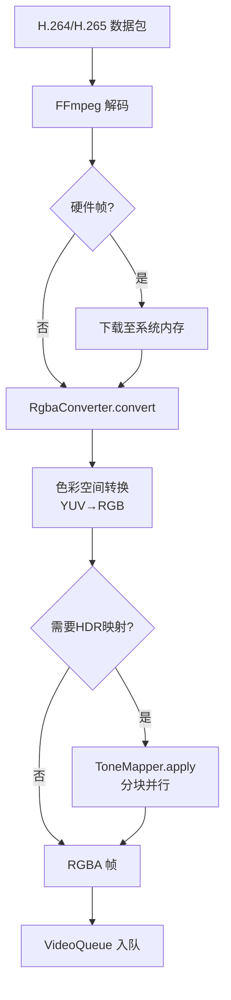
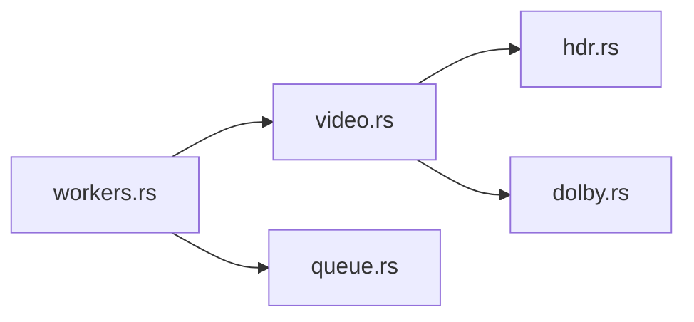

# 视频解码线程

<cite>
**本文引用的文件**
- [workers.rs](file://crates/mvp-core/src/engine/workers.rs)
- [video.rs](file://crates/mvp-core/src/video.rs)
- [queue.rs](file://crates/mvp-core/src/engine/queue.rs)
- [hdr.rs](file://crates/mvp-core/src/hdr.rs)
- [dolby.rs](file://crates/mvp-core/src/dolby.rs)
</cite>

## 目录
1. [简介](#简介)
2. [项目结构](#项目结构)
3. [核心组件](#核心组件)
4. [架构总览](#架构总览)
5. [详细组件分析](#详细组件分析)
6. [依赖关系分析](#依赖关系分析)
7. [性能考量](#性能考量)
8. [故障排查指南](#故障排查指南)
9. [结论](#结论)
10. [附录：关键流程与代码片段路径](#附录：关键流程与代码片段路径)

## 简介
本文档聚焦于视频解码线程的实现，围绕 run_video_decoder 函数展开，系统阐述 FFmpeg 视频解码器初始化、硬件/软件解码路径选择、帧缓冲管理；并详细说明从原始 H.264/H.265 数据到 RGB 的转换流程（色彩空间转换、HDR 色调映射）；解释 SourceFrame 结构体的设计（引用计数、时间戳关联、生成号追踪）；说明与颜色转换器的协作机制（双阶段处理避免 CPU/GPU 等待、VIDEO_SOURCE_QUEUE 缓冲策略）。最后提供硬件加速配置与性能调优建议。

## 项目结构
本项目采用多 crate 分层组织，视频解码相关逻辑集中在 mvp-core 中：
- 解码工作线程与消息通道：engine/workers.rs
- 视频帧结构与颜色转换：video.rs
- 队列与消息类型：engine/queue.rs
- HDR/Dolby Vision 支持：hdr.rs、dolby.rs

图表来源
- [workers.rs:906-1106](file://crates/mvp-core/src/engine/workers.rs#L906-L1106)
- [workers.rs:1449-1586](file://crates/mvp-core/src/engine/workers.rs#L1449-L1586)
- [video.rs:548-706](file://crates/mvp-core/src/video.rs#L548-L706)
- [queue.rs:67-253](file://crates/mvp-core/src/engine/queue.rs#L67-L253)

章节来源
- [workers.rs:1-133](file://crates/mvp-core/src/engine/workers.rs#L1-L133)
- [video.rs:1-55](file://crates/mvp-core/src/video.rs#L1-L55)
- [queue.rs:1-66](file://crates/mvp-core/src/engine/queue.rs#L1-L66)

## 核心组件
- run_video_decoder：视频解码主循环，负责打开解码器、接收数据包、驱动解码、输出帧至转换阶段。
- SourceFrame：解码帧在解码与转换之间的载体，携带 PTS 与 generation 用于时序与会话隔离。
- RgbaConverter：将任意 FFmpeg 像素格式转换为 RGBA，支持缩放、色彩空间转换、HDR 色调映射与可选 Dolby Vision 重塑。
- VideoQueue：按字节预算和时间预算管理的帧队列，保证播放时延与内存占用可控。
- 硬件加速：通过 AVHWDeviceType 枚举尝试 D3D11VA/DXVA2，并在 get_format 回调中选择硬件像素格式。

章节来源
- [workers.rs:906-1106](file://crates/mvp-core/src/engine/workers.rs#L906-L1106)
- [workers.rs:1449-1586](file://crates/mvp-core/src/engine/workers.rs#L1449-L1586)
- [video.rs:548-706](file://crates/mvp-core/src/video.rs#L548-L706)
- [queue.rs:67-253](file://crates/mvp-core/src/engine/queue.rs#L67-L253)

## 架构总览
解码管线采用“解码”和“转换”两个独立阶段，通过 bounded channel 连接，避免互相阻塞：
- 解码阶段：GPU/CPU 解码，必要时下载 GPU 帧到系统内存。
- 转换阶段：CPU 进行缩放、色彩空间转换、HDR 色调映射，输出 RGBA。
- 呈现阶段：VideoQueue 根据当前时间与预算控制入队，确保低延迟与稳定帧率。

图表来源
- [workers.rs:906-1106](file://crates/mvp-core/src/engine/workers.rs#L906-L1106)
- [workers.rs:1137-1447](file://crates/mvp-core/src/engine/workers.rs#L1137-L1447)
- [video.rs:687-706](file://crates/mvp-core/src/video.rs#L687-L706)
- [queue.rs:212-253](file://crates/mvp-core/src/engine/queue.rs#L212-L253)

## 详细组件分析

### run_video_decoder 实现要点
- 解码器初始化：open_video_decoder 先尝试硬件解码（D3D11VA/DXVA2），失败则回退到软件解码并启用多线程。
- 硬件/软件路径选择：enable_hardware 设置 hw_device_ctx 与 get_format 回调 select_hw_format；若成功返回硬件像素格式，否则 None。
- 帧缓冲管理：
  - decode 线程内维护 ffmpeg::frame::Video 复用。
  - 通过 SourceFrame 经 bounded channel 传递至转换线程，避免解码线程被转换阻塞。
  - 转换后封装为 Arc<VideoFrame> 进入 VideoQueue，按字节与时间预算限制。
- 时间戳与生成号：
  - PTS 优先来自帧本身，其次来自包时间戳，最后回退到 last_pts + fallback_step。
  - generation 用于会话隔离，seek/flush 会递增 generation，丢弃旧会话帧。
- 错误与停滞检测：
  - 统计 packets_fed 与 decoded_frames，超过阈值无输出则报“解码无输出”。
  - 对 EOF 与 Stop 消息正确处理，避免死锁或卡住。

图表来源
- [workers.rs:906-1106](file://crates/mvp-core/src/engine/workers.rs#L906-L1106)
- [workers.rs:1137-1447](file://crates/mvp-core/src/engine/workers.rs#L1137-L1447)

章节来源
- [workers.rs:906-1106](file://crates/mvp-core/src/engine/workers.rs#L906-L1106)
- [workers.rs:1137-1447](file://crates/mvp-core/src/engine/workers.rs#L1137-L1447)
- [workers.rs:1449-1586](file://crates/mvp-core/src/engine/workers.rs#L1449-L1586)

### SourceFrame 设计与作用
- 字段：
  - frame: ffmpeg::frame::Video，通过引用计数跨阶段移动，不拷贝像素数据。
  - pts: f64，以秒为单位，用于呈现时序。
  - generation: u64，所属解码会话，用于 seek/flush 后丢弃旧帧。
- 优势：
  - 零拷贝传输：av_frame_ref 引用计数，跨线程仅移动指针。
  - 硬件帧下载在解码线程完成，转换阶段只处理系统内存帧。
  - 生成号保障一致性：新会话到来时，旧帧自动被忽略。

章节来源
- [workers.rs:36-49](file://crates/mvp-core/src/engine/workers.rs#L36-L49)
- [workers.rs:1137-1447](file://crates/mvp-core/src/engine/workers.rs#L1137-L1447)

### 颜色转换器 RgbaConverter 协作机制
- 双阶段处理：
  - 第一阶段：解码线程专注解码与可能的 GPU→RAM 下载。
  - 第二阶段：转换线程专注缩放、色彩空间转换、HDR 色调映射。
- 缓冲策略：
  - VIDEO_SOURCE_QUEUE = 4，桥接两阶段抖动，避免互相阻塞。
  - VideoQueue 使用字节预算与时间预算，防止内存膨胀与时延过大。
- 转换流程：
  - reshape_frame：可选 Dolby Vision 重塑（默认关闭）。
  - prepare/rebuild：缓存 SwsContext，仅在尺寸/格式/色彩空间变化时重建。
  - scale：调用 sws_scale 将 YUV/其他格式转为 RGBA。
  - apply_tone_map：基于 HdrInfo 与 Dolby Vision RPU 构建 ToneMapper，分块并行应用。

图表来源
- [video.rs:548-706](file://crates/mvp-core/src/video.rs#L548-L706)
- [video.rs:823-882](file://crates/mvp-core/src/video.rs#L823-L882)
- [video.rs:884-942](file://crates/mvp-core/src/video.rs#L884-L942)
- [video.rs:987-1051](file://crates/mvp-core/src/video.rs#L987-L1051)

章节来源
- [video.rs:548-706](file://crates/mvp-core/src/video.rs#L548-L706)
- [video.rs:823-882](file://crates/mvp-core/src/video.rs#L823-L882)
- [video.rs:884-942](file://crates/mvp-core/src/video.rs#L884-L942)
- [video.rs:987-1051](file://crates/mvp-core/src/video.rs#L987-L1051)

### 视频帧处理流程：H.264/H.265 → RGB
- 输入：H.264/H.265 码流由解复用器送入解码器。
- 解码：FFmpeg 解码为 YUV/RGB 或其他像素格式，可能为硬件格式。
- 下载：若是硬件帧，调用 av_hwframe_transfer_data 下载到系统内存。
- 转换：RgbaConverter 执行缩放、色彩空间转换（BT.601/BT.709/BT.2020）、范围转换（limited/full）。
- HDR 色调映射：
  - 解析 HdrInfo 与 Dolby Vision RPU，确定动态范围与场景峰值。
  - 构建 ToneMapper，按像素分块并行应用，输出 SDR 范围的 RGBA。
- 输出：Arc<VideoFrame> 进入 VideoQueue，按时间预算取出给渲染。

图表来源
- [workers.rs:1137-1447](file://crates/mvp-core/src/engine/workers.rs#L1137-L1447)
- [video.rs:687-706](file://crates/mvp-core/src/video.rs#L687-L706)
- [video.rs:884-942](file://crates/mvp-core/src/video.rs#L884-L942)
- [hdr.rs:439-474](file://crates/mvp-core/src/hdr.rs#L439-L474)

章节来源
- [workers.rs:1137-1447](file://crates/mvp-core/src/engine/workers.rs#L1137-L1447)
- [video.rs:687-706](file://crates/mvp-core/src/video.rs#L687-L706)
- [video.rs:884-942](file://crates/mvp-core/src/video.rs#L884-L942)
- [hdr.rs:439-474](file://crates/mvp-core/src/hdr.rs#L439-L474)

### 与颜色转换器的协作机制：双阶段与缓冲策略
- 双阶段分离：
  - 解码线程专注解码与下载，转换线程专注 CPU 密集的色彩转换与色调映射。
  - 通过 SourceFrame 与 bounded channel 解耦，避免 GPU/CPU 互相等待。
- VIDEO_SOURCE_QUEUE 策略：
  - 深度为 4，足以桥接一阶段的抖动，同时避免过多内存占用。
  - 当转换慢于解码时，解码线程可短暂等待；当解码慢于转换时，转换线程消费已有帧。
- VideoQueue 策略：
  - 字节预算：防止 4K 帧导致内存爆炸。
  - 时间预算：限制最大提前量，降低 seek/变速响应延迟。
  - 最小保留：至少 2 帧，避免首帧抖动导致卡顿。

章节来源
- [workers.rs:28-34](file://crates/mvp-core/src/engine/workers.rs#L28-L34)
- [workers.rs:945-957](file://crates/mvp-core/src/engine/workers.rs#L945-L957)
- [queue.rs:67-253](file://crates/mvp-core/src/engine/queue.rs#L67-L253)

## 依赖关系分析
- 模块耦合：
  - workers.rs 依赖 video.rs（RgbaConverter、VideoFrame）、queue.rs（VideoQueue、消息类型）、hdr.rs/dolby.rs（HDR/DV 支持）。
  - video.rs 依赖 hdr.rs（HdrInfo、ToneMapper）与 dolby.rs（DvReshape、DvRpu）。
- 外部依赖：
  - FFmpeg（ffmpeg_next）：解码、缩放、硬件设备上下文。
  - crossbeam_channel：线程间消息传递。
  - parking_lot::Mutex：高性能互斥锁。
- 潜在循环依赖：无直接循环，模块边界清晰。

图表来源
- [workers.rs:1-23](file://crates/mvp-core/src/engine/workers.rs#L1-L23)
- [video.rs:1-17](file://crates/mvp-core/src/video.rs#L1-L17)
- [queue.rs:1-10](file://crates/mvp-core/src/engine/queue.rs#L1-L10)

章节来源
- [workers.rs:1-23](file://crates/mvp-core/src/engine/workers.rs#L1-L23)
- [video.rs:1-17](file://crates/mvp-core/src/video.rs#L1-L17)
- [queue.rs:1-10](file://crates/mvp-core/src/engine/queue.rs#L1-L10)

## 性能考量
- 硬件加速：
  - 优先尝试 D3D11VA，回退 DXVA2，失败则软件解码。
  - 设置 extra_hw_frames=4，缓解高码率/高分辨率下 GPU 帧池耗尽导致的 stalls。
- 软件解码多线程：
  - thread_count 与 thread_type 设置为 FRAME|SLICE，限制为 available_parallelism()-2 且上限 4，避免独占所有核心。
- 转换优化：
  - SwsContext 缓存，仅在参数变化时重建。
  - 色调映射分块并行，按像素独立计算，结果确定性。
- 队列与缓冲：
  - VIDEO_SOURCE_QUEUE=4 平衡两阶段吞吐。
  - VideoQueue 字节+时间预算，控制内存与时延。
- 建议：
  - 在高码率 4K/8K 场景，确保硬件解码启用。
  - 调整 VIDEO_LEAD（默认 0.5s）以平衡响应性与稳定性。
  - 监控 decoded_frames、dropped_frames、queue_wait_ms 等指标定位瓶颈。

章节来源
- [workers.rs:1449-1586](file://crates/mvp-core/src/engine/workers.rs#L1449-L1586)
- [workers.rs:1675-1699](file://crates/mvp-core/src/engine/workers.rs#L1675-L1699)
- [video.rs:144-155](file://crates/mvp-core/src/video.rs#L144-L155)
- [video.rs:965-985](file://crates/mvp-core/src/video.rs#L965-L985)
- [workers.rs:67-73](file://crates/mvp-core/src/engine/workers.rs#L67-L73)

## 故障排查指南
- 无法打开解码器：
  - 检查是否支持该编码格式，确认系统中存在对应解码器。
  - 参考错误上报路径：report_error 设置状态并发送事件。
- 解码无输出：
  - 检测 packets_fed 与 decoded_frames，若长时间无输出，报“解码无输出”，可能文件损坏或容器误判。
- 硬件解码失败：
  - 回退到软件解码，查看日志“硬件解码器打开失败，回退到软件解码”。
- 色调映射异常：
  - 检查 HDR 元数据与 Dolby Vision RPU，确认是否需要映射。
  - 观察 last_tone_map_ms 判断耗时占比。
- 队列拥塞：
  - 监控 queue_wait_ms，若过高，考虑增大 VIDEO_LEAD 或优化转换路径。

章节来源
- [workers.rs:148-162](file://crates/mvp-core/src/engine/workers.rs#L148-L162)
- [workers.rs:1092-1103](file://crates/mvp-core/src/engine/workers.rs#L1092-L1103)
- [workers.rs:1646-1672](file://crates/mvp-core/src/engine/workers.rs#L1646-L1672)
- [video.rs:677-681](file://crates/mvp-core/src/video.rs#L677-L681)

## 结论
本实现通过双阶段解码与转换、严格的队列预算与生成号机制，实现了高效、稳定的视频播放管线。硬件加速与软件多线程结合，兼顾性能与兼容性；HDR 与 Dolby Vision 支持提升了画质表现。通过合理的缓冲策略与错误处理，系统在复杂媒体环境下仍能保持良好体验。

## 附录：关键流程与代码片段路径
- 解码器初始化与硬件路径选择：
  - [open_video_decoder:1626-1673](file://crates/mvp-core/src/engine/workers.rs#L1626-L1673)
  - [enable_hardware:1505-1586](file://crates/mvp-core/src/engine/workers.rs#L1505-L1586)
  - [select_hw_format:1476-1503](file://crates/mvp-core/src/engine/workers.rs#L1476-L1503)
- 解码循环与帧输出：
  - [run_video_decoder:906-1106](file://crates/mvp-core/src/engine/workers.rs#L906-L1106)
  - [drain_video:1137-1447](file://crates/mvp-core/src/engine/workers.rs#L1137-L1447)
- 颜色转换与 HDR 映射：
  - [RgbaConverter::convert:687-706](file://crates/mvp-core/src/video.rs#L687-L706)
  - [RgbaConverter::apply_tone_map:884-942](file://crates/mvp-core/src/video.rs#L884-L942)
  - [ToneMapper::apply:439-474](file://crates/mvp-core/src/hdr.rs#L439-L474)
- 队列管理与缓冲策略：
  - [VideoQueue:67-253](file://crates/mvp-core/src/engine/queue.rs#L67-L253)
  - [VIDEO_SOURCE_QUEUE:28-34](file://crates/mvp-core/src/engine/workers.rs#L28-L34)
- 错误处理与停滞检测：
  - [report_error:148-162](file://crates/mvp-core/src/engine/workers.rs#L148-L162)
  - [解码无输出检测:1092-1103](file://crates/mvp-core/src/engine/workers.rs#L1092-L1103)