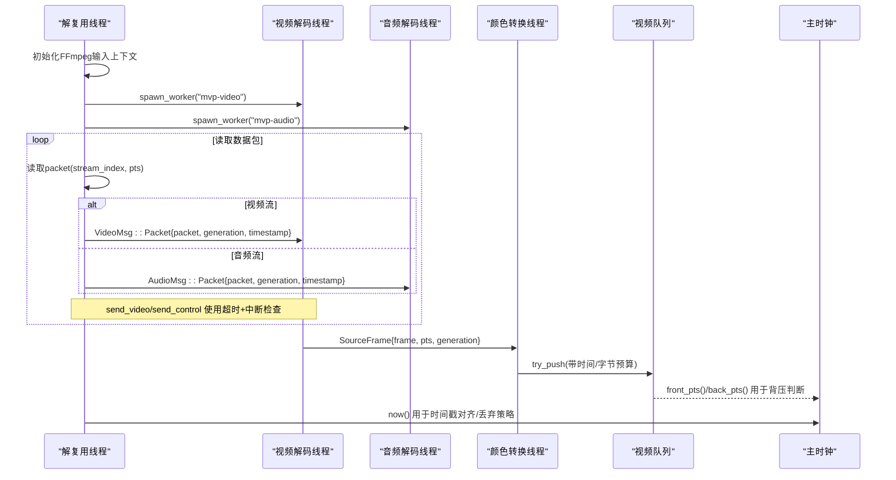
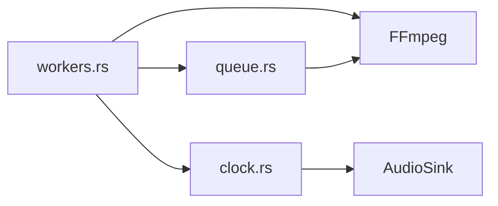

# 解复用线程

<cite>
**本文引用的文件**
- [workers.rs](file://crates/mvp-core/src/engine/workers.rs)
- [queue.rs](file://crates/mvp-core/src/engine/queue.rs)
- [clock.rs](file://crates/mvp-core/src/engine/clock.rs)
</cite>

## 目录
1. [简介](#简介)
2. [项目结构](#项目结构)
3. [核心组件](#核心组件)
4. [架构总览](#架构总览)
5. [详细组件分析](#详细组件分析)
6. [依赖关系分析](#依赖关系分析)
7. [性能考量](#性能考量)
8. [故障排查指南](#故障排查指南)
9. [结论](#结论)
10. [附录：关键流程与示例路径](#附录关键流程与示例路径)

## 简介
本文件聚焦于解复用线程（demuxer thread）的技术实现，围绕 demuxer_main 函数展开，系统阐述 FFmpeg 输入上下文初始化、流选择策略、数据包分发机制；详细说明视频流与音频流的分离处理、时间戳转换与起始偏移计算；解释通过有界通道向解码器线程发送数据包的背压控制（send_video、send_control）；并覆盖错误处理与异常恢复（panic 捕获、资源清理、状态同步）。文末提供性能优化建议与常见问题解决方案。

## 项目结构
本项目采用多 crate 组织，解复用与解码相关逻辑集中在 mvp-core 的 engine 模块中：
- workers.rs：解复用主循环、音视频工作线程生命周期、消息类型与队列、时钟集成、FFmpeg 集成、错误上报等。
- queue.rs：视频帧队列（带字节预算与时间预算）、消息枚举（VideoMsg/AudioMsg/PacketMsg）。
- clock.rs：播放主时钟（wall clock + audio sink），提供 seek、speed、now 等能力。

```mermaid
graph TB
subgraph "引擎线程"
DEMUX["解复用线程<br/>demuxer_main"]
CLOCK["主时钟<br/>Clock"]
end
subgraph "工作线程"
VDEC["视频解码线程"]
ADEC["音频解码线程"]
CONV["颜色转换线程"]
end
subgraph "外部库"
FFMPEG["FFmpeg 输入上下文"]
AUDIO["音频设备(AudioSink)"]
end
DEMUX --> |bounded channel(VideoMsg)| VDEC
DEMUX --> |bounded channel(AudioMsg)| ADEC
VDEC --> |SourceFrame| CONV
DEMUX --> |共享状态/事件| CLOCK
ADEC --> |播放| AUDIO
```

图表来源
- [workers.rs:134-146](file://crates/mvp-core/src/engine/workers.rs#L134-L146)
- [workers.rs:300-328](file://crates/mvp-core/src/engine/workers.rs#L300-L328)
- [workers.rs:343-417](file://crates/mvp-core/src/engine/workers.rs#L343-L417)
- [clock.rs:43-159](file://crates/mvp-core/src/engine/clock.rs#L43-L159)

章节来源
- [workers.rs:134-146](file://crates/mvp-core/src/engine/workers.rs#L134-L146)
- [workers.rs:300-328](file://crates/mvp-core/src/engine/workers.rs#L300-L328)
- [workers.rs:343-417](file://crates/mvp-core/src/engine/workers.rs#L343-L417)
- [clock.rs:43-159](file://crates/mvp-core/src/engine/clock.rs#L43-L159)

## 核心组件
- 解复用主循环（demuxer_main）：负责打开 FFmpeg 输入、描述媒体信息、选择音视频/字幕流、启动解码线程、读取数据包并按流分发到对应通道。
- 视频/音频消息与队列：PacketMsg/VideoMsg/AudioMsg 承载数据包与会话世代；VideoQueue 维护已解码帧的展示缓冲，支持字节预算与时间预算。
- 主时钟（Clock）：统一的时间基准，驱动播放进度、seek、速率变化，并与音频设备位置保持连续。
- 背压控制：send_video/send_control 使用 send_timeout 周期性检查中断/seek，避免阻塞；当视频队列落后时丢弃旧帧以恢复节奏。
- 错误与异常：入口 catch_unwind 捕获 panic，报告错误并设置播放器状态；解码无输出检测防止死转。

章节来源
- [workers.rs:281-687](file://crates/mvp-core/src/engine/workers.rs#L281-L687)
- [queue.rs:11-65](file://crates/mvp-core/src/engine/queue.rs#L11-L65)
- [queue.rs:67-253](file://crates/mvp-core/src/engine/queue.rs#L67-L253)
- [clock.rs:43-159](file://crates/mvp-core/src/engine/clock.rs#L43-L159)

## 架构总览
下图展示了从解复用线程到解码/转换/播放的整体数据与控制流，包括会话世代（generation）在 seek 时的隔离作用。



图表来源
- [workers.rs:300-328](file://crates/mvp-core/src/engine/workers.rs#L300-L328)
- [workers.rs:343-417](file://crates/mvp-core/src/engine/workers.rs#L343-L417)
- [workers.rs:610-681](file://crates/mvp-core/src/engine/workers.rs#L610-L681)
- [workers.rs:906-1106](file://crates/mvp-core/src/engine/workers.rs#L906-L1106)
- [workers.rs:1297-1447](file://crates/mvp-core/src/engine/workers.rs#L1297-L1447)
- [queue.rs:67-253](file://crates/mvp-core/src/engine/queue.rs#L67-L253)
- [clock.rs:43-159](file://crates/mvp-core/src/engine/clock.rs#L43-L159)

## 详细组件分析

### demuxer_main 核心逻辑
- FFmpeg 输入上下文初始化
  - 使用 input_with_interrupt_and_dictionary 打开输入，传入自定义中断回调（基于 abort/seek_request），以及网络/探测参数（analyzeduration、probesize、rw_timeout、reconnect 等）。
  - 根据 MediaSource 类型分类并生成媒体信息，写入共享状态，通知 UI。
- 流选择策略
  - 视频流：取第一个视频索引，除非是“静态图片”模式。
  - 音频流：根据当前选择的轨道（-2 自动、-1 关闭、>=0 指定索引）解析实际索引。
  - 字幕流：文本/位图共用一个解码器，按默认或用户选择打开。
- 数据包分发机制
  - 对每个 packet，缓存该流的 time_base 与 start_offset（首次访问时计算）。
  - 若为选中的视频流：构造 VideoMsg::Packet，调用 send_video 发送。
  - 若为选中的音频流且设备可用：构造 AudioMsg::Packet，调用 send_control 发送。
  - 若为字幕流：按文本/位图分别解码并发布。
- 时间戳转换与起始偏移
  - 时间戳：packet.pts * time_base - start_offset，使播放时间从 0 开始。
  - 起始偏移：stream.start_time > 0 且非最小值时，换算为秒作为 offset。
- 结束与循环
  - 到达 EOF 后向各解码器发送 Eof，并在 handle_eof 中根据音频/视频空闲情况决定结束或循环。

章节来源
- [workers.rs:169-189](file://crates/mvp-core/src/engine/workers.rs#L169-L189)
- [workers.rs:281-328](file://crates/mvp-core/src/engine/workers.rs#L281-L328)
- [workers.rs:330-417](file://crates/mvp-core/src/engine/workers.rs#L330-L417)
- [workers.rs:610-681](file://crates/mvp-core/src/engine/workers.rs#L610-L681)
- [workers.rs:830-877](file://crates/mvp-core/src/engine/workers.rs#L830-L877)
- [workers.rs:700-793](file://crates/mvp-core/src/engine/workers.rs#L700-L793)

### 视频流与音频流分离处理
- 视频流
  - 解码线程接收 Packet，送入 FFmpeg 解码器，循环 receive_frame 产出帧。
  - 硬件帧下载至系统内存，软件帧引用计数传递，随后进入颜色转换线程。
  - 帧 PTS 优先使用 frame.pts 换算，否则回退到 packet_pts 或 last_pts + fallback_step。
  - 丢弃策略：早于 seek target、过旧（now - 0.25s）且队列非空时丢弃。
- 音频流
  - 音频解码线程接收 Packet，解码后送入音频设备播放；音频设备不可用时记录警告并继续静音播放。
  - 音频队列与设备缓冲共同构成播放前缓冲，保证声音连续性。

章节来源
- [workers.rs:906-1106](file://crates/mvp-core/src/engine/workers.rs#L906-L1106)
- [workers.rs:1137-1266](file://crates/mvp-core/src/engine/workers.rs#L1137-L1266)
- [workers.rs:366-417](file://crates/mvp-core/src/engine/workers.rs#L366-L417)

### 线程间通信与背压控制
- bounded channel
  - 视频通道容量 VIDEO_PACKET_QUEUE，音频通道容量 AUDIO_PACKET_QUEUE。
  - send_video：周期性 send_timeout，若检测到视频队列落后（front_pts < now - RESYNC_LAG）则丢弃旧包，避免进一步拖慢。
  - send_control：通用发送封装，周期检查 interrupted（abort/seek_request），确保不会永久阻塞。
- 解码阶段与转换阶段解耦
  - 解码线程将帧放入 SourceFrame 通道（VIDEO_SOURCE_QUEUE=4），由颜色转换线程独立消费，避免 CPU/GPU 互相等待。
- 队列与时间预算
  - VideoQueue 同时受字节预算与时间预算限制，结合 fps 计算最大帧数，避免高码率/高分辨率下内存爆炸。
  - take_ready 仅取出已到时间的最老帧，丢弃中间被跳过的帧，保证时序单调。

章节来源
- [workers.rs:25-57](file://crates/mvp-core/src/engine/workers.rs#L25-L57)
- [workers.rs:215-279](file://crates/mvp-core/src/engine/workers.rs#L215-L279)
- [workers.rs:945-957](file://crates/mvp-core/src/engine/workers.rs#L945-L957)
- [workers.rs:1268-1287](file://crates/mvp-core/src/engine/workers.rs#L1268-L1287)
- [queue.rs:67-253](file://crates/mvp-core/src/engine/queue.rs#L67-L253)

### 错误处理与异常恢复
- panic 捕获
  - run_demuxer 包裹 demuxer_main，catch_unwind 捕获 panic 并上报错误；spawn_worker 同样捕获子线程 panic。
- 资源清理
  - 结束时向视频/音频通道发送 Stop；解码线程退出时清理 pool。
- 状态同步
  - 通过 Shared 的 abort、seek_request、generation 等原子/锁变量协调；flush 请求会清空队列并唤醒消费者。
- 解码停滞检测
  - 若持续喂包但长时间无帧输出（超过 DECODE_STALL 且已喂入 STALL_MIN_PACKETS），判定为损坏或不支持的格式，上报错误并中止。

章节来源
- [workers.rs:134-152](file://crates/mvp-core/src/engine/workers.rs#L134-L152)
- [workers.rs:879-900](file://crates/mvp-core/src/engine/workers.rs#L879-L900)
- [workers.rs:1092-1105](file://crates/mvp-core/src/engine/workers.rs#L1092-L1105)
- [workers.rs:683-687](file://crates/mvp-core/src/engine/workers.rs#L683-L687)

## 依赖关系分析
- 模块耦合
  - workers.rs 依赖 queue.rs（消息与队列）、clock.rs（时间基准）、FFmpeg（解码/输入）。
  - queue.rs 依赖 ffmpeg_next（Packet/Frame 类型）与 video::VideoFrame。
  - clock.rs 依赖 audio::AudioSink（可选）以获取真实播放位置。
- 外部依赖
  - crossbeam_channel：有界通道与超时收发。
  - ffmpeg_next：编解码、输入上下文、硬件加速。
- 潜在环路与风险
  - 解复用线程持有 ictx 并可能触发 FFmpeg 回调；seek 时避免在持锁期间调用 FFmpeg，防止自死锁。
  - 解码线程与转换线程通过通道解耦，降低耦合度。



图表来源
- [workers.rs:12-23](file://crates/mvp-core/src/engine/workers.rs#L12-L23)
- [queue.rs:1-10](file://crates/mvp-core/src/engine/queue.rs#L1-L10)
- [clock.rs:16-24](file://crates/mvp-core/src/engine/clock.rs#L16-L24)

章节来源
- [workers.rs:12-23](file://crates/mvp-core/src/engine/workers.rs#L12-L23)
- [queue.rs:1-10](file://crates/mvp-core/src/engine/queue.rs#L1-L10)
- [clock.rs:16-24](file://crates/mvp-core/src/engine/clock.rs#L16-L24)

## 性能考量
- 解码与转换并行化
  - 将颜色转换放在独立线程，避免解码线程被 CPU 转换阻塞；硬件帧下载也在解码线程完成，减少跨设备拷贝开销。
- 队列预算
  - 视频队列同时受字节预算与时间预算约束，避免高码率/高分辨率导致内存暴涨；时间预算确保低延迟响应。
- 背压与丢帧策略
  - send_video 在队列落后时丢弃旧包，快速恢复节奏；解码阶段对过旧帧直接丢弃，避免无效转换。
- 硬件加速
  - 尝试 D3D11VA/DXVA2，配置 extra_hw_frames 缓解 VRAM 池耗尽导致的卡顿。
- 时钟与播放
  - 主时钟基于 wall clock，音频设备就绪后与之保持连续；seek/speed 变更即时生效。

[本节为通用性能讨论，不直接分析具体代码行]

## 故障排查指南
- 无法打开输入/流缺失
  - 检查 input_options 的网络参数与 probesize/analyzeduration；确认流存在且可访问。
- 跳转失败或卡住
  - seek_container 内部使用 avformat_seek_file；若失败会记录警告并继续播放；避免在锁内调用 FFmpeg。
- 解码无输出
  - 若持续喂包但长时间无帧输出，会报“解码无输出”并中止；可能是损坏文件或不受支持格式。
- 音频设备不可用
  - 记录警告并继续静音播放；UI 应提示用户检查设备。
- 视频队列落后导致卡顿
  - send_video 会丢弃旧包；若频繁丢帧，需检查渲染/转换瓶颈或调整队列预算。

章节来源
- [workers.rs:169-189](file://crates/mvp-core/src/engine/workers.rs#L169-L189)
- [workers.rs:847-877](file://crates/mvp-core/src/engine/workers.rs#L847-L877)
- [workers.rs:1092-1105](file://crates/mvp-core/src/engine/workers.rs#L1092-L1105)
- [workers.rs:391-398](file://crates/mvp-core/src/engine/workers.rs#L391-L398)
- [workers.rs:215-262](file://crates/mvp-core/src/engine/workers.rs#L215-L262)

## 结论
解复用线程通过严谨的 FFmpeg 集成、稳健的流选择与分发、严格的背压控制与时序管理，实现了稳定高效的音视频播放管线。其设计将解码、转换、播放解耦，借助有界通道与共享状态实现线程间协作，并通过 panic 捕获与错误上报保障鲁棒性。合理配置队列预算、启用硬件加速与监控丢帧/卡顿指标，可进一步提升整体性能与用户体验。

[本节为总结性内容，不直接分析具体代码行]

## 附录：关键流程与示例路径
- FFmpeg 输入上下文初始化
  - 参考路径：[workers.rs:300-308](file://crates/mvp-core/src/engine/workers.rs#L300-L308)
- 流参数提取与时间基/起始偏移
  - 参考路径：[workers.rs:330-337](file://crates/mvp-core/src/engine/workers.rs#L330-L337), [workers.rs:630-637](file://crates/mvp-core/src/engine/workers.rs#L630-L637), [workers.rs:830-838](file://crates/mvp-core/src/engine/workers.rs#L830-L838)
- 数据包流转过程（视频/音频）
  - 参考路径：[workers.rs:610-681](file://crates/mvp-core/src/engine/workers.rs#L610-L681)
- 背压控制（send_video/send_control）
  - 参考路径：[workers.rs:215-279](file://crates/mvp-core/src/engine/workers.rs#L215-L279)
- 解码与转换流水线
  - 参考路径：[workers.rs:906-1106](file://crates/mvp-core/src/engine/workers.rs#L906-L1106), [workers.rs:1297-1447](file://crates/mvp-core/src/engine/workers.rs#L1297-L1447)
- 队列与时间预算
  - 参考路径：[queue.rs:67-253](file://crates/mvp-core/src/engine/queue.rs#L67-L253)
- 主时钟与 seek
  - 参考路径：[clock.rs:43-159](file://crates/mvp-core/src/engine/clock.rs#L43-L159), [workers.rs:847-877](file://crates/mvp-core/src/engine/workers.rs#L847-L877)