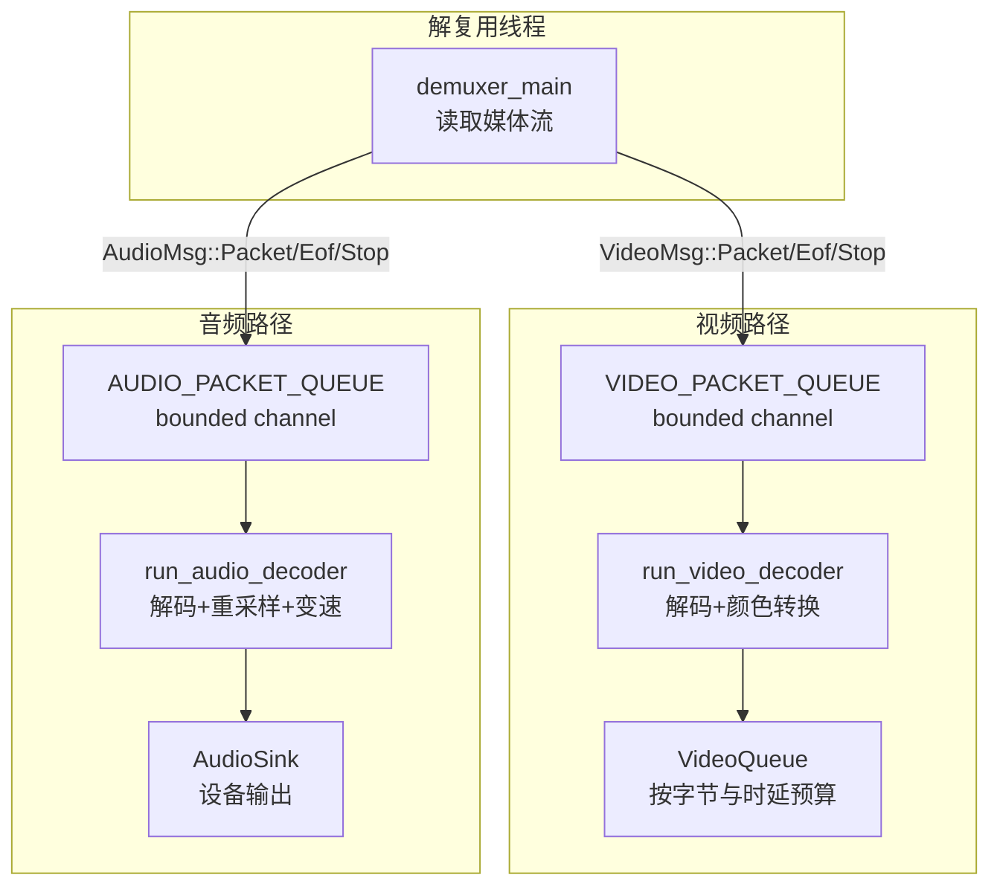
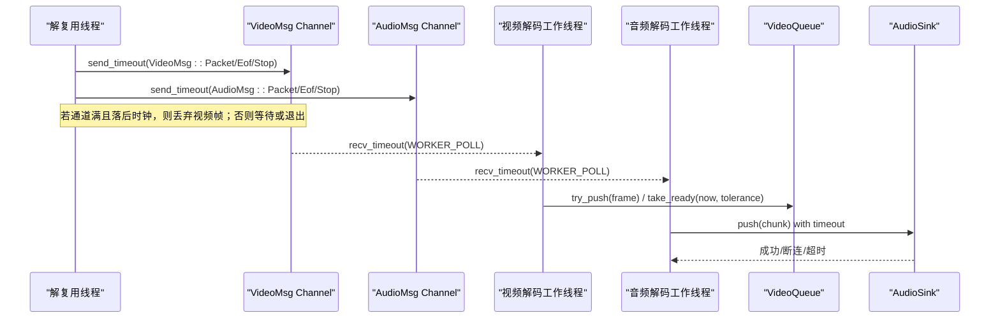
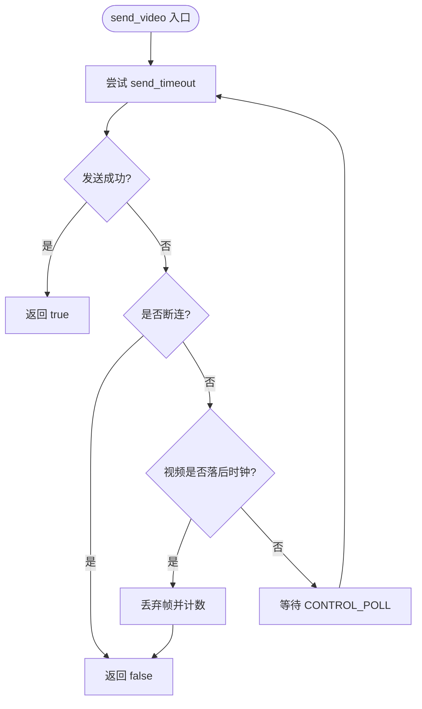
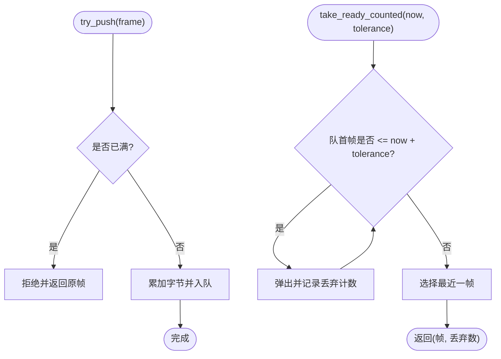
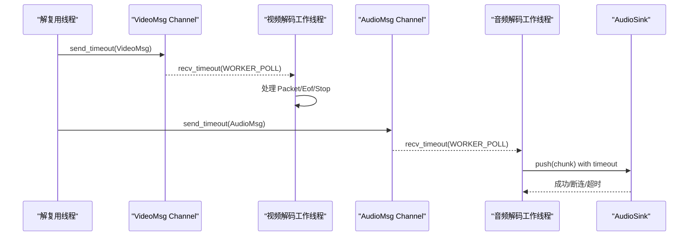
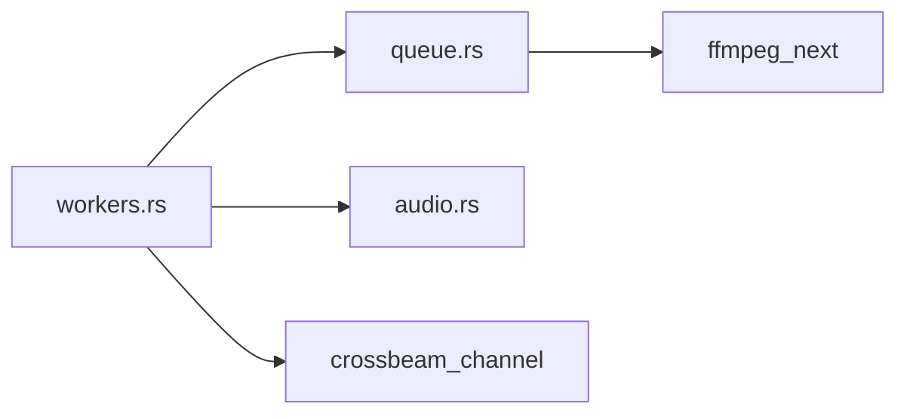

# 队列管理机制

<cite>
**本文引用的文件**   
- [queue.rs](file://crates/mvp-core/src/engine/queue.rs)
- [workers.rs](file://crates/mvp-core/src/engine/workers.rs)
- [audio.rs](file://crates/mvp-core/src/audio.rs)
</cite>

## 目录
1. [引言](#引言)
2. [项目结构](#项目结构)
3. [核心组件](#核心组件)
4. [架构总览](#架构总览)
5. [详细组件分析](#详细组件分析)
6. [依赖关系分析](#依赖关系分析)
7. [性能与内存优化](#性能与内存优化)
8. [故障排查指南](#故障排查指南)
9. [结论](#结论)

## 引言
本文聚焦于播放器引擎中的队列管理机制，围绕以下目标展开：
- 解释 VideoMsg 与 AudioMsg 枚举的设计动机、消息类型、生命周期与内存安全保证。
- 说明 VIDEO_PACKET_QUEUE 与 AUDIO_PACKET_QUEUE 的配置策略、不同队列深度的设计考量与背压控制算法。
- 梳理队列状态管理：front_pts 时间戳跟踪、队列长度监控、过期数据清理。
- 描述跨线程通信协议：channel 使用模式、超时处理、断开连接处理。
- 提供队列操作、消息传递、错误恢复的具体代码示例路径。
- 给出队列性能调优与内存使用优化建议。

## 项目结构
与队列机制直接相关的实现位于 mvp-core 的 engine 子模块中：
- queue.rs：定义解码器工作线程的消息类型（VideoMsg、AudioMsg）、PacketMsg，以及视频帧队列 VideoQueue。
- workers.rs：解复用线程与音视频解码工作线程的实现，包含通道容量常量、发送封装、背压判断、EOF 与停止流程等。
- audio.rs：音频输出端的数据推送与丢弃逻辑，体现 channel 超时与断连时的丢包计数与关闭语义。



**图表来源**
- [workers.rs:25-57](file://crates/mvp-core/src/engine/workers.rs#L25-L57)
- [workers.rs:343-367](file://crates/mvp-core/src/engine/workers.rs#L343-L367)
- [queue.rs:11-65](file://crates/mvp-core/src/engine/queue.rs#L11-L65)
- [queue.rs:67-101](file://crates/mvp-core/src/engine/queue.rs#L67-L101)

**章节来源**
- [workers.rs:25-57](file://crates/mvp-core/src/engine/workers.rs#L25-L57)
- [workers.rs:343-367](file://crates/mvp-core/src/engine/workers.rs#L343-L367)
- [queue.rs:11-65](file://crates/mvp-core/src/engine/queue.rs#L11-L65)
- [queue.rs:67-101](file://crates/mvp-core/src/engine/queue.rs#L67-L101)

## 核心组件
- PacketMsg：携带 demuxed 数据包、所属解码会话 generation、可选时间戳。用于在 seek 后丢弃旧会话数据，避免同步握手。
- VideoMsg / AudioMsg：视频与音频工作线程的控制消息，包括 Packet、Eof、Stop。Eof 也携带 generation，防止新会话 flush 后误用旧 EOF。
- VideoQueue：按“字节预算 + 最大帧数 + 时间预算”三重约束的视频帧 FIFO，支持 front_pts/back_pts 时间戳查询、take_ready/take_ready_counted 过期清理、time_until_next 调度提示。

**章节来源**
- [queue.rs:11-65](file://crates/mvp-core/src/engine/queue.rs#L11-L65)
- [queue.rs:67-101](file://crates/mvp-core/src/engine/queue.rs#L67-L101)
- [queue.rs:149-178](file://crates/mvp-core/src/engine/queue.rs#L149-L178)
- [queue.rs:180-252](file://crates/mvp-core/src/engine/queue.rs#L180-L252)

## 架构总览
下图展示了解复用线程到解码工作线程的跨线程通信协议，以及背压与状态管理的交互点。



**图表来源**
- [workers.rs:201-279](file://crates/mvp-core/src/engine/workers.rs#L201-L279)
- [workers.rs:962-988](file://crates/mvp-core/src/engine/workers.rs#L962-L988)
- [workers.rs:1796-1802](file://crates/mvp-core/src/engine/workers.rs#L1796-L1802)
- [queue.rs:180-252](file://crates/mvp-core/src/engine/queue.rs#L180-L252)
- [audio.rs:534-593](file://crates/mvp-core/src/audio.rs#L534-L593)

## 详细组件分析

### 消息类型与生命周期：VideoMsg 与 AudioMsg
- 设计要点
  - 仅数据和 EOF 走 channel；seek 与轨道切换通过共享状态进行 flush，避免控制消息被积压在满队列之后导致死锁。
  - Eof 携带 generation，确保在新会话 flush 后不会误将旧 EOF 作用于已重置的解码器。
  - Stop 作为优雅退出信号，配合 abort 标志位确保工作线程尽快退出。
- 生命周期
  - 解复用线程在文件结束处发送 Eof，随后在退出时发送 Stop。
  - 工作线程收到 Eof 后调用底层解码器的 send_eof，并排空剩余帧；收到 Stop 则退出循环。
- 内存安全
  - PacketMsg 持有 ffmpeg::Packet，由 FFmpeg 管理内存；generation 字段确保旧会话数据被静默丢弃，无需额外同步。

```mermaid
classDiagram
class PacketMsg {
+packet
+generation
+timestamp
}
class VideoMsg {
<<enum>>
+Packet(PacketMsg)
+Eof{generation}
+Stop
}
class AudioMsg {
<<enum>>
+Packet(PacketMsg)
+Eof{generation}
+Stop
}
VideoMsg --> PacketMsg : "包含"
AudioMsg --> PacketMsg : "包含"
```

**图表来源**
- [queue.rs:11-65](file://crates/mvp-core/src/engine/queue.rs#L11-L65)

**章节来源**
- [queue.rs:25-65](file://crates/mvp-core/src/engine/queue.rs#L25-L65)
- [workers.rs:614-623](file://crates/mvp-core/src/engine/workers.rs#L614-L623)
- [workers.rs:962-988](file://crates/mvp-core/src/engine/workers.rs#L962-L988)
- [workers.rs:1796-1802](file://crates/mvp-core/src/engine/workers.rs#L1796-L1802)

### 队列深度配置与背压控制：VIDEO_PACKET_QUEUE 与 AUDIO_PACKET_QUEUE
- 常量与用途
  - VIDEO_PACKET_QUEUE = 48：视频包在进入解码前可排队深度，用于缓冲解复用抖动。
  - AUDIO_PACKET_QUEUE = 192：音频包可排队深度更大，因为音频是连续流且对延迟敏感。
  - VIDEO_SOURCE_QUEUE = 4：解码器与颜色转换器之间的中间缓冲，仅需桥接单阶段抖动。
- 背压控制
  - 视频发送封装 send_video：当通道满且视频队列落后时钟（front_pts < now - RESYNC_LAG）时丢弃帧；否则等待或中断退出。
  - 通用控制发送 send_control：周期性 poll 以检查 abort/seek，避免阻塞在慢消费者上。
  - 音频输出 AudioSink::push：带超时的 channel 推送，断连或超时则丢弃并计数。



**图表来源**
- [workers.rs:201-279](file://crates/mvp-core/src/engine/workers.rs#L201-L279)

**章节来源**
- [workers.rs:25-57](file://crates/mvp-core/src/engine/workers.rs#L25-L57)
- [workers.rs:201-279](file://crates/mvp-core/src/engine/workers.rs#L201-L279)
- [audio.rs:534-593](file://crates/mvp-core/src/audio.rs#L534-L593)

### 队列状态管理：front_pts、长度监控与过期清理
- front_pts 与 back_pts
  - front_pts 表示最老帧的 PTS，back_pts 表示最新帧的 PTS，用于判断是否落后时钟与计算 time_until_next。
- 长度与字节预算
  - len() 与 bytes() 分别暴露帧数与像素字节占用；is_full() 同时受 frame_cap 与 budget_bytes 限制。
- 过期清理
  - take_ready(tolerance) 与 take_ready_counted(now, tolerance)：弹出所有不晚于 now + tolerance 的帧，返回最新可用帧与被丢弃数量，用于区分“解码跟不上”和“显示速率高于源帧率”。
- 时间预算
  - with_time_budget(seconds) 结合 set_pacing(fps) 将秒级预算转换为帧数上限，避免高帧率下过度缓冲导致的响应延迟。



**图表来源**
- [queue.rs:149-178](file://crates/mvp-core/src/engine/queue.rs#L149-L178)
- [queue.rs:180-252](file://crates/mvp-core/src/engine/queue.rs#L180-L252)

**章节来源**
- [queue.rs:149-178](file://crates/mvp-core/src/engine/queue.rs#L149-L178)
- [queue.rs:180-252](file://crates/mvp-core/src/engine/queue.rs#L180-L252)
- [queue.rs:375-407](file://crates/mvp-core/src/engine/queue.rs#L375-L407)

### 跨线程通信协议：channel 使用模式、超时与断连
- 发送端
  - send_video：针对视频专用逻辑，考虑视频队列落后时钟时主动丢帧以避免整体卡顿。
  - send_control：通用通道发送，周期性 poll 以检查 abort/seek，避免永久阻塞。
- 接收端
  - 工作线程使用 recv_timeout(WORKER_POLL) 轮询消息，超时继续循环，断连则退出。
  - 收到 Eof 后根据 generation 过滤旧会话，调用底层 send_eof 并排空。
  - 收到 Stop 则退出主循环。
- 音频输出
  - AudioSink::push 使用 send_timeout 推送音频块，断连或超时则丢弃并计数；close() 设置 closing 标志使等待立即返回。



**图表来源**
- [workers.rs:962-988](file://crates/mvp-core/src/engine/workers.rs#L962-L988)
- [workers.rs:1796-1802](file://crates/mvp-core/src/engine/workers.rs#L1796-L1802)
- [audio.rs:534-593](file://crates/mvp-core/src/audio.rs#L534-L593)

**章节来源**
- [workers.rs:201-279](file://crates/mvp-core/src/engine/workers.rs#L201-L279)
- [workers.rs:962-988](file://crates/mvp-core/src/engine/workers.rs#L962-L988)
- [workers.rs:1796-1802](file://crates/mvp-core/src/engine/workers.rs#L1796-L1802)
- [audio.rs:534-593](file://crates/mvp-core/src/audio.rs#L534-L593)

### 具体代码示例（路径引用）
- 队列创建与配置
  - 视频通道与音频通道容量：[workers.rs:343-367](file://crates/mvp-core/src/engine/workers.rs#L343-L367)
  - 视频帧队列初始化与 pacing：[workers.rs:325-327](file://crates/mvp-core/src/engine/workers.rs#L325-L327), [queue.rs:88-101](file://crates/mvp-core/src/engine/queue.rs#L88-L101)
- 消息发送与接收
  - 视频发送封装与丢帧逻辑：[workers.rs:201-279](file://crates/mvp-core/src/engine/workers.rs#L201-L279)
  - 通用控制发送封装：[workers.rs:264-279](file://crates/mvp-core/src/engine/workers.rs#L264-L279)
  - 视频工作线程接收循环：[workers.rs:962-988](file://crates/mvp-core/src/engine/workers.rs#L962-L988)
  - 音频工作线程接收循环：[workers.rs:1796-1802](file://crates/mvp-core/src/engine/workers.rs#L1796-L1802)
- 过期清理与调度
  - take_ready_counted 与 time_until_next：[queue.rs:212-252](file://crates/mvp-core/src/engine/queue.rs#L212-L252)
- 音频输出与断连处理
  - AudioSink::push 超时与断连：[audio.rs:534-593](file://crates/mvp-core/src/audio.rs#L534-L593)

## 依赖关系分析
- 模块耦合
  - workers.rs 依赖 queue.rs 的消息类型与 VideoQueue。
  - workers.rs 依赖 audio.rs 的 AudioSink 进行音频输出。
  - queue.rs 依赖 video::VideoFrame 与 ffmpeg_next。
- 外部依赖
  - crossbeam_channel：有界通道与超时收发。
  - ffmpeg_next：解复用、解码与帧对象。
- 潜在环路与风险
  - 控制消息不走 channel，避免与数据消息竞争；seek 与轨道变更通过共享状态触发 flush，降低死锁风险。



**图表来源**
- [workers.rs:12-23](file://crates/mvp-core/src/engine/workers.rs#L12-L23)
- [queue.rs:1-10](file://crates/mvp-core/src/engine/queue.rs#L1-L10)

**章节来源**
- [workers.rs:12-23](file://crates/mvp-core/src/engine/workers.rs#L12-L23)
- [queue.rs:1-10](file://crates/mvp-core/src/engine/queue.rs#L1-L10)

## 性能与内存优化
- 队列深度调优
  - VIDEO_PACKET_QUEUE 与 AUDIO_PACKET_QUEUE 应根据硬件解码能力与网络抖动调整；音频通道较深以覆盖设备缓冲与重采样延迟。
  - VIDEO_SOURCE_QUEUE 较小即可桥接解码与颜色转换两阶段的抖动。
- 背压策略
  - 视频丢帧阈值基于 front_pts 与 RESYNC_LAG；在网络抖动或解码瓶颈时可适当增大阈值以减少卡顿，但会增加延迟。
  - 音频输出使用短超时与断连快速失败，避免阻塞播放线程。
- 内存预算
  - VideoQueue 的字节预算与时间预算共同限制内存占用；在高码率或高分辨率场景下应提高 budget_bytes 并限制 max_frames。
  - 使用 Arc<VideoFrame> 减少帧拷贝；硬件帧在解码线程下载至系统内存后再进入队列。
- 调度与延迟
  - set_pacing(fps) 与 with_time_budget(seconds) 控制“领先量”，影响 seek 与变速的响应速度；较短的时间预算可降低延迟但可能增加掉帧概率。
- 统计与观测
  - 通过 snapshot_state 获取 queued_frames、audio_queue_seconds、dropped_frames 等指标，辅助定位瓶颈。

**章节来源**
- [workers.rs:25-57](file://crates/mvp-core/src/engine/workers.rs#L25-L57)
- [workers.rs:67-91](file://crates/mvp-core/src/engine/workers.rs#L67-L91)
- [queue.rs:67-101](file://crates/mvp-core/src/engine/queue.rs#L67-L101)
- [queue.rs:103-147](file://crates/mvp-core/src/engine/queue.rs#L103-L147)
- [queue.rs:180-252](file://crates/mvp-core/src/engine/queue.rs#L180-L252)
- [audio.rs:534-593](file://crates/mvp-core/src/audio.rs#L534-L593)

## 故障排查指南
- 常见问题
  - 画面卡顿：检查视频队列是否落后时钟（video_is_behind），必要时调整 RESYNC_LAG 或 VIDEO_PACKET_QUEUE。
  - 声音断续：检查 AudioSink::push 的超时与断连计数，确认设备可用性与驱动稳定性。
  - 跳转后无画面：确认 Eof 的 generation 匹配与 flush 顺序，避免旧 EOF 作用于新会话。
  - 内存飙升：检查 VideoQueue 的 bytes() 与 is_full() 行为，确保 budget_bytes 与 max_frames 合理。
- 诊断步骤
  - 观察 dropped_frames 与 discarded 计数，区分解码瓶颈与显示瓶颈。
  - 使用 snapshot_state 的 queued_frames 与 audio_queue_seconds 评估缓冲健康度。
  - 在关键路径添加日志：send_video 的丢帧原因、recv_timeout 的断连事件、AudioSink::push 的超时与断连。

**章节来源**
- [workers.rs:201-279](file://crates/mvp-core/src/engine/workers.rs#L201-L279)
- [workers.rs:962-988](file://crates/mvp-core/src/engine/workers.rs#L962-L988)
- [workers.rs:1796-1802](file://crates/mvp-core/src/engine/workers.rs#L1796-L1802)
- [audio.rs:534-593](file://crates/mvp-core/src/audio.rs#L534-L593)
- [queue.rs:212-252](file://crates/mvp-core/src/engine/queue.rs#L212-L252)

## 结论
该队列管理机制通过明确的消息类型、严格的世代标记与多约束队列模型，实现了稳定高效的跨线程媒体数据处理。VIDEO_PACKET_QUEUE 与 AUDIO_PACKET_QUEUE 的深度差异反映了视频与音频的不同特性；背压控制与过期清理确保了系统在抖动与瓶颈下的鲁棒性。通过合理的参数调优与监控指标，可在延迟、流畅度与内存占用之间取得平衡。