# 音频解码线程

<cite>
**本文引用的文件**   
- [audio.rs](file://crates/mvp-core/src/audio.rs)
- [workers.rs](file://crates/mvp-core/src/engine/workers.rs)
- [clock.rs](file://crates/mvp-core/src/engine/clock.rs)
- [queue.rs](file://crates/mvp-core/src/engine/queue.rs)
- [enhance.rs](file://crates/mvp-core/src/dsp/enhance.rs)
- [dsp.rs](file://crates/mvp-core/src/dsp.rs)
- [lib.rs](file://crates/mvp-core/src/lib.rs)
</cite>

## 目录
1. [引言](#引言)
2. [项目结构](#项目结构)
3. [核心组件](#核心组件)
4. [架构总览](#架构总览)
5. [详细组件分析](#详细组件分析)
6. [依赖关系分析](#依赖关系分析)
7. [性能与延迟特性](#性能与延迟特性)
8. [故障排查指南](#故障排查指南)
9. [结论](#结论)
10. [附录：代码片段路径与最佳实践](#附录代码片段路径与最佳实践)

## 引言
本文聚焦 MVP-Versatile-Player 的音频解码线程，围绕 `run_audio_decoder` 函数展开，系统说明 FFmpeg 音频解码器初始化、重采样器配置、音频设备管理、从压缩格式到 PCM 的解码流程、重采样与时域变速（SOLA）、音效增强链、AudioSink 集成、主时钟同步机制以及基于播放头的预取策略。文档同时给出关键流程图和时序图，帮助读者快速理解数据流与控制流，并提供音质优化建议与常见问题定位方法。

## 项目结构
本项目采用多 crate 组织：
- mvp-core：媒体引擎核心，包含音视频解码、DSP、时钟、队列等。
- mvp-platform：平台相关能力。
- mvp-player：UI 与播放器前端。
- mvp-subtitle：字幕解析。

音频解码相关的关键代码集中在 mvp-core：
- audio.rs：音频输出设备抽象 AudioSink、实时回调、缓冲与延迟补偿、音量/静音/暂停控制。
- engine/workers.rs：解码工作线程，包括 run_audio_decoder、drain_audio、wait_for_audio_lead、open_audio_decoder 等。
- engine/clock.rs：主时钟 Clock，统一媒体位置来源。
- engine/queue.rs：视频帧队列与消息类型（音频消息也在此定义）。
- dsp/enhance.rs：实时音效增强链（EQ、空间化、响度、限幅器等）。
- dsp.rs：时域 SOLA 时间拉伸 TimeStretcher。
- lib.rs：FFmpeg 初始化入口。

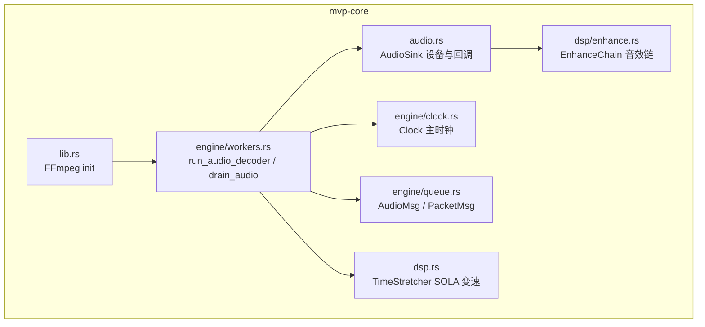

图表来源
- [audio.rs:153-318](file://crates/mvp-core/src/audio.rs#L153-L318)
- [workers.rs:1718-2113](file://crates/mvp-core/src/engine/workers.rs#L1718-L2113)
- [clock.rs:44-158](file://crates/mvp-core/src/engine/clock.rs#L44-L158)
- [queue.rs:11-65](file://crates/mvp-core/src/engine/queue.rs#L11-L65)
- [enhance.rs:1-33](file://crates/mvp-core/src/dsp/enhance.rs#L1-L33)
- [dsp.rs:1-26](file://crates/mvp-core/src/dsp.rs#L1-L26)
- [lib.rs:50-69](file://crates/mvp-core/src/lib.rs#L50-L69)

章节来源
- [lib.rs:1-18](file://crates/mvp-core/src/lib.rs#L1-L18)

## 核心组件
- AudioSink：封装 cpal 输出流，负责设备选择、默认采样率优选、实时回调填充、音量平滑、音效链处理、缓冲统计、暂停/恢复、flush 与关闭。
- run_audio_decoder：音频解码工作线程，负责打开 FFmpeg 解码器、按需创建重采样上下文、调用 TimeStretcher 进行时间拉伸、按 AUDIO_LEAD 预取策略推送至 AudioSink。
- Clock：主时钟，优先使用 AudioSink 的样本级位置作为参考，否则回退到 wall clock；提供 seek、set_speed、set_running 等方法。
- TimeStretcher：基于 SOLA 的时域时间拉伸，支持变速不变调，内部维护重叠窗口与互相关对齐。
- EnhanceChain：实时音效增强链，包含 EQ、低频提升、清晰度、响度归一、空间化、软限幅等，参数通过原子共享，避免实时线程阻塞。
- Queue 消息：AudioMsg/PacketMsg 用于 demuxer 与 worker 之间的无锁通信，带 generation 以丢弃旧会话数据。

章节来源
- [audio.rs:153-318](file://crates/mvp-core/src/audio.rs#L153-L318)
- [workers.rs:1718-2113](file://crates/mvp-core/src/engine/workers.rs#L1718-L2113)
- [clock.rs:44-158](file://crates/mvp-core/src/engine/clock.rs#L44-L158)
- [dsp.rs:21-174](file://crates/mvp-core/src/dsp.rs#L21-L174)
- [enhance.rs:1-33](file://crates/mvp-core/src/dsp/enhance.rs#L1-L33)
- [queue.rs:11-65](file://crates/mvp-core/src/engine/queue.rs#L11-L65)

## 架构总览
音频解码线程的整体数据流如下：

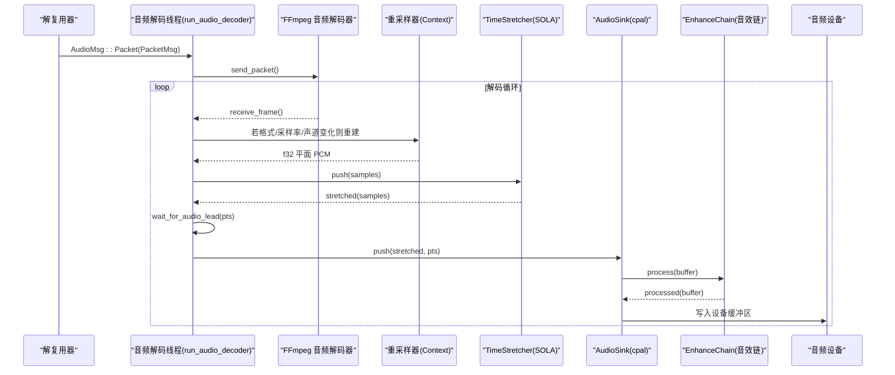

图表来源
- [workers.rs:1718-2113](file://crates/mvp-core/src/engine/workers.rs#L1718-L2113)
- [audio.rs:320-461](file://crates/mvp-core/src/audio.rs#L320-L461)
- [dsp.rs:149-178](file://crates/mvp-core/src/dsp.rs#L149-L178)
- [enhance.rs:34-33](file://crates/mvp-core/src/dsp/enhance.rs#L34-L33)

## 详细组件分析

### run_audio_decoder 实现要点
- 解码器初始化：通过 open_audio_decoder 查找并打开对应 codec，失败时上报错误并退出线程。
- 设备信息获取：从 AudioSink 获取 sample_rate、channels，构造目标 channel layout。
- 重采样器：首次或格式变化时重建 swr Context，输入为解码器输出格式，输出固定为 f32 packed + 设备布局 + 设备采样率。
- 时间拉伸：TimeStretcher 在设备通道数与采样率下构建，初始速度来自 shared.speed()。
- 解码循环：recv_timeout 接收 AudioMsg，处理 Stop/Eof/Packet；Eof 后 flush decoder 并 drain 尾部；Packet 后进入 drain_audio。
- 预取控制：drain_audio 中每批 stretched 输出前调用 wait_for_audio_lead，确保解码领先不超过 AUDIO_LEAD（0.5s），避免“未听见的变速”堆积。
- 状态重置：reset_audio_session 在 seek/换轨时清理 decoder、resampler、stretcher，并刷新 sink 与 last_pts。

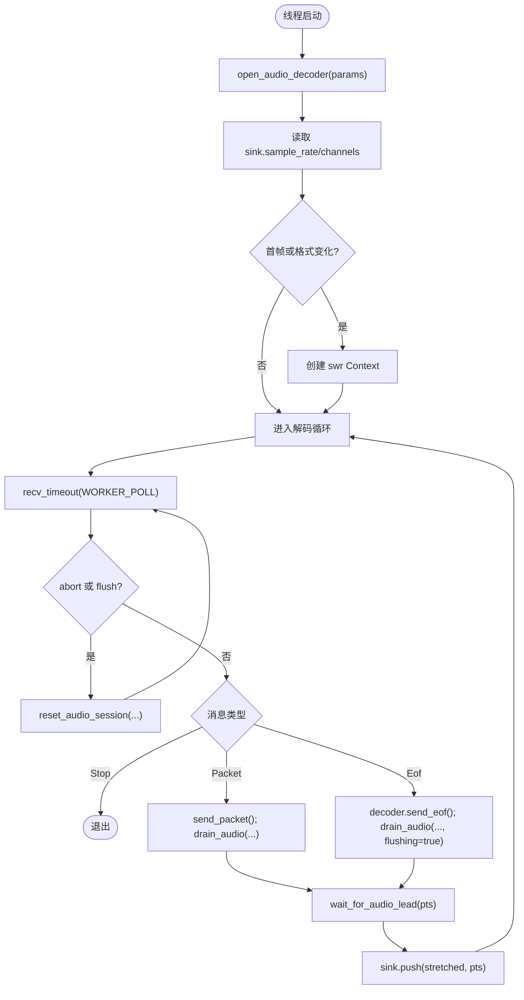

图表来源
- [workers.rs:1718-1879](file://crates/mvp-core/src/engine/workers.rs#L1718-L1879)
- [workers.rs:1887-1907](file://crates/mvp-core/src/engine/workers.rs#L1887-L1907)
- [workers.rs:1909-1934](file://crates/mvp-core/src/engine/workers.rs#L1909-L1934)
- [workers.rs:1937-2104](file://crates/mvp-core/src/engine/workers.rs#L1937-L2104)

章节来源
- [workers.rs:1718-2113](file://crates/mvp-core/src/engine/workers.rs#L1718-L2113)

### FFmpeg 音频解码器初始化
- find_decoder：根据 stream 的 codec id 查找可用解码器。
- open_audio_decoder：从 parameters 构建 context，再 open_as(codec).audio() 得到解码器实例。
- 错误处理：找不到解码器或打开失败时返回 MediaError，由上层报告 UI。

章节来源
- [workers.rs:1701-1712](file://crates/mvp-core/src/engine/workers.rs#L1701-L1712)
- [workers.rs:2106-2113](file://crates/mvp-core/src/engine/workers.rs#L2106-L2113)

### 重采样器配置与 PCM 转换
- 触发条件：当 frame.format()/rate()/channel_layout.channels() 与已有 resampler 不一致时重建。
- 输出格式：固定为 f32 packed，目标 layout 与 rate 取自设备，保证后续 TimeStretcher 与 AudioSink 一致。
- 容量计算：output.alloc 容量 = (input_samples * device_rate / in_rate) + RESAMPLE_MARGIN，避免 swr 内部缓存导致截断。
- 数据拷贝：将 plane<f32> 数据复制到 scratch，供 TimeStretcher 使用。

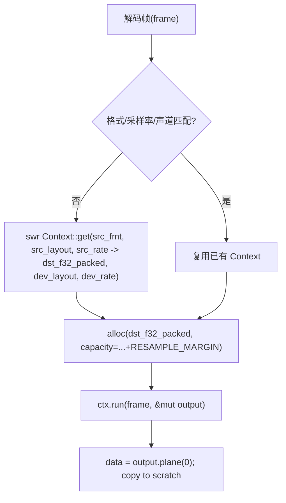

图表来源
- [workers.rs:2005-2078](file://crates/mvp-core/src/engine/workers.rs#L2005-L2078)

章节来源
- [workers.rs:2005-2078](file://crates/mvp-core/src/engine/workers.rs#L2005-L2078)

### 音频数据处理流程
- 解码：FFmpeg 解码器 produce AudioFrame。
- 重采样：swr 将任意格式转为 f32 packed，适配设备布局与采样率。
- 时间拉伸：TimeStretcher.push 对 PCM 进行 SOLA 变速，保持音高。
- 预取控制：wait_for_audio_lead 比较 pts 与 Clock.now()，按 speed 换算等待时间，确保解码领先不超 AUDIO_LEAD。
- 输出：sink.push 将 stretched 数据推入跨线程队列，cpal 回调消费并应用音量与音效链。

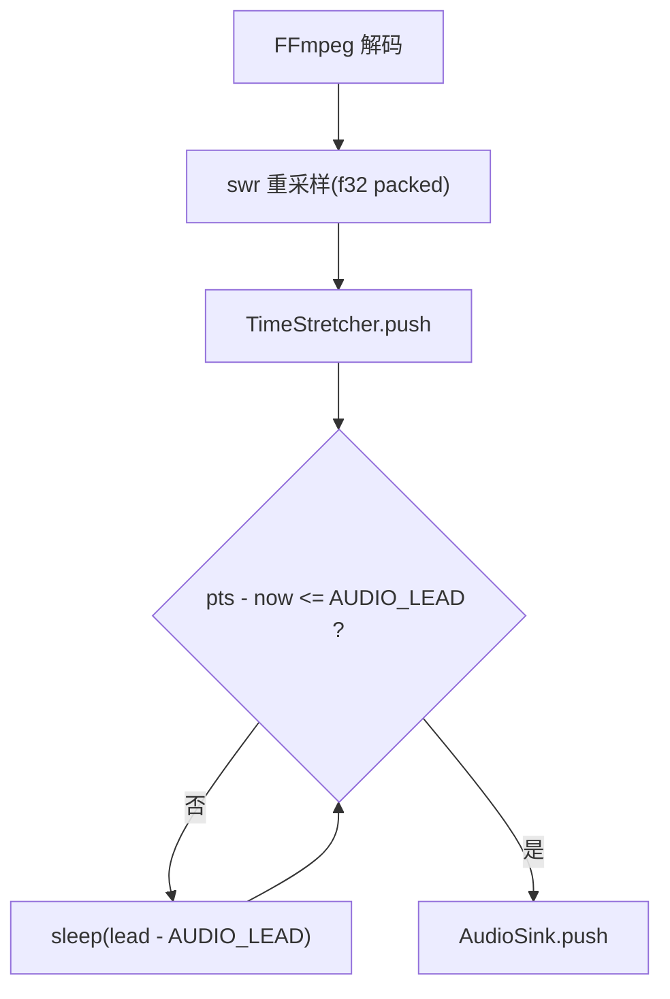

图表来源
- [workers.rs:1937-2094](file://crates/mvp-core/src/engine/workers.rs#L1937-L2094)
- [workers.rs:1909-1934](file://crates/mvp-core/src/engine/workers.rs#L1909-L1934)

章节来源
- [workers.rs:1937-2094](file://crates/mvp-core/src/engine/workers.rs#L1937-L2094)

### AudioSink 集成：设备抽象、缓冲与延迟补偿
- 设备选择：优先匹配用户指定名称，否则使用系统默认；自动将非常规采样率替换为 48k/44.1k 以获得稳定时钟与更低缓冲延迟。
- 实时回调：cpal 回调中从 crossbeam 队列取块，按 generation 丢弃旧数据；逐样本应用音量（软膝）与 EnhanceChain；不足时补零并计数 underruns。
- 缓冲与延迟：queued_seconds 基于 chunk_frames 与队列长度估算秒级延迟；position 基于 anchor_pts/anchor_ns 与 speed 计算媒体时间，不受驱动回调频率影响。
- 控制接口：push/close/flush/set_paused/set_speed/set_volume/set_muted/effective_gain 等。

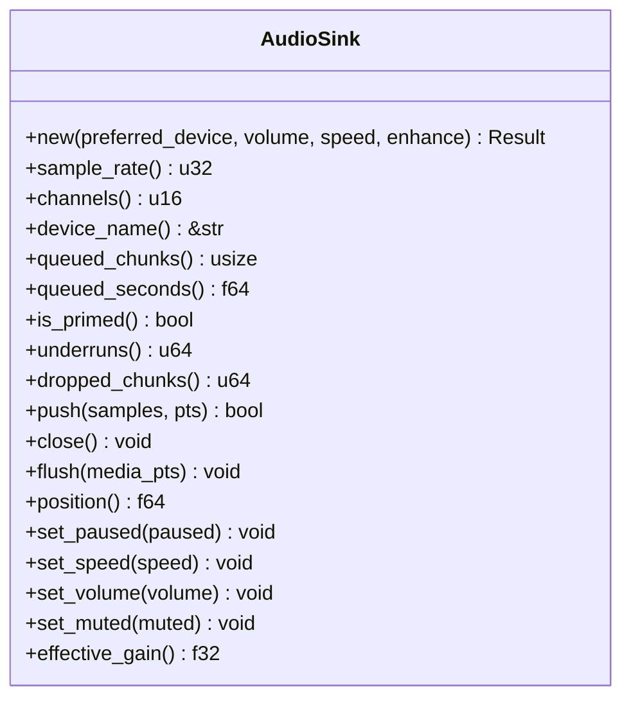

图表来源
- [audio.rs:153-318](file://crates/mvp-core/src/audio.rs#L153-L318)
- [audio.rs:320-461](file://crates/mvp-core/src/audio.rs#L320-L461)
- [audio.rs:463-696](file://crates/mvp-core/src/audio.rs#L463-L696)

章节来源
- [audio.rs:153-318](file://crates/mvp-core/src/audio.rs#L153-L318)
- [audio.rs:320-461](file://crates/mvp-core/src/audio.rs#L320-L461)
- [audio.rs:463-696](file://crates/mvp-core/src/audio.rs#L463-L696)

### 与主时钟的同步机制
- Clock 优先使用 AudioSink.position() 作为媒体位置；当音频未就绪或停顿时回退到 wall clock，并通过 anchor_media/anchor_instant 保持连续性。
- set_speed 会先冻结当前 position，再更新 speed 并同步到 sink.set_speed。
- seek 会同步 sink.flush(target)，使音频时钟与画面时钟一致。

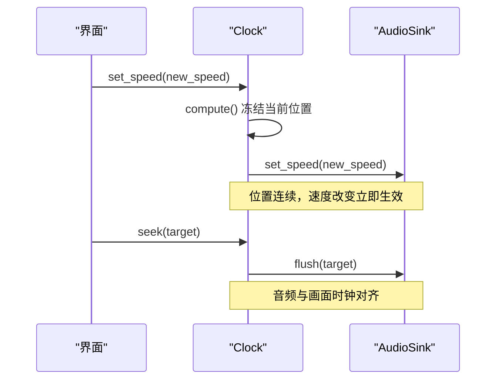

图表来源
- [clock.rs:104-115](file://crates/mvp-core/src/engine/clock.rs#L104-L115)
- [clock.rs:74-84](file://crates/mvp-core/src/engine/clock.rs#L74-L84)
- [clock.rs:133-158](file://crates/mvp-core/src/engine/clock.rs#L133-L158)

章节来源
- [clock.rs:44-158](file://crates/mvp-core/src/engine/clock.rs#L44-L158)

### 基于播放头的音频预取策略与 AUDIO_LEAD
- 常量：AUDIO_LEAD = 0.5s，表示解码最多领先播放头 0.5 秒。
- wait_for_audio_lead：计算 lead = (pts - clock.now()) / speed，若大于 AUDIO_LEAD 则 sleep 相应时长，直到满足条件或被 abort/flush 打断。
- 目的：避免解码过快导致“未听见的变速”堆积，保证用户操作（变速、seek）及时响应。

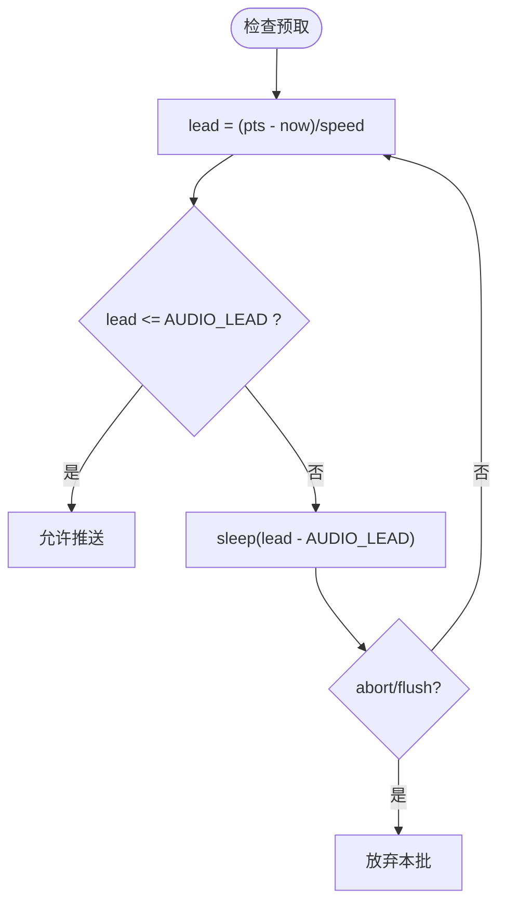

图表来源
- [workers.rs:1909-1934](file://crates/mvp-core/src/engine/workers.rs#L1909-L1934)

章节来源
- [workers.rs:1909-1934](file://crates/mvp-core/src/engine/workers.rs#L1909-L1934)

### 音效增强处理（EnhanceChain）
- 运行位置：cpal 回调中，实时线程，绝不分配/锁/日志。
- 链路顺序：EQ → 低频提升+谐波 → 清晰度+瞬态 → 响度(K-weighted) → 空间(width+reverb) → 软限幅。
- 参数发布：EnhanceParams 使用原子与 generation 序列锁，回调 load 一次一致的 Snapshot。
- 延迟与就绪：chain.latency_ms() 暴露给 UI；ready 标志指示链已为当前设备构建。

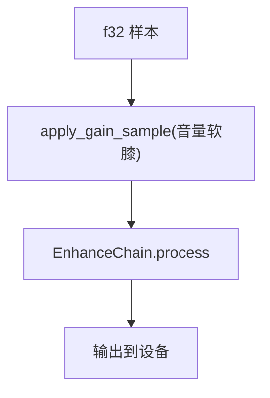

图表来源
- [audio.rs:408-442](file://crates/mvp-core/src/audio.rs#L408-L442)
- [enhance.rs:1-33](file://crates/mvp-core/src/dsp/enhance.rs#L1-L33)
- [enhance.rs:206-321](file://crates/mvp-core/src/dsp/enhance.rs#L206-L321)

章节来源
- [enhance.rs:1-33](file://crates/mvp-core/src/dsp/enhance.rs#L1-L33)
- [enhance.rs:206-321](file://crates/mvp-core/src/dsp/enhance.rs#L206-L321)

### 时间拉伸（SOLA）
- TimeStretcher：基于 SOLA，输入 hop 固定（约 20ms），输出 hop 随 speed 缩放；通过互相关对齐前后窗，交叉淡入淡出拼接。
- 行为：speed=1.0 直通；变速时内部缓冲约 40–120ms 前瞻；flush 时补零释放尾段。
- 与解码线程协作：drain_audio 在每次 push 前更新 stretcher.speed()，并在 Eof 后 flush 尾部。

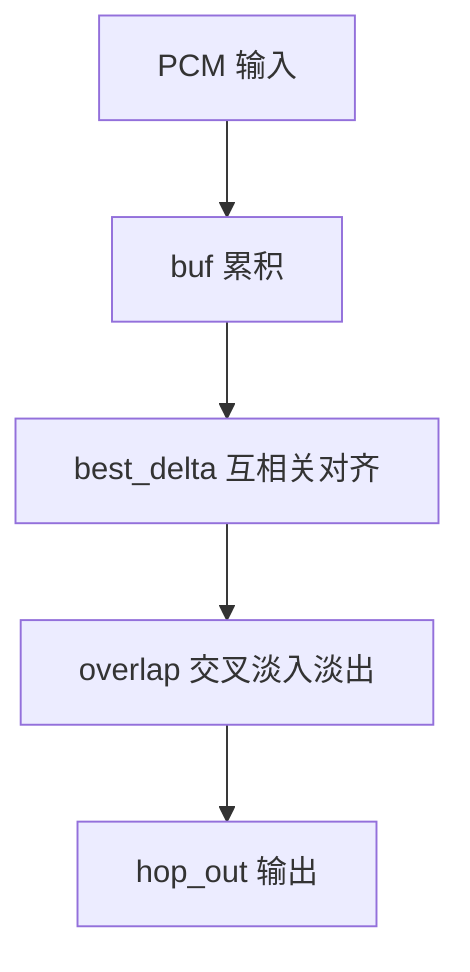

图表来源
- [dsp.rs:1-26](file://crates/mvp-core/src/dsp.rs#L1-L26)
- [dsp.rs:149-178](file://crates/mvp-core/src/dsp.rs#L149-L178)
- [dsp.rs:181-234](file://crates/mvp-core/src/dsp.rs#L181-L234)

章节来源
- [dsp.rs:1-26](file://crates/mvp-core/src/dsp.rs#L1-L26)
- [dsp.rs:149-234](file://crates/mvp-core/src/dsp.rs#L149-L234)

## 依赖关系分析
- workers.rs 依赖 ffmpeg_next 进行解码与重采样，依赖 crossbeam_channel 进行消息传递，依赖 audio.AudioSink 进行输出。
- audio.rs 依赖 cpal 进行设备 I/O，依赖 dsp.EnhanceChain 进行音效处理。
- clock.rs 依赖 audio.AudioSink 作为主时钟参考。
- queue.rs 定义 VideoMsg/AudioMsg/PacketMsg，被 workers.rs 消费。
- dsp.rs 提供 TimeStretcher 与增益工具，被 workers.rs 与 audio.rs 使用。
- lib.rs 负责 FFmpeg 全局初始化。

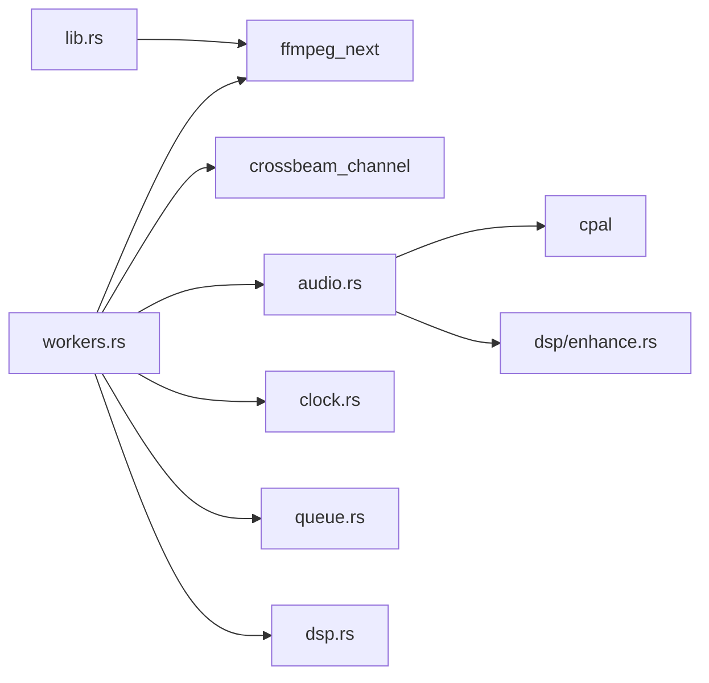

图表来源
- [workers.rs:1-24](file://crates/mvp-core/src/engine/workers.rs#L1-L24)
- [audio.rs:27-35](file://crates/mvp-core/src/audio.rs#L27-L35)
- [clock.rs:16-24](file://crates/mvp-core/src/engine/clock.rs#L16-L24)
- [queue.rs:1-10](file://crates/mvp-core/src/engine/queue.rs#L1-L10)
- [dsp.rs:1-20](file://crates/mvp-core/src/dsp.rs#L1-L20)
- [lib.rs:48-69](file://crates/mvp-core/src/lib.rs#L48-L69)

章节来源
- [workers.rs:1-24](file://crates/mvp-core/src/engine/workers.rs#L1-L24)
- [audio.rs:27-35](file://crates/mvp-core/src/audio.rs#L27-L35)
- [clock.rs:16-24](file://crates/mvp-core/src/engine/clock.rs#L16-L24)
- [queue.rs:1-10](file://crates/mvp-core/src/engine/queue.rs#L1-L10)
- [dsp.rs:1-20](file://crates/mvp-core/src/dsp.rs#L1-L20)
- [lib.rs:48-69](file://crates/mvp-core/src/lib.rs#L48-L69)

## 性能与延迟特性
- 设备采样率优选：将非标准采样率替换为 48k/44.1k，避免驱动回调吞吐异常导致的时钟漂移与欠载。
- 重采样容量预留：RESAMPLE_MARGIN 防止因 swr 内部缓存导致的输出截断，保障设备端持续播放。
- 预取策略：AUDIO_LEAD=0.5s，平衡低延迟与抗抖动；变速时通过 stretcher 保持音高，避免 atempo 额外开销。
- 实时安全：AudioSink 回调仅做原子读、内存复用与简单数学运算；EnhanceChain 参数通过原子快照，避免锁竞争。
- 丢帧与欠载：dropped_chunks 与 underruns 可观测；当队列满时 push 超时回压，避免无限增长。

[本节为通用性能讨论，不直接分析具体文件]

## 故障排查指南
- 无法打开音频解码器：检查 find_decoder/open_audio_decoder 返回值与日志，确认系统是否安装对应编解码器。
- 重采样失败：检查 frame.format/rate/layout 与设备配置是否合理；查看 log 中的“无法创建重采样上下文”。
- 声音卡顿/断续：观察 AudioSink.underruns 与 queued_seconds；增大 AUDIO_LEAD 或降低音效链复杂度。
- 变速不生效或滞后：确认 stretcher.set_speed 被调用且 wait_for_audio_lead 未被 abort/flush 打断。
- 设备无声：检查 preferred_config 是否成功替换采样率；确认 cpal 流 play 成功；查看 error_fn 日志。
- 暂停/恢复跳变：确认 Clock.set_running 与 AudioSink.set_paused 同步；检查 paused_at_ns 与 anchor_ns 调整逻辑。

章节来源
- [workers.rs:1734-1740](file://crates/mvp-core/src/engine/workers.rs#L1734-L1740)
- [workers.rs:2015-2029](file://crates/mvp-core/src/engine/workers.rs#L2015-L2029)
- [audio.rs:222-308](file://crates/mvp-core/src/audio.rs#L222-L308)
- [audio.rs:478-506](file://crates/mvp-core/src/audio.rs#L478-L506)
- [audio.rs:620-659](file://crates/mvp-core/src/audio.rs#L620-L659)

## 结论
MVP-Versatile-Player 的音频解码线程以 FFmpeg 解码为核心，结合 swr 重采样、SOLA 时间拉伸与 cpal 实时输出，构建了低延迟、抗抖动的播放管线。AudioSink 通过原子状态与跨线程队列实现安全的实时回调，Clock 提供稳定的媒体位置参考。AUDIO_LEAD 预取策略在保证流畅性的同时兼顾交互响应。整体设计在性能、稳定性与音质之间取得良好平衡。

[本节为总结性内容，不直接分析具体文件]

## 附录：代码片段路径与最佳实践

- 解码循环与消息处理
  - [run_audio_decoder 主循环:1760-1879](file://crates/mvp-core/src/engine/workers.rs#L1760-L1879)
  - [Eof 与 Packet 分支:1827-1876](file://crates/mvp-core/src/engine/workers.rs#L1827-L1876)

- 重采样与 PCM 转换
  - [重采样上下文重建与输出分配:2005-2078](file://crates/mvp-core/src/engine/workers.rs#L2005-L2078)

- 预取策略
  - [wait_for_audio_lead:1909-1934](file://crates/mvp-core/src/engine/workers.rs#L1909-L1934)

- 设备管理与缓冲
  - [AudioSink.new 与 build:180-318](file://crates/mvp-core/src/audio.rs#L180-L318)
  - [cpal 回调与音效链:320-461](file://crates/mvp-core/src/audio.rs#L320-L461)
  - [队列与延迟统计:478-506](file://crates/mvp-core/src/audio.rs#L478-L506)

- 主时钟同步
  - [Clock.set_speed / seek:104-115](file://crates/mvp-core/src/engine/clock.rs#L104-L115)
  - [Clock.compute:133-158](file://crates/mvp-core/src/engine/clock.rs#L133-L158)

- 时间拉伸
  - [TimeStretcher.push/flush:149-178](file://crates/mvp-core/src/dsp.rs#L149-L178)
  - [SOLA 核心处理:181-234](file://crates/mvp-core/src/dsp.rs#L181-L234)

- 音效增强
  - [EnhanceChain 参数发布与加载:206-321](file://crates/mvp-core/src/dsp/enhance.rs#L206-L321)
  - [回调中应用音效链:433-442](file://crates/mvp-core/src/audio.rs#L433-L442)

- FFmpeg 初始化
  - [init 与版本信息:50-69](file://crates/mvp-core/src/lib.rs#L50-L69)

章节来源
- [workers.rs:1760-1879](file://crates/mvp-core/src/engine/workers.rs#L1760-L1879)
- [workers.rs:1909-1934](file://crates/mvp-core/src/engine/workers.rs#L1909-L1934)
- [workers.rs:2005-2078](file://crates/mvp-core/src/engine/workers.rs#L2005-L2078)
- [audio.rs:180-318](file://crates/mvp-core/src/audio.rs#L180-L318)
- [audio.rs:320-461](file://crates/mvp-core/src/audio.rs#L320-L461)
- [audio.rs:478-506](file://crates/mvp-core/src/audio.rs#L478-L506)
- [clock.rs:104-115](file://crates/mvp-core/src/engine/clock.rs#L104-L115)
- [clock.rs:133-158](file://crates/mvp-core/src/engine/clock.rs#L133-L158)
- [dsp.rs:149-234](file://crates/mvp-core/src/dsp.rs#L149-L234)
- [enhance.rs:206-321](file://crates/mvp-core/src/dsp/enhance.rs#L206-L321)
- [lib.rs:50-69](file://crates/mvp-core/src/lib.rs#L50-L69)