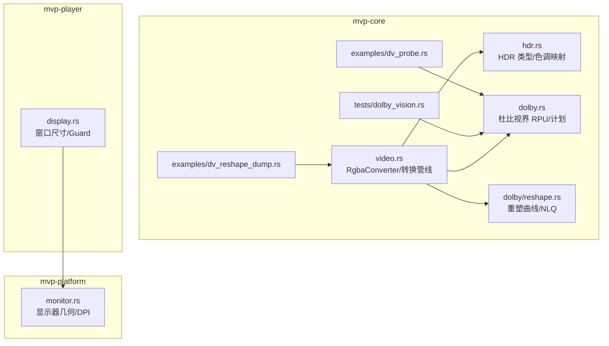
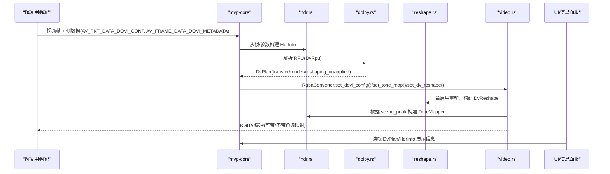
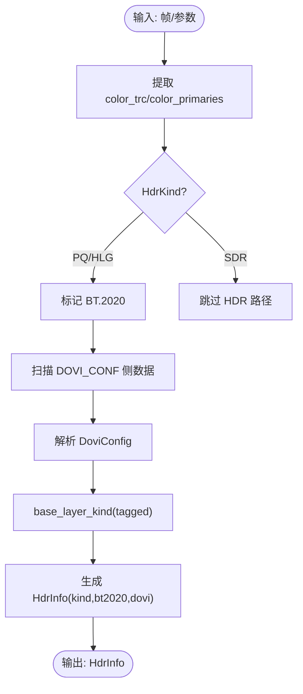
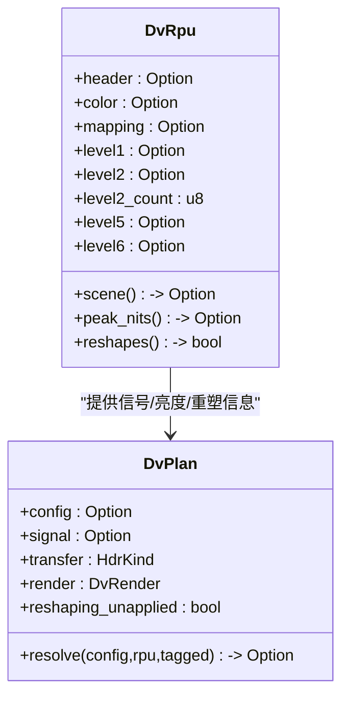
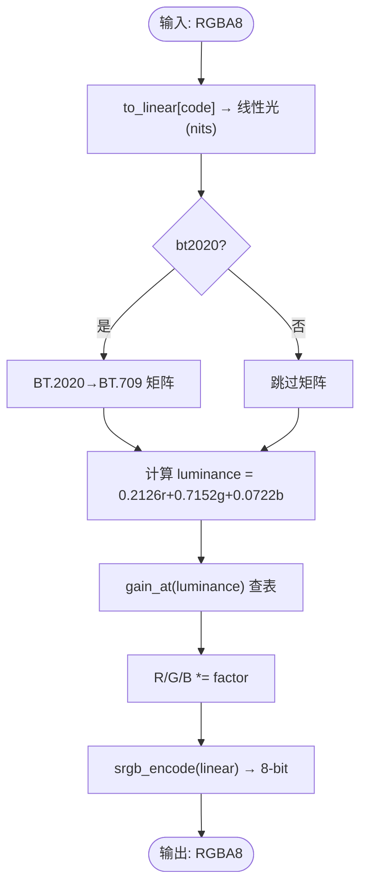
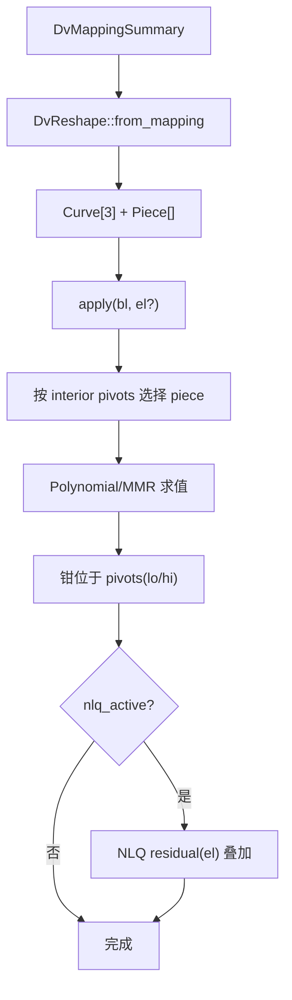
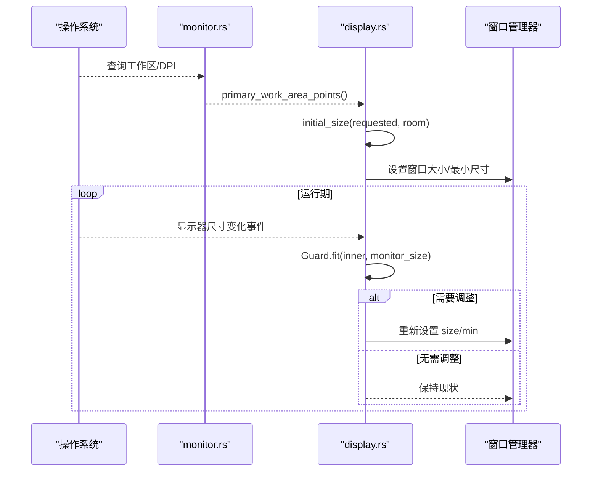
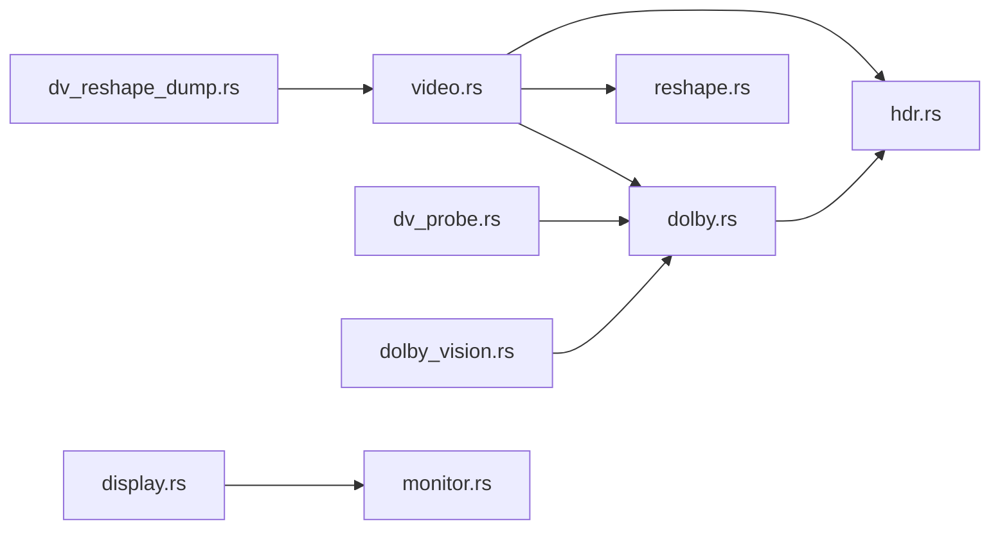

# HDR 处理系统

<cite>
**本文引用的文件**   
- [hdr.rs](file://crates/mvp-core/src/hdr.rs)
- [dolby.rs](file://crates/mvp-core/src/dolby.rs)
- [reshape.rs](file://crates/mvp-core/src/dolby/reshape.rs)
- [monitor.rs](file://crates/mvp-platform/src/monitor.rs)
- [display.rs](file://crates/mvp-player/src/display.rs)
- [video.rs](file://crates/mvp-core/src/video.rs)
- [dv_probe.rs](file://crates/mvp-core/examples/dv_probe.rs)
- [dv_reshape_dump.rs](file://crates/mvp-core/examples/dv_reshape_dump.rs)
- [dolby_vision.rs](file://crates/mvp-core/tests/dolby_vision.rs)
</cite>

## 目录
1. [简介](#简介)
2. [项目结构](#项目结构)
3. [核心组件](#核心组件)
4. [架构总览](#架构总览)
5. [详细组件分析](#详细组件分析)
6. [依赖关系分析](#依赖关系分析)
7. [性能与优化](#性能与优化)
8. [故障排查与画质调优](#故障排查与画质调优)
9. [结论](#结论)
10. [附录：示例用法](#附录示例用法)

## 简介
本技术文档围绕仓库中的 HDR 处理子系统展开，覆盖以下目标：
- HDR10 识别与处理：静态元数据解析、主显示参数提取、色域信息处理。
- 杜比视界（Dolby Vision）处理：RPU 元数据解析、基础层与增强层分离、动态元数据处理。
- 色调映射算法：PQ 到 HLG 转换、亮度范围压缩、局部与全局色调映射策略说明。
- RPU 重塑处理：曲线重建、像素值重映射、色彩空间适配。
- 多显示器环境下的 HDR 支持：显示器能力检测、最佳渲染模式选择、动态切换机制。
- 代码级示例路径、性能优化技巧、画质调优指南与常见问题解决方案。

该系统的核心思想是“先正确理解信号，再谨慎地映射”：容器配置记录决定基底层传输函数，帧级 RPU 提供逐帧亮度与重塑曲线；在 SDR 显示器上通过 CPU 查表实现近似但高效的色调映射，GPU 着色器是更精确的下一步。

## 项目结构
HDR 相关代码主要分布在三个 crate：
- mvp-core：HDR 类型、杜比视界解析、重塑曲线、色调映射、视频转换管线。
- mvp-platform：平台显示器几何与 DPI 能力探测。
- mvp-player：窗口尺寸与可见性保护，间接影响 HDR 渲染上下文。

**图表来源**
- [hdr.rs:1-770](file://crates/mvp-core/src/hdr.rs#L1-L770)
- [dolby.rs:1-887](file://crates/mvp-core/src/dolby.rs#L1-L887)
- [reshape.rs:1-597](file://crates/mvp-core/src/dolby/reshape.rs#L1-L597)
- [video.rs:657-695](file://crates/mvp-core/src/video.rs#L657-L695)
- [monitor.rs:1-360](file://crates/mvp-platform/src/monitor.rs#L1-L360)
- [display.rs:1-300](file://crates/mvp-player/src/display.rs#L1-L300)
- [dv_probe.rs:1-179](file://crates/mvp-core/examples/dv_probe.rs#L1-L179)
- [dv_reshape_dump.rs:1-148](file://crates/mvp-core/examples/dv_reshape_dump.rs#L1-L148)
- [dolby_vision.rs:174-206](file://crates/mvp-core/tests/dolby_vision.rs#L174-L206)

**章节来源**
- [hdr.rs:1-770](file://crates/mvp-core/src/hdr.rs#L1-L770)
- [dolby.rs:1-887](file://crates/mvp-core/src/dolby.rs#L1-L887)
- [reshape.rs:1-597](file://crates/mvp-core/src/dolby/reshape.rs#L1-L597)
- [monitor.rs:1-360](file://crates/mvp-platform/src/monitor.rs#L1-L360)
- [display.rs:1-300](file://crates/mvp-player/src/display.rs#L1-L300)

## 核心组件
- HDR 类型与色调映射
  - HdrKind：SDR / PQ / HLG，用于标识流编码的传递函数。
  - DoviConfig：容器声明的杜比视界配置记录（Profile/Level/RPU/EL/BL/兼容 ID）。
  - HdrInfo：流的动态范围描述（传输函数、BT.2020 标记、可选 DoviConfig）。
  - ToneMapper：CPU 查表实现的色调映射器，包含 to_linear/gain/encode 三张表，按场景峰值调整肩部曲线。
- 杜比视界解析
  - DvRpuHeader/DvColorMetadata/DvDataMapping/DvReshapingCurve/DvNlqParams：镜像 FFmpeg 的杜比视界 C 布局。
  - DvRpu：从解码帧侧数据中解析 RPU，聚合 header/color/mapping/level1/level2/level5/level6。
  - DvPlan：统一决策点，决定基底层传输函数、渲染类别（BaseLayer/IPT）、是否未应用重塑。
- 重塑曲线与 NLQ
  - DvReshape：分段多项式与 MMR 曲线评估，非线性反量化（NLQ）残差合成。
- 视频转换管线
  - RgbaConverter：控制 tone_map、dv_reshape、dovi_config，输出 RGBA 并统计耗时。
- 显示器与窗口
  - monitor.rs：Windows 下获取工作区、DPI、位置可达性。
  - display.rs：初始窗口大小计算与 Guard 运行时自适应。

**章节来源**
- [hdr.rs:30-495](file://crates/mvp-core/src/hdr.rs#L30-L495)
- [dolby.rs:117-887](file://crates/mvp-core/src/dolby.rs#L117-L887)
- [reshape.rs:71-390](file://crates/mvp-core/src/dolby/reshape.rs#L71-L390)
- [video.rs:657-695](file://crates/mvp-core/src/video.rs#L657-L695)
- [monitor.rs:16-226](file://crates/mvp-platform/src/monitor.rs#L16-L226)
- [display.rs:21-166](file://crates/mvp-player/src/display.rs#L21-L166)

## 架构总览
HDR 处理流程分为两条主线：
- 静态路径：容器配置记录 + 流标签 → 确定基底层传输函数与 BT.2020 标记。
- 动态路径：每帧 RPU → Level 1 亮度范围、Level 2/5/6 扩展块 → 重塑曲线与 NLQ。

**图表来源**
- [hdr.rs:175-271](file://crates/mvp-core/src/hdr.rs#L175-L271)
- [dolby.rs:505-698](file://crates/mvp-core/src/dolby.rs#L505-L698)
- [reshape.rs:185-331](file://crates/mvp-core/src/dolby/reshape.rs#L185-L331)
- [video.rs:657-695](file://crates/mvp-core/src/video.rs#L657-L695)

## 详细组件分析

### HDR10 识别与处理
- 静态元数据解析
  - 从解码帧或编解码参数中提取 color_trc/color_primaries，得到 HdrKind 与 bt2020 标记。
  - 扫描 coded_side_data 中的 AV_PKT_DATA_DOVI_CONF，解析 DoviConfig。
- 主显示参数提取
  - DvColorMetadata.source_min_pq/source_max_pq 转换为尼特，作为母版亮度窗口。
  - DvRpu.scene() 将 Level 1 的 min/avg/max PQ 码值转为尼特，用于逐帧动态元数据。
- 色域信息处理
  - 杜比视界的 YCbCr→RGB 与 RGB→LMS 矩阵由 DvColorMetadata 提供，用于 IPT/ICtCp 空间处理（Profile 5）。
  - 对 SDR 显示，ToneMapper 使用 BT.2020→BT.709 矩阵进行色域转换。

**图表来源**
- [hdr.rs:175-271](file://crates/mvp-core/src/hdr.rs#L175-L271)
- [hdr.rs:124-141](file://crates/mvp-core/src/hdr.rs#L124-L141)

**章节来源**
- [hdr.rs:175-271](file://crates/mvp-core/src/hdr.rs#L175-L271)
- [hdr.rs:124-141](file://crates/mvp-core/src/hdr.rs#L124-L141)

### 杜比视界（Dolby Vision）处理
- RPU 元数据解析
  - DvRpu::from_frame 遍历帧侧数据，定位 AV_FRAME_DATA_DOVI_METADATA，安全边界检查后解析 header/color/mapping/扩展块。
  - Level 1/2/5/6 扩展块分别提供亮度范围、目标显示器 trim、活动区域、静态母版元数据。
- 基础层与增强层分离
  - DvRpuHeader.disable_residual_flag 指示增强层残差是否禁用；DvDataMapping.nlq_method_idc 指定 NLQ 方法。
  - DvReshape 支持 NLQ 残差合成，但当前样本无增强层时仅走曲线映射。
- 动态元数据处理
  - DvRpu.scene() 返回 min_nits/avg_nits/max_nits；DvPlan.resolve 综合 config/rpu/tagged 决定 transfer/render/reshaping_unapplied。

**图表来源**
- [dolby.rs:485-698](file://crates/mvp-core/src/dolby.rs#L485-L698)
- [dolby.rs:735-798](file://crates/mvp-core/src/dolby.rs#L735-L798)

**章节来源**
- [dolby.rs:505-698](file://crates/mvp-core/src/dolby.rs#L505-L698)
- [dolby.rs:735-798](file://crates/mvp-core/src/dolby.rs#L735-L798)

### 色调映射算法
- PQ 到 HLG 转换
  - pq_to_nits(e) 将 PQ 码值转为绝对亮度（尼特），hlg_to_nits(e) 将 HLG 码值转为 1000-nit 参考显示上的亮度。
- 亮度范围压缩
  - tone_curve(nits, shoulder) 在 knee 以下为恒等，knee 以上采用软肩曲线逼近白点但不越界。
  - shoulder_for_peak(peak_nits) 根据场景峰值求解肩部参数，使峰值落在 TARGET_PEAK。
- 局部与全局色调映射
  - 当前实现为全局映射：对每个像素计算 luminance，查 gain 表缩放 R/G/B，再进行 BT.2020→BT.709 矩阵转换。
  - 局部映射（如分区映射）未在代码中实现，属于未来 GPU 着色器的改进方向。

**图表来源**
- [hdr.rs:451-495](file://crates/mvp-core/src/hdr.rs#L451-L495)
- [hdr.rs:497-564](file://crates/mvp-core/src/hdr.rs#L497-L564)

**章节来源**
- [hdr.rs:344-495](file://crates/mvp-core/src/hdr.rs#L344-L495)
- [hdr.rs:497-564](file://crates/mvp-core/src/hdr.rs#L497-L564)

### RPU 重塑处理
- 曲线重建
  - DvReshape::from_mapping 将 RPU 的分段多项式/MMR 系数与 pivots 规范化为 Curve/Piece。
  - 未知 mapping method 直接拒绝，避免不可预测的色彩变换。
- 像素值重映射
  - apply_component 根据信号所在区间选择 piece，计算多项式或 MMR 结果，并按 pivots 钳位。
- 色彩空间适配
  - 重塑作用于 Y/Cb/Cr 分量（未做有限范围扩展与色度偏移），后续 scaler 负责 YCbCr→RGB 与范围处理。
  - NLQ 残差在重塑之后叠加，符合 libplacebo 的合成顺序。

**图表来源**
- [reshape.rs:185-331](file://crates/mvp-core/src/dolby/reshape.rs#L185-L331)
- [reshape.rs:333-390](file://crates/mvp-core/src/dolby/reshape.rs#L333-L390)

**章节来源**
- [reshape.rs:185-390](file://crates/mvp-core/src/dolby/reshape.rs#L185-L390)

### 多显示器环境下的 HDR 支持
- 显示器能力检测
  - monitor.rs 提供 primary_work_area、dpi_of_window、position_is_reachable 等 API，用于判断可用区域与 DPI。
- 最佳渲染模式选择
  - display.rs 的 initial_size 与 Guard::fit 确保窗口不会超出屏幕，保留任务栏空间，避免最大化窗口被误缩。
- 动态切换机制
  - Guard 仅在显示器尺寸变化时触发调整，避免与用户手动拖拽冲突。

**图表来源**
- [monitor.rs:130-226](file://crates/mvp-platform/src/monitor.rs#L130-L226)
- [display.rs:53-166](file://crates/mvp-player/src/display.rs#L53-L166)

**章节来源**
- [monitor.rs:130-226](file://crates/mvp-platform/src/monitor.rs#L130-L226)
- [display.rs:53-166](file://crates/mvp-player/src/display.rs#L53-L166)

## 依赖关系分析
- mvp-core 内部依赖
  - video.rs 依赖 hdr.rs（ToneMapper/HdrInfo）、dolby.rs（DvPlan/DvRpu）、dolby/reshape.rs（DvReshape）。
  - dolby.rs 依赖 hdr.rs（pq_code_to_nits/DoviConfig/HdrKind）。
- 外部依赖
  - ffmpeg_next/ffmpeg::ffi：访问 AVCodecParameters、AVFrame side data、DOVI_CONF/DOVI_METADATA。
- 平台与 UI
  - mvp-platform::monitor 被 mvp-player::display 调用以适配窗口尺寸。

**图表来源**
- [video.rs:657-695](file://crates/mvp-core/src/video.rs#L657-L695)
- [dolby.rs:1-887](file://crates/mvp-core/src/dolby.rs#L1-L887)
- [hdr.rs:1-770](file://crates/mvp-core/src/hdr.rs#L1-L770)
- [reshape.rs:1-597](file://crates/mvp-core/src/dolby/reshape.rs#L1-L597)
- [monitor.rs:1-360](file://crates/mvp-platform/src/monitor.rs#L1-L360)
- [display.rs:1-300](file://crates/mvp-player/src/display.rs#L1-L300)

**章节来源**
- [video.rs:657-695](file://crates/mvp-core/src/video.rs#L657-L695)
- [dolby.rs:1-887](file://crates/mvp-core/src/dolby.rs#L1-L887)
- [hdr.rs:1-770](file://crates/mvp-core/src/hdr.rs#L1-L770)
- [reshape.rs:1-597](file://crates/mvp-core/src/dolby/reshape.rs#L1-L597)
- [monitor.rs:1-360](file://crates/mvp-platform/src/monitor.rs#L1-L360)
- [display.rs:1-300](file://crates/mvp-player/src/display.rs#L1-L300)

## 性能与优化
- 色调映射性能
  - ToneMapper 使用三张预计算表（to_linear/gain/encode），每像素一次查表与少量乘法，保证 CPU 实时性。
  - 测试断言 4K 帧映射时间低于阈值，防止退化为不可接受的性能。
- 重塑曲线性能
  - DvReshape::is_identity 快速跳过无变化的曲线；MMR 项仅在必要时计算。
- 管线优化建议
  - 将精确的色调映射与色域转换移至 GPU 着色器，减少 CPU 带宽与精度损失。
  - 对高动态范围内容优先使用 Scene Peak 驱动的肩部曲线，避免过度压缩。

**章节来源**
- [hdr.rs:344-495](file://crates/mvp-core/src/hdr.rs#L344-L495)
- [hdr.rs:746-767](file://crates/mvp-core/src/hdr.rs#L746-L767)
- [reshape.rs:279-331](file://crates/mvp-core/src/dolby/reshape.rs#L279-L331)

## 故障排查与画质调优
- 亮度异常
  - 现象：高光过曝或画面发灰。
  - 原因：错误地将 HLG 兼容基底层当作 PQ 曲线处理；或 ToneMapper 肩部参数不当。
  - 解决：确认 DoviConfig.base_layer_kind 与 DvPlan.transfer；启用 dv_reshape 以还原基底层。
- 色彩失真
  - 现象：饱和度异常或色相偏移。
  - 原因：BT.2020→BT.709 矩阵未应用；或 Profile 5 的 IPT 基底层未正确逆映射。
  - 解决：确保 HdrInfo.bt2020 标记正确；对于 Profile 5，提示颜色可能不正确，等待专用渲染器。
- 兼容性问题的处理方法
  - 杜比视界文件无 RPU：仅使用容器记录与流标签；若仍异常，检查 FFmpeg 版本与侧数据可用性。
  - 增强层缺失：当前样本无 EL，NLQ 路径不生效；若未来有 EL，需确保引擎传入增强层残差。
- 画质调优指南
  - 启用 dv_reshape：在 settings 中打开 dv_reshape，以应用 RPU 描述的曲线。
  - 关闭色调映射：对比 libplacebo 渲染结果，验证重塑曲线正确性。
  - 观察 DvPlan.caveats：了解 IPT 基底层、未应用重塑等限制。

**章节来源**
- [dolby.rs:39-77](file://crates/mvp-core/src/dolby.rs#L39-L77)
- [hdr.rs:109-141](file://crates/mvp-core/src/hdr.rs#L109-L141)
- [reshape.rs:39-53](file://crates/mvp-core/src/dolby/reshape.rs#L39-L53)

## 结论
该 HDR 处理系统在“正确理解信号”的前提下，提供了稳健的杜比视界解析、重塑曲线支持与 CPU 色调映射实现。通过 DvPlan 统一决策、ToneMapper 高效查表、DvReshape 精确曲线评估，系统在现有样本上实现了可验证的正确性与可接受的实时性能。未来重点在于 GPU 着色器实现更精确的色调映射与色域转换，以及增强层残差的完整集成。

## 附录：示例用法
- 探测杜比视界元数据
  - 命令：cargo run -p mvp-core --example dv_probe -- <file> [frames]
  - 功能：打印容器配置记录、DvPlan、前 N 帧 RPU 的 header/signal/mapping/level1/level2/level5/level6。
- 导出重塑后的帧
  - 命令：cargo run -p mvp-core --example dv_reshape_dump -- <file> [frame-index] [out.png]
  - 功能：关闭色调映射、开启重塑，输出原始信号编码的 PNG，用于与 libplacebo 结果比对。

**章节来源**
- [dv_probe.rs:1-179](file://crates/mvp-core/examples/dv_probe.rs#L1-L179)
- [dv_reshape_dump.rs:1-148](file://crates/mvp-core/examples/dv_reshape_dump.rs#L1-L148)