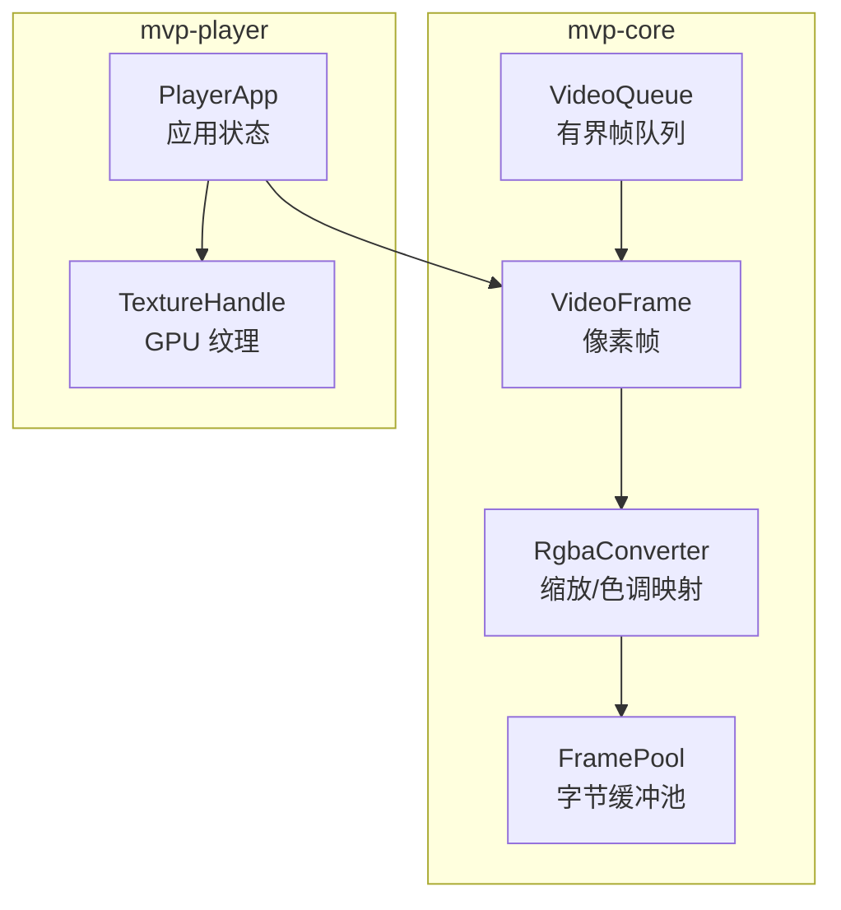
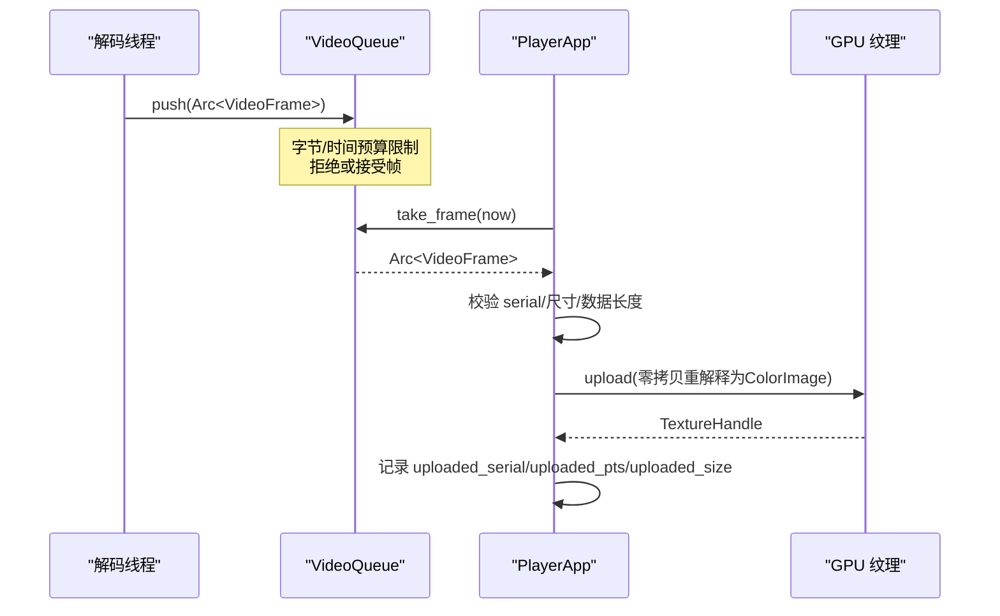
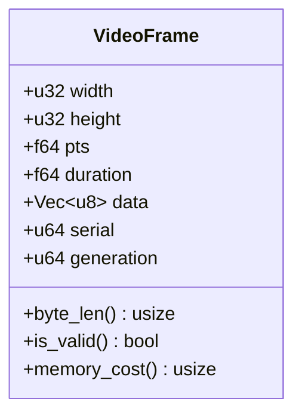
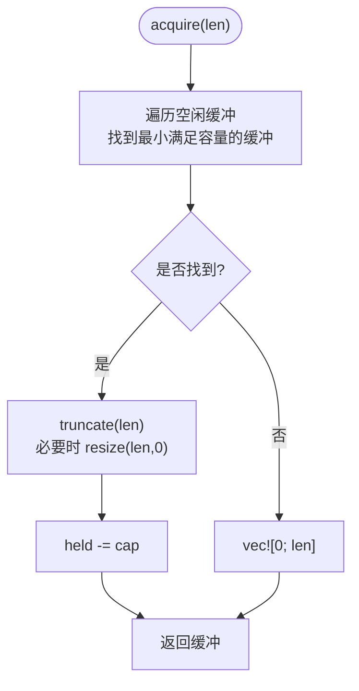
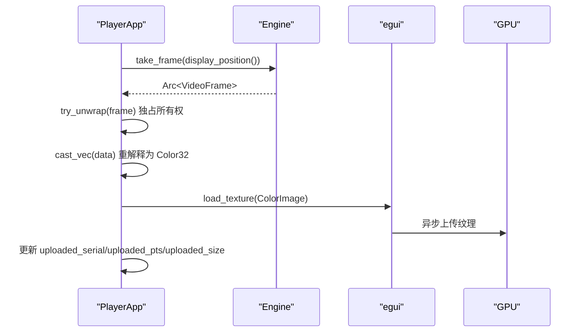
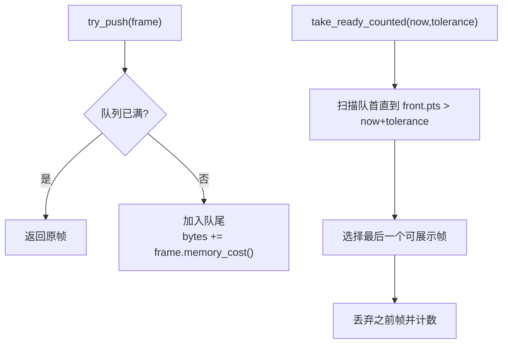
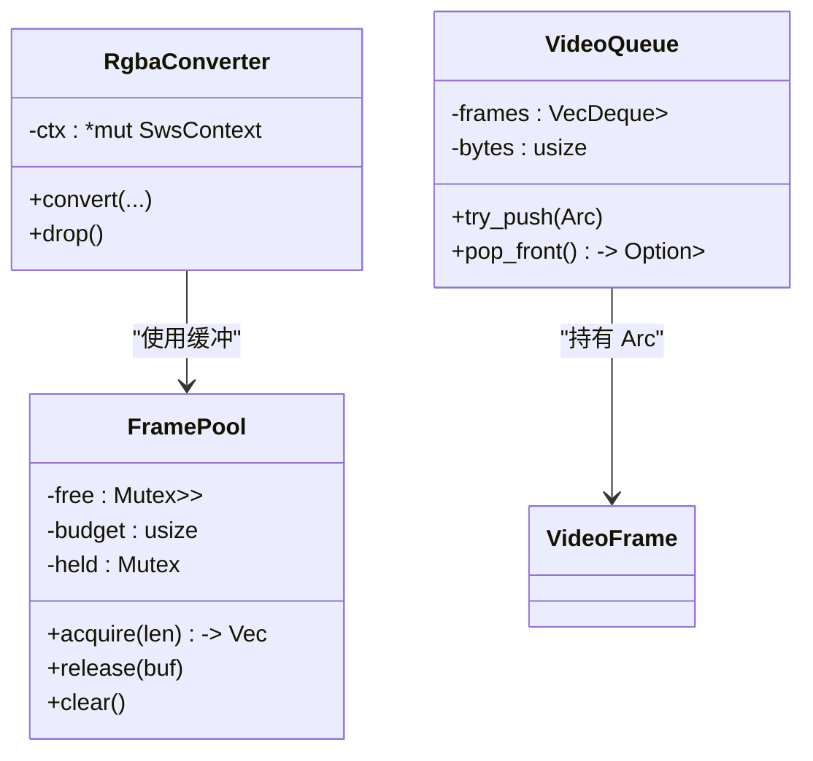
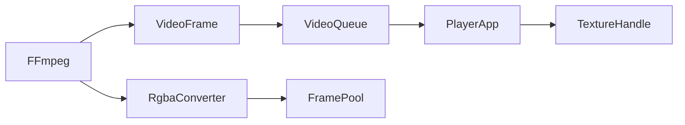

# 帧管理和缓存

<cite>
**本文引用的文件**   
- [video.rs](file://crates/mvp-core/src/video.rs)
- [queue.rs](file://crates/mvp-core/src/engine/queue.rs)
- [app.rs](file://crates/mvp-player/src/app.rs)
- [state.rs](file://crates/mvp-player/src/state.rs)
- [player_loop.rs](file://crates/mvp-core/tests/player_loop.rs)
- [playback.rs](file://crates/mvp-core/tests/playback.rs)
</cite>

## 目录
1. [引言](#引言)
2. [项目结构](#项目结构)
3. [核心组件](#核心组件)
4. [架构总览](#架构总览)
5. [详细组件分析](#详细组件分析)
6. [依赖关系分析](#依赖关系分析)
7. [性能与内存优化](#性能与内存优化)
8. [故障排查指南](#故障排查指南)
9. [结论](#结论)
10. [附录：最佳实践示例路径](#附录最佳实践示例路径)

## 引言
本文聚焦播放器中的“帧管理与缓存”子系统，围绕以下目标展开：
- 解释 VideoFrame 数据结构的设计、字段含义、生命周期与内存布局优化。
- 说明 FramePool 帧池化机制：缓冲区复用策略、内存预算控制与释放行为。
- 阐述零拷贝渲染优化：GPU 纹理上传、内存映射、异步传输。
- 梳理帧序列管理：播放时间戳处理、帧丢弃策略、缓冲队列管理。
- 总结内存泄漏防护：RAII 模式、引用计数、智能指针使用。
- 给出帧获取、释放、池化管理的最佳实践路径，并提供内存监控与调优建议。

## 项目结构
该子系统的核心代码分布在两个 crate：
- mvp-core：解码后的视频帧模型、颜色转换、帧池、帧队列等基础能力。
- mvp-player：应用层将帧转换为 GPU 纹理并展示，同时维护已上传帧的标识以避免重复上传。

**图表来源**
- [video.rs:18-55](file://crates/mvp-core/src/video.rs#L18-L55)
- [video.rs:57-142](file://crates/mvp-core/src/video.rs#L57-L142)
- [video.rs:553-706](file://crates/mvp-core/src/video.rs#L553-L706)
- [queue.rs:67-253](file://crates/mvp-core/src/engine/queue.rs#L67-L253)
- [app.rs:139-160](file://crates/mvp-player/src/app.rs#L139-L160)

**章节来源**
- [video.rs:1-142](file://crates/mvp-core/src/video.rs#L1-L142)
- [queue.rs:1-253](file://crates/mvp-core/src/engine/queue.rs#L1-L253)
- [app.rs:139-160](file://crates/mvp-player/src/app.rs#L139-L160)

## 核心组件
- VideoFrame：解码后、可直接显示的 RGBA 帧，包含尺寸、时间戳、时长、像素数据、序列号与生成代次。
- FramePool：按字节预算管理的 RGBA 缓冲池，提供 acquire/release 接口，避免频繁分配。
- RgbaConverter：负责 YUV→RGBA 缩放、Dolby Vision 重塑（可选）、HDR→SDR 色调映射，输出到池分配的缓冲。
- VideoQueue：基于 Arc<VideoFrame> 的有界 FIFO，支持字节预算、时间预算、帧丢弃统计。
- PlayerApp.update_frame_texture：从引擎取帧，零拷贝重解释为 ColorImage，并上传至 GPU 纹理。

**章节来源**
- [video.rs:18-55](file://crates/mvp-core/src/video.rs#L18-L55)
- [video.rs:57-142](file://crates/mvp-core/src/video.rs#L57-L142)
- [video.rs:553-706](file://crates/mvp-core/src/video.rs#L553-L706)
- [queue.rs:67-253](file://crates/mvp-core/src/engine/queue.rs#L67-L253)
- [app.rs:708-769](file://crates/mvp-player/src/app.rs#L708-L769)

## 架构总览
下图展示了从解码到渲染的关键流程：解码线程产出 VideoFrame，经队列调度，UI 线程取出并上传 GPU 纹理；期间通过序列号与时间戳去重与同步。

**图表来源**
- [queue.rs:180-253](file://crates/mvp-core/src/engine/queue.rs#L180-L253)
- [app.rs:708-769](file://crates/mvp-player/src/app.rs#L708-L769)

## 详细组件分析

### VideoFrame 数据结构设计
- 字段含义
  - width/height：目标显示尺寸（已由转换器缩放）。
  - pts/duration：呈现时间戳与名义持续时间。
  - data：紧凑 RGBA8 像素缓冲，长度为 width*height*4。
  - serial：单调递增帧序号，用于跳过冗余上传。
  - generation：解码会话代次，seek 后旧代次帧被丢弃。
- 生命周期管理
  - 以 Arc<VideoFrame> 在队列与应用间共享；UI 线程尝试独占所有权以进行零拷贝重解释。
  - is_valid() 确保宽/高/数据长度一致，防止无效帧进入渲染管线。
- 内存布局优化
  - 紧凑 RGBA8，无填充，便于直接映射为 egui::Color32。
  - memory_cost() 使用 capacity 与 len 的最大值作为预算估算，避免低估。

**图表来源**
- [video.rs:18-55](file://crates/mvp-core/src/video.rs#L18-L55)

**章节来源**
- [video.rs:18-55](file://crates/mvp-core/src/video.rs#L18-L55)

### FramePool 帧池化机制
- 缓冲区复用策略
  - 采用“最佳适配”选择：在空闲列表中挑选容量足够且最小的缓冲，减少大缓冲浪费。
  - 复用缓冲时不 zero-fill，仅 truncate/resize 到请求长度，避免对 4K 帧做 33MB 无意义清零。
- 内存预算控制
  - held 跟踪池中缓冲总容量，release 时若超过 budget 则直接丢弃，不入库。
  - free 列表长度上限固定（例如 24），避免过多小对象持有锁。
- 垃圾回收机制
  - 显式 clear() 清空空闲缓冲并重置 held，适合停止播放时释放资源。
  - Vec<u8> 自身遵循 RAII，超出作用域自动释放。

**图表来源**
- [video.rs:79-111](file://crates/mvp-core/src/video.rs#L79-L111)

**章节来源**
- [video.rs:57-142](file://crates/mvp-core/src/video.rs#L57-L142)

### 零拷贝渲染优化
- GPU 纹理上传
  - update_frame_texture 中，Arc<VideoFrame> 被 try_unwrap 独占后，data 向量被 cast_vec 重解释为 Color32，无像素复制。
  - 通过 serial 与 uploaded_serial 比较，跳过未变化帧的重复上传。
- 内存映射
  - u8 与 Color32 同大小同对齐，cast_vec 实现指针级重解释，避免额外拷贝。
- 异步传输
  - egui 的 TextureHandle 由底层驱动异步上传；应用侧通过记录 uploaded_* 状态避免重复工作。

**图表来源**
- [app.rs:708-769](file://crates/mvp-player/src/app.rs#L708-L769)

**章节来源**
- [app.rs:708-769](file://crates/mvp-player/src/app.rs#L708-L769)

### 帧序列管理
- 播放时间戳处理
  - VideoQueue.take_ready_counted(now, tolerance) 返回最晚可展示的帧，并统计被覆盖丢弃的帧数。
  - time_until_next(now) 计算下一帧的等待时间，供调度器使用。
- 帧丢弃策略
  - 当队列满时，try_push 返回原帧而不丢弃最老帧，保证“展示缓冲”语义，避免界面卡死。
  - 消费端按需丢弃过时帧，保留最新可用帧。
- 缓冲队列管理
  - 双预算：字节预算（budget_bytes）与时间预算（time_budget，结合 fps 换算为帧数）。
  - min_frames/max_frames 约束队列规模，确保至少 2 帧缓冲，避免抖动导致卡顿。

**图表来源**
- [queue.rs:180-253](file://crates/mvp-core/src/engine/queue.rs#L180-L253)

**章节来源**
- [queue.rs:67-253](file://crates/mvp-core/src/engine/queue.rs#L67-L253)

### 内存泄漏防护
- RAII 模式
  - RgbaConverter 在 Drop 中释放 SwsContext，避免 C 资源泄漏。
  - FramePool.clear() 主动清空空闲缓冲，配合 Vec 的 RAII 自动释放。
- 引用计数
  - VideoFrame 通过 Arc 在解码线程与 UI 线程之间安全共享；UI 线程 try_unwrap 确保唯一所有权后再进行零拷贝操作。
- 智能指针使用
  - VideoQueue 内部存储 Arc<VideoFrame>，pop_front 时递减引用计数，自然释放不再使用的帧。

**图表来源**
- [video.rs:1060-1068](file://crates/mvp-core/src/video.rs#L1060-L1068)
- [queue.rs:74-210](file://crates/mvp-core/src/engine/queue.rs#L74-L210)
- [video.rs:57-142](file://crates/mvp-core/src/video.rs#L57-L142)

**章节来源**
- [video.rs:1060-1068](file://crates/mvp-core/src/video.rs#L1060-L1068)
- [queue.rs:74-210](file://crates/mvp-core/src/engine/queue.rs#L74-L210)
- [video.rs:57-142](file://crates/mvp-core/src/video.rs#L57-L142)

## 依赖关系分析
- VideoFrame 依赖 ffmpeg_next 提供的 AVFrame 类型进行解码输入，但对外暴露的是紧凑 RGBA8 缓冲。
- RgbaConverter 依赖 FFmpeg 的 swscale 与色彩空间/范围元数据进行转换与色调映射。
- VideoQueue 依赖 std::collections::VecDeque 与 std::sync::Arc 构建有界 FIFO。
- PlayerApp 依赖 egui 的 TextureHandle 与 ColorImage 完成 GPU 纹理上传。

**图表来源**
- [video.rs:1-16](file://crates/mvp-core/src/video.rs#L1-L16)
- [video.rs:553-706](file://crates/mvp-core/src/video.rs#L553-L706)
- [queue.rs:1-10](file://crates/mvp-core/src/engine/queue.rs#L1-L10)
- [app.rs:1-20](file://crates/mvp-player/src/app.rs#L1-L20)

**章节来源**
- [video.rs:1-16](file://crates/mvp-core/src/video.rs#L1-L16)
- [video.rs:553-706](file://crates/mvp-core/src/video.rs#L553-L706)
- [queue.rs:1-10](file://crates/mvp-core/src/engine/queue.rs#L1-L10)
- [app.rs:1-20](file://crates/mvp-player/src/app.rs#L1-L20)

## 性能与内存优化
- 峰值内存控制
  - VideoQueue.budget_bytes 限制像素数据总量，避免 4K 帧导致数百 MB 占用。
  - FramePool.budget 限制空闲缓冲总容量，防止长期驻留大缓冲。
- GC 调优
  - 通过 Arc 的生命周期与 VecDeque 的 pop_front 自然触发释放，无需手动干预。
  - RgbaConverter.drop 释放 C 资源，避免外部库泄漏。
- 泄漏检测工具
  - 使用 Rust 标准工具链（如 cargo test）验证帧唯一所有权与释放路径。
  - 借助测试断言（如 player_loop 中 Arc::try_unwrap 检查）确保 UI 线程能独占帧。

[本节为通用指导，不直接分析具体文件]

## 故障排查指南
- 帧时间戳回退
  - 测试断言要求帧时间戳非递减；若出现回退，需检查解码源或时钟锚定逻辑。
- 帧有效性检查
  - is_valid() 失败通常意味着数据长度不足或宽高异常；应检查缩放参数与像素格式。
- 队列满导致的阻塞
  - try_push 返回原帧而非丢弃最老帧；若 UI 消费慢，会导致解码线程堆积，需提升消费速率或降低码率。
- 纹理上传重复
  - 若 uploaded_serial 未更新，可能导致重复上传；检查 serial 比较与更新逻辑。

**章节来源**
- [playback.rs:149-181](file://crates/mvp-core/tests/playback.rs#L149-L181)
- [player_loop.rs:69-89](file://crates/mvp-core/tests/player_loop.rs#L69-L89)
- [video.rs:44-55](file://crates/mvp-core/src/video.rs#L44-L55)
- [queue.rs:180-253](file://crates/mvp-core/src/engine/queue.rs#L180-L253)
- [app.rs:708-769](file://crates/mvp-player/src/app.rs#L708-L769)

## 结论
该帧管理与缓存系统通过紧凑 RGBA8 帧、有界队列与缓冲池，实现了高效、可控的解码到渲染链路。零拷贝上传与序列号去重显著降低了 CPU/GPU 开销；严格的预算控制与 RAII 保障内存安全与稳定性。建议在高性能场景下结合时间预算与字节预算，精细调节队列深度，并通过测试与监控工具持续验证性能与内存健康。

[本节为总结性内容，不直接分析具体文件]

## 附录：最佳实践示例路径
- 帧获取与零拷贝上传
  - [app.rs:708-769](file://crates/mvp-player/src/app.rs#L708-L769)
- 帧池获取与释放
  - [video.rs:79-111](file://crates/mvp-core/src/video.rs#L79-L111)
  - [video.rs:113-142](file://crates/mvp-core/src/video.rs#L113-L142)
- 队列入队与出队
  - [queue.rs:180-253](file://crates/mvp-core/src/engine/queue.rs#L180-L253)
- 帧有效性与时序断言
  - [playback.rs:149-181](file://crates/mvp-core/tests/playback.rs#L149-L181)
  - [player_loop.rs:69-89](file://crates/mvp-core/tests/player_loop.rs#L69-L89)
- 呈现帧统计与 FPS 计算
  - [state.rs:616-651](file://crates/mvp-player/src/state.rs#L616-L651)