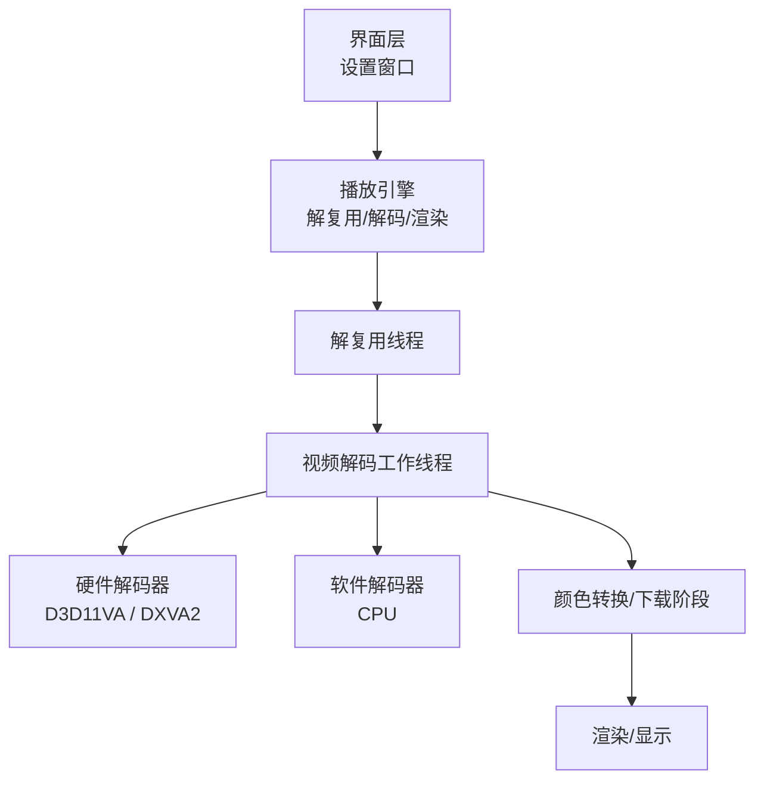
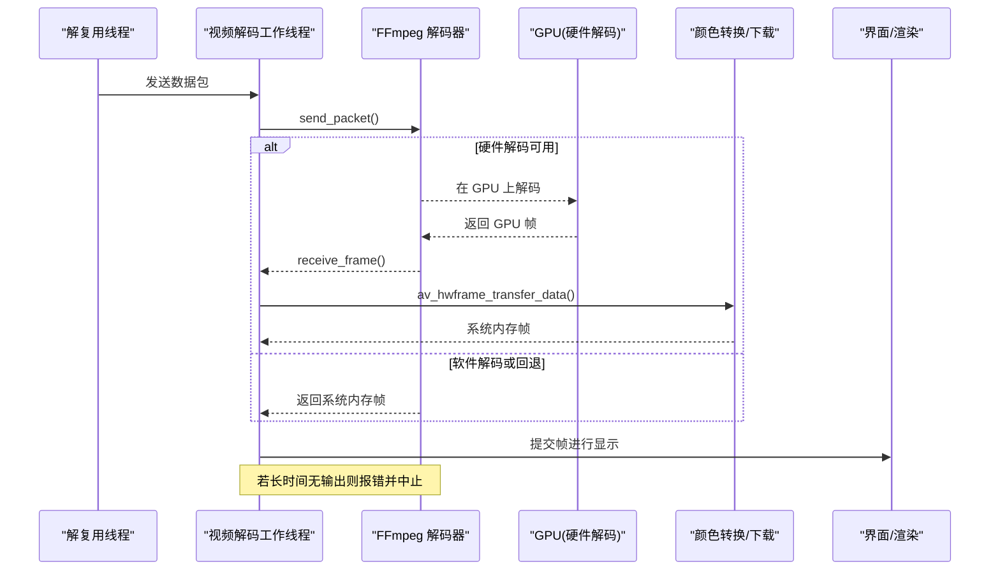
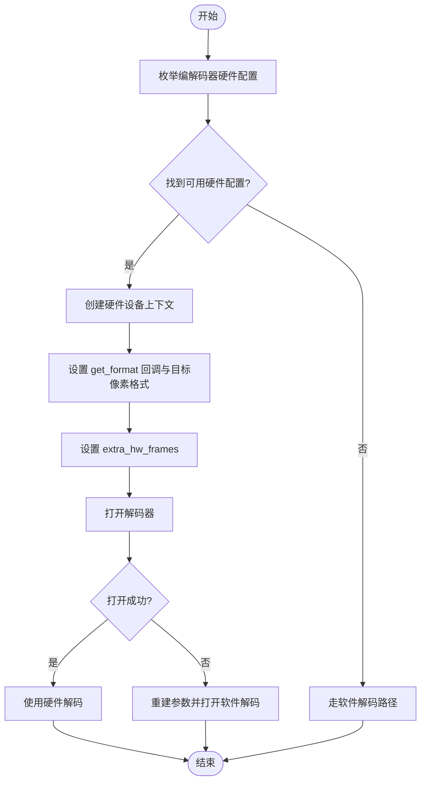
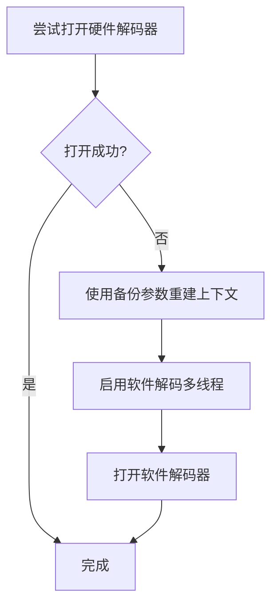
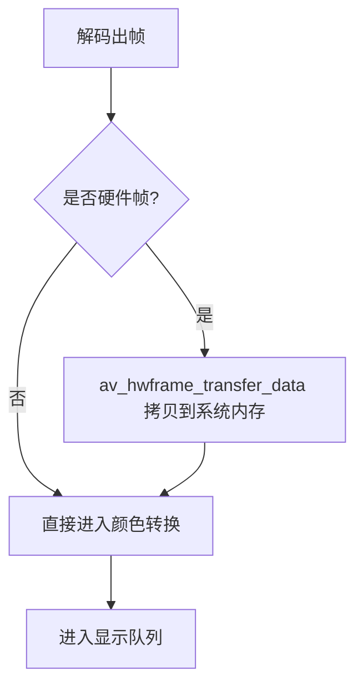
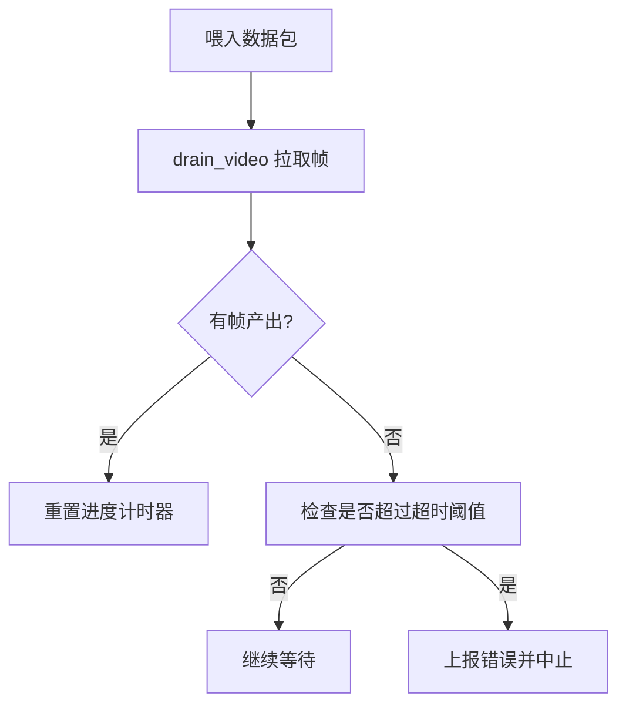
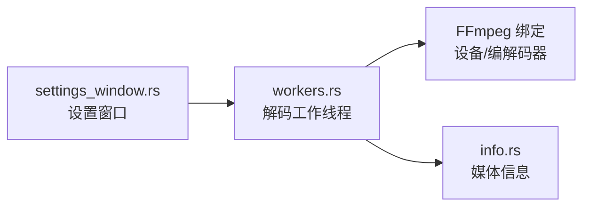

# 硬件解码支持

<cite>
**本文引用的文件**   
- [README.md](file://README.md)
- [workers.rs](file://crates/mvp-core/src/engine/workers.rs)
- [dolby_vision.rs](file://crates/mvp-core/tests/dolby_vision.rs)
- [settings_window.rs](file://crates/mvp-player/src/ui/settings_window.rs)
- [info.rs](file://crates/mvp-core/src/info.rs)
</cite>

## 目录
1. [引言](#引言)
2. [项目结构](#项目结构)
3. [核心组件](#核心组件)
4. [架构总览](#架构总览)
5. [详细组件分析](#详细组件分析)
6. [依赖关系分析](#依赖关系分析)
7. [性能与功耗考量](#性能与功耗考量)
8. [故障排除指南](#故障排除指南)
9. [结论](#结论)
10. [附录：代码示例路径](#附录代码示例路径)

## 引言
本文件聚焦 MVP-Versatile-Player 的硬件解码能力，围绕 D3D11VA/DXVA2 加速路径、软件回退策略、GPU 内存管理、不同视频格式的硬件支持现状，以及性能与兼容性权衡展开。文档同时给出可定位到源码的具体“代码示例路径”，便于读者在仓库中直接查看实现细节。

## 项目结构
本项目采用多 crate 组织：
- mvp-core：媒体引擎（FFmpeg 绑定、时钟、队列、图片/字幕、HDR/Dolby Vision 等）
- mvp-platform：Windows 系统集成
- mvp-subtitle：字幕解析
- mvp-player：egui 界面与应用入口

硬件解码相关逻辑集中在 mvp-core 的视频解码工作线程与 FFmpeg 集成处；UI 侧提供开关与说明。

图表来源
- [workers.rs:906-1106](file://crates/mvp-core/src/engine/workers.rs#L906-L1106)
- [settings_window.rs:278-278](file://crates/mvp-player/src/ui/settings_window.rs#L278-L278)

章节来源
- [README.md:315-357](file://README.md#L315-L357)

## 核心组件
- 硬件设备枚举与选择：优先 D3D11VA，回退 DXVA2
- 硬件上下文创建与像素格式协商：通过 get_format 回调将解码器切换到 GPU 输出格式
- 解码器初始化与回退：硬件打开失败时自动重建并启用多线程软件解码
- GPU 帧下载与系统内存拷贝：av_hwframe_transfer_data
- 软件解码线程数控制：避免独占所有 CPU 核心
- 解码无输出保护：超时检测与错误上报

章节来源
- [workers.rs:1450-1586](file://crates/mvp-core/src/engine/workers.rs#L1450-L1586)
- [workers.rs:1588-1673](file://crates/mvp-core/src/engine/workers.rs#L1588-L1673)
- [workers.rs:1675-1699](file://crates/mvp-core/src/engine/workers.rs#L1675-L1699)
- [workers.rs:906-1106](file://crates/mvp-core/src/engine/workers.rs#L906-L1106)

## 架构总览
下图展示从解复用、硬件/软件解码、GPU 帧下载到颜色转换与渲染的整体流程，以及关键错误处理点。

图表来源
- [workers.rs:906-1106](file://crates/mvp-core/src/engine/workers.rs#L906-L1106)
- [workers.rs:1588-1673](file://crates/mvp-core/src/engine/workers.rs#L1588-L1673)

## 详细组件分析

### 硬件解码器初始化与上下文创建
- 设备类型优先级：D3D11VA → DXVA2
- 遍历编解码器的硬件配置，找到支持 AV_CODEC_HW_CONFIG_METHOD_HW_DEVICE_CTX 的配置项
- 创建硬件设备上下文，并通过 get_format 回调选择目标像素格式
- 设置 extra_hw_frames 以缓解高码率/高分辨率场景下帧池耗尽导致的卡顿
- 成功时记录已启用的硬件设备类型，失败则回退软件路径

图表来源
- [workers.rs:1450-1586](file://crates/mvp-core/src/engine/workers.rs#L1450-L1586)
- [workers.rs:1626-1673](file://crates/mvp-core/src/engine/workers.rs#L1626-L1673)

章节来源
- [workers.rs:1450-1586](file://crates/mvp-core/src/engine/workers.rs#L1450-L1586)
- [workers.rs:1626-1673](file://crates/mvp-core/src/engine/workers.rs#L1626-L1673)

### 软件解码回退策略
- 当硬件解码不可用或打开失败时，使用备份的参数重新构造上下文并打开软件解码器
- 为软件解码器启用合理的并行线程数，避免独占全部 CPU 核心
- 日志明确区分“硬件打开失败”和“不支持硬件解码”的场景

图表来源
- [workers.rs:1626-1673](file://crates/mvp-core/src/engine/workers.rs#L1626-L1673)
- [workers.rs:1675-1699](file://crates/mvp-core/src/engine/workers.rs#L1675-L1699)

章节来源
- [workers.rs:1626-1673](file://crates/mvp-core/src/engine/workers.rs#L1626-L1673)
- [workers.rs:1675-1699](file://crates/mvp-core/src/engine/workers.rs#L1675-L1699)

### GPU 内存管理与帧下载
- 硬件解码输出的帧位于 GPU 显存，需通过 av_hwframe_transfer_data 拷贝到系统内存
- 当前管线在解码线程内完成下载与颜色转换，以便与解码过程重叠，减少阻塞
- 额外帧缓冲用于桥接下载/转换阶段的抖动，避免在高规格素材上出现假死

图表来源
- [workers.rs:1588-1624](file://crates/mvp-core/src/engine/workers.rs#L1588-L1624)
- [workers.rs:1137-1200](file://crates/mvp-core/src/engine/workers.rs#L1137-L1200)

章节来源
- [workers.rs:1588-1624](file://crates/mvp-core/src/engine/workers.rs#L1588-L1624)
- [workers.rs:1137-1200](file://crates/mvp-core/src/engine/workers.rs#L1137-L1200)

### 解码无输出保护与错误处理
- 统计已送入解码器的包数量与最近一次产出帧的时间
- 超过阈值仍未产出帧则判定为“解码无输出”，上报错误并中止
- 对损坏包做静默忽略，保证播放鲁棒性

图表来源
- [workers.rs:1092-1106](file://crates/mvp-core/src/engine/workers.rs#L1092-L1106)
- [workers.rs:1059-1088](file://crates/mvp-core/src/engine/workers.rs#L1059-L1088)

章节来源
- [workers.rs:1092-1106](file://crates/mvp-core/src/engine/workers.rs#L1092-L1106)
- [workers.rs:1059-1088](file://crates/mvp-core/src/engine/workers.rs#L1059-L1088)

### 不同视频格式的硬件解码支持情况
- 硬件路径优先 D3D11VA，其次 DXVA2；具体支持取决于 FFmpeg 构建与显卡驱动
- 测试用例验证了杜比视界（10-bit HEVC）可通过硬件路径解码
- H.264/H.265/HEVC/VP9/AV1 等格式的实际硬件支持由底层 FFmpeg 与驱动决定；仓库未硬编码格式白名单

章节来源
- [README.md:28-28](file://README.md#L28-L28)
- [dolby_vision.rs:259-281](file://crates/mvp-core/tests/dolby_vision.rs#L259-L281)
- [workers.rs:1450-1586](file://crates/mvp-core/src/engine/workers.rs#L1450-L1586)

### 硬件解码优缺点
- 优点
  - 显著降低 CPU 占用，提升高码率/高分辨率播放流畅度
  - 与驱动协同优化解码路径，减少 CPU 压力
- 缺点
  - 仍需一次显存→内存拷贝（当前管线），并非零拷贝
  - 兼容性受限于 FFmpeg 构建与显卡驱动能力
  - 某些 HDR/杜比视界元数据无法直通显示器（需要系统级颜色栈支持）

章节来源
- [README.md:569-571](file://README.md#L569-L571)
- [README.md:425-437](file://README.md#L425-L437)

## 依赖关系分析
- 硬件设备类型常量与枚举来自 FFmpeg 绑定
- 解码器查找与打开依赖 FFmpeg 编解码器表
- 颜色转换与显示由上层管线负责，硬件路径仅改变帧来源位置

图表来源
- [workers.rs:1450-1586](file://crates/mvp-core/src/engine/workers.rs#L1450-L1586)
- [info.rs:1-773](file://crates/mvp-core/src/info.rs#L1-L773)
- [settings_window.rs:278-278](file://crates/mvp-player/src/ui/settings_window.rs#L278-L278)

章节来源
- [workers.rs:1450-1586](file://crates/mvp-core/src/engine/workers.rs#L1450-L1586)
- [info.rs:1-773](file://crates/mvp-core/src/info.rs#L1-L773)
- [settings_window.rs:278-278](file://crates/mvp-player/src/ui/settings_window.rs#L278-L278)

## 性能与功耗考量
- 硬件解码可降低 CPU 占用，但当前存在一次显存→内存拷贝开销
- 软件解码启用合理线程数，避免与界面、音频、转码等阶段争抢资源
- 额外硬件帧缓冲用于缓解高规格素材下的帧池枯竭问题
- 关闭时快速退出，不等待积压数据处理，避免长时间占用资源

章节来源
- [README.md:569-571](file://README.md#L569-L571)
- [workers.rs:1675-1699](file://crates/mvp-core/src/engine/workers.rs#L1675-L1699)
- [workers.rs:1459-1464](file://crates/mvp-core/src/engine/workers.rs#L1459-L1464)

## 故障排除指南
- 现象：画面冻结/时间越跑越长
  - 可能原因：硬件解码器返回的帧缺少时间戳，导致时间线漂移
  - 处理：优先使用帧 PTS，其次使用包时间戳，最后按帧间隔推算
- 现象：解码无输出
  - 可能原因：容器误识别、码流损坏、硬件解码器异常
  - 处理：触发“解码无输出”保护，停止播放并提示
- 现象：硬件解码失败
  - 可能原因：驱动/FFmpeg 构建不支持该格式或设备
  - 处理：自动回退软件解码，并记录日志
- 现象：HDR/杜比视界色彩异常
  - 可能原因：基底层传输函数选择不当或元数据缺失
  - 处理：依据兼容层 ID 与 RPU 元数据选择正确曲线；必要时关闭色调映射直通原片信号

章节来源
- [workers.rs:1161-1195](file://crates/mvp-core/src/engine/workers.rs#L1161-L1195)
- [workers.rs:1092-1106](file://crates/mvp-core/src/engine/workers.rs#L1092-L1106)
- [workers.rs:1626-1673](file://crates/mvp-core/src/engine/workers.rs#L1626-L1673)
- [README.md:359-413](file://README.md#L359-L413)

## 结论
本项目在 Windows 平台上通过 D3D11VA/DXVA2 提供硬件解码能力，并在不可用时自动回退至软件解码。当前管线在解码线程内进行 GPU 帧下载与颜色转换，兼顾了解码与转换的重叠执行。对于高规格素材，额外硬件帧缓冲与合理的软件解码线程数有助于稳定播放。未来若需进一步降低带宽与延迟，可将 D3D11 纹理直接交给渲染器以实现零拷贝路径。

## 附录：代码示例路径
- 硬件解码器初始化与上下文创建
  - [workers.rs:1450-1586](file://crates/mvp-core/src/engine/workers.rs#L1450-L1586)
- 软件解码回退与线程数设置
  - [workers.rs:1626-1673](file://crates/mvp-core/src/engine/workers.rs#L1626-L1673)
  - [workers.rs:1675-1699](file://crates/mvp-core/src/engine/workers.rs#L1675-L1699)
- GPU 帧下载与错误处理
  - [workers.rs:1588-1624](file://crates/mvp-core/src/engine/workers.rs#L1588-L1624)
- 解码无输出保护
  - [workers.rs:1092-1106](file://crates/mvp-core/src/engine/workers.rs#L1092-L1106)
- 杜比视界硬件路径测试
  - [dolby_vision.rs:259-281](file://crates/mvp-core/tests/dolby_vision.rs#L259-L281)
- 用户可见的硬件解码说明
  - [README.md:28-28](file://README.md#L28-L28)
  - [settings_window.rs:278-278](file://crates/mvp-player/src/ui/settings_window.rs#L278-L278)