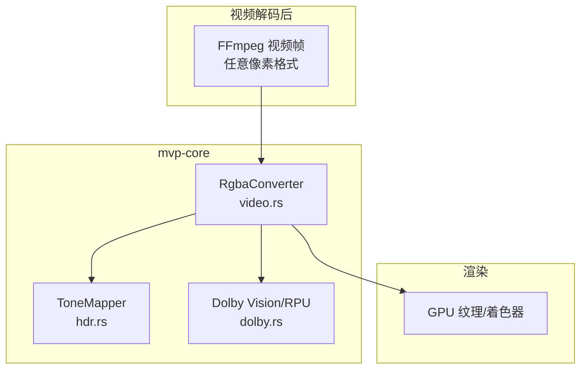
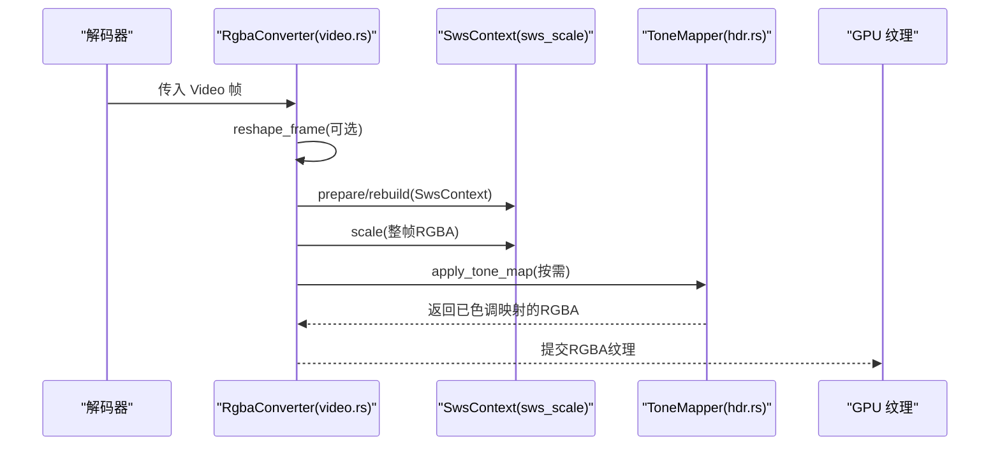
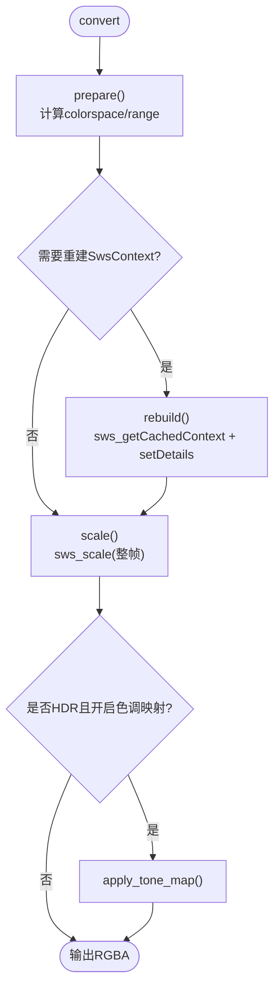
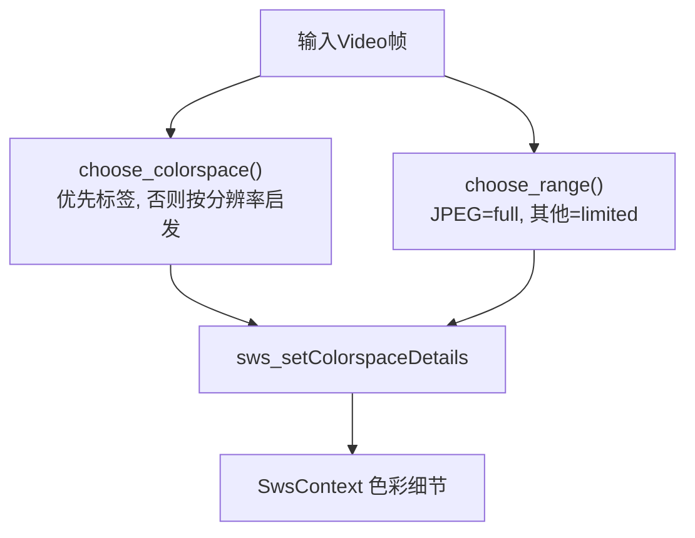
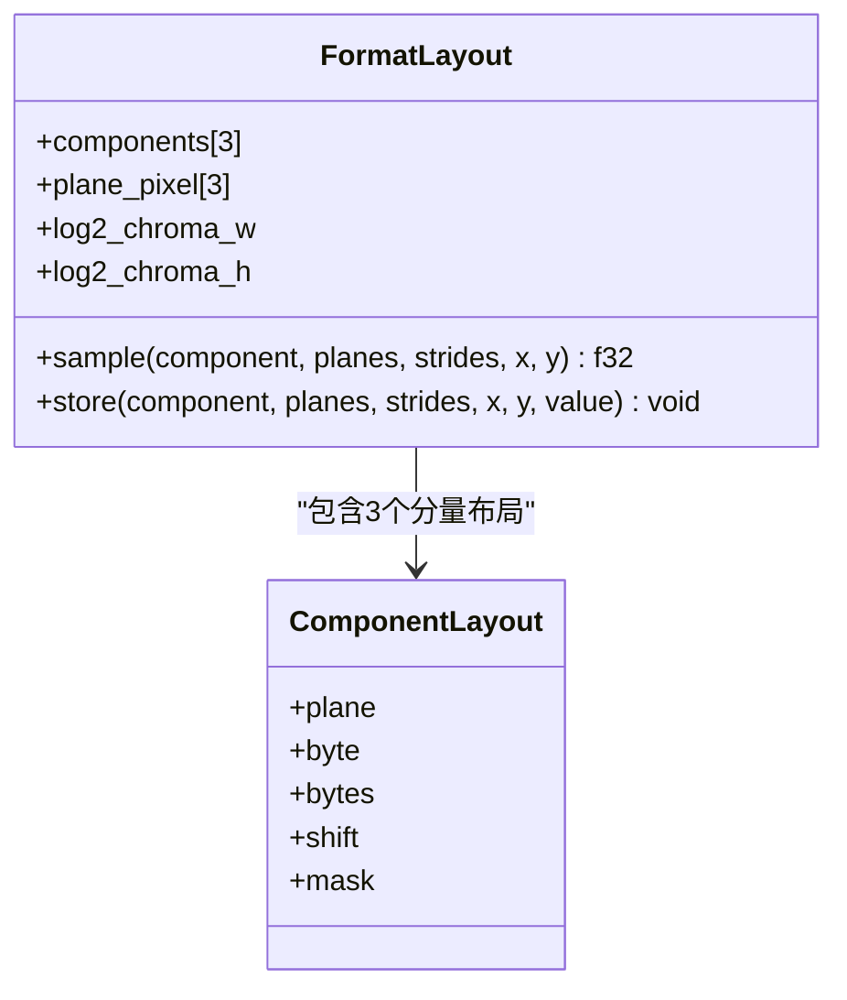
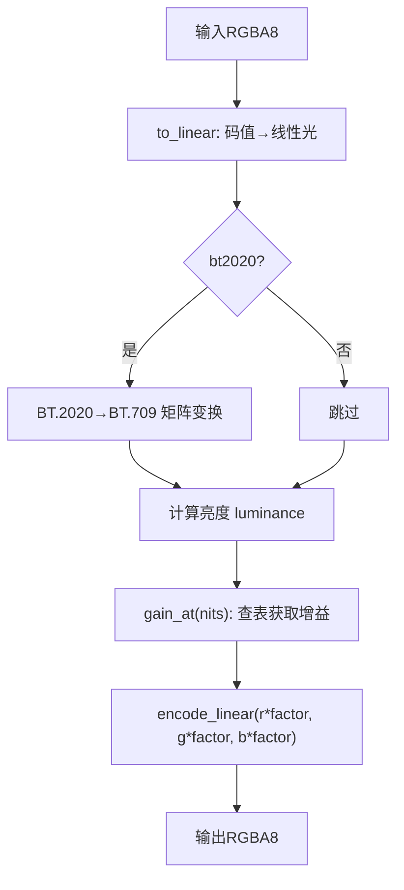
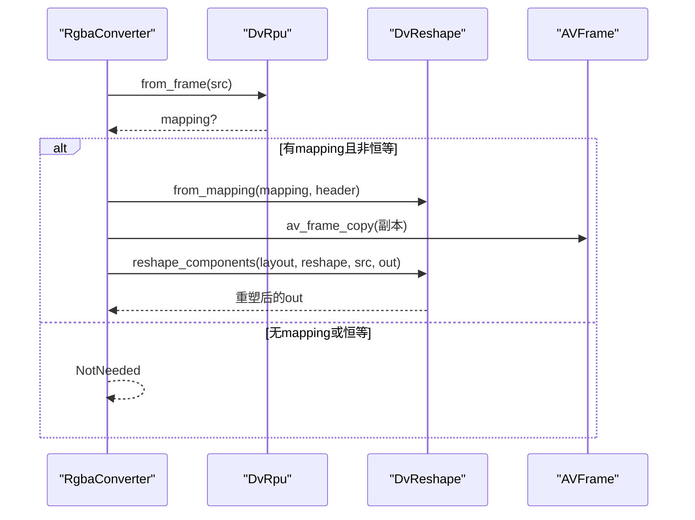
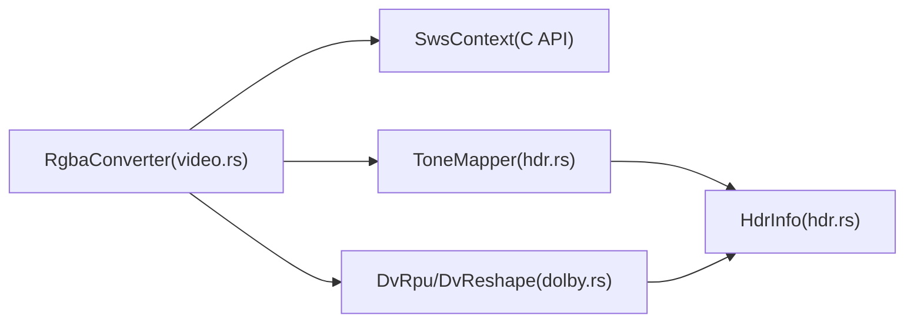

# 色彩空间转换

<cite>
**本文引用的文件**   
- [hdr.rs](file://crates/mvp-core/src/hdr.rs)
- [video.rs](file://crates/mvp-core/src/video.rs)
- [dolby.rs](file://crates/mvp-core/src/dolby.rs)
- [image_view.rs](file://crates/mvp-core/src/image_view.rs)
</cite>

## 目录
1. [引言](#引言)
2. [项目结构](#项目结构)
3. [核心组件](#核心组件)
4. [架构总览](#架构总览)
5. [详细组件分析](#详细组件分析)
6. [依赖关系分析](#依赖关系分析)
7. [性能考虑](#性能考虑)
8. [故障排查指南](#故障排查指南)
9. [结论](#结论)
10. [附录：像素格式与颜色范围速查](#附录像素格式与颜色范围速查)

## 引言
本技术文档聚焦于播放器中的色彩空间转换管线，重点解释 YUV 到 RGB 的转换算法、SwsContext 缓存机制、色彩矩阵选择与像素格式处理；并深入说明 HDR 到 SDR 的色调映射（亮度压缩、对比度调整、饱和度保持）、TV/PC 颜色范围自动检测与手动配置、以及性能优化策略（上下文缓存、批量并行、SIMD）。同时给出常见问题的诊断方法与调优建议。

## 项目结构
本项目在 mvp-core 中实现了视频解码后的色彩转换与 HDR 色调映射：
- video.rs：封装 RgbaConverter，负责 SwsContext 缓存、YUV→RGB 缩放与色彩矩阵选择、帧缓冲池、HDR→SDR 色调映射与 Dolby Vision 重塑开关。
- hdr.rs：实现 HdrInfo、ToneMapper，提供 PQ/HLG 到线性光、BT.2020→BT.709 色域转换、软肩曲线与 LUT 加速。
- dolby.rs：解析杜比视界 RPU 与配置记录，决定基层传输函数、动态元数据与重塑流程。
- image_view.rs：图片加载与显示，不经过视频管线，但用于理解 RGBA 输出目标。

图表来源
- [video.rs:548-607](file://crates/mvp-core/src/video.rs#L548-L607)
- [hdr.rs:344-495](file://crates/mvp-core/src/hdr.rs#L344-L495)
- [dolby.rs:1-47](file://crates/mvp-core/src/dolby.rs#L1-L47)

章节来源
- [video.rs:1-17](file://crates/mvp-core/src/video.rs#L1-L17)
- [hdr.rs:1-26](file://crates/mvp-core/src/hdr.rs#L1-L26)
- [dolby.rs:1-47](file://crates/mvp-core/src/dolby.rs#L1-L47)

## 核心组件
- RgbaConverter：统一入口，负责：
  - 根据源帧尺寸/格式/色彩信息重建或复用 SwsContext。
  - 调用 sws_scale 将任意像素格式转换为紧凑 RGBA8。
  - 按用户偏好启用 HDR→SDR 色调映射与 Dolby Vision 重塑。
  - 使用 FramePool 复用 RGBA 缓冲区，避免频繁分配。
- ToneMapper：CPU 端 HDR→SDR 色调映射，基于三张 LUT（码值→线性光、增益表、编码表）+ BT.2020→BT.709 矩阵，逐像素处理 RGBA。
- DvReshape/DvRpu：解析杜比视界 RPU，决定是否对基层进行重塑（默认关闭），并在需要时更新映射系数。

章节来源
- [video.rs:548-607](file://crates/mvp-core/src/video.rs#L548-L607)
- [video.rs:687-705](file://crates/mvp-core/src/video.rs#L687-L705)
- [hdr.rs:344-495](file://crates/mvp-core/src/hdr.rs#L344-L495)
- [dolby.rs:1-47](file://crates/mvp-core/src/dolby.rs#L1-L47)

## 架构总览
整体数据流如下：
1. FFmpeg 解码得到任意像素格式的 Video 帧。
2. RgbaConverter.convert 先可选地应用 Dolby Vision 重塑（针对分量），再准备 SwsContext，然后执行一次完整的 sws_scale 到 RGBA。
3. 若开启 HDR→SDR 色调映射，则按场景峰值平滑值重建 ToneMapper，并按线程分块并行 apply。
4. 最终输出 RGBA8 给 GPU 纹理上传。

图表来源
- [video.rs:687-705](file://crates/mvp-core/src/video.rs#L687-L705)
- [video.rs:845-881](file://crates/mvp-core/src/video.rs#L845-L881)
- [video.rs:897-941](file://crates/mvp-core/src/video.rs#L897-L941)
- [hdr.rs:451-495](file://crates/mvp-core/src/hdr.rs#L451-L495)

## 详细组件分析

### SwsContext 缓存与重建
- 缓存策略：RgbaConverter 持有 *mut SwsContext 指针，仅在尺寸、源格式、目标尺寸、色彩空间或范围变化时重建。
- 重建参数：
  - 目标格式固定为 AV_PIX_FMT_RGBA。
  - 缩放标志使用双线性插值（SWS_BILINEAR）。
  - 通过 sws_setColorspaceDetails 设置源色彩矩阵与范围，目标范围为 full range（RGBA 期望）。
- 关键路径：
  - prepare 计算 colorspace 与 src_range，判断是否需要 rebuild。
  - rebuild 调用 sws_getCachedContext 创建/复用上下文，并设置色彩细节。
  - scale 以整帧为单位调用 sws_scale，避免分片导致的垂直滤波不一致问题。

图表来源
- [video.rs:751-821](file://crates/mvp-core/src/video.rs#L751-L821)
- [video.rs:845-881](file://crates/mvp-core/src/video.rs#L845-L881)
- [video.rs:987-1051](file://crates/mvp-core/src/video.rs#L987-L1051)

章节来源
- [video.rs:751-821](file://crates/mvp-core/src/video.rs#L751-L821)
- [video.rs:845-881](file://crates/mvp-core/src/video.rs#L845-L881)
- [video.rs:987-1051](file://crates/mvp-core/src/video.rs#L987-L1051)

### 色彩矩阵选择与颜色范围
- 色彩矩阵选择 choose_colorspace：
  - 优先尊重容器/流的 color_space 标签（BT.709、BT.601/SMPTE170M、BT.2020、SMPTE240M、FCC、RGB）。
  - 未指定或新矩阵时采用启发式：分辨率≥720p 或宽度≥1280 使用 ITU709，否则 SMPTE170M。
- 颜色范围 choose_range：
  - JPEG/full range → 1；其余（包括未指定/保留）→ 0（limited/MPEG）。
- 这些选择直接传递给 sws_setColorspaceDetails，确保 HD 素材不被误当作 SD 转换导致饱和度异常。

图表来源
- [video.rs:1070-1103](file://crates/mvp-core/src/video.rs#L1070-L1103)
- [video.rs:1022-1041](file://crates/mvp-core/src/video.rs#L1022-L1041)

章节来源
- [video.rs:1070-1103](file://crates/mvp-core/src/video.rs#L1070-L1103)
- [video.rs:1022-1041](file://crates/mvp-core/src/video.rs#L1022-L1041)

### 像素格式支持（YUV420P、NV12、P010、RGB24 等）
- 通用路径：RgbaConverter 通过 FFmpeg 的 SwsContext 将“任意像素格式”转换为 RGBA8，因此 YUV420P、NV12、P010、RGB24 等均可被正确转换。
- Dolby Vision 重塑路径：FormatLayout 从 FFmpeg 像素格式描述符推导分量布局，支持 8/10/12-bit、平面/半平面/打包格式，限制条件：
  - 仅 3 个分量，非 RGB、非调色板、非 bitstream、非硬件加速。
  - 每个分量深度 ≤16，单样本字节数 ≤2。
  - 色度下采样 log2_chroma_w/log2_chroma_h ≤2。
- 不支持重塑的情况会返回错误信息（如“像素格式不支持重塑”、“位深与 RPU 声明不一致”、“行跨距不支持重塑”）。

图表来源
- [video.rs:191-221](file://crates/mvp-core/src/video.rs#L191-L221)
- [video.rs:223-300](file://crates/mvp-core/src/video.rs#L223-L300)
- [video.rs:302-357](file://crates/mvp-core/src/video.rs#L302-L357)

章节来源
- [video.rs:191-357](file://crates/mvp-core/src/video.rs#L191-L357)
- [video.rs:359-403](file://crates/mvp-core/src/video.rs#L359-L403)

### HDR→SDR 色调映射（亮度压缩、对比度调整、饱和度保持）
- HdrInfo：从帧或编解码参数读取 transfer characteristic 与 primaries，推断 HDR 类型（SDR/PQ/HLG）与 BT.2020 标记。
- ToneMapper：
  - to_linear：码值→线性光（PQ/HLG/SDR）。
  - gain：线性亮度（nits）→增益因子，基于软肩曲线 tone_curve，保留色相。
  - encode：线性显示光→8bit sRGB/BT.709 码值。
  - BT.2020→BT.709 矩阵：当 bt2020=true 时对 RGB 进行色域转换，溢出部分裁剪。
  - apply：逐像素处理 RGBA，alpha 不变。
- 场景峰值平滑：
  - smoothed_scene_peak 使用 SCENE_SMOOTHING=0.12 平滑 Level 1 峰值，避免闪烁。
  - bucket 量化（SCENE_PEAK_STEP=32 nits）减少频繁重建 mapper。
- 并行化：spread_over_threads 按像素块分片并行 apply，保证结果与单线程一致。

图表来源
- [hdr.rs:451-495](file://crates/mvp-core/src/hdr.rs#L451-L495)
- [hdr.rs:497-564](file://crates/mvp-core/src/hdr.rs#L497-L564)
- [video.rs:897-941](file://crates/mvp-core/src/video.rs#L897-L941)
- [video.rs:944-985](file://crates/mvp-core/src/video.rs#L944-L985)

章节来源
- [hdr.rs:30-58](file://crates/mvp-core/src/hdr.rs#L30-L58)
- [hdr.rs:164-271](file://crates/mvp-core/src/hdr.rs#L164-L271)
- [hdr.rs:344-495](file://crates/mvp-core/src/hdr.rs#L344-L495)
- [video.rs:897-985](file://crates/mvp-core/src/video.rs#L897-L985)

### Dolby Vision 重塑（可选）
- 默认关闭（dv_reshape=false），避免未经完全验证的色彩数学影响观感。
- 开启后：
  - 从帧侧数据解析 RPU，提取 mapping 与 header。
  - 若 mapping 存在且非恒等，则尝试 apply_reshape：
    - 校验像素格式与位深一致性。
    - 校验每行 stride 合理。
    - 复制帧并对 Y/Cb/Cr 分别应用重塑曲线。
  - 状态通过 DvReshapeState 暴露（Disabled/NotNeeded/Applied/Unsupported）。

图表来源
- [video.rs:720-749](file://crates/mvp-core/src/video.rs#L720-L749)
- [video.rs:359-403](file://crates/mvp-core/src/video.rs#L359-L403)
- [video.rs:415-467](file://crates/mvp-core/src/video.rs#L415-L467)

章节来源
- [video.rs:720-749](file://crates/mvp-core/src/video.rs#L720-L749)
- [video.rs:359-467](file://crates/mvp-core/src/video.rs#L359-L467)
- [dolby.rs:1-47](file://crates/mvp-core/src/dolby.rs#L1-L47)

## 依赖关系分析
- RgbaConverter 依赖：
  - FFmpeg SwsContext（C API）进行像素格式转换与缩放。
  - ToneMapper（hdr.rs）进行 HDR→SDR 色调映射。
  - DvRpu/DvReshape（dolby.rs）进行杜比视界重塑。
- ToneMapper 依赖：
  - HdrInfo（hdr.rs）提供传输函数与色域信息。
  - 静态矩阵 BT.2020→BT.709。
- Dolbey Vision 模块依赖：
  - FFmpeg 侧数据（AV_PKT_DATA_DOVI_CONF、AV_FRAME_DATA_DOVI_METADATA）。
  - hdr.rs 中的 pq_code_to_nits 等工具。

图表来源
- [video.rs:548-607](file://crates/mvp-core/src/video.rs#L548-L607)
- [hdr.rs:344-495](file://crates/mvp-core/src/hdr.rs#L344-L495)
- [dolby.rs:1-47](file://crates/mvp-core/src/dolby.rs#L1-L47)

章节来源
- [video.rs:548-607](file://crates/mvp-core/src/video.rs#L548-L607)
- [hdr.rs:344-495](file://crates/mvp-core/src/hdr.rs#L344-L495)
- [dolby.rs:1-47](file://crates/mvp-core/src/dolby.rs#L1-L47)

## 性能考虑
- SwsContext 缓存：同一尺寸/格式/色彩配置复用上下文，避免重复初始化开销。
- 整帧缩放：sws_scale 以整帧调用，避免分片导致的垂直滤波不一致；并行化的是色调映射而非缩放。
- 色调映射并行：按像素块分片并行 apply，保证结果确定性；线程数由 tone_map_bands 决定（可用核数-2，限1~4）。
- 帧缓冲池：FramePool 复用 RGBA 缓冲区，最佳适配大小，控制总内存预算，避免 4K 帧的零填充浪费。
- SIMD：底层 SwsContext 内部可能使用 SIMD 优化；ToneMapper 使用 LUT 查表与简单乘加，适合向量化。

章节来源
- [video.rs:144-155](file://crates/mvp-core/src/video.rs#L144-L155)
- [video.rs:823-844](file://crates/mvp-core/src/video.rs#L823-L844)
- [video.rs:965-985](file://crates/mvp-core/src/video.rs#L965-L985)
- [video.rs:57-142](file://crates/mvp-core/src/video.rs#L57-L142)

## 故障排查指南
- 色彩偏差（饱和度异常/偏色）：
  - 检查 choose_colorspace 是否正确识别 BT.709/BT.601/BT.2020；确认容器标签与分辨率启发逻辑。
  - 检查 choose_range 是否正确区分 JPEG(full) 与 MPEG(limited)。
  - 若 HDR 内容发灰，确认 HdrKind 与 DoviConfig.base_layer_kind 是否正确（HLG 基层不应走 PQ）。
- 亮度异常（过曝/欠曝）：
  - 检查 ToneMapper 的 shoulder_for_peak 与 scene_peak 平滑；确认 Level 1 峰值有效且有限。
  - 检查 BT.2020→BT.709 矩阵应用时机与裁剪逻辑。
- 像素格式相关错误：
  - “像素格式不支持重塑”：检查 FormatLayout 过滤条件（分量数、深度、stride）。
  - “位深与 RPU 声明不一致”：校验 base_layer_bit_depth 与帧实际位深。
  - “行跨距不支持重塑”：校验 stride 与 row_bytes 的关系。
- 性能问题：
  - 观察 last_tone_map_ms 监控色调映射耗时；必要时关闭 dv_reshape 或 tone_map。
  - 确认 SwsContext 未被频繁重建（尺寸/格式/色彩变化才会重建）。

章节来源
- [video.rs:751-821](file://crates/mvp-core/src/video.rs#L751-L821)
- [video.rs:1070-1103](file://crates/mvp-core/src/video.rs#L1070-L1103)
- [video.rs:359-403](file://crates/mvp-core/src/video.rs#L359-L403)
- [hdr.rs:323-332](file://crates/mvp-core/src/hdr.rs#L323-L332)
- [hdr.rs:451-495](file://crates/mvp-core/src/hdr.rs#L451-L495)

## 结论
该播放器的色彩空间转换管线以 RgbaConverter 为核心，结合 SwsContext 缓存、精确的色彩矩阵与范围选择、以及 CPU 端高效的 ToneMapper，实现对多种像素格式与 HDR 内容的稳定转换与色调映射。Dolby Vision 重塑作为可选路径，兼顾准确性与可控性。通过帧缓冲池与并行色调映射，系统在实时性与质量之间取得平衡。

## 附录：像素格式与颜色范围速查
- 支持的像素格式（通用转换）：YUV420P、NV12、P010、RGB24 等（经 SwsContext 转 RGBA）。
- 支持重塑的像素格式约束：
  - 3 个分量，非 RGB/调色板/bitstream/硬件格式。
  - 分量深度 ≤16，单样本字节数 ≤2。
  - 色度下采样 log2_chroma_w/log2_chroma_h ≤2。
- 颜色范围：
  - TV range（limited/MPEG）：0
  - PC range（full/JPEG）：1
  - 自动检测：Range::JPEG → full，其余 → limited。

章节来源
- [video.rs:302-357](file://crates/mvp-core/src/video.rs#L302-L357)
- [video.rs:1094-1103](file://crates/mvp-core/src/video.rs#L1094-L1103)