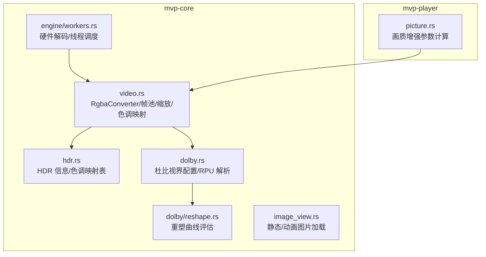
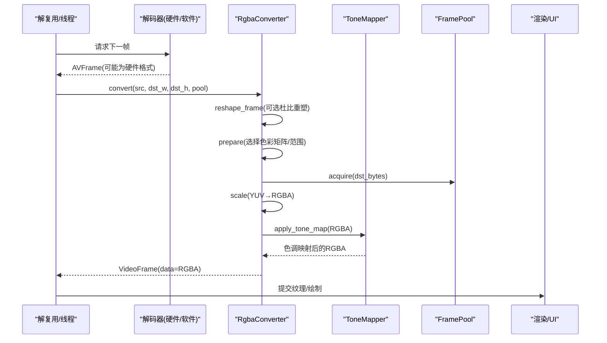
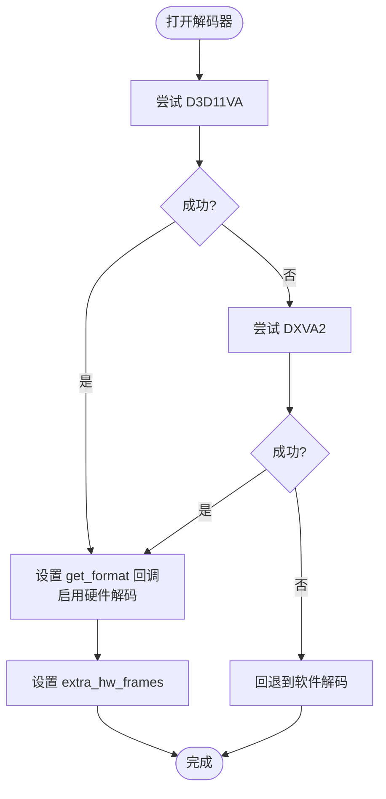
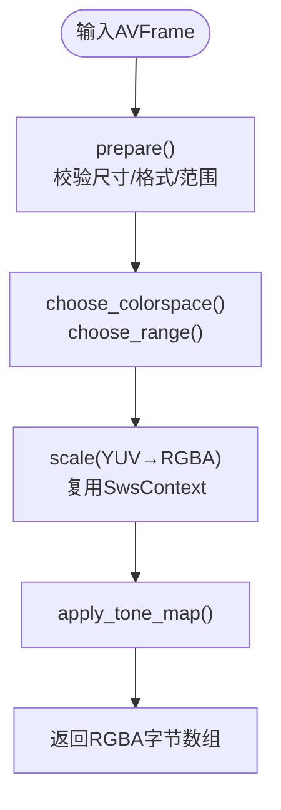
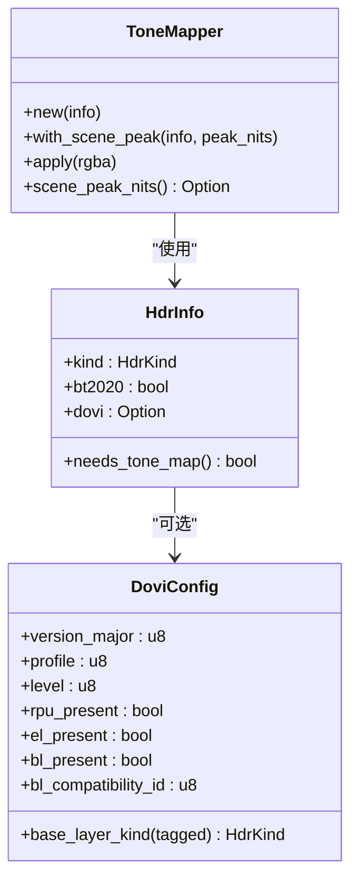
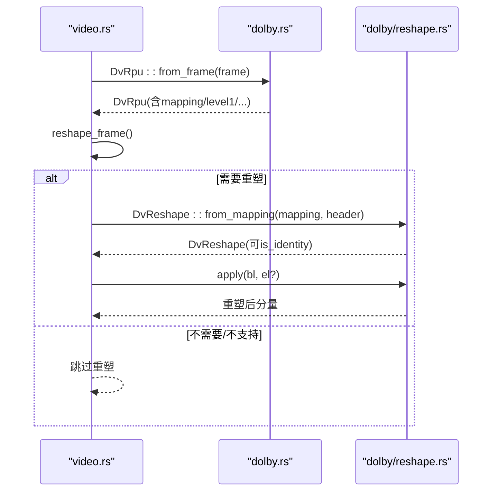
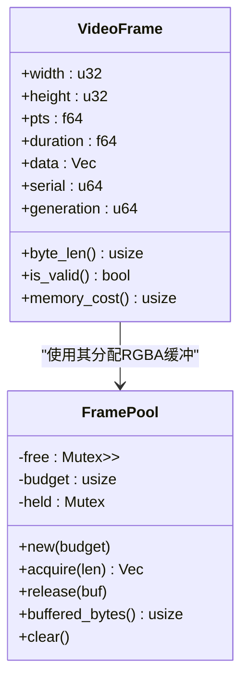
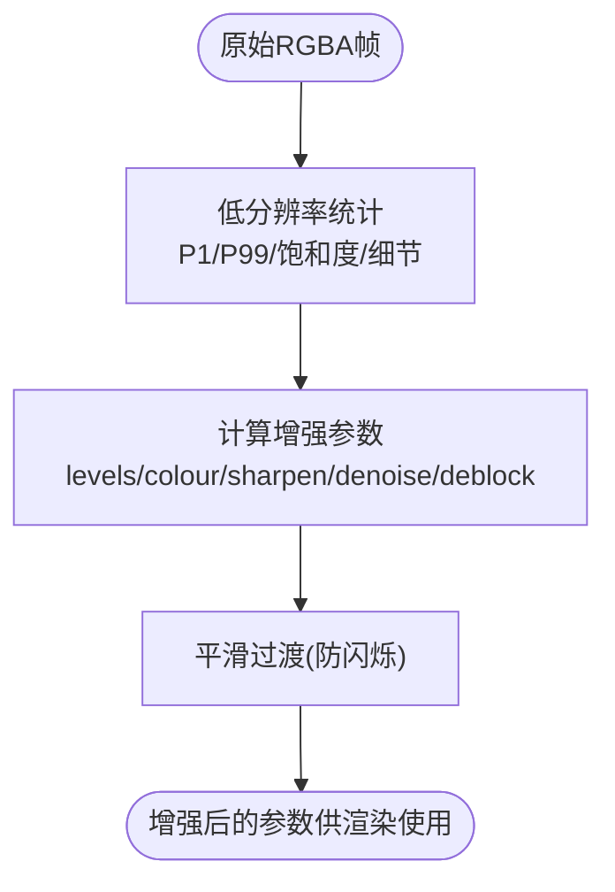
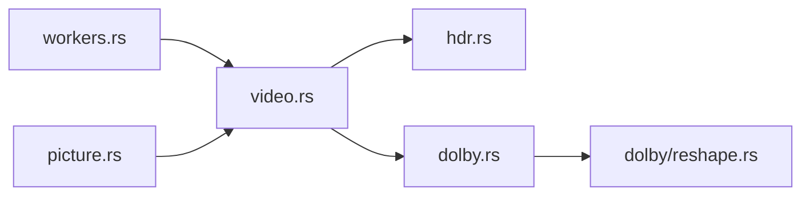

# 视频处理系统

<cite>
**本文引用的文件**
- [lib.rs](file://crates/mvp-core/src/lib.rs)
- [video.rs](file://crates/mvp-core/src/video.rs)
- [hdr.rs](file://crates/mvp-core/src/hdr.rs)
- [dolby.rs](file://crates/mvp-core/src/dolby.rs)
- [reshape.rs](file://crates/mvp-core/src/dolby/reshape.rs)
- [workers.rs](file://crates/mvp-core/src/engine/workers.rs)
- [picture.rs](file://crates/mvp-player/src/picture.rs)
- [image_view.rs](file://crates/mvp-core/src/image_view.rs)
</cite>

## 目录
1. [简介](#简介)
2. [项目结构](#项目结构)
3. [核心组件](#核心组件)
4. [架构总览](#架构总览)
5. [详细组件分析](#详细组件分析)
6. [依赖关系分析](#依赖关系分析)
7. [性能考量](#性能考量)
8. [故障排除指南](#故障排除指南)
9. [结论](#结论)
10. [附录：代码示例路径](#附录代码示例路径)

## 简介
本技术文档面向“视频处理系统”的解码、色彩与 HDR 处理、帧缓存与质量增强等关键模块，重点覆盖：
- 硬件解码支持：D3D11VA/DXVA2 加速、软件回退策略、解码器选择逻辑
- 色彩空间转换：YUV→RGB、色彩格式处理、像素数据优化
- HDR 处理：HDR10/HLG/PQ/HLG 识别、杜比视界解析与 RPU 元数据处理、色调映射算法
- 帧缓存机制：VideoFrame 结构、帧池化策略、内存管理
- 视频质量增强：缩放算法、去噪、动态范围调整
并提供具体代码路径以便快速定位实现。

## 项目结构
- mvp-core：媒体引擎核心（FFmpeg 绑定、解码、颜色转换、HDR、杜比视界、图像查看）
- mvp-player：UI 与渲染（egui + OpenGL），包含画面增强参数计算
- mvp-platform：平台相关能力（显示器、电源、单实例等）
- mvp-subtitle：字幕解析

图表来源
- [workers.rs:1449-1586](file://crates/mvp-core/src/engine/workers.rs#L1449-L1586)
- [video.rs:548-706](file://crates/mvp-core/src/video.rs#L548-L706)
- [hdr.rs:344-495](file://crates/mvp-core/src/hdr.rs#L344-L495)
- [dolby.rs:478-708](file://crates/mvp-core/src/dolby.rs#L478-L708)
- [reshape.rs:185-355](file://crates/mvp-core/src/dolby/reshape.rs#L185-L355)
- [picture.rs:1-302](file://crates/mvp-player/src/picture.rs#L1-L302)

章节来源
- [lib.rs:1-43](file://crates/mvp-core/src/lib.rs#L1-L43)

## 核心组件
- 硬件解码与设备选择：优先尝试 D3D11VA，其次 DXVA2；失败则回退到软件解码
- 色彩转换与缩放：基于 FFmpeg SwsContext 的 YUV→RGBA 转换，按分辨率/色彩空间/范围构建并复用上下文
- HDR 与杜比视界：从容器记录与 RPU 推导传输函数与主色域，进行色调映射与可选重塑
- 帧池与内存：FramePool 以预算控制空闲缓冲数量，避免频繁分配
- 画质增强：自动对比度/饱和度/锐化/去块/去噪，结合平滑防止闪烁

章节来源
- [workers.rs:1449-1586](file://crates/mvp-core/src/engine/workers.rs#L1449-L1586)
- [video.rs:548-706](file://crates/mvp-core/src/video.rs#L548-L706)
- [hdr.rs:344-495](file://crates/mvp-core/src/hdr.rs#L344-L495)
- [dolby.rs:478-708](file://crates/mvp-core/src/dolby.rs#L478-L708)
- [reshape.rs:185-355](file://crates/mvp-core/src/dolby/reshape.rs#L185-L355)
- [picture.rs:200-302](file://crates/mvp-player/src/picture.rs#L200-L302)

## 架构总览
下图展示从解码到显示的关键流程：硬件/软件解码 → 可选杜比视界重塑 → 色彩转换与缩放 → HDR 色调映射 → 输出 RGBA 帧。

图表来源
- [workers.rs:1449-1586](file://crates/mvp-core/src/engine/workers.rs#L1449-L1586)
- [video.rs:683-706](file://crates/mvp-core/src/video.rs#L683-L706)
- [video.rs:1070-1103](file://crates/mvp-core/src/video.rs#L1070-L1103)
- [hdr.rs:344-495](file://crates/mvp-core/src/hdr.rs#L344-L495)

## 详细组件分析

### 硬件解码支持：D3D11VA/DXVA2 与软件回退
- 设备类型优先级：D3D11VA → DXVA2
- 通过 avcodec_get_hw_config 枚举可用配置，创建硬件设备上下文并设置 get_format 回调，使解码器输出 GPU 格式
- 若无法启用硬件解码，则使用软件解码路径
- 额外帧缓冲：extra_hw_frames 设置为少量值以避免高码率/高分辨率下解码器内部池耗尽导致的卡顿

图表来源
- [workers.rs:1449-1586](file://crates/mvp-core/src/engine/workers.rs#L1449-L1586)

章节来源
- [workers.rs:1449-1586](file://crates/mvp-core/src/engine/workers.rs#L1449-L1586)

### 色彩空间转换与像素数据优化
- 色彩矩阵选择：依据帧的 color_space 与分辨率启发式选择 BT.709/BT.601/BT.2020 等
- 范围选择：JPEG(full) vs MPEG(limited)，默认 limited 更安全
- 转换流程：prepare → scale(YUV→RGBA) → tone map → 写入 FramePool 分配的缓冲区
- 优化点：SwsContext 跨帧复用；按需重建；直接写入 pooled buffer，避免二次拷贝

图表来源
- [video.rs:751-806](file://crates/mvp-core/src/video.rs#L751-L806)
- [video.rs:1070-1103](file://crates/mvp-core/src/video.rs#L1070-L1103)

章节来源
- [video.rs:751-806](file://crates/mvp-core/src/video.rs#L751-L806)
- [video.rs:1070-1103](file://crates/mvp-core/src/video.rs#L1070-L1103)

### HDR 处理：HDR10/HLG 识别与色调映射
- HDR 类型识别：根据 color_trc 判断 PQ/HLG/SDR；BT.2020 标记用于色域转换
- 杜比视界配置：解析容器侧九字节记录，决定基底层传输函数与是否需要特殊渲染
- 色调映射：构建 to_linear/gain/encode 查找表，对亮度进行软肩压缩，并将 BT.2020 转换到 BT.709
- 动态范围：针对杜比视界的 Level 1 峰值进行场景级映射，平滑避免闪烁

图表来源
- [hdr.rs:164-271](file://crates/mvp-core/src/hdr.rs#L164-L271)
- [hdr.rs:344-495](file://crates/mvp-core/src/hdr.rs#L344-L495)

章节来源
- [hdr.rs:164-271](file://crates/mvp-core/src/hdr.rs#L164-L271)
- [hdr.rs:344-495](file://crates/mvp-core/src/hdr.rs#L344-L495)

### 杜比视界解析与重塑
- RPU 解析：从 AVFrame 的 side_data 中读取杜比视界元数据（header/color/mapping/levels）
- 重塑曲线：将多段多项式/MMR 曲线与 NLQ 残差组合，还原编码时的重塑
- 默认关闭：因色度部分尚未完全验证，重塑默认关闭，需用户显式开启
- 状态上报：DvReshapeState 向界面报告是否应用/不支持/无需重塑

图表来源
- [dolby.rs:478-708](file://crates/mvp-core/src/dolby.rs#L478-L708)
- [reshape.rs:185-355](file://crates/mvp-core/src/dolby/reshape.rs#L185-L355)
- [video.rs:720-749](file://crates/mvp-core/src/video.rs#L720-L749)

章节来源
- [dolby.rs:478-708](file://crates/mvp-core/src/dolby.rs#L478-L708)
- [reshape.rs:185-355](file://crates/mvp-core/src/dolby/reshape.rs#L185-L355)
- [video.rs:720-749](file://crates/mvp-core/src/video.rs#L720-L749)

### 帧缓存机制：VideoFrame 与 FramePool
- VideoFrame：携带宽高、时间戳、时长、紧凑 RGBA 数据、序列号与生成代次，用于跳过重复上传
- FramePool：最小适配分配策略，限制空闲缓冲总数与单缓冲大小，避免内存膨胀
- 生命周期：convert 时从 pool 获取目标大小缓冲，处理后由调用方释放或归还

图表来源
- [video.rs:18-55](file://crates/mvp-core/src/video.rs#L18-L55)
- [video.rs:57-142](file://crates/mvp-core/src/video.rs#L57-L142)

章节来源
- [video.rs:18-55](file://crates/mvp-core/src/video.rs#L18-L55)
- [video.rs:57-142](file://crates/mvp-core/src/video.rs#L57-L142)

### 视频质量增强：缩放、去噪与动态范围调整
- 缩放：通过 SwsContext 在转换阶段完成，避免额外开销
- 自动级别/饱和度/锐化/去块/去噪：基于低分辨率统计计算增强参数，平滑过渡防闪烁
- 零通道：当增强关闭时不引入任何着色器副作用，保持原图

图表来源
- [picture.rs:1-302](file://crates/mvp-player/src/picture.rs#L1-L302)

章节来源
- [picture.rs:1-302](file://crates/mvp-player/src/picture.rs#L1-L302)

## 依赖关系分析
- workers.rs 负责硬件设备选择与解码线程协作，产出 AVFrame
- video.rs 消费 AVFrame，执行重塑、缩放、色调映射，输出 RGBA
- hdr.rs 提供 HDR 信息与色调映射表
- dolby.rs/reshape.rs 提供杜比视界解析与重塑
- picture.rs 提供画质增强参数，影响渲染层

图表来源
- [workers.rs:1449-1586](file://crates/mvp-core/src/engine/workers.rs#L1449-L1586)
- [video.rs:683-706](file://crates/mvp-core/src/video.rs#L683-L706)
- [hdr.rs:344-495](file://crates/mvp-core/src/hdr.rs#L344-L495)
- [dolby.rs:478-708](file://crates/mvp-core/src/dolby.rs#L478-L708)
- [reshape.rs:185-355](file://crates/mvp-core/src/dolby/reshape.rs#L185-L355)
- [picture.rs:1-302](file://crates/mvp-player/src/picture.rs#L1-L302)

章节来源
- [workers.rs:1449-1586](file://crates/mvp-core/src/engine/workers.rs#L1449-L1586)
- [video.rs:683-706](file://crates/mvp-core/src/video.rs#L683-L706)
- [hdr.rs:344-495](file://crates/mvp-core/src/hdr.rs#L344-L495)
- [dolby.rs:478-708](file://crates/mvp-core/src/dolby.rs#L478-L708)
- [reshape.rs:185-355](file://crates/mvp-core/src/dolby/reshape.rs#L185-L355)
- [picture.rs:1-302](file://crates/mvp-player/src/picture.rs#L1-L302)

## 性能考量
- 硬件解码优先：减少 CPU 负载，降低功耗；extra_hw_frames 缓解高码率下的解码器池枯竭
- 转换上下文复用：SwsContext 跨帧复用，仅在几何/格式/色彩变化时重建
- 色调映射查表：to_linear/gain/encode 三张表，逐像素查表+乘法，CPU 友好
- 杜比重塑默认关闭：避免未验证的色度路径带来不可预测结果与额外开销
- 帧池预算：限制空闲缓冲总量，避免内存占用失控
- 画质增强采样：仅对低分辨率副本做统计，降低分析成本

[本节为通用性能建议，不直接分析具体文件]

## 故障排除指南
- 硬件解码未启用
  - 现象：播放卡顿或 CPU 占用高
  - 排查：确认设备类型枚举与 get_format 回调是否生效；检查 extra_hw_frames 设置
  - 参考路径：[workers.rs:1449-1586](file://crates/mvp-core/src/engine/workers.rs#L1449-L1586)
- 色彩异常/发灰
  - 现象：HDR 内容看起来平淡
  - 排查：确认 HDR 类型识别与色调映射是否开启；检查 choose_colorspace/choose_range 是否正确
  - 参考路径：[video.rs:1070-1103](file://crates/mvp-core/src/video.rs#L1070-L1103), [hdr.rs:164-271](file://crates/mvp-core/src/hdr.rs#L164-L271)
- 杜比视界重塑未生效
  - 现象：画面与预期不符
  - 排查：确认 dv_reshape 开关；检查 RPU mapping 是否被解析；注意默认关闭策略
  - 参考路径：[dolby.rs:478-708](file://crates/mvp-core/src/dolby.rs#L478-L708), [reshape.rs:185-355](file://crates/mvp-core/src/dolby/reshape.rs#L185-L355), [video.rs:720-749](file://crates/mvp-core/src/video.rs#L720-L749)
- 内存占用过高
  - 现象：长时间播放后内存增长
  - 排查：检查 FramePool 预算与释放；确认大帧未被长期持有
  - 参考路径：[video.rs:57-142](file://crates/mvp-core/src/video.rs#L57-L142)
- 画质增强导致闪烁
  - 现象：自动增强引起亮度/饱和度抖动
  - 排查：检查平滑参数与死区阈值；降低强度或关闭自动项
  - 参考路径：[picture.rs:200-302](file://crates/mvp-player/src/picture.rs#L200-L302)

章节来源
- [workers.rs:1449-1586](file://crates/mvp-core/src/engine/workers.rs#L1449-L1586)
- [video.rs:1070-1103](file://crates/mvp-core/src/video.rs#L1070-L1103)
- [hdr.rs:164-271](file://crates/mvp-core/src/hdr.rs#L164-L271)
- [dolby.rs:478-708](file://crates/mvp-core/src/dolby.rs#L478-L708)
- [reshape.rs:185-355](file://crates/mvp-core/src/dolby/reshape.rs#L185-L355)
- [video.rs:720-749](file://crates/mvp-core/src/video.rs#L720-L749)
- [video.rs:57-142](file://crates/mvp-core/src/video.rs#L57-L142)
- [picture.rs:200-302](file://crates/mvp-player/src/picture.rs#L200-L302)

## 结论
该视频处理系统在硬件解码、色彩转换、HDR/杜比视界处理与帧缓存方面具备完整且高效的实现。通过合理的设备选择、上下文复用、查表式色调映射与帧池预算控制，在保证画质的同时兼顾性能。杜比视界重塑默认关闭的策略体现了对未知路径的谨慎态度，便于后续逐步完善与验证。

[本节为总结性内容，不直接分析具体文件]

## 附录：代码示例路径
- 硬件解码启用与回退
  - [workers.rs:1449-1586](file://crates/mvp-core/src/engine/workers.rs#L1449-L1586)
- 色彩转换与缩放
  - [video.rs:683-706](file://crates/mvp-core/src/video.rs#L683-L706)
  - [video.rs:1070-1103](file://crates/mvp-core/src/video.rs#L1070-L1103)
- HDR 识别与色调映射
  - [hdr.rs:164-271](file://crates/mvp-core/src/hdr.rs#L164-L271)
  - [hdr.rs:344-495](file://crates/mvp-core/src/hdr.rs#L344-L495)
- 杜比视界解析与重塑
  - [dolby.rs:478-708](file://crates/mvp-core/src/dolby.rs#L478-L708)
  - [reshape.rs:185-355](file://crates/mvp-core/src/dolby/reshape.rs#L185-L355)
  - [video.rs:720-749](file://crates/mvp-core/src/video.rs#L720-L749)
- 帧池与内存管理
  - [video.rs:57-142](file://crates/mvp-core/src/video.rs#L57-L142)
- 画质增强参数计算
  - [picture.rs:1-302](file://crates/mvp-player/src/picture.rs#L1-L302)