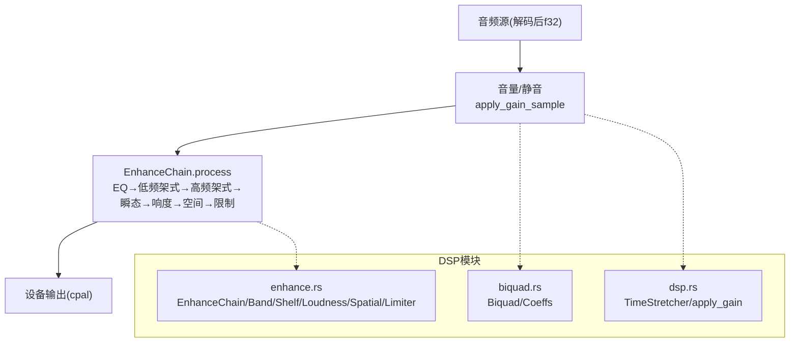
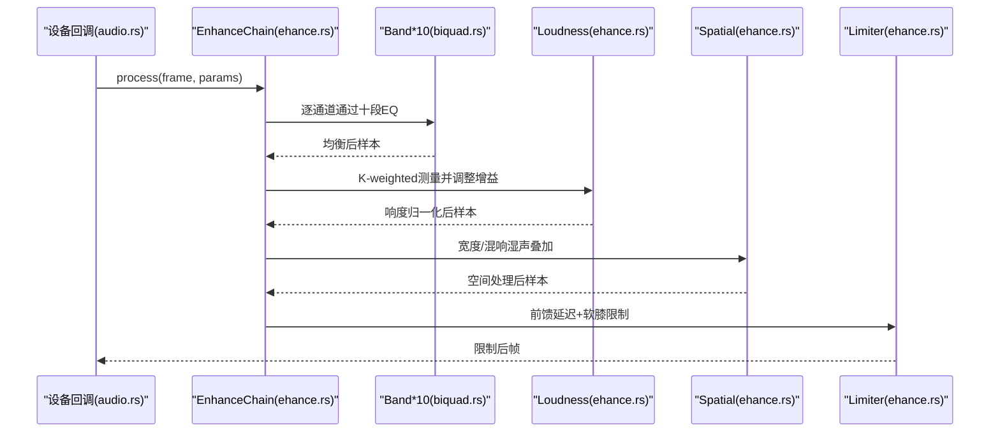
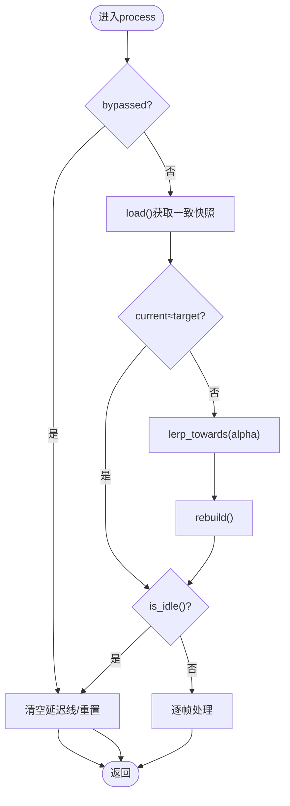
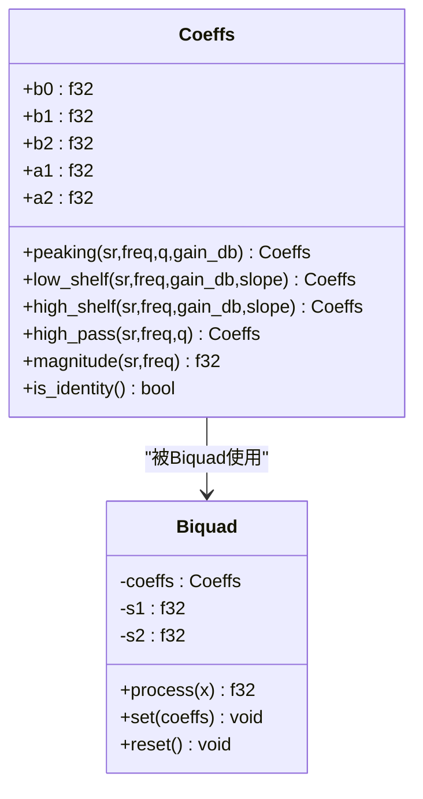
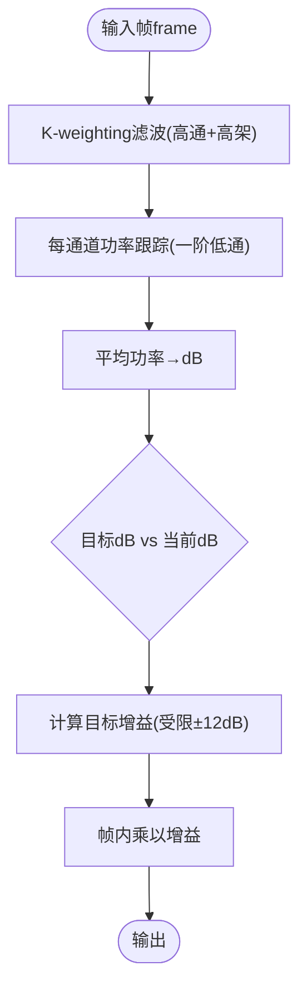
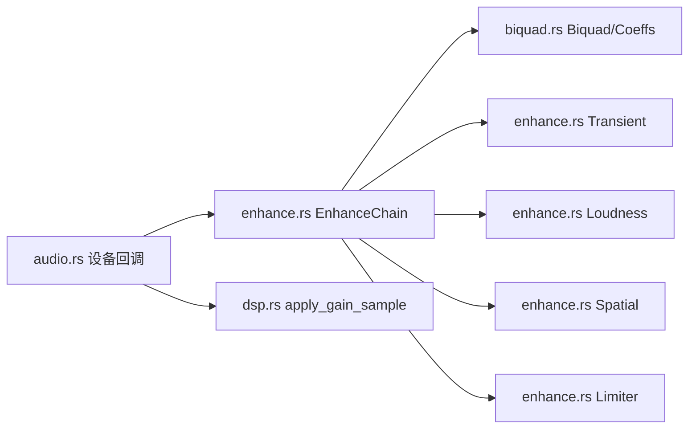

# DSP处理链

<cite>
**本文引用的文件**
- [dsp.rs](file://crates/mvp-core/src/dsp.rs)
- [enhance.rs](file://crates/mvp-core/src/dsp/enhance.rs)
- [biquad.rs](file://crates/mvp-core/src/dsp/biquad.rs)
- [audio.rs](file://crates/mvp-core/src/audio.rs)
</cite>

## 目录
1. [简介](#简介)
2. [项目结构](#项目结构)
3. [核心组件](#核心组件)
4. [架构总览](#架构总览)
5. [详细组件分析](#详细组件分析)
6. [依赖关系分析](#依赖关系分析)
7. [性能考量](#性能考量)
8. [故障排查指南](#故障排查指南)
9. [结论](#结论)
10. [附录：使用示例与调优建议](#附录使用示例与调优建议)

## 简介
本技术文档围绕实时音频增强处理链展开，重点解释以下方面：
- EnhanceChain 设计模式与处理单元编排、参数传递机制（原子参数块 + 平滑过渡）
- Biquad 滤波器实现：二阶滤波器数学原理、频率响应特性、稳定性保证
- 响度归一化算法：K-weighted 近似 LUFS、动态范围压缩、峰值限制
- 十段均衡器：频带划分、增益控制、相位处理
- 音量控制机制：线性增益、平滑过渡、静音处理
- 提供可定位的代码片段路径，便于对照实现细节
- 给出音质优化技巧与性能调优建议

## 项目结构
DSP 模块位于 mvp-core 的 dsp 子模块中，包含：
- biquad.rs：通用二阶滤波器（RBJ 系数、TDFII 状态机）
- enhance.rs：实时增强链（EQ、低频/高频架式、瞬态增强、响度归一化、空间混响、峰值限制）
- dsp.rs：时间域变速（SOLA）、通用增益应用（含软膝限幅）
- audio.rs：音频输出回调，负责将音量、静音与增强链集成到播放路径

图表来源
- [audio.rs:320-461](file://crates/mvp-core/src/audio.rs#L320-L461)
- [enhance.rs:934-1077](file://crates/mvp-core/src/dsp/enhance.rs#L934-L1077)
- [biquad.rs:1-326](file://crates/mvp-core/src/dsp/biquad.rs#L1-L326)
- [dsp.rs:302-355](file://crates/mvp-core/src/dsp.rs#L302-L355)

章节来源
- [audio.rs:1-800](file://crates/mvp-core/src/audio.rs#L1-L800)
- [enhance.rs:1-1535](file://crates/mvp-core/src/dsp/enhance.rs#L1-L1535)
- [biquad.rs:1-326](file://crates/mvp-core/src/dsp/biquad.rs#L1-L326)
- [dsp.rs:1-489](file://crates/mvp-core/src/dsp.rs#L1-L489)

## 核心组件
- EnhanceChain：按固定顺序串联多个处理阶段，所有缓冲在构造时分配，运行时零分配、无锁。
- Band/Shelf：基于 Biquad 的频带与架式滤波器，支持系数重建与通道级状态。
- Transient：快慢包络差动，用于瞬态强调（清晰度）。
- Loudness：K-weighted 短时长响度估计与增益跟随，目标响度可调。
- Spatial：Schroeder 混响（梳状+全通），宽度控制与房间大小控制。
- Limiter：前馈延迟的峰值限制器，软膝限幅，保护最终输出不削波。
- EnhanceParams：原子参数块 + 世代号，确保实时线程读取一致快照。
- apply_gain / apply_gain_sample：线性增益与软膝限幅，支持静音与平滑过渡。

章节来源
- [enhance.rs:58-182](file://crates/mvp-core/src/dsp/enhance.rs#L58-L182)
- [enhance.rs:323-403](file://crates/mvp-core/src/dsp/enhance.rs#L323-L403)
- [enhance.rs:405-512](file://crates/mvp-core/src/dsp/enhance.rs#L405-L512)
- [enhance.rs:514-798](file://crates/mvp-core/src/dsp/enhance.rs#L514-L798)
- [enhance.rs:828-932](file://crates/mvp-core/src/dsp/enhance.rs#L828-L932)
- [enhance.rs:934-1104](file://crates/mvp-core/src/dsp/enhance.rs#L934-L1104)
- [biquad.rs:16-210](file://crates/mvp-core/src/dsp/biquad.rs#L16-L210)
- [dsp.rs:302-355](file://crates/mvp-core/src/dsp.rs#L302-L355)

## 架构总览
增强链的处理顺序经过精心设计，兼顾听感与稳定性：
- EQ（十段）→ 低频架式 + 二次谐波 → 高频架式 + 瞬态强调 → 响度归一化 → 空间（宽度+混响）→ 软膝峰值限制
- 该顺序确保用户可见的 EQ 曲线与实际信号一致；响度归一化放在 EQ 之后避免追逐 EQ 变化；空间效果在前，防止尾音造成峰值突破；限制器最后，作为安全边界。

图表来源
- [audio.rs:320-461](file://crates/mvp-core/src/audio.rs#L320-L461)
- [enhance.rs:934-1077](file://crates/mvp-core/src/dsp/enhance.rs#L934-L1077)

章节来源
- [enhance.rs:10-27](file://crates/mvp-core/src/dsp/enhance.rs#L10-L27)
- [enhance.rs:934-1077](file://crates/mvp-core/src/dsp/enhance.rs#L934-L1077)

## 详细组件分析

### EnhanceChain 设计模式与参数传递
- 设计模式：单例链式处理，内部维护当前已平滑的参数快照 current，与外部发布的 target 进行 lerp 平滑，避免“拉链噪声”。
- 参数传递：通过 EnhanceParams 原子块发布/读取，使用世代号(seqlock)保证一致性；bypass 标志快速路径跳过整条链。
- 重建策略：仅当参数变化超过阈值时才重建滤波器系数，减少计算开销。

图表来源
- [enhance.rs:991-1056](file://crates/mvp-core/src/dsp/enhance.rs#L991-L1056)
- [enhance.rs:140-182](file://crates/mvp-core/src/dsp/enhance.rs#L140-L182)
- [enhance.rs:241-321](file://crates/mvp-core/src/dsp/enhance.rs#L241-L321)

章节来源
- [enhance.rs:58-182](file://crates/mvp-core/src/dsp/enhance.rs#L58-L182)
- [enhance.rs:206-321](file://crates/mvp-core/src/dsp/enhance.rs#L206-L321)
- [enhance.rs:934-1104](file://crates/mvp-core/src/dsp/enhance.rs#L934-L1104)

### Biquad 滤波器实现与稳定性
- 数学模型：RBJ 二阶滤波器，采用转置直接形式 II（TDFII），每样本4次乘加，状态变量 s1/s2 每通道每带。
- 系数生成：提供 peaking、low_shelf、high_shelf、high_pass 等标准滤波器；normalised 对 a0 做归一化并检查有限性，异常回退为恒等。
- 稳定性保障：输入频率被调用方限制至 Nyquist 以下；系数非法或输出非有限时自动复位状态，避免发散。
- 频率响应：magnitude 提供解析幅度响应，用于界面绘制与测试对齐。

图表来源
- [biquad.rs:16-210](file://crates/mvp-core/src/dsp/biquad.rs#L16-L210)

章节来源
- [biquad.rs:1-326](file://crates/mvp-core/src/dsp/biquad.rs#L1-L326)

### 十段均衡器实现
- 频带划分：固定10个中心频率（31/62/125/250/500/1k/2k/4k/8k/16k Hz），对应经典十段布局。
- 增益控制：每个频段独立 peaking 滤波器，Q 值统一可调；增益范围钳制在 ±12 dB。
- 相位处理：基于 RBJ 系数的线性相位近似，幅度响应由 magnitude 精确描述，界面与声音一致。

章节来源
- [enhance.rs:38-45](file://crates/mvp-core/src/dsp/enhance.rs#L38-L45)
- [enhance.rs:323-365](file://crates/mvp-core/src/dsp/enhance.rs#L323-L365)
- [biquad.rs:76-95](file://crates/mvp-core/src/dsp/biquad.rs#L76-L95)
- [biquad.rs:152-170](file://crates/mvp-core/src/dsp/biquad.rs#L152-L170)

### 响度归一化算法（LUFS近似）
- K-weighting：采用 ITU-R BS.1770 的两段式滤波（高通+高架），近似真实响度测量。
- 短时长功率估计：每通道一阶低通跟踪加权后的功率，计算平均功率并转换为 dB。
- 动态范围压缩：根据目标响度与当前电平差，计算所需增益并缓慢跟随（速度可控），避免泵浦。
- 关闭条件：目标响度低于阈值（默认 -60 dB）时，增益回归 unity，不引入额外处理。

图表来源
- [enhance.rs:439-512](file://crates/mvp-core/src/dsp/enhance.rs#L439-L512)

章节来源
- [enhance.rs:439-512](file://crates/mvp-core/src/dsp/enhance.rs#L439-L512)

### 空间效果（宽度与混响）
- 宽度控制：Mid/Side 变换，调节侧向分量以改变立体声宽度。
- 混响：Schroeder 结构，8 条梳状滤波器并联 + 4 条全通串联，产生自然扩散尾音；左右通道延迟微调去相关，使尾音具备立体感。
- 预延迟：避免早期反射与干声重叠造成梳状染色。
- 湿声增益：随房间大小非线性映射，保持听感一致且不超过干声太多。

章节来源
- [enhance.rs:514-798](file://crates/mvp-core/src/dsp/enhance.rs#L514-L798)

### 峰值限制器（Soft Knee）
- 前馈延迟：约1ms，用于检测即将出现的峰值并提前衰减。
- 共享增益：取多通道最大峰值决定全局增益，避免立体像漂移。
- 软膝限幅：tanh 曲线在 -3 dBFS 附近平滑折叠，避免硬削波失真。
- 释放时间：约50ms，平衡恢复速度与泵浦抑制。

章节来源
- [enhance.rs:828-932](file://crates/mvp-core/src/dsp/enhance.rs#L828-L932)

### 音量控制机制
- 线性增益：apply_gain_sample 对单样本应用增益，支持静音（0）、小于1衰减、大于1放大。
- 平滑过渡：在设备回调中对 applied_gain 跨缓冲区渐变，避免突变导致的咔嗒声。
- 软膝限幅：放大时仅在接近削波处启用 tanh 膝区，保持小信号透明。

章节来源
- [dsp.rs:302-355](file://crates/mvp-core/src/dsp.rs#L302-L355)
- [audio.rs:320-461](file://crates/mvp-core/src/audio.rs#L320-L461)

## 依赖关系分析
- EnhanceChain 依赖 Biquad/Coeffs 实现具体滤波器；依赖 Shelf/Band 封装通道状态；依赖 Transient/Loudness/Spatial/Limiter 完成各阶段处理。
- audio.rs 在设备回调中构建 EnhanceChain，并将音量应用置于链之前，确保限制器天花板针对实际听到的信号有效。
- 参数通过 EnhanceParams 原子块在 UI 线程与实时线程间安全传递。

图表来源
- [audio.rs:320-461](file://crates/mvp-core/src/audio.rs#L320-L461)
- [enhance.rs:934-1077](file://crates/mvp-core/src/dsp/enhance.rs#L934-L1077)
- [biquad.rs:16-210](file://crates/mvp-core/src/dsp/biquad.rs#L16-L210)
- [dsp.rs:302-355](file://crates/mvp-core/src/dsp.rs#L302-L355)

章节来源
- [audio.rs:1-800](file://crates/mvp-core/src/audio.rs#L1-L800)
- [enhance.rs:934-1104](file://crates/mvp-core/src/dsp/enhance.rs#L934-L1104)

## 性能考量
- 零分配实时路径：所有缓冲在 EnhanceChain::new 一次性分配，process 仅复用 scratch，避免堆分配与锁。
- 参数平滑：按时间比例 lerp，而非按块大小，保证不同驱动缓冲大小下平滑一致。
- 快速路径：bypass 与 is_idle 短路处理，避免不必要的计算。
- 稳定性与鲁棒性：系数非法或输出非有限时自动复位，防止 CPU 空转。
- 延迟控制：仅限制器的前馈延迟计入链路延迟，空间效果为湿声叠加不增加延迟。

章节来源
- [enhance.rs:934-1007](file://crates/mvp-core/src/dsp/enhance.rs#L934-L1007)
- [enhance.rs:1010-1030](file://crates/mvp-core/src/dsp/enhance.rs#L1010-L1030)
- [biquad.rs:180-210](file://crates/mvp-core/src/dsp/biquad.rs#L180-L210)

## 故障排查指南
- 无声或卡顿：检查 bypass 是否意外开启；确认 EnhanceParams.ready 与 latency_ms 是否正常上报。
- 咔嗒声：确认音量变化是否跨缓冲区平滑；检查 apply_gain_sample 的增益是否为有限值。
- 削波失真：调整 limiter_ceiling_db 或降低上游增益；观察 soft_knee 是否生效。
- 响度不一致：检查 loudness_target_db 是否过低（默认关闭）；确认 K-weighting 滤波是否工作。
- 空间效果异常：确认 spatial_room 与 spatial_width 设置；检查左右通道延迟偏移是否生效。

章节来源
- [enhance.rs:241-321](file://crates/mvp-core/src/dsp/enhance.rs#L241-L321)
- [dsp.rs:302-355](file://crates/mvp-core/src/dsp.rs#L302-L355)
- [enhance.rs:828-932](file://crates/mvp-core/src/dsp/enhance.rs#L828-L932)

## 结论
该 DSP 处理链以 EnhanceChain 为核心，采用严格的实时约束与零分配策略，结合 Biquad 滤波器、K-weighted 响度归一化、Schroeder 混响与软膝限制器，实现了高质量、低延迟的音频增强。参数通过原子块与平滑过渡机制安全传递，确保实时线程稳定运行。整体架构兼顾听感与工程可靠性，适用于多媒体播放器场景。

## 附录：使用示例与调优建议

### 滤波器配置（代码片段路径）
- 创建十段均衡器并设置 Q 值与增益：[enhance.rs:323-365](file://crates/mvp-core/src/dsp/enhance.rs#L323-L365)
- 生成 peaking/low_shelf/high_shelf 系数：[biquad.rs:76-150](file://crates/mvp-core/src/dsp/biquad.rs#L76-L150)
- 应用 Biquad 处理单样本：[biquad.rs:180-210](file://crates/mvp-core/src/dsp/biquad.rs#L180-L210)

### 均衡器调节（代码片段路径）
- 更新 Snapshot.eq_gain 并发布：[enhance.rs:241-262](file://crates/mvp-core/src/dsp/enhance.rs#L241-L262)
- 重建滤波器系数：[enhance.rs:1079-1089](file://crates/mvp-core/src/dsp/enhance.rs#L1079-L1089)

### 响度分析（代码片段路径）
- K-weighting 与功率跟踪：[enhance.rs:439-512](file://crates/mvp-core/src/dsp/enhance.rs#L439-L512)
- 目标响度与速度控制：[enhance.rs:475-512](file://crates/mvp-core/src/dsp/enhance.rs#L475-L512)

### 音质优化技巧
- 合理设置 EQ 增益范围（±12 dB），避免过度提升导致后续阶段过载。
- 使用 bass_harmonics 在小扬声器上暗示基频，提升低频感知。
- clarity_transient 适度增强瞬态，提高清晰度但避免刺耳。
- 响度目标设为 -18~-24 dBFS 区间，避免过强压缩。
- 空间混响 room 控制在 0.2~0.6 之间，保持自然且不掩蔽干声。

### 性能调优建议
- 尽量保持 bypass 或 is_idle 路径，减少不必要处理。
- 参数变更频率不宜过高，利用平滑过渡避免频繁重建。
- 监控 limiter 的 reduction，若长期作用需调整上游增益或目标响度。
- 在高采样率设备上注意延迟报告，仅限制器贡献延迟。

章节来源
- [enhance.rs:241-262](file://crates/mvp-core/src/dsp/enhance.rs#L241-L262)
- [enhance.rs:439-512](file://crates/mvp-core/src/dsp/enhance.rs#L439-L512)
- [enhance.rs:1079-1089](file://crates/mvp-core/src/dsp/enhance.rs#L1079-L1089)
- [biquad.rs:76-150](file://crates/mvp-core/src/dsp/biquad.rs#L76-L150)
- [biquad.rs:180-210](file://crates/mvp-core/src/dsp/biquad.rs#L180-L210)