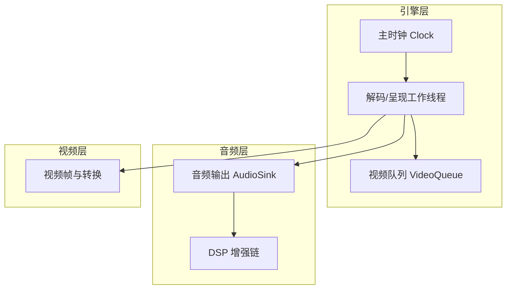
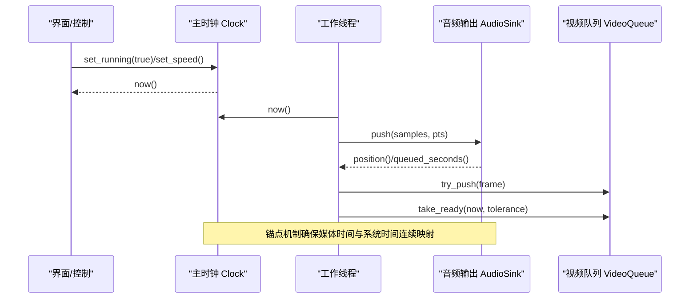
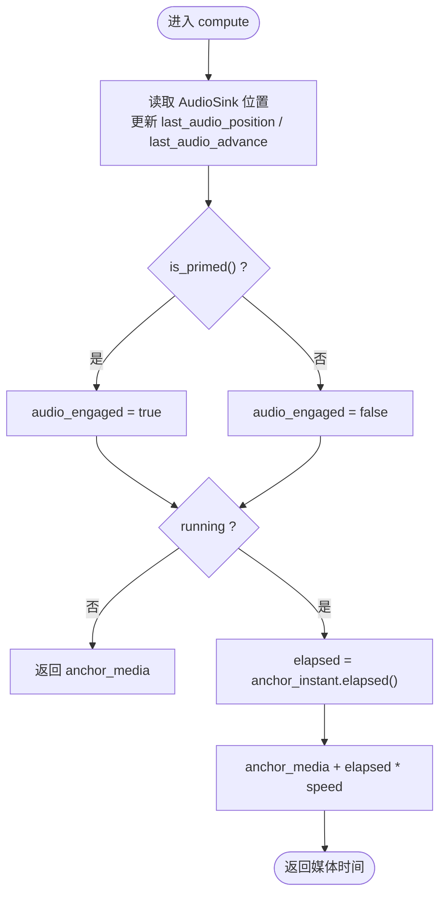
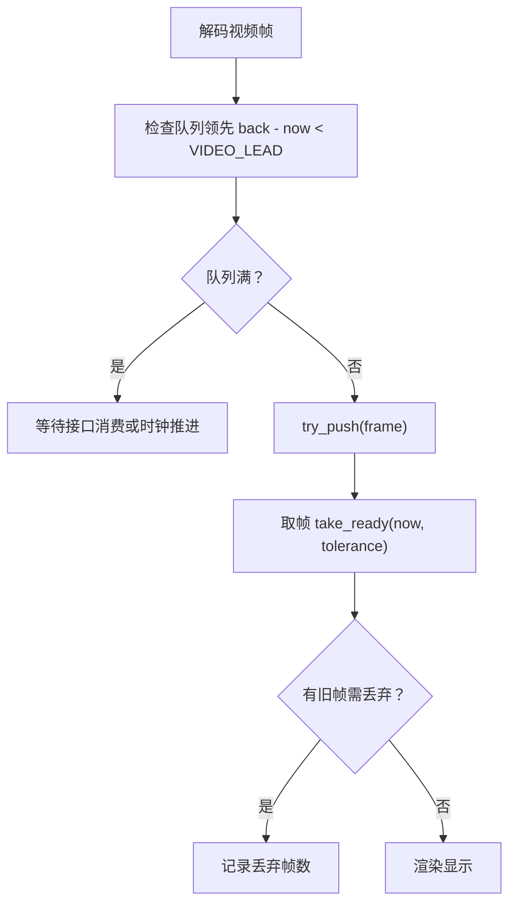
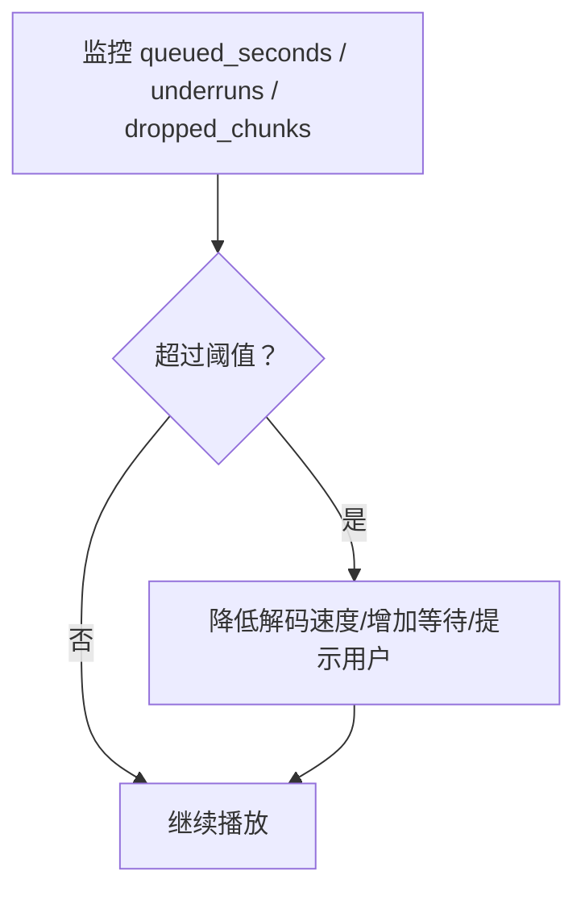
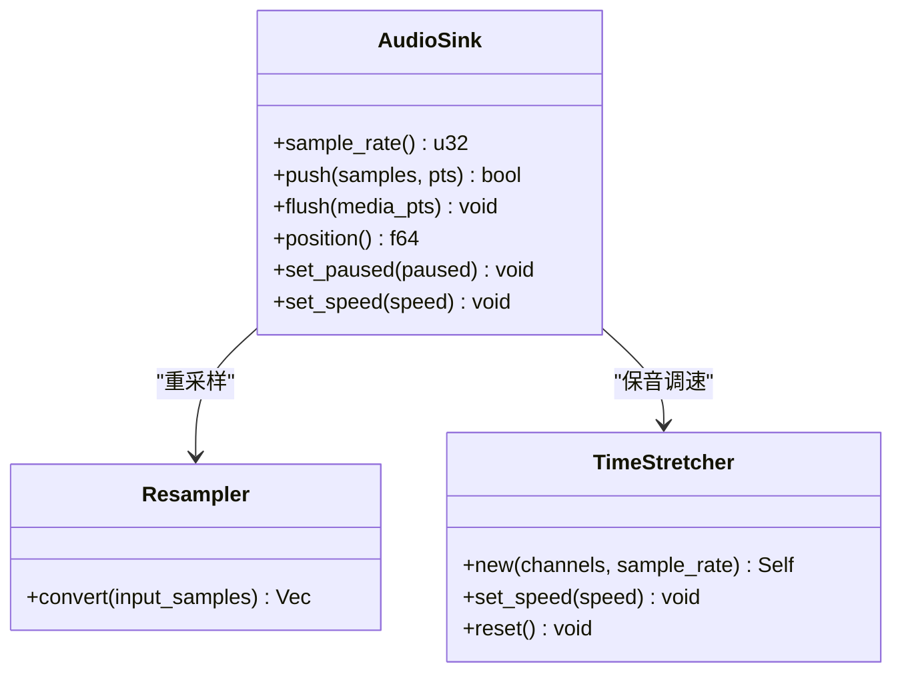
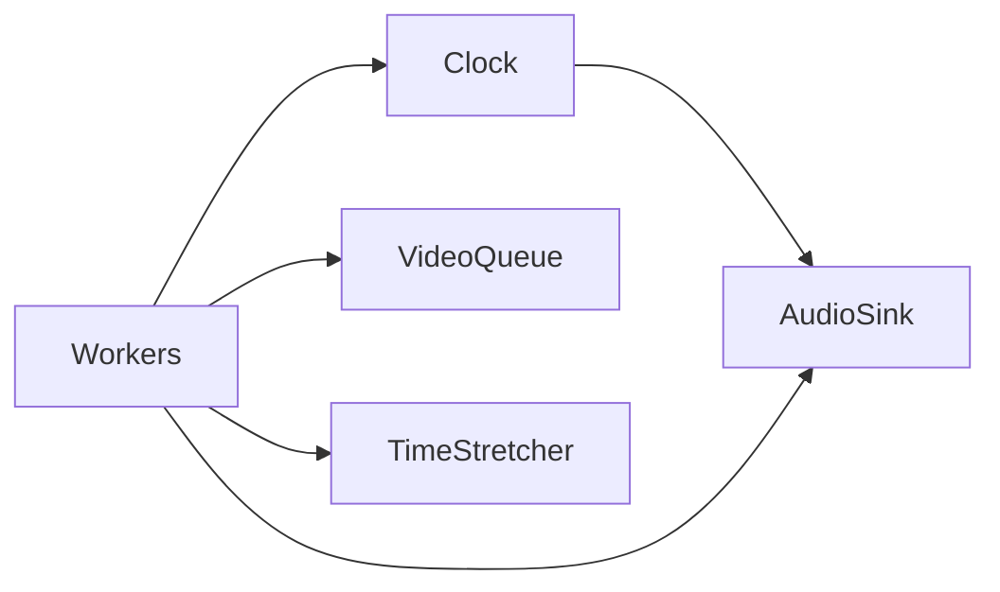

# 音频同步机制

<cite>
**本文引用的文件**   
- [clock.rs](file://crates/mvp-core/src/engine/clock.rs)
- [audio.rs](file://crates/mvp-core/src/audio.rs)
- [workers.rs](file://crates/mvp-core/src/engine/workers.rs)
- [queue.rs](file://crates/mvp-core/src/engine/queue.rs)
- [video.rs](file://crates/mvp-core/src/video.rs)
- [dsp.rs](file://crates/mvp-core/src/dsp.rs)
</cite>

## 目录
1. [引言](#引言)
2. [项目结构](#项目结构)
3. [核心组件](#核心组件)
4. [架构总览](#架构总览)
5. [详细组件分析](#详细组件分析)
6. [依赖关系分析](#依赖关系分析)
7. [性能与延迟特性](#性能与延迟特性)
8. [故障排除指南](#故障排除指南)
9. [结论](#结论)

## 引言
本文面向“音频同步机制”的技术文档，围绕主时钟设计、音视频同步策略、延迟补偿、重采样与时间拉伸、暂停恢复等关键主题展开。该播放器采用“系统单调时钟为主、声卡播放时间为辅”的主从式时钟模型：视频和音频都向一个稳定的媒体时间轴靠拢，避免直接以声卡计数作为时间基准导致的漂移或加速问题。同时，通过队列预算、丢帧策略、缓冲深度监控与自适应调整，实现低延迟、可响应且稳定的播放体验。

## 项目结构
与音频同步相关的代码主要分布在以下模块：
- 引擎层：主时钟、工作线程调度、队列管理
- 音频层：基于 cpal 的实时输出、锚点与时间戳映射、暂停/速度控制
- 视频层：帧转换、渲染准备、Dolby Vision 处理（与同步间接相关）
- DSP 层：时域音频处理，包括保音调速的时间拉伸器



**图表来源**
- [clock.rs:1-158](file://crates/mvp-core/src/engine/clock.rs#L1-L158)
- [audio.rs:1-26](file://crates/mvp-core/src/audio.rs#L1-L26)
- [workers.rs:1382-1424](file://crates/mvp-core/src/engine/workers.rs#L1382-L1424)
- [queue.rs:67-168](file://crates/mvp-core/src/engine/queue.rs#L67-L168)

**章节来源**
- [clock.rs:1-158](file://crates/mvp-core/src/engine/clock.rs#L1-L158)
- [audio.rs:1-26](file://crates/mvp-core/src/audio.rs#L1-L26)
- [workers.rs:1382-1424](file://crates/mvp-core/src/engine/workers.rs#L1382-L1424)
- [queue.rs:67-168](file://crates/mvp-core/src/engine/queue.rs#L67-L168)

## 核心组件
- 主时钟 Clock：提供样本级精度的媒体时间，支持运行/暂停、速率变化、跳转；在音频可用时与 AudioSink 的位置保持连续。
- 音频输出 AudioSink：基于 cpal 的实时输出，使用锚点机制将媒体时间映射到系统时间，避免驱动回调计数造成的时钟漂移。
- 工作线程 workers：协调音视频解码与呈现，执行等待音频领先、视频帧等待、丢帧与队列预算控制。
- 视频队列 VideoQueue：字节预算与时间预算双约束，保证最老帧优先呈现，必要时丢弃过时帧。
- DSP 时间拉伸 TimeStretcher：SOLA 算法实现保音调速，配合时钟与重采样完成变速同步。

**章节来源**
- [clock.rs:43-158](file://crates/mvp-core/src/engine/clock.rs#L43-L158)
- [audio.rs:81-151](file://crates/mvp-core/src/audio.rs#L81-L151)
- [workers.rs:1382-1424](file://crates/mvp-core/src/engine/workers.rs#L1382-L1424)
- [queue.rs:67-168](file://crates/mvp-core/src/engine/queue.rs#L67-L168)
- [dsp.rs:21-50](file://crates/mvp-core/src/dsp.rs#L21-L50)

## 架构总览
下图展示主时钟、音频输出与工作线程之间的交互关系，以及时间锚点如何贯穿整个播放流程。



**图表来源**
- [clock.rs:122-158](file://crates/mvp-core/src/engine/clock.rs#L122-L158)
- [audio.rs:519-575](file://crates/mvp-core/src/audio.rs#L519-L575)
- [workers.rs:1382-1424](file://crates/mvp-core/src/engine/workers.rs#L1382-L1424)
- [queue.rs:180-252](file://crates/mvp-core/src/engine/queue.rs#L180-L252)

## 详细组件分析

### 主时钟设计与锚点机制
主时钟维护两个时间源：
- 音频时钟：当音频设备可用时，AudioSink 提供样本级位置，用于精确同步。
- 墙钟：在音频未启动、纯视频文件或音频停滞时使用，保证时间连续性。

时钟的核心是锚点（anchor）：
- 在 AudioSink 中，首次推送或检测到时间戳不连续时设置 anchor_pts 与 anchor_ns。
- 计算当前媒体位置时，根据 paused 状态选择是否推进 anchor_ns，再乘以 speed 得到线性位置。
- Clock::compute 会读取 AudioSink::position 并标记 audio_engaged，从而决定 is_audio_driven。



**图表来源**
- [clock.rs:133-158](file://crates/mvp-core/src/engine/clock.rs#L133-L158)
- [audio.rs:604-618](file://crates/mvp-core/src/audio.rs#L604-L618)

**章节来源**
- [clock.rs:25-41](file://crates/mvp-core/src/engine/clock.rs#L25-L41)
- [clock.rs:122-158](file://crates/mvp-core/src/engine/clock.rs#L122-L158)
- [audio.rs:81-151](file://crates/mvp-core/src/audio.rs#L81-L151)
- [audio.rs:519-575](file://crates/mvp-core/src/audio.rs#L519-L575)
- [audio.rs:604-618](file://crates/mvp-core/src/audio.rs#L604-L618)

### 音视频同步策略
- 视频帧等待：工作线程在视频解码后检查队列容量与领先窗口（VIDEO_LEAD），若队列已满或超出领先范围则等待接口消费或时钟推进。
- 音频优先原则：音频解码循环通过 wait_for_audio_lead 确保音频不会过度领先于播放头，避免画面追赶声音。
- 丢帧处理：VideoQueue::take_ready_counted 会丢弃已过时的帧，保留最新可呈现帧，统计丢弃数量用于诊断。



**图表来源**
- [workers.rs:1382-1424](file://crates/mvp-core/src/engine/workers.rs#L1382-L1424)
- [queue.rs:212-252](file://crates/mvp-core/src/engine/queue.rs#L212-L252)

**章节来源**
- [workers.rs:1382-1424](file://crates/mvp-core/src/engine/workers.rs#L1382-L1424)
- [queue.rs:180-252](file://crates/mvp-core/src/engine/queue.rs#L180-L252)

### 延迟补偿机制
- 缓冲区深度监控：AudioSink::queued_seconds 基于 chunk_frames 与队列长度估算秒级缓冲深度；UI 面板可展示音频缓冲、欠载与丢弃块。
- 自适应调整：队列按字节预算与时间预算双重限制，防止解码跑得太远；音频侧通过 wait_for_audio_lead 控制音频领先上限。
- 卡顿预防：音频回调中遇到数据不足时填充静音并统计 underruns；关闭时设置 closing 标志以立即中断阻塞发送。



**图表来源**
- [audio.rs:478-506](file://crates/mvp-core/src/audio.rs#L478-L506)
- [audio.rs:519-575](file://crates/mvp-core/src/audio.rs#L519-L575)
- [workers.rs:1909-1934](file://crates/mvp-core/src/engine/workers.rs#L1909-L1934)

**章节来源**
- [audio.rs:478-506](file://crates/mvp-core/src/audio.rs#L478-L506)
- [audio.rs:519-575](file://crates/mvp-core/src/audio.rs#L519-L575)
- [workers.rs:1909-1934](file://crates/mvp-core/src/engine/workers.rs#L1909-L1934)

### 重采样同步
- 采样率匹配：AudioSink 打开设备时选择稳定采样率（如 48 kHz），并通过 preferred_config 适配设备能力。
- 插值算法：工作线程使用 FFmpeg 软件重采样上下文进行采样率转换；TimeStretcher 负责保音调速。
- 质量保持：重采样与时间拉伸分离，避免额外图结构与拷贝开销；时间拉伸使用 SOLA 算法，保持音高自然。



**图表来源**
- [audio.rs:698-743](file://crates/mvp-core/src/audio.rs#L698-L743)
- [dsp.rs:21-50](file://crates/mvp-core/src/dsp.rs#L21-L50)
- [workers.rs:1937-2000](file://crates/mvp-core/src/engine/workers.rs#L1937-L2000)

**章节来源**
- [audio.rs:698-743](file://crates/mvp-core/src/audio.rs#L698-L743)
- [dsp.rs:21-50](file://crates/mvp-core/src/dsp.rs#L21-L50)
- [workers.rs:1937-2000](file://crates/mvp-core/src/engine/workers.rs#L1937-L2000)

### 暂停恢复同步
- 时间戳修正：AudioSink::set_paused 在暂停时记录 paused_at_ns，恢复时将 anchor_ns 前移 pause 时长，避免时间跳跃。
- 状态保持：Shared.paused 与 paused_at_ns 原子变量保证实时回调安全访问。
- 无缝衔接：Clock::set_running 在切换运行态时冻结当前位置，确保暂停前后位置一致。

```mermaid
sequenceDiagram
participant App as "应用"
participant Sink as "AudioSink"
participant Clock as "Clock"
App->>Sink : set_paused(true)
Sink->>Sink : paused_at_ns = now_ns()
App->>Clock : set_running(false)
Clock->>Clock : anchor_media = now(); anchor_instant = Instant : : now()
App->>Sink : set_paused(false)
Sink->>Sink : delta = now_ns() - paused_at_ns; anchor_ns += delta
App->>Clock : set_running(true)
Clock->>Clock : 继续推进 anchor_media + elapsed * speed
```

**图表来源**
- [audio.rs:620-658](file://crates/mvp-core/src/audio.rs#L620-L658)
- [clock.rs:86-97](file://crates/mvp-core/src/engine/clock.rs#L86-L97)

**章节来源**
- [audio.rs:620-658](file://crates/mvp-core/src/audio.rs#L620-L658)
- [clock.rs:86-97](file://crates/mvp-core/src/engine/clock.rs#L86-L97)

## 依赖关系分析
- Clock 依赖 AudioSink 提供位置与 primed 状态，决定 is_audio_driven。
- Workers 依赖 Clock 获取播放头时间，依赖 AudioSink 推送音频与查询缓冲深度。
- VideoQueue 被 Workers 用于视频帧缓存与丢帧决策。
- DSP TimeStretcher 由 Workers 调用以实现保音调速。



**图表来源**
- [clock.rs:23-41](file://crates/mvp-core/src/engine/clock.rs#L23-L41)
- [workers.rs:1382-1424](file://crates/mvp-core/src/engine/workers.rs#L1382-L1424)
- [queue.rs:67-168](file://crates/mvp-core/src/engine/queue.rs#L67-L168)
- [dsp.rs:21-50](file://crates/mvp-core/src/dsp.rs#L21-L50)

**章节来源**
- [clock.rs:23-41](file://crates/mvp-core/src/engine/clock.rs#L23-L41)
- [workers.rs:1382-1424](file://crates/mvp-core/src/engine/workers.rs#L1382-L1424)
- [queue.rs:67-168](file://crates/mvp-core/src/engine/queue.rs#L67-L168)
- [dsp.rs:21-50](file://crates/mvp-core/src/dsp.rs#L21-L50)

## 性能与延迟特性
- 主时钟使用系统单调时钟，避免声卡驱动回调计数导致的漂移与加速。
- 音频回调中避免分配与锁，仅使用原子与无锁通道，保证实时性。
- 视频队列按字节与时间预算限制，防止内存膨胀与呈现滞后。
- 时间拉伸使用 SOLA 算法，具备固有前瞻缓冲（约 40–120 ms），在变速时保持音高自然。

[本节为通用性能讨论，不直接分析具体文件]

## 故障排除指南
- 音频欠载（underruns）：检查 AudioSink::underruns 与 UI 面板中的“音频欠载”计数；若频繁出现，考虑提升系统音频优先级或减少其他 CPU 负载。
- 音频块丢弃（dropped_chunks）：查看 AudioSink::dropped_chunks；若持续上升，可能因队列满导致背压，需优化解码或渲染路径。
- 音频缓冲过深：通过 AudioSink::queued_seconds 监控；若过大，可降低解码速度或增加等待时间。
- 暂停恢复跳变：确认 Shared.paused_at_ns 与 Anchor 更新逻辑；确保 set_paused 与 set_running 的顺序正确。
- 变速卡顿：检查 TimeStretcher 的速度范围（MIN_SPEED/MAX_SPEED）与输入缓冲；避免极端变速导致算法不稳定。

**章节来源**
- [audio.rs:478-506](file://crates/mvp-core/src/audio.rs#L478-L506)
- [audio.rs:519-575](file://crates/mvp-core/src/audio.rs#L519-L575)
- [dsp.rs:52-57](file://crates/mvp-core/src/dsp.rs#L52-L57)

## 结论
该播放器的音频同步机制以系统单调时钟为主、声卡播放时间为辅，通过锚点机制实现媒体时间的精确映射。工作线程协调音视频解码与呈现，采用音频优先、视频帧等待与丢帧策略保障同步质量。延迟补偿通过缓冲深度监控与自适应调整实现，重采样与时间拉伸分离以保证音质与性能。暂停恢复通过时间戳修正与状态保持确保无缝衔接。整体设计在稳定性、响应性与音质之间取得良好平衡。