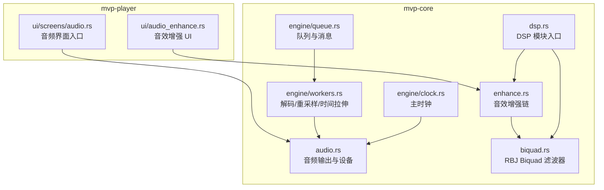
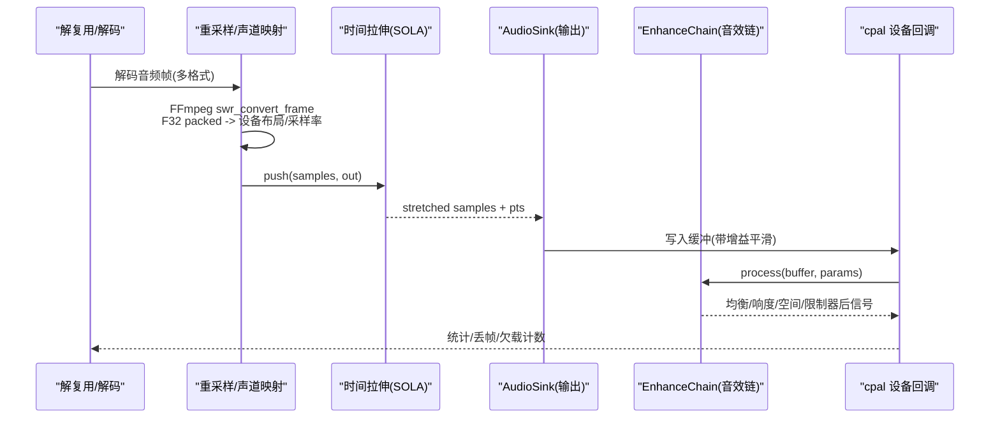
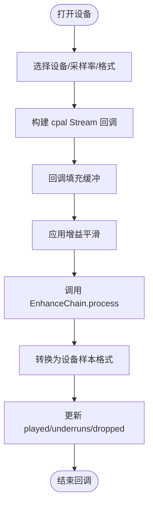
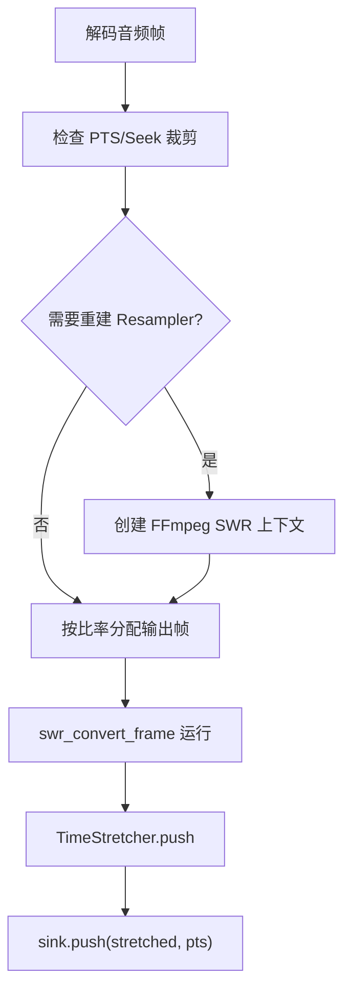
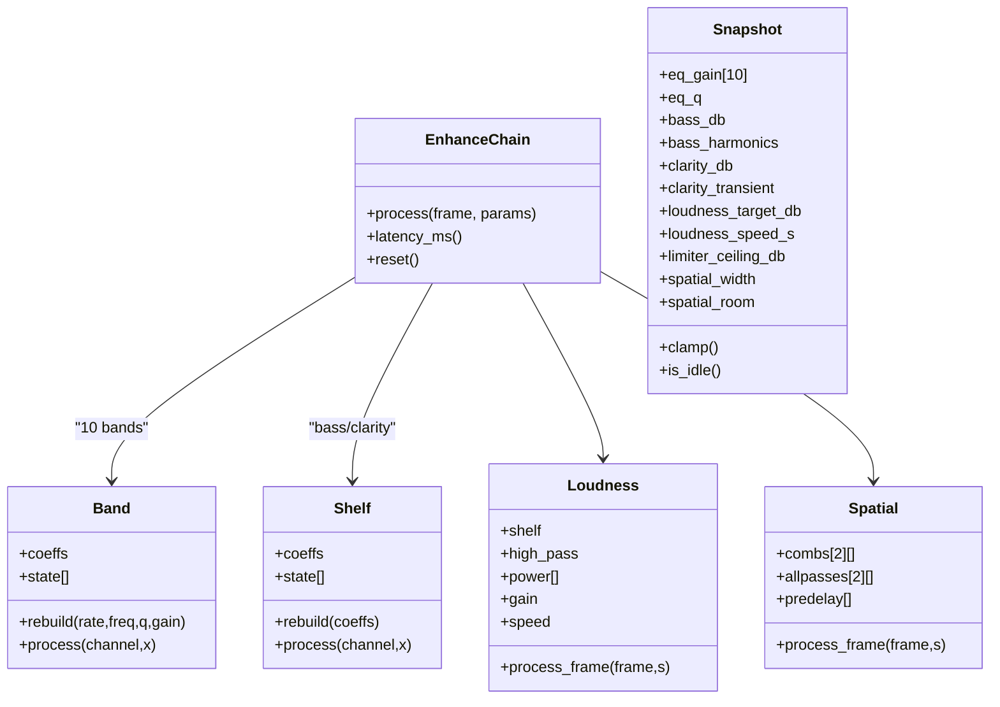
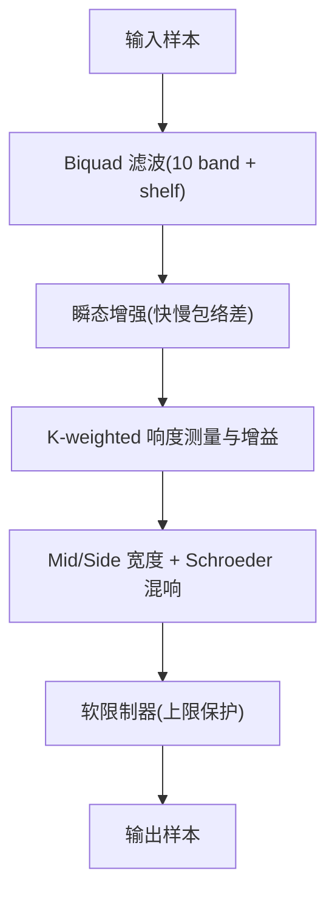
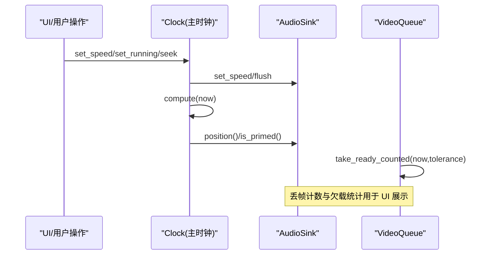
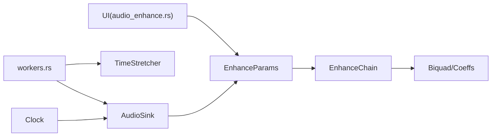

# 音频处理系统

<cite>
**本文引用的文件**   
- [audio.rs](file://crates/mvp-core/src/audio.rs)
- [dsp.rs](file://crates/mvp-core/src/dsp.rs)
- [biquad.rs](file://crates/mvp-core/src/dsp/biquad.rs)
- [enhance.rs](file://crates/mvp-core/src/dsp/enhance.rs)
- [clock.rs](file://crates/mvp-core/src/engine/clock.rs)
- [queue.rs](file://crates/mvp-core/src/engine/queue.rs)
- [workers.rs](file://crates/mvp-core/src/engine/workers.rs)
- [audio_enhance.rs](file://crates/mvp-player/src/ui/audio_enhance.rs)
- [audio_screen.rs](file://crates/mvp-player/src/ui/screens/audio.rs)
</cite>

## 目录
1. [引言](#引言)
2. [项目结构](#项目结构)
3. [核心组件](#核心组件)
4. [架构总览](#架构总览)
5. [详细组件分析](#详细组件分析)
6. [依赖关系分析](#依赖关系分析)
7. [性能与质量优化](#性能与质量优化)
8. [故障诊断指南](#故障诊断指南)
9. [结论](#结论)
10. [附录：关键流程与示例路径](#附录关键流程与示例路径)

## 引言
本技术文档面向音频处理子系统，覆盖以下目标：
- 音频输出管理：设备选择、采样率转换、缓冲区与队列管理。
- 音频解码流程：多格式支持、声道重映射、音频格式转换。
- 音效增强系统：十段均衡器、响度归一化、空间感增强。
- DSP 处理链：Biquad 滤波器、时间拉伸、音量控制。
- 同步机制：与视频时钟同步、延迟补偿、丢帧处理。
- 实操指引：设备初始化、参数调节、实时处理的关键代码路径。
- 质量优化建议与常见问题诊断方法。

该系统以“一次打开输出设备”为核心设计，避免频繁切换导致的启动延迟和爆音；通过原子参数块在 UI 线程与音频回调线程之间安全传递参数；使用 SOLA 算法实现保真时间拉伸；采用 RBJ Biquad 构建十段均衡与低音/清晰度 Shelf；通过 K-weighted 近似响度测量与软限制器完成响度归一化与峰值保护；最终通过主时钟将音频位置与视频播放对齐。

## 项目结构
音频相关代码主要分布在两个 crate：
- mvp-core：音频输出、DSP、引擎（时钟、队列、工作线程）。
- mvp-player：UI 层，包括音效增强面板与音频界面。

图表来源
- [audio.rs:1-800](file://crates/mvp-core/src/audio.rs#L1-L800)
- [dsp.rs:1-489](file://crates/mvp-core/src/dsp.rs#L1-L489)
- [biquad.rs:1-326](file://crates/mvp-core/src/dsp/biquad.rs#L1-L326)
- [enhance.rs:1-800](file://crates/mvp-core/src/dsp/enhance.rs#L1-L800)
- [clock.rs:1-213](file://crates/mvp-core/src/engine/clock.rs#L1-L213)
- [queue.rs:1-440](file://crates/mvp-core/src/engine/queue.rs#L1-L440)
- [workers.rs:1950-2149](file://crates/mvp-core/src/engine/workers.rs#L1950-L2149)
- [audio_enhance.rs:1-457](file://crates/mvp-player/src/ui/audio_enhance.rs#L1-L457)
- [audio_screen.rs:1-24](file://crates/mvp-player/src/ui/screens/audio.rs#L1-L24)

章节来源
- [audio.rs:1-800](file://crates/mvp-core/src/audio.rs#L1-L800)
- [dsp.rs:1-489](file://crates/mvp-core/src/dsp.rs#L1-L489)
- [enhance.rs:1-800](file://crates/mvp-core/src/dsp/enhance.rs#L1-L800)
- [clock.rs:1-213](file://crates/mvp-core/src/engine/clock.rs#L1-L213)
- [queue.rs:1-440](file://crates/mvp-core/src/engine/queue.rs#L1-L440)
- [workers.rs:1950-2149](file://crates/mvp-core/src/engine/workers.rs#L1950-L2149)
- [audio_enhance.rs:1-457](file://crates/mvp-player/src/ui/audio_enhance.rs#L1-L457)
- [audio_screen.rs:1-24](file://crates/mvp-player/src/ui/screens/audio.rs#L1-L24)

## 核心组件
- 音频输出 AudioSink：封装 cpal 流、设备配置、缓冲队列、实时增益与静音、暂停/恢复、速度控制、位置计算。
- DSP 模块：提供 TimeStretcher（SOLA 时间拉伸）、apply_gain（带软限的线性增益）、Biquad/Coeffs（RBJ 滤波器）、EnhanceChain（音效增强链）。
- 音效增强 EnhanceParams/Snapshot：原子参数块与快照，包含十段 EQ、低音/清晰度 Shelf、瞬态增强、K-weighted 响度、空间宽度与混响、软限制器上限。
- 主时钟 Clock：维护 wall clock 与 audio sink 锚点，统一 seek/speed/pause 行为。
- 队列与消息 VideoQueue/AudioMsg/PacketMsg：解复用与解码工作线程的消息类型与视频帧队列（音频侧通过 AudioSink 队列）。
- 工作线程 workers：音频解码、FFmpeg 重采样、声道布局转换、时间拉伸、推送到 AudioSink。
- UI 音效增强面板：绘制响应曲线、滑块控件、预设应用、参数发布到 EnhanceParams。

章节来源
- [audio.rs:153-696](file://crates/mvp-core/src/audio.rs#L153-L696)
- [dsp.rs:21-300](file://crates/mvp-core/src/dsp.rs#L21-L300)
- [biquad.rs:16-210](file://crates/mvp-core/src/dsp/biquad.rs#L16-L210)
- [enhance.rs:58-321](file://crates/mvp-core/src/dsp/enhance.rs#L58-L321)
- [clock.rs:44-159](file://crates/mvp-core/src/engine/clock.rs#L44-L159)
- [queue.rs:11-65](file://crates/mvp-core/src/engine/queue.rs#L11-L65)
- [workers.rs:1950-2149](file://crates/mvp-core/src/engine/workers.rs#L1950-L2149)
- [audio_enhance.rs:52-259](file://crates/mvp-player/src/ui/audio_enhance.rs#L52-L259)

## 架构总览
整体数据流从解复用/解码开始，经重采样与声道重映射，进入时间拉伸，再送入输出端进行增益与音效增强，最后由音频设备回调驱动硬件。

图表来源
- [workers.rs:2005-2094](file://crates/mvp-core/src/engine/workers.rs#L2005-L2094)
- [audio.rs:320-461](file://crates/mvp-core/src/audio.rs#L320-L461)
- [enhance.rs:1061-1091](file://crates/mvp-core/src/dsp/enhance.rs#L1061-L1091)

## 详细组件分析

### 音频输出管理：设备选择、采样率转换、缓冲区管理
- 设备选择：优先匹配友好名称，否则回退到系统默认设备；若默认采样率为非标准值（如 192 kHz），尝试切换到 48 kHz 或 44.1 kHz 以获得稳定时钟与更低缓冲延迟。
- 采样率与格式：根据设备支持的输出配置创建 cpal Stream；内部统一为 f32 缓冲，并在回调中按设备样本格式转换。
- 缓冲区与队列：bounded crossbeam channel 承载 AudioChunk，容量固定；每 chunk 携带 generation 用于 flush（seek/切轨）时丢弃旧数据而不影响新数据。
- 实时增益与静音：在回调中逐样本平滑 ramp 到目标增益，避免突变爆音；静音直接置零。
- 位置与主时钟：基于 anchor_pts 与 anchor_ns 计算当前媒体时间，考虑 speed 与 paused 状态；underruns 与 dropped 统计用于 UI 展示。

图表来源
- [audio.rs:180-318](file://crates/mvp-core/src/audio.rs#L180-L318)
- [audio.rs:320-461](file://crates/mvp-core/src/audio.rs#L320-L461)
- [audio.rs:698-743](file://crates/mvp-core/src/audio.rs#L698-L743)

章节来源
- [audio.rs:172-318](file://crates/mvp-core/src/audio.rs#L172-L318)
- [audio.rs:320-461](file://crates/mvp-core/src/audio.rs#L320-L461)
- [audio.rs:463-696](file://crates/mvp-core/src/audio.rs#L463-L696)
- [audio.rs:698-743](file://crates/mvp-core/src/audio.rs#L698-L743)

### 音频解码流程：多格式支持、声道重映射、音频格式转换
- 多格式支持：通过 ffmpeg_next 解码任意音频编解码器，输出原始帧。
- 重采样与声道映射：当输入格式/采样率/声道数变化时重建 resampler；使用 swr_convert_frame 将输入转为 F32 packed 并映射到设备布局与采样率。
- 输出缓冲尺寸：按 in_rate/dst_rate 比例预分配输出帧容量，避免截断导致欠载。
- 时间拉伸：SOLA 算法对拉伸后的数据进行 push，保持音高不变。
- 推送至输出：sink.push(stretched, pts)，受 wait_for_audio_lead 控制以避免堆积。

图表来源
- [workers.rs:1982-2094](file://crates/mvp-core/src/engine/workers.rs#L1982-L2094)

章节来源
- [workers.rs:1950-2149](file://crates/mvp-core/src/engine/workers.rs#L1950-L2149)

### 音效增强系统：十段均衡、响度归一化、空间感增强
- 十段均衡：10 个 Peaking 频段，频率固定；Q 可调；系数按块重建，状态 per-channel。
- 低音与清晰度：Low-shelf 与 High-shelf 分别控制低频提升与高频清晰度；瞬态增强通过快慢包络差突出起音。
- 响度归一化：K-weighting（高通+高音 Shelf）近似 BS.1770；短时期功率估计，缓慢增益调整；低于阈值自动旁路。
- 空间感增强：Mid/Side 宽度控制 + Schroeder 混响（8 comb + 4 allpass），左右通道错开延迟以去相关；仅作用于前两个声道。
- 软限制器：位于链尾，防止任何增益超过上限；UI 音量仍在其后做二次保护。

图表来源
- [enhance.rs:323-403](file://crates/mvp-core/src/dsp/enhance.rs#L323-L403)
- [enhance.rs:439-512](file://crates/mvp-core/src/dsp/enhance.rs#L439-L512)
- [enhance.rs:642-798](file://crates/mvp-core/src/dsp/enhance.rs#L642-L798)
- [enhance.rs:1061-1091](file://crates/mvp-core/src/dsp/enhance.rs#L1061-L1091)

章节来源
- [enhance.rs:58-321](file://crates/mvp-core/src/dsp/enhance.rs#L58-L321)
- [enhance.rs:323-403](file://crates/mvp-core/src/dsp/enhance.rs#L323-L403)
- [enhance.rs:439-512](file://crates/mvp-core/src/dsp/enhance.rs#L439-L512)
- [enhance.rs:642-798](file://crates/mvp-core/src/dsp/enhance.rs#L642-L798)
- [enhance.rs:1061-1091](file://crates/mvp-core/src/dsp/enhance.rs#L1061-L1091)

### DSP 处理链：Biquad 滤波器、时间拉伸、音量控制
- Biquad：RBJ 二阶滤波器，TDF2 结构，per-channel 状态；支持 peaking、low_shelf、high_shelf、high_pass；magnitude 响应用于 UI 曲线绘制。
- 时间拉伸：SOLA 算法，hop_in/hop_out 随速度缩放，overlap 交叉淡入淡出，best_delta 通过归一化互相关对齐窗口；flush 确保尾部不丢失。
- 音量控制：apply_gain_sample 在设备回调中逐样本应用，带 tanh 软膝防削波；批量 apply_gain 用于离线路径。

图表来源
- [biquad.rs:16-210](file://crates/mvp-core/src/dsp/biquad.rs#L16-L210)
- [dsp.rs:21-300](file://crates/mvp-core/src/dsp.rs#L21-L300)
- [dsp.rs:302-355](file://crates/mvp-core/src/dsp.rs#L302-L355)
- [enhance.rs:1061-1091](file://crates/mvp-core/src/dsp/enhance.rs#L1061-L1091)

章节来源
- [biquad.rs:16-210](file://crates/mvp-core/src/dsp/biquad.rs#L16-L210)
- [dsp.rs:21-300](file://crates/mvp-core/src/dsp.rs#L21-L300)
- [dsp.rs:302-355](file://crates/mvp-core/src/dsp.rs#L302-L355)

### 音频同步机制：与视频时钟同步、延迟补偿、丢帧处理
- 主时钟 Clock：wall clock 为主，audio sink 提供锚点；paused 时冻结；seek 时重置 anchor 并 flush 音频队列。
- 音频位置 position：基于 anchor_pts 与 anchor_ns 计算，考虑 speed 与 paused；primed 标志表示已输出真实样本。
- 延迟补偿：EnhanceChain 暴露 latency_ms，UI 显示；EQ 参数平滑过渡避免 zipper noise。
- 丢帧处理：VideoQueue.take_ready_counted 统计被替代的帧；AudioSink.underruns/dropped 统计欠载与丢弃。

图表来源
- [clock.rs:65-159](file://crates/mvp-core/src/engine/clock.rs#L65-L159)
- [audio.rs:519-618](file://crates/mvp-core/src/audio.rs#L519-L618)
- [queue.rs:212-246](file://crates/mvp-core/src/engine/queue.rs#L212-L246)

章节来源
- [clock.rs:44-159](file://crates/mvp-core/src/engine/clock.rs#L44-L159)
- [audio.rs:519-618](file://crates/mvp-core/src/audio.rs#L519-L618)
- [queue.rs:212-246](file://crates/mvp-core/src/engine/queue.rs#L212-L246)

## 依赖关系分析
- AudioSink 依赖 cpal 设备与 crossbeam channel；内部持有 Arc<Shared> 与 Arc<EnhanceParams>。
- EnhanceChain 依赖 Biquad/Coeffs；Snapshot 与 EnhanceParams 通过原子参数块通信。
- TimeStretcher 独立于输出链，但在 workers 中被调用。
- Clock 持有 Option<Arc<AudioSink>>，用于同步位置与速度。
- UI 层通过 PlayerApp.publish_audio_enhance 将设置写入 EnhanceParams。

图表来源
- [audio_enhance.rs:254-258](file://crates/mvp-player/src/ui/audio_enhance.rs#L254-L258)
- [enhance.rs:213-321](file://crates/mvp-core/src/dsp/enhance.rs#L213-L321)
- [dsp.rs:13-19](file://crates/mvp-core/src/dsp.rs#L13-L19)
- [workers.rs:1950-2094](file://crates/mvp-core/src/engine/workers.rs#L1950-L2094)
- [clock.rs:65-115](file://crates/mvp-core/src/engine/clock.rs#L65-L115)

章节来源
- [audio_enhance.rs:254-258](file://crates/mvp-player/src/ui/audio_enhance.rs#L254-L258)
- [enhance.rs:213-321](file://crates/mvp-core/src/dsp/enhance.rs#L213-L321)
- [dsp.rs:13-19](file://crates/mvp-core/src/dsp.rs#L13-L19)
- [workers.rs:1950-2094](file://crates/mvp-core/src/engine/workers.rs#L1950-L2094)
- [clock.rs:65-115](file://crates/mvp-core/src/engine/clock.rs#L65-L115)

## 性能与质量优化
- 设备采样率策略：优先 48 kHz/44.1 kHz，避免非常规高采样率导致的回调过快与欠载。
- 无分配实时路径：EnhanceChain 与 AudioSink 回调内不分配内存，所有缓冲一次性分配。
- 参数平滑：EQ 参数块级平滑，避免 zipper noise；音量 ramp 在一帧内平滑过渡。
- 时间拉伸开销：SOLA 算法具有 look-ahead，需合理缓冲；flush 保证尾部完整。
- 响度归一化：K-weighted 近似而非完整 BS.1770，降低 CPU 占用；低于阈值自动旁路。
- 空间效果：仅作用于前两个声道，减少多声道开销；混响反馈与阻尼参数平衡尾音长度与清晰度。
- 限制器：链尾限制器与 UI 音量二次保护，避免削波。

[本节为通用指导，不直接分析具体文件]

## 故障诊断指南
- 设备错误与欠载：
  - 现象：underruns 增加、dropped_chunks 增加。
  - 排查：检查设备默认采样率是否异常；确认队列深度与解码速度；查看 AudioSink.underruns/dropped_chunks。
  - 参考路径：[audio.rs:226-231](file://crates/mvp-core/src/audio.rs#L226-L231)、[audio.rs:424-431](file://crates/mvp-core/src/audio.rs#L424-L431)。
- 重采样失败：
  - 现象：日志警告“无法创建重采样上下文”或“音频重采样失败”。
  - 排查：检查输入格式/采样率/声道布局；确认设备布局与采样率可用。
  - 参考路径：[workers.rs:2015-2065](file://crates/mvp-core/src/engine/workers.rs#L2015-L2065)。
- 时间拉伸卡顿：
  - 现象：声音延迟或尾部丢失。
  - 排查：确认 stretcher.flush 被调用；检查 buffered_frames 与 lookahead_frames。
  - 参考路径：[dsp.rs:162-179](file://crates/mvp-core/src/dsp.rs#L162-L179)。
- 均衡曲线与声音不一致：
  - 现象：UI 曲线与实际听感不符。
  - 排查：确认曲线绘制使用相同 Coeffs::magnitude；检查 sample_rate 是否与设备一致。
  - 参考路径：[audio_enhance.rs:341-358](file://crates/mvp-player/src/ui/audio_enhance.rs#L341-L358)、[biquad.rs:152-170](file://crates/mvp-core/src/dsp/biquad.rs#L152-L170)。
- 主时钟漂移：
  - 现象：音视频不同步。
  - 排查：检查 Clock.set_audio 是否正确设置；确认 AudioSink.position 与 is_primed。
  - 参考路径：[clock.rs:65-159](file://crates/mvp-core/src/engine/clock.rs#L65-L159)、[audio.rs:604-618](file://crates/mvp-core/src/audio.rs#L604-L618)。

章节来源
- [audio.rs:226-231](file://crates/mvp-core/src/audio.rs#L226-L231)
- [audio.rs:424-431](file://crates/mvp-core/src/audio.rs#L424-L431)
- [workers.rs:2015-2065](file://crates/mvp-core/src/engine/workers.rs#L2015-L2065)
- [dsp.rs:162-179](file://crates/mvp-core/src/dsp.rs#L162-L179)
- [audio_enhance.rs:341-358](file://crates/mvp-player/src/ui/audio_enhance.rs#L341-L358)
- [biquad.rs:152-170](file://crates/mvp-core/src/dsp/biquad.rs#L152-L170)
- [clock.rs:65-159](file://crates/mvp-core/src/engine/clock.rs#L65-L159)
- [audio.rs:604-618](file://crates/mvp-core/src/audio.rs#L604-L618)

## 结论
该音频处理系统以稳健的设备管理与实时 DSP 为核心，通过原子参数块与无分配回调保证低延迟与高稳定性；SOLA 时间拉伸与 RBJ Biquad 均衡提供高质量的声音处理能力；K-weighted 响度归一化与 Schroeder 混响增强听感；主时钟与队列机制确保音视频同步与丢帧可控。建议在设备采样率、参数平滑与缓冲策略上持续优化，并结合统计指标进行故障诊断。

[本节为总结性内容，不直接分析具体文件]

## 附录：关键流程与示例路径
- 音频设备初始化：
  - 路径：[audio.rs:180-318](file://crates/mvp-core/src/audio.rs#L180-L318)
- 音效参数调节（UI 到 DSP）：
  - 路径：[audio_enhance.rs:254-258](file://crates/mvp-player/src/ui/audio_enhance.rs#L254-L258)、[enhance.rs:241-262](file://crates/mvp-core/src/dsp/enhance.rs#L241-L262)
- 实时处理（设备回调）：
  - 路径：[audio.rs:320-461](file://crates/mvp-core/src/audio.rs#L320-L461)、[enhance.rs:1061-1091](file://crates/mvp-core/src/dsp/enhance.rs#L1061-L1091)
- 音频解码与重采样：
  - 路径：[workers.rs:1982-2094](file://crates/mvp-core/src/engine/workers.rs#L1982-L2094)
- 主时钟同步：
  - 路径：[clock.rs:65-159](file://crates/mvp-core/src/engine/clock.rs#L65-L159)、[audio.rs:604-618](file://crates/mvp-core/src/audio.rs#L604-L618)

[本节为索引性内容，不直接分析具体文件]