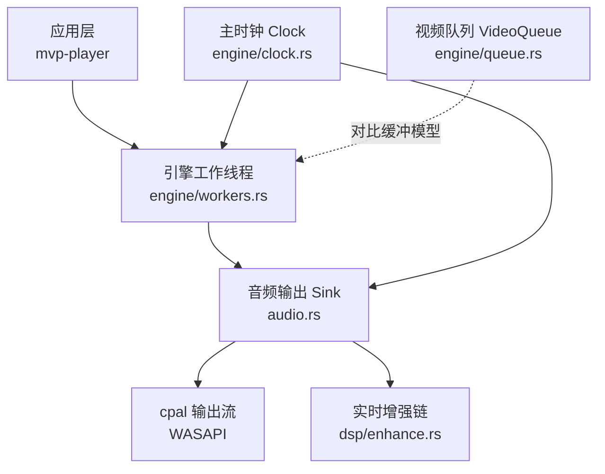
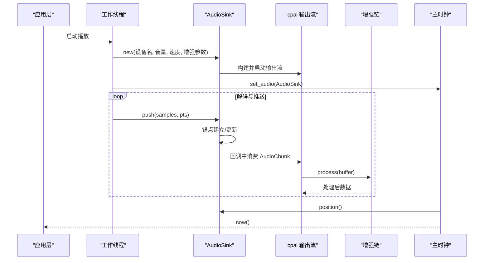
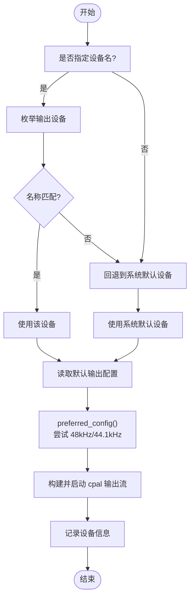
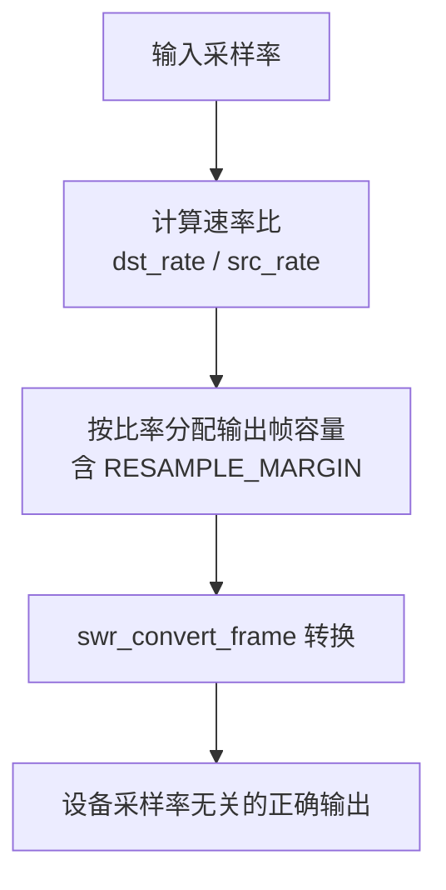
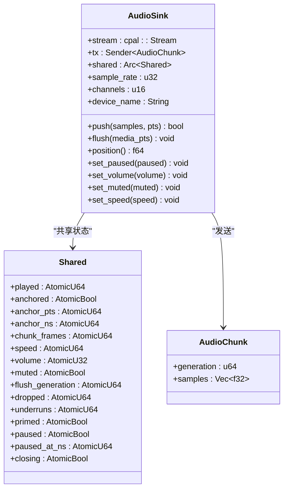
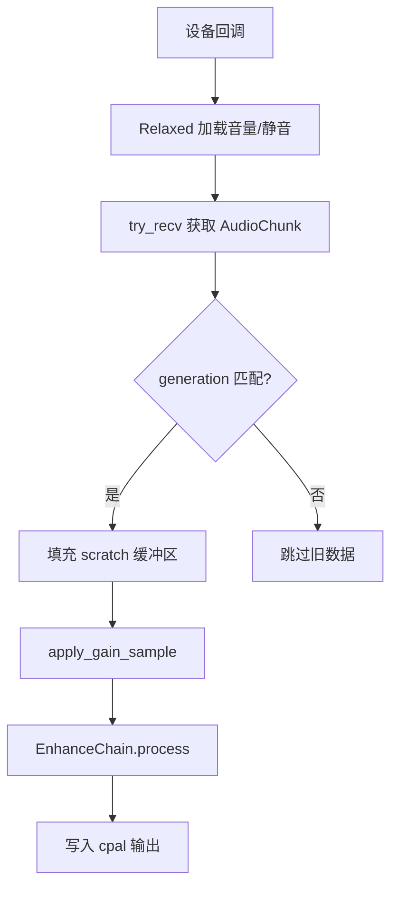
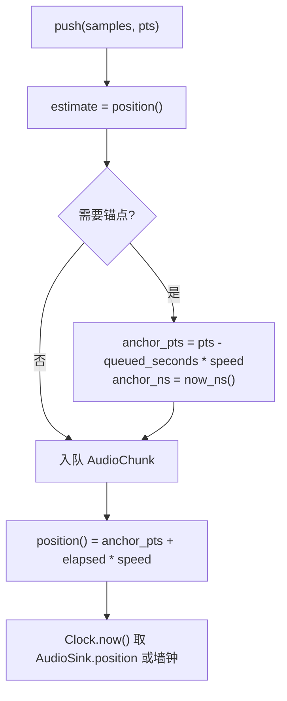
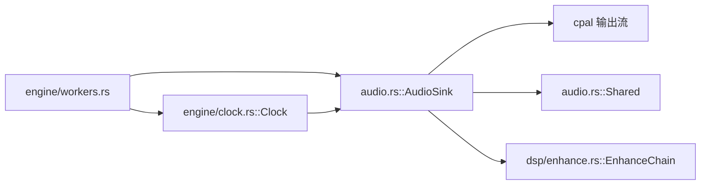

# 音频输出管理

<cite>
**本文引用的文件**   
- [audio.rs](file://crates/mvp-core/src/audio.rs)
- [clock.rs](file://crates/mvp-core/src/engine/clock.rs)
- [workers.rs](file://crates/mvp-core/src/engine/workers.rs)
- [queue.rs](file://crates/mvp-core/src/engine/queue.rs)
- [enhance.rs](file://crates/mvp-core/src/dsp/enhance.rs)
- [player_loop.rs](file://crates/mvp-core/tests/player_loop.rs)
</cite>

## 目录
1. [简介](#简介)
2. [项目结构](#项目结构)
3. [核心组件](#核心组件)
4. [架构总览](#架构总览)
5. [详细组件分析](#详细组件分析)
6. [依赖关系分析](#依赖关系分析)
7. [性能与延迟优化](#性能与延迟优化)
8. [故障诊断指南](#故障诊断指南)
9. [结论](#结论)

## 简介
本技术文档聚焦于项目的音频输出子系统，围绕以下目标展开：
- 设备选择机制：默认设备检测、设备枚举、设备配置优化。
- 采样率转换策略：48kHz/44.1kHz 偏好设置、设备兼容性检查、格式转换流程。
- 缓冲区管理：无锁队列设计、AudioChunk 结构、背压处理。
- 实时线程安全：原子操作使用、内存屏障、避免阻塞。
- 时钟同步机制：锚点建立、时间戳映射、位置计算。
- 实践示例：设备初始化、配置选择、数据推送的代码路径说明。
- 延迟优化建议与常见问题诊断方法。

该子系统通过 cpal（Windows 上为 WASAPI）打开一次音频设备，并在整个播放器生命周期内复用；所有解码数据在引擎层统一重采样到设备布局，从而避免切换媒体时重新打开设备带来的启动延迟和可听“咔嗒”声。设备回调运行在实时线程上，仅通过有界 crossbeam 通道与原子变量通信，保证不阻塞、不分配、不等待。

## 项目结构
与音频输出直接相关的代码主要分布在以下模块：
- 音频输出与设备管理：`crates/mvp-core/src/audio.rs`
- 主时钟与音视频同步：`crates/mvp-core/src/engine/clock.rs`
- 工作线程与解码管线集成：`crates/mvp-core/src/engine/workers.rs`
- 视频帧队列与消息类型（用于对比缓冲模型）：`crates/mvp-core/src/engine/queue.rs`
- 实时音频增强链与参数发布：`crates/mvp-core/src/dsp/enhance.rs`
- 播放循环测试（验证重采样与设备队列健康）：`crates/mvp-core/tests/player_loop.rs`

**图示来源**
- [audio.rs:153-318](file://crates/mvp-core/src/audio.rs#L153-L318)
- [clock.rs:43-158](file://crates/mvp-core/src/engine/clock.rs#L43-L158)
- [workers.rs:366-387](file://crates/mvp-core/src/engine/workers.rs#L366-L387)
- [enhance.rs:1-33](file://crates/mvp-core/src/dsp/enhance.rs#L1-L33)
- [queue.rs:67-86](file://crates/mvp-core/src/engine/queue.rs#L67-L86)

**章节来源**
- [audio.rs:1-26](file://crates/mvp-core/src/audio.rs#L1-L26)
- [clock.rs:1-15](file://crates/mvp-core/src/engine/clock.rs#L1-L15)
- [workers.rs:366-387](file://crates/mvp-core/src/engine/workers.rs#L366-L387)

## 核心组件
- AudioSink：封装 cpal 输出流、共享状态、采样率与声道数、设备名称，并提供 push/flush/set_paused/set_volume/set_muted/set_speed 等接口。
- Shared：由原子字段组成的共享状态，包含播放计数、锚点、速度、音量、静音、刷新代数、丢包计数、欠载计数、就绪标志、暂停状态等。
- AudioChunk：带刷新代数的音频块，用于在 seek 后丢弃旧数据并保留新数据。
- Clock：主时钟，维护墙钟锚点与速度，并在音频可用时将音频位置作为参考源。
- EnhanceParams/EnhanceChain：实时音频增强参数与处理链，运行在设备回调线程，零分配、零锁。
- workers：将 AudioSink 接入解码管线，负责设备创建、错误回调、初始音量/静音注入、时钟绑定。

**章节来源**
- [audio.rs:66-116](file://crates/mvp-core/src/audio.rs#L66-L116)
- [audio.rs:153-170](file://crates/mvp-core/src/audio.rs#L153-L170)
- [audio.rs:519-602](file://crates/mvp-core/src/audio.rs#L519-L602)
- [clock.rs:43-158](file://crates/mvp-core/src/engine/clock.rs#L43-L158)
- [enhance.rs:214-321](file://crates/mvp-core/src/dsp/enhance.rs#L214-L321)
- [workers.rs:366-387](file://crates/mvp-core/src/engine/workers.rs#L366-L387)

## 架构总览
音频输出子系统采用“单设备、单流、实时回调 + 有界通道 + 原子状态”的架构：
- 设备只打开一次，采样率和声道数固定。
- 解码器输出的音频在引擎层被转换为设备布局。
- 设备回调从通道中取出 AudioChunk，填充驱动所需缓冲区，应用增益与增强链，最后写入 cpal 输出。
- 主时钟以墙钟为主，但在音频就绪后以音频位置为参考，保持音视频同步。

**图示来源**
- [workers.rs:366-387](file://crates/mvp-core/src/engine/workers.rs#L366-L387)
- [audio.rs:180-318](file://crates/mvp-core/src/audio.rs#L180-L318)
- [audio.rs:320-461](file://crates/mvp-core/src/audio.rs#L320-L461)
- [clock.rs:65-158](file://crates/mvp-core/src/engine/clock.rs#L65-L158)

## 详细组件分析

### 设备选择机制
- 默认设备检测：优先使用系统默认输出设备；若未指定或匹配失败则回退到默认设备。
- 设备枚举：支持按友好名称精确或模糊匹配，便于用户选择特定设备。
- 设备配置优化：当设备默认采样率为“非常规值”（例如 192 kHz）时，尝试切换到 48kHz 或 44.1kHz，前提是设备原生支持相同声道数与采样格式。

**图示来源**
- [audio.rs:180-215](file://crates/mvp-core/src/audio.rs#L180-L215)
- [audio.rs:714-743](file://crates/mvp-core/src/audio.rs#L714-L743)

**章节来源**
- [audio.rs:180-215](file://crates/mvp-core/src/audio.rs#L180-L215)
- [audio.rs:714-743](file://crates/mvp-core/src/audio.rs#L714-L743)

### 采样率转换策略
- 偏好设置：优先 48kHz，其次 44.1kHz。
- 兼容性检查：仅在设备原生支持相同声道数与采样格式时才切换；否则保留默认配置。
- 格式转换流程：引擎层对解码数据进行重采样，确保输出始终符合设备布局；测试用例表明，当设备默认采样率异常时，若不修正会导致设备欠载与无声。

**图示来源**
- [workers.rs:2032-2056](file://crates/mvp-core/src/engine/workers.rs#L2032-L2056)
- [player_loop.rs:171-188](file://crates/mvp-core/tests/player_loop.rs#L171-L188)

**章节来源**
- [audio.rs:698-743](file://crates/mvp-core/src/audio.rs#L698-L743)
- [workers.rs:2032-2056](file://crates/mvp-core/src/engine/workers.rs#L2032-L2056)
- [player_loop.rs:171-188](file://crates/mvp-core/tests/player_loop.rs#L171-L188)

### 缓冲区管理机制
- 无锁队列设计：AudioSink 内部使用 bounded crossbeam 通道承载 AudioChunk，设备回调通过 try_recv 非阻塞消费。
- AudioChunk 结构：携带刷新代数 generation 与样本数据 samples，用于在 seek 后丢弃旧数据并保留新数据。
- 背压处理：push 使用 send_timeout 短轮询，最多等待 500ms；若关闭中或超时则丢弃并计数 dropped，避免解码器长期阻塞。

**图示来源**
- [audio.rs:66-116](file://crates/mvp-core/src/audio.rs#L66-L116)
- [audio.rs:153-170](file://crates/mvp-core/src/audio.rs#L153-L170)
- [audio.rs:519-602](file://crates/mvp-core/src/audio.rs#L519-L602)

**章节来源**
- [audio.rs:37-44](file://crates/mvp-core/src/audio.rs#L37-L44)
- [audio.rs:66-79](file://crates/mvp-core/src/audio.rs#L66-L79)
- [audio.rs:519-575](file://crates/mvp-core/src/audio.rs#L519-L575)

### 实时线程安全
- 原子操作：Shared 中所有可变状态均使用 Atomic* 类型，配合 Relaxed/Acquire/Release 语义。
- 内存屏障：锚点建立时使用 Acquire/Release 确保可见性；参数读取使用 Relaxed 以降低开销。
- 避免阻塞：设备回调仅进行原子加载、try_recv、数组拷贝与 DSP 处理；不分配、不锁、不日志。

**图示来源**
- [audio.rs:320-461](file://crates/mvp-core/src/audio.rs#L320-L461)
- [enhance.rs:206-321](file://crates/mvp-core/src/dsp/enhance.rs#L206-L321)

**章节来源**
- [audio.rs:139-150](file://crates/mvp-core/src/audio.rs#L139-L150)
- [audio.rs:320-461](file://crates/mvp-core/src/audio.rs#L320-L461)
- [enhance.rs:206-321](file://crates/mvp-core/src/dsp/enhance.rs#L206-L321)

### 时钟同步机制
- 锚点建立：首次 push 或检测到时间戳跳变超过阈值时，根据已排队时长反推即将听到的媒体时间，建立 anchor_pts 与 anchor_ns。
- 时间戳映射：position 基于 anchor_pts + (now - anchor_ns) * speed，暂停时冻结时间。
- 位置计算：主时钟在音频就绪后读取 AudioSink.position，并保持连续；若音频不可用则回退到墙钟。

**图示来源**
- [audio.rs:519-618](file://crates/mvp-core/src/audio.rs#L519-L618)
- [clock.rs:133-158](file://crates/mvp-core/src/engine/clock.rs#L133-L158)

**章节来源**
- [audio.rs:519-618](file://crates/mvp-core/src/audio.rs#L519-L618)
- [clock.rs:133-158](file://crates/mvp-core/src/engine/clock.rs#L133-L158)

### 具体代码示例（路径引用）
- 设备初始化：[AudioSink::new:180-318](file://crates/mvp-core/src/audio.rs#L180-L318)
- 配置选择：[preferred_config:714-743](file://crates/mvp-core/src/audio.rs#L714-L743)
- 数据推送：[AudioSink::push:519-575](file://crates/mvp-core/src/audio.rs#L519-L575)
- 刷新与锚点重置：[AudioSink::flush:591-602](file://crates/mvp-core/src/audio.rs#L591-L602)
- 暂停/恢复：[AudioSink::set_paused:627-659](file://crates/mvp-core/src/audio.rs#L627-L659)
- 音量/静音/速度：[AudioSink::set_volume:671-675](file://crates/mvp-core/src/audio.rs#L671-L675), [set_muted:683-685](file://crates/mvp-core/src/audio.rs#L683-L685), [set_speed:662-668](file://crates/mvp-core/src/audio.rs#L662-L668)
- 工作线程集成：[workers.rs 音频设备创建与时钟绑定:366-387](file://crates/mvp-core/src/engine/workers.rs#L366-L387)

## 依赖关系分析
- AudioSink 依赖 cpal 输出流与 crossbeam 通道，并通过 Arc<Shared> 与设备回调共享状态。
- Clock 依赖 AudioSink 提供音频位置，同时维护自身墙钟锚点。
- workers 将 AudioSink 实例化并注入到引擎共享状态，同时设置初始音量/静音。
- EnhanceParams/EnhanceChain 在设备回调中运行，参数通过原子块发布，避免锁竞争。

**图示来源**
- [workers.rs:366-387](file://crates/mvp-core/src/engine/workers.rs#L366-L387)
- [audio.rs:153-318](file://crates/mvp-core/src/audio.rs#L153-L318)
- [clock.rs:65-158](file://crates/mvp-core/src/engine/clock.rs#L65-L158)
- [enhance.rs:214-321](file://crates/mvp-core/src/dsp/enhance.rs#L214-L321)

**章节来源**
- [workers.rs:366-387](file://crates/mvp-core/src/engine/workers.rs#L366-L387)
- [audio.rs:153-318](file://crates/mvp-core/src/audio.rs#L153-L318)
- [clock.rs:65-158](file://crates/mvp-core/src/engine/clock.rs#L65-L158)
- [enhance.rs:214-321](file://crates/mvp-core/src/dsp/enhance.rs#L214-L321)

## 性能与延迟优化
- 设备只打开一次：避免切换媒体时的设备重置与可听“咔嗒”。
- 采样率偏好：强制 48kHz/44.1kHz，防止驱动以远高于真实时间的速率回调导致队列饥饿。
- 重采样容量计算：按 dst_rate/src_rate 分配输出帧容量并加入余量，避免因截断导致设备欠载。
- 缓冲区大小：QUEUE_CHUNKS=128，约三秒缓冲；seek 通过 flush 立即清空队列并提升代数。
- 实时回调零分配：scratch 缓冲区一次性增长到最大回调尺寸并复用。
- 音量平滑：在一个缓冲周期内线性过渡 applied_gain，避免突变噪声。
- 增强链 bypass：默认关闭，减少不必要处理；参数通过原子块发布，避免锁。

建议：
- 监控 underruns 与 dropped_chunks，若持续上升需增大 QUEUE_CHUNKS 或降低解码负载。
- 避免在设备回调中进行任何可能阻塞的操作（I/O、锁、日志）。
- 合理设置增强链参数，避免过高的 limiter_ceiling_db 或 spatial_room 导致峰值溢出。

**章节来源**
- [audio.rs:37-44](file://crates/mvp-core/src/audio.rs#L37-L44)
- [audio.rs:698-743](file://crates/mvp-core/src/audio.rs#L698-L743)
- [workers.rs:2032-2056](file://crates/mvp-core/src/engine/workers.rs#L2032-L2056)
- [audio.rs:320-461](file://crates/mvp-core/src/audio.rs#L320-L461)
- [enhance.rs:214-321](file://crates/mvp-core/src/dsp/enhance.rs#L214-L321)

## 故障诊断指南
常见问题与定位方法：
- 无声或声音极小：
  - 检查设备默认采样率是否为异常高值（如 192 kHz），确认 preferred_config 是否成功切换至 48kHz/44.1kHz。
  - 查看 underruns 是否频繁增加，必要时调整 QUEUE_CHUNKS 或降低解码负载。
- 播放卡顿或延迟大：
  - 检查 push 是否因通道满而长时间阻塞，关注 dropped_chunks 计数。
  - 确认增强链未开启或参数合理，避免不必要的处理开销。
- 时钟漂移或音画不同步：
  - 检查锚点是否正确建立，确认 DISCONTINUITY_THRESHOLD 是否合理。
  - 观察 Clock.is_audio_driven 是否为真，若音频不可用则回退到墙钟。
- 设备错误：
  - 监听 cpal StreamError 回调，记录 dropped 计数并提示 UI。

参考测试：
- 播放循环测试验证设备队列健康与欠载次数上限，可作为回归基准。

**章节来源**
- [audio.rs:225-231](file://crates/mvp-core/src/audio.rs#L225-L231)
- [audio.rs:745-749](file://crates/mvp-core/src/audio.rs#L745-L749)
- [player_loop.rs:171-188](file://crates/mvp-core/tests/player_loop.rs#L171-L188)

## 结论
该音频输出子系统通过“单设备、单流、实时回调 + 有界通道 + 原子状态”的设计，实现了低延迟、稳定且可调试的音频播放能力。设备选择与采样率偏好确保了时钟稳定性；AudioChunk 与刷新代数机制保证了 seek 的准确性；主时钟与音频位置的结合提供了可靠的音视频同步。通过合理的缓冲区管理与实时线程安全策略，系统在复杂硬件环境下仍能保持良好表现。未来可进一步扩展设备枚举与配置界面，提供更细粒度的延迟与质量调优选项。