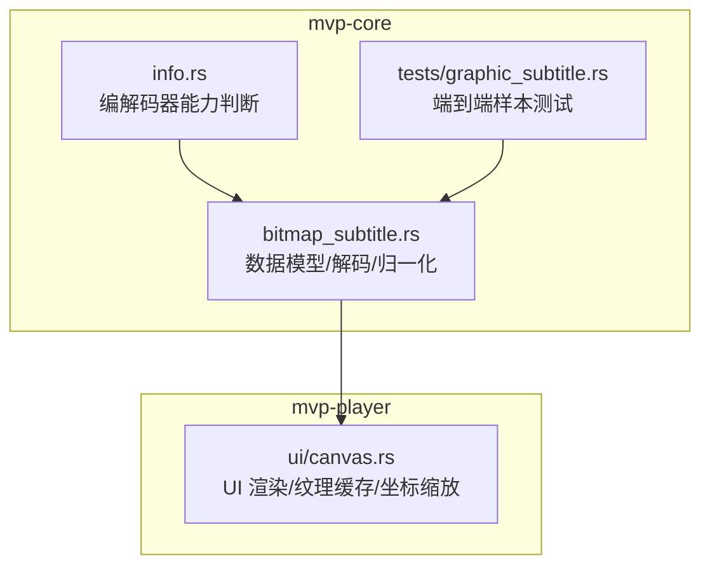
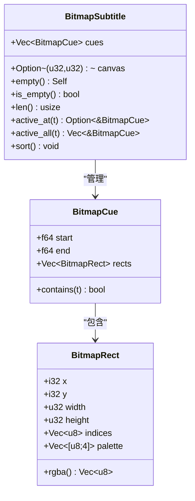
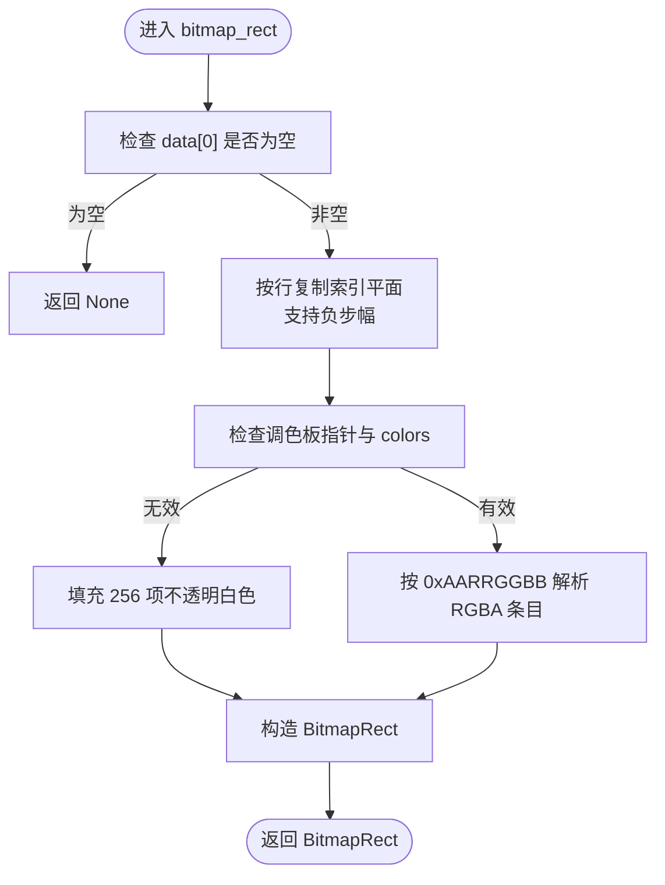
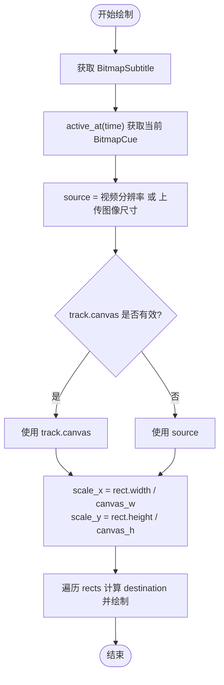
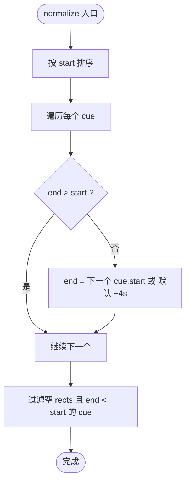
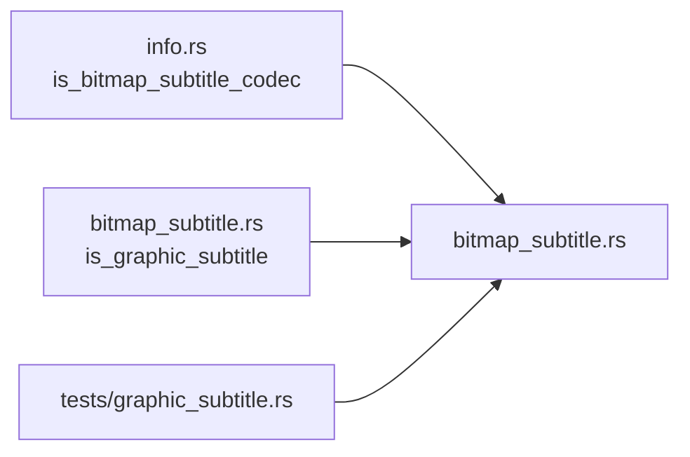

# 图形字幕渲染

<cite>
**本文引用的文件**   
- [bitmap_subtitle.rs](file://crates/mvp-core/src/bitmap_subtitle.rs)
- [canvas.rs](file://crates/mvp-player/src/ui/canvas.rs)
- [info.rs](file://crates/mvp-core/src/info.rs)
- [graphic_subtitle.rs](file://crates/mvp-core/tests/graphic_subtitle.rs)
</cite>

## 目录
1. [引言](#引言)
2. [项目结构](#项目结构)
3. [核心组件](#核心组件)
4. [架构总览](#架构总览)
5. [详细组件分析](#详细组件分析)
6. [依赖关系分析](#依赖关系分析)
7. [性能与优化](#性能与优化)
8. [故障排查](#故障排查)
9. [结论](#结论)

## 引言
本技术文档聚焦于位图字幕的解码、调色板处理、坐标系统、清屏语义以及渲染优化，覆盖 PGS、VobSub、DVB 等常见位图字幕格式。该实现将 FFmpeg 解码出的调色板索引平面与调色板保留为紧凑存储，仅在需要显示时展开为 RGBA，并通过 UI 层纹理缓存与缩放适配，确保在不同分辨率下正确显示与高效渲染。

## 项目结构
围绕图形字幕的关键代码分布在两个 crate：
- mvp-core：负责位图字幕的数据模型、FFmpeg 解码、时间归一化、外部文件解码与内存限制。
- mvp-player：负责在 UI 中查找当前活跃字幕、将调色板索引展开为 RGBA、构建 GPU 纹理并按视频区域进行缩放绘制。



图表来源
- [bitmap_subtitle.rs:1-23](file://crates/mvp-core/src/bitmap_subtitle.rs#L1-L23)
- [info.rs:512-523](file://crates/mvp-core/src/info.rs#L512-L523)
- [canvas.rs:458-530](file://crates/mvp-player/src/ui/canvas.rs#L458-L530)
- [graphic_subtitle.rs:1-15](file://crates/mvp-core/tests/graphic_subtitle.rs#L1-L15)

章节来源
- [bitmap_subtitle.rs:1-23](file://crates/mvp-core/src/bitmap_subtitle.rs#L1-L23)
- [canvas.rs:458-530](file://crates/mvp-player/src/ui/canvas.rs#L458-L530)

## 核心组件
- BitmapRect：表示一个位图矩形，包含左上角坐标、宽高、调色板索引平面（行主序）和 RGBA 调色板。提供将索引平面展开为未预乘 RGBA 的方法。
- BitmapCue：表示一个半开区间[start, end)的字幕片段，包含多个 BitmapRect。
- BitmapSubtitle：表示完整的位图字幕轨道，维护按 start 排序的 cues 列表，并记录源坐标系（PGS 通常不声明，VobSub 携带 DVD 帧尺寸）。
- 解码与归一化：decode_packet、cue_from_subtitle、bitmap_rect、normalize、prune、byte_size、is_graphic_subtitle、decode_external。
- UI 渲染：draw_bitmap_subtitles，负责根据视频区域计算缩放比例、构建纹理并绘制。

章节来源
- [bitmap_subtitle.rs:30-90](file://crates/mvp-core/src/bitmap_subtitle.rs#L30-L90)
- [bitmap_subtitle.rs:137-172](file://crates/mvp-core/src/bitmap_subtitle.rs#L137-L172)
- [bitmap_subtitle.rs:230-355](file://crates/mvp-core/src/bitmap_subtitle.rs#L230-L355)
- [bitmap_subtitle.rs:373-453](file://crates/mvp-core/src/bitmap_subtitle.rs#L373-L453)
- [canvas.rs:458-530](file://crates/mvp-player/src/ui/canvas.rs#L458-L530)

## 架构总览
下图展示从外部文件或流中解码位图字幕到 UI 渲染的整体流程。


图表来源
- [bitmap_subtitle.rs:230-355](file://crates/mvp-core/src/bitmap_subtitle.rs#L230-L355)
- [bitmap_subtitle.rs:396-453](file://crates/mvp-core/src/bitmap_subtitle.rs#L396-L453)
- [canvas.rs:458-530](file://crates/mvp-player/src/ui/canvas.rs#L458-L530)

## 详细组件分析

### 数据模型与时间语义
- BitmapRect 使用 8 位调色板索引平面存储像素，配合 RGBA 调色板，避免全片保存 RGBA 带来的内存膨胀。
- BitmapCue 采用半开区间[start, end)，active_at 选择最晚开始的活跃片段以符合“后声明优先”的用户预期。
- BitmapSubtitle 维护 cues 有序，并提供 active_all 获取所有活跃片段。



图表来源
- [bitmap_subtitle.rs:30-90](file://crates/mvp-core/src/bitmap_subtitle.rs#L30-L90)
- [bitmap_subtitle.rs:108-135](file://crates/mvp-core/src/bitmap_subtitle.rs#L108-L135)

章节来源
- [bitmap_subtitle.rs:30-90](file://crates/mvp-core/src/bitmap_subtitle.rs#L30-L90)
- [bitmap_subtitle.rs:108-135](file://crates/mvp-core/src/bitmap_subtitle.rs#L108-L135)

### 调色板处理机制
- 颜色索引映射：每个像素是 8 位索引，对应 palette 中的 RGBA 条目；当无有效调色板或颜色数为 0 时，回退为不透明白色掩码以保证可见性。
- 透明度处理：palette 条目为 RGBA，alpha 通道直接参与最终 RGBA 输出；UI 层使用未预乘 RGBA 构建 ColorImage。
- 色彩空间转换：AVPALETTE 布局为 native-endian 的 0xAARRGGBB，代码按字节顺序提取 R/G/B/A 值；后续由 UI 层交给渲染管线。



图表来源
- [bitmap_subtitle.rs:278-346](file://crates/mvp-core/src/bitmap_subtitle.rs#L278-L346)

章节来源
- [bitmap_subtitle.rs:278-346](file://crates/mvp-core/src/bitmap_subtitle.rs#L278-L346)

### 坐标系统与缩放适配
- 坐标系来源：PGS 坐标直接使用视频像素；VobSub 携带 DVD 帧尺寸作为 canvas；若未声明则回退到视频分辨率。
- 缩放计算：根据视频实际显示区域 rect 与 source 分辨率计算 scale_x/scale_y，将 BitmapRect 的 x/y/width/height 映射到屏幕坐标。
- 边界检测：若 canvas_w 或 canvas_h 非正数则跳过绘制，避免异常缩放。



图表来源
- [canvas.rs:458-530](file://crates/mvp-player/src/ui/canvas.rs#L458-L530)
- [bitmap_subtitle.rs:81-90](file://crates/mvp-core/src/bitmap_subtitle.rs#L81-L90)

章节来源
- [canvas.rs:458-530](file://crates/mvp-player/src/ui/canvas.rs#L458-L530)
- [bitmap_subtitle.rs:81-90](file://crates/mvp-core/src/bitmap_subtitle.rs#L81-L90)

### 清屏语义与时间归一化
- 清屏语义：当 AVSubtitle 不包含任何矩形时，仍保留为一个空 cue，用于关闭之前显示的字幕（例如 PGS “clear”）。
- 时间归一化：PGS/DVB 常报告 end_display_time=0，normalize 将此类 cue 的 end 设为下一个 cue 的 start；末尾 cue 若无时长则赋予默认时长，避免整段不可见。
- 修剪策略：prune 移除已结束且不再显示的 cue，控制内存占用。



图表来源
- [bitmap_subtitle.rs:137-157](file://crates/mvp-core/src/bitmap_subtitle.rs#L137-L157)

章节来源
- [bitmap_subtitle.rs:137-157](file://crates/mvp-core/src/bitmap_subtitle.rs#L137-L157)

### 位图数据的解码、缓存与渲染优化
- 解码路径：decode_packet 调用 FFmpeg 解码器，cue_from_subtitle 将 AVSubtitle 转为 BitmapCue，bitmap_rect 拷贝索引平面并解析调色板。
- 外部文件解码：decode_external 打开 .sup/.idx 或 .sub（通过内容嗅探），逐包解码并累计字节数，超过 EXTERNAL_BITMAP_LIMIT 则拒绝。
- 渲染缓存：UI 层对每个 BitmapRect 生成 ColorImage 并加载为 egui 纹理；仅当 active cue 变化时重建纹理，减少重复开销。
- 展开时机：仅在需要显示时调用 BitmapRect::rgba()，避免常驻内存中的 RGBA 膨胀。

```mermaid
sequenceDiagram
participant File as "外部文件"
participant Core as "decode_external"
participant Dec as "decode_packet"
participant Rect as "bitmap_rect"
participant UI as "draw_bitmap_subtitles"
File->>Core : 打开输入/选择流
Core->>Dec : 逐包解码
Dec->>Rect : 复制索引平面+解析调色板
Rect-->>Dec : BitmapRect
Dec-->>Core : BitmapCue
Core-->>UI : BitmapSubtitle
UI->>UI : 按需 rgba() 展开为 RGBA
UI->>UI : 纹理缓存与绘制
```

图表来源
- [bitmap_subtitle.rs:396-453](file://crates/mvp-core/src/bitmap_subtitle.rs#L396-L453)
- [bitmap_subtitle.rs:230-355](file://crates/mvp-core/src/bitmap_subtitle.rs#L230-L355)
- [canvas.rs:458-530](file://crates/mvp-player/src/ui/canvas.rs#L458-L530)

章节来源
- [bitmap_subtitle.rs:396-453](file://crates/mvp-core/src/bitmap_subtitle.rs#L396-L453)
- [canvas.rs:458-530](file://crates/mvp-player/src/ui/canvas.rs#L458-L530)

### 不同分辨率下的自适应渲染
- 源坐标系：PGS 使用视频像素坐标；VobSub 使用 DVD 帧尺寸；若缺失则回退到视频分辨率。
- 显示区域：根据 AspectMode 计算 picture 的实际显示矩形，再据此计算字幕缩放比例。
- 绘制：对每个 BitmapRect 计算 destination 矩形并使用 full UV 绘制纹理，保证位置与大小正确。

章节来源
- [canvas.rs:458-530](file://crates/mvp-player/src/ui/canvas.rs#L458-L530)
- [bitmap_subtitle.rs:81-90](file://crates/mvp-core/src/bitmap_subtitle.rs#L81-L90)

## 依赖关系分析
- 编解码器能力判断：is_bitmap_subtitle_codec 基于 FFmpeg 描述符表判断是否可解码为位图（PGS/VobSub/DVB/XSUB），无需 OCR。
- 外部文件识别：is_graphic_subtitle 通过扩展名与头部嗅探区分文本 MicroDVD 与二进制 VobSub/DVB。
- 测试保障：graphic_subtitle.rs 使用环境变量指定真实 PGS/VobSub 样本，验证解码、时间区间、索引平面尺寸与 RGBA 展开的正确性。



图表来源
- [info.rs:512-523](file://crates/mvp-core/src/info.rs#L512-L523)
- [bitmap_subtitle.rs:174-212](file://crates/mvp-core/src/bitmap_subtitle.rs#L174-L212)
- [graphic_subtitle.rs:1-78](file://crates/mvp-core/tests/graphic_subtitle.rs#L1-L78)

章节来源
- [info.rs:512-523](file://crates/mvp-core/src/info.rs#L512-L523)
- [bitmap_subtitle.rs:174-212](file://crates/mvp-core/src/bitmap_subtitle.rs#L174-L212)
- [graphic_subtitle.rs:1-78](file://crates/mvp-core/tests/graphic_subtitle.rs#L1-L78)

## 性能与优化
- 内存压缩：保持 8 位索引平面而非常驻 RGBA，显著降低长片字幕轨道的内存占用。
- 按需展开：仅在 UI 渲染阶段调用 rgba() 展开，避免不必要的 CPU 与内存压力。
- 纹理缓存：UI 层对每个 BitmapRect 创建 GPU 纹理并缓存，仅当 active cue 变化时重建，减少重复分配与上传开销。
- 内存上限：外部文件解码累计 byte_size，超过 EXTERNAL_BITMAP_LIMIT 即拒绝，防止恶意或畸形文件耗尽内存。
- 时间修剪：prune 移除已结束的 cue，限制轨道长度与内存增长。

章节来源
- [bitmap_subtitle.rs:10-22](file://crates/mvp-core/src/bitmap_subtitle.rs#L10-L22)
- [bitmap_subtitle.rs:159-172](file://crates/mvp-core/src/bitmap_subtitle.rs#L159-L172)
- [bitmap_subtitle.rs:373-453](file://crates/mvp-core/src/bitmap_subtitle.rs#L373-L453)
- [canvas.rs:458-530](file://crates/mvp-player/src/ui/canvas.rs#L458-L530)

## 故障排查
- 无法打开图形字幕文件：decode_external 在打开输入失败时返回错误信息，检查文件路径与权限。
- 没有字幕流：当输入文件中找不到 subtitle 类型流时报错，确认文件格式与封装是否正确。
- 解码器不可用：当系统中缺少对应图形字幕解码器时报错，检查 FFmpeg 构建是否包含相应解码器。
- 超出内存限制：当外部文件解码后的索引字节总数超过 EXTERNAL_BITMAP_LIMIT 时报错，考虑裁剪或更换更小的字幕文件。
- 坐标无效导致不显示：若 canvas_w 或 canvas_h 非正数，UI 层会跳过绘制，检查 track.canvas 与视频分辨率是否正确。

章节来源
- [bitmap_subtitle.rs:396-453](file://crates/mvp-core/src/bitmap_subtitle.rs#L396-L453)
- [canvas.rs:458-530](file://crates/mvp-player/src/ui/canvas.rs#L458-L530)

## 结论
本项目对 PGS/VobSub/DVB 等位图字幕提供了完整的技术栈：从 FFmpeg 解码、调色板解析、时间归一化与清屏语义，到 UI 层的 RGBA 展开、纹理缓存与坐标缩放。通过紧凑的索引平面存储与按需展开策略，在保证视觉质量的同时有效控制内存与性能开销；同时通过严格的边界检测与内存上限保护，提升了鲁棒性与安全性。对于不同分辨率与显示模式，系统通过源坐标系与显示区域的缩放适配，确保字幕始终正确定位与清晰呈现。