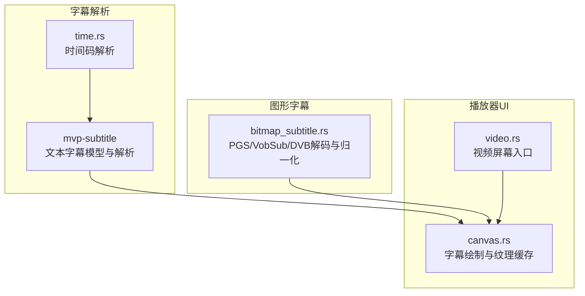
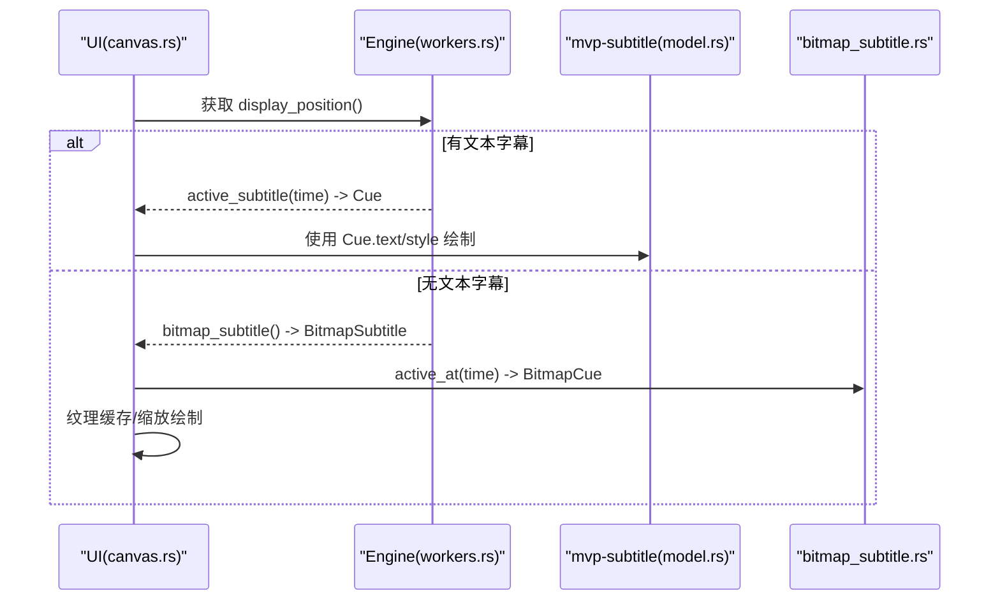
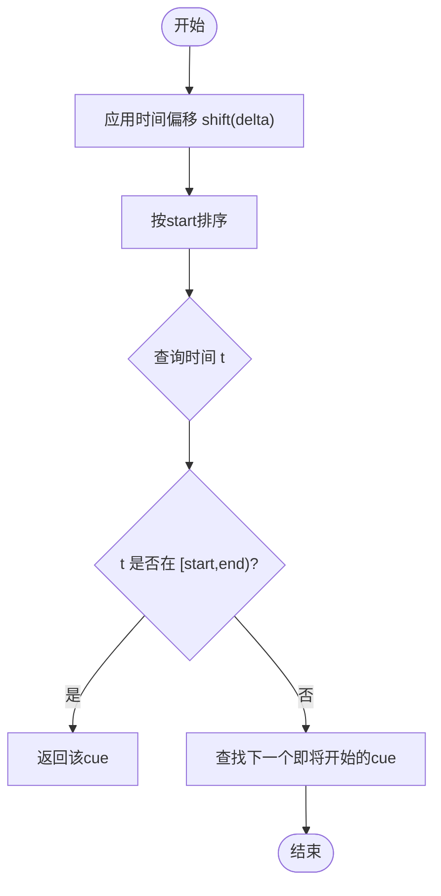
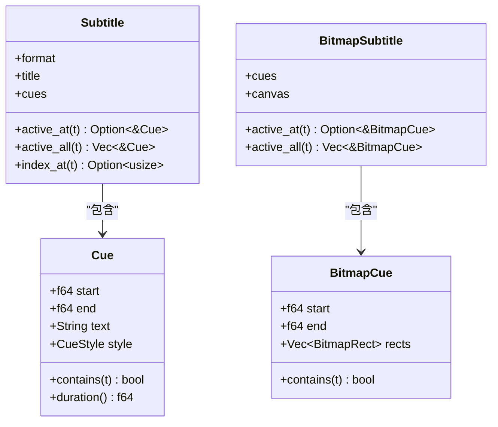
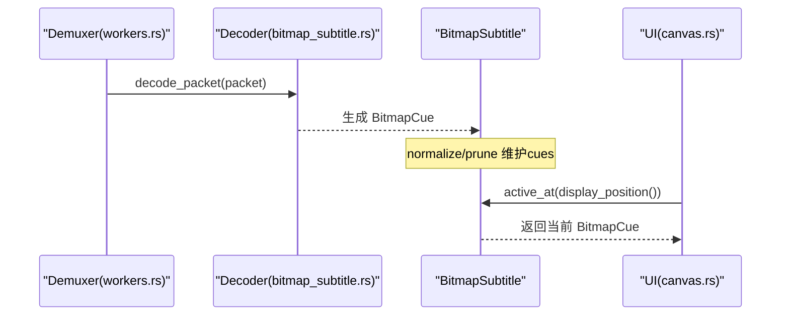
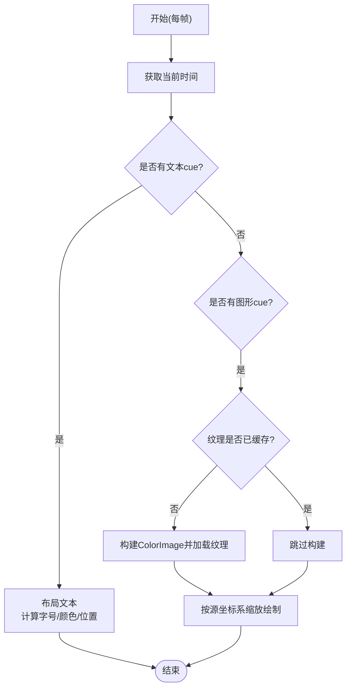
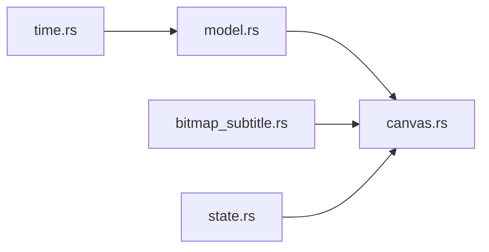

# 字幕同步与显示

<cite>
**本文引用的文件**
- [crates/mvp-subtitle/src/lib.rs](file://crates/mvp-subtitle/src/lib.rs)
- [crates/mvp-subtitle/src/model.rs](file://crates/mvp-subtitle/src/model.rs)
- [crates/mvp-subtitle/src/time.rs](file://crates/mvp-subtitle/src/time.rs)
- [crates/mvp-core/src/bitmap_subtitle.rs](file://crates/mvp-core/src/bitmap_subtitle.rs)
- [crates/mvp-player/src/ui/canvas.rs](file://crates/mvp-player/src/ui/canvas.rs)
- [crates/mvp-player/src/ui/screens/video.rs](file://crates/mvp-player/src/ui/screens/video.rs)
- [crates/mvp-player/src/state.rs](file://crates/mvp-player/src/state.rs)
- [crates/mvp-core/src/engine/workers.rs](file://crates/mvp-core/src/engine/workers.rs)
</cite>

## 目录
1. [简介](#简介)
2. [项目结构](#项目结构)
3. [核心组件](#核心组件)
4. [架构总览](#架构总览)
5. [详细组件分析](#详细组件分析)
6. [依赖关系分析](#依赖关系分析)
7. [性能考量](#性能考量)
8. [故障排查指南](#故障排查指南)
9. [结论](#结论)

## 简介
本文件面向“字幕同步与显示”的完整实现，覆盖时间轴处理（偏移、循环、精确同步）、激活状态判断（半开区间、多字幕优先级）、与播放器集成（实时查询、预加载、内存管理）、样式应用与渲染流程（字体、颜色、对齐），以及性能优化与调试方法。内容基于仓库中的字幕解析库、图形字幕解码模块与UI渲染层进行系统化梳理。

## 项目结构
本项目将字幕能力拆分为纯逻辑的字幕解析库与图形字幕解码模块，并在UI层完成最终绘制：
- mvp-subtitle：文本字幕解析与通用模型（SRT/ASS/VTT/MicroDVD），提供时间码解析、Cue模型、格式检测等。
- mvp-core/bitmap_subtitle：图形字幕（PGS/VobSub/DVB）解码、时间归一化、裁剪与内存限制。
- mvp-player/UI：视频画布中按当前播放时间查询并绘制文本或图形字幕，负责纹理缓存与坐标缩放。

图表来源
- [crates/mvp-subtitle/src/lib.rs:1-60](file://crates/mvp-subtitle/src/lib.rs#L1-L60)
- [crates/mvp-subtitle/src/time.rs:1-51](file://crates/mvp-subtitle/src/time.rs#L1-L51)
- [crates/mvp-core/src/bitmap_subtitle.rs:1-165](file://crates/mvp-core/src/bitmap_subtitle.rs#L1-L165)
- [crates/mvp-player/src/ui/canvas.rs:401-530](file://crates/mvp-player/src/ui/canvas.rs#L401-L530)
- [crates/mvp-player/src/ui/screens/video.rs:16-24](file://crates/mvp-player/src/ui/screens/video.rs#L16-L24)

章节来源
- [crates/mvp-subtitle/src/lib.rs:1-60](file://crates/mvp-subtitle/src/lib.rs#L1-L60)
- [crates/mvp-player/src/ui/screens/video.rs:16-24](file://crates/mvp-player/src/ui/screens/video.rs#L16-L24)

## 核心组件
- 文本字幕模型与API
  - Cue/CueStyle/Align：表示一个时间区间内的纯文本及展示属性（粗体、斜体、下划线、删除线、颜色、对齐、垂直边距）。
  - Subtitle：封装格式、标题、编码信息，并提供 active_at/active_all/index_at/shift/merge_adjacent 等查询与预处理能力。
  - time.rs：统一解析多种时间码格式为秒级浮点。
- 图形字幕模型与解码
  - BitmapRect/BitmapCue/BitmapSubtitle：以调色板索引平面存储位图矩形，支持RGBA展开、半开区间匹配、归一化结束时间、裁剪与大小上限。
  - normalize/prune：补全无持续时间的cue结束时间，移除空cue；按floor裁剪历史cues控制内存。
- UI渲染
  - draw_subtitles：根据当前显示时间先尝试文本字幕，再回退到图形字幕。
  - draw_text_subtitle：计算字号、颜色、描边背景、位置（底部居中）。
  - draw_bitmap_subtitles：将位图rect从源坐标系缩放到画面矩形，使用纹理缓存避免重复构建。

章节来源
- [crates/mvp-subtitle/src/model.rs:26-105](file://crates/mvp-subtitle/src/model.rs#L26-L105)
- [crates/mvp-subtitle/src/model.rs:121-295](file://crates/mvp-subtitle/src/model.rs#L121-L295)
- [crates/mvp-subtitle/src/time.rs:8-51](file://crates/mvp-subtitle/src/time.rs#L8-L51)
- [crates/mvp-core/src/bitmap_subtitle.rs:30-165](file://crates/mvp-core/src/bitmap_subtitle.rs#L30-L165)
- [crates/mvp-player/src/ui/canvas.rs:401-530](file://crates/mvp-player/src/ui/canvas.rs#L401-L530)

## 架构总览
字幕在播放过程中的数据流如下：
- 引擎侧：demuxer/decoder 读取字幕包，文本字幕进入 mvp-subtitle 模型；图形字幕通过 FFmpeg 解码为 BitmapCue，并进行 normalize/prune。
- UI侧：每帧获取 display_position，调用 active_at/active_all 查询当前激活的cue；文本直接绘制，图形则转换为纹理并按比例绘制。

图表来源
- [crates/mvp-player/src/ui/canvas.rs:401-530](file://crates/mvp-player/src/ui/canvas.rs#L401-L530)
- [crates/mvp-core/src/engine/workers.rs:419-444](file://crates/mvp-core/src/engine/workers.rs#L419-L444)
- [crates/mvp-subtitle/src/model.rs:180-213](file://crates/mvp-subtitle/src/model.rs#L180-L213)
- [crates/mvp-core/src/bitmap_subtitle.rs:108-135](file://crates/mvp-core/src/bitmap_subtitle.rs#L108-L135)

## 详细组件分析

### 时间轴处理机制
- 时间偏移
  - 文本字幕支持 shift(delta)，对每个cue的start/end整体平移并重新排序，允许负时间（不会主动截断到0），便于用户微调同步。
  - 图形字幕通过 decode_external 时计算 start_offset，使外部字幕时间与媒体时间对齐。
- 循环播放
  - 字幕本身不实现循环逻辑；循环由上层播放器的循环模式驱动。字幕仅依据当前 display_position 返回激活cue。
- 精确同步
  - 所有时间比较采用半开区间 [start, end)，边界处不重叠，避免相邻cue同时激活。
  - 时间码解析兼容多种格式（逗号/点小数、缺小时字段、多位小时），统一转为秒级浮点。

图表来源
- [crates/mvp-subtitle/src/model.rs:225-239](file://crates/mvp-subtitle/src/model.rs#L225-L239)
- [crates/mvp-subtitle/src/model.rs:297-300](file://crates/mvp-subtitle/src/model.rs#L297-L300)
- [crates/mvp-subtitle/src/time.rs:8-51](file://crates/mvp-subtitle/src/time.rs#L8-L51)

章节来源
- [crates/mvp-subtitle/src/model.rs:225-239](file://crates/mvp-subtitle/src/model.rs#L225-L239)
- [crates/mvp-subtitle/src/time.rs:8-51](file://crates/mvp-subtitle/src/time.rs#L8-L51)
- [crates/mvp-core/src/bitmap_subtitle.rs:230-276](file://crates/mvp-core/src/bitmap_subtitle.rs#L230-L276)

### 激活状态判断与多字幕优先级
- 半开区间匹配
  - Cue.contains(t) 与 BitmapCue.contains(t) 均实现 [start, end) 语义，确保边界不重复激活。
- 多个同时显示的优先级
  - 文本与图形字幕都采用“最晚开始的cue优先”策略：当多个cue在同一时间有效时，选择start最大的那个，符合观众预期。
  - active_all 可用于需要多层叠加的场景（如歌词或多行字幕），但默认 active_at 只返回最佳cue。

图表来源
- [crates/mvp-subtitle/src/model.rs:73-105](file://crates/mvp-subtitle/src/model.rs#L73-L105)
- [crates/mvp-subtitle/src/model.rs:180-213](file://crates/mvp-subtitle/src/model.rs#L180-L213)
- [crates/mvp-core/src/bitmap_subtitle.rs:63-135](file://crates/mvp-core/src/bitmap_subtitle.rs#L63-L135)

章节来源
- [crates/mvp-subtitle/src/model.rs:180-213](file://crates/mvp-subtitle/src/model.rs#L180-L213)
- [crates/mvp-core/src/bitmap_subtitle.rs:108-135](file://crates/mvp-core/src/bitmap_subtitle.rs#L108-L135)

### 与视频播放器的集成方式
- 实时查询
  - UI每帧调用 engine.display_position() 获取当前显示时间，再调用 active_subtitle 或 bitmap_subtitle().active_at 获取当前cue。
- 预加载策略
  - 图形字幕在demuxer阶段即被解码并累积为 cues 列表；normalize 会关闭缺失end的cue，prune 会丢弃已过期的cue，从而保持内存可控。
- 内存管理
  - 外部图形字幕解码时累计字节数，超过阈值（约512MB）拒绝继续解码，防止恶意或损坏文件耗尽内存。
  - 文本字幕合并相邻相同文本（merge_adjacent）可减少cue数量，降低查询与渲染开销。

图表来源
- [crates/mvp-core/src/engine/workers.rs:419-444](file://crates/mvp-core/src/engine/workers.rs#L419-L444)
- [crates/mvp-core/src/bitmap_subtitle.rs:137-165](file://crates/mvp-core/src/bitmap_subtitle.rs#L137-L165)
- [crates/mvp-core/src/bitmap_subtitle.rs:389-453](file://crates/mvp-core/src/bitmap_subtitle.rs#L389-L453)
- [crates/mvp-player/src/ui/canvas.rs:401-530](file://crates/mvp-player/src/ui/canvas.rs#L401-L530)

章节来源
- [crates/mvp-core/src/engine/workers.rs:419-444](file://crates/mvp-core/src/engine/workers.rs#L419-L444)
- [crates/mvp-core/src/bitmap_subtitle.rs:389-453](file://crates/mvp-core/src/bitmap_subtitle.rs#L389-L453)
- [crates/mvp-player/src/ui/canvas.rs:401-530](file://crates/mvp-player/src/ui/canvas.rs#L401-L530)

### 字幕样式的应用与渲染流程
- 文本字幕
  - 字体：使用 egui 的比例字体，字号来自设置项。
  - 颜色：从设置项读取RGB值，绘制时使用 Color32。
  - 对齐：默认底部居中；可通过 CueStyle.align 表达不同锚点（底层模型支持九宫格对齐）。
  - 描边：可选软底版提升可读性。
- 图形字幕
  - 坐标空间：PGS坐标已是视频像素；VobSub携带DVD帧尺寸，需按比例缩放至实际画面矩形。
  - 纹理缓存：按 cue.start 与 rects 数量作为key缓存纹理，仅在cue变化时重建，减少GPU上传成本。
  - 绘制：将每个 BitmapRect 转换为 egui::ColorImage 并加载为Texture，按缩放后的目标矩形绘制。

图表来源
- [crates/mvp-player/src/ui/canvas.rs:411-530](file://crates/mvp-player/src/ui/canvas.rs#L411-L530)
- [crates/mvp-subtitle/src/model.rs:50-71](file://crates/mvp-subtitle/src/model.rs#L50-L71)

章节来源
- [crates/mvp-player/src/ui/canvas.rs:411-530](file://crates/mvp-player/src/ui/canvas.rs#L411-L530)
- [crates/mvp-subtitle/src/model.rs:50-71](file://crates/mvp-subtitle/src/model.rs#L50-L71)

## 依赖关系分析
- 文本字幕依赖
  - model.rs 提供统一的 Cue/CueStyle/Align 与 Subtitle API。
  - time.rs 提供跨格式的鲁棒时间码解析。
- 图形字幕依赖
  - bitmap_subtitle.rs 依赖 FFmpeg 解码器，输出 BitmapCue，并通过 normalize/prune 保证可用性与内存安全。
- UI依赖
  - canvas.rs 依赖上述两者，负责每帧查询与绘制；state.rs 维护UI临时状态（包括纹理缓存键与纹理列表）。

图表来源
- [crates/mvp-subtitle/src/model.rs:121-295](file://crates/mvp-subtitle/src/model.rs#L121-L295)
- [crates/mvp-subtitle/src/time.rs:8-51](file://crates/mvp-subtitle/src/time.rs#L8-L51)
- [crates/mvp-core/src/bitmap_subtitle.rs:1-165](file://crates/mvp-core/src/bitmap_subtitle.rs#L1-L165)
- [crates/mvp-player/src/ui/canvas.rs:401-530](file://crates/mvp-player/src/ui/canvas.rs#L401-L530)
- [crates/mvp-player/src/state.rs:497-502](file://crates/mvp-player/src/state.rs#L497-L502)

章节来源
- [crates/mvp-subtitle/src/model.rs:121-295](file://crates/mvp-subtitle/src/model.rs#L121-L295)
- [crates/mvp-core/src/bitmap_subtitle.rs:1-165](file://crates/mvp-core/src/bitmap_subtitle.rs#L1-L165)
- [crates/mvp-player/src/state.rs:497-502](file://crates/mvp-player/src/state.rs#L497-L502)

## 性能考量
- 文本字幕
  - 使用 merge_adjacent 合并相邻相同文本，减少cue数量，降低查询与布局成本。
  - 合理设置 subtitle_size 与 subtitle_margin，避免过大文本导致重排与绘制压力。
- 图形字幕
  - 使用 normalize 关闭缺失end的cue，避免长时间无效占用。
  - 使用 prune 在seek后及时丢弃过期cues，控制内存增长。
  - 外部图形字幕解码限制最大字节数，防止异常文件导致OOM。
  - 纹理缓存以 cue.start 与 rects 数量为key，仅在cue变化时重建，减少GPU上传。
- 渲染路径
  - 文本字幕优先，若无则回退到图形字幕，减少不必要的位图转换。
  - 使用 egui 的 galley 与 texture 机制，尽量复用资源。

[本节为通用性能建议，不直接分析具体代码文件]

## 故障排查指南
- 字幕不显示
  - 检查字幕是否启用（settings.subtitles_enabled）。
  - 确认当前时间是否处于任何cue的 [start, end) 范围内。
  - 对于图形字幕，确认 track.canvas 或视频源尺寸有效，否则无法正确缩放。
- 同步偏差
  - 使用 Subtitle::shift 调整偏移；注意负偏移会使cue提前，但仍需到达其范围才会激活。
  - 检查外部图形字幕的 start_offset 计算是否正确。
- 内存过高
  - 检查是否存在大量未清理的图形cues；确认 normalize/prune 正常工作。
  - 外部图形字幕解码超过阈值会被拒绝，查看错误日志。
- 多cue冲突
  - 若出现重叠cue显示顺序不符合预期，确认 active_at 的“最晚开始优先”策略是否符合需求；如需多层叠加，改用 active_all。

章节来源
- [crates/mvp-subtitle/src/model.rs:225-239](file://crates/mvp-subtitle/src/model.rs#L225-L239)
- [crates/mvp-core/src/bitmap_subtitle.rs:137-165](file://crates/mvp-core/src/bitmap_subtitle.rs#L137-L165)
- [crates/mvp-core/src/bitmap_subtitle.rs:389-453](file://crates/mvp-core/src/bitmap_subtitle.rs#L389-L453)
- [crates/mvp-player/src/ui/canvas.rs:401-530](file://crates/mvp-player/src/ui/canvas.rs#L401-L530)

## 结论
该实现通过清晰的模型分层与严格的半开区间时间匹配，确保了字幕同步的准确性与一致性；结合图形字幕的归一化与裁剪策略，实现了高性能与低内存占用的平衡。UI层采用文本优先、图形回退的策略，并通过纹理缓存与合理的坐标缩放，保证了流畅的渲染体验。对于复杂场景（如多cue叠加、歌词滚动），可基于 active_all 扩展显示逻辑。整体设计兼顾了易用性、可扩展性与健壮性。