# 字幕系统

<cite>
**本文引用的文件**
- [lib.rs](file://crates/mvp-subtitle/src/lib.rs)
- [model.rs](file://crates/mvp-subtitle/src/model.rs)
- [encoding.rs](file://crates/mvp-subtitle/src/encoding.rs)
- [srt.rs](file://crates/mvp-subtitle/src/srt.rs)
- [ass.rs](file://crates/mvp-subtitle/src/ass.rs)
- [vtt.rs](file://crates/mvp-subtitle/src/vtt.rs)
- [microdvd.rs](file://crates/mvp-subtitle/src/microdvd.rs)
- [text.rs](file://crates/mvp-subtitle/src/text.rs)
- [time.rs](file://crates/mvp-subtitle/src/time.rs)
- [bitmap_subtitle.rs](file://crates/mvp-core/src/bitmap_subtitle.rs)
- [app.rs](file://crates/mvp-player/src/app.rs)
</cite>

## 目录
1. [简介](#简介)
2. [项目结构](#项目结构)
3. [核心组件](#核心组件)
4. [架构总览](#架构总览)
5. [详细组件分析](#详细组件分析)
6. [依赖关系分析](#依赖关系分析)
7. [性能考量](#性能考量)
8. [故障排查指南](#故障排查指南)
9. [结论](#结论)
10. [附录](#附录)

## 简介
本技术文档面向 MVP-Versatile-Player 的字幕子系统，覆盖文本字幕与图形字幕两类能力：
- 文本字幕：支持 SRT、ASS/SSA、WebVTT、MicroDVD 的解析与渲染数据模型；提供编码自动识别（UTF-8/UTF-16、GBK、Big5、Shift_JIS、Windows-1252）；统一时间轴与样式模型。
- 图形字幕：支持 PGS/VobSub/DVB 等位图字幕的解码、调色板处理、坐标系统与清屏语义；提供外部字幕加载策略与匹配规则。
- 同步机制：基于半开区间的时间轴查询，保证重叠字幕的“后者优先”显示语义，并与播放器时钟对齐。

## 项目结构
字幕功能横跨三个 crate：
- mvp-subtitle：纯逻辑库，负责文本字幕格式解析、编码检测、时间码解析、通用文本清洗与统一数据模型。
- mvp-core：图形字幕解码与轨道管理，封装 FFmpeg 解码流程、位图矩形与调色板、时间归一化与裁剪。
- mvp-player：应用层集成，负责外部字幕发现与加载、内嵌字幕选择、UI 交互与引擎设置。

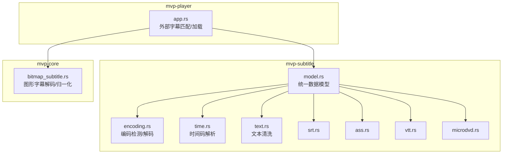

**图表来源**
- [model.rs:1-353](file://crates/mvp-subtitle/src/model.rs#L1-L353)
- [encoding.rs:1-227](file://crates/mvp-subtitle/src/encoding.rs#L1-L227)
- [time.rs:1-89](file://crates/mvp-subtitle/src/time.rs#L1-L89)
- [text.rs:1-203](file://crates/mvp-subtitle/src/text.rs#L1-L203)
- [srt.rs:1-215](file://crates/mvp-subtitle/src/srt.rs#L1-L215)
- [ass.rs:1-623](file://crates/mvp-subtitle/src/ass.rs#L1-L623)
- [vtt.rs:1-204](file://crates/mvp-subtitle/src/vtt.rs#L1-L204)
- [microdvd.rs:1-202](file://crates/mvp-subtitle/src/microdvd.rs#L1-L202)
- [bitmap_subtitle.rs:1-589](file://crates/mvp-core/src/bitmap_subtitle.rs#L1-L589)
- [app.rs:551-642](file://crates/mvp-player/src/app.rs#L551-L642)

**章节来源**
- [lib.rs:1-201](file://crates/mvp-subtitle/src/lib.rs#L1-L201)
- [model.rs:1-353](file://crates/mvp-subtitle/src/model.rs#L1-L353)
- [bitmap_subtitle.rs:1-589](file://crates/mvp-core/src/bitmap_subtitle.rs#L1-L589)
- [app.rs:551-642](file://crates/mvp-player/src/app.rs#L551-L642)

## 核心组件
- 统一数据模型
  - Cue：包含起止时间（秒）、纯文本、样式标志（加粗/斜体/下划线/删除线/颜色/对齐/垂直边距）。
  - CueStyle：最小可渲染样式集合。
  - Align：九宫格对齐枚举。
  - Subtitle/Parsed：解析结果容器，含标题、Cue 列表、编码名、格式类型。
- 解析器
  - SRT：容错解析，剥离标签与覆盖块，保留换行语义。
  - ASS/SSA：读取脚本信息、样式表、事件行，渲染覆盖标记为样式与文本。
  - WebVTT：解析头部、跳过 NOTE/STYLE/REGION，解析 align/position 设置。
  - MicroDVD：帧号转秒，支持首行声明帧率。
- 编码检测
  - BOM 优先；否则尝试 UTF-8；再尝试 GBK/Big5/Shift_JIS（结合 CJK/Kana 启发）；回退到 Windows-1252。
- 时间码解析
  - 兼容 HH:MM:SS,mmm / MM:SS.mmm / SS.mmm 等多种形态，统一为秒。
- 文本清洗
  - 去除角度标签、花括号覆盖块、转换换行转义、HTML 实体解码、边缘空白修剪。
- 图形字幕
  - 位图矩形（索引平面+调色板），RGBA 展开；坐标空间与画布尺寸；时间归一化（补全无时长片段、清理空片段）。

**章节来源**
- [model.rs:1-353](file://crates/mvp-subtitle/src/model.rs#L1-L353)
- [encoding.rs:1-227](file://crates/mvp-subtitle/src/encoding.rs#L1-L227)
- [time.rs:1-89](file://crates/mvp-subtitle/src/time.rs#L1-L89)
- [text.rs:1-203](file://crates/mvp-subtitle/src/text.rs#L1-L203)
- [srt.rs:1-215](file://crates/mvp-subtitle/src/srt.rs#L1-L215)
- [ass.rs:1-623](file://crates/mvp-subtitle/src/ass.rs#L1-L623)
- [vtt.rs:1-204](file://crates/mvp-subtitle/src/vtt.rs#L1-L204)
- [microdvd.rs:1-202](file://crates/mvp-subtitle/src/microdvd.rs#L1-L202)
- [bitmap_subtitle.rs:1-589](file://crates/mvp-core/src/bitmap_subtitle.rs#L1-L589)

## 架构总览
文本字幕与图形字幕在播放管线中并行存在，最终由渲染层根据当前时间选择并绘制。

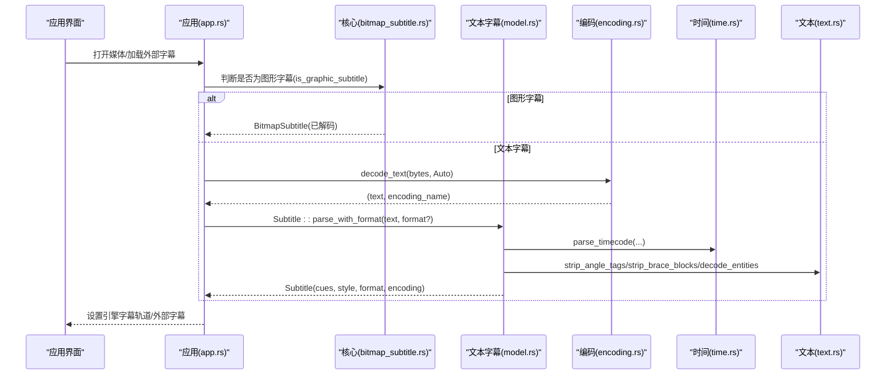

**图表来源**
- [app.rs:551-642](file://crates/mvp-player/src/app.rs#L551-L642)
- [bitmap_subtitle.rs:174-212](file://crates/mvp-core/src/bitmap_subtitle.rs#L174-L212)
- [encoding.rs:149-178](file://crates/mvp-subtitle/src/encoding.rs#L149-L178)
- [model.rs:149-294](file://crates/mvp-subtitle/src/model.rs#L149-L294)
- [time.rs:1-89](file://crates/mvp-subtitle/src/time.rs#L1-L89)
- [text.rs:1-203](file://crates/mvp-subtitle/src/text.rs#L1-L203)

## 详细组件分析

### 文本字幕模型与解析调度
- 模型设计
  - Cue 使用半开区间 [start, end)，确保相邻边界不重复激活。
  - CueStyle 仅携带可渲染的最小属性集，避免过度耦合。
  - Subtitle 提供 active_at/index_at/shift/merge_adjacent 等常用操作。
- 解析调度
  - from_text 根据强制格式或内容嗅探选择具体解析器，统一排序 cues。
  - detect_format 通过前缀与特征行快速判定 WEBVTT/MicroDVD/ASS/SRT。

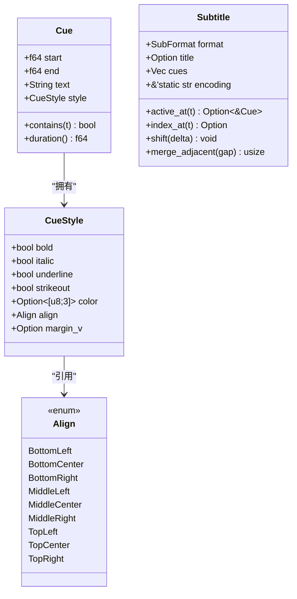

**图表来源**
- [model.rs:26-136](file://crates/mvp-subtitle/src/model.rs#L26-L136)
- [model.rs:138-294](file://crates/mvp-subtitle/src/model.rs#L138-L294)

**章节来源**
- [model.rs:1-353](file://crates/mvp-subtitle/src/model.rs#L1-L353)

### SRT 解析实现
- 容错策略
  - 支持多种行结束符、缺失序号、小时字段可选、毫秒分隔符逗号/点、BOM、cue 内部空行、末尾无换行。
  - 无法解析 timing 的行直接跳过，不影响后续 cue。
- 文本清洗
  - 去除角度标签与花括号覆盖块，转换 \N/\n 为真实换行，最后修剪边缘空白。
- 时间解析
  - 忽略遗留坐标后缀，仅取时间部分。

**图表来源**
- [srt.rs:26-122](file://crates/mvp-subtitle/src/srt.rs#L26-L122)
- [srt.rs:129-152](file://crates/mvp-subtitle/src/srt.rs#L129-L152)
- [time.rs:17-51](file://crates/mvp-subtitle/src/time.rs#L17-L51)
- [text.rs:34-155](file://crates/mvp-subtitle/src/text.rs#L34-L155)

**章节来源**
- [srt.rs:1-215](file://crates/mvp-subtitle/src/srt.rs#L1-L215)

### ASS/SSA 解析实现
- 文档结构
  - 读取 [Script Info] 标题；[V4+ Styles]/[V4 Styles] 构建样式表；[Events] 解析 Dialogue。
- 样式与覆盖
  - 样式表映射到 CueStyle（粗细/斜体/下划线/删除线/颜色/对齐/垂直边距）。
  - 覆盖标记 {\b\i\u\s\c\an\a\pos\r\p} 在渲染时生效，矢量绘图块丢弃。
- 列顺序鲁棒性
  - 按 Format 行动态解析列，Text 列允许包含逗号，重排仍正确。

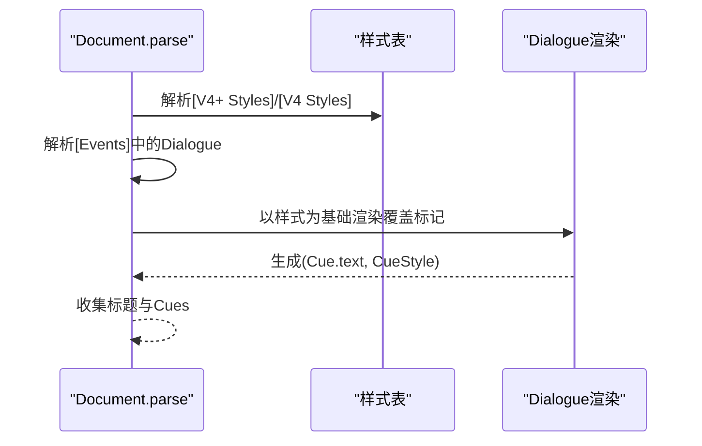

**图表来源**
- [ass.rs:46-81](file://crates/mvp-subtitle/src/ass.rs#L46-L81)
- [ass.rs:95-156](file://crates/mvp-subtitle/src/ass.rs#L95-L156)
- [ass.rs:239-302](file://crates/mvp-subtitle/src/ass.rs#L239-L302)
- [ass.rs:429-551](file://crates/mvp-subtitle/src/ass.rs#L429-L551)

**章节来源**
- [ass.rs:1-623](file://crates/mvp-subtitle/src/ass.rs#L1-L623)

### WebVTT 解析实现
- 头部与块
  - 识别 WEBVTT 头（可带标题），跳过 NOTE/STYLE/REGION。
- 时间与设置
  - 支持 HH:MM:SS.mmm 与 MM:SS.mmm；解析 align 与 position，后者用于推断对齐。
- 文本清洗
  - 去除角度标签，解码 HTML 实体，修剪边缘空白。

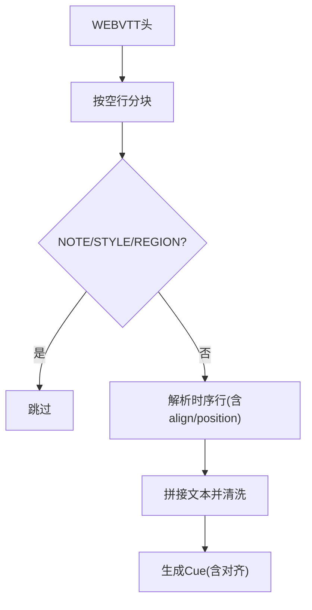

**图表来源**
- [vtt.rs:15-64](file://crates/mvp-subtitle/src/vtt.rs#L15-L64)
- [vtt.rs:101-154](file://crates/mvp-subtitle/src/vtt.rs#L101-L154)
- [text.rs:127-155](file://crates/mvp-subtitle/src/text.rs#L127-L155)

**章节来源**
- [vtt.rs:1-204](file://crates/mvp-subtitle/src/vtt.rs#L1-L204)

### MicroDVD 解析实现
- 帧号转秒
  - 默认帧率 23.976；若首行为 {1}{1}<fps> 则采用声明值。
- 文本与样式
  - | 转为换行；{y:...} 设置样式；{c:$...} 设置颜色（BBGGRR）。
- 鲁棒性
  - 非法帧率回退默认；无效行跳过。

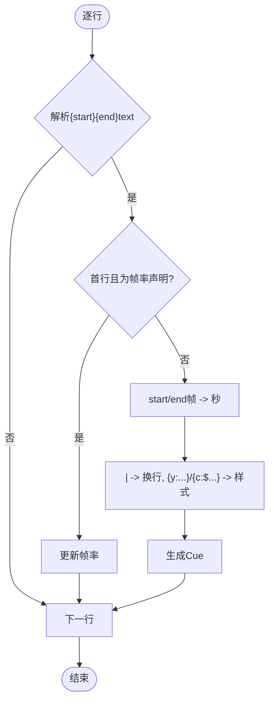

**图表来源**
- [microdvd.rs:48-104](file://crates/mvp-subtitle/src/microdvd.rs#L48-L104)
- [microdvd.rs:106-162](file://crates/mvp-subtitle/src/microdvd.rs#L106-L162)

**章节来源**
- [microdvd.rs:1-202](file://crates/mvp-subtitle/src/microdvd.rs#L1-L202)

### 编码自动识别机制
- 优先级
  - BOM 优先（UTF-8/UTF-16LE/UTF-16BE）。
  - 整体有效 UTF-8。
  - GBK 解码无错误且含 CJK 字符；否则 Big5；否则 Shift_JIS（含 CJK 或假名）。
  - 回退 Windows-1252。
- 输出
  - 返回解码后的字符串与人类可读编码名（如 "GBK"、"Windows-1252"）。

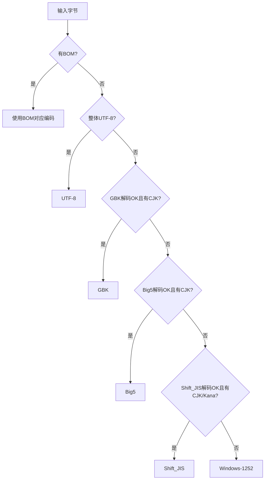

**图表来源**
- [encoding.rs:60-148](file://crates/mvp-subtitle/src/encoding.rs#L60-L148)
- [encoding.rs:149-178](file://crates/mvp-subtitle/src/encoding.rs#L149-L178)

**章节来源**
- [encoding.rs:1-227](file://crates/mvp-subtitle/src/encoding.rs#L1-L227)

### 图形字幕（PGS/VobSub/DVB）位图渲染实现
- 数据结构
  - BitmapRect：x/y/宽高、索引平面 indices、调色板 palette（RGBA）。
  - BitmapCue：起止时间、矩形列表。
  - BitmapSubtitle：轨道级容器，含画布尺寸（可选）。
- 解码与内存
  - 通过 FFmpeg 解码 AVSubtitleRect，复制索引平面与调色板；必要时展开为 RGBA。
  - 限制外部图形字幕解码大小，防止恶意文件耗尽内存。
- 坐标与清屏
  - 坐标来自源（PGS 通常为视频像素；VobSub 携带 DVD 帧尺寸）。
  - 无矩形的 composition 表示“清屏”，其时间戳用于关闭上一画面。
- 时间归一化
  - 对无持续时间的 cue，将其 end 设为下一 cue 的 start；尾部 cue 赋予短默认时长；移除空矩形 cue。

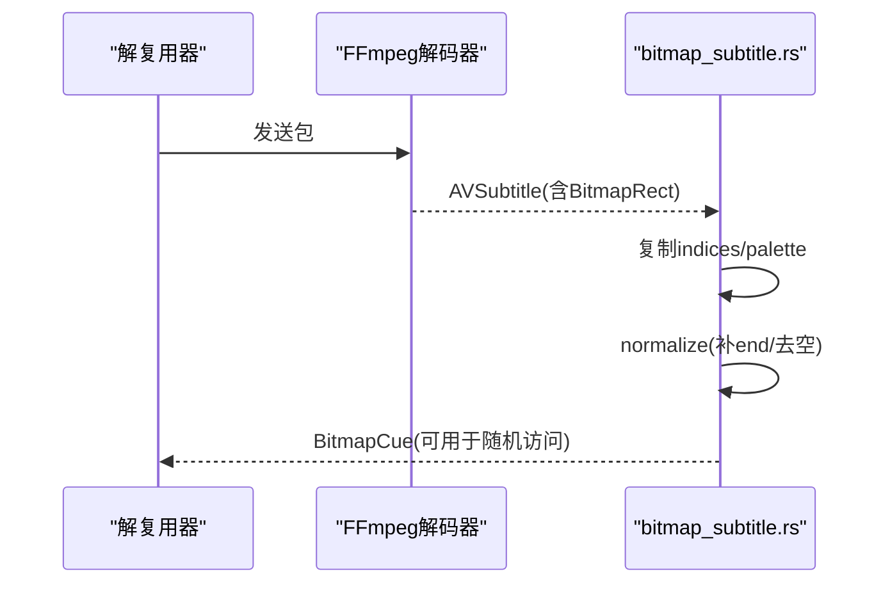

**图表来源**
- [bitmap_subtitle.rs:230-355](file://crates/mvp-core/src/bitmap_subtitle.rs#L230-L355)
- [bitmap_subtitle.rs:137-164](file://crates/mvp-core/src/bitmap_subtitle.rs#L137-L164)
- [bitmap_subtitle.rs:389-453](file://crates/mvp-core/src/bitmap_subtitle.rs#L389-L453)

**章节来源**
- [bitmap_subtitle.rs:1-589](file://crates/mvp-core/src/bitmap_subtitle.rs#L1-L589)

### 时间轴处理、样式渲染与视频同步
- 时间轴
  - 所有 Cue 使用半开区间；active_at 选择“起始最晚”的重叠 cue；index_at 用于“跳到下一条”。
  - shift 可整体偏移时间并重新排序；merge_adjacent 合并相同文本且间隙小于阈值的相邻 cue。
- 样式渲染
  - 文本样式来自 ASS/SSA 覆盖或 MicroDVD 样式块；SRT/WebVTT 内联标签被剥离但不设样式标志。
  - 对齐与垂直边距影响渲染位置（ASS 的 \pos 与 MarginV 会覆盖默认对齐）。
- 视频同步
  - 播放器每帧查询当前时间的活跃 cue；文本与图形字幕各自维护独立轨道，均按时间轴选择。

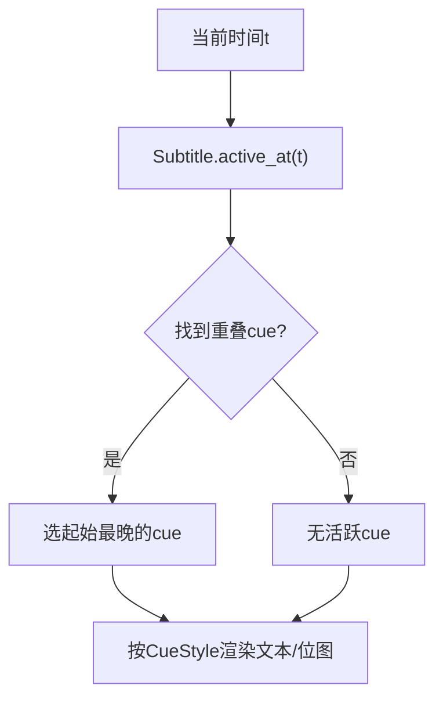

**图表来源**
- [model.rs:180-239](file://crates/mvp-subtitle/src/model.rs#L180-L239)
- [ass.rs:429-551](file://crates/mvp-subtitle/src/ass.rs#L429-L551)
- [microdvd.rs:106-162](file://crates/mvp-subtitle/src/microdvd.rs#L106-L162)

**章节来源**
- [model.rs:138-294](file://crates/mvp-subtitle/src/model.rs#L138-L294)
- [ass.rs:429-551](file://crates/mvp-subtitle/src/ass.rs#L429-L551)
- [microdvd.rs:106-162](file://crates/mvp-subtitle/src/microdvd.rs#L106-L162)

### 字幕文件加载策略与外部字幕匹配规则
- 外部字幕发现
  - 与媒体同名的侧载字幕会被自动发现；是否立即加载取决于“优先外部字幕”设置。
  - 若媒体已包含可渲染的内嵌字幕，且未开启“优先外部”，则忽略侧载字幕。
- 加载流程
  - 先判断是否为图形字幕（.sup/.idx 或 .sub 二进制）；若是则走图形解码路径。
  - 否则读取字节，调用 Subtitle::parse 进行编码检测与格式解析。
- 语言后缀优先级
  - 扩展名映射决定格式（srt/ass/vtt/sub），未知扩展返回 Unknown。
  - 内容嗅探可在无扩展或误扩展时恢复正确格式。

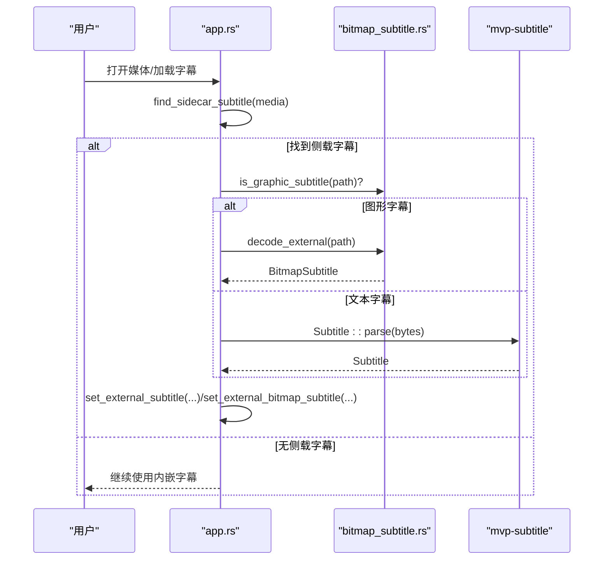

**图表来源**
- [app.rs:551-642](file://crates/mvp-player/src/app.rs#L551-L642)
- [bitmap_subtitle.rs:174-212](file://crates/mvp-core/src/bitmap_subtitle.rs#L174-L212)
- [bitmap_subtitle.rs:389-453](file://crates/mvp-core/src/bitmap_subtitle.rs#L389-L453)
- [model.rs:167-178](file://crates/mvp-subtitle/src/model.rs#L167-L178)

**章节来源**
- [app.rs:551-642](file://crates/mvp-player/src/app.rs#L551-L642)
- [model.rs:167-178](file://crates/mvp-subtitle/src/model.rs#L167-L178)

### 扩展方法与自定义样式配置
- 新增文本格式
  - 在 model.rs 中添加新 SubFormat，并在 from_text/detect_format 中注册；实现独立的解析模块，产出 Parsed。
  - 复用 time.rs 与 text.rs 工具函数，保持风格一致。
- 自定义样式
  - 扩展 CueStyle 字段（例如字体大小、阴影），在各解析器中填充；渲染层据此绘制。
  - ASS/SSA 已支持丰富覆盖标记；MicroDVD 支持 y:/c:$ 样式；SRT/WebVTT 剥离标签但可扩展为样式映射。
- 图形字幕扩展
  - 新增外部容器/格式需在 is_graphic_subtitle 中识别；decode_external 适配相应 demuxer/decoder。

**章节来源**
- [model.rs:9-24](file://crates/mvp-subtitle/src/model.rs#L9-L24)
- [model.rs:272-294](file://crates/mvp-subtitle/src/model.rs#L272-L294)
- [ass.rs:239-302](file://crates/mvp-subtitle/src/ass.rs#L239-L302)
- [microdvd.rs:106-162](file://crates/mvp-subtitle/src/microdvd.rs#L106-L162)
- [bitmap_subtitle.rs:174-212](file://crates/mvp-core/src/bitmap_subtitle.rs#L174-L212)

## 依赖关系分析
- 模块耦合
  - model.rs 是所有解析器的目标模型；各解析器依赖 time.rs、text.rs 与 encoding.rs。
  - bitmap_subtitle.rs 依赖 FFmpeg，独立于文本解析库。
  - app.rs 作为编排层，协调文本与图形字幕的加载与设置。
- 外部依赖
  - encoding_rs 提供多编码解码；ffmpeg-next 提供图形字幕解码。
- 循环依赖
  - 文本解析库内部无循环依赖；与 core/player 通过明确接口交互。

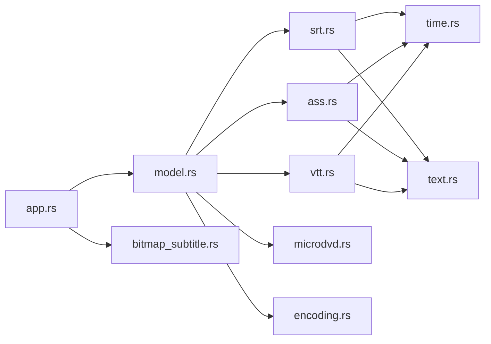

**图表来源**
- [model.rs:1-353](file://crates/mvp-subtitle/src/model.rs#L1-L353)
- [srt.rs:1-215](file://crates/mvp-subtitle/src/srt.rs#L1-L215)
- [ass.rs:1-623](file://crates/mvp-subtitle/src/ass.rs#L1-L623)
- [vtt.rs:1-204](file://crates/mvp-subtitle/src/vtt.rs#L1-L204)
- [microdvd.rs:1-202](file://crates/mvp-subtitle/src/microdvd.rs#L1-L202)
- [time.rs:1-89](file://crates/mvp-subtitle/src/time.rs#L1-L89)
- [text.rs:1-203](file://crates/mvp-subtitle/src/text.rs#L1-L203)
- [encoding.rs:1-227](file://crates/mvp-subtitle/src/encoding.rs#L1-L227)
- [app.rs:551-642](file://crates/mvp-player/src/app.rs#L551-L642)
- [bitmap_subtitle.rs:1-589](file://crates/mvp-core/src/bitmap_subtitle.rs#L1-L589)

**章节来源**
- [model.rs:1-353](file://crates/mvp-subtitle/src/model.rs#L1-L353)
- [app.rs:551-642](file://crates/mvp-player/src/app.rs#L551-L642)

## 性能考量
- 文本解析
  - 解析过程对大文件采用有限扫描（如 detect_format 限制行数），避免阻塞。
  - 文本清洗与实体解码为线性复杂度，开销可控。
- 图形字幕
  - 位图以索引平面存储，仅在需要时展开为 RGBA，显著降低内存占用。
  - 外部图形字幕解码设置上限（数百 MB），防止恶意文件导致 OOM。
  - normalize/prune 控制活跃 cue 数量，减少渲染压力。
- 时间查询
  - active_at 线性扫描，适合 cue 数量适中场景；可通过 merge_adjacent 减少冗余 cue。

[本节为通用指导，无需特定文件来源]

## 故障排查指南
- 编码问题
  - 现象：中文乱码或西欧字符异常。
  - 排查：确认文件是否含 BOM；检查 detect_encoding 分支；必要时使用 EncodingHint 强制指定。
- 时间错位
  - 现象：字幕提前/延后出现。
  - 排查：使用 Subtitle::shift 调整偏移；检查 MicroDVD 帧率是否正确（首行声明或传入 fps）。
- 样式丢失
  - 现象：SRT/WebVTT 内联标签未生效。
  - 说明：这些格式标签被剥离且不映射到样式标志；如需样式请使用 ASS/SSA。
- 图形字幕不显示
  - 现象：PGS/VobSub 无画面或清屏。
  - 排查：确认 is_graphic_subtitle 识别正确；检查 normalize 是否补全了 end；查看是否有空矩形 cue。

**章节来源**
- [encoding.rs:124-178](file://crates/mvp-subtitle/src/encoding.rs#L124-L178)
- [microdvd.rs:22-29](file://crates/mvp-subtitle/src/microdvd.rs#L22-L29)
- [model.rs:225-239](file://crates/mvp-subtitle/src/model.rs#L225-L239)
- [bitmap_subtitle.rs:137-164](file://crates/mvp-core/src/bitmap_subtitle.rs#L137-L164)

## 结论
本字幕系统以统一模型为核心，将多种文本格式与图形字幕纳入一致的时序与样式抽象，提供健壮的编码检测、容错解析与高效的位图渲染。通过应用层的侧载字幕匹配与内嵌字幕优先级策略，兼顾易用性与灵活性。未来可按需扩展新格式与样式能力，同时保持性能与稳定性。

[本节为总结，无需特定文件来源]

## 附录
- 术语
  - Cue：一个时间区间内的字幕单元。
  - 半开区间：[start, end)，边界不重复激活。
  - 侧载字幕：与媒体同名但独立的外部字幕文件。
- 最佳实践
  - 优先使用 ASS/SSA 以获得丰富样式。
  - 对 MicroDVD 尽量提供准确帧率。
  - 对图形字幕注意文件大小与 cue 数量，必要时进行 prune。

[本节为补充信息，无需特定文件来源]