# ASS/SSA 字幕解析器

<cite>
**本文引用的文件**   
- [ass.rs](file://crates/mvp-subtitle/src/ass.rs)
- [model.rs](file://crates/mvp-subtitle/src/model.rs)
- [lib.rs](file://crates/mvp-subtitle/src/lib.rs)
- [time.rs](file://crates/mvp-subtitle/src/time.rs)
- [text.rs](file://crates/mvp-subtitle/src/text.rs)
- [acceptance.rs](file://crates/mvp-subtitle/tests/acceptance.rs)
</cite>

## 目录
1. [简介](#简介)
2. [项目结构](#项目结构)
3. [核心组件](#核心组件)
4. [架构总览](#架构总览)
5. [详细组件分析](#详细组件分析)
6. [依赖关系分析](#依赖关系分析)
7. [性能与复杂度](#性能与复杂度)
8. [疑难解答](#疑难解答)
9. [结论](#结论)
10. [附录：ASS 样式标记速查](#附录ass-样式标记速查)

## 简介
本技术文档聚焦于 Advanced SubStation Alpha / Sub Station Alpha（ASS/SSA）字幕格式的解析实现。该解析器位于 `mvp-subtitle` crate 中，负责将 ASS/SSA 文本转换为统一的字幕模型，并支持以下关键能力：
- 解析 `[Script Info]`、`[V4+ Styles]`/`[V4 Styles]`、`[Events]` 等脚本段；
- 从 `Format:` 行动态识别列顺序，兼容任意重排；
- 解析样式表（Style），提取粗体、斜体、下划线、删除线、颜色、对齐、垂直边距等属性；
- 渲染对话文本（Dialogue Text），处理内联覆盖标记（如 `\b`、`\i`、`\u`、`\s`、`\c`/`\1c`、`\an`、`\a`、`\pos`、`\r`、`\p`）；
- 忽略非对话事件（Comment/Picture/Sound/Movie/Command）；
- 提供时间轴解析、文本清理、格式检测与统一 Cue 模型。

该实现遵循“永不失败”的设计原则：对非法输入进行降级处理，尽量保留可用字幕，而不是抛出异常或中断解析。

**章节来源**
- [lib.rs:1-43](file://crates/mvp-subtitle/src/lib.rs#L1-L43)

## 项目结构
在 `mvp-subtitle` crate 中，ASS/SSA 解析相关代码主要分布在以下文件：
- `ass.rs`：ASS/SSA 专用解析逻辑，包括文档分段、样式表、对话行、内联覆盖标记和时间码调用；
- `model.rs`：跨格式的统一数据模型（Cue、CueStyle、Align、Parsed、Subtitle 等）；
- `time.rs`：通用时间码解析；
- `text.rs`：通用文本清理工具（实体解码、换行转义、角度标签和花括号块剥离等）；
- `lib.rs`：crate 公共 API、格式枚举、测试用例；
- `tests/acceptance.rs`：端到端验收测试，包含 ASS 重排 Format 行和内联覆盖的示例。

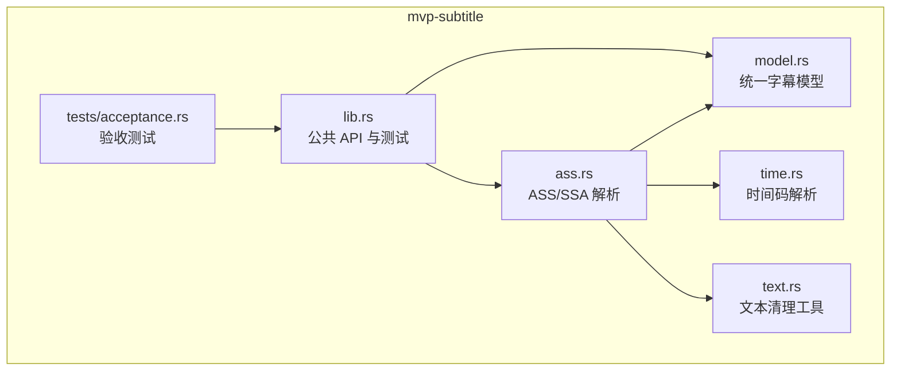

**图表来源**
- [ass.rs:1-22](file://crates/mvp-subtitle/src/ass.rs#L1-L22)
- [model.rs:1-24](file://crates/mvp-subtitle/src/model.rs#L1-L24)
- [time.rs:1-16](file://crates/mvp-subtitle/src/time.rs#L1-L16)
- [text.rs:1-6](file://crates/mvp-subtitle/src/text.rs#L1-L6)
- [lib.rs:1-31](file://crates/mvp-subtitle/src/lib.rs#L1-L31)
- [acceptance.rs:137-158](file://crates/mvp-subtitle/tests/acceptance.rs#L137-L158)

**章节来源**
- [ass.rs:1-22](file://crates/mvp-subtitle/src/ass.rs#L1-L22)
- [model.rs:1-24](file://crates/mvp-subtitle/src/model.rs#L1-L24)
- [lib.rs:1-31](file://crates/mvp-subtitle/src/lib.rs#L1-L31)

## 核心组件
本节梳理 ASS/SSA 解析的关键数据结构与职责：
- `AssStyle`：表示一个样式定义，包含名称、可映射到 CueStyle 的属性以及原始字体大小；
- `RawDialogue`：尚未应用样式的对话行临时结构，包含起止时间、样式名、文本和垂直边距；
- `Document`：解析后的文档容器，包含标题、样式列表和对话列表；
- `Cue`/`CueStyle`/`Align`：统一字幕模型，承载时间范围、纯文本和呈现属性；
- `Parsed`/`Subtitle`：解析结果与完整轨道对象，提供查询、合并、偏移等工具方法。

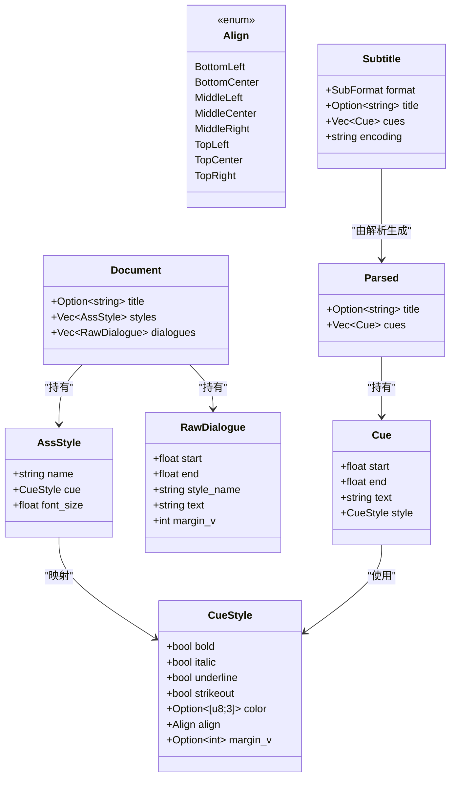

**图表来源**
- [ass.rs:24-43](file://crates/mvp-subtitle/src/ass.rs#L24-L43)
- [ass.rs:88-93](file://crates/mvp-subtitle/src/ass.rs#L88-L93)
- [model.rs:26-84](file://crates/mvp-subtitle/src/model.rs#L26-L84)
- [model.rs:107-136](file://crates/mvp-subtitle/src/model.rs#L107-L136)

**章节来源**
- [ass.rs:24-43](file://crates/mvp-subtitle/src/ass.rs#L24-L43)
- [ass.rs:88-93](file://crates/mvp-subtitle/src/ass.rs#L88-L93)
- [model.rs:26-84](file://crates/mvp-subtitle/src/model.rs#L26-L84)
- [model.rs:107-136](file://crates/mvp-subtitle/src/model.rs#L107-L136)

## 架构总览
ASS/SSA 解析的整体流程如下：
1. 通过 `Subtitle::parse` 或 `Subtitle::from_text` 选择格式；
2. 若为 ASS，则调用 `ass::parse`；
3. `Document::parse` 逐行扫描，识别段落（Script Info/V4+ Styles/V4 Styles/Events）；
4. 从 `Format:` 行构建列名数组，按列名解析 Style 和 Dialogue；
5. 将每个 Dialogue 与对应样式合并，得到基础 `CueStyle`；
6. 渲染文本，应用内联覆盖标记，生成最终 `Cue`；
7. 返回 `Parsed`，再由 `Subtitle` 排序、封装。

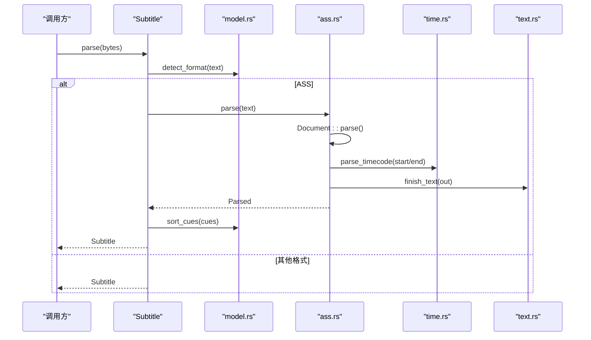

**图表来源**
- [model.rs:274-294](file://crates/mvp-subtitle/src/model.rs#L274-L294)
- [ass.rs:46-81](file://crates/mvp-subtitle/src/ass.rs#L46-L81)
- [ass.rs:95-155](file://crates/mvp-subtitle/src/ass.rs#L95-L155)
- [time.rs:17-50](file://crates/mvp-subtitle/src/time.rs#L17-L50)
- [text.rs:146-155](file://crates/mvp-subtitle/src/text.rs#L146-L155)

**章节来源**
- [model.rs:274-294](file://crates/mvp-subtitle/src/model.rs#L274-L294)
- [ass.rs:46-81](file://crates/mvp-subtitle/src/ass.rs#L46-L81)

## 详细组件分析

### 文档分段与列解析
- 段落识别：支持 `[script info]`、`[v4+ styles]`、`[v4 styles]`、`[events]`，不区分大小写；
- 键值拆分：`Title: ...` 等键值行被拆分为键与值；
- 列名解析：`Format:` 行被切分为列名数组，用于后续 Style/Dialogue 字段定位；
- 默认事件列：当 Events 缺少 `Format:` 时，使用默认列顺序（Layer/Start/End/Style/Name/MarginL/MarginR/MarginV/Effect/Text）。

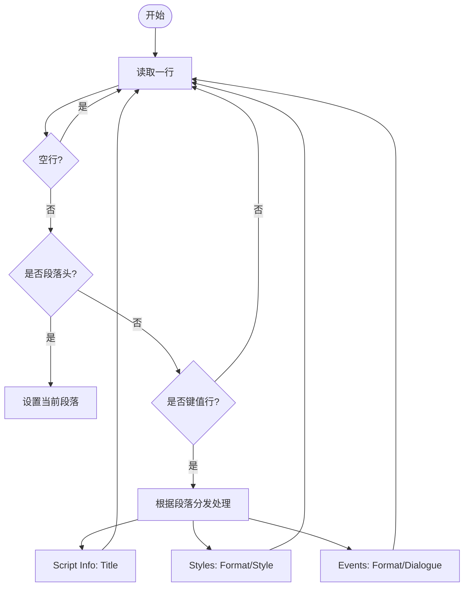

**图表来源**
- [ass.rs:95-155](file://crates/mvp-subtitle/src/ass.rs#L95-L155)
- [ass.rs:158-182](file://crates/mvp-subtitle/src/ass.rs#L158-L182)
- [ass.rs:192-200](file://crates/mvp-subtitle/src/ass.rs#L192-L200)

**章节来源**
- [ass.rs:95-155](file://crates/mvp-subtitle/src/ass.rs#L95-L155)
- [ass.rs:158-182](file://crates/mvp-subtitle/src/ass.rs#L158-L182)
- [ass.rs:192-200](file://crates/mvp-subtitle/src/ass.rs#L192-L200)

### 样式表解析（Style 段）
- 列名匹配：通过列名查找 Name/Bold/Italic/Underline/StrikeOut/PrimaryColour/Alignment/MarginV/Fontsize；
- 布尔标志：支持 `-1`/`1`/`true`/`yes` 等开启形式，空字段视为关闭；
- 颜色解析：支持 `&H...&` 或无前缀十六进制，按 BBGGRR 字节序解析为 RGB；
- 对齐解析：支持数字小键盘布局（1-9）及 SSA 遗留位掩码（10/11）；
- 字体大小：可选保留，供上层使用。

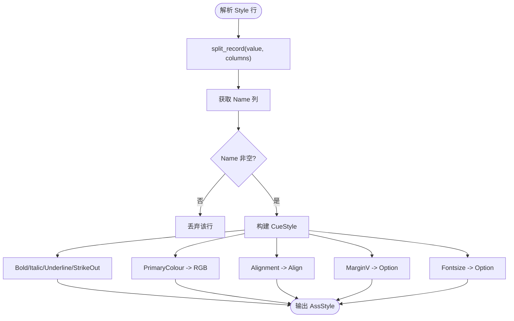

**图表来源**
- [ass.rs:239-271](file://crates/mvp-subtitle/src/ass.rs#L239-L271)
- [ass.rs:304-326](file://crates/mvp-subtitle/src/ass.rs#L304-L326)
- [ass.rs:332-379](file://crates/mvp-subtitle/src/ass.rs#L332-L379)
- [ass.rs:381-391](file://crates/mvp-subtitle/src/ass.rs#L381-L391)

**章节来源**
- [ass.rs:239-271](file://crates/mvp-subtitle/src/ass.rs#L239-L271)
- [ass.rs:304-326](file://crates/mvp-subtitle/src/ass.rs#L304-L326)
- [ass.rs:332-379](file://crates/mvp-subtitle/src/ass.rs#L332-L379)
- [ass.rs:381-391](file://crates/mvp-subtitle/src/ass.rs#L381-L391)

### 对话行解析（Event 段）
- 列顺序：优先使用 Events 段的 `Format:` 行定义的列顺序；若无，则回退到默认列顺序；
- 时间解析：调用 `parse_timecode` 解析 Start/End；
- 文本处理：保留 Text 列内容，允许其中包含逗号；
- 垂直边距：MarginV 非零时作为覆盖值。

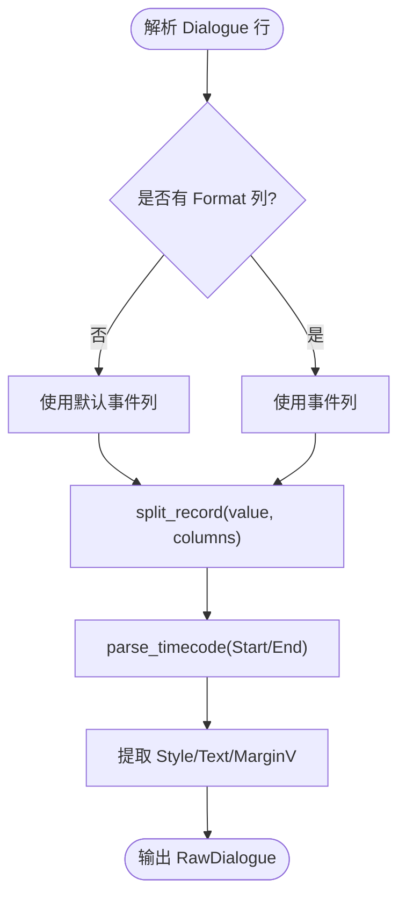

**图表来源**
- [ass.rs:273-302](file://crates/mvp-subtitle/src/ass.rs#L273-L302)
- [ass.rs:192-200](file://crates/mvp-subtitle/src/ass.rs#L192-L200)
- [time.rs:17-50](file://crates/mvp-subtitle/src/time.rs#L17-L50)

**章节来源**
- [ass.rs:273-302](file://crates/mvp-subtitle/src/ass.rs#L273-L302)
- [ass.rs:192-200](file://crates/mvp-subtitle/src/ass.rs#L192-L200)
- [time.rs:17-50](file://crates/mvp-subtitle/src/time.rs#L17-L50)

### 文本渲染与内联覆盖标记
- 覆盖块：`{...}` 中的标记被解析为样式覆盖；
- 支持的标记：
  - 字形：`\b`（粗体）、`\i`（斜体）、`\u`（下划线）、`\s`（删除线）；
  - 颜色：`\c`/`\1c`（主色，BBGGR 十六进制）；
  - 对齐：`\an`（数字小键盘）、`\a`（遗留位掩码）；
  - 位置：`\pos(x,y)`（仅取 y 作为垂直边距覆盖）；
  - 重置：`\r`（恢复对话行的基础样式）；
  - 绘图块：`\p1`/`\p0`（进入/退出矢量绘图区，期间丢弃所有文本）；
- 转义字符：
  - `\N` → 真实换行；
  - `\n` → 空格；
  - `\h` → 不换行空格；
  - 其他反斜杠序列保留原样（除非处于绘图块）。

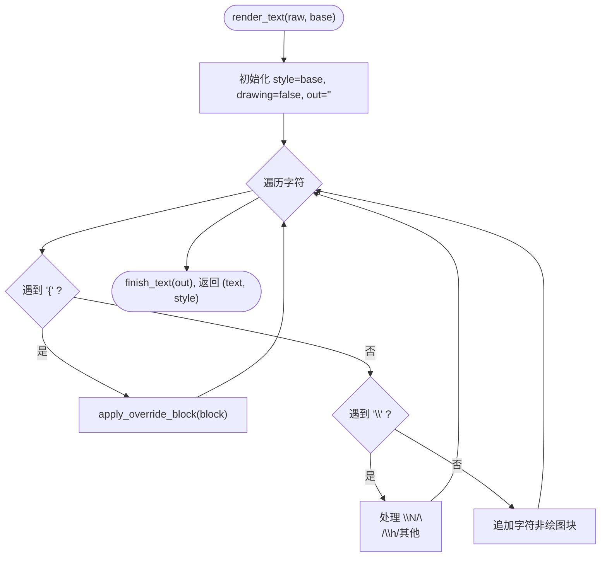

**图表来源**
- [ass.rs:429-489](file://crates/mvp-subtitle/src/ass.rs#L429-L489)
- [ass.rs:491-540](file://crates/mvp-subtitle/src/ass.rs#L491-L540)
- [ass.rs:542-551](file://crates/mvp-subtitle/src/ass.rs#L542-L551)
- [text.rs:146-155](file://crates/mvp-subtitle/src/text.rs#L146-L155)

**章节来源**
- [ass.rs:429-489](file://crates/mvp-subtitle/src/ass.rs#L429-L489)
- [ass.rs:491-540](file://crates/mvp-subtitle/src/ass.rs#L491-L540)
- [ass.rs:542-551](file://crates/mvp-subtitle/src/ass.rs#L542-L551)
- [text.rs:146-155](file://crates/mvp-subtitle/src/text.rs#L146-L155)

### 样式继承与默认样式策略
- 基础样式：每个 Dialogue 首先加载其 Style 列对应的 `AssStyle.cue`；
- 行级覆盖：
  - MarginV：若 Dialogue 行有非零 MarginV，则覆盖样式中的 MarginV；
  - 内联覆盖：渲染过程中应用的 `\pos`、`\c`、`\an` 等会进一步修改样式；
- 重置行为：`\r` 恢复为对话行的基础样式（近似实现，命名目标样式也回退到同一基础样式）；
- 缺失样式：若 Dialogue 引用了未声明的样式名，则使用 `CueStyle::default()`。

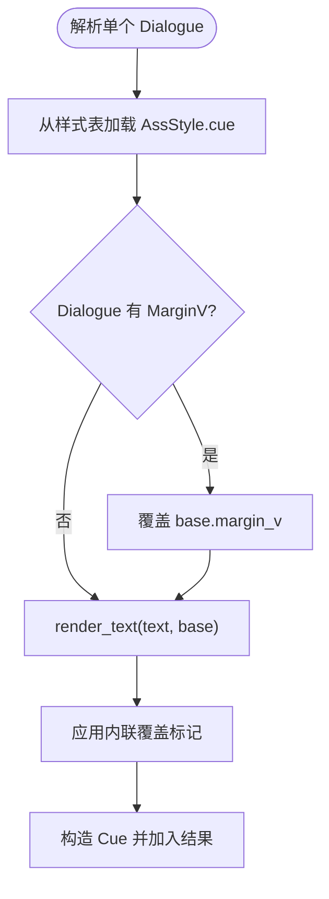

**图表来源**
- [ass.rs:46-81](file://crates/mvp-subtitle/src/ass.rs#L46-L81)
- [ass.rs:491-540](file://crates/mvp-subtitle/src/ass.rs#L491-L540)

**章节来源**
- [ass.rs:46-81](file://crates/mvp-subtitle/src/ass.rs#L46-L81)
- [ass.rs:491-540](file://crates/mvp-subtitle/src/ass.rs#L491-L540)

### 时间轴格式与字段映射
- 时间码解析：支持多种格式（小时/分钟/秒/毫秒），兼容逗号或点分隔的小数部分；
- 字段映射：
  - Start/End：时间戳；
  - Style：样式名；
  - Text：对话文本；
  - MarginV：垂直边距（非零有效）；
- 半开区间：Cue 的时间区间为 `[start, end)`，避免边界重叠歧义。

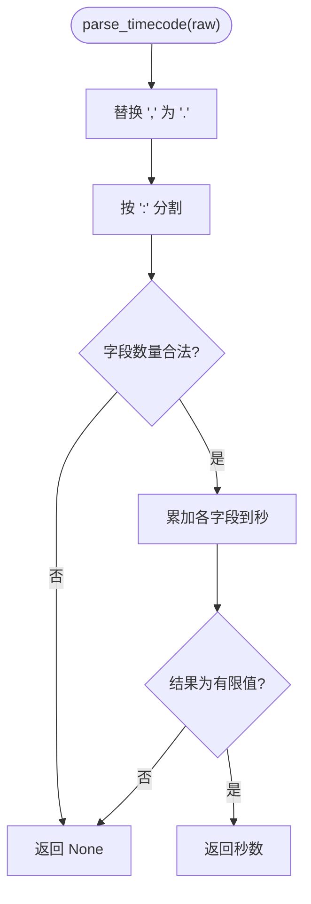

**图表来源**
- [time.rs:17-50](file://crates/mvp-subtitle/src/time.rs#L17-L50)
- [model.rs:86-105](file://crates/mvp-subtitle/src/model.rs#L86-L105)

**章节来源**
- [time.rs:17-50](file://crates/mvp-subtitle/src/time.rs#L17-L50)
- [model.rs:86-105](file://crates/mvp-subtitle/src/model.rs#L86-L105)

### 复杂 ASS 文件解析示例
验收测试展示了以下关键点：
- 重排的 `Format:` 行（例如只声明 Start/End/Style/Text）；
- 内联覆盖标记 `\an8`（顶部居中）、`\b1`（粗体）、`\c&H0000FF&`（红色）；
- 忽略 Comment 行；
- 多行对话（`\N` 换行）。

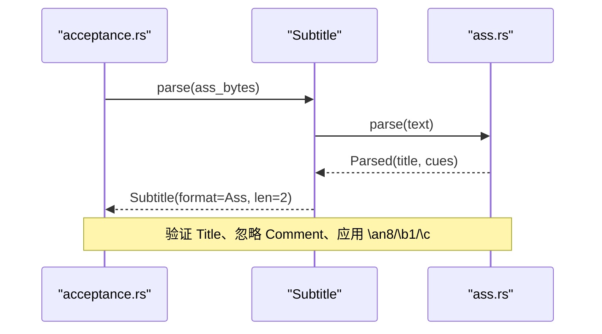

**图表来源**
- [acceptance.rs:137-158](file://crates/mvp-subtitle/tests/acceptance.rs#L137-L158)
- [ass.rs:46-81](file://crates/mvp-subtitle/src/ass.rs#L46-L81)

**章节来源**
- [acceptance.rs:137-158](file://crates/mvp-subtitle/tests/acceptance.rs#L137-L158)
- [ass.rs:46-81](file://crates/mvp-subtitle/src/ass.rs#L46-L81)

## 依赖关系分析
- `ass.rs` 依赖：
  - `model.rs`：`Align`、`Cue`、`CueStyle`、`Parsed`；
  - `time.rs`：`parse_timecode`；
  - `text.rs`：`finish_text`；
- `model.rs` 依赖：
  - 各格式解析器（ass/srt/vtt/microdvd）；
  - 提供统一模型与工具方法（active_at、index_at、shift、merge_adjacent 等）；
- `lib.rs` 暴露公共 API 与测试。

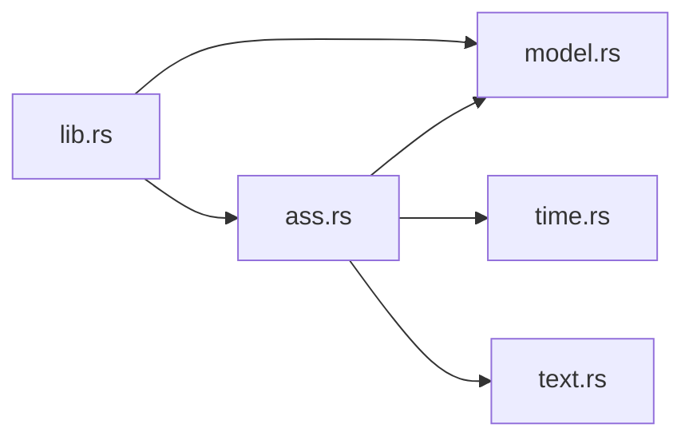

**图表来源**
- [ass.rs:18-22](file://crates/mvp-subtitle/src/ass.rs#L18-L22)
- [model.rs:7-24](file://crates/mvp-subtitle/src/model.rs#L7-L24)
- [lib.rs:47-59](file://crates/mvp-subtitle/src/lib.rs#L47-L59)

**章节来源**
- [ass.rs:18-22](file://crates/mvp-subtitle/src/ass.rs#L18-L22)
- [model.rs:7-24](file://crates/mvp-subtitle/src/model.rs#L7-L24)
- [lib.rs:47-59](file://crates/mvp-subtitle/src/lib.rs#L47-L59)

## 性能与复杂度
- 文档解析：线性扫描每行，O(N)；
- 样式表构建：哈希映射 O(S)，S 为样式数量；
- 对话渲染：每行文本一次遍历，O(T)，T 为文本长度；
- 时间码解析：固定开销，O(1)；
- 内存占用：主要为字符串与向量，合理预分配容量；
- 容错性：对非法输入跳过而非崩溃，保证可用性。

[本节为一般性指导，无需具体文件分析]

## 疑难解答
- 为什么某些 ASS 特效没有生效？
  - 当前实现仅支持部分内联标记（`\b`、`\i`、`\u`、`\s`、`\c`/`\1c`、`\an`、`\a`、`\pos`、`\r`、`\p`），其他高级特性（如动画、缩放变换、矢量绘图内容）会被忽略或丢弃；
- 为什么 `\rOtherStyle` 没有恢复到指定样式？
  - 当前实现近似处理：`\r` 总是恢复为对话行的基础样式，命名目标样式不被追踪；
- 为什么颜色看起来反转？
  - ASS 颜色以 BBGGR 字节序存储，解析时会正确转换为 RGB；
- 为什么某些对话被忽略？
  - 非 Dialogue 事件（Comment/Picture/Sound/Movie/Command）被有意忽略；
- 如何处理嵌套样式和特殊字符转义？
  - 嵌套 `{...}` 不会被当作覆盖块处理，保持字面量；
  - 转义字符 `\N`/`\n`/`\h` 分别转换为换行、空格、不换行空格；
  - 绘图块 `\p1` 期间的所有文本被丢弃。

**章节来源**
- [lib.rs:33-42](file://crates/mvp-subtitle/src/lib.rs#L33-L42)
- [ass.rs:429-489](file://crates/mvp-subtitle/src/ass.rs#L429-L489)
- [ass.rs:491-540](file://crates/mvp-subtitle/src/ass.rs#L491-L540)

## 结论
该 ASS/SSA 解析器提供了稳健、容错的字幕解析能力，重点覆盖样式表、对话行、内联覆盖标记和时间轴解析。它通过统一模型将不同格式的字幕归一化，便于播放器渲染与交互。对于更复杂的 ASS 特性（动画、缩放、矢量绘图内容），当前实现选择忽略或近似处理，以保证稳定性和性能。

[本节为总结性内容，无需具体文件分析]

## 附录：ASS 样式标记速查
- 字形：
  - `\b[权重]`：粗体；
  - `\i[权重]`：斜体；
  - `\u[权重]`：下划线；
  - `\s[权重]`：删除线；
- 颜色：
  - `\c[颜色]` 或 `\1c[颜色]`：主色（BBGGR 十六进制）；
- 对齐：
  - `\an[1-9]`：数字小键盘对齐；
  - `\a[1-11]`：遗留位掩码对齐；
- 位置：
  - `\pos(x,y)`：y 坐标映射为垂直边距覆盖；
- 重置：
  - `\r`：恢复基础样式；
- 绘图块：
  - `\p1`/`\p0`：进入/退出绘图块，期间丢弃文本；
- 转义：
  - `\N`：换行；
  - `\n`：空格；
  - `\h`：不换行空格。

[本节为概念性说明，无需具体文件分析]