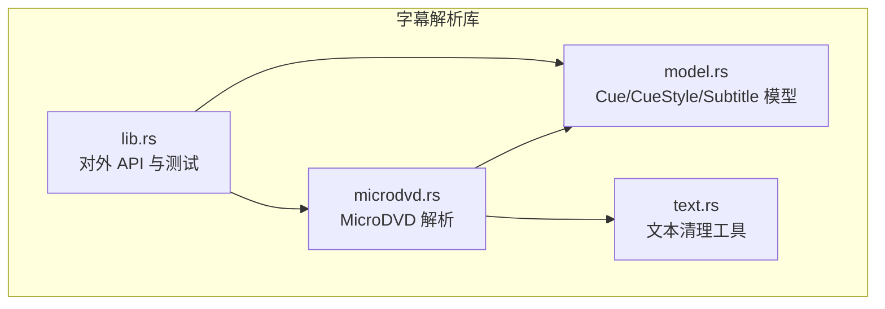
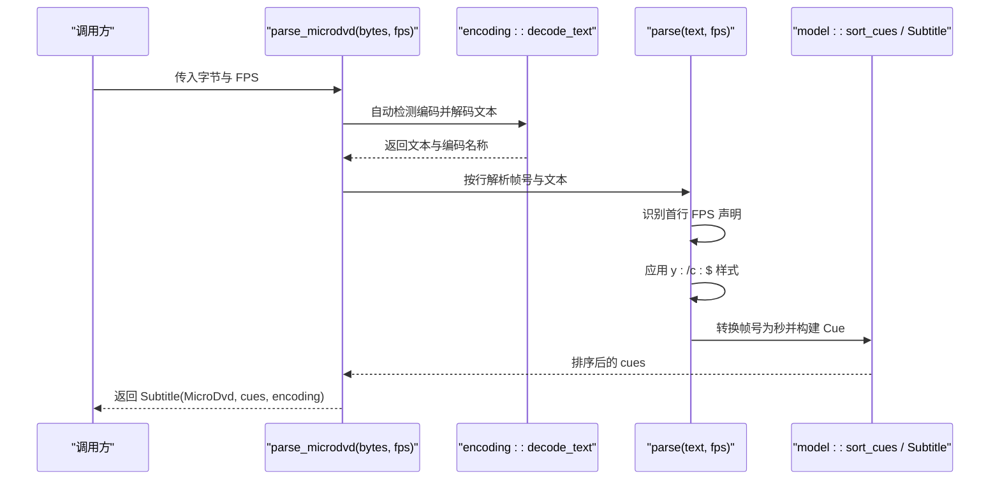
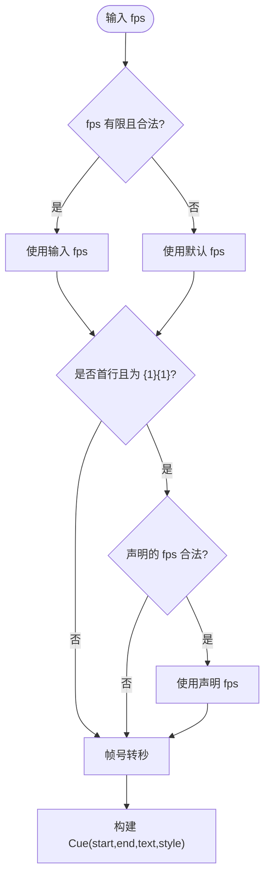
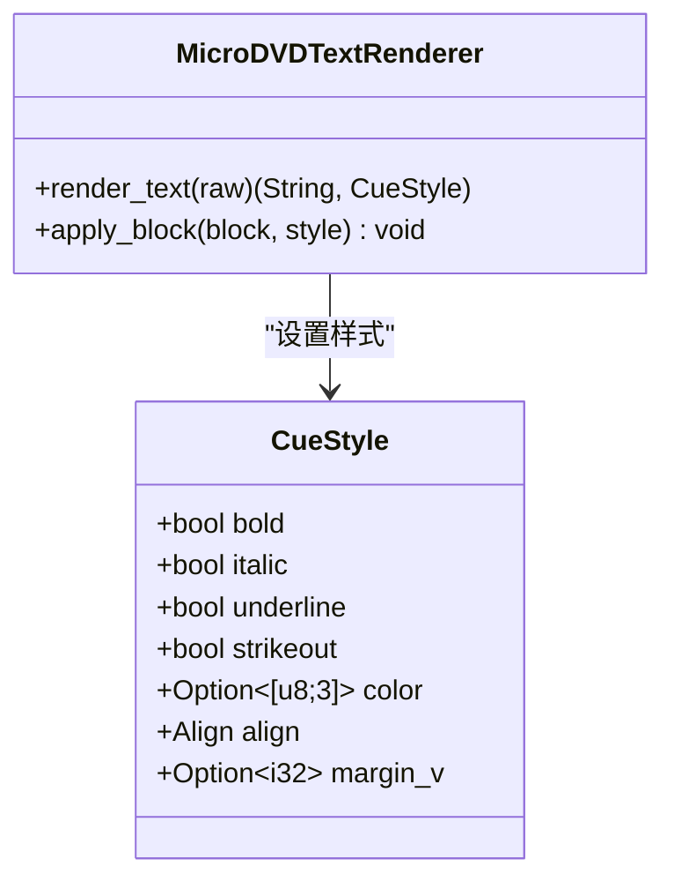
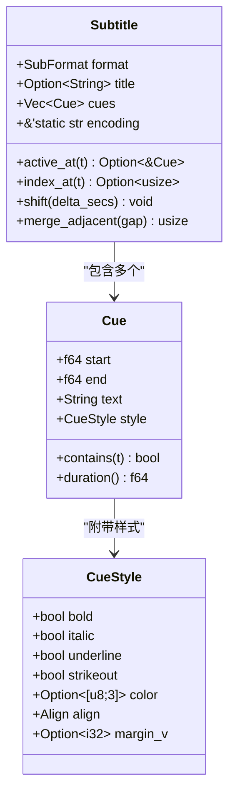
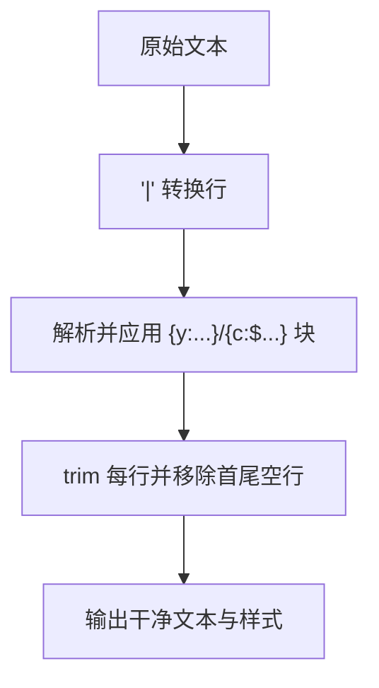
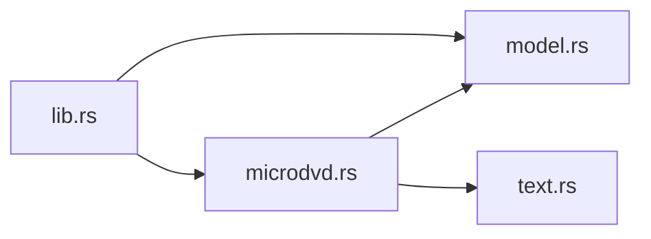

# MicroDVD 字幕解析器

<cite>
**本文引用的文件**   
- [microdvd.rs](file://crates/mvp-subtitle/src/microdvd.rs)
- [model.rs](file://crates/mvp-subtitle/src/model.rs)
- [text.rs](file://crates/mvp-subtitle/src/text.rs)
- [lib.rs](file://crates/mvp-subtitle/src/lib.rs)
</cite>

## 目录
1. [简介](#简介)
2. [项目结构](#项目结构)
3. [核心组件](#核心组件)
4. [架构总览](#架构总览)
5. [详细组件分析](#详细组件分析)
6. [依赖关系分析](#依赖关系分析)
7. [性能与精度考虑](#性能与精度考虑)
8. [故障排查指南](#故障排查指南)
9. [结论](#结论)

## 简介
本技术文档聚焦于 MicroDVD 字幕格式解析器的实现与设计，目标包括：
- 解释 MicroDVD 的简单结构：帧号时间轴与文本内容。
- 说明帧号到秒的时间换算机制，以及基于视频帧率（FPS）的计算方式。
- 介绍样式标记支持：基本文本格式化（粗体、斜体、下划线、删除线）和颜色设置。
- 讨论与 DVD 播放器的兼容性考虑及帧精度处理策略。
- 提供不同帧率下的时间换算示例，并展示如何处理非标准帧率和同步问题。
- 给出错误处理策略，如无效帧号和格式错误的行处理。

MicroDVD 以“帧号”而非绝对时间戳组织字幕，典型行为是 `{开始帧}{结束帧}文本`，并使用 `|` 作为换行分隔符。由于帧号需要结合 FPS 才能转换为秒，解析器既支持从文件头声明的 FPS，也允许调用方传入已知 FPS；当无法确定时，使用默认 FPS。

## 项目结构
MicroDVD 解析逻辑位于 subtitle 子模块中，并与通用数据模型、文本清理工具协同工作。关键文件职责如下：
- microdvd.rs：MicroDVD 解析主逻辑，包括帧号识别、FPS 处理、样式块解析和时间换算。
- model.rs：统一的字幕数据模型 Cue/CueStyle/Subtitle，以及排序、查找、合并等公共能力。
- text.rs：通用的文本清理工具，如换行规范化、实体解码、标签剥离等。
- lib.rs：对外暴露的 API 入口与测试用例，包含格式检测与扩展名映射。

**图表来源**
- [microdvd.rs:1-10](file://crates/mvp-subtitle/src/microdvd.rs#L1-L10)
- [model.rs:1-25](file://crates/mvp-subtitle/src/model.rs#L1-L25)
- [text.rs:1-6](file://crates/mvp-subtitle/src/text.rs#L1-L6)
- [lib.rs:1-32](file://crates/mvp-subtitle/src/lib.rs#L1-L32)

**章节来源**
- [microdvd.rs:1-10](file://crates/mvp-subtitle/src/microdvd.rs#L1-L10)
- [model.rs:1-25](file://crates/mvp-subtitle/src/model.rs#L1-L25)
- [text.rs:1-6](file://crates/mvp-subtitle/src/text.rs#L1-L6)
- [lib.rs:1-32](file://crates/mvp-subtitle/src/lib.rs#L1-L32)

## 核心组件
- 帧号识别与解析：将 `{start}{end}text` 拆分为起始帧、结束帧与文本。
- FPS 处理：优先读取文件头声明的 FPS，否则使用有效范围校验后的调用方 FPS，最终回退到默认 FPS。
- 样式解析：支持 `y:` 文本样式（粗体、斜体、下划线、删除线）和 `c:$` 颜色（BBGGRR）。
- 时间换算：将帧号除以 FPS 得到秒级时间，构建半开区间 `[start, end)`。
- 文本清洗：`|` 转换行，未知 `{...}` 块丢弃，空白行过滤，边缘空白行修剪。
- 数据模型：统一为 Cue/CueStyle，便于播放器渲染。

**章节来源**
- [microdvd.rs:31-46](file://crates/mvp-subtitle/src/microdvd.rs#L31-L46)
- [microdvd.rs:48-88](file://crates/mvp-subtitle/src/microdvd.rs#L48-L88)
- [microdvd.rs:106-162](file://crates/mvp-subtitle/src/microdvd.rs#L106-L162)
- [model.rs:50-84](file://crates/mvp-subtitle/src/model.rs#L50-L84)

## 架构总览
MicroDVD 解析流程从字节输入开始，自动检测编码后进入文本解析阶段，逐行识别帧号对，应用样式标记，计算时间区间，最后输出统一的 Subtitle 对象。

**图表来源**
- [microdvd.rs:90-104](file://crates/mvp-subtitle/src/microdvd.rs#L90-L104)
- [microdvd.rs:48-88](file://crates/mvp-subtitle/src/microdvd.rs#L48-L88)
- [model.rs:297-300](file://crates/mvp-subtitle/src/model.rs#L297-L300)

## 详细组件分析

### MicroDVD 行结构与帧号解析
- 行结构：每行形如 `{start}{end}text`，其中 start/end 为整数帧号，text 为显示文本。
- 行识别：通过尝试解析 `{start}{end}` 前缀来判断是否为 MicroDVD 行。
- 空行与非法行：空行跳过；无法解析的行直接忽略，不中断整体解析。

**图表来源**
- [microdvd.rs:31-46](file://crates/mvp-subtitle/src/microdvd.rs#L31-L46)
- [microdvd.rs:48-88](file://crates/mvp-subtitle/src/microdvd.rs#L48-L88)

**章节来源**
- [microdvd.rs:31-46](file://crates/mvp-subtitle/src/microdvd.rs#L31-L46)
- [microdvd.rs:48-88](file://crates/mvp-subtitle/src/microdvd.rs#L48-L88)

### FPS 处理与时间换算
- 默认 FPS：未声明时使用默认值。
- 文件头声明：第一行若为 `{1}{1}<fps>`，且 fps 在合理范围内，则覆盖默认或调用方 FPS。
- 调用方 FPS：若传入 FPS 有限且在合理范围内，则使用；否则回退默认。
- 时间换算：start_sec = start_frame / fps，end_sec = end_frame / fps，形成半开区间。

**图表来源**
- [microdvd.rs:14-29](file://crates/mvp-subtitle/src/microdvd.rs#L14-L29)
- [microdvd.rs:48-88](file://crates/mvp-subtitle/src/microdvd.rs#L48-L88)

**章节来源**
- [microdvd.rs:14-29](file://crates/mvp-subtitle/src/microdvd.rs#L14-L29)
- [microdvd.rs:48-88](file://crates/mvp-subtitle/src/microdvd.rs#L48-L88)

### 样式标记支持
- 文本样式：`y:` 块支持 b/i/u/s，分别对应粗体、斜体、下划线、删除线。
- 颜色：`c:$` 块接受 BBGGRR 十六进制颜色，存储为 RGB 三元组。
- 其他块：未知 `{...}` 块被丢弃，不影响文本主体。
- 换行：`|` 转为换行符，随后进行空白行修剪。

**图表来源**
- [model.rs:50-71](file://crates/mvp-subtitle/src/model.rs#L50-L71)
- [microdvd.rs:106-162](file://crates/mvp-subtitle/src/microdvd.rs#L106-L162)

**章节来源**
- [microdvd.rs:106-162](file://crates/mvp-subtitle/src/microdvd.rs#L106-L162)
- [model.rs:50-71](file://crates/mvp-subtitle/src/model.rs#L50-L71)

### 数据模型与查询
- Cue：半开区间 `[start, end)`，包含纯文本与样式。
- CueStyle：呈现属性集合，包括字体样式、颜色、对齐、垂直边距等。
- Subtitle：封装 format/title/cues/encoding，并提供 active_at/index_at/shift/merge_adjacent 等方法。
- 排序：按 start 时间排序，NaN 视为相等以保持稳定顺序。

**图表来源**
- [model.rs:50-84](file://crates/mvp-subtitle/src/model.rs#L50-L84)
- [model.rs:121-295](file://crates/mvp-subtitle/src/model.rs#L121-L295)

**章节来源**
- [model.rs:50-84](file://crates/mvp-subtitle/src/model.rs#L50-L84)
- [model.rs:121-295](file://crates/mvp-subtitle/src/model.rs#L121-L295)

### 文本清理与换行处理
- 换行：`|` 转为 `\n`，随后 trim 每行并移除首尾空行。
- 标签与块：MicroDVD 中未知 `{...}` 块丢弃；其他格式的 `<...>` 标签由通用工具处理。
- 实体解码：WebVTT 常用实体在通用工具中处理，MicroDVD 主要关注 `|` 与 `{...}`。

**图表来源**
- [microdvd.rs:106-131](file://crates/mvp-subtitle/src/microdvd.rs#L106-L131)
- [text.rs:144-155](file://crates/mvp-subtitle/src/text.rs#L144-L155)

**章节来源**
- [microdvd.rs:106-131](file://crates/mvp-subtitle/src/microdvd.rs#L106-L131)
- [text.rs:144-155](file://crates/mvp-subtitle/src/text.rs#L144-L155)

## 依赖关系分析
- MicroDVD 解析依赖：
  - 数据模型：Cue/CueStyle/Subtitle 用于统一表示与查询。
  - 文本工具：finish_text 用于换行与空白行规范化。
  - 编码检测：自动检测输入字节编码，确保正确解码。
- 外部接口：
  - parse_microdvd：字节输入 + FPS，返回 Subtitle。
  - is_microdvd_line：用于格式嗅探。
  - Subtitle::format_from_extension：根据扩展名推断格式。

**图表来源**
- [microdvd.rs:1-12](file://crates/mvp-subtitle/src/microdvd.rs#L1-L12)
- [model.rs:1-25](file://crates/mvp-subtitle/src/model.rs#L1-L25)
- [text.rs:1-6](file://crates/mvp-subtitle/src/text.rs#L1-L6)
- [lib.rs:47-59](file://crates/mvp-subtitle/src/lib.rs#L47-L59)

**章节来源**
- [microdvd.rs:1-12](file://crates/mvp-subtitle/src/microdvd.rs#L1-L12)
- [model.rs:1-25](file://crates/mvp-subtitle/src/model.rs#L1-L25)
- [text.rs:1-6](file://crates/mvp-subtitle/src/text.rs#L1-L6)
- [lib.rs:47-59](file://crates/mvp-subtitle/src/lib.rs#L47-L59)

## 性能与精度考虑
- 解析复杂度：逐行扫描 O(n)，每行内字符遍历 O(m)，总体 O(nm)。
- 帧号到秒换算：浮点除法，注意 NaN 与非有限值的防护。
- 排序稳定性：使用 total_cmp 保证 NaN 等价时的稳定排序。
- 内存占用：一次性构建 Vec<Cue>，适合常规字幕规模。
- 精度建议：
  - 使用精确 FPS（例如 23.976、25、30、60）以获得更准确的同步。
  - 对于非标准帧率，尽量从媒体元数据获取真实 FPS，避免仅依赖默认值。
  - 半开区间设计避免相邻 cue 同时激活，减少边界闪烁。

**章节来源**
- [microdvd.rs:48-88](file://crates/mvp-subtitle/src/microdvd.rs#L48-L88)
- [model.rs:297-300](file://crates/mvp-subtitle/src/model.rs#L297-L300)

## 故障排查指南
- 无效帧号：
  - 现象：行无法解析为 `{start}{end}`，被跳过。
  - 原因：缺少花括号、非整数帧号、括号不匹配。
  - 处理：跳过该行，继续解析后续行。
- 非法 FPS：
  - 现象：调用方传入的 FPS 不在合理范围或非有限数，回退默认 FPS。
  - 原因：用户配置错误或媒体元数据异常。
  - 处理：检查媒体 FPS，必要时显式传入有效 FPS。
- 样式块错误：
  - 现象：未知 `{...}` 块被丢弃，文本不受影响。
  - 原因：非支持的样式标记或语法错误。
  - 处理：修正样式语法或使用支持的 y:/c:$ 标记。
- 颜色解析失败：
  - 现象：c:$ 后非十六进制或长度异常，颜色不生效。
  - 原因：颜色值格式不正确。
  - 处理：确保 BBGGRR 十六进制格式且长度不超过 8。
- 时间同步问题：
  - 现象：字幕提前或延后。
  - 原因：FPS 不准确或未声明。
  - 处理：从媒体源获取真实 FPS，或在文件头声明正确的 FPS。

**章节来源**
- [microdvd.rs:31-46](file://crates/mvp-subtitle/src/microdvd.rs#L31-L46)
- [microdvd.rs:48-88](file://crates/mvp-subtitle/src/microdvd.rs#L48-L88)
- [microdvd.rs:106-162](file://crates/mvp-subtitle/src/microdvd.rs#L106-L162)

## 结论
MicroDVD 解析器以简洁的帧号时间轴为核心，结合灵活的 FPS 处理与基础样式支持，提供了稳健的字幕解析能力。其设计强调“永不失败”，对无效输入采取降级策略，确保部分可见字幕优于完全不可见。在实际使用中，建议：
- 尽可能提供准确的 FPS，以提升时间同步精度。
- 使用支持的样式标记（y:/c:$），避免未知块导致信息丢失。
- 遇到同步问题时，检查媒体 FPS 与文件头声明的一致性。
- 利用 Subtitle 提供的查询与偏移方法，进行时间校正与渲染优化。