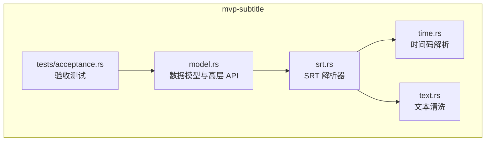
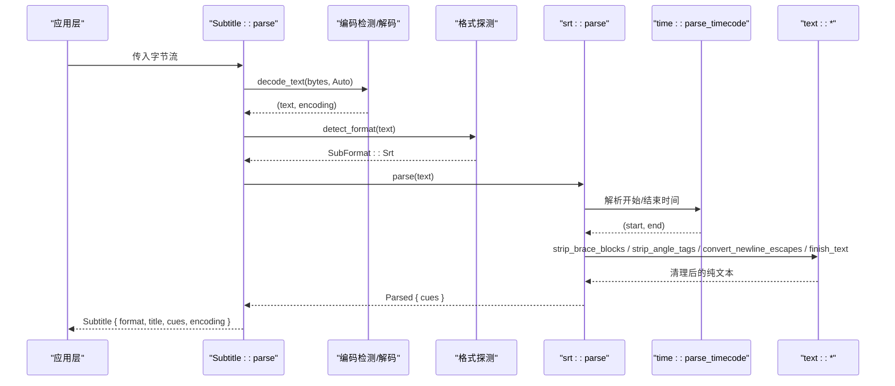
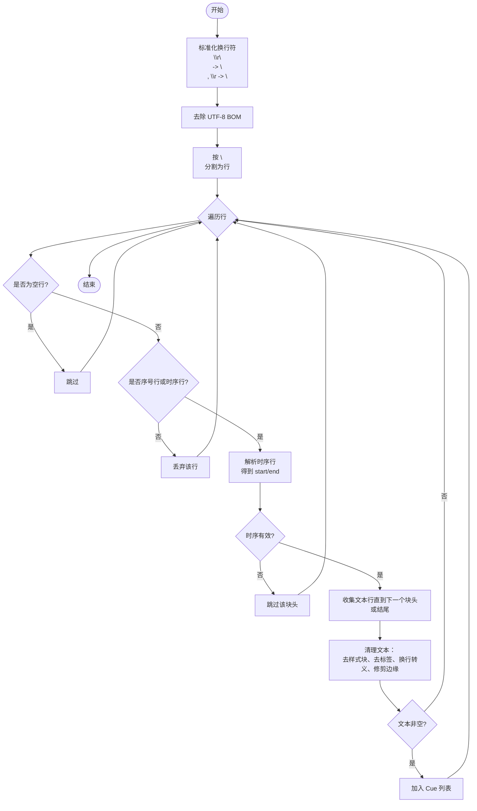
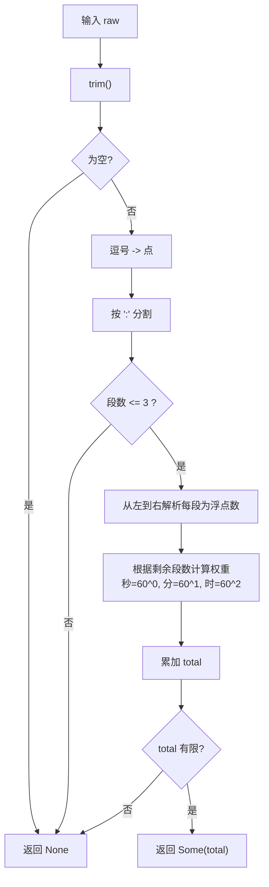
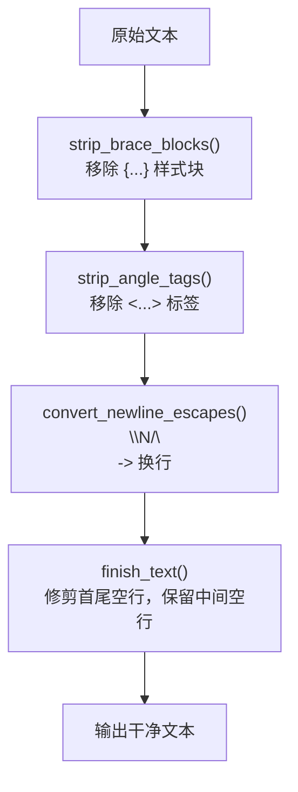
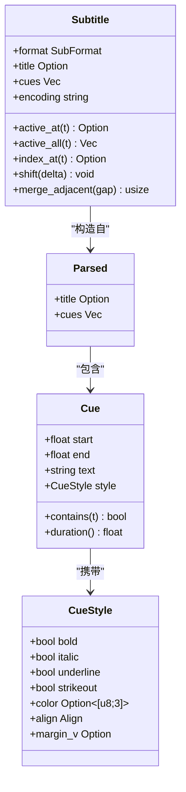
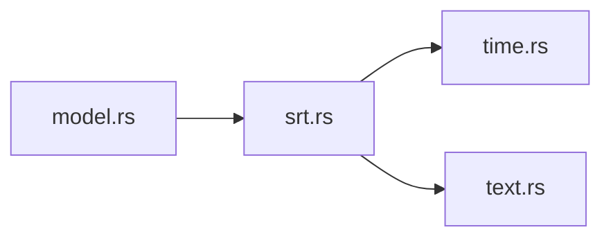

# SRT 字幕解析器

<cite>
**本文引用的文件**   
- [srt.rs](file://crates/mvp-subtitle/src/srt.rs)
- [model.rs](file://crates/mvp-subtitle/src/model.rs)
- [time.rs](file://crates/mvp-subtitle/src/time.rs)
- [text.rs](file://crates/mvp-subtitle/src/text.rs)
- [acceptance.rs](file://crates/mvp-subtitle/tests/acceptance.rs)
</cite>

## 目录
1. [引言](#引言)
2. [项目结构](#项目结构)
3. [核心组件](#核心组件)
4. [架构总览](#架构总览)
5. [详细组件分析](#详细组件分析)
6. [依赖关系分析](#依赖关系分析)
7. [性能与复杂度](#性能与复杂度)
8. [故障排查指南](#故障排查指南)
9. [结论](#结论)

## 引言
本技术文档聚焦于 SubRip（SRT）字幕格式解析器的实现，目标是帮助开发者理解：
- SRT 的语法结构与解析流程
- 时间戳格式的兼容策略（HH:MM:SS,mmm 与 HH:MM:SS.mmm）
- 容错机制（缺失序号、换行符差异、UTF-8 BOM、空白行、损坏块等）
- 文本清理过程（HTML 标签移除、样式块过滤、换行转义转换）
- 错误处理策略与健壮性设计

该解析器以“尽可能多地解析出可用字幕”为第一原则：遇到局部损坏时跳过问题片段，而不是让整个解析失败。

## 项目结构
SRT 解析逻辑位于 `mvp-subtitle` crate 中，关键文件如下：
- `srt.rs`：SRT 主解析器，负责行扫描、时序解析、文本收集与清理
- `time.rs`：通用时间码解析器，支持多种时间格式
- `text.rs`：文本清洗工具，包括 HTML 标签移除、花括号样式块过滤、换行转义转换
- `model.rs`：公共数据模型与格式探测、排序、合并等高层 API
- `tests/acceptance.rs`：端到端验收测试，覆盖多编码、BOM、标记清理、半开区间等场景

**图表来源**
- [srt.rs:1-20](file://crates/mvp-subtitle/src/srt.rs#L1-L20)
- [model.rs:274-294](file://crates/mvp-subtitle/src/model.rs#L274-L294)

**章节来源**
- [srt.rs:1-20](file://crates/mvp-subtitle/src/srt.rs#L1-L20)
- [model.rs:1-10](file://crates/mvp-subtitle/src/model.rs#L1-L10)

## 核心组件
- SRT 解析器：按行扫描输入，识别序号行与时序行，收集文本并清理，最终生成 `Cue` 列表
- 时间码解析器：统一解析逗号或点分隔的小数毫秒，支持缺小时字段、多余小时数字等变体
- 文本清洗器：移除 `<i>`、`` 等标签，过滤 `{...}` 样式块，将 `\N`/`\n` 转为真实换行
- 数据模型：定义 `Cue`、`CueStyle`、`Parsed`、`Subtitle` 等类型，并提供查询、偏移、合并等能力

**章节来源**
- [srt.rs:22-122](file://crates/mvp-subtitle/src/srt.rs#L22-L122)
- [time.rs:8-51](file://crates/mvp-subtitle/src/time.rs#L8-L51)
- [text.rs:34-155](file://crates/mvp-subtitle/src/text.rs#L34-L155)
- [model.rs:73-119](file://crates/mvp-subtitle/src/model.rs#L73-L119)

## 架构总览
SRT 解析的整体调用链从高层 API 进入，再分发到具体格式解析器。

**图表来源**
- [model.rs:149-165](file://crates/mvp-subtitle/src/model.rs#L149-L165)
- [model.rs:274-294](file://crates/mvp-subtitle/src/model.rs#L274-L294)
- [model.rs:306-351](file://crates/mvp-subtitle/src/model.rs#L306-L351)
- [srt.rs:26-122](file://crates/mvp-subtitle/src/srt.rs#L26-L122)
- [time.rs:17-51](file://crates/mvp-subtitle/src/time.rs#L17-L51)
- [text.rs:34-155](file://crates/mvp-subtitle/src/text.rs#L34-L155)

## 详细组件分析

### SRT 解析器（srt.rs）
SRT 解析器采用逐行扫描的方式，核心行为如下：
- 标准化换行：先将 `\r\n` 替换为 `\n`，再将裸 `\r` 替换为 `\n`
- 去除 UTF-8 BOM：若存在 BOM，则剥离后再解析
- 行扫描与块识别：
  - 空行直接跳过
  - 序号行（仅数字）后紧跟时序行（包含 `-->`）时，视为一个块的开头
  - 若无序号行，但当前行是时序行，也作为块头
  - 其他行视为无关文本，丢弃
- 时序行解析：
  - 使用 `parse_timing_line` 提取左右两个时间戳
  - 忽略旧式坐标后缀（如 `X1:... Y1:...`）
- 文本收集：
  - 从时序行下一行开始收集，直到遇到下一个时序行、序号行+时序行组合，或文件末尾
  - 允许 cue 内部出现空行；通过前瞻判断后续是否像新块来决定是否结束当前 cue
- 文本清理：
  - 移除花括号样式块（如 `{\an8}`）
  - 移除 HTML 风格标签（如 `<i>`、``）
  - 将 `\N`/`\n` 转换为真实换行
  - 修剪首尾空行，保留中间空行
- 结果构建：
  - 非空文本才加入 `Cue` 列表
  - 解析失败的时序行会跳过该块，继续解析后续内容

**图表来源**
- [srt.rs:26-122](file://crates/mvp-subtitle/src/srt.rs#L26-L122)

**章节来源**
- [srt.rs:26-122](file://crates/mvp-subtitle/src/srt.rs#L26-L122)

### 时间码解析器（time.rs）
时间码解析器支持以下变体：
- `HH:MM:SS,mmm`（SRT 常用，逗号小数）
- `HH:MM:SS.mmm`（点小数）
- `MM:SS,mmm` 或 `MM:SS.mmm`（缺少小时字段）
- `SS,mmm` 或 `SS.mmm`（仅秒）
- 任意位数的小时字段（例如超长小时）
- 小数部分可以是百分之一秒或千分之一秒

解析步骤：
- 规范化逗号为点
- 按冒号分割字段，最多三段
- 从右向左计算权重（秒、分、时），累加为浮点秒
- 对非法输入返回 `None`，由上层跳过对应 cue

**图表来源**
- [time.rs:17-51](file://crates/mvp-subtitle/src/time.rs#L17-L51)

**章节来源**
- [time.rs:8-51](file://crates/mvp-subtitle/src/time.rs#L8-L51)

### 文本清洗器（text.rs）
文本清洗器提供三个关键能力：
- 移除 HTML 风格标签：
  - 识别 `<i>`、`</b>`、``、`<v Name>`、WebVTT 时间戳标签等
  - 不匹配或非标签形式的尖括号（如 `a < b > c`）保留原样
  - 未闭合标签不会吞掉后续文本
- 移除花括号样式块：
  - 删除 `{\an8}`、`{\pos(320,240)}` 等
  - 未闭合或嵌套的花括号保留原样
- 换行转义转换：
  - 将 `\N` 和 `\n` 转换为真实换行符
  - 其他反斜杠（如路径中的 `\t`、`\f`）保持原样

此外还提供实体解码与边缘空行修剪，确保输出整洁且保留语义上的中间空行。

**图表来源**
- [text.rs:34-155](file://crates/mvp-subtitle/src/text.rs#L34-L155)

**章节来源**
- [text.rs:34-155](file://crates/mvp-subtitle/src/text.rs#L34-L155)

### 数据模型与高层 API（model.rs）
- `Cue`：表示一个字幕条目，包含起止时间（秒）、纯文本、展示样式
- `CueStyle`：粗体、斜体、下划线、删除线、颜色、对齐、垂直边距等
- `Parsed`：解析结果，包含标题与字幕条目列表
- `Subtitle`：封装格式、标题、已排序的字幕条目、编码信息，并提供：
  - `active_at(t)`：返回在时间 `t` 最合适的活跃字幕
  - `active_all(t)`：返回所有在时间 `t` 活跃的字幕
  - `index_at(t)`：返回覆盖 `t` 的字幕索引，或下一个起始索引
  - `shift(delta)`：整体偏移时间并保持有序
  - `merge_adjacent(gap)`：合并相邻且文本相同的短切分

**图表来源**
- [model.rs:50-119](file://crates/mvp-subtitle/src/model.rs#L50-L119)
- [model.rs:121-294](file://crates/mvp-subtitle/src/model.rs#L121-L294)

**章节来源**
- [model.rs:50-119](file://crates/mvp-subtitle/src/model.rs#L50-L119)
- [model.rs:121-294](file://crates/mvp-subtitle/src/model.rs#L121-L294)

## 依赖关系分析
SRT 解析器依赖时间码解析器与文本清洗器，并通过公共模型对外暴露能力。

**图表来源**
- [srt.rs:18-20](file://crates/mvp-subtitle/src/srt.rs#L18-L20)
- [model.rs:274-294](file://crates/mvp-subtitle/src/model.rs#L274-L294)

**章节来源**
- [srt.rs:18-20](file://crates/mvp-subtitle/src/srt.rs#L18-L20)
- [model.rs:274-294](file://crates/mvp-subtitle/src/model.rs#L274-L294)

## 性能与复杂度
- 时间复杂度：
  - SRT 解析器线性扫描输入行，总体 O(n)
  - 时间码解析对每个时间戳进行常数级操作，O(1)
  - 文本清洗对字符进行一次或多次线性扫描，O(m)
- 空间复杂度：
  - 主要消耗在构建输出字符串与 `Vec<Cue>`，近似 O(n + m)
- 健壮性优化：
  - 对异常输入尽早返回 `None`，避免崩溃
  - 对未闭合标签/花括号限制扫描长度，防止长串吞噬内存
  - 对超大文件进行格式探测上限控制（例如只扫描前若干行）

[本节为一般性指导，不直接分析具体文件]

## 故障排查指南
常见损坏场景与处理策略：
- 缺失序号行：
  - 若时序行存在，仍可作为块头解析
- 换行符不一致：
  - 自动将 `\r\n` 与裸 `\r` 归一化为 `\n`
- UTF-8 BOM：
  - 自动检测并剥离，不影响文本内容
- 时序行损坏：
  - 跳过该块，继续解析后续内容
- 文本中包含 HTML 标签或 ASS 样式块：
  - 自动移除，保留纯文本
- 文本中的 `\N`/`\n`：
  - 转换为真实换行，便于渲染
- 空行出现在 cue 内部：
  - 通过前瞻判断是否为新块，保留语义空行

参考验收测试用例可验证上述行为：
- 正常 SRT 解析
- 点分隔与缺小时字段
- 标记清理与换行转义
- GBK 编码与 BOM 处理
- 半开区间 `[start, end)`
- 偏移与合并
- 损坏输入不崩溃

**章节来源**
- [acceptance.rs:9-135](file://crates/mvp-subtitle/tests/acceptance.rs#L9-L135)
- [acceptance.rs:214-311](file://crates/mvp-subtitle/tests/acceptance.rs#L214-L311)

## 结论
该 SRT 解析器以“容错优先”的设计哲学，确保在真实世界的不规范文件中仍能尽可能解析出可用的字幕。其核心优势包括：
- 对时间戳格式的广泛兼容
- 对文本标记与样式的稳健清理
- 对换行符与 BOM 的自动适配
- 对损坏片段的局部跳过与整体成功

对于播放器集成而言，建议：
- 使用 `Subtitle::parse` 或 `Subtitle::parse_with_format` 作为入口
- 利用 `active_at`/`active_all` 获取活跃字幕
- 必要时调用 `shift` 与 `merge_adjacent` 调整时序与合并短切分
- 关注 `encoding` 字段用于显示媒体信息面板

[本节为总结性内容，不直接分析具体文件]