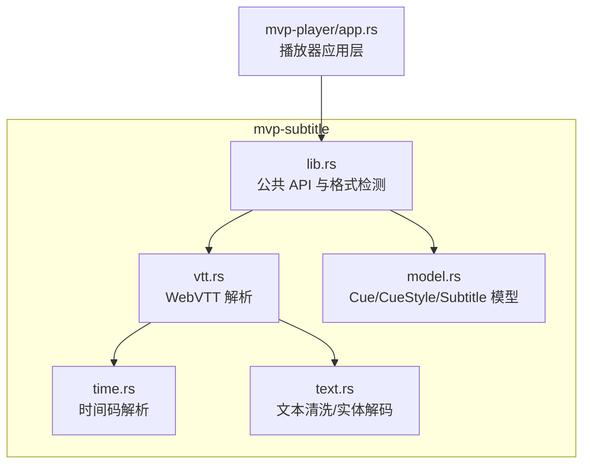
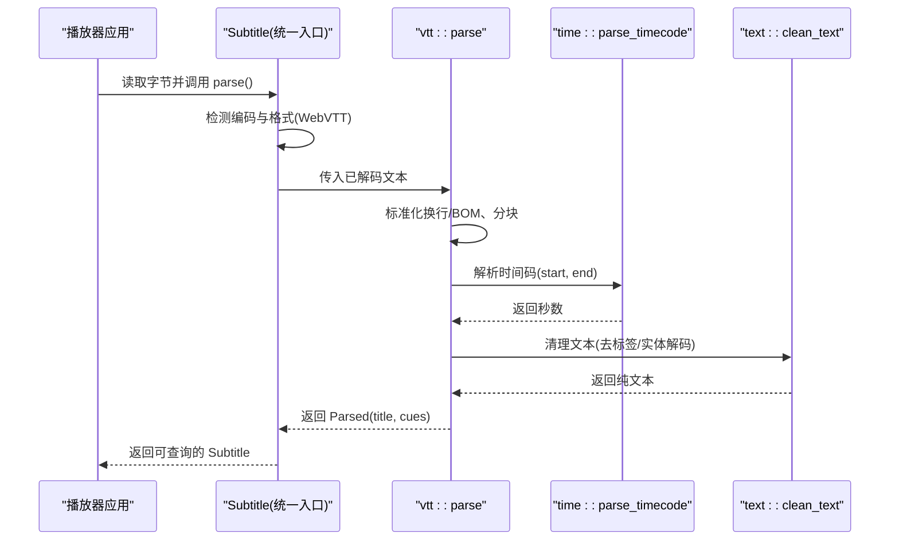
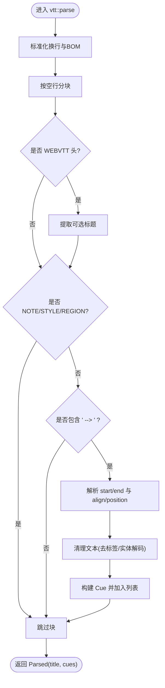
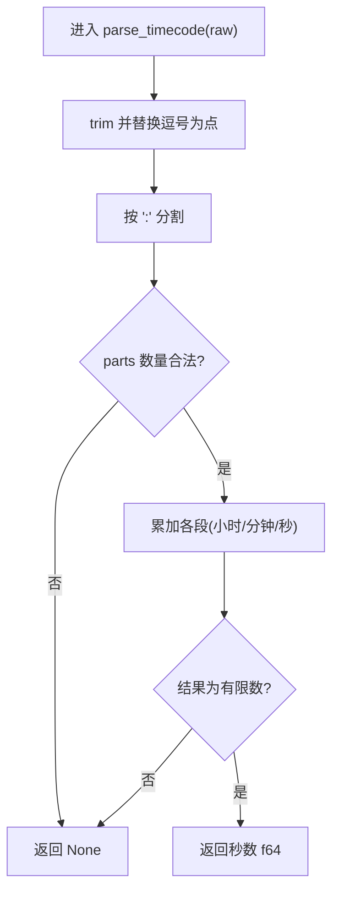
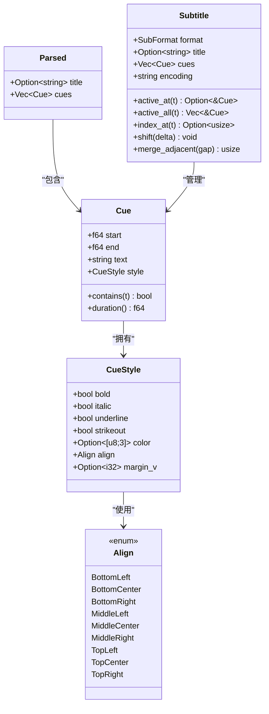
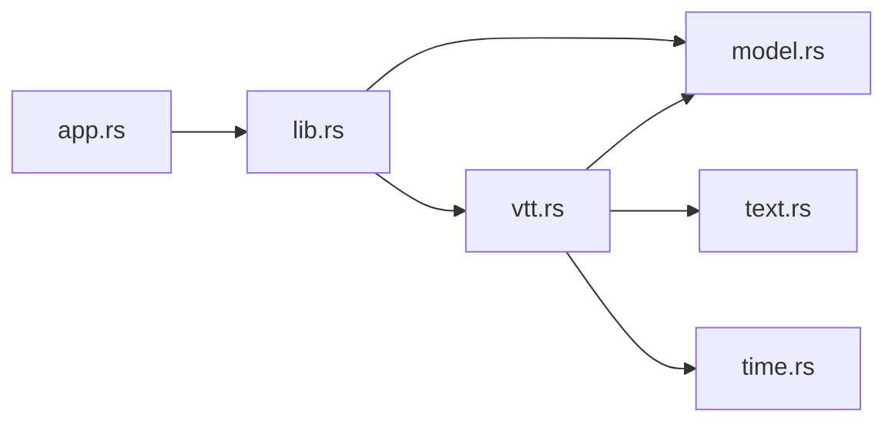
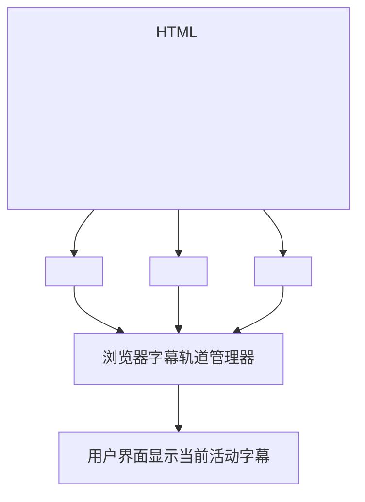

# WebVTT 字幕解析器

<cite>
**本文引用的文件**   
- [vtt.rs](file://crates/mvp-subtitle/src/vtt.rs)
- [model.rs](file://crates/mvp-subtitle/src/model.rs)
- [time.rs](file://crates/mvp-subtitle/src/time.rs)
- [text.rs](file://crates/mvp-subtitle/src/text.rs)
- [lib.rs](file://crates/mvp-subtitle/src/lib.rs)
- [Cargo.toml](file://crates/mvp-subtitle/Cargo.toml)
- [app.rs](file://crates/mvp-player/src/app.rs)
</cite>

## 目录
1. [简介](#简介)
2. [项目结构](#项目结构)
3. [核心组件](#核心组件)
4. [架构总览](#架构总览)
5. [详细组件分析](#详细组件分析)
6. [依赖关系分析](#依赖关系分析)
7. [性能与健壮性](#性能与健壮性)
8. [故障排查指南](#故障排查指南)
9. [结论](#结论)
10. [附录：WebVTT 与 HTML5 视频轨道集成示例](#附录webvtt-与-html5-视频轨道集成示例)

## 简介
本技术文档聚焦于仓库中的 WebVTT（Web Video Text Tracks）字幕格式解析器，覆盖以下关键点：
- 头部标识 WEBVTT、标题提取
- 元数据块与注释处理：NOTE、STYLE、REGION
- 时间戳格式支持：HH:MM:SS.mmm 与 MM:SS.mmm，以及通用时间码解析
- VTT 时间轴设置：align、position、line（语法识别但不消费）
- 样式标记清理：内联标签如 <i>、<b>、<u>、、<v Name> 等被剥离为纯文本
- 区域设置 Region 与布局选项的解析现状
- 多语言字幕与强制显示选项在 HTML5 视频轨道中的使用建议

该解析器属于 mvp-subtitle crate，遵循“永不失败”的设计原则：对损坏输入进行降级处理，而不是抛出错误或中断整个文件的解析。

## 项目结构
mvp-subtitle crate 提供统一的字幕模型与多种字幕格式的解析实现。WebVTT 解析逻辑位于 vtt.rs，并与共享的时间码解析 time.rs、文本清洗 text.rs 以及统一的数据模型 model.rs 协作。播放器应用通过 app.rs 加载外部字幕文件并交给 Subtitle 接口进行解析与查询。

图表来源
- [vtt.rs:1-64](file://crates/mvp-subtitle/src/vtt.rs#L1-L64)
- [time.rs:1-51](file://crates/mvp-subtitle/src/time.rs#L1-L51)
- [text.rs:1-155](file://crates/mvp-subtitle/src/text.rs#L1-L155)
- [model.rs:1-136](file://crates/mvp-subtitle/src/model.rs#L1-L136)
- [lib.rs:1-59](file://crates/mvp-subtitle/src/lib.rs#L1-L59)
- [app.rs:613-642](file://crates/mvp-player/src/app.rs#L613-L642)

章节来源
- [lib.rs:1-59](file://crates/mvp-subtitle/src/lib.rs#L1-L59)
- [Cargo.toml:1-11](file://crates/mvp-subtitle/Cargo.toml#L1-L11)

## 核心组件
- WebVTT 解析器：负责识别 WEBVTT 头、跳过 NOTE/STYLE/REGION 块、解析时间行与提示文本、提取对齐方式与位置信息。
- 时间码解析器：统一解析 HH:MM:SS.mmm、MM:SS.mmm 及更宽松的时间格式，返回秒级浮点值。
- 文本清洗器：剥离角度括号标签、HTML 实体解码、换行转义与空白行修剪。
- 数据模型：Cue（时间范围 + 文本 + 样式）、CueStyle（粗体/斜体/下划线/删除线/颜色/对齐/垂直边距）、Align（九宫格对齐）、Parsed（标题 + 提示列表）、Subtitle（带格式/编码的统一封装）。

章节来源
- [vtt.rs:1-64](file://crates/mvp-subtitle/src/vtt.rs#L1-L64)
- [time.rs:1-51](file://crates/mvp-subtitle/src/time.rs#L1-L51)
- [text.rs:1-155](file://crates/mvp-subtitle/src/text.rs#L1-L155)
- [model.rs:1-136](file://crates/mvp-subtitle/src/model.rs#L1-L136)

## 架构总览
WebVTT 解析流程从应用层调用开始，进入 Subtitle 统一入口，再分发到具体格式解析器。对于 WebVTT，解析器会：
1. 标准化换行与 BOM
2. 按空行分块
3. 识别 WEBVTT 头并提取可选标题
4. 跳过 NOTE/STYLE/REGION 块
5. 解析时间行，提取 start/end 与 align/position
6. 清理提示文本，剥离标签与实体
7. 构造 Cue 并收集到 Parsed
8. 由 Subtitle 统一排序与查询

图表来源
- [lib.rs:149-165](file://crates/mvp-subtitle/src/lib.rs#L149-L165)
- [model.rs:272-294](file://crates/mvp-subtitle/src/model.rs#L272-L294)
- [vtt.rs:15-64](file://crates/mvp-subtitle/src/vtt.rs#L15-L64)
- [time.rs:17-51](file://crates/mvp-subtitle/src/time.rs#L17-L51)
- [text.rs:151-155](file://crates/mvp-subtitle/src/text.rs#L151-L155)

## 详细组件分析

### WebVTT 解析器（vtt.rs）
- 头部标识与标题
  - 识别 WEBVTT（大小写不敏感），并支持 “WEBVTT - Title” 形式的标题提取。
  - 若标题为空则不设置 title。
- 元数据块与注释
  - NOTE、STYLE、REGION 块被整体跳过，不参与提示解析。
  - NOTE 支持单行或多行内容；STYLE 用于 CSS 样式定义；REGION 用于区域布局定义（当前仅跳过，未解析其属性）。
- 时间行解析
  - 支持两种时间格式：HH:MM:SS.mmm 与 MM:SS.mmm。
  - 支持时间轴设置：align:start|center|end（含 left/middle/right 别名），position:N%（百分比）。
  - line: 语法被识别但不消费，因为 CueStyle 没有垂直行字段。
  - 当缺少 align 时，根据 position 百分比推断对齐锚点：<33% 左，>66% 右，中间居中。
- 文本清理
  - 剥离 <i>/<b>/<u>//<v Name>/<时间戳标签> 等角度括号标签。
  - 解码 &lt; &gt; &amp; &nbsp; &quot; &#39; 等实体。
  - 去除首尾空白行，保留中间空行以维持段落结构。

图表来源
- [vtt.rs:15-64](file://crates/mvp-subtitle/src/vtt.rs#L15-L64)
- [vtt.rs:85-99](file://crates/mvp-subtitle/src/vtt.rs#L85-L99)
- [vtt.rs:101-149](file://crates/mvp-subtitle/src/vtt.rs#L101-L149)
- [vtt.rs:151-154](file://crates/mvp-subtitle/src/text.rs#L151-L154)

章节来源
- [vtt.rs:1-64](file://crates/mvp-subtitle/src/vtt.rs#L1-L64)
- [vtt.rs:85-99](file://crates/mvp-subtitle/src/vtt.rs#L85-L99)
- [vtt.rs:101-149](file://crates/mvp-subtitle/src/vtt.rs#L101-L149)
- [vtt.rs:151-154](file://crates/mvp-subtitle/src/vtt.rs#L151-L154)

### 时间码解析（time.rs）
- 支持的格式
  - HH:MM:SS.mmm
  - MM:SS.mmm
  - 也兼容逗号作为小数分隔符（SubRip 风格）
  - 允许任意位数的小数部分，例如百分之一秒或千分之一秒
- 行为
  - 非数字或非法格式返回 None，避免破坏整体解析
  - 最终结果必须为有限浮点数

图表来源
- [time.rs:17-51](file://crates/mvp-subtitle/src/time.rs#L17-L51)

章节来源
- [time.rs:1-51](file://crates/mvp-subtitle/src/time.rs#L1-L51)

### 文本清洗（text.rs）
- 角度标签剥离
  - 识别 <i>、</b>、、<v Name>、<时间戳> 等标签
  - 非标签-like 的比较表达式（如 a < b > c）保持原样
  - 未闭合标签不会吞掉后续文本
- 大括号块剥离
  - 移除 ASS 风格的 {\\an8}、{\\pos(x,y)} 等覆盖块
- 实体解码
  - 解码 &lt; &gt; &amp; &nbsp; &quot; &#39;
  - &amp; 最后解码以避免二次展开
- 换行转义
  - 将 \N 与 \n 转换为真实换行
- 文本收尾
  - 每行 trim，去除首尾空行，保留中间空行

章节来源
- [text.rs:1-155](file://crates/mvp-subtitle/src/text.rs#L1-L155)

### 数据模型（model.rs）
- Cue
  - 半开区间 [start, end)，duration 非负
- CueStyle
  - bold、italic、underline、strikeout、color、align、margin_v
- Align
  - 九宫格对齐：BottomLeft/Center/Right、MiddleLeft/Center/Right、TopLeft/Center/Right
- Parsed
  - title 与 cues 列表
- Subtitle
  - format、title、cues（按 start 排序）、encoding
  - active_at(t) 返回最佳活动提示（重叠时取最晚 start）
  - active_all(t) 返回所有活动提示
  - index_at(t) 返回当前或下一个提示索引
  - shift(delta) 对所有提示偏移并重新排序
  - merge_adjacent(gap) 合并相邻且文本相同的提示

图表来源
- [model.rs:26-84](file://crates/mvp-subtitle/src/model.rs#L26-L84)
- [model.rs:107-136](file://crates/mvp-subtitle/src/model.rs#L107-L136)
- [model.rs:138-294](file://crates/mvp-subtitle/src/model.rs#L138-L294)

章节来源
- [model.rs:1-136](file://crates/mvp-subtitle/src/model.rs#L1-L136)
- [model.rs:138-294](file://crates/mvp-subtitle/src/model.rs#L138-L294)

## 依赖关系分析
- vtt.rs 依赖：
  - model.rs：Cue、CueStyle、Align、Parsed
  - text.rs：decode_entities、finish_text、strip_angle_tags
  - time.rs：parse_timecode
- lib.rs 暴露公共 API：
  - Subtitle、SubFormat、Cue、CueStyle、Align、Parsed
  - 格式检测 detect_format 与扩展名映射
- 播放器应用层 app.rs：
  - 通过 Subtitle::parse 加载外部字幕文件，并设置到引擎

图表来源
- [vtt.rs:10-12](file://crates/mvp-subtitle/src/vtt.rs#L10-L12)
- [lib.rs:47-59](file://crates/mvp-subtitle/src/lib.rs#L47-L59)
- [app.rs:613-642](file://crates/mvp-player/src/app.rs#L613-L642)

章节来源
- [vtt.rs:10-12](file://crates/mvp-subtitle/src/vtt.rs#L10-L12)
- [lib.rs:47-59](file://crates/mvp-subtitle/src/lib.rs#L47-L59)
- [app.rs:613-642](file://crates/mvp-player/src/app.rs#L613-L642)

## 性能与健壮性
- 健壮性
  - 解析路径不使用 unwrap/panic，遇到无效 UTF-8、异常时间或截断文件均优雅降级
  - 损坏的时间行会被跳过，不影响其他有效提示
- 性能
  - 时间码解析为 O(n) 线性扫描
  - 文本清洗为 O(n) 单次遍历
  - 提示排序使用稳定比较（NaN 视为相等）
- 设计约束
  - 半开区间避免边界重复激活
  - 对齐推断基于 position 百分比，减少缺失设置的歧义

章节来源
- [lib.rs:18-43](file://crates/mvp-subtitle/src/lib.rs#L18-L43)
- [model.rs:86-105](file://crates/mvp-subtitle/src/model.rs#L86-L105)
- [model.rs:297-300](file://crates/mvp-subtitle/src/model.rs#L297-L300)

## 故障排查指南
- 常见问题
  - 时间格式错误：确保使用 HH:MM:SS.mmm 或 MM:SS.mmm；逗号也可作为小数分隔符
  - 对齐缺失：若未提供 align，将根据 position 百分比推断
  - 文本乱码：检查文件编码；crate 自动检测编码并返回 encoding 名称
  - 样式丢失：WebVTT 内联标签（<i>/<b>/<u>）会被剥离为纯文本，不会设置 CueStyle 标志
- 定位方法
  - 查看 Subtitle.encoding 确认实际解码编码
  - 使用 Subtitle.active_at(t) 验证时间区间是否正确
  - 检查 vtt.rs 中 is_header_line、is_skippable_block、parse_timing_line 的行为是否符合预期

章节来源
- [lib.rs:33-43](file://crates/mvp-subtitle/src/lib.rs#L33-L43)
- [vtt.rs:85-99](file://crates/mvp-subtitle/src/vtt.rs#L85-L99)
- [vtt.rs:101-149](file://crates/mvp-subtitle/src/vtt.rs#L101-L149)

## 结论
该 WebVTT 解析器实现了稳健、容错的字幕解析流程，涵盖头部标识、元数据块跳过、时间轴设置、文本清理与统一数据模型。尽管当前未解析 REGION 与 STYLE 的具体属性，但已足够支撑大多数播放场景。结合播放器应用层的加载与查询能力，可在 UI 中正确显示多语言字幕与强制显示选项。

## 附录：WebVTT 与 HTML5 视频轨道集成示例
说明如何正确使用 WebVTT 与 HTML5 视频轨道，包括多语言字幕与强制显示选项。以下为概念性步骤与要点，不涉及具体代码片段：

- 基本用法
  - 在 <video> 元素中添加多个 <track kind="subtitles">，每个 track 指向一个 .vtt 文件
  - 使用 default 属性指定默认轨道
  - 使用 srclang 指定语言代码（如 zh-CN、en-US）
  - 使用 label 提供用户可见的名称
- 多语言字幕
  - 为不同语言添加多个 track，分别设置 srclang 与 label
  - 浏览器会根据用户偏好或脚本选择显示哪个轨道
- 强制显示选项
  - 使用 forced="true" 标记强制轨道（例如翻译或关键对话）
  - 强制轨道通常优先显示，即使未被用户显式选择
- 动态控制
  - 可通过 JavaScript 切换显示的轨道（track.mode = show/hide/cancel）
  - 监听 onloadedmetadata 与 oncuechange 事件以同步字幕变化
- 与播放器集成
  - MVP 播放器通过 Subtitle::parse 加载外部 .vtt 文件，并在 UI 中显示
  - 若需要与 HTML5 轨道保持一致的样式与行为，可将解析后的 Cue 文本渲染到自定义 UI 层

[此图为概念性流程图，不直接映射具体源码文件，因此不提供图表来源]