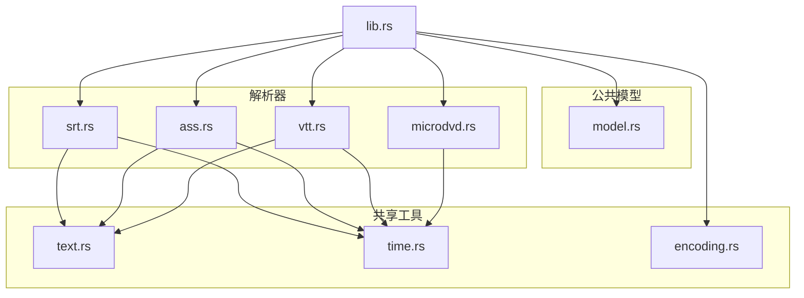
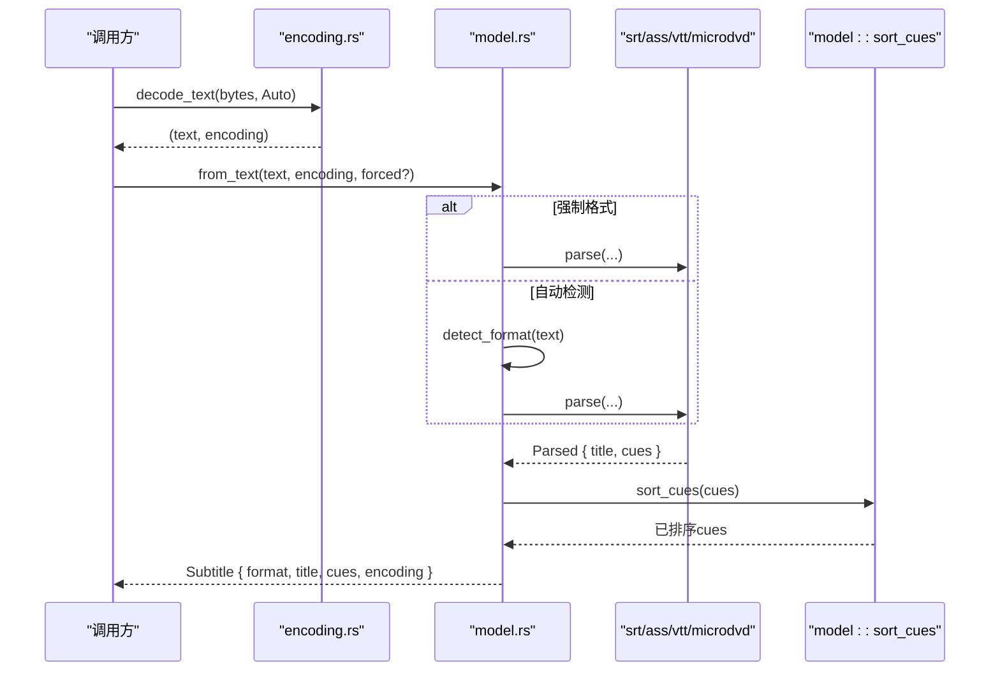
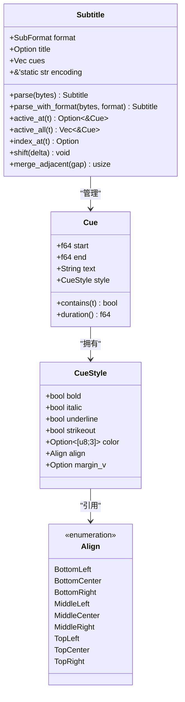
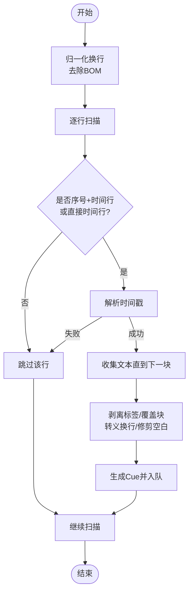
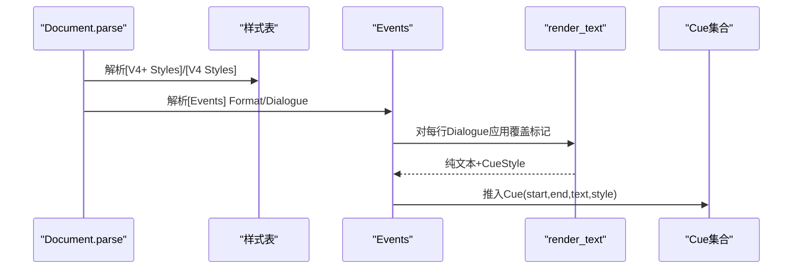
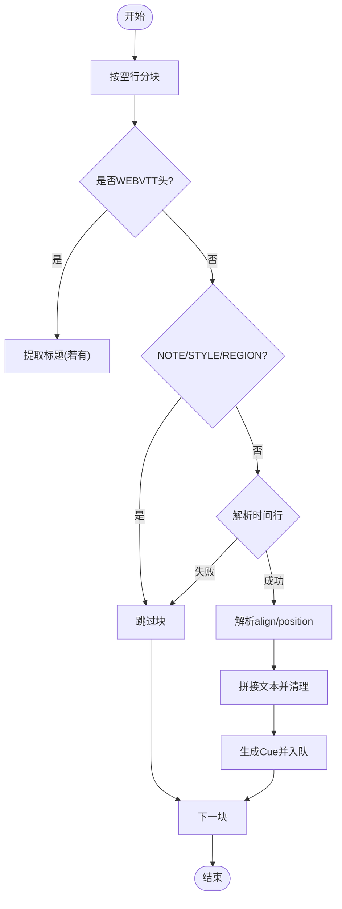
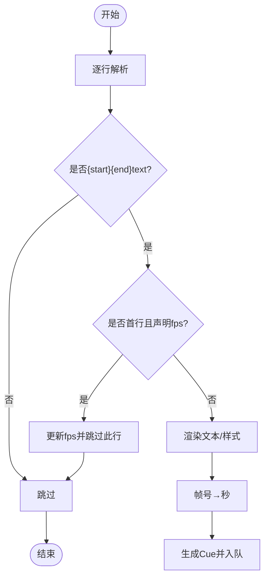
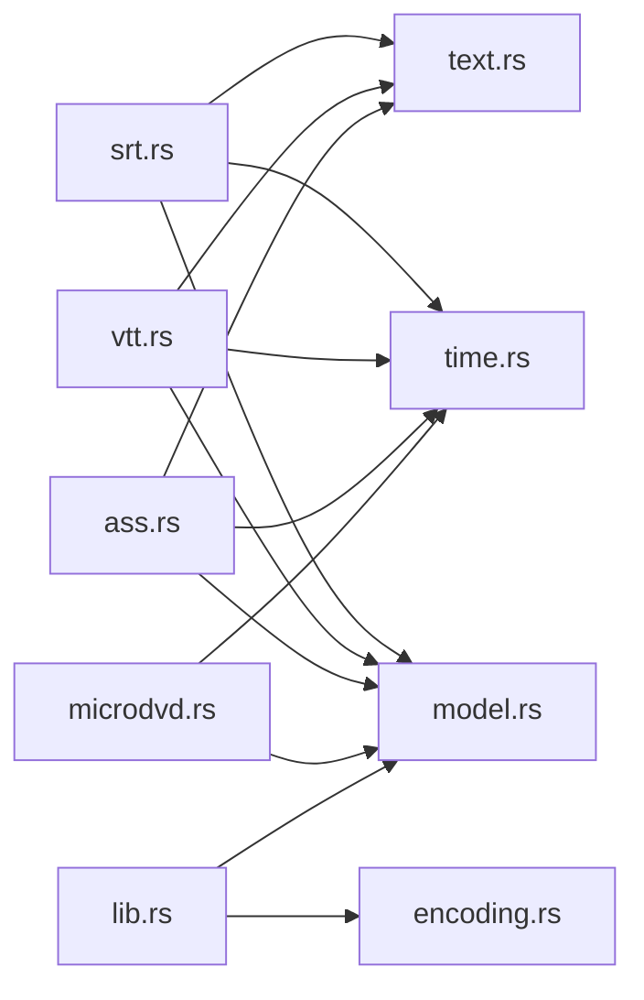

# 文本字幕解析

<cite>
**本文引用的文件**
- [lib.rs](file://crates/mvp-subtitle/src/lib.rs)
- [model.rs](file://crates/mvp-subtitle/src/model.rs)
- [srt.rs](file://crates/mvp-subtitle/src/srt.rs)
- [ass.rs](file://crates/mvp-subtitle/src/ass.rs)
- [vtt.rs](file://crates/mvp-subtitle/src/vtt.rs)
- [microdvd.rs](file://crates/mvp-subtitle/src/microdvd.rs)
- [text.rs](file://crates/mvp-subtitle/src/text.rs)
- [time.rs](file://crates/mvp-subtitle/src/time.rs)
- [encoding.rs](file://crates/mvp-subtitle/src/encoding.rs)
- [acceptance.rs](file://crates/mvp-subtitle/tests/acceptance.rs)
</cite>

## 目录
1. [简介](#简介)
2. [项目结构](#项目结构)
3. [核心组件](#核心组件)
4. [架构总览](#架构总览)
5. [详细组件分析](#详细组件分析)
6. [依赖关系分析](#依赖关系分析)
7. [性能考量](#性能考量)
8. [故障排查指南](#故障排查指南)
9. [结论](#结论)
10. [附录：格式示例与解析结果对比](#附录格式示例与解析结果对比)

## 简介
本模块为多媒体播放器提供纯逻辑的字幕解析能力，支持 SRT、ASS/SSA、WebVTT、MicroDVD 四种文本字幕格式。其设计原则是“永不失败”和“永不崩溃”，对损坏数据块、无效时间戳、非法编码等场景进行优雅降级，确保部分可用优于全部不可用。所有格式均被标准化为统一的 Cue 模型（起始时间、结束时间、纯文本内容、样式），并提供自动格式检测与强制格式指定能力。

## 项目结构
该子库位于 crates/mvp-subtitle，采用按功能划分的模块化组织：
- model：统一的数据模型（Cue、CueStyle、Align、SubFormat、Subtitle）
- srt、ass、vtt、microdvd：各格式的独立解析器
- text、time、encoding：共享的文本清理、时间码解析、字符编码检测与解码
- lib：对外 API 入口，封装解析流程、格式检测、查询方法
- tests：端到端验收测试，覆盖多格式、多编码、边界情况

图表来源
- [lib.rs:47-59](file://crates/mvp-subtitle/src/lib.rs#L47-L59)
- [model.rs:1-136](file://crates/mvp-subtitle/src/model.rs#L1-L136)
- [srt.rs:18-26](file://crates/mvp-subtitle/src/srt.rs#L18-L26)
- [ass.rs:18-23](file://crates/mvp-subtitle/src/ass.rs#L18-L23)
- [vtt.rs:10-15](file://crates/mvp-subtitle/src/vtt.rs#L10-L15)
- [microdvd.rs:11-15](file://crates/mvp-subtitle/src/microdvd.rs#L11-L15)
- [text.rs:1-12](file://crates/mvp-subtitle/src/text.rs#L1-L12)
- [time.rs:1-16](file://crates/mvp-subtitle/src/time.rs#L1-L16)
- [encoding.rs:1-15](file://crates/mvp-subtitle/src/encoding.rs#L1-L15)

章节来源
- [lib.rs:1-59](file://crates/mvp-subtitle/src/lib.rs#L1-L59)
- [model.rs:1-136](file://crates/mvp-subtitle/src/model.rs#L1-L136)

## 核心组件
- 统一模型
  - SubFormat：Srt、Ass、WebVtt、MicroDvd、Unknown
  - Align：九宫格对齐枚举（BottomLeft/Center/Right、MiddleLeft/Center/Right、TopLeft/Center/Right）
  - CueStyle：粗体、斜体、下划线、删除线、颜色、对齐、垂直边距
  - Cue：半开区间[start, end)、纯文本、样式
  - Parsed：标题与Cue列表（由具体解析器返回）
  - Subtitle：包装后的完整轨道，含format/title/cues/encoding，并提供active_at、index_at、shift、merge_adjacent等方法
- 解析管线
  - 编码检测与解码（encoding）
  - 格式自动检测（model::detect_format）
  - 调用对应解析器（srt/ass/vtt/microdvd）
  - 规范化排序（sort_cues）
- 文本与时间工具
  - 角度标签剥离、花括号覆盖块剥离、换行转义转换、HTML实体解码、空白行修剪
  - 通用时间码解析（兼容多种分隔符与位数）

章节来源
- [model.rs:9-136](file://crates/mvp-subtitle/src/model.rs#L9-L136)
- [model.rs:138-295](file://crates/mvp-subtitle/src/model.rs#L138-L295)
- [text.rs:34-155](file://crates/mvp-subtitle/src/text.rs#L34-L155)
- [time.rs:8-51](file://crates/mvp-subtitle/src/time.rs#L8-L51)
- [encoding.rs:110-178](file://crates/mvp-subtitle/src/encoding.rs#L110-L178)

## 架构总览
整体解析流程如下：输入字节流先经编码检测与解码，再根据内容或扩展名推断格式；随后交由对应解析器生成Paged；最后统一排序并封装为Subtitle。

图表来源
- [model.rs:149-295](file://crates/mvp-subtitle/src/model.rs#L149-L295)
- [model.rs:302-352](file://crates/mvp-subtitle/src/model.rs#L302-L352)
- [encoding.rs:150-178](file://crates/mvp-subtitle/src/encoding.rs#L150-L178)

## 详细组件分析

### 统一数据模型（Cue/CueStyle/Align/Subtitle）
- Cue 使用半开区间 [start, end)，保证相邻cue在边界点不重复激活；duration 非负化；NaN 查询不被包含。
- CueStyle 仅承载可渲染的最小属性集：字体样式、颜色、对齐、垂直边距。
- Align 映射数字键盘布局（1-9）及 SSA 遗留值（10/11）。
- Subtitle 提供：
  - active_at(t)：返回当前最佳cue（重叠时取start最大的）
  - active_all(t)：返回所有活跃cue（用于叠字/卡拉OK）
  - index_at(t)：定位当前或下一个cue索引
  - shift(delta)：整体偏移时间并重新排序
  - merge_adjacent(gap)：合并相同文本且间隔小于gap的相邻cue

图表来源
- [model.rs:26-136](file://crates/mvp-subtitle/src/model.rs#L26-L136)
- [model.rs:138-295](file://crates/mvp-subtitle/src/model.rs#L138-L295)

章节来源
- [model.rs:26-136](file://crates/mvp-subtitle/src/model.rs#L26-L136)
- [model.rs:138-295](file://crates/mvp-subtitle/src/model.rs#L138-L295)

### SRT 解析（SubRip）
- 时间轴语法：支持 HH:MM:SS,mmm 与 MM:SS,mmm，逗号或点均可作为小数分隔；允许缺失小时字段或多位小时。
- 文本处理：剥离 <i>/ 等角度标签、{\an8} 等花括号覆盖块；将 \N/\n 转为真实换行；保留中间空行但修剪首尾空行。
- 容错：跳过无法解析的时间行；容忍缺失序号行、多余尾部垃圾、末尾无换行；空白行内嵌于cue中时智能判断是否结束。
- 输出：CueStyle 保持默认（SRT 内联标记不设置样式标志）。

图表来源
- [srt.rs:26-122](file://crates/mvp-subtitle/src/srt.rs#L26-L122)
- [srt.rs:129-152](file://crates/mvp-subtitle/src/srt.rs#L129-L152)
- [text.rs:34-155](file://crates/mvp-subtitle/src/text.rs#L34-L155)
- [time.rs:8-51](file://crates/mvp-subtitle/src/time.rs#L8-L51)

章节来源
- [srt.rs:1-152](file://crates/mvp-subtitle/src/srt.rs#L1-L152)
- [text.rs:34-155](file://crates/mvp-subtitle/src/text.rs#L34-L155)
- [time.rs:8-51](file://crates/mvp-subtitle/src/time.rs#L8-L51)

### ASS/SSA 解析（Advanced SubStation Alpha / Sub Station Alpha）
- 文档结构：读取 [Script Info] 中的 Title；从 [V4+ Styles]/[V4 Styles] 构建样式表；从 [Events] 读取 Dialogue。
- 列顺序：以 Events 的 Format: 声明为准，支持 Text 列不在末尾的情况。
- 样式与覆盖：
  - 样式表：Bold/Italic/Underline/StrikeOut、PrimaryColour（BGR）、Alignment（1-9 及 10/11 遗留）、MarginV。
  - 覆盖标记：\b/\i/\u/\s 开关样式；\c/&H...& 设置颜色；\an/\a 设置对齐；\pos(y) 设置垂直边距；\r 恢复行级样式；\p1...\p0 绘图块丢弃。
  - 转义：\N 换行、\n 空格、\h 不换行空格。
- 输出：CueStyle 携带样式信息；margin_v 优先级：事件 MarginV > 样式表 > 覆盖 \pos。

图表来源
- [ass.rs:46-81](file://crates/mvp-subtitle/src/ass.rs#L46-L81)
- [ass.rs:95-156](file://crates/mvp-subtitle/src/ass.rs#L95-L156)
- [ass.rs:239-302](file://crates/mvp-subtitle/src/ass.rs#L239-L302)
- [ass.rs:429-551](file://crates/mvp-subtitle/src/ass.rs#L429-L551)

章节来源
- [ass.rs:1-623](file://crates/mvp-subtitle/src/ass.rs#L1-L623)

### WebVTT 解析
- 头部：识别 WEBVTT 头，可选标题（如 WEBVTT - Title）。
- 块类型：跳过 NOTE、STYLE、REGION 等非cue块。
- 时间轴：支持 HH:MM:SS.mmm 与 MM:SS.mmm；解析 align: 与 position: 设置；align 优先，否则根据 position% 推断左/中/右。
- 文本处理：剥离 <i>/<b>/<v ...> 等角度标签；解码 &amp;/&lt;/&gt;/&nbsp;/&quot;/&#39;；修剪首尾空行。
- 输出：CueStyle.align 来自设置；其他样式保持默认。

图表来源
- [vtt.rs:15-64](file://crates/mvp-subtitle/src/vtt.rs#L15-L64)
- [vtt.rs:101-154](file://crates/mvp-subtitle/src/vtt.rs#L101-L154)
- [text.rs:127-155](file://crates/mvp-subtitle/src/text.rs#L127-L155)

章节来源
- [vtt.rs:1-204](file://crates/mvp-subtitle/src/vtt.rs#L1-L204)
- [text.rs:127-155](file://crates/mvp-subtitle/src/text.rs#L127-L155)

### MicroDVD 解析
- 时间轴：帧号形式 {start}{end}text；通过帧率转换为秒。
- 帧率来源：优先读取首行的 {1}{1}<fps> 声明；若无效则回退到默认帧率（23.976）。
- 文本处理：| 转为换行；{y:...} 设置样式（b/i/u/s）；{c:$BBGGRR} 设置颜色（BGR）；其他 {...} 丢弃。
- 输出：CueStyle 携带样式；时间 = 帧数 / fps。

图表来源
- [microdvd.rs:48-88](file://crates/mvp-subtitle/src/microdvd.rs#L48-L88)
- [microdvd.rs:106-162](file://crates/mvp-subtitle/src/microdvd.rs#L106-L162)

章节来源
- [microdvd.rs:1-202](file://crates/mvp-subtitle/src/microdvd.rs#L1-L202)

### 文本与时间工具
- 文本清理
  - strip_angle_tags：安全移除 <tag>...</tag>，避免吞掉后续文本
  - strip_brace_blocks：移除 {\an8} 等覆盖块
  - convert_newline_escapes：将 \N/\n 转为换行
  - decode_entities：解码常用 HTML 实体
  - finish_text：修剪首尾空行，保留中间空行
- 时间码解析
  - parse_timecode：统一处理 HH:MM:SS,fff / MM:SS,fff / SS,fff，支持逗号/点小数分隔，任意位数

章节来源
- [text.rs:34-155](file://crates/mvp-subtitle/src/text.rs#L34-L155)
- [time.rs:8-51](file://crates/mvp-subtitle/src/time.rs#L8-L51)

### 编码检测与解码
- 检测优先级：BOM → UTF-8 → GBK（含CJK）→ Big5（含CJK）→ Shift_JIS（含CJK/Kana）→ Windows-1252
- 解码策略：始终无损降级（无效序列替换为 U+FFFD），并剥离 BOM
- 名称映射：返回人类可读的名称（UTF-8、GBK、Big5、Shift_JIS、Windows-1252、UTF-16LE/BE）

章节来源
- [encoding.rs:110-178](file://crates/mvp-subtitle/src/encoding.rs#L110-L178)

## 依赖关系分析
- 解析器依赖
  - srt、vtt 依赖 text 与 time
  - ass 依赖 text、time
  - microdvd 依赖 time
- 公共依赖
  - 所有解析器最终产出 Parsed，由 model 统一排序并封装为 Subtitle
  - 编码检测与解码由 encoding 提供，供上层入口使用

图表来源
- [srt.rs:18-26](file://crates/mvp-subtitle/src/srt.rs#L18-L26)
- [vtt.rs:10-15](file://crates/mvp-subtitle/src/vtt.rs#L10-L15)
- [ass.rs:18-23](file://crates/mvp-subtitle/src/ass.rs#L18-L23)
- [microdvd.rs:11-15](file://crates/mvp-subtitle/src/microdvd.rs#L11-L15)
- [model.rs:1-136](file://crates/mvp-subtitle/src/model.rs#L1-L136)
- [lib.rs:47-59](file://crates/mvp-subtitle/src/lib.rs#L47-L59)

章节来源
- [model.rs:1-136](file://crates/mvp-subtitle/src/model.rs#L1-L136)
- [lib.rs:47-59](file://crates/mvp-subtitle/src/lib.rs#L47-L59)

## 性能考量
- 解析复杂度
  - 线性扫描：每个解析器均为 O(n) 单遍扫描
  - 文本清理：O(n) 单次遍历
  - 时间码解析：常数开销
- 内存占用
  - 文本清理与块拆分使用容量预分配，减少重分配
  - 样式表与事件列缓存哈希映射，查找 O(1)
- 优化建议
  - 大文件场景下，格式检测限制扫描行数，避免全量扫描
  - 合并相邻cue（merge_adjacent）可在播放前预处理以减少渲染次数

[本节为通用指导，不直接分析具体文件]

## 故障排查指南
- 常见错误与容错
  - 时间戳无效：解析器跳过该cue，不影响其余cue
  - 编码错误：decode_text 使用替换字符，保证文本可显示
  - 标记不完整：< 未闭合、{ 未闭合 均保留为原文，避免吞掉后续内容
  - 格式误判：可通过 parse_with_format 强制指定格式
- 调试建议
  - 检查 active_at/active_all 返回值是否符合预期区间
  - 使用 shift 调整时间偏移后确认排序正确
  - 对 ASS 文件检查 Style 表与 Events Format 列顺序

章节来源
- [srt.rs:1-26](file://crates/mvp-subtitle/src/srt.rs#L1-L26)
- [ass.rs:1-17](file://crates/mvp-subtitle/src/ass.rs#L1-L17)
- [vtt.rs:1-9](file://crates/mvp-subtitle/src/vtt.rs#L1-L9)
- [microdvd.rs:1-10](file://crates/mvp-subtitle/src/microdvd.rs#L1-L10)
- [encoding.rs:1-15](file://crates/mvp-subtitle/src/encoding.rs#L1-L15)

## 结论
本模块以统一模型为核心，将四种字幕格式标准化为 Cue，提供健壮的自动检测、强制指定、时间查询与样式处理能力。设计上坚持“永不失败”的原则，确保在复杂现实文件中仍能提供最大可用性。配合完善的单元测试与验收测试，可作为播放器字幕子系统的高可靠基础。

[本节为总结性内容，不直接分析具体文件]

## 附录：格式示例与解析结果对比
以下示例基于验收测试用例的行为描述（不直接展示代码内容）：
- SRT
  - 标准三cue：时间精确到毫秒，文本纯文本
  - 点分隔与缺小时字段：仍能正确解析
  - 内联标签与覆盖块：被剥离，\N 转为换行
- ASS/SSA
  - 标题、样式表、事件列重排：正确解析
  - 覆盖标记：\an8、\b1、\c&H0000FF& 生效，文本逗号在重排列中保留
- WebVTT
  - NOTE/STYLE/REGION 块被跳过
  - cue 标识符与 align:start/position:10% 生效
  - 角度标签与实体解码：\i、\b、\v 等被剥离，&amp; 解码为 &
- MicroDVD
  - 帧号转秒：首行声明帧率优先，否则回退默认
  - 样式块：{y:i} 设置斜体，{c:$0000FF} 设置颜色（BGR）

章节来源
- [acceptance.rs:9-105](file://crates/mvp-subtitle/tests/acceptance.rs#L9-L105)
- [acceptance.rs:137-176](file://crates/mvp-subtitle/tests/acceptance.rs#L137-L176)
- [acceptance.rs:178-212](file://crates/mvp-subtitle/tests/acceptance.rs#L178-L212)
- [acceptance.rs:278-311](file://crates/mvp-subtitle/tests/acceptance.rs#L278-L311)
- [acceptance.rs:313-346](file://crates/mvp-subtitle/tests/acceptance.rs#L313-L346)