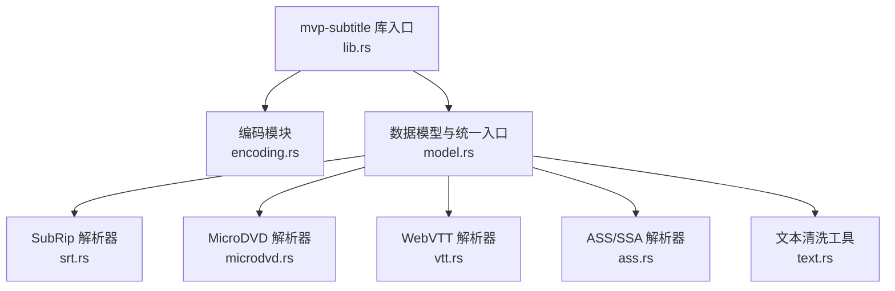
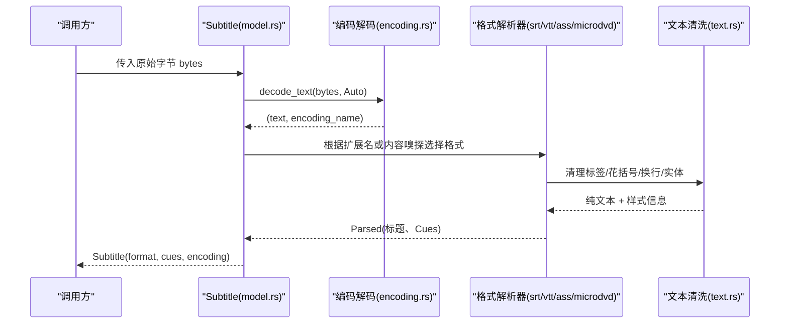
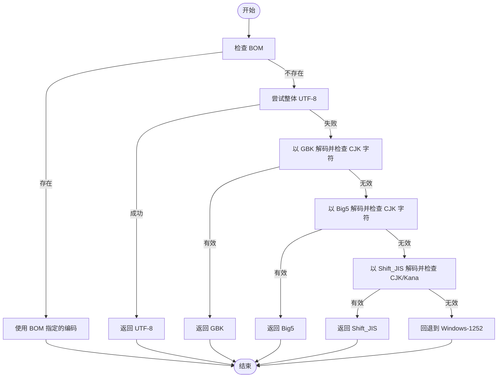
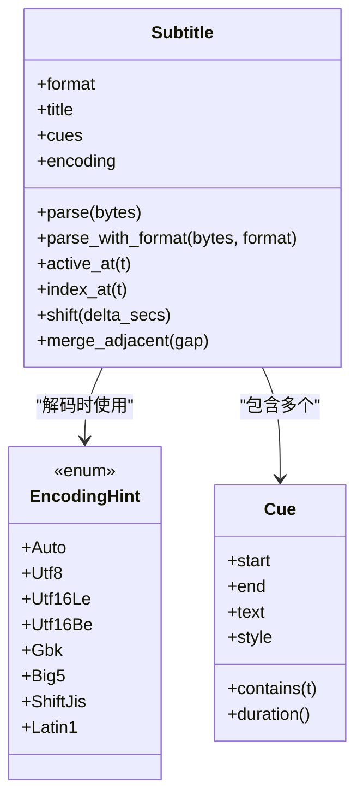
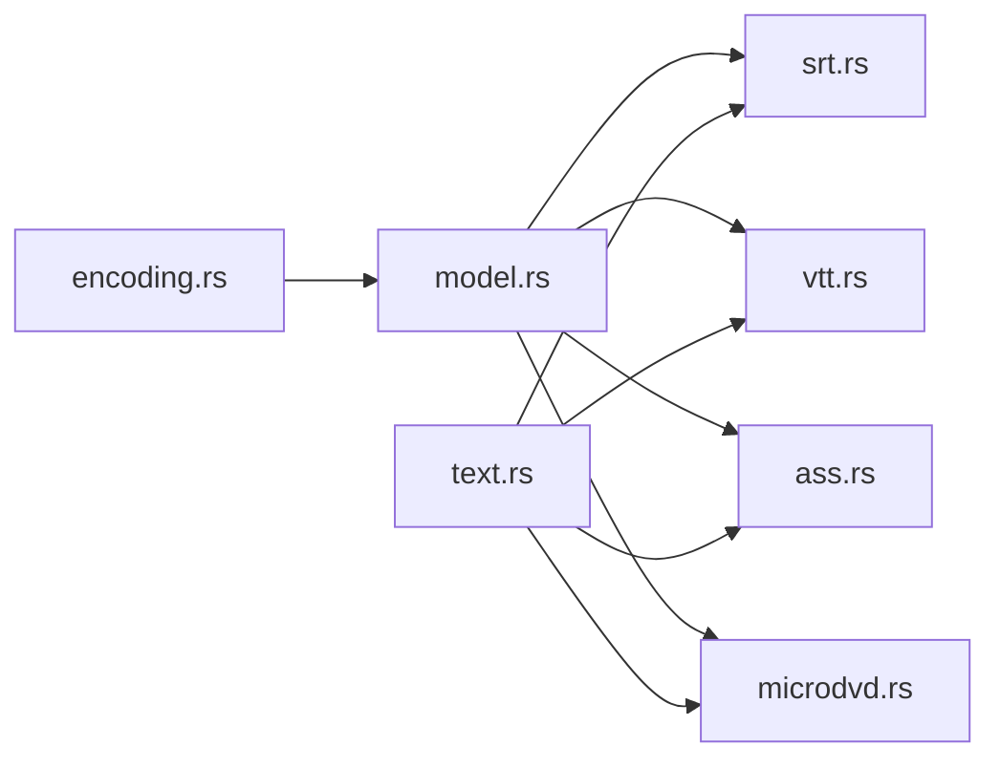

# 编码识别与处理

<cite>
**本文引用的文件**   
- [encoding.rs](file://crates/mvp-subtitle/src/encoding.rs)
- [model.rs](file://crates/mvp-subtitle/src/model.rs)
- [text.rs](file://crates/mvp-subtitle/src/text.rs)
- [lib.rs](file://crates/mvp-subtitle/src/lib.rs)
- [srt.rs](file://crates/mvp-subtitle/src/srt.rs)
- [microdvd.rs](file://crates/mvp-subtitle/src/microdvd.rs)
- [acceptance.rs](file://crates/mvp-subtitle/tests/acceptance.rs)
</cite>

## 目录
1. [引言](#引言)
2. [项目结构](#项目结构)
3. [核心组件](#核心组件)
4. [架构总览](#架构总览)
5. [详细组件分析](#详细组件分析)
6. [依赖关系分析](#依赖关系分析)
7. [性能考量](#性能考量)
8. [故障排查指南](#故障排查指南)
9. [结论](#结论)
10. [附录：兼容性测试用例与常见问题](#附录兼容性测试用例与常见问题)

## 引言
本文面向字幕文件的字符编码识别与处理，聚焦以下目标：
- 说明支持的字符编码：UTF-8、UTF-16（LE/BE）、GBK、Big5、Shift_JIS、Windows-1252。
- 解释编码探测的优先级策略与回退机制。
- 说明文本解码过程中的错误处理策略，包括替换非法字节、处理截断文件等场景。
- 介绍编码提示 EncodingHint 的使用方法与自定义编码配置。
- 提供编码兼容性测试用例与常见问题解决方案。

该能力位于 mvp-subtitle crate 中，作为播放器字幕解析的前置步骤，确保后续格式解析器只面对已解码且干净的 Unicode 文本。

## 项目结构
与编码识别和处理直接相关的代码集中在 mvp-subtitle crate：
- encoding.rs：编码检测、BOM 处理、无损/有损解码、EncodingHint。
- model.rs：统一的数据模型 Subtitle/Cue，以及从字节到文本的统一入口 parse/parse_with_format。
- text.rs：通用文本清洗工具（标签、花括号块、换行转义、实体解码、空白行修剪）。
- srt.rs / microdvd.rs：具体格式解析器，复用统一的编码与文本清洗流程。
- acceptance.rs：端到端验收测试，覆盖 GBK、BOM、SRT/VTT/ASS/MicroDVD 等场景。

图表来源
- [lib.rs:47-59](file://crates/mvp-subtitle/src/lib.rs#L47-L59)
- [model.rs:149-165](file://crates/mvp-subtitle/src/model.rs#L149-L165)
- [encoding.rs:159-178](file://crates/mvp-subtitle/src/encoding.rs#L159-L178)

章节来源
- [lib.rs:1-76](file://crates/mvp-subtitle/src/lib.rs#L1-L76)
- [model.rs:1-136](file://crates/mvp-subtitle/src/model.rs#L1-L136)

## 核心组件
- 编码探测与解码：encoding.rs 提供 detect_encoding 与 decode_text，支持 UTF-8、UTF-16LE/BE、GBK、Big5、Shift_JIS、Windows-1252。
- 编码提示：EncodingHint 允许调用方强制指定编码；BOM 始终优先于提示。
- 统一入口：model.rs 中的 Subtitle::parse/parse_with_format 先解码再按格式解析，并记录最终使用的编码名称。
- 文本清洗：text.rs 提供标签剥离、花括号块剥离、换行转义转换、HTML 实体解码与空白行规范化。

章节来源
- [encoding.rs:11-35](file://crates/mvp-subtitle/src/encoding.rs#L11-L35)
- [encoding.rs:124-178](file://crates/mvp-subtitle/src/encoding.rs#L124-L178)
- [model.rs:149-165](file://crates/mvp-subtitle/src/model.rs#L149-L165)
- [text.rs:37-155](file://crates/mvp-subtitle/src/text.rs#L37-L155)

## 架构总览
下图展示从原始字节到可渲染字幕的完整路径，强调编码识别在解析前的关键作用。

图表来源
- [model.rs:149-165](file://crates/mvp-subtitle/src/model.rs#L149-L165)
- [encoding.rs:159-178](file://crates/mvp-subtitle/src/encoding.rs#L159-L178)
- [srt.rs:22-29](file://crates/mvp-subtitle/src/srt.rs#L22-L29)
- [microdvd.rs:90-104](file://crates/mvp-subtitle/src/microdvd.rs#L90-L104)

## 详细组件分析

### 编码探测与解码（encoding.rs）
- 支持的编码：
  - UTF-8（含 BOM）
  - UTF-16LE / UTF-16BE（含 BOM）
  - GBK（含 GB18030 兼容）
  - Big5
  - Shift_JIS
  - Windows-1252（西欧语言常用）
- BOM 优先级最高：若检测到 UTF-8/UTF-16LE/UTF-16BE 的 BOM，则直接使用对应编码，忽略 EncodingHint。
- 探测优先级（无 BOM 时）：
  1. 整体为合法 UTF-8 → UTF-8。
  2. 以 GBK 解码无错误且包含中日韩表意文字 → GBK。
  3. 以 Big5 解码无错误且包含中日韩表意文字 → Big5。
  4. 以 Shift_JIS 解码无错误且包含表意文字或假名 → Shift_JIS。
  5. 否则回退至 Windows-1252（几乎总能映射所有字节）。
- 解码策略：
  - 使用 decode_without_bom_handling 避免 BOM 进入正文。
  - 解码失败不会抛错，而是用替换字符 U+FFFD 替代非法序列，保证“尽可能显示”。
  - 返回实际使用的编码名称，便于 UI 显示。

图表来源
- [encoding.rs:60-71](file://crates/mvp-subtitle/src/encoding.rs#L60-L71)
- [encoding.rs:124-148](file://crates/mvp-subtitle/src/encoding.rs#L124-L148)

章节来源
- [encoding.rs:1-35](file://crates/mvp-subtitle/src/encoding.rs#L1-L35)
- [encoding.rs:60-178](file://crates/mvp-subtitle/src/encoding.rs#L60-L178)

### 编码提示 EncodingHint 与自定义配置
- EncodingHint 枚举：
  - Auto：自动探测（默认）。
  - Utf8 / Utf16Le / Utf16Be / Gbk / Big5 / ShiftJis / Latin1：强制指定编码。
- 优先级规则：
  - BOM > 显式 Hint > 自动探测。
- 使用方式：
  - 通过 decode_text(bytes, hint) 指定解码行为。
  - 在 Subtitle::parse/parse_with_format 内部默认使用 Auto，但可通过外部逻辑预先 decode_text 后交由上层控制。

章节来源
- [encoding.rs:11-35](file://crates/mvp-subtitle/src/encoding.rs#L11-L35)
- [encoding.rs:44-58](file://crates/mvp-subtitle/src/encoding.rs#L44-L58)
- [encoding.rs:159-178](file://crates/mvp-subtitle/src/encoding.rs#L159-L178)

### 文本解码错误处理
- 非法字节替换：解码过程采用“有损解码”，非法序列被替换为 U+FFFD，不中断解析。
- 截断文件：由于解码器容忍部分损坏，解析器继续工作，仅丢弃无法解析的片段，保证其余字幕可见。
- BOM 处理：解码前会移除 BOM，避免其出现在第一条字幕文本中。

章节来源
- [encoding.rs:150-178](file://crates/mvp-subtitle/src/encoding.rs#L150-L178)
- [model.rs:121-136](file://crates/mvp-subtitle/src/model.rs#L121-L136)

### 统一入口与格式探测（model.rs）
- Subtitle::parse：
  - 先调用 encoding::decode_text 进行编码探测与解码。
  - 再通过 from_text 探测格式并调用对应解析器。
  - 最后对结果排序并记录 encoding 名称。
- Subtitle::parse_with_format：
  - 同样先解码，然后强制使用指定格式解析。
- 格式探测 detect_format：
  - 基于 WEBVTT 头、MicroDVD 帧号模式、ASS 段落标记、SRT 时间箭头等进行快速嗅探。
  - 扫描行数有限制，避免大文件探测开销过大。

图表来源
- [model.rs:121-165](file://crates/mvp-subtitle/src/model.rs#L121-L165)
- [model.rs:272-294](file://crates/mvp-subtitle/src/model.rs#L272-L294)
- [encoding.rs:11-35](file://crates/mvp-subtitle/src/encoding.rs#L11-L35)

章节来源
- [model.rs:121-165](file://crates/mvp-subtitle/src/model.rs#L121-L165)
- [model.rs:272-352](file://crates/mvp-subtitle/src/model.rs#L272-L352)

### 文本清洗工具（text.rs）
- strip_angle_tags：剥离 <i>、、<v Name>、时间戳标签等，保留非标签形式的尖括号。
- strip_brace_blocks：剥离 ASS 风格的 {\an8}、{\pos(...)} 等覆盖块。
- convert_newline_escapes：将 \N 和 \n 转换为真实换行，其他反斜杠保留。
- decode_entities：解码 &lt;、&gt;、&nbsp;、&quot;、&#39;、&amp; 等实体。
- finish_text：逐行 trim，去除首尾空行，保留中间空行。

章节来源
- [text.rs:37-155](file://crates/mvp-subtitle/src/text.rs#L37-L155)

### 具体格式解析器中的编码与文本处理
- SubRip（srt.rs）：
  - 接收已解码文本，标准化换行、去 BOM、拆分行。
  - 跳过无法解析的时间行，保证健壮性。
- MicroDVD（microdvd.rs）：
  - 通过 parse_microdvd 统一调用 encoding::decode_text，再解析帧号与文本。
  - 将 | 转为换行，解析样式块。

章节来源
- [srt.rs:22-29](file://crates/mvp-subtitle/src/srt.rs#L22-L29)
- [microdvd.rs:90-104](file://crates/mvp-subtitle/src/microdvd.rs#L90-L104)

## 依赖关系分析
- 编码模块依赖 encoding_rs 提供的多编码常量与解码 API。
- 模型层依赖各格式解析器，并通过统一入口协调编码与格式探测。
- 文本清洗工具被 SRT、VTT、ASS、MicroDVD 等多处复用。

图表来源
- [lib.rs:47-59](file://crates/mvp-subtitle/src/lib.rs#L47-L59)
- [model.rs:7-7](file://crates/mvp-subtitle/src/model.rs#L7-L7)

章节来源
- [lib.rs:47-59](file://crates/mvp-subtitle/src/lib.rs#L47-L59)
- [model.rs:7-7](file://crates/mvp-subtitle/src/model.rs#L7-L7)

## 性能考量
- 编码探测：
  - BOM 检测为 O(1)。
  - UTF-8 校验为 O(n)。
  - GBK/Big5/Shift_JIS 解码为 O(n)，仅在必要时执行。
  - 总体复杂度接近线性，适合常见字幕文件大小。
- 格式探测：
  - 限制扫描行数（例如最多 2000 行），避免超大文件导致探测耗时。
- 文本清洗：
  - 单次遍历，容量预分配，减少内存分配。
- 解码容错：
  - 有损解码避免异常分支，提升鲁棒性。

[本节为一般性指导，无需引用具体文件]

## 故障排查指南
- 中文乱码：
  - 现象：中文显示为问号或方块。
  - 原因：编码误判或文件本身损坏。
  - 解决：使用 EncodingHint::Gbk 强制解码；检查文件是否确为 GBK；确认未混入非法字节。
- 日文乱码：
  - 现象：平假名/片假名显示异常。
  - 原因：Shift_JIS 未被正确识别。
  - 解决：使用 EncodingHint::ShiftJis；确认文件中包含假名或表意文字以便启发式识别。
- 西欧字符乱码：
  - 现象：法语/德语等重音字符显示异常。
  - 原因：文件为 Windows-1252 而非 UTF-8。
  - 解决：使用 EncodingHint::Latin1；或让自动探测回退到 Windows-1252。
- BOM 残留：
  - 现象：第一条字幕开头出现不可见字符。
  - 原因：BOM 未被正确剥离。
  - 解决：确认使用 decode_text，并确保编码匹配 BOM。
- 截断文件：
  - 现象：部分字幕丢失。
  - 原因：文件不完整或损坏。
  - 解决：检查源文件完整性；系统会尽量解析剩余有效内容。

章节来源
- [encoding.rs:150-178](file://crates/mvp-subtitle/src/encoding.rs#L150-L178)
- [model.rs:121-136](file://crates/mvp-subtitle/src/model.rs#L121-L136)

## 结论
本实现以“永不失败”的设计原则为核心，通过 BOM 优先、UTF-8 优先、CJK 启发式与 Windows-1252 回退的多级策略，确保绝大多数字幕文件都能被正确解码与解析。编码提示 EncodingHint 提供了灵活的自定义能力，而文本清洗工具保证了后续渲染阶段的稳定性。测试覆盖了常见编码与格式，验证了系统的鲁棒性与可用性。

[本节为总结性内容，无需引用具体文件]

## 附录：兼容性测试用例与常见问题

### 支持的编码与典型用例
- UTF-8：
  - ASCII 文本被视为 UTF-8。
  - 带 BOM 的 UTF-8 能正确识别并去除 BOM。
- UTF-16LE/BE：
  - 带 BOM 的 UTF-16 能被识别，BOM 不进入正文。
- GBK：
  - 中文 SRT 通常被识别为 GBK，并能正确解码。
- Big5：
  - 当 Big5 文本也符合 GBK 时，可能被报告为 GBK（已知限制）。
- Shift_JIS：
  - 包含假名或表意文字的日文文本可被识别。
- Windows-1252：
  - 西欧字符（如 café）在无其他匹配时回退到此编码。

章节来源
- [encoding.rs:180-226](file://crates/mvp-subtitle/src/encoding.rs#L180-L226)
- [acceptance.rs:79-135](file://crates/mvp-subtitle/tests/acceptance.rs#L79-L135)

### 编码提示与强制解码
- 使用 EncodingHint::Utf8/Gbk/Big5/ShiftJis/Latin1 强制解码。
- BOM 始终优先于 Hint。
- 示例：
  - 对 GBK 编码的中文 SRT，使用 EncodingHint::Gbk 可确保正确解码。
  - 对带 UTF-8 BOM 的文件，即使传入 Gbk 也会按 UTF-8 解码。

章节来源
- [encoding.rs:44-58](file://crates/mvp-subtitle/src/encoding.rs#L44-L58)
- [encoding.rs:200-225](file://crates/mvp-subtitle/src/encoding.rs#L200-L225)

### 文本清洗与格式解析
- SRT：
  - 支持多种时间分隔符与缺失小时字段。
  - 内联标签与花括号块会被清理。
- VTT：
  - 支持 NOTE 块、标识符与对齐设置。
- ASS：
  - 支持样式覆盖与对齐、颜色、边距等属性。
- MicroDVD：
  - 帧率可声明或默认，文本中的 | 转为换行。

章节来源
- [acceptance.rs:9-77](file://crates/mvp-subtitle/tests/acceptance.rs#L9-L77)
- [acceptance.rs:137-212](file://crates/mvp-subtitle/tests/acceptance.rs#L137-L212)
- [microdvd.rs:106-131](file://crates/mvp-subtitle/src/microdvd.rs#L106-L131)

### 健壮性与边界情况
- 空输入：返回空轨道，编码默认为 UTF-8。
- 畸形输入：不会 panic，返回可用但可能空的 Subtitle。
- 截断时间行：仅损失一个字幕条目，不影响后续内容。

章节来源
- [acceptance.rs:278-311](file://crates/mvp-subtitle/tests/acceptance.rs#L278-L311)
- [model.rs:121-136](file://crates/mvp-subtitle/src/model.rs#L121-L136)