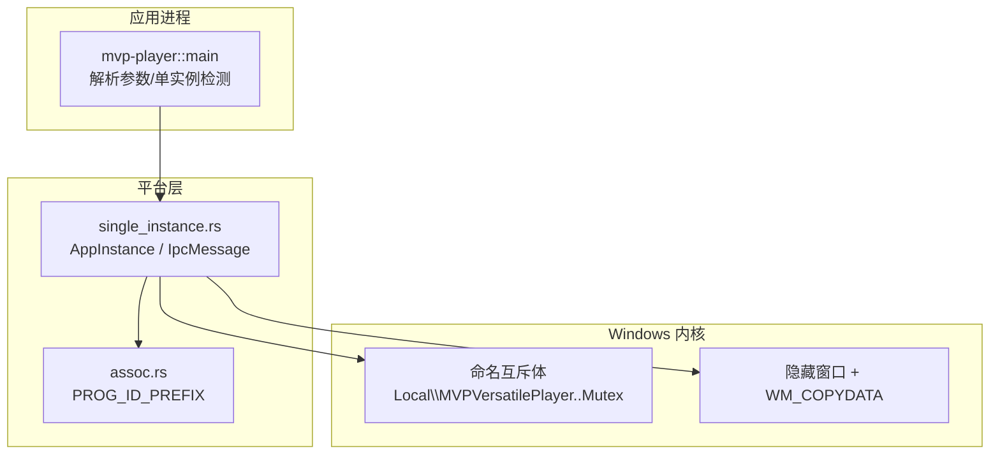
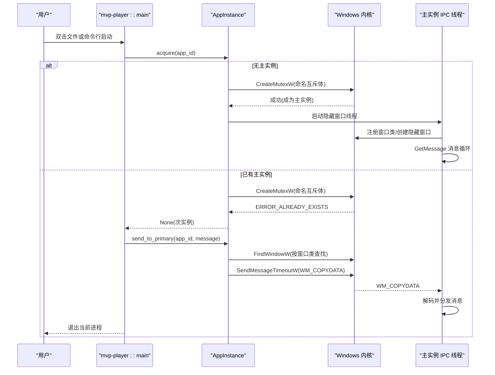
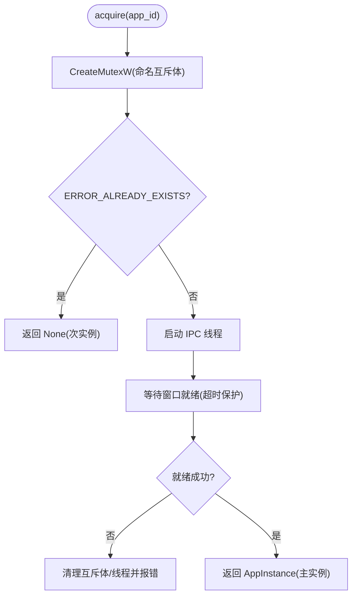
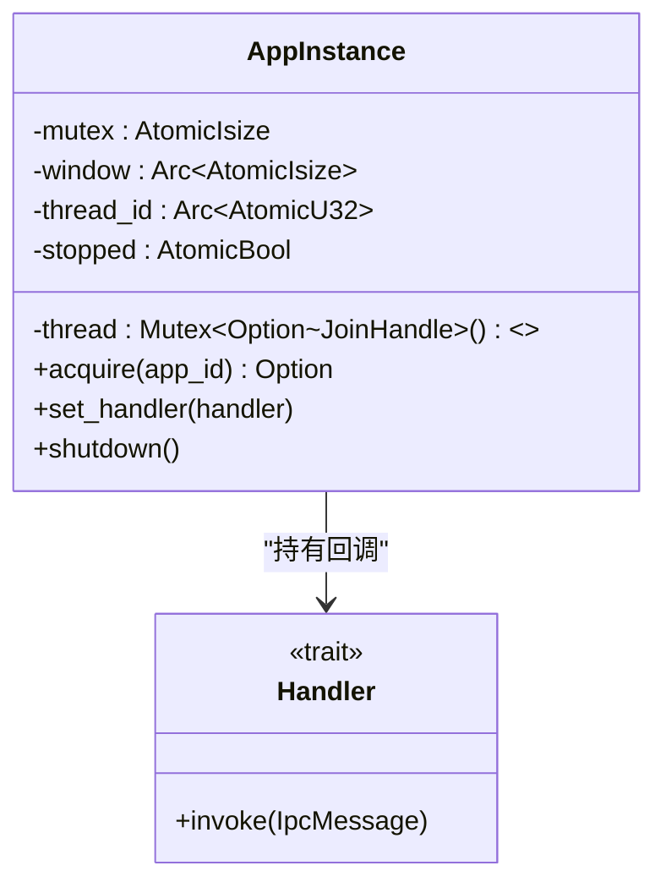
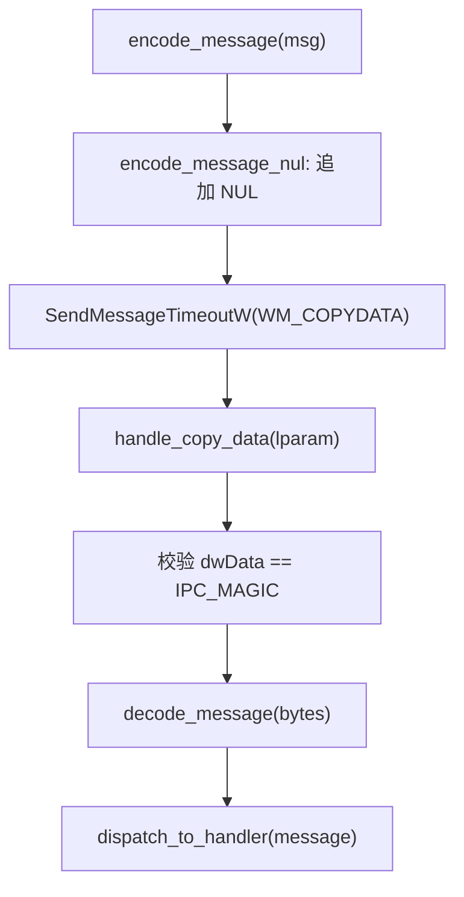
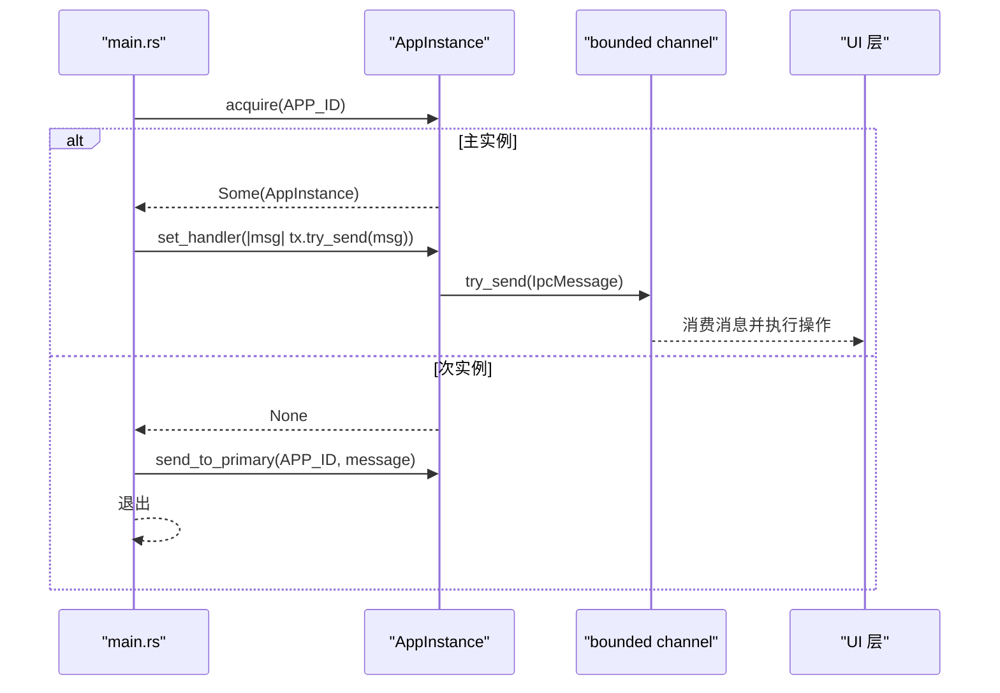

# 单实例控制

<cite>
**本文引用的文件**   
- [single_instance.rs](file://crates/mvp-platform/src/single_instance.rs)
- [lib.rs](file://crates/mvp-platform/src/lib.rs)
- [main.rs](file://crates/mvp-player/src/main.rs)
- [assoc.rs](file://crates/mvp-platform/src/assoc.rs)
</cite>

## 目录
1. [引言](#引言)
2. [项目结构](#项目结构)
3. [核心组件](#核心组件)
4. [架构总览](#架构总览)
5. [详细组件分析](#详细组件分析)
6. [依赖关系分析](#依赖关系分析)
7. [性能与资源管理](#性能与资源管理)
8. [故障排查指南](#故障排查指南)
9. [结论](#结论)
10. [附录：关键流程与代码片段路径](#附录关键流程与代码片段路径)

## 引言
本文件面向 MVP-Versatile-Player 的“单实例控制”实现，系统性说明以下要点：
- 基于命名互斥体的进程检测机制，确保同一用户会话中只有一个主实例。
- 通过隐藏顶层窗口 + WM_COPYDATA 的跨进程通信（IPC）机制，将二次启动的文件参数转发给主实例。
- IPC 数据结构设计、消息序列化/反序列化过程。
- Windows 版本兼容性处理与异常恢复策略。
- 线程安全、资源管理与内存泄漏防护。
- 结合仓库源码给出端到端调用链路与可定位的代码片段路径。

## 项目结构
单实例控制由平台抽象层 mvp-platform 提供，应用入口 mvp-player 在启动时调用该能力：
- mvp-platform/src/single_instance.rs：实现命名互斥体检测、隐藏 IPC 窗口、WM_COPYDATA 收发、消息编解码、线程与资源管理。
- mvp-platform/src/lib.rs：对外暴露 AppInstance 与 IpcMessage。
- crates/mvp-player/src/main.rs：解析命令行、尝试获取单实例；若已有实例则发送激活或打开文件请求并退出当前进程。
- crates/mvp-platform/src/assoc.rs：提供 PROG_ID_PREFIX，用于命名空间隔离，避免与其他程序冲突。

图表来源
- [main.rs:69-99](file://crates/mvp-player/src/main.rs#L69-L99)
- [single_instance.rs:1-52](file://crates/mvp-platform/src/single_instance.rs#L1-L52)
- [assoc.rs:24-33](file://crates/mvp-platform/src/assoc.rs#L24-L33)

章节来源
- [lib.rs:1-34](file://crates/mvp-platform/src/lib.rs#L1-L34)
- [main.rs:1-14](file://crates/mvp-player/src/main.rs#L1-L14)

## 核心组件
- AppInstance：代表“主实例”角色，持有命名互斥体句柄、隐藏 IPC 窗口句柄、IPC 线程句柄等，负责生命周期管理（创建、关闭）。
- IpcMessage：跨进程消息类型，包括激活主窗口、打开文件列表、退出主实例。
- 编码/解码器：encode_message / decode_message / encode_message_nul / trim_trailing_nul，负责 UTF-8 文本协议与 NUL 终止。
- Windows 后端 win 模块：封装 CreateMutexW、FindWindowW、SendMessageTimeoutW、窗口类注册、消息循环等。

章节来源
- [single_instance.rs:53-92](file://crates/mvp-platform/src/single_instance.rs#L53-L92)
- [single_instance.rs:171-231](file://crates/mvp-platform/src/single_instance.rs#L171-L231)
- [single_instance.rs:337-716](file://crates/mvp-platform/src/single_instance.rs#L337-L716)

## 架构总览
整体流程分为两条路径：
- 主实例路径：首次启动成功获取命名互斥体，启动隐藏 IPC 窗口线程，接收其他进程发来的 WM_COPYDATA 消息，分发到业务处理器。
- 次实例路径：检测到已有主实例后，构造 IpcMessage（激活或打开文件），通过 FindWindowW 定位隐藏窗口，使用 SendMessageTimeoutW 发送 WM_COPYDATA，然后退出。

图表来源
- [main.rs:69-99](file://crates/mvp-player/src/main.rs#L69-L99)
- [single_instance.rs:377-458](file://crates/mvp-platform/src/single_instance.rs#L377-L458)
- [single_instance.rs:658-715](file://crates/mvp-platform/src/single_instance.rs#L658-L715)
- [single_instance.rs:555-624](file://crates/mvp-platform/src/single_instance.rs#L555-L624)

## 详细组件分析

### 命名互斥体与主实例选举
- 命名互斥体名称：Local\MVPVersatilePlayer.<app_id>.Mutex，其中 app_id 来自应用配置，命名空间前缀来自 assoc::PROG_ID_PREFIX，保证多应用隔离。
- 首次创建成功即为主实例；返回 ERROR_ALREADY_EXISTS 表示已有主实例，当前进程作为次实例。
- 主实例会启动一个专用线程来创建隐藏窗口并泵送消息队列，避免阻塞主线程。

图表来源
- [single_instance.rs:377-458](file://crates/mvp-platform/src/single_instance.rs#L377-L458)

章节来源
- [single_instance.rs:27-30](file://crates/mvp-platform/src/single_instance.rs#L27-L30)
- [single_instance.rs:366-396](file://crates/mvp-platform/src/single_instance.rs#L366-L396)
- [assoc.rs:24-33](file://crates/mvp-platform/src/assoc.rs#L24-L33)

### 隐藏 IPC 窗口与消息循环
- 使用 WS_EX_TOOLWINDOW + WS_POPUP 的普通顶层窗口，而非 HWND_MESSAGE，以便 FindWindowW 可跨进程发现。
- 窗口类名：{IPC_NAMESPACE}.{app_id}.IpcWnd，确保不同应用不冲突。
- 线程职责：注册窗口类、创建窗口、设置窗口句柄与线程 ID、进入 GetMessage 循环、收到退出信号后销毁窗口并注销类。

图表来源
- [single_instance.rs:81-92](file://crates/mvp-platform/src/single_instance.rs#L81-L92)
- [single_instance.rs:64-74](file://crates/mvp-platform/src/single_instance.rs#L64-L74)

章节来源
- [single_instance.rs:494-553](file://crates/mvp-platform/src/single_instance.rs#L494-L553)
- [single_instance.rs:555-573](file://crates/mvp-platform/src/single_instance.rs#L555-L573)
- [single_instance.rs:575-624](file://crates/mvp-platform/src/single_instance.rs#L575-L624)

### WM_COPYDATA 数据协议与编解码
- 协议格式：UTF-8 文本，首行标签（activate/open/quit），open 后续每行一个路径。
- 发送侧：encode_message 生成文本，encode_message_nul 追加 NUL 以满足 WM_COPYDATA 要求。
- 接收侧：handle_copy_data 校验 dwData 为 IPC_MAGIC，读取 lpData/cbData，trim_trailing_nul 后 decode_message。
- 安全性：未知标签或非 UTF-8 直接丢弃；dwData 不匹配视为外部消息忽略。

图表来源
- [single_instance.rs:175-231](file://crates/mvp-platform/src/single_instance.rs#L175-L231)
- [single_instance.rs:626-656](file://crates/mvp-platform/src/single_instance.rs#L626-L656)
- [single_instance.rs:680-715](file://crates/mvp-platform/src/single_instance.rs#L680-L715)

章节来源
- [single_instance.rs:175-231](file://crates/mvp-platform/src/single_instance.rs#L175-L231)
- [single_instance.rs:626-656](file://crates/mvp-platform/src/single_instance.rs#L626-L656)

### 应用入口集成与消息路由
- main.rs 在启动时调用 AppInstance::acquire(settings::APP_ID)。
- 若返回 Some(instance)，安装 set_handler，将收到的 IpcMessage 投递到 bounded channel，供 UI 层消费。
- 若返回 None，构造 Activate 或 OpenPaths 消息，调用 send_to_primary；成功后退出当前进程。
- 若 acquire 失败，记录警告并以独立进程继续运行（降级模式）。

图表来源
- [main.rs:69-99](file://crates/mvp-player/src/main.rs#L69-L99)

章节来源
- [main.rs:69-99](file://crates/mvp-player/src/main.rs#L69-L99)

### 线程安全、资源管理与异常恢复
- 线程安全
  - HANDLER 使用 Lazy<RwLock<Option<Handler>>>，读写安全；handler panic 被 catch_unwind 包裹，避免 IPC 线程崩溃。
  - window/thread_id/stopped 使用原子变量，保证跨线程可见性与幂等性。
  - shutdown 自锁保护：若从 IPC 线程内调用 shutdown，跳过 join 以避免自死锁。
- 资源管理
  - 主实例拥有命名互斥体句柄，Drop 时自动释放；close_mutex 使用 swap 保证仅关闭一次。
  - IPC 线程在 run_ipc_thread 结束时销毁窗口并注销类，防止类残留。
  - 启动失败回滚：若窗口创建失败，向线程发送退出消息并 join，再关闭互斥体。
- 异常恢复
  - send_to_primary 使用 SendMessageTimeoutW + SMTO_ABORTIFHUNG，避免主实例卡死导致次实例永久阻塞。
  - 未知/非法消息丢弃并记录日志，不影响主实例稳定性。

章节来源
- [single_instance.rs:113-145](file://crates/mvp-platform/src/single_instance.rs#L113-L145)
- [single_instance.rs:317-331](file://crates/mvp-platform/src/single_instance.rs#L317-L331)
- [single_instance.rs:297-315](file://crates/mvp-platform/src/single_instance.rs#L297-L315)
- [single_instance.rs:428-447](file://crates/mvp-platform/src/single_instance.rs#L428-L447)
- [single_instance.rs:686-715](file://crates/mvp-platform/src/single_instance.rs#L686-L715)

### 跨进程通信的数据结构与序列化
- IpcMessage 枚举：Activate、OpenPaths(Vec<PathBuf>)、Quit。
- 序列化：encode_message 输出标签+路径行；encode_message_nul 追加 NUL。
- 反序列化：decode_message 解析标签与路径行，过滤空行，构建 PathBuf。
- 传输：COPYDATASTRUCT.dwData=IPC_MAGIC，lpData 指向 UTF-8 缓冲，cbData 包含长度（含 NUL）。

章节来源
- [single_instance.rs:53-62](file://crates/mvp-platform/src/single_instance.rs#L53-L62)
- [single_instance.rs:175-231](file://crates/mvp-platform/src/single_instance.rs#L175-L231)
- [single_instance.rs:680-715](file://crates/mvp-platform/src/single_instance.rs#L680-L715)

### Windows 版本兼容性与异常情况
- 窗口类注册可能返回 ERROR_CLASS_ALREADY_EXISTS，已做兼容处理（视为已注册）。
- AllowSetForegroundWindow 失败仅记录调试日志，不阻断发送。
- SendMessageTimeoutW 支持 SMTO_ABORTIFHUNG | SMTO_NORMAL，避免主实例消息泵挂起导致次实例阻塞。
- 非 Windows 平台提供 stub 实现，编译期可跨平台检查。

章节来源
- [single_instance.rs:517-528](file://crates/mvp-platform/src/single_instance.rs#L517-L528)
- [single_instance.rs:672-678](file://crates/mvp-platform/src/single_instance.rs#L672-L678)
- [single_instance.rs:686-715](file://crates/mvp-platform/src/single_instance.rs#L686-L715)
- [single_instance.rs:106-111](file://crates/mvp-platform/src/single_instance.rs#L106-L111)

## 依赖关系分析
- mvp-player::main 依赖 mvp_platform::single_instance::{AppInstance, IpcMessage}。
- single_instance 依赖 assoc::PROG_ID_PREFIX 进行命名空间隔离。
- Windows API 通过 windows crate 调用，所有 unsafe 调用均有 SAFETY 注释与边界保护。

图表来源
- [main.rs:35-38](file://crates/mvp-player/src/main.rs#L35-L38)
- [single_instance.rs:27-30](file://crates/mvp-platform/src/single_instance.rs#L27-L30)
- [single_instance.rs:337-364](file://crates/mvp-platform/src/single_instance.rs#L337-L364)

章节来源
- [main.rs:35-38](file://crates/mvp-player/src/main.rs#L35-L38)
- [single_instance.rs:27-30](file://crates/mvp-platform/src/single_instance.rs#L27-L30)

## 性能与资源管理
- 启动性能
  - 字体预取放在单实例检测之后，避免次实例重复加载系统字体。
  - FFmpeg 初始化延迟到首次使用，减少冷启动开销。
- 资源释放
  - 命名互斥体句柄在 Drop/close_mutex 中精确关闭一次。
  - IPC 线程在正常退出时销毁窗口并注销类，避免类泄漏。
  - handler panic 被捕获，避免 IPC 线程崩溃导致资源泄露。
- 内存安全
  - WM_COPYDATA 缓冲区由 Windows 保证在消息处理期间有效，无需额外拷贝。
  - 路径序列化为 UTF-8 字符串，避免二进制对齐问题。

章节来源
- [main.rs:101-109](file://crates/mvp-player/src/main.rs#L101-L109)
- [single_instance.rs:297-315](file://crates/mvp-platform/src/single_instance.rs#L297-L315)
- [single_instance.rs:481-492](file://crates/mvp-platform/src/single_instance.rs#L481-L492)
- [single_instance.rs:646-655](file://crates/mvp-platform/src/single_instance.rs#L646-L655)

## 故障排查指南
- 无法找到主实例
  - 现象：send_to_primary 返回 false，日志提示未找到实例。
  - 排查：确认窗口类名一致；检查 FindWindowW 是否成功；确认主实例窗口已创建。
  - 相关位置：[single_instance.rs:658-670](file://crates/mvp-platform/src/single_instance.rs#L658-L670)
- 主实例无响应
  - 现象：SendMessageTimeoutW 超时，日志记录错误码。
  - 排查：检查主实例消息循环是否正常运行；是否存在长时间阻塞的处理逻辑。
  - 相关位置：[single_instance.rs:686-715](file://crates/mvp-platform/src/single_instance.rs#L686-L715)
- 消息被忽略
  - 现象：日志显示 dwData 不匹配或空负载。
  - 排查：确认 IPC_MAGIC 一致；payload 非空且为 UTF-8。
  - 相关位置：[single_instance.rs:626-656](file://crates/mvp-platform/src/single_instance.rs#L626-L656)
- 窗口类注册失败
  - 现象：RegisterClassW 返回 ERROR_CLASS_ALREADY_EXISTS。
  - 处理：视为已注册，继续创建窗口。
  - 相关位置：[single_instance.rs:517-528](file://crates/mvp-platform/src/single_instance.rs#L517-L528)
- 次实例启动失败但主实例仍工作
  - 现象：acquire 失败，日志警告，以独立进程运行。
  - 影响：失去窗口合并能力，但不影响播放功能。
  - 相关位置：[main.rs:92-99](file://crates/mvp-player/src/main.rs#L92-L99)

## 结论
本项目通过“命名互斥体 + 隐藏窗口 + WM_COPYDATA”的组合实现了稳健的单实例控制：
- 命名互斥体确保主实例唯一性；
- 隐藏窗口提供可靠的跨进程发现与通信通道；
- 消息协议简单、健壮，具备魔法字校验与超时保护；
- 线程安全与资源管理完善，具备异常恢复与降级策略；
- 应用入口集成简洁，便于扩展更多 IPC 语义。

## 附录：关键流程与代码片段路径
- 主实例获取与 IPC 线程启动
  - [single_instance.rs:377-458](file://crates/mvp-platform/src/single_instance.rs#L377-L458)
- 隐藏窗口创建与消息循环
  - [single_instance.rs:494-573](file://crates/mvp-platform/src/single_instance.rs#L494-L573)
- WM_COPYDATA 接收与分发
  - [single_instance.rs:575-656](file://crates/mvp-platform/src/single_instance.rs#L575-L656)
- 次实例发送消息
  - [single_instance.rs:658-715](file://crates/mvp-platform/src/single_instance.rs#L658-L715)
- 应用入口集成
  - [main.rs:69-99](file://crates/mvp-player/src/main.rs#L69-L99)
- 命名空间前缀
  - [assoc.rs:24-33](file://crates/mvp-platform/src/assoc.rs#L24-L33)