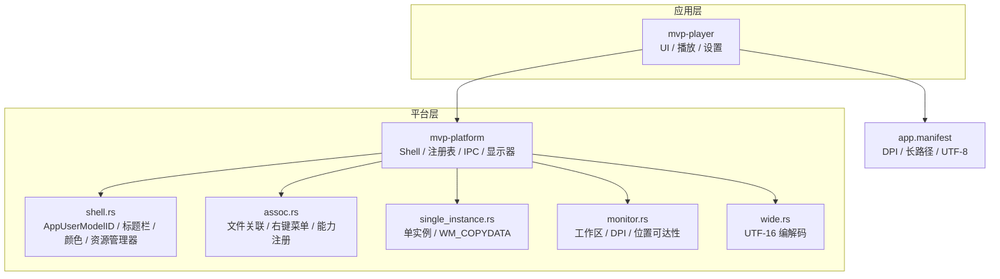
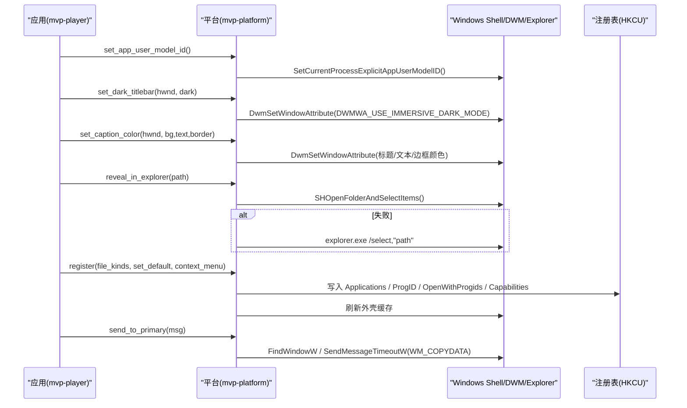
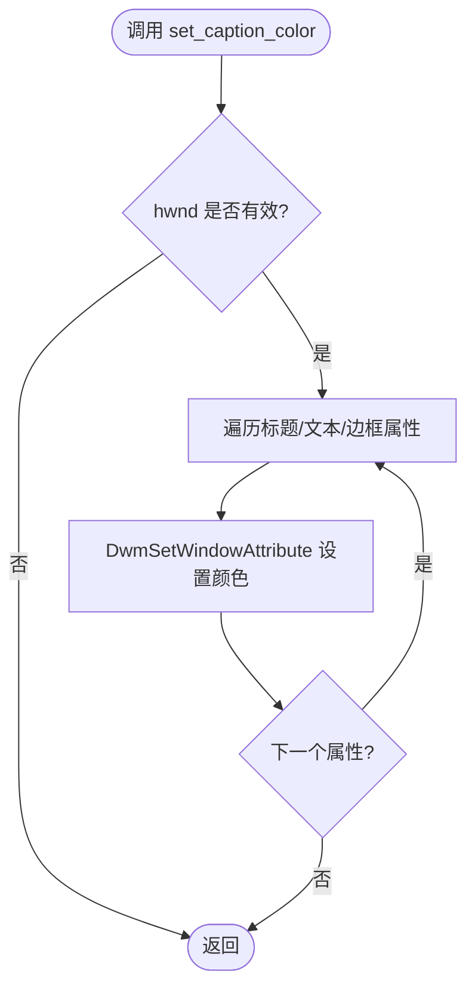
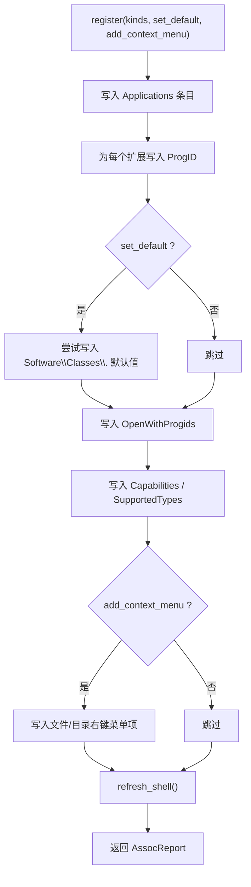
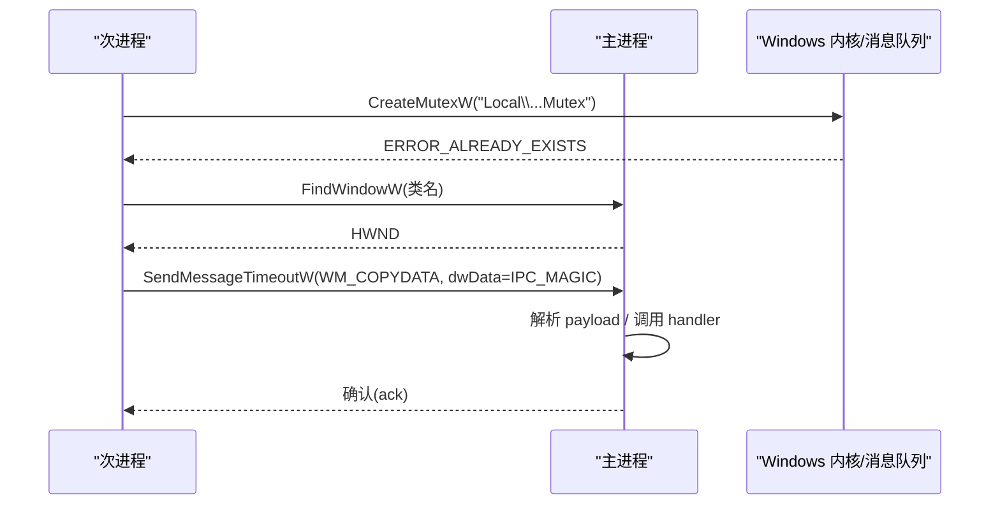
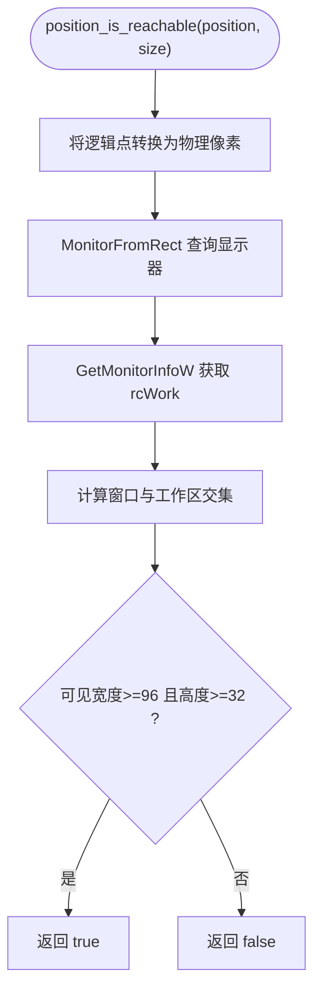
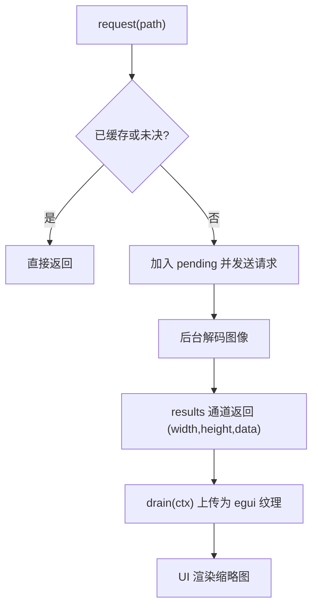
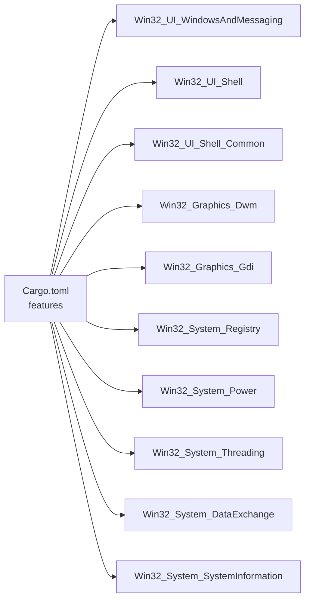

# 外壳集成

<cite>
**本文引用的文件**   
- [shell.rs](file://crates/mvp-platform/src/shell.rs)
- [assoc.rs](file://crates/mvp-platform/src/assoc.rs)
- [monitor.rs](file://crates/mvp-platform/src/monitor.rs)
- [single_instance.rs](file://crates/mvp-platform/src/single_instance.rs)
- [wide.rs](file://crates/mvp-platform/src/wide.rs)
- [lib.rs](file://crates/mvp-platform/src/lib.rs)
- [app.manifest](file://assets/app.manifest)
- [Cargo.toml](file://crates/mvp-platform/Cargo.toml)
- [state.rs](file://crates/mvp-player/src/state.rs)
</cite>

## 目录
1. [引言](#引言)
2. [项目结构](#项目结构)
3. [核心组件](#核心组件)
4. [架构总览](#架构总览)
5. [详细组件分析](#详细组件分析)
6. [依赖关系分析](#依赖关系分析)
7. [性能与兼容性](#性能与兼容性)
8. [故障排查指南](#故障排查指南)
9. [结论](#结论)
10. [附录：Shell 集成功能与最佳实践清单](#附录shell-集成功能与最佳实践清单)

## 引言
本文件面向 MVP-Versatile-Player 的 Windows Shell 集成功能，系统性说明以下方面：
- 任务栏交互（窗口聚焦、闪烁、标题栏主题与颜色）
- 文件关联与右键菜单扩展（注册、卸载、能力声明、默认应用引导）
- 单实例与进程间通信（命名互斥量 + 隐藏窗口 + WM_COPYDATA）
- 显示器几何与高 DPI 适配（工作区、缩放比例、位置可达性）
- 缩略图缓存与预览（播放器侧缩略图请求与纹理上传）
- 与 Windows Explorer 的交互（打开文件、在资源管理器中定位）
- 深/浅色主题、Windows 11 特性兼容与现代 API 使用
- 错误处理、权限模型与安全注意事项

需要特别说明的是：当前仓库未实现 ITaskbarList3 进度条或缩略图预览条；但提供了任务栏按钮闪烁、窗口前置、标题栏深色模式与自定义标题栏颜色等基础 Shell 能力。文件关联与右键菜单通过 HKEY_CURRENT_USER 注册，无需管理员权限。

## 项目结构
mvp-platform 是平台抽象层，封装所有 Windows Shell 相关能力；mvp-player 在其之上构建 UI 与播放逻辑，并复用 mvp-platform 的能力。

图表来源
- [lib.rs:1-34](file://crates/mvp-platform/src/lib.rs#L1-L34)
- [app.manifest:1-28](file://assets/app.manifest#L1-L28)

章节来源
- [lib.rs:1-34](file://crates/mvp-platform/src/lib.rs#L1-L34)
- [Cargo.toml:1-48](file://crates/mvp-platform/Cargo.toml#L1-L48)

## 核心组件
- shell.rs：提供 AppUserModelID、深色标题栏、标题栏颜色、在资源管理器中显示、ShellExecuteW 封装、任务栏闪烁、窗口前置等。
- assoc.rs：以 HKCU 写入文件关联、ProgID、OpenWithProgids、Capabilities、上下文菜单项，并提供“默认应用”深度链接。
- single_instance.rs：基于命名互斥量与隐藏窗口 + WM_COPYDATA 的单实例与 IPC。
- monitor.rs：获取主显示器工作区、按点/矩形/窗口查询工作区、系统 DPI 与窗口 DPI、逻辑点换算。
- wide.rs：Win32 所需的 NUL 终止 UTF-16 缓冲与字节序列编解码。
- app.manifest：启用 PerMonitorV2 DPI 感知、长路径、UTF-8 代码页。

章节来源
- [shell.rs:1-378](file://crates/mvp-platform/src/shell.rs#L1-L378)
- [assoc.rs:1-800](file://crates/mvp-platform/src/assoc.rs#L1-L800)
- [single_instance.rs:1-867](file://crates/mvp-platform/src/single_instance.rs#L1-L867)
- [monitor.rs:1-360](file://crates/mvp-platform/src/monitor.rs#L1-L360)
- [wide.rs:1-77](file://crates/mvp-platform/src/wide.rs#L1-L77)
- [app.manifest:1-28](file://assets/app.manifest#L1-L28)

## 架构总览
下面的架构图展示了从应用到 Windows Shell 的关键调用链与数据流。

图表来源
- [shell.rs:18-28](file://crates/mvp-platform/src/shell.rs#L18-L28)
- [shell.rs:42-76](file://crates/mvp-platform/src/shell.rs#L42-L76)
- [shell.rs:90-120](file://crates/mvp-platform/src/shell.rs#L90-L120)
- [shell.rs:184-230](file://crates/mvp-platform/src/shell.rs#L184-L230)
- [assoc.rs:727-767](file://crates/mvp-platform/src/assoc.rs#L727-L767)
- [single_instance.rs:658-715](file://crates/mvp-platform/src/single_instance.rs#L658-L715)

## 详细组件分析

### 任务栏与窗口外观（shell.rs）
- AppUserModelID：用于任务栏分组、跳转列表和通知的正确身份标识。
- 深色标题栏：优先使用 DWMWA_USE_IMMERSIVE_DARK_MODE，回退到旧属性编号。
- 标题栏颜色：Windows 11 支持标题栏、文本、边框着色；不支持时静默忽略。
- 资源管理器集成：SHOpenFolderAndSelectItems 优先，失败则回退 explorer.exe /select。
- 任务栏闪烁：FlashWindowEx 三次闪烁，窗口激活后停止。
- 窗口前置：最小化恢复并置顶，必要时配合 AllowSetForegroundWindow。

图表来源
- [shell.rs:90-120](file://crates/mvp-platform/src/shell.rs#L90-L120)

章节来源
- [shell.rs:18-28](file://crates/mvp-platform/src/shell.rs#L18-L28)
- [shell.rs:42-76](file://crates/mvp-platform/src/shell.rs#L42-L76)
- [shell.rs:90-168](file://crates/mvp-platform/src/shell.rs#L90-L168)
- [shell.rs:184-230](file://crates/mvp-platform/src/shell.rs#L184-L230)
- [shell.rs:295-314](file://crates/mvp-platform/src/shell.rs#L295-L314)
- [shell.rs:329-353](file://crates/mvp-platform/src/shell.rs#L329-L353)

### 文件关联与右键菜单（assoc.rs）
- 仅写 HKCU，无需 UAC，可逆卸载。
- 能力声明：Applications 条目 + SupportedTypes + RegisteredApplications + Capabilities。
- ProgID 与 OpenWithProgids：为每个媒体扩展注册 ProgID 与“打开方式”。
- 直接默认值：尝试写入 Software\Classes\<ext> 默认值，但在 Win8+ 可能被 UserChoice 保护。
- 右键菜单：可选添加“用 MVP 打开”的文件/目录上下文菜单项。
- 默认应用引导：ms-settings:defaultapps 深度链接，提示用户完成选择。
- 刷新外壳：注册完成后通知外壳刷新图标与“打开方式”菜单。

图表来源
- [assoc.rs:727-767](file://crates/mvp-platform/src/assoc.rs#L727-L767)

章节来源
- [assoc.rs:1-800](file://crates/mvp-platform/src/assoc.rs#L1-L800)

### 单实例与进程间通信（single_instance.rs）
- 命名互斥量 Local\MVPVersatilePlayer.<app_id>.Mutex 决定主实例。
- 隐藏顶层窗口（WS_EX_TOOLWINDOW）作为 IPC 端点，独立线程泵消息。
- 二次启动通过 FindWindowW + WM_COPYDATA 发送消息，带超时与魔法字校验。
- 支持消息类型：Activate（激活窗口）、OpenPaths（打开文件列表）、Quit（退出）。
- 安全设计：dwData 魔法字过滤非本程序消息；SendMessageTimeout 防止主进程卡死拖垮新进程。

图表来源
- [single_instance.rs:377-458](file://crates/mvp-platform/src/single_instance.rs#L377-L458)
- [single_instance.rs:658-715](file://crates/mvp-platform/src/single_instance.rs#L658-L715)

章节来源
- [single_instance.rs:1-867](file://crates/mvp-platform/src/single_instance.rs#L1-L867)

### 显示器几何与高 DPI（monitor.rs）
- PixelRect：物理像素矩形，提供 right/bottom/intersect/to_points。
- work_area_*：获取主显示器/指定点/矩形/窗口的可用区域（排除任务栏）。
- system_dpi/dpi_of_window：获取系统 DPI 与窗口 DPI，异常值回退 96。
- position_is_reachable：判断保存的窗口位置在当前屏幕布局下仍可达。

图表来源
- [monitor.rs:245-274](file://crates/mvp-platform/src/monitor.rs#L245-L274)
- [monitor.rs:110-191](file://crates/mvp-platform/src/monitor.rs#L110-L191)

章节来源
- [monitor.rs:1-360](file://crates/mvp-platform/src/monitor.rs#L1-L360)

### 缩略图缓存与预览（播放器侧）
- state.rs 维护缩略图请求队列、结果通道与 egui 纹理缓存。
- request(path)：去重后加入 pending 集合并通过 channel 发送解码请求。
- drain(ctx)：批量上传已解码结果为 egui::TextureHandle，供 UI 展示。
- 注意：该缩略图用于播放器内部预览（如时间轴预览），并非 Windows 任务栏缩略图预览条。

图表来源
- [state.rs:393-422](file://crates/mvp-player/src/state.rs#L393-L422)

章节来源
- [state.rs:387-422](file://crates/mvp-player/src/state.rs#L387-L422)

### 协议处理器与拖放
- 当前仓库未实现自定义协议处理器（如 myplayer://）。
- 文件拖放由上层 UI 框架处理；平台层未暴露专用拖放接口。
- 若需扩展，可在 mvp-player 的 UI 层接入 Windows 拖放 API，并在收到文件路径后调用 open_paths。

[本节不直接分析具体文件]

## 依赖关系分析
mvp-platform 对 windows crate 的功能按需启用，避免非 Windows 平台编译开销。

图表来源
- [Cargo.toml:14-39](file://crates/mvp-platform/Cargo.toml#L14-L39)

章节来源
- [Cargo.toml:1-48](file://crates/mvp-platform/Cargo.toml#L1-L48)

## 性能与兼容性
- DPI 与高分屏：
  - app.manifest 启用 PerMonitorV2 与 PerMonitor，避免合成器上采样导致的模糊。
  - monitor.rs 将物理像素转换为逻辑点，确保窗口尺寸与屏幕可用区域匹配。
- 长路径与 UTF-8：
  - app.manifest 启用 longPathAware 与 activeCodePage=UTF-8，提升深层媒体库与国际化路径兼容性。
- 标题栏主题：
  - 优先使用 DWMWA_USE_IMMERSIVE_DARK_MODE；旧版本回退到属性编号 19。
  - 标题栏颜色仅在 Windows 11 生效，否则静默忽略。
- 任务栏进度与缩略图预览条：
  - 当前未实现 ITaskbarList3 进度条与缩略图预览条；如需扩展，建议新增模块封装 ITaskbarList3，并结合状态机更新进度与缩略图缓存。

章节来源
- [app.manifest:1-28](file://assets/app.manifest#L1-L28)
- [monitor.rs:1-360](file://crates/mvp-platform/src/monitor.rs#L1-L360)
- [shell.rs:42-76](file://crates/mvp-platform/src/shell.rs#L42-L76)
- [shell.rs:90-120](file://crates/mvp-platform/src/shell.rs#L90-L120)

## 故障排查指南
- 无法设置深色标题栏或标题栏颜色：
  - 检查 DWM 是否可用；函数会记录调试日志并静默降级。
  - 参考：[shell.rs:42-76](file://crates/mvp-platform/src/shell.rs#L42-L76)、[shell.rs:90-120](file://crates/mvp-platform/src/shell.rs#L90-L120)。
- 资源管理器无法选中文件：
  - SHOpenFolderAndSelectItems 失败时会回退 explorer.exe /select；查看日志中的失败原因。
  - 参考：[shell.rs:184-230](file://crates/mvp-platform/src/shell.rs#L184-L230)。
- 文件关联未生效或被覆盖：
  - Win8+ 的 UserChoice 受保护，可能需要用户到“默认应用”页面确认。
  - 使用 open_default_apps_settings 打开 ms-settings 深度链接。
  - 参考：[assoc.rs:413-424](file://crates/mvp-platform/src/assoc.rs#L413-L424)、[assoc.rs:701-725](file://crates/mvp-platform/src/assoc.rs#L701-L725)。
- 单实例 IPC 无响应：
  - 检查主进程是否仍在运行且消息循环正常；次进程使用 SendMessageTimeout 等待 ack。
  - 参考：[single_instance.rs:658-715](file://crates/mvp-platform/src/single_instance.rs#L658-L715)。
- 窗口位置不可达：
  - 使用 position_is_reachable 校验保存的位置；多显示器拔插后可能失效。
  - 参考：[monitor.rs:245-274](file://crates/mvp-platform/src/monitor.rs#L245-L274)。

章节来源
- [shell.rs:42-76](file://crates/mvp-platform/src/shell.rs#L42-L76)
- [shell.rs:90-120](file://crates/mvp-platform/src/shell.rs#L90-L120)
- [shell.rs:184-230](file://crates/mvp-platform/src/shell.rs#L184-L230)
- [assoc.rs:413-424](file://crates/mvp-platform/src/assoc.rs#L413-L424)
- [assoc.rs:701-725](file://crates/mvp-platform/src/assoc.rs#L701-L725)
- [single_instance.rs:658-715](file://crates/mvp-platform/src/single_instance.rs#L658-L715)
- [monitor.rs:245-274](file://crates/mvp-platform/src/monitor.rs#L245-L274)

## 结论
本项目在 Windows Shell 集成方面提供了稳健的基础能力：正确的应用身份、深色标题栏与颜色、资源管理器集成、HKCU 文件关联与右键菜单、单实例与 IPC、显示器几何与 DPI 适配。当前未实现 ITaskbarList3 进度条与缩略图预览条，但已有缩略图缓存机制可用于播放器内部预览。建议在后续迭代中新增专门的 Shell 扩展模块，封装 ITaskbarList3 以实现任务栏进度与缩略图预览条，同时保持现有错误处理与权限模型的一致性。

[本节不直接分析具体文件]

## 附录：Shell 集成功能与最佳实践清单
- 任务栏与窗口外观
  - 启动早期设置 AppUserModelID，保证任务栏分组与跳转列表正确。
  - 根据主题切换深色标题栏；Windows 11 可进一步设置标题栏颜色。
  - 使用 flash_window 吸引注意力；foreground_window 恢复并前置窗口。
  - 参考：[shell.rs:18-28](file://crates/mvp-platform/src/shell.rs#L18-L28)、[shell.rs:42-76](file://crates/mvp-platform/src/shell.rs#L42-L76)、[shell.rs:90-168](file://crates/mvp-platform/src/shell.rs#L90-L168)、[shell.rs:295-353](file://crates/mvp-platform/src/shell.rs#L295-L353)。

- 文件关联与右键菜单
  - 使用 register 注册视频/音频/图片/播放列表扩展；按需开启 set_default 与 add_context_menu。
  - 在 Win8+ 提示用户使用“默认应用”页面完成最终确认。
  - 使用 unregister 清理注册项；使用 refresh_shell 刷新外壳缓存。
  - 参考：[assoc.rs:343-349](file://crates/mvp-platform/src/assoc.rs#L343-L349)、[assoc.rs:727-767](file://crates/mvp-platform/src/assoc.rs#L727-L767)、[assoc.rs:413-424](file://crates/mvp-platform/src/assoc.rs#L413-L424)。

- 单实例与 IPC
  - 使用 acquire 成为主实例；send_to_primary 转发激活/打开文件/退出指令。
  - 使用 set_handler 安装消息处理回调；注意 panic 隔离与线程安全。
  - 参考：[single_instance.rs:94-146](file://crates/mvp-platform/src/single_instance.rs#L94-L146)、[single_instance.rs:658-715](file://crates/mvp-platform/src/single_instance.rs#L658-L715)。

- 显示器几何与 DPI
  - 启动前查询 primary_work_area_points 确定窗口大小；使用 position_is_reachable 校验保存位置。
  - 使用 dpi_of_window 获取窗口 DPI，结合 PixelRect.to_points 进行逻辑点换算。
  - 参考：[monitor.rs:232-235](file://crates/mvp-platform/src/monitor.rs#L232-L235)、[monitor.rs:245-274](file://crates/mvp-platform/src/monitor.rs#L245-L274)、[monitor.rs:170-191](file://crates/mvp-platform/src/monitor.rs#L170-L191)。

- 缩略图缓存与预览
  - 使用 state.rs 的 request/drain 管理缩略图解码与纹理上传。
  - 该机制适用于播放器内部预览；任务栏缩略图预览条需另行实现 ITaskbarList3。
  - 参考：[state.rs:393-422](file://crates/mvp-player/src/state.rs#L393-L422)。

- 兼容性与现代特性
  - app.manifest 启用 PerMonitorV2 DPI 感知、长路径与 UTF-8。
  - 标题栏深色模式与颜色在旧系统上优雅降级。
  - 参考：[app.manifest:1-28](file://assets/app.manifest#L1-L28)、[shell.rs:42-76](file://crates/mvp-platform/src/shell.rs#L42-L76)、[shell.rs:90-120](file://crates/mvp-platform/src/shell.rs#L90-L120)。

- 安全与权限
  - 所有注册操作仅写 HKCU，无需管理员权限；卸载可逆。
  - IPC 使用魔法字与超时保护，避免恶意或异常消息导致崩溃。
  - 参考：[assoc.rs:1-21](file://crates/mvp-platform/src/assoc.rs#L1-L21)、[single_instance.rs:39-47](file://crates/mvp-platform/src/single_instance.rs#L39-L47)、[single_instance.rs:658-715](file://crates/mvp-platform/src/single_instance.rs#L658-L715)。