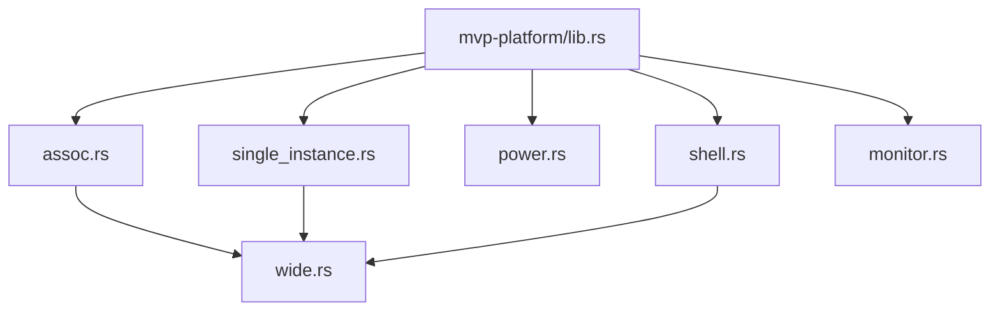
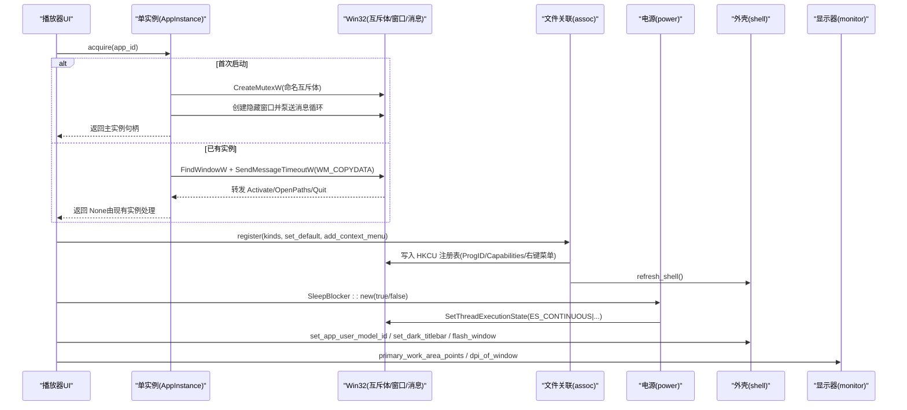
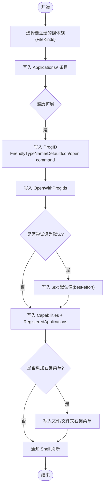
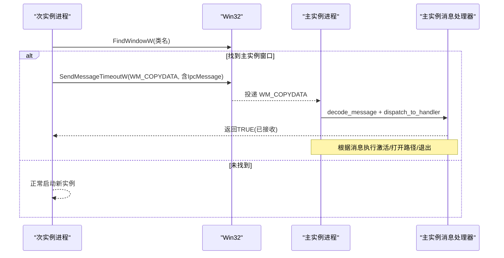
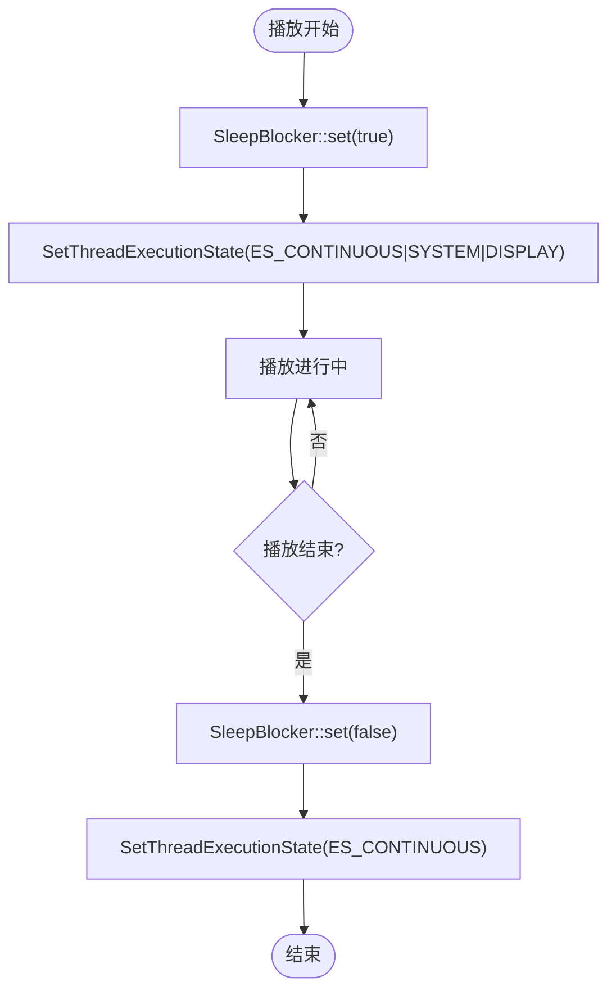
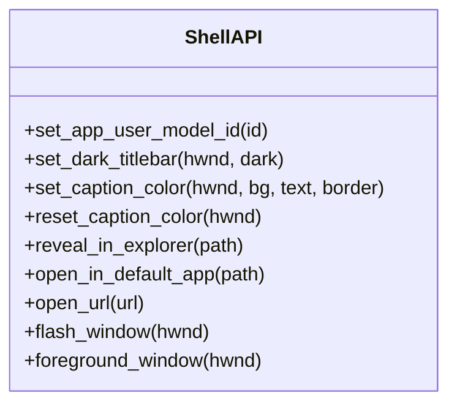
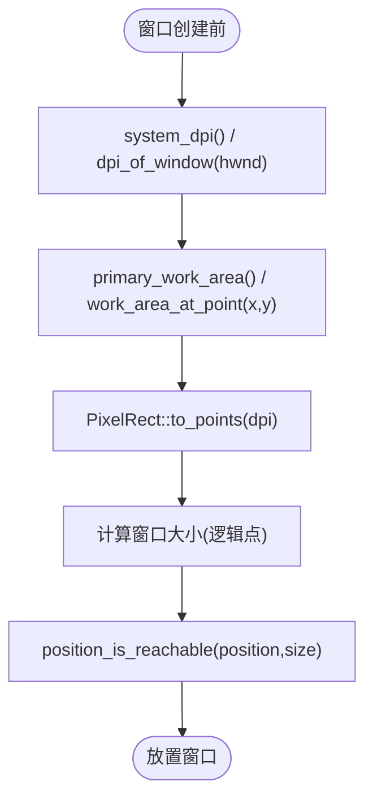
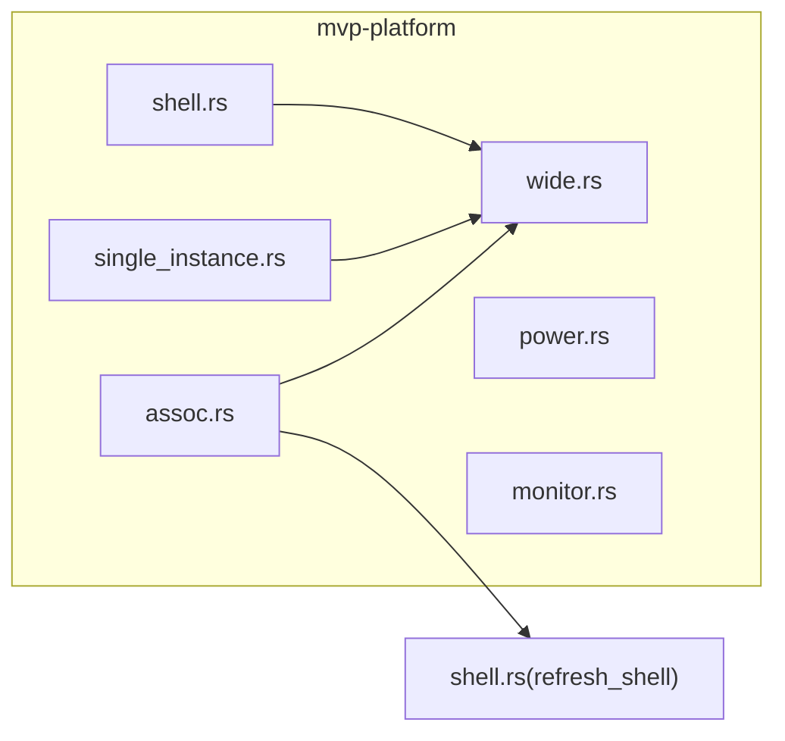

# 平台集成

<cite>
**本文引用的文件**
- [lib.rs](file://crates/mvp-platform/src/lib.rs)
- [assoc.rs](file://crates/mvp-platform/src/assoc.rs)
- [single_instance.rs](file://crates/mvp-platform/src/single_instance.rs)
- [power.rs](file://crates/mvp-platform/src/power.rs)
- [shell.rs](file://crates/mvp-platform/src/shell.rs)
- [monitor.rs](file://crates/mvp-platform/src/monitor.rs)
</cite>

## 目录
1. [简介](#简介)
2. [项目结构](#项目结构)
3. [核心组件](#核心组件)
4. [架构总览](#架构总览)
5. [详细组件分析](#详细组件分析)
6. [依赖关系分析](#依赖关系分析)
7. [性能考量](#性能考量)
8. [故障排查指南](#故障排查指南)
9. [结论](#结论)
10. [附录](#附录)

## 简介
本技术文档聚焦 Windows 平台集成功能，覆盖以下主题：
- 文件关联注册机制：注册表操作、ProgID 管理、右键菜单集成与“默认应用”深链。
- 单实例控制：基于命名互斥体与隐藏窗口 + WM_COPYDATA 的进程间通信。
- 电源管理：播放期间阻止屏幕休眠的系统 API 调用。
- 外壳集成：任务栏闪烁、标题栏深色模式、显示缩放与工作区测量等。
- 与 Windows Shell 的交互方式及兼容性策略。
- 平台特定功能的扩展方法与注意事项（非 Windows 平台的桩实现）。

该能力集中在 mvp-platform crate 中，通过条件编译为跨平台提供一致接口；在 Windows 上调用 Win32 API，在其他平台上提供无副作用或返回错误的桩实现。

## 项目结构
mvp-platform 将 Windows 平台相关能力按职责拆分为模块：
- assoc：文件关联、ProgID、Capabilities、右键菜单、刷新 Shell。
- single_instance：单实例守卫、IPC（WM_COPYDATA）、消息编解码。
- power：播放时保持系统/显示器唤醒。
- shell：AppUserModelID、深色标题栏、标题栏着色、资源管理器高亮、ShellExecuteW、任务栏闪烁、前台窗口。
- monitor：多显示器工作区、DPI、逻辑点换算、位置可达性检查。
- wide：UTF-16 转换辅助（Windows 专用）。

图表来源
- [lib.rs:23-33](file://crates/mvp-platform/src/lib.rs#L23-L33)
- [assoc.rs:22-33](file://crates/mvp-platform/src/assoc.rs#L22-L33)
- [single_instance.rs:20-31](file://crates/mvp-platform/src/single_instance.rs#L20-L31)
- [shell.rs:9-18](file://crates/mvp-platform/src/shell.rs#L9-L18)
- [monitor.rs:16-32](file://crates/mvp-platform/src/monitor.rs#L16-L32)

章节来源
- [lib.rs:1-34](file://crates/mvp-platform/src/lib.rs#L1-L34)

## 核心组件
- 文件关联注册器：以 per-user 方式写入 HKEY_CURRENT_USER，避免 UAC；支持视频/音频/图片/播放列表四类扩展；可写 ProgID、OpenWithProgids、Capabilities、右键菜单项，并通知 Shell 刷新。
- 单实例控制器：首个进程创建命名互斥体成为主实例，并在独立线程维护一个不可见顶层窗口作为 IPC 端点；后续实例通过 WM_COPYDATA 发送激活、打开路径、退出请求。
- 电源管理：使用 SetThreadExecutionState 在播放期间阻止系统/显示器进入睡眠，停止播放后恢复默认策略。
- 外壳工具：设置 AppUserModelID、深色标题栏、标题栏颜色、资源管理器选中、ShellExecuteW 打开、任务栏闪烁、前台窗口。
- 显示器与 DPI：获取主显示器工作区、任意点/矩形所在显示器的工作区、系统 DPI、窗口 DPI，以及逻辑点换算和位置可达性判断。

章节来源
- [lib.rs:1-34](file://crates/mvp-platform/src/lib.rs#L1-L34)
- [assoc.rs:1-21](file://crates/mvp-platform/src/assoc.rs#L1-L21)
- [single_instance.rs:1-19](file://crates/mvp-platform/src/single_instance.rs#L1-L19)
- [power.rs:1-20](file://crates/mvp-platform/src/power.rs#L1-L20)
- [shell.rs:1-8](file://crates/mvp-platform/src/shell.rs#L1-L8)
- [monitor.rs:1-15](file://crates/mvp-platform/src/monitor.rs#L1-L15)

## 架构总览
下图展示了各模块之间的协作关系与关键数据流：

图表来源
- [single_instance.rs:94-169](file://crates/mvp-platform/src/single_instance.rs#L94-L169)
- [single_instance.rs:377-458](file://crates/mvp-platform/src/single_instance.rs#L377-L458)
- [single_instance.rs:658-715](file://crates/mvp-platform/src/single_instance.rs#L658-L715)
- [assoc.rs:342-349](file://crates/mvp-platform/src/assoc.rs#L342-L349)
- [assoc.rs:727-767](file://crates/mvp-platform/src/assoc.rs#L727-L767)
- [assoc.rs:928-934](file://crates/mvp-platform/src/assoc.rs#L928-L934)
- [power.rs:25-59](file://crates/mvp-platform/src/power.rs#L25-L59)
- [shell.rs:17-34](file://crates/mvp-platform/src/shell.rs#L17-L34)
- [shell.rs:41-82](file://crates/mvp-platform/src/shell.rs#L41-L82)
- [shell.rs:294-320](file://crates/mvp-platform/src/shell.rs#L294-L320)
- [monitor.rs:130-191](file://crates/mvp-platform/src/monitor.rs#L130-L191)

## 详细组件分析

### 文件关联注册机制（assoc）
- 目标与约束
  - 仅写入 HKEY_CURRENT_USER，无需管理员权限，可逆卸载。
  - Windows 8+ 保护 UserChoice，因此采用“Capabilities + RegisteredApplications”声明，并提供“默认应用”深链引导用户确认。
- 关键概念
  - APP_NAME、PROG_ID_PREFIX、EXE_NAME 定义应用标识与可执行名。
  - FileKinds 控制注册哪些媒体族（视频/音频/图片/播放列表）。
  - 所有扩展统一规范化为“.ext”小写形式，去重合并。
- 注册流程要点
  - 写入 Applications\<exe> 条目（名称、图标、SupportedTypes）。
  - 为每个扩展写入 ProgID（FriendlyTypeName、DefaultIcon、open command）。
  - 写入 OpenWithProgids 键值。
  - 写入 Capabilities 与 RegisteredApplications。
  - 可选写入 .ext 默认值（best-effort，Win8+可能被忽略）。
  - 可选写入右键菜单（文件/文件夹），支持多选模型。
  - 调用 Shell 刷新通知。
- 卸载流程
  - 删除 Applications 树、所有可能存在的 ProgID、OpenWithProgids、.ext 默认值（若仍指向我们的 ProgID）、Capabilities 与 RegisteredApplications、右键菜单项。
- 查询与提示
  - is_registered：检测 RegisteredApplications 是否指向我们的 Capabilities。
  - current_handler_for：优先读取 UserChoice\ProgId，否则回退到 .ext 默认值。
  - open_default_apps_settings：打开“默认应用”页面并定位到本应用。

图表来源
- [assoc.rs:727-767](file://crates/mvp-platform/src/assoc.rs#L727-L767)
- [assoc.rs:769-860](file://crates/mvp-platform/src/assoc.rs#L769-L860)
- [assoc.rs:862-900](file://crates/mvp-platform/src/assoc.rs#L862-L900)
- [assoc.rs:928-934](file://crates/mvp-platform/src/assoc.rs#L928-L934)

章节来源
- [assoc.rs:1-21](file://crates/mvp-platform/src/assoc.rs#L1-L21)
- [assoc.rs:24-75](file://crates/mvp-platform/src/assoc.rs#L24-L75)
- [assoc.rs:126-162](file://crates/mvp-platform/src/assoc.rs#L126-L162)
- [assoc.rs:172-225](file://crates/mvp-platform/src/assoc.rs#L172-L225)
- [assoc.rs:255-325](file://crates/mvp-platform/src/assoc.rs#L255-L325)
- [assoc.rs:342-441](file://crates/mvp-platform/src/assoc.rs#L342-L441)
- [assoc.rs:727-934](file://crates/mvp-platform/src/assoc.rs#L727-L934)

### 单实例控制与 IPC（single_instance）
- 设计要点
  - 命名互斥体 Local\MVPVersatilePlayer.<app_id>.Mutex 决定主实例。
  - 主实例在独立线程创建不可见顶层窗口（WS_EX_TOOLWINDOW），维护消息循环。
  - 次实例通过 FindWindowW 找到该类窗口，使用 WM_COPYDATA 发送消息，带超时保护。
  - 消息载荷为 UTF-8 文本，包含标签行与路径列表，使用 dwData 魔法值防误解析。
- 主要类型与行为
  - IpcMessage：Activate、OpenPaths、Quit。
  - AppInstance：acquire 获取主实例；set_handler 安装消息处理器；shutdown 安全关闭。
  - send_to_primary：次实例向主实例发送消息，返回是否成功。
- 序列图：二次启动打开文件

图表来源
- [single_instance.rs:94-169](file://crates/mvp-platform/src/single_instance.rs#L94-L169)
- [single_instance.rs:377-458](file://crates/mvp-platform/src/single_instance.rs#L377-L458)
- [single_instance.rs:658-715](file://crates/mvp-platform/src/single_instance.rs#L658-L715)
- [single_instance.rs:592-656](file://crates/mvp-platform/src/single_instance.rs#L592-L656)

章节来源
- [single_instance.rs:1-19](file://crates/mvp-platform/src/single_instance.rs#L1-L19)
- [single_instance.rs:20-63](file://crates/mvp-platform/src/single_instance.rs#L20-L63)
- [single_instance.rs:175-231](file://crates/mvp-platform/src/single_instance.rs#L175-L231)
- [single_instance.rs:337-458](file://crates/mvp-platform/src/single_instance.rs#L337-L458)
- [single_instance.rs:555-656](file://crates/mvp-platform/src/single_instance.rs#L555-L656)
- [single_instance.rs:658-715](file://crates/mvp-platform/src/single_instance.rs#L658-L715)

### 电源管理（power）
- 目标：播放期间阻止系统/显示器进入睡眠；停止播放后恢复默认策略。
- 实现：SetThreadExecutionState 组合 ES_CONTINUOUS | ES_SYSTEM_REQUIRED | ES_DISPLAY_REQUIRED；释放时使用 ES_CONTINUOUS 清除。
- 使用建议：在主线程（UI 线程）调用，确保请求在整个会话期间有效；可重复调用且幂等。

图表来源
- [power.rs:25-59](file://crates/mvp-platform/src/power.rs#L25-L59)
- [power.rs:61-78](file://crates/mvp-platform/src/power.rs#L61-L78)

章节来源
- [power.rs:1-20](file://crates/mvp-platform/src/power.rs#L1-L20)
- [power.rs:25-59](file://crates/mvp-platform/src/power.rs#L25-L59)
- [power.rs:61-86](file://crates/mvp-platform/src/power.rs#L61-L86)

### 外壳集成与主题适配（shell）
- AppUserModelID：设置进程级应用标识，用于任务栏分组、跳转列表、通知等。
- 深色标题栏：使用 DwmSetWindowAttribute 的 DWMWA_USE_IMMersive_DARK_MODE（兼容旧版本属性号）。
- 标题栏着色：设置标题栏、文本、边框颜色，支持重置为系统默认。
- 资源管理器高亮：优先使用 SHOpenFolderAndSelectItems，失败则回退 explorer.exe /select。
- 打开文件/URL：ShellExecuteW 包装，错误码 > 32 视为成功。
- 任务栏闪烁：FlashWindowEx 三闪提醒。
- 前台窗口：最小化恢复并置前（需配合 AllowSetForegroundWindow）。

图表来源
- [shell.rs:17-34](file://crates/mvp-platform/src/shell.rs#L17-L34)
- [shell.rs:41-82](file://crates/mvp-platform/src/shell.rs#L41-L82)
- [shell.rs:84-168](file://crates/mvp-platform/src/shell.rs#L84-L168)
- [shell.rs:176-230](file://crates/mvp-platform/src/shell.rs#L176-L230)
- [shell.rs:232-290](file://crates/mvp-platform/src/shell.rs#L232-L290)
- [shell.rs:292-353](file://crates/mvp-platform/src/shell.rs#L292-L353)

章节来源
- [shell.rs:1-8](file://crates/mvp-platform/src/shell.rs#L1-L8)
- [shell.rs:17-34](file://crates/mvp-platform/src/shell.rs#L17-L34)
- [shell.rs:41-82](file://crates/mvp-platform/src/shell.rs#L41-L82)
- [shell.rs:84-168](file://crates/mvp-platform/src/shell.rs#L84-L168)
- [shell.rs:176-230](file://crates/mvp-platform/src/shell.rs#L176-L230)
- [shell.rs:232-290](file://crates/mvp-platform/src/shell.rs#L232-L290)
- [shell.rs:292-353](file://crates/mvp-platform/src/shell.rs#L292-L353)

### 显示器与工作区（monitor）
- 能力：获取主显示器工作区、指定点/矩形所在显示器的工作区、系统 DPI、窗口 DPI。
- 逻辑点换算：PixelRect::to_points(dpi) 将物理像素转换为逻辑点，避免在高 DPI 下窗口过大。
- 位置可达性：判断保存的窗口位置在当前显示器布局下是否可见可拖拽。

图表来源
- [monitor.rs:16-76](file://crates/mvp-platform/src/monitor.rs#L16-L76)
- [monitor.rs:130-191](file://crates/mvp-platform/src/monitor.rs#L130-L191)
- [monitor.rs:228-274](file://crates/mvp-platform/src/monitor.rs#L228-L274)

章节来源
- [monitor.rs:1-15](file://crates/mvp-platform/src/monitor.rs#L1-L15)
- [monitor.rs:16-76](file://crates/mvp-platform/src/monitor.rs#L16-L76)
- [monitor.rs:90-191](file://crates/mvp-platform/src/monitor.rs#L90-L191)
- [monitor.rs:228-274](file://crates/mvp-platform/src/monitor.rs#L228-L274)

## 依赖关系分析
- 模块内聚与耦合
  - assoc 依赖 wide 进行 UTF-16 转换，并通过 shell::refresh_shell 通知 Shell。
  - single_instance 依赖 wide 与 Win32 消息/互斥体 API，不直接依赖 assoc，但共享命名空间前缀。
  - power 仅依赖 Win32 电源 API。
  - shell 依赖 wide 与 Win32 DWM/Shell API。
  - monitor 依赖 Win32 图形/GDI/DPI API。
- 外部依赖
  - windows crate（Win32 绑定）。
  - anyhow 用于错误上下文。
  - once_cell 用于全局句槽。
  - log 用于诊断输出。

图表来源
- [assoc.rs:447-455](file://crates/mvp-platform/src/assoc.rs#L447-L455)
- [single_instance.rs:337-343](file://crates/mvp-platform/src/single_instance.rs#L337-L343)
- [shell.rs:17-28](file://crates/mvp-platform/src/shell.rs#L17-L28)
- [power.rs:61-78](file://crates/mvp-platform/src/power.rs#L61-L78)
- [monitor.rs:90-191](file://crates/mvp-platform/src/monitor.rs#L90-L191)

章节来源
- [lib.rs:23-33](file://crates/mvp-platform/src/lib.rs#L23-L33)
- [assoc.rs:447-455](file://crates/mvp-platform/src/assoc.rs#L447-L455)
- [single_instance.rs:337-343](file://crates/mvp-platform/src/single_instance.rs#L337-L343)
- [shell.rs:17-28](file://crates/mvp-platform/src/shell.rs#L17-L28)
- [power.rs:61-78](file://crates/mvp-platform/src/power.rs#L61-L78)
- [monitor.rs:90-191](file://crates/mvp-platform/src/monitor.rs#L90-L191)

## 性能考量
- 文件关联注册
  - 批量写入注册表，仅在必要时刷新 Shell；卸载时谨慎清理共享键（如 OpenWithProgids）。
  - 对 UserChoice 的保护做降级处理，避免阻塞 UI。
- 单实例 IPC
  - 使用 SendMessageTimeoutW 限制等待时间，防止主实例卡死导致次实例阻塞。
  - 隐藏窗口消息循环轻量，仅处理 WM_COPYDATA 与自定义退出消息。
- 电源管理
  - SetThreadExecutionState 调用开销低，但应避免频繁切换；建议在播放状态变化时调用。
- 外壳集成
  - DWM 属性设置失败应静默降级，不影响主流程。
  - 任务栏闪烁次数有限，避免过度打扰。
- 显示器测量
  - 仅在窗口创建前调用，结果缓存于 UI 层；DPI 换算避免浮点误差累积。

[本节为通用指导，不直接分析具体文件]

## 故障排查指南
- 文件关联未生效
  - 检查 is_registered 与 current_handler_for 返回值。
  - 在 Win8+ 上可能需要引导用户至“默认应用”页面完成确认。
  - 确认 refresh_shell 被调用。
- 右键菜单缺失
  - 确认 add_context_menu 参数为真，且写入成功。
  - 检查 CONTEXT_MENU_FILE_KEY 与 CONTEXT_MENU_DIR_KEY 是否存在。
- 单实例失效
  - 检查互斥体命名是否正确（包含 app_id）。
  - 检查隐藏窗口类名是否冲突。
  - 检查 WM_COPYDATA 的 dwData 魔法值是否匹配。
  - 若主实例无响应，send_to_primary 会超时并返回 false。
- 电源阻止无效
  - 确认在 UI 线程调用 set(true)。
  - 播放结束后务必 set(false) 恢复默认策略。
- 标题栏/主题异常
  - DWM 不可用时会静默失败；检查 hwnd 是否为 0。
  - 切换深色标题栏后，如需还原，请调用 reset_caption_color。
- 窗口位置不可达
  - 使用 position_is_reachable 校验保存的位置；在多显示器/分辨率变化后重新计算。

章节来源
- [assoc.rs:380-441](file://crates/mvp-platform/src/assoc.rs#L380-L441)
- [assoc.rs:862-900](file://crates/mvp-platform/src/assoc.rs#L862-L900)
- [single_instance.rs:658-715](file://crates/mvp-platform/src/single_instance.rs#L658-L715)
- [power.rs:25-59](file://crates/mvp-platform/src/power.rs#L25-L59)
- [shell.rs:41-82](file://crates/mvp-platform/src/shell.rs#L41-L82)
- [monitor.rs:237-274](file://crates/mvp-platform/src/monitor.rs#L237-L274)

## 结论
mvp-platform 提供了完整且健壮的 Windows 平台集成能力：
- 通过 per-user 注册表操作与 Capabilities 机制，实现无 UAC 的文件关联与“默认应用”深链。
- 基于命名互斥体与 WM_COPYDATA 的单实例方案，具备超时保护与健壮的消息编解码。
- 播放期间的电源阻止与外壳集成（深色标题栏、任务栏闪烁、资源管理器高亮）提升用户体验。
- 显示器与工作区测量保证窗口在不同 DPI/多显示器环境下正确显示。
- 所有 Windows 特定功能均提供非 Windows 桩实现，便于跨平台构建与测试。

[本节为总结性内容，不直接分析具体文件]

## 附录
- 扩展方法建议
  - 新增文件类型：在 assoc.rs 的对应扩展列表中追加，并确保 describe_extension/family_label 覆盖。
  - 新增右键菜单项：在 write_context_menu 中添加新的 verb 与命令。
  - 新增 IPC 消息：在 IpcMessage 与 encode/decode 中增加标签与处理分支。
  - 新增外壳能力：在 shell.rs 中封装 Win32 API，遵循“失败即日志”的原则。
- 兼容性考虑
  - Win8+ 的 UserChoice 保护：始终提供“默认应用”深链入口。
  - DWM 可用性：深色标题栏与标题栏着色失败时降级。
  - 多显示器与 DPI：使用 monitor 模块提供的能力进行窗口尺寸与位置计算。
  - 进程间通信：WM_COPYDATA 超时与魔法值防护，避免误解析与挂起。

[本节为通用指导，不直接分析具体文件]