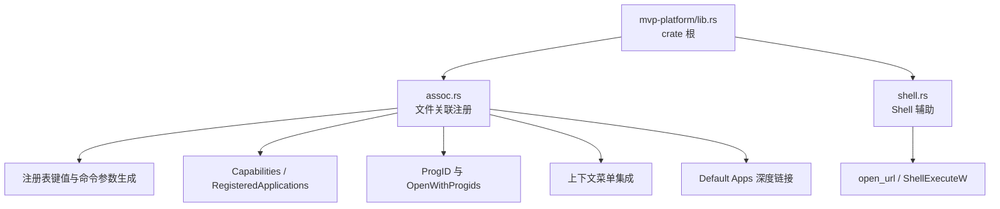
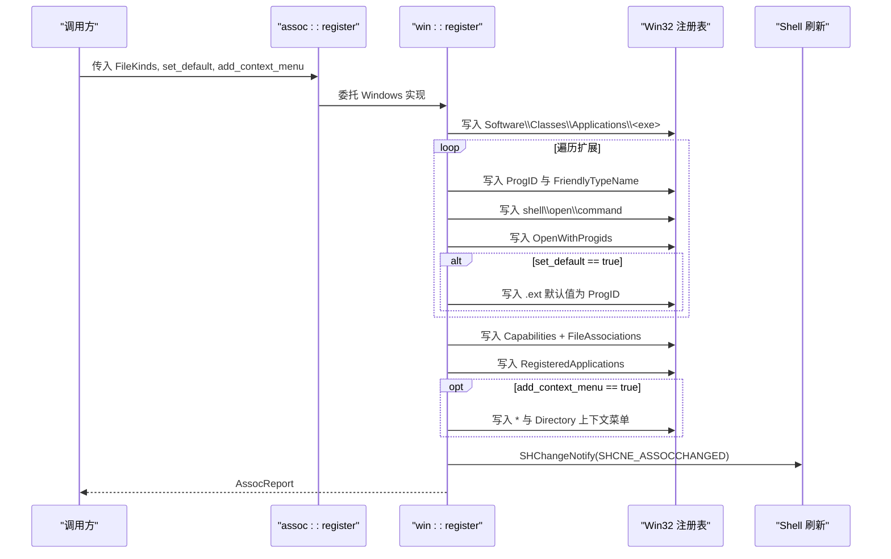
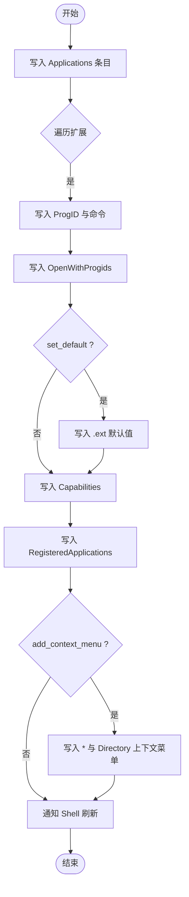
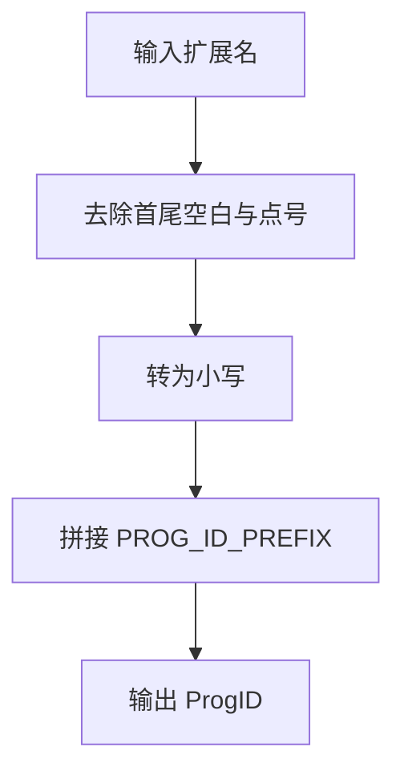
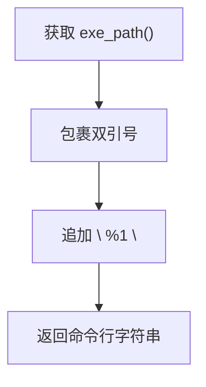
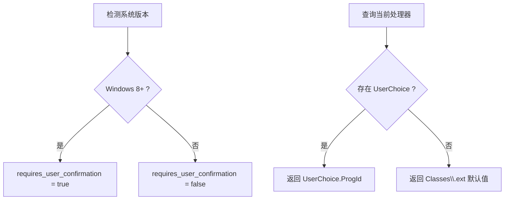
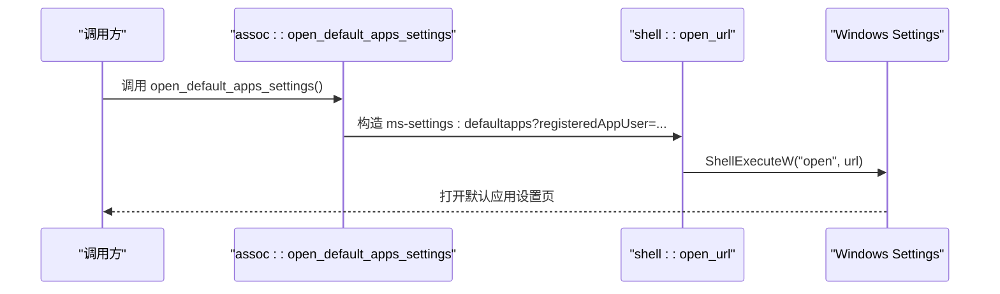
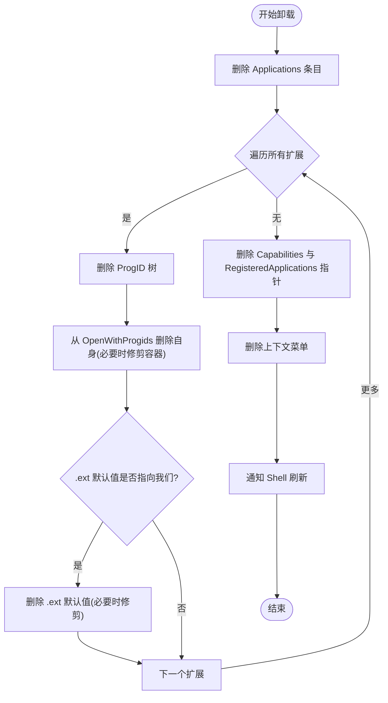
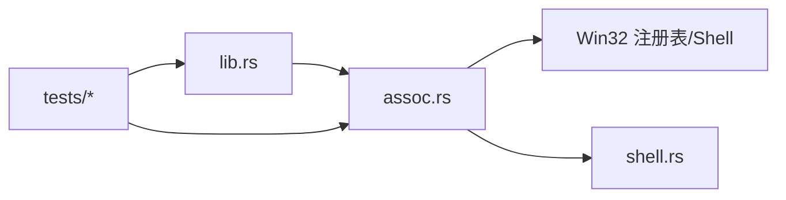

# 文件关联注册

<cite>
**本文引用的文件**   
- [assoc.rs](file://crates/mvp-platform/src/assoc.rs)
- [lib.rs](file://crates/mvp-platform/src/lib.rs)
- [shell.rs](file://crates/mvp-platform/src/shell.rs)
- [registry_live.rs](file://crates/mvp-platform/tests/registry_live.rs)
- [public_api.rs](file://crates/mvp-platform/tests/public_api.rs)
</cite>

## 目录
1. [简介](#简介)
2. [项目结构](#项目结构)
3. [核心组件](#核心组件)
4. [架构总览](#架构总览)
5. [详细组件分析](#详细组件分析)
6. [依赖关系分析](#依赖关系分析)
7. [性能与行为特性](#性能与行为特性)
8. [故障排查指南](#故障排查指南)
9. [结论](#结论)
10. [附录：调用示例与最佳实践](#附录调用示例与最佳实践)

## 简介
本技术文档聚焦 MVP-Versatile-Player 在 Windows 平台上的“文件关联注册”能力。该功能通过仅写入当前用户根 `HKEY_CURRENT_USER`，实现无需提权的媒体类型注册、上下文菜单集成、默认应用设置页深度链接以及卸载清理。模块同时处理 Windows 8+ 的 `UserChoice` 保护机制，确保不会静默覆盖用户已选择的默认程序，并在需要时引导用户完成确认。

## 项目结构
文件关联注册逻辑集中在 `mvp-platform` 平台的 `assoc` 模块中，并通过 crate 根重新导出公共类型；Windows Shell 相关辅助（如打开 URL）位于 `shell` 模块。测试用例分为编译期 API 契约测试和可执行注册表操作测试。

**图表来源**
- [lib.rs:1-34](file://crates/mvp-platform/src/lib.rs#L1-L34)
- [assoc.rs:1-120](file://crates/mvp-platform/src/assoc.rs#L1-L120)
- [shell.rs:248-290](file://crates/mvp-platform/src/shell.rs#L248-L290)

**章节来源**
- [lib.rs:1-34](file://crates/mvp-platform/src/lib.rs#L1-L34)

## 核心组件
- `FileKinds`：按媒体家族（视频、音频、图片、播放列表）控制注册范围，支持序列化开关。
- `AssocReport`：注册结果报告，包含实际注册的扩展名、是否写入 Capabilities、是否尝试直接默认值、是否需要用户确认。
- 常量与工具函数：`APP_NAME`、`PROG_ID_PREFIX`、`EXE_NAME`、`exe_path()`、`normalize_extension()`、`prog_id_for()`、`open_command_line()`、`describe_extension()`。
- 公开 API：`register()`、`unregister()`、`is_registered()`、`current_handler_for()`、`open_default_apps_settings()`、`refresh_shell()`。
- Windows 内部实现：封装 Win32 注册表读写、版本探测、Shell 刷新等。

**章节来源**
- [assoc.rs:24-162](file://crates/mvp-platform/src/assoc.rs#L24-L162)
- [assoc.rs:331-441](file://crates/mvp-platform/src/assoc.rs#L331-L441)

## 架构总览
整体流程围绕“注册 → 写 Applications 条目 → 为每个扩展创建 ProgID → 写入 OpenWithProgids → 写入 Capabilities + RegisteredApplications → 可选写入直接默认值 → 可选写入上下文菜单 → 通知 Shell 刷新”。卸载则反向清理所有可能创建的键值，并安全删除共享容器。

**图表来源**
- [assoc.rs:727-767](file://crates/mvp-platform/src/assoc.rs#L727-L767)
- [assoc.rs:769-860](file://crates/mvp-platform/src/assoc.rs#L769-L860)
- [assoc.rs:928-934](file://crates/mvp-platform/src/assoc.rs#L928-L934)

## 详细组件分析

### 注册表键值结构与路径
- `Software\Classes\Applications\<EXE_NAME>`：应用描述、图标、支持的类型、`shell\open\command`。
- `Software\Classes\<ProgID>`：ProgID 描述、FriendlyTypeName、DefaultIcon、`shell\open` 与 `shell\open\command`。
- `Software\Classes\<.ext>\OpenWithProgids`：以空 REG_NONE 值登记 ProgID。
- `Software\Classes\<.ext>`：当 `set_default=true` 时，将默认值设为对应 ProgID（Windows 8+ 可能被 UserChoice 覆盖）。
- `Software\MVPVersatilePlayer\Capabilities`：应用名称、描述、图标、`FileAssociations`（扩展到 ProgID 映射）。
- `Software\RegisteredApplications`：以应用名为键，指向 Capabilities 子键。
- `Software\Microsoft\Windows\CurrentVersion\Explorer\FileExts\<.ext>\UserChoice`：Windows 8+ 保护的用户选择项。
- 上下文菜单：`Software\Classes\*\shell\MVPVersatilePlayer` 与 `Software\Classes\Directory\shell\MVPVersatilePlayer`。

**图表来源**
- [assoc.rs:769-860](file://crates/mvp-platform/src/assoc.rs#L769-L860)

**章节来源**
- [assoc.rs:297-325](file://crates/mvp-platform/src/assoc.rs#L297-L325)
- [assoc.rs:769-860](file://crates/mvp-platform/src/assoc.rs#L769-L860)

### 扩展名规范化与 ProgID 生成
- `normalize_extension()`：统一为 `.xxx` 小写形式，去除多余点号与空白。
- `prog_id_for(ext)`：基于 `MVPVersatilePlayer.<ext-without-dot>` 规则生成唯一 ProgID。
- `all_extensions()`：合并视频、音频、图片、播放列表扩展，去重并保持注册顺序（`.m3u8` 跨类但只出现一次）。

**图表来源**
- [assoc.rs:195-216](file://crates/mvp-platform/src/assoc.rs#L195-L216)
- [assoc.rs:255-269](file://crates/mvp-platform/src/assoc.rs#L255-L269)

**章节来源**
- [assoc.rs:195-216](file://crates/mvp-platform/src/assoc.rs#L195-L216)
- [assoc.rs:255-269](file://crates/mvp-platform/src/assoc.rs#L255-L269)

### 命令参数处理与图标设置
- `open_command_line(exe)`：生成 `"\"<exe路径>\" \"%1\""`，保证含空格路径正确解析。
- `exe_path()`：优先规范化当前进程路径，剥离 `\\?\` 前缀，避免 Shell 命令不稳定。
- 图标：使用 `<exe>,0` 形式引用主程序资源中的第一个图标。

**图表来源**
- [assoc.rs:164-193](file://crates/mvp-platform/src/assoc.rs#L164-L193)
- [assoc.rs:218-225](file://crates/mvp-platform/src/assoc.rs#L218-L225)
- [assoc.rs:733-736](file://crates/mvp-platform/src/assoc.rs#L733-L736)

**章节来源**
- [assoc.rs:164-225](file://crates/mvp-platform/src/assoc.rs#L164-L225)

### Windows 8+ UserChoice 保护机制
- `user_choice_is_protected()`：通过 `RtlGetVersion` 读取真实系统版本，判断是否为 Windows 8+（NT 6.2+）。
- 若受保护，`AssocReport.requires_user_confirmation` 为真，UI 应提示用户前往“默认应用”页面确认。
- `current_handler_for(ext)`：优先读取 `UserChoice.ProgId`，再回退到 `Software\Classes\<.ext>` 默认值。

**图表来源**
- [assoc.rs:701-725](file://crates/mvp-platform/src/assoc.rs#L701-L725)
- [assoc.rs:395-411](file://crates/mvp-platform/src/assoc.rs#L395-L411)

**章节来源**
- [assoc.rs:701-725](file://crates/mvp-platform/src/assoc.rs#L701-L725)
- [assoc.rs:395-411](file://crates/mvp-platform/src/assoc.rs#L395-L411)

### 上下文菜单集成与默认应用设置页深度链接
- 上下文菜单：
  - 文件：`Software\Classes\*\shell\MVPVersatilePlayer`，显示“用 MVP-Versatile-Player 打开”，支持多选（`MultiSelectModel=Player`）。
  - 目录：`Software\Classes\Directory\shell\MVPVersatilePlayer`，显示“用 MVP-Versatile-Player 播放文件夹”。
- 默认应用设置页深度链接：
  - `ms-settings:defaultapps?registeredAppUser=<APP_NAME>`，在 Windows 11 与较新 Windows 10 上可直接定位到应用默认应用设置页。
  - 旧版系统降级为通用默认应用页面。

**图表来源**
- [assoc.rs:413-430](file://crates/mvp-platform/src/assoc.rs#L413-L430)
- [shell.rs:248-290](file://crates/mvp-platform/src/shell.rs#L248-L290)

**章节来源**
- [assoc.rs:44-50](file://crates/mvp-platform/src/assoc.rs#L44-L50)
- [assoc.rs:839-860](file://crates/mvp-platform/src/assoc.rs#L839-L860)
- [assoc.rs:413-430](file://crates/mvp-platform/src/assoc.rs#L413-L430)
- [shell.rs:248-290](file://crates/mvp-platform/src/shell.rs#L248-L290)

### 注册与卸载流程
- 注册：
  - 写入 `Applications` 条目（FriendlyAppName、ApplicationIcon、SupportedTypes、shell\open\command）。
  - 为每个扩展写入 ProgID（FriendlyTypeName、DefaultIcon、shell\open\command）。
  - 写入 `OpenWithProgids`（空 REG_NONE 值）。
  - 写入 Capabilities（ApplicationName、ApplicationDescription、ApplicationIcon、FileAssociations）。
  - 写入 `RegisteredApplications`（APP_NAME -> CAPABILITIES_KEY）。
  - 可选写入直接默认值（`.ext` 默认值）。
  - 可选写入上下文菜单。
  - 通知 Shell 刷新。
- 卸载：
  - 删除 `Applications` 条目。
  - 遍历所有已知扩展，删除 ProgID、从 `OpenWithProgids` 移除自身（若为空则删除共享容器）、删除 `.ext` 默认值（仅当仍指向我们的 ProgID）。
  - 删除 Capabilities 与 `RegisteredApplications` 指针。
  - 删除上下文菜单。
  - 通知 Shell 刷新。

**图表来源**
- [assoc.rs:862-901](file://crates/mvp-platform/src/assoc.rs#L862-L901)

**章节来源**
- [assoc.rs:727-767](file://crates/mvp-platform/src/assoc.rs#L727-L767)
- [assoc.rs:862-901](file://crates/mvp-platform/src/assoc.rs#L862-L901)

### 错误处理策略
- 注册表操作失败：统一包装为 `anyhow::Error`，附带操作名与路径信息。
- “不存在”状态：对 `ERROR_FILE_NOT_FOUND` 与 `ERROR_PATH_NOT_FOUND` 视为缺失而非错误，用于容错删除与查询。
- Shell 刷新：fire-and-forget，忽略失败。
- 非 Windows 平台：提供 stub，返回 `"windows only"` 错误或空结果。

**章节来源**
- [assoc.rs:483-491](file://crates/mvp-platform/src/assoc.rs#L483-L491)
- [assoc.rs:584-650](file://crates/mvp-platform/src/assoc.rs#L584-L650)
- [assoc.rs:432-441](file://crates/mvp-platform/src/assoc.rs#L432-L441)
- [assoc.rs:351-378](file://crates/mvp-platform/src/assoc.rs#L351-L378)

## 依赖关系分析
- `assoc` 模块依赖 `windows` crate 的 Win32 注册表与 Shell API。
- `assoc` 通过 `shell::open_url` 打开默认应用设置页。
- 公共类型 `AssocReport`、`FileKinds` 由 crate 根重新导出，供上层 UI 或安装器使用。
- 测试用例验证 API 稳定性与注册表交互的正确性。

**图表来源**
- [lib.rs:23-34](file://crates/mvp-platform/src/lib.rs#L23-L34)
- [assoc.rs:447-468](file://crates/mvp-platform/src/assoc.rs#L447-L468)
- [assoc.rs:413-430](file://crates/mvp-platform/src/assoc.rs#L413-L430)

**章节来源**
- [lib.rs:23-34](file://crates/mvp-platform/src/lib.rs#L23-L34)
- [assoc.rs:447-468](file://crates/mvp-platform/src/assoc.rs#L447-L468)

## 性能与行为特性
- 注册过程按扩展逐个写入，时间复杂度近似 O(N)，N 为选中的扩展数量。
- 去重逻辑避免重复写入，减少注册表负载。
- Shell 刷新仅在注册完成后触发一次，避免频繁通知开销。
- 卸载时对共享 `OpenWithProgids` 进行空容器修剪，降低残留风险。
- 非 Windows 平台 stub 零开销，不影响跨平台构建。

[本节为一般性指导，不直接分析具体文件]

## 故障排查指南
- 注册后未出现在“默认应用”：检查 `capabilities` 字段与 `RegisteredApplications` 是否存在；确认 `APP_NAME` 与 `CAPABILITIES_KEY` 一致。
- 双击文件未启动播放器：确认 `UserChoice` 未被其他应用锁定；必要时引导用户进入默认应用设置页确认。
- 上下文菜单未出现：检查 `CONTEXT_MENU_FILE_KEY` 与 `CONTEXT_MENU_DIR_KEY` 是否写入成功；确认 `MultiSelectModel=Player`。
- 卸载后仍有残留：确认 `unregister` 是否完整执行；检查 `OpenWithProgids` 是否被修剪；确认 `.ext` 默认值不再指向我们的 ProgID。
- 非 Windows 平台报错：预期返回 `"windows only"`，需在上层做平台分支处理。

**章节来源**
- [assoc.rs:862-901](file://crates/mvp-platform/src/assoc.rs#L862-L901)
- [assoc.rs:351-378](file://crates/mvp-platform/src/assoc.rs#L351-L378)

## 结论
该文件关联注册方案以最小权限模型运行于当前用户环境，兼顾 Windows 8+ 的安全限制与用户体验。通过 Capabilities 与 RegisteredApplications 暴露应用能力，结合 ProgID 与 OpenWithProgids 建立可靠关联，并提供上下文菜单与默认应用设置页深度链接增强可用性。卸载逻辑谨慎且完备，避免破坏其他应用的既有配置。

[本节为总结性内容，不直接分析具体文件]

## 附录：调用示例与最佳实践

### 调用 register() 与处理 AssocReport
- 典型调用：
  - 传入 `FileKinds`（例如仅启用视频），`set_default=false`，`add_context_menu=true`。
  - 检查返回的 `AssocReport.capabilities` 与 `AssocReport.requires_user_confirmation`。
  - 若 `requires_user_confirmation` 为真，调用 `open_default_apps_settings()` 引导用户确认。
- 参考测试用例：
  - [registry_live.rs:30-58](file://crates/mvp-platform/tests/registry_live.rs#L30-L58)
  - [registry_live.rs:78-102](file://crates/mvp-platform/tests/registry_live.rs#L78-L102)

**章节来源**
- [assoc.rs:331-349](file://crates/mvp-platform/src/assoc.rs#L331-L349)
- [assoc.rs:727-767](file://crates/mvp-platform/src/assoc.rs#L727-L767)
- [registry_live.rs:30-58](file://crates/mvp-platform/tests/registry_live.rs#L30-L58)
- [registry_live.rs:78-102](file://crates/mvp-platform/tests/registry_live.rs#L78-L102)

### 调用 unregister()
- 典型调用：
  - 在卸载或切换媒体家族后调用，确保清理所有可能创建的键值。
  - 校验 `is_registered()` 返回 `false`。
- 参考测试用例：
  - [registry_live.rs:127-151](file://crates/mvp-platform/tests/registry_live.rs#L127-L151)

**章节来源**
- [assoc.rs:362-378](file://crates/mvp-platform/src/assoc.rs#L362-L378)
- [assoc.rs:862-901](file://crates/mvp-platform/src/assoc.rs#L862-L901)
- [registry_live.rs:127-151](file://crates/mvp-platform/tests/registry_live.rs#L127-L151)

### 调用 open_default_apps_settings()
- 典型调用：
  - 在 `AssocReport.requires_user_confirmation` 为真时调用，打开默认应用设置页。
- 参考实现：
  - [assoc.rs:413-430](file://crates/mvp-platform/src/assoc.rs#L413-L430)
  - [shell.rs:248-290](file://crates/mvp-platform/src/shell.rs#L248-L290)

**章节来源**
- [assoc.rs:413-430](file://crates/mvp-platform/src/assoc.rs#L413-L430)
- [shell.rs:248-290](file://crates/mvp-platform/src/shell.rs#L248-L290)

### 公共 API 稳定性约束
- 编译期测试确保签名稳定，包括 `register`、`unregister`、`is_registered`、`current_handler_for`、`open_default_apps_settings`、`refresh_shell` 等。
- 参考测试用例：
  - [public_api.rs:32-48](file://crates/mvp-platform/tests/public_api.rs#L32-L48)
  - [public_api.rs:50-75](file://crates/mvp-platform/tests/public_api.rs#L50-L75)

**章节来源**
- [public_api.rs:32-48](file://crates/mvp-platform/tests/public_api.rs#L32-L48)
- [public_api.rs:50-75](file://crates/mvp-platform/tests/public_api.rs#L50-L75)