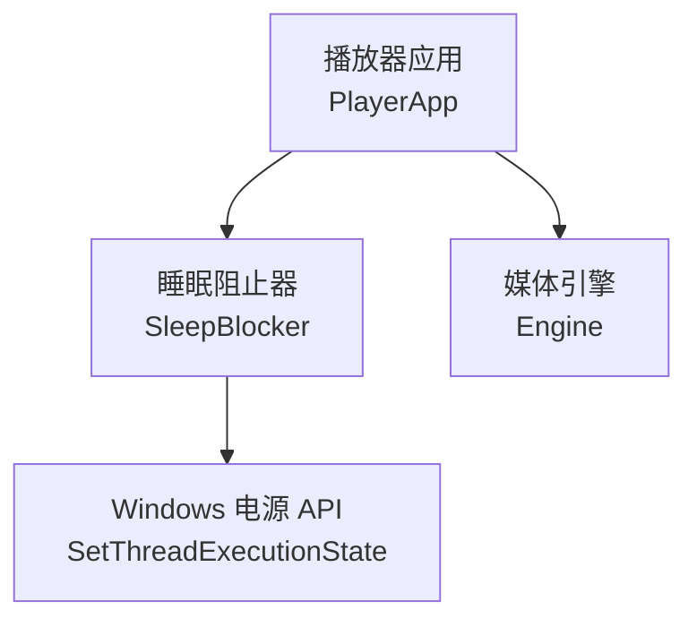
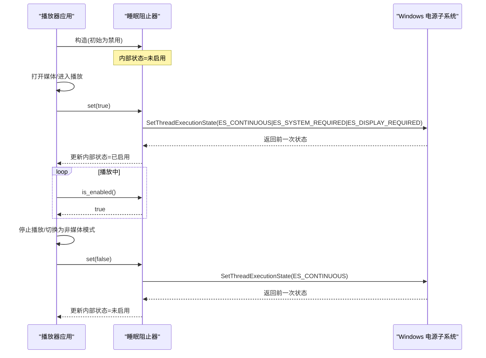
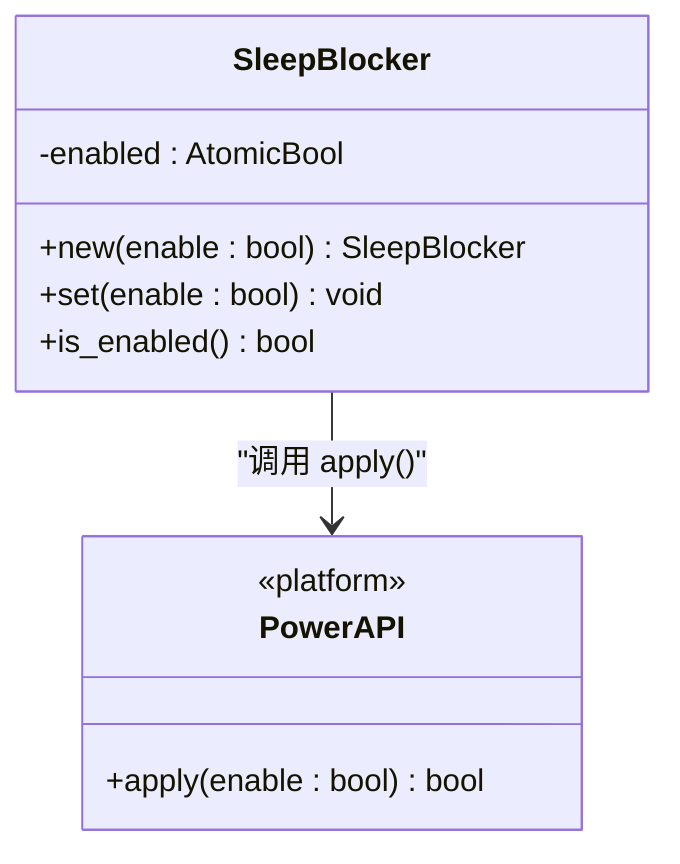
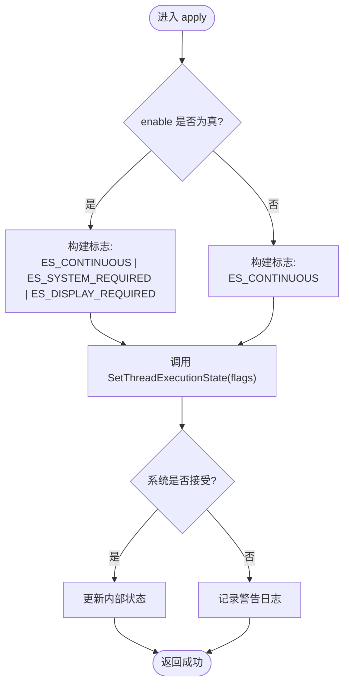
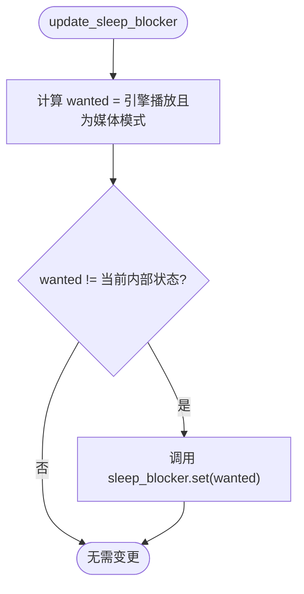
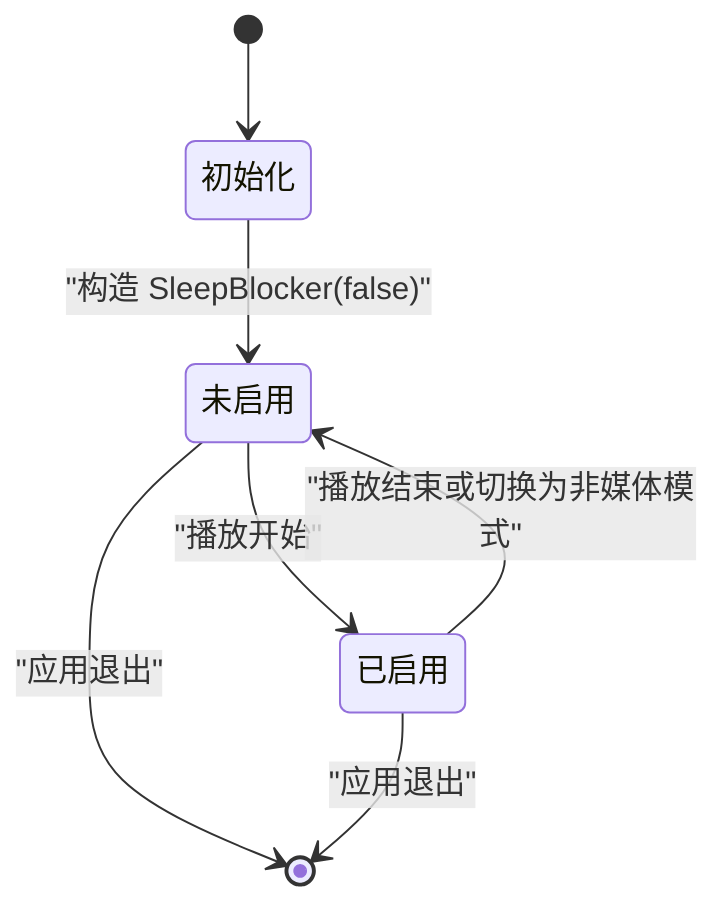

# 电源管理

<cite>
**本文引用的文件**   
- [power.rs](file://crates/mvp-platform/src/power.rs)
- [lib.rs](file://crates/mvp-platform/src/lib.rs)
- [Cargo.toml](file://crates/mvp-platform/Cargo.toml)
- [app.rs](file://crates/mvp-player/src/app.rs)
- [main.rs](file://crates/mvp-player/src/main.rs)
</cite>

## 目录
1. [引言](#引言)
2. [项目结构](#项目结构)
3. [核心组件](#核心组件)
4. [架构总览](#架构总览)
5. [详细组件分析](#详细组件分析)
6. [依赖关系分析](#依赖关系分析)
7. [性能与行为特征](#性能与行为特征)
8. [故障排查指南](#故障排查指南)
9. [结论](#结论)

## 引言
本文聚焦播放器中的“播放期间阻止屏幕休眠”的电源管理功能。该功能通过平台层封装 Windows 线程执行状态 API，在媒体播放时保持显示器和系统活跃，并在播放结束时恢复默认电源策略。文档将说明：
- 播放期间阻止屏幕休眠的系统 API 调用机制，尤其是 `SetThreadExecutionState` 的使用方式与标志位含义。
- 媒体播放时的电源状态管理策略：播放开始设置、播放结束恢复。
- 与 Windows 电源管理的交互方式：进程级请求、线程语义、以及非 Windows 平台的兼容处理。
- 多线程环境下的状态同步与竞态避免。
- 错误处理、异常恢复与资源清理机制。
- 实际代码示例路径，展示电源状态的设置、检查、恢复流程，以及与播放器生命周期的集成点。

## 项目结构
电源管理相关代码主要分布在两个 crate：
- `mvp-platform`：提供跨平台抽象，Windows 下调用系统 API，非 Windows 下提供空实现。
- `mvp-player`：播放器应用层，持有 `SleepBlocker` 实例，并根据播放状态驱动电源状态。

**图表来源**
- [app.rs:1477-1483](file://crates/mvp-player/src/app.rs#L1477-L1483)
- [power.rs:20-59](file://crates/mvp-platform/src/power.rs#L20-L59)
- [power.rs:62-78](file://crates/mvp-platform/src/power.rs#L62-L78)

**章节来源**
- [lib.rs:1-34](file://crates/mvp-platform/src/lib.rs#L1-L34)
- [main.rs:40-182](file://crates/mvp-player/src/main.rs#L40-L182)

## 核心组件
- `SleepBlocker`：封装“是否阻止屏幕休眠”的状态与系统调用。对外暴露构造、设置、查询接口；内部维护一个原子布尔值，记录最近一次成功设置后的期望状态。
- `apply(enable)`：平台相关函数。Windows 下调用 `SetThreadExecutionState`，非 Windows 下为空实现并返回成功。
- `PlayerApp::update_sleep_blocker`：根据当前引擎播放状态与显示模式，决定是否启用或释放电源阻止。

关键职责划分：
- 平台层负责系统调用细节与跨平台兼容。
- 应用层负责业务决策（何时需要阻止休眠）。

**章节来源**
- [power.rs:20-59](file://crates/mvp-platform/src/power.rs#L20-L59)
- [power.rs:62-86](file://crates/mvp-platform/src/power.rs#L62-L86)
- [app.rs:1477-1483](file://crates/mvp-player/src/app.rs#L1477-L1483)

## 架构总览
下图展示了播放器生命周期中电源状态的变化流程：从应用初始化到播放开始、播放中、播放结束，再到应用退出。

**图表来源**
- [app.rs:1477-1483](file://crates/mvp-player/src/app.rs#L1477-L1483)
- [power.rs:62-78](file://crates/mvp-platform/src/power.rs#L62-L78)

## 详细组件分析

### 睡眠阻止器 `SleepBlocker`
`SleepBlocker` 是电源管理的核心对象，职责包括：
- 维护当前“是否启用阻止休眠”的内部状态。
- 提供线程安全的设置与查询接口。
- 在 Windows 下调用系统 API，在非 Windows 下作为空操作。

**图表来源**
- [power.rs:20-59](file://crates/mvp-platform/src/power.rs#L20-L59)
- [power.rs:62-86](file://crates/mvp-platform/src/power.rs#L62-L86)

#### 构造与初始状态
- 构造时立即应用传入的初始值，便于在创建时就确定电源策略。
- 默认建议以“禁用”状态构造，由上层在播放开始时显式启用。

#### 设置与查询
- `set(enable)`：调用底层 `apply`，若系统接受则更新内部状态；否则记录警告日志。
- `is_enabled()`：返回最近一次成功设置后的内部状态，用于 UI 或逻辑判断。

#### 线程安全
- 使用原子布尔值存储状态，支持多线程并发访问。
- 模块注释强调：Windows 的“保持唤醒”绑定到线程执行状态，因此应由长期存活的 UI 线程驱动，短生命周期工作线程退出后请求会失效。

**章节来源**
- [power.rs:20-59](file://crates/mvp-platform/src/power.rs#L20-L59)
- [power.rs:88-124](file://crates/mvp-platform/src/power.rs#L88-L124)

### 系统 API 调用机制：`SetThreadExecutionState`
在 Windows 下，`apply` 函数根据 `enable` 参数组合不同的执行状态标志：
- 启用时：`ES_CONTINUOUS | ES_SYSTEM_REQUIRED | ES_DISPLAY_REQUIRED`
  - `ES_CONTINUOUS`：使状态持续生效，直到被再次清除。
  - `ES_SYSTEM_REQUIRED`：防止系统进入空闲或关闭状态。
  - `ES_DISPLAY_REQUIRED`：防止显示器关闭。
- 禁用时：仅使用 `ES_CONTINUOUS`，用于清除之前的请求。

返回值处理：
- 调用成功后，返回的前一状态非零表示系统接受了变更；内部据此更新状态。
- 失败时记录警告日志，不抛异常，保证播放器继续运行。

**图表来源**
- [power.rs:62-78](file://crates/mvp-platform/src/power.rs#L62-L78)

**章节来源**
- [power.rs:62-78](file://crates/mvp-platform/src/power.rs#L62-L78)

### 播放器集成：`PlayerApp::update_sleep_blocker`
播放器在每帧或状态变化时调用 `update_sleep_blocker`，根据以下条件决定是否需要阻止休眠：
- 引擎处于播放状态：`engine.is_playing()`
- 当前显示模式为媒体模式：`mode.is_media()`

如果计算出的期望状态与当前内部状态不同，则调用 `sleep_blocker.set(wanted)` 进行切换。

**图表来源**
- [app.rs:1477-1483](file://crates/mvp-player/src/app.rs#L1477-L1483)

**章节来源**
- [app.rs:1477-1483](file://crates/mvp-player/src/app.rs#L1477-L1483)

### 播放器生命周期中的电源状态管理
- 应用启动时：`PlayerApp` 构造 `SleepBlocker` 并初始化为禁用。
- 打开媒体：根据用户意图与引擎配置决定是否自动播放，但电源阻止仍由 `update_sleep_blocker` 统一决策。
- 播放开始：当引擎进入播放且显示模式为视频或音频时，启用阻止休眠。
- 播放结束或切换模式：当引擎暂停或切换到图片等模式时，释放阻止休眠。
- 应用退出：由于 `SleepBlocker` 析构不会自动恢复系统默认状态，应确保在播放结束时显式调用 `set(false)`。

**图表来源**
- [app.rs:309-318](file://crates/mvp-player/src/app.rs#L309-L318)
- [app.rs:1477-1483](file://crates/mvp-player/src/app.rs#L1477-L1483)

**章节来源**
- [app.rs:309-318](file://crates/mvp-player/src/app.rs#L309-L318)
- [app.rs:1477-1483](file://crates/mvp-player/src/app.rs#L1477-L1483)

## 依赖关系分析
- `mvp-platform` crate 暴露 `power` 模块，供上层播放器使用。
- Windows 特定依赖通过 `cfg(windows)` 编译开关引入，仅在 Windows 平台下链接 `Win32_System_Power` 等特性。
- 非 Windows 平台下，`apply` 为空实现，保证跨平台编译与运行。

**图表来源**
- [lib.rs:23-34](file://crates/mvp-platform/src/lib.rs#L23-L34)
- [Cargo.toml:14-39](file://crates/mvp-platform/Cargo.toml#L14-L39)

**章节来源**
- [lib.rs:1-34](file://crates/mvp-platform/src/lib.rs#L1-L34)
- [Cargo.toml:1-48](file://crates/mvp-platform/Cargo.toml#L1-L48)

## 性能与行为特征
- 幂等性：重复调用相同的 `set` 不会造成额外系统开销，因为内部状态比较会跳过不必要的系统调用。
- 线程安全：原子布尔值保证多线程环境下状态一致性，但需注意 Windows 的线程执行状态语义要求由长期存活线程驱动。
- 错误容忍：系统调用失败时记录警告日志，不中断播放器主流程。
- 资源清理：析构不自动恢复系统默认状态，需显式调用 `set(false)` 以避免残留影响。

[本节为通用指导，不直接分析具体文件]

## 故障排查指南
常见问题与定位方法：
- 播放期间屏幕仍可能休眠：
  - 检查是否在 UI 线程调用 `set(true)`。
  - 确认 `update_sleep_blocker` 被正常调用，且 `engine.is_playing()` 与 `mode.is_media()` 符合预期。
- 播放结束后屏幕无法恢复：
  - 检查是否在播放结束时调用了 `set(false)`。
  - 注意析构不会自动恢复，必须显式释放。
- 非 Windows 平台行为异常：
  - 确认 `apply` 为空实现，内部状态仅跟踪而不调用系统 API。
- 日志排查：
  - 关注 `log::warn!` 输出的“无法启用/禁用显示器休眠阻止”消息，表明系统调用失败。

**章节来源**
- [power.rs:43-53](file://crates/mvp-platform/src/power.rs#L43-L53)
- [power.rs:62-78](file://crates/mvp-platform/src/power.rs#L62-L78)
- [app.rs:1477-1483](file://crates/mvp-player/src/app.rs#L1477-L1483)

## 结论
本项目的电源管理通过 `SleepBlocker` 抽象了 Windows 线程执行状态 API，在播放器播放媒体时阻止屏幕休眠，并在播放结束时恢复默认电源策略。其设计具备跨平台兼容性、线程安全性与错误容忍能力。播放器应用层通过 `update_sleep_blocker` 将业务状态与系统电源策略解耦，确保电源状态随播放生命周期正确变化。在实际使用中，应始终在 UI 线程驱动电源状态，并在播放结束时显式释放阻止，以避免资源泄漏或系统行为异常。

[本节为总结性内容，不直接分析具体文件]