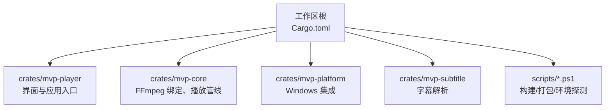
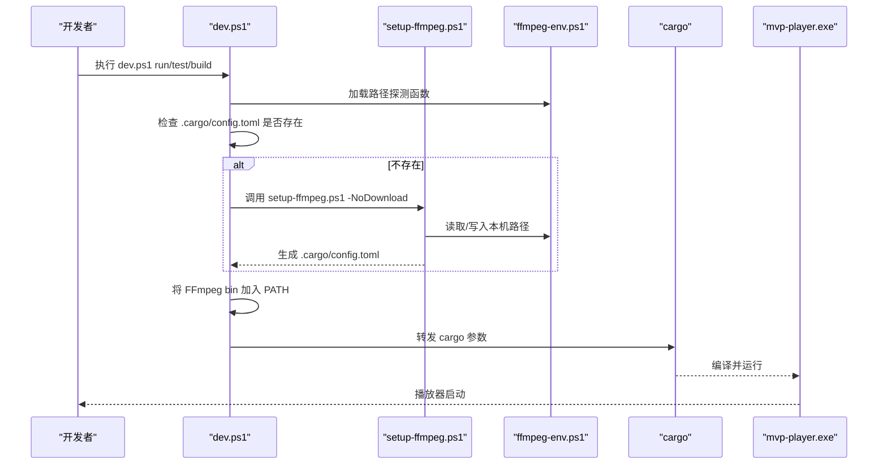
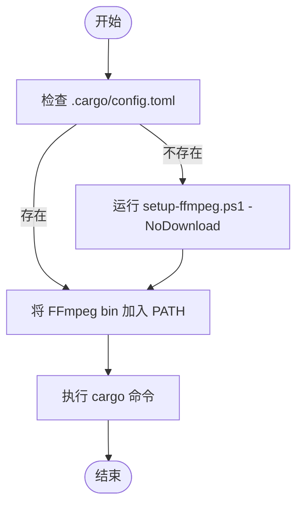
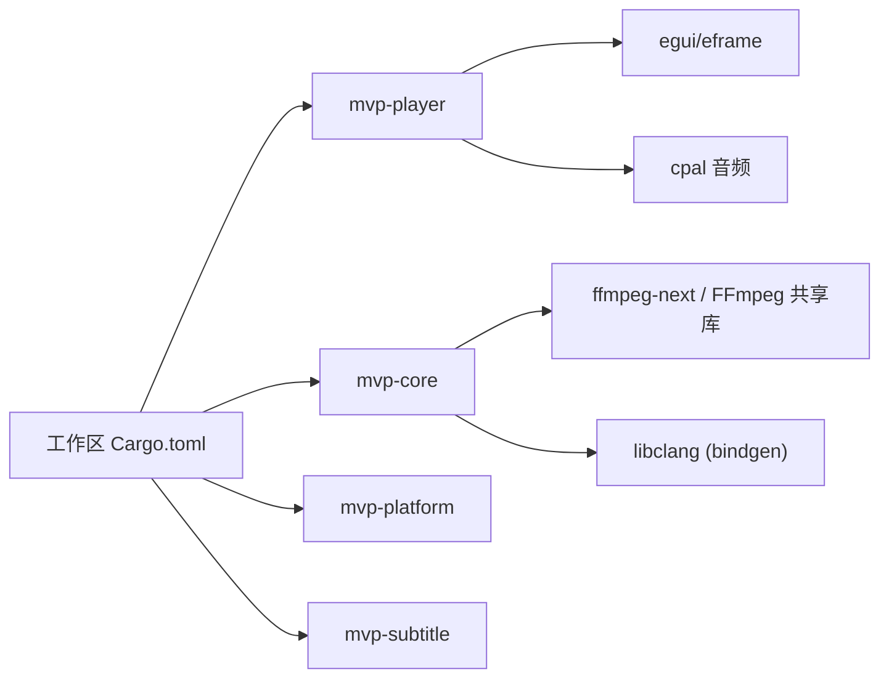

# 快速开始

<cite>
**本文引用的文件**
- [README.md](file://README.md)
- [Cargo.toml](file://Cargo.toml)
- [scripts/dev.ps1](file://scripts/dev.ps1)
- [scripts/setup-ffmpeg.ps1](file://scripts/setup-ffmpeg.ps1)
- [scripts/ffmpeg-env.ps1](file://scripts/ffmpeg-env.ps1)
</cite>

## 目录
1. [简介](#简介)
2. [项目结构](#项目结构)
3. [核心组件](#核心组件)
4. [架构总览](#架构总览)
5. [详细组件分析](#详细组件分析)
6. [依赖关系分析](#依赖关系分析)
7. [性能注意事项](#性能注意事项)
8. [故障排查指南](#故障排查指南)
9. [结论](#结论)
10. [附录](#附录)

## 简介
本指南面向首次接触 MVP-Versatile-Player 的开发者，目标是在最短时间内完成环境准备、构建与运行。你将学到：
- 如何安装 Rust 工具链并准备 FFmpeg 开发包与 libclang
- 如何使用脚本一键配置本机路径并完成构建与测试
- 如何理解 .cargo/config.toml 的作用以及如何手动指定 FFmpeg 与 libclang 路径
- 常见构建问题的定位与解决思路
- 测试运行命令与调试技巧

## 项目结构
仓库采用多 crate 工作区组织，核心可执行入口位于 mvp-player，媒体引擎在 mvp-core，平台集成在 mvp-platform，字幕解析在 mvp-subtitle。构建与打包由 scripts 下的 PowerShell 脚本统一封装，避免手工维护 PATH 与本地路径。

图表来源
- [Cargo.toml:1-8](file://Cargo.toml#L1-L8)

章节来源
- [Cargo.toml:1-8](file://Cargo.toml#L1-L8)

## 核心组件
- 工作区与版本
  - 工作区成员包含四个 crate；Rust 版本要求为 1.85+；发行版启用 LTO、单代码单元等优化策略以缩短启动时间并减小体积。
- 运行时依赖
  - 通过 ffmpeg-next 9.0.0 直接链接 FFmpeg 共享库；需要 MSVC 工具链（link.exe）与 Windows SDK。
- 脚本体系
  - dev.ps1：在执行 cargo 前自动注入 FFmpeg 的 bin 到 PATH，并在缺失本机配置时引导 setup-ffmpeg.ps1。
  - setup-ffmpeg.ps1：下载或复用 FFmpeg 共享开发包，探测 libclang，写入 .cargo/config.toml。
  - ffmpeg-env.ps1：提供跨脚本共享的路径探测逻辑（环境变量优先、配置文件次之、默认位置兜底）。

章节来源
- [README.md:153-253](file://README.md#L153-L253)
- [Cargo.toml:10-14](file://Cargo.toml#L10-L14)
- [Cargo.toml:36-38](file://Cargo.toml#L36-L38)
- [Cargo.toml:53-78](file://Cargo.toml#L53-L78)
- [scripts/dev.ps1:1-15](file://scripts/dev.ps1#L1-L15)
- [scripts/setup-ffmpeg.ps1:1-23](file://scripts/setup-ffmpeg.ps1#L1-L23)
- [scripts/ffmpeg-env.ps1:1-13](file://scripts/ffmpeg-env.ps1#L1-L13)

## 架构总览
下图展示了“新克隆仓库 → 自动准备 → 构建/运行”的整体流程，以及脚本之间的协作关系。

图表来源
- [scripts/dev.ps1:30-67](file://scripts/dev.ps1#L30-L67)
- [scripts/setup-ffmpeg.ps1:172-213](file://scripts/setup-ffmpeg.ps1#L172-L213)
- [scripts/ffmpeg-env.ps1:59-72](file://scripts/ffmpeg-env.ps1#L59-L72)

## 详细组件分析

### 环境准备与脚本使用
- 推荐方式：在工作区根目录执行一次环境准备，脚本会处理 FFmpeg 共享开发包与 libclang 的探测与配置写入。
- 常用命令
  - 构建：.\scripts\dev.ps1 build -p mvp-player
  - 运行：.\scripts\dev.ps1 run -p mvp-player
  - 发布构建：.\scripts\dev.ps1 build --release -p mvp-player
  - 全量测试：.\scripts\dev.ps1 test --workspace
- 说明
  - dev.ps1 会在找不到本机配置时自动调用 setup-ffmpeg.ps1（带 -NoDownload），避免静默下载大文件。
  - 它还会把 FFmpeg 的 bin 目录加入 PATH，确保 cargo run/test 能在运行时找到 DLL。

章节来源
- [README.md:164-189](file://README.md#L164-L189)
- [README.md:233-253](file://README.md#L233-L253)
- [scripts/dev.ps1:30-67](file://scripts/dev.ps1#L30-L67)

### .cargo/config.toml 的作用与配置
- 该文件由 setup-ffmpeg.ps1 在本机生成，记录的是“这台机器上 SDK 装在哪”，不会被纳入版本控制。
- 关键项
  - FFMPEG_DIR：指向 FFmpeg 共享开发包根目录（需包含 include、lib/*.lib、bin/*.dll）。
  - LIBCLANG_PATH：指向 libclang.dll 所在目录（可为空，脚本会尝试多种来源）。
  - BINDGEN_EXTRA_CLANG_ARGS：用于兼容 bindgen 对新增类型的处理。
- 手动配置
  - 若已有 FFmpeg 与 libclang，可直接设置同名环境变量或在 .cargo/config.toml 中写入对应键值；优先级为：环境变量 > 配置文件 > 默认位置。
  - 路径分隔符统一使用正斜杠，以避免因分隔符差异触发不必要的重新生成。

章节来源
- [README.md:191-218](file://README.md#L191-L218)
- [scripts/setup-ffmpeg.ps1:172-213](file://scripts/setup-ffmpeg.ps1#L172-L213)
- [scripts/ffmpeg-env.ps1:43-72](file://scripts/ffmpeg-env.ps1#L43-L72)

### 构建与运行流程
- 开发构建与运行
  - 使用 dev.ps1 包装 cargo，自动处理 PATH 与本机配置。
- 发布构建
  - 启用 LTO、strip 等优化，适合分发。
- 测试
  - 支持按工作区或指定 crate 运行测试。

图表来源
- [scripts/dev.ps1:30-67](file://scripts/dev.ps1#L30-L67)

章节来源
- [README.md:233-253](file://README.md#L233-L253)
- [scripts/dev.ps1:30-67](file://scripts/dev.ps1#L30-L67)

### 测试与调试
- 全量测试：.\scripts\dev.ps1 test --workspace
- 针对单个 crate：.\scripts\dev.ps1 test -p <crate>
- 日志与调试
  - 可通过环境变量开启更详细的日志输出（例如 RUST_LOG=...）。
  - 发布构建无控制台窗口，问题排查建议查看应用日志文件。

章节来源
- [README.md:457-545](file://README.md#L457-L545)

## 依赖关系分析
- 工作区成员与依赖
  - 工作区声明了四个 crate；核心依赖包括 ffmpeg-next、cpal、image、egui/eframe 等。
- 构建期依赖
  - ffmpeg-sys-next 通过 bindgen 生成绑定，需要 libclang。
- 运行期依赖
  - 直接链接 FFmpeg 共享库，运行时需能加载对应的 DLL（dev.ps1 负责 PATH 注入，build.rs 会将 DLL 复制到 target 目录以便直接运行）。

图表来源
- [Cargo.toml:1-8](file://Cargo.toml#L1-L8)
- [Cargo.toml:36-51](file://Cargo.toml#L36-L51)
- [scripts/dev.ps1:1-7](file://scripts/dev.ps1#L1-L7)

章节来源
- [Cargo.toml:1-8](file://Cargo.toml#L1-L8)
- [Cargo.toml:36-51](file://Cargo.toml#L36-L51)
- [scripts/dev.ps1:1-7](file://scripts/dev.ps1#L1-L7)

## 性能注意事项
- 发布构建已启用 LTO、单代码单元与 strip，有助于减小体积与提升启动速度。
- 开发构建保持增量编译以提升迭代效率。
- 运行时注意 FFmpeg DLL 的加载路径（dev.ps1 已处理），避免重复拷贝或遗漏导致启动失败。

章节来源
- [Cargo.toml:53-78](file://Cargo.toml#L53-L78)
- [scripts/dev.ps1:1-7](file://scripts/dev.ps1#L1-L7)

## 故障排查指南
- 找不到 libclang
  - 现象：bindgen 阶段报错提示未找到 libclang。
  - 处理：重新运行 setup-ffmpeg.ps1；如仍失败，安装 LLVM 或通过 pip install libclang 获取 libclang.dll，再重跑脚本。
- FFmpeg 链接错误或找不到 avcodec.lib
  - 现象：链接阶段报找不到导入库。
  - 处理：确认使用的是 FFmpeg 共享开发包（含 include、lib/*.lib、bin/*.dll），并通过 setup-ffmpeg.ps1 指定正确目录。
- 运行时找不到 DLL
  - 现象：运行时报 DLL 缺失。
  - 处理：确保通过 dev.ps1 运行，或将 FFmpeg 的 bin 目录加入 PATH；发布构建已将 DLL 复制到 target 目录附近。
- 配置不一致导致频繁重建
  - 现象：切换不同入口后反复触发 bindgen。
  - 处理：保证 FFMPEG_DIR 路径分隔符一致（正斜杠），避免环境变量与配置文件冲突。

章节来源
- [README.md:220-231](file://README.md#L220-L231)
- [scripts/setup-ffmpeg.ps1:152-170](file://scripts/setup-ffmpeg.ps1#L152-L170)
- [scripts/dev.ps1:53-64](file://scripts/dev.ps1#L53-L64)

## 结论
通过脚本化的一键准备与统一的构建入口，MVP-Versatile-Player 将复杂的本地依赖管理抽象为简单的命令。按照本指南完成环境准备后，即可快速构建、运行与测试。遇到常见问题时，优先检查本机配置与 FFmpeg/libclang 路径是否正确。

## 附录
- 命令行选项（示例）
  - 全屏启动、不自动播放、初始音量/速度、加载外部字幕等。
- 快捷键概览
  - 播放控制、跳转、音量、截图、全屏、画面调节等。
- 测试数据与样本
  - 测试媒体由脚本生成；杜比视界/HDR 相关测试可设置环境变量运行。

章节来源
- [README.md:266-313](file://README.md#L266-L313)
- [README.md:457-545](file://README.md#L457-L545)