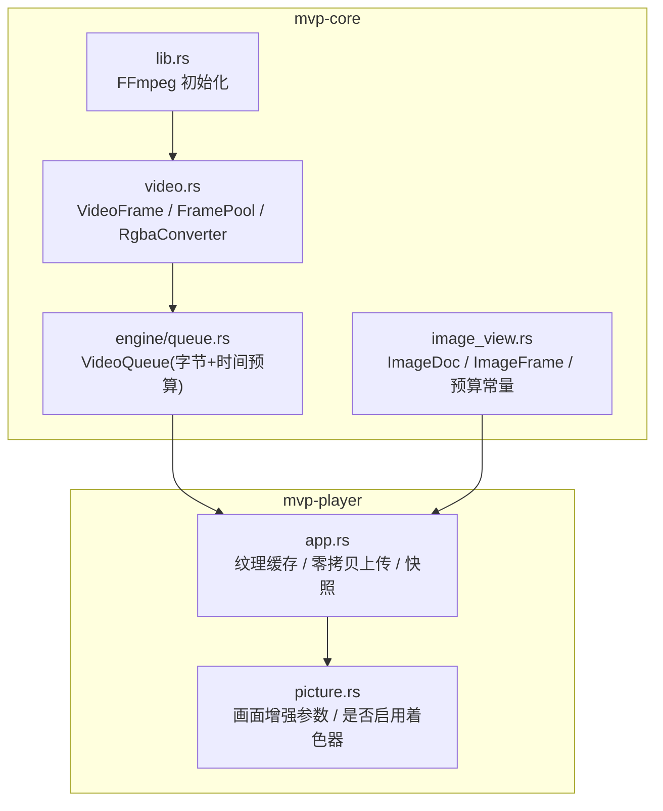
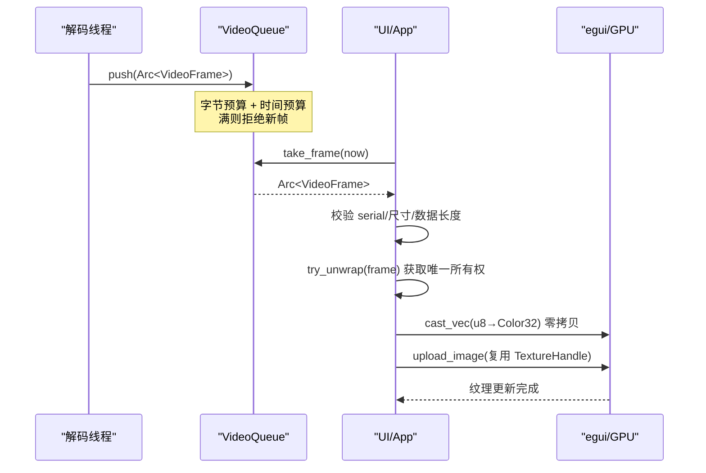
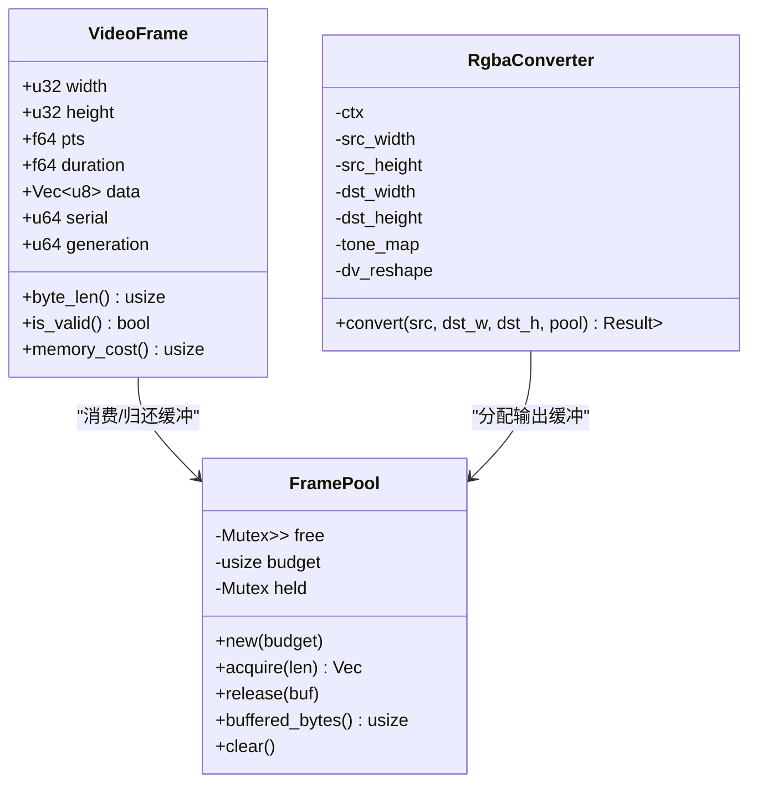
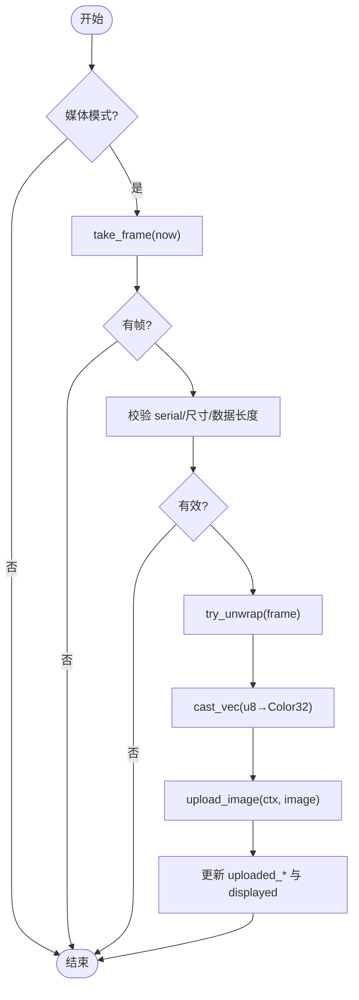
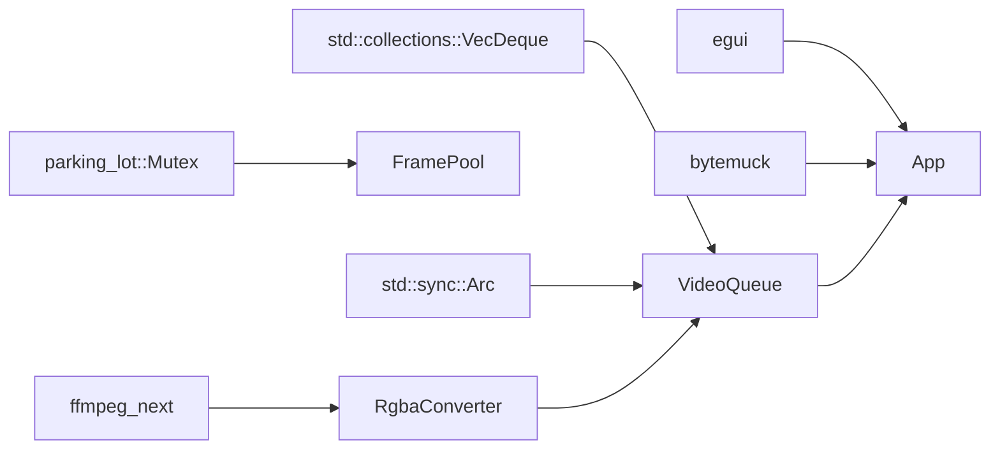

# 内存管理优化

<cite>
**本文引用的文件**   
- [video.rs](file://crates/mvp-core/src/video.rs)
- [queue.rs](file://crates/mvp-core/src/engine/queue.rs)
- [image_view.rs](file://crates/mvp-core/src/image_view.rs)
- [app.rs](file://crates/mvp-player/src/app.rs)
- [picture.rs](file://crates/mvp-player/src/picture.rs)
- [lib.rs](file://crates/mvp-core/src/lib.rs)
</cite>

## 目录
1. [引言](#引言)
2. [项目结构](#项目结构)
3. [核心组件](#核心组件)
4. [架构总览](#架构总览)
5. [详细组件分析](#详细组件分析)
6. [依赖关系分析](#依赖关系分析)
7. [性能与内存特性](#性能与内存特性)
8. [故障排查指南](#故障排查指南)
9. [结论](#结论)
10. [附录：最佳实践清单](#附录最佳实践清单)

## 引言
本文件聚焦该多媒体播放器在内存管理方面的设计与实现，覆盖以下关键主题：
- 帧池化机制：VideoFrame 的 Arc 引用计数、内存成本计算、生命周期管理。
- 纹理缓存策略：GPU 纹理复用、内存预算控制、自动清理机制。
- 零拷贝渲染技术：从解码到 GPU 的数据直通路径（当前为 CPU RGBA 直传到 egui/GPU）。
- 内存泄漏防护：RAII 模式、资源清理、错误路径处理。
- 监控与分析：内存使用观测点、性能分析工具建议、内存压力下的降级策略。
- 代码级示例与最佳实践：以源码位置标注替代直接粘贴代码。

本项目采用“按功能模块组织”的结构，核心解码与帧缓冲位于 mvp-core，UI 与渲染位于 mvp-player。视频帧以紧凑 RGBA 字节缓冲表示，并通过队列与池化机制控制内存占用；UI 层通过 egui 将像素上传至 GPU 纹理，同时避免重复上传。

## 项目结构
围绕内存管理的核心文件分布如下：
- mvp-core
  - video.rs：VideoFrame、FramePool、RgbaConverter、颜色转换与色调映射。
  - engine/queue.rs：有界视频帧队列，基于字节与时序预算控制。
  - image_view.rs：静态/动画图像加载、尺寸限制、动画帧预算。
  - lib.rs：库入口与 FFmpeg 初始化。
- mvp-player
  - app.rs：应用状态、纹理缓存、零拷贝上传、快照与显示。
  - picture.rs：画面增强参数计算，间接影响渲染路径选择。

图表来源
- [video.rs:18-142](file://crates/mvp-core/src/video.rs#L18-L142)
- [queue.rs:67-253](file://crates/mvp-core/src/engine/queue.rs#L67-L253)
- [image_view.rs:15-27](file://crates/mvp-core/src/image_view.rs#L15-L27)
- [app.rs:708-831](file://crates/mvp-player/src/app.rs#L708-L831)
- [picture.rs:338-372](file://crates/mvp-player/src/picture.rs#L338-L372)
- [lib.rs:50-69](file://crates/mvp-core/src/lib.rs#L50-L69)

章节来源
- [lib.rs:1-43](file://crates/mvp-core/src/lib.rs#L1-L43)

## 核心组件
- VideoFrame：表示一帧已解码、可直接显示的 RGBA 数据，包含宽高、PTS、时长、像素缓冲、序列号与生成代次。提供 byte_len 与 memory_cost 用于内存预算。
- FramePool：RGBA 字节缓冲池，按“最适配”策略复用缓冲区，维护持有字节数上限与最大空闲列表长度，支持 clear 释放所有空闲缓冲。
- RgbaConverter：将任意 FFmpeg 像素格式转换为紧凑 RGBA，并可选进行 HDR→SDR 色调映射与杜比视界重塑；内部缓存 SwsContext，减少重建开销。
- VideoQueue：有界 FIFO，按字节预算与时间预算双重约束，拒绝新帧时不丢弃旧帧，保证可播放性；提供 take_ready 跳过过期帧。
- ImageDoc/ImageFrame：静态/动画图像模型，带 MAX_DIMENSION、MAX_PIXELS、MAX_ANIMATION_FRAMES、MAX_ANIMATION_BYTES 等硬限制，防止超大纹理或过多动画帧导致内存爆炸。
- App 纹理缓存：记录 uploaded_serial/uploaded_pts/uploaded_size 与 uploaded_image，避免重复上传；使用 egui 的 TextureHandle 复用 GPU 纹理。

章节来源
- [video.rs:18-142](file://crates/mvp-core/src/video.rs#L18-L142)
- [video.rs:553-706](file://crates/mvp-core/src/video.rs#L553-L706)
- [queue.rs:67-253](file://crates/mvp-core/src/engine/queue.rs#L67-L253)
- [image_view.rs:15-27](file://crates/mvp-core/src/image_view.rs#L15-L27)
- [app.rs:708-831](file://crates/mvp-player/src/app.rs#L708-L831)

## 架构总览
下图展示从解码到渲染的关键内存路径：解码线程产出 VideoFrame → 进入 VideoQueue（受字节/时间预算）→ UI 线程取帧 → 零拷贝 reinterpret 为 Color32 → 交给 egui 纹理缓存 → GPU 渲染。

图表来源
- [queue.rs:180-253](file://crates/mvp-core/src/engine/queue.rs#L180-L253)
- [app.rs:708-831](file://crates/mvp-player/src/app.rs#L708-L831)

## 详细组件分析

### 帧池化机制：VideoFrame、Arc 引用计数、内存成本与生命周期
- VideoFrame.memory_cost 返回 data.capacity().max(data.len())，用于队列预算统计。
- VideoFrame.generation 用于 seek 后丢弃旧代次帧，避免陈旧数据污染显示。
- VideoFrame.serial 用于 UI 层去重上传，避免同一帧重复上传。
- 帧在队列中以 Arc<VideoFrame> 共享，但 UI 层期望唯一所有权以便零拷贝 reinterpret；测试断言每个被取出的帧都能 unwrap，确保引擎不持有额外引用。

图表来源
- [video.rs:18-142](file://crates/mvp-core/src/video.rs#L18-L142)
- [video.rs:553-706](file://crates/mvp-core/src/video.rs#L553-L706)

章节来源
- [video.rs:18-142](file://crates/mvp-core/src/video.rs#L18-L142)
- [video.rs:553-706](file://crates/mvp-core/src/video.rs#L553-L706)
- [player_loop 测试:69-89](file://crates/mvp-core/tests/player_loop.rs#L69-L89)

### 纹理缓存策略：GPU 纹理复用、内存预算控制、自动清理
- App 层维护 texture: Option<TextureHandle>，首次创建后复用 set(...) 更新内容，避免频繁创建销毁。
- 视频路径通过 uploaded_serial/uploaded_pts/uploaded_size 判断是否需要重新上传；图片路径通过 (viewer serial, frame index) 键值去重。
- 快照 displayed 使用 Arc<ColorImage> 保留最近一次显示的图片，避免再次请求引擎。
- 当帧无效或尺寸异常时，直接跳过上传，避免浪费。

图表来源
- [app.rs:708-831](file://crates/mvp-player/src/app.rs#L708-L831)

章节来源
- [app.rs:708-831](file://crates/mvp-player/src/app.rs#L708-L831)

### 零拷贝渲染技术：Direct3D 11 VA 硬件解码、纹理共享、数据直通传输
- 当前实现路径：解码得到紧凑 RGBA 字节缓冲，UI 层将其 reinterpret 为 egui::Color32，再交由 egui 上传至 GPU 纹理。此路径避免了像素复制。
- Direct3D 11 VA 硬件解码与纹理共享：仓库未提供 D3D11 VA 相关实现；当前渲染基于 OpenGL/GLFW/egui 路径。若未来引入 D3D11 VA，应遵循相同原则：保持帧数据的唯一所有权，避免中间拷贝，直接将硬件表面映射到 GPU 纹理。
- 数据直通传输：RgbaConverter.convert 直接从 FramePool 分配输出缓冲，写入紧凑 RGBA，随后由 UI 层零拷贝 reinterpret 上传。

章节来源
- [video.rs:687-706](file://crates/mvp-core/src/video.rs#L687-L706)
- [app.rs:738-765](file://crates/mvp-player/src/app.rs#L738-L765)

### 内存泄漏防护：RAII 模式、资源清理、错误路径处理
- RAII：VideoFrame、Vec<u8>、TextureHandle、Arc<T> 均遵循 RAII，离开作用域即释放。
- 资源清理：
  - FramePool.clear 清空空闲缓冲并重置 held 计数。
  - VideoQueue.clear 清空帧队列并重置 bytes。
  - ImageView.close 清除 doc 并递增 serial，避免旧图残留。
- 错误路径：
  - VideoQueue.try_push 在队列满时返回原帧，调用方需等待空间，不丢弃旧帧。
  - RgbaConverter.prepare 对非法尺寸/空指针/未知格式返回 MediaError，避免越界访问。
  - ImageDoc.load 对超大像素数/过大维度进行提前拒绝或下采样，避免 OOM。

章节来源
- [video.rs:751-800](file://crates/mvp-core/src/video.rs#L751-L800)
- [queue.rs:180-210](file://crates/mvp-core/src/engine/queue.rs#L180-L210)
- [image_view.rs:415-492](file://crates/mvp-core/src/image_view.rs#L415-L492)

### 内存使用监控与性能分析
- 监控点：
  - FramePool.buffered_bytes：空闲缓冲占用字节。
  - VideoQueue.bytes：队列中像素字节总数。
  - RgbaConverter.last_tone_map_ms：色调映射耗时（毫秒）。
  - App.uploaded_serial/uploaded_pts/uploaded_size：用于判断重复上传。
- 性能分析建议：
  - 使用 Rust 性能剖析工具（如 cargo-flamegraph、perf、Visual Studio Profiler）定位 convert/scale/tone map 热点。
  - 观察 VideoQueue.is_full 触发频率，评估解码速度 vs 显示速率。
  - 监控 FramePool.acquire/release 次数，评估缓冲复用效果。

章节来源
- [video.rs:132-141](file://crates/mvp-core/src/video.rs#L132-L141)
- [video.rs:677-681](file://crates/mvp-core/src/video.rs#L677-L681)
- [queue.rs:159-168](file://crates/mvp-core/src/engine/queue.rs#L159-L168)

### 内存压力下的降级策略
- 队列层面：
  - 字节预算超限时拒绝新帧，不丢弃旧帧，保证可播放性。
  - 时间预算限制解码超前量，降低延迟。
- 图像层面：
  - MAX_DIMENSION 强制下采样，避免 GPU 拒绝超大纹理。
  - MAX_PIXELS/MAX_ANIMATION_FRAMES/MAX_ANIMATION_BYTES 限制单帧像素数、动画帧数与总字节数。
- 渲染层面：
  - 跳过无效帧或尺寸异常帧，避免无意义上传。
  - 图片路径使用 identity key 去重，避免重复转换与上传。

章节来源
- [queue.rs:88-147](file://crates/mvp-core/src/engine/queue.rs#L88-L147)
- [image_view.rs:15-27](file://crates/mvp-core/src/image_view.rs#L15-L27)
- [image_view.rs:465-492](file://crates/mvp-core/src/image_view.rs#L465-L492)
- [app.rs:771-808](file://crates/mvp-player/src/app.rs#L771-L808)

## 依赖关系分析
- VideoFrame 依赖 ffmpeg_next 提供的 AVFrame/像素格式信息（通过 RgbaConverter 使用）。
- FramePool 依赖 parking_lot::Mutex 保护空闲缓冲列表与持有字节计数。
- VideoQueue 依赖 std::collections::VecDeque 与 Arc<VideoFrame> 实现有界队列。
- App 依赖 egui 的 TextureHandle 与 ColorImage，以及 bytemuck 进行类型双关。
- Picture 模块独立于渲染后端，仅计算增强参数，决定是否走着色器路径。

图表来源
- [video.rs:10-12](file://crates/mvp-core/src/video.rs#L10-L12)
- [video.rs:12-12](file://crates/mvp-core/src/video.rs#L12-L12)
- [queue.rs:4-9](file://crates/mvp-core/src/engine/queue.rs#L4-L9)
- [app.rs:738-748](file://crates/mvp-player/src/app.rs#L738-L748)

章节来源
- [video.rs:10-12](file://crates/mvp-core/src/video.rs#L10-L12)
- [queue.rs:4-9](file://crates/mvp-core/src/engine/queue.rs#L4-L9)
- [app.rs:738-748](file://crates/mvp-player/src/app.rs#L738-L748)

## 性能与内存特性
- 帧池化：
  - acquire 使用“最适配”策略，避免大缓冲小用。
  - release 限制空闲列表长度（≤24），避免过多缓冲占用内存。
- 队列预算：
  - 字节预算 + 时间预算双重约束，防止解码过快导致内存膨胀与延迟增加。
- 零拷贝：
  - u8→Color32 通过 cast_vec 零拷贝，避免像素复制。
  - 纹理复用避免 GPU 对象频繁创建销毁。
- 色调映射：
  - 仅在需要时重建 ToneMapper，平滑场景峰值变化，避免每帧重建。
- 图像加载：
  - 超大图像下采样，动画帧数量与总字节限制，防止 OOM。

章节来源
- [video.rs:82-141](file://crates/mvp-core/src/video.rs#L82-L141)
- [queue.rs:88-147](file://crates/mvp-core/src/engine/queue.rs#L88-L147)
- [app.rs:738-765](file://crates/mvp-player/src/app.rs#L738-L765)
- [image_view.rs:465-492](file://crates/mvp-core/src/image_view.rs#L465-L492)

## 故障排查指南
- 现象：画面卡顿或解码掉帧
  - 检查 VideoQueue.is_full 是否频繁触发，调整 budget_bytes 或 time_budget。
  - 观察 RgbaConverter.last_tone_map_ms，确认色调映射是否成为瓶颈。
- 现象：内存持续增长
  - 检查 FramePool.buffered_bytes 是否增长，确认 release 是否正常调用。
  - 检查 VideoQueue.bytes 是否持续增长，确认 pop_front/take_ready 是否正常消费。
- 现象：纹理上传失败或黑屏
  - 检查 frame.serial 是否与 uploaded_serial 一致，避免重复上传。
  - 检查 frame.width/height/data.len() 是否有效，避免无效帧上传。
- 现象：图片加载崩溃或 OOM
  - 检查 MAX_DIMENSION/MAX_PIXELS/MAX_ANIMATION_BYTES 是否被绕过。
  - 确认 load 函数中的下采样与预算检查是否生效。

章节来源
- [queue.rs:180-253](file://crates/mvp-core/src/engine/queue.rs#L180-L253)
- [video.rs:677-681](file://crates/mvp-core/src/video.rs#L677-L681)
- [app.rs:720-765](file://crates/mvp-player/src/app.rs#L720-L765)
- [image_view.rs:465-492](file://crates/mvp-core/src/image_view.rs#L465-L492)

## 结论
该项目通过严格的内存预算、帧池化、零拷贝上传与纹理复用，实现了高效且安全的视频/图像渲染路径。尽管尚未集成 Direct3D 11 VA 硬件解码，但其设计原则（唯一所有权、零拷贝、预算控制）为后续扩展提供了坚实基础。建议在引入硬件解码时，继续保持现有架构的清晰边界与内存安全约定。

## 附录：最佳实践清单
- 始终使用 FramePool.acquire/release 管理像素缓冲，避免频繁分配。
- 设置合理的 VideoQueue.budget_bytes 与 time_budget，平衡内存与延迟。
- 在 UI 层使用 uploaded_serial/uploaded_image 去重，避免重复上传。
- 对超大图像执行下采样，遵守 MAX_DIMENSION/MAX_PIXELS/MAX_ANIMATION_BYTES。
- 在错误路径中尽早返回，避免无效帧进入渲染管线。
- 定期监控 FramePool.buffered_bytes 与 VideoQueue.bytes，发现内存泄漏迹象。
- 引入硬件解码时，保持帧数据的唯一所有权，避免中间拷贝。