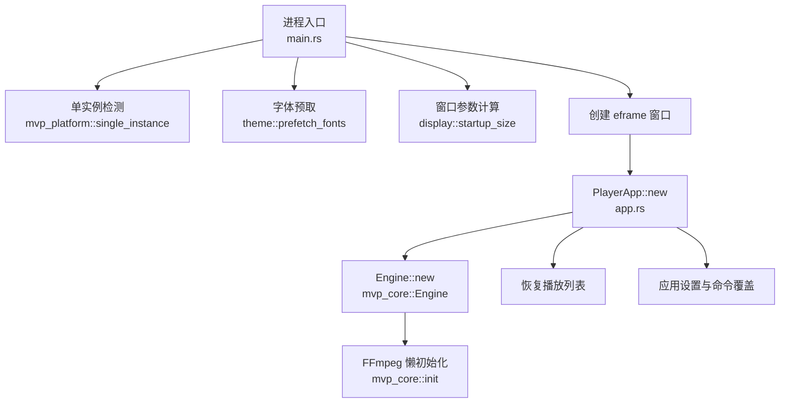
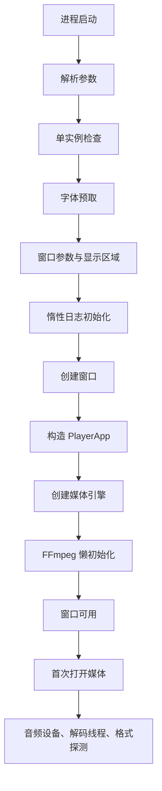
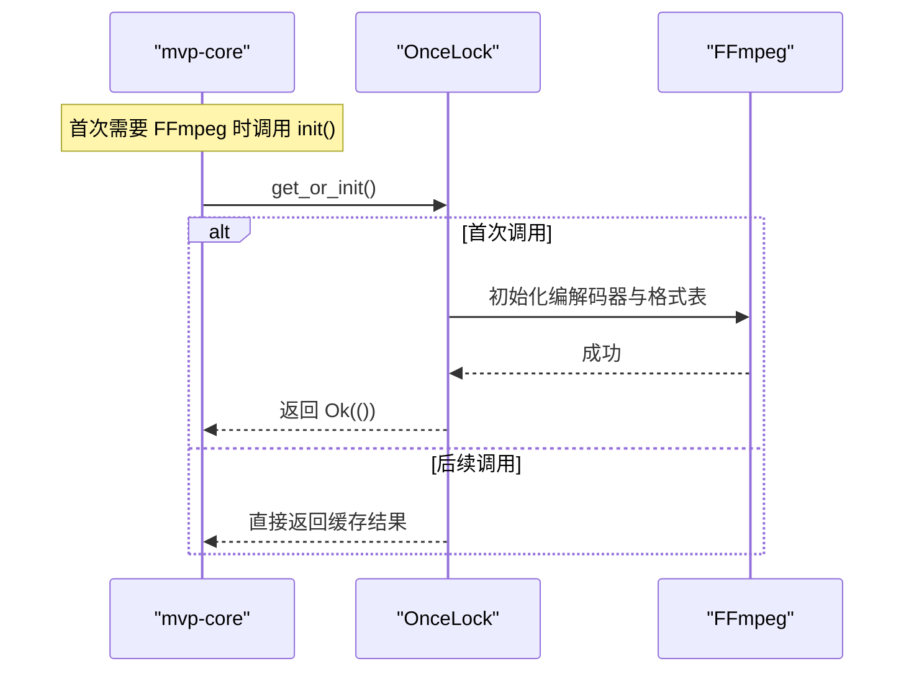
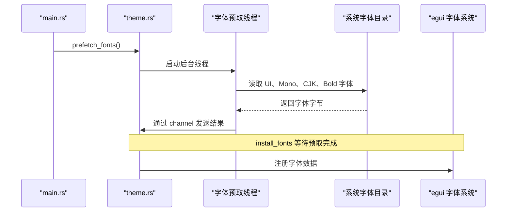
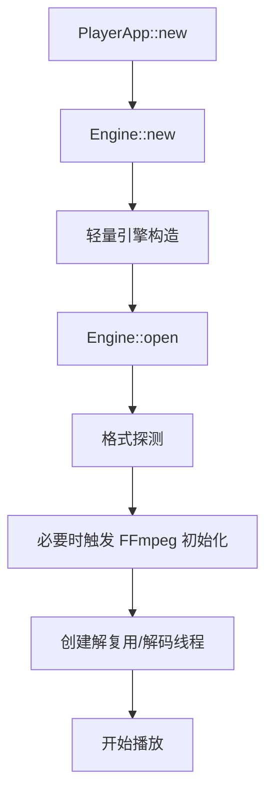
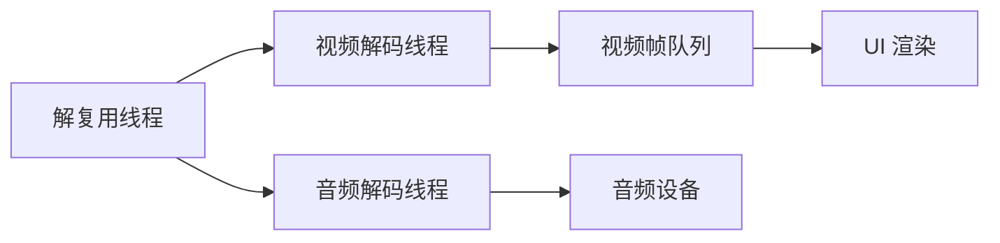
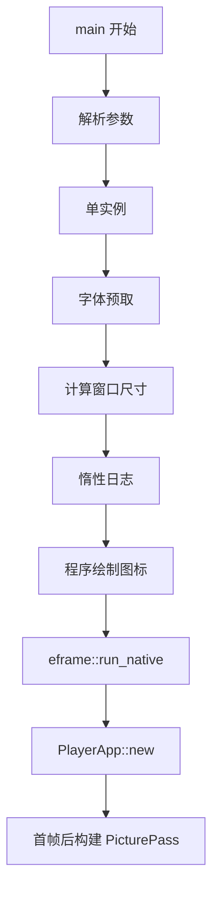
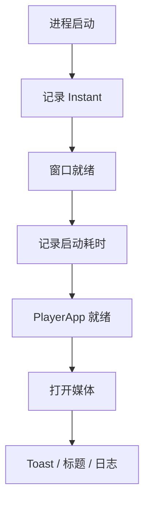

# 启动优化

<cite>
**本文引用的文件**   
- [main.rs](file://crates/mvp-player/src/main.rs)
- [app.rs](file://crates/mvp-player/src/app.rs)
- [lib.rs](file://crates/mvp-core/src/lib.rs)
- [engine.rs](file://crates/mvp-core/src/engine.rs)
- [workers.rs](file://crates/mvp-core/src/engine/workers.rs)
- [theme.rs](file://crates/mvp-player/src/theme.rs)
- [Cargo.toml](file://Cargo.toml)
- [mvp-player Cargo.toml](file://crates/mvp-player/Cargo.toml)
</cite>

## 目录

1. [引言](#引言)
2. [项目结构与启动入口](#项目结构与启动入口)
3. [核心启动优化策略总览](#核心启动优化策略总览)
4. [懒加载策略：模块延迟初始化、资源按需加载、FFmpeg 延迟加载](#懒加载策略模块延迟初始化资源按需加载ffmpeg-延迟加载)
5. [资源预取机制：关键资源提前加载、背景任务调度、I/O 并发优化](#资源预取机制关键资源提前加载背景任务调度io-并发优化)
6. [FFmpeg 初始化时机控制：编解码器注册、格式探测优化、线程池配置](#ffmpeg-初始化时机控制编解码器注册格式探测优化线程池配置)
7. [应用启动流程优化：主线程快速响应、后台初始化任务、进度反馈机制](#应用启动流程优化主线程快速响应后台初始化任务进度反馈机制)
8. [启动时间分析与性能特征](#启动时间分析与性能特征)
9. [依赖关系与构建优化](#依赖关系与构建优化)
10. [冷启动性能调优实践](#冷启动性能调优实践)
11. [故障排查与常见问题](#故障排查与常见问题)
12. [结论](#结论)

## 引言

本项目的目标是提供一个以 FFmpeg 为内核的多功能音视频与图片播放器，同时把“用户双击文件后尽快看到窗口”作为启动体验的核心指标。代码中明确强调：**窗口出现之前不做昂贵操作**；FFmpeg 的表结构在首次使用时才初始化，音频设备在第一次播放时才打开，CJK 字体是启动时唯一被读取的文件。

从架构上看，项目采用多 crate 分层：

- `mvp-player`：图形界面、窗口管理、UI 状态、启动入口。
- `mvp-core`：媒体引擎、FFmpeg 绑定、解复用、解码、队列、图像视图、播放列表。
- `mvp-platform`：平台能力，包括单实例、电源、显示器、Shell 等。
- `mvp-subtitle`：字幕解析。

启动优化的核心思想可以概括为：**主线程只做最小必要工作，把 I/O、重型初始化、GPU 相关准备尽量推到后台或延迟到真正需要时**。

**图表来源**   
- [main.rs:40-181](file://crates/mvp-player/src/main.rs#L40-L181)
- [app.rs:206-353](file://crates/mvp-player/src/app.rs#L206-L353)
- [lib.rs:50-69](file://crates/mvp-core/src/lib.rs#L50-L69)

**章节来源**   
- [main.rs:1-14](file://crates/mvp-player/src/main.rs#L1-L14)
- [lib.rs:1-18](file://crates/mvp-core/src/lib.rs#L1-L18)

## 项目结构与启动入口

### 进程入口职责

`main.rs` 的注释明确列出了入口的职责顺序：

1. 解析命令行参数。
2. 申请单实例互斥量；如果已有实例，则把文件列表交给已有实例并退出。
3. 创建窗口并把控制权交给 `PlayerApp`。

这个顺序非常重要：它保证了“双击十个文件不会打开十个窗口”，而是合并到一个播放列表中。

### 启动阶段的关键决策点

| 阶段 | 主要动作 | 是否阻塞主线程 | 优化意义 |
|---|---|---|---|
| 参数解析 | 手动解析 `-h`、`-v`、`--fullscreen`、`--no-autoplay`、`--volume`、`--speed`、`--subtitle` 等 | 否 | 避免引入大型参数解析库，保持二进制小且启动快 |
| 单实例检测 | 尝试成为主实例，否则向已有实例发送消息 | 否 | 避免重复启动，减少资源竞争 |
| 字体预取 | 后台线程读取系统字体栈 | 否 | 与 GL 上下文初始化重叠 |
| 窗口尺寸计算 | 根据上次保存的尺寸和当前屏幕可用性调整 | 否 | 避免打开超出屏幕的窗口 |
| 日志初始化 | 使用惰性写入器，首次写日志时才打开文件 | 否 | 避免杀毒软件或网络路径导致的启动卡顿 |
| 窗口创建 | 调用 `eframe::run_native` | 是，但只做最小初始化 | 保证 UI 尽快可见 |
| 应用构造 | 构造 `PlayerApp`，创建引擎、播放列表、主题 | 是，但避免重型 GPU 编译 | 首帧渲染前不阻塞 |

**章节来源**   
- [main.rs:40-181](file://crates/mvp-player/src/main.rs#L40-L181)
- [main.rs:296-347](file://crates/mvp-player/src/main.rs#L296-L347)

## 核心启动优化策略总览

本项目在启动优化上采用了五类策略：

| 策略类别 | 具体实现 | 目标 |
|---|---|---|
| 懒加载 | FFmpeg 初始化、音频设备打开、解码线程创建都推迟到首次使用 | 缩短冷启动时间 |
| 资源预取 | 字体文件在后台线程预读 | 隐藏磁盘 I/O |
| 主线程精简 | 启动路径只保留必要逻辑 | 让窗口尽快出现 |
| 后台任务 | 字体读取、IPC 窗口、对话框、截图回读等放在后台 | 避免阻塞 UI |
| 构建优化 | Release 开启 LTO、strip、优化等级 3 | 提升运行期性能 |

**图表来源**   
- [main.rs:40-181](file://crates/mvp-player/src/main.rs#L40-L181)
- [app.rs:206-353](file://crates/mvp-player/src/app.rs#L206-L353)
- [lib.rs:50-69](file://crates/mvp-core/src/lib.rs#L50-L69)

**章节来源**   
- [main.rs:101-109](file://crates/mvp-player/src/main.rs#L101-L109)
- [lib.rs:11-13](file://crates/mvp-core/src/lib.rs#L11-L13)

## 懒加载策略：模块延迟初始化、资源按需加载、FFmpeg 延迟加载

### FFmpeg 懒初始化

`mvp-core` 通过 `OnceLock` 保证 FFmpeg 在整个进程生命周期内只初始化一次。关键点如下：

- `init()` 内部调用 `ffmpeg_next::init()`。
- 将 FFmpeg 默认日志级别设为错误级别，避免无关输出干扰。
- 版本信息、配置信息、GPL 判断等方法都会触发懒初始化。
- 初始化失败会包装成 `MediaError::Other`。

这种设计的好处是：**即使用户只是输入了错误的命令行参数并退出，也不会先承担 FFmpeg 初始化的成本**。

**图表来源**   
- [lib.rs:48-69](file://crates/mvp-core/src/lib.rs#L48-L69)

**章节来源**   
- [lib.rs:48-69](file://crates/mvp-core/src/lib.rs#L48-L69)

### 模块延迟初始化

`mvp-core` 的文档明确指出：

- 没有外部子进程。
- `Engine::new` 只初始化 FFmpeg 的表。
- 音频设备在第一次 `Engine::open` 时打开。
- 解码线程在第一次 `Engine::open` 时创建。

这意味着启动阶段只需要构造轻量对象，真正的重型资源在播放媒体时才分配。

**章节来源**   
- [lib.rs:1-18](file://crates/mvp-core/src/lib.rs#L1-L18)
- [engine.rs:1-21](file://crates/mvp-core/src/engine.rs#L1-L21)

### 资源按需加载

项目中多处体现了“需要时才加载”的原则：

| 资源 | 加载时机 | 原因 |
|---|---|---|
| FFmpeg 编解码器表 | 首次调用 `init()` | 避免无意义的启动开销 |
| 音频设备 | 首次播放音频 | 避免静音模式下打开设备 |
| 字体文件 | 首次安装主题或预取线程完成 | 避免阻塞窗口创建 |
| 字幕文件 | 用户显式加载或检测到侧边字幕 | 避免不必要的解析 |
| 图形字幕 | 检测到 `.sup` 等格式时解码 | 文本字幕不需要解码图片 |
| 截图回读 | 需要包含 GPU 调整后画面时才执行 | 避免每帧都进行 GPU 回读 |

**章节来源**   
- [app.rs:614-668](file://crates/mvp-player/src/app.rs#L614-L668)
- [theme.rs:888-910](file://crates/mvp-player/src/theme.rs#L888-L910)

## 资源预取机制：关键资源提前加载、背景任务调度、I/O 并发优化

### 字体预取

字体预取是本项目最典型的启动 I/O 隐藏策略。

核心流程：

1. `main.rs` 在创建窗口前调用 `theme::prefetch_fonts()`。
2. `prefetch_fonts` 启动名为 `mvp-fonts` 的后台线程。
3. 后台线程读取 Windows 字体目录中的候选字体文件。
4. 字体数据通过 channel 传回。
5. `install_fonts` 在首次安装主题时等待预取结果。
6. 如果预取未完成，`take_prefetched` 会阻塞等待；如果预取已完成，则直接使用内存中的字节。

**图表来源**   
- [main.rs:101-109](file://crates/mvp-player/src/main.rs#L101-L109)
- [theme.rs:888-910](file://crates/mvp-player/src/theme.rs#L888-L910)
- [theme.rs:925-980](file://crates/mvp-player/src/theme.rs#L925-L980)

### 为什么字体预取能加速启动

代码注释指出：

- 字体栈总共约 37 MB，分布在五个文件中。
- 磁盘读取耗时约 18 ms。
- 如果没有预取，这段 I/O 会落在 GL 上下文创建之后，成为第一帧的关键路径。
- 有了预取后，I/O 与驱动初始化（约 160 ms）重叠。

这是一种典型的 **I/O 与 GPU 初始化并行化** 策略。

**章节来源**   
- [theme.rs:862-871](file://crates/mvp-player/src/theme.rs#L862-L871)
- [theme.rs:888-910](file://crates/mvp-player/src/theme.rs#L888-L910)

### 其他后台任务

除了字体预取，项目还使用了后台任务来避免阻塞 UI：

| 任务 | 位置 | 作用 |
|---|---|---|
| 字体预取 | `theme::prefetch_fonts` | 隐藏 CJK 字体 I/O |
| IPC 窗口 | `single_instance` | 处理多实例通信，不阻塞主窗口 |
| 文件对话框 | `PlayerApp.dialog_rx` | 原生对话框可能阻塞，因此放在独立通道接收 |
| 截图回读 | `picture_pass` | GPU 调整后截图需要额外渲染一帧 |

**章节来源**   
- [app.rs:118-125](file://crates/mvp-player/src/app.rs#L118-L125)
- [single_instance.rs:1-20](file://crates/mvp-platform/src/single_instance.rs#L1-L20)

## FFmpeg 初始化时机控制：编解码器注册、格式探测优化、线程池配置

### 编解码器注册时机

FFmpeg 的编解码器、复用器、解复用器注册发生在 `mvp_core::init()` 中。该函数通过 `OnceLock` 保证全局唯一初始化。

在应用层：

- `PlayerApp::new` 构造 `Engine::new`。
- `Engine::new` 本身很轻，不会立即做重型初始化。
- 真正的格式探测、流解析、解码线程创建发生在 `Engine::open`。

**图表来源**   
- [app.rs:234-250](file://crates/mvp-player/src/app.rs#L234-L250)
- [engine.rs:1-21](file://crates/mvp-core/src/engine.rs#L1-L21)
- [lib.rs:50-69](file://crates/mvp-core/src/lib.rs#L50-L69)

**章节来源**   
- [app.rs:234-250](file://crates/mvp-player/src/app.rs#L234-L250)
- [lib.rs:50-69](file://crates/mvp-core/src/lib.rs#L50-L69)

### 格式探测优化

`EngineConfig` 中包含多个影响探测和解码行为的参数：

| 参数 | 含义 | 对启动的影响 |
|---|---|---|
| `hardware_decoding` | 优先硬件解码 | 可能增加首次探测时间，但降低 CPU 解码压力 |
| `hdr_tone_map` | HDR 色调映射 | 影响视频转换路径 |
| `dv_reshape` | 杜比视界重映射 | 默认关闭，避免不必要处理 |
| `audio_enabled` | 是否打开音频设备 | 关闭时可跳过音频初始化 |
| `autoplay` | 打开文件后是否自动播放 | 控制初始状态 |
| `frame_queue_bytes` | 解码帧队列字节上限 | 防止大文件占用过多内存 |
| `frame_queue_frames` | 解码帧数量上限 | 控制解码超前 |
| `frame_queue_seconds` | 解码帧时间预算 | 控制延迟而非仅内存 |

这些参数在 `PlayerApp::new` 中从设置和命令行参数合并得到，并在每次打开文件时重新应用。

**章节来源**   
- [engine.rs:155-212](file://crates/mvp-core/src/engine.rs#L155-L212)
- [app.rs:234-262](file://crates/mvp-player/src/app.rs#L234-L262)

### 线程池与工作线程模型

引擎不是传统意义上的“线程池”，而是一个固定结构的三线程管道：

- 解复用线程：读取数据包。
- 视频解码线程：解码视频帧。
- 音频解码线程：解码音频并输出到设备。

**图表来源**   
- [engine.rs:1-21](file://crates/mvp-core/src/engine.rs#L1-L21)

这种设计的优势是：

- 慢的视频解码不会饿死音频设备。
- 有界队列防止内存无限增长。
- UI 线程通过原子变量或小锁控制，保持响应性。

**章节来源**   
- [engine.rs:1-21](file://crates/mvp-core/src/engine.rs#L1-L21)

## 应用启动流程优化：主线程快速响应、后台初始化任务、进度反馈机制

### 主线程快速响应

`main.rs` 的设计原则非常明确：**窗口出现前不做昂贵操作**。

具体体现：

1. 命令行解析是手写实现，避免引入大型依赖。
2. 单实例检测失败不会阻止播放器继续运行，只会降级为独立进程。
3. 字体预取在窗口创建前启动。
4. 日志文件使用惰性写入器，首次写日志时才打开。
5. 图标通过程序绘制，而不是启动时解码 PNG。
6. `PlayerApp::new` 中 GL 相关 picture pass 延迟到首帧后构建。

**图表来源**   
- [main.rs:40-181](file://crates/mvp-player/src/main.rs#L40-L181)
- [main.rs:376-432](file://crates/mvp-player/src/main.rs#L376-L432)
- [app.rs:82-95](file://crates/mvp-player/src/app.rs#L82-L95)

**章节来源**   
- [main.rs:101-109](file://crates/mvp-player/src/main.rs#L101-L109)
- [main.rs:189-207](file://crates/mvp-player/src/main.rs#L189-L207)
- [main.rs:376-432](file://crates/mvp-player/src/main.rs#L376-L432)
- [app.rs:82-95](file://crates/mvp-player/src/app.rs#L82-L95)

### 后台初始化任务

项目中的后台任务主要分为三类：

| 类型 | 示例 | 特点 |
|---|---|---|
| I/O 预取 | 字体文件读取 | 可取消、可等待、可降级 |
| 平台通信 | 单实例 IPC | 独立线程泵送消息 |
| UI 辅助 | 文件对话框、截图回读 | 避免阻塞 UI 线程 |

其中字体预取是最关键的启动优化之一，因为它把原本位于首帧关键路径上的磁盘 I/O 移到了窗口创建阶段。

**章节来源**   
- [theme.rs:888-910](file://crates/mvp-player/src/theme.rs#L888-L910)
- [single_instance.rs:1-20](file://crates/mvp-platform/src/single_instance.rs#L1-L20)
- [app.rs:118-125](file://crates/mvp-player/src/app.rs#L118-L125)

### 进度反馈机制

项目在启动过程中提供了多种反馈：

| 反馈方式 | 内容 | 用途 |
|---|---|---|
| 控制台日志 | 启动耗时、窗口尺寸、屏幕可用区域 | 开发调试 |
| UI 启动耗时 | `process_start.elapsed()` | 展示给用户 |
| FFmpeg 版本信息 | 在帮助和关于中显示 | 诊断兼容性问题 |
| Toast 提示 | 字幕加载、图片打开、播放列表结束 | 用户反馈 |
| 标题栏 | 文件名变化时更新 | 当前媒体标识 |

**图表来源**   
- [main.rs:41-41](file://crates/mvp-player/src/main.rs#L41-L41)
- [main.rs:165-169](file://crates/mvp-player/src/main.rs#L165-L169)
- [app.rs:320-325](file://crates/mvp-player/src/app.rs#L320-L325)

**章节来源**   
- [main.rs:41-41](file://crates/mvp-player/src/main.rs#L41-L41)
- [main.rs:165-169](file://crates/mvp-player/src/main.rs#L165-L169)
- [app.rs:320-325](file://crates/mvp-player/src/app.rs#L320-L325)

## 启动时间分析与性能特征

### 启动阶段的时间分布

虽然没有内置精确的性能分析器，但代码中多处给出了时间相关的观察：

| 阶段 | 估计耗时 | 说明 |
|---|---:|---|
| FFmpeg 初始化 | 几百微秒级 | 注释中描述为“便宜”，但仍延迟到首次使用 |
| 字体磁盘读取 | 约 18 ms | 5 个文件，总计约 37 MB |
| GL 上下文初始化 | 约 160 ms | 驱动初始化，与字体 I/O 重叠 |
| 窗口创建 | 由 eframe 和系统决定 | 主线程关键路径 |
| 日志文件打开 | 可能很慢 | 因此使用惰性写入器 |

```mermaid
gantt
title 启动阶段时间线
dateFormat X
axisFormat %L
section 主线程
参数解析 :0, 10
单实例检测 :10, 30
窗口创建 :30, 120
应用构造 :120, 180
section 后台线程
字体预取 :0, 18
section 驱动
GL 初始化 :0, 160
```

**图表来源**   
- [theme.rs:862-871](file://crates/mvp-player/src/theme.rs#L862-L871)
- [lib.rs:52-56](file://crates/mvp-core/src/lib.rs#L52-L56)
- [main.rs:101-109](file://crates/mvp-player/src/main.rs#L101-L109)

**章节来源**   
- [theme.rs:862-871](file://crates/mvp-player/src/theme.rs#L862-L871)
- [lib.rs:52-56](file://crates/mvp-core/src/lib.rs#L52-L56)

### 冷启动性能特征

冷启动的关键瓶颈通常是：

1. 动态链接库加载。
2. 字体文件读取。
3. GL 驱动初始化。
4. 日志文件 I/O。
5. 首次 FFmpeg 初始化。

本项目通过以下方式缓解：

- 避免启动时解码 PNG 图标。
- 避免启动时打开日志文件。
- 延迟 FFmpeg 初始化。
- 延迟音频设备打开。
- 延迟 GPU 相关 picture pass 构建。
- 使用 Release 配置的 LTO 和 strip。

**章节来源**   
- [main.rs:189-207](file://crates/mvp-player/src/main.rs#L189-L207)
- [main.rs:376-432](file://crates/mvp-player/src/main.rs#L376-L432)
- [app.rs:82-95](file://crates/mvp-player/src/app.rs#L82-L95)

## 依赖关系与构建优化

### 工作区依赖

项目使用 Cargo workspace 管理四个 crate：

- `mvp-core`
- `mvp-platform`
- `mvp-player`
- `mvp-subtitle`

顶层 `Cargo.toml` 统一了版本、edition、license 和常用依赖。

**章节来源**   
- [Cargo.toml:1-8](file://Cargo.toml#L1-L8)
- [Cargo.toml:10-16](file://Cargo.toml#L10-L16)

### 构建配置优化

Release 配置针对启动延迟和小体积做了专门优化：

| 选项 | 值 | 作用 |
|---|---|---|
| `opt-level` | `3` | 最大优化 |
| `lto` | `fat` | 全量 LTO |
| `codegen-units` | `1` | 提高跨单元优化 |
| `incremental` | `false` | 发布构建禁用增量 |
| `strip` | `symbols` | 移除符号表 |
| `debug` | `false` | 不生成调试信息 |
| `overflow-checks` | `false` | 关闭溢出检查 |

Dev 配置则保留了更快的迭代速度：

- UI 代码 opt-level 较低。
- 依赖 opt-level 较高。
- `mvp-core` 在 dev 下也提升到 opt-level 2。

**章节来源**   
- [Cargo.toml:53-78](file://Cargo.toml#L53-L78)

### 运行时依赖选择

`mvp-player` 的依赖体现了启动优化思路：

- 使用 `log` 和 `env_logger` 做日志。
- 使用 `crossbeam-channel` 做线程间通信。
- 使用 `eframe` + `egui` 做 UI。
- 使用 `bytemuck` 避免像素拷贝。
- 使用 `image` 处理图片。
- 使用 `rfd` 处理文件对话框。

**章节来源**   
- [mvp-player Cargo.toml:1-38](file://crates/mvp-player/Cargo.toml#L1-L38)

## 冷启动性能调优实践

### 已实现的实践

| 实践 | 文件位置 | 效果 |
|---|---|---|
| FFmpeg 懒初始化 | `mvp-core/src/lib.rs` | 避免无意义初始化 |
| 字体后台预取 | `crates/mvp-player/src/theme.rs` | 隐藏 37 MB 字体 I/O |
| 惰性日志写入 | `crates/mvp-player/src/main.rs` | 避免启动时打开日志文件 |
| 程序绘制图标 | `crates/mvp-player/src/main.rs` | 避免启动时解码 PNG |
| 延迟 PicturePass 构建 | `crates/mvp-player/src/app.rs` | 避免首帧前 GPU 编译阻塞 |
| 单实例快速失败 | `crates/mvp-platform/src/single_instance.rs` | 非主实例快速退出 |
| 手动参数解析 | `crates/mvp-player/src/main.rs` | 避免大型依赖 |
| Release LTO 与 strip | `Cargo.toml` | 提升运行性能 |

### 推荐扩展实践

基于现有代码结构，可以进一步考虑以下优化方向：

| 方向 | 建议 | 风险 |
|---|---|---|
| 媒体元数据缓存 | 对最近访问文件的媒体信息做短期缓存 | 可能增加内存占用 |
| 字幕解析缓存 | 对常用字幕文件做哈希缓存 | 需要处理字幕文件变更 |
| 硬件解码探测 | 首次探测失败时缓存结果 | 不同会话硬件可能变化 |
| 启动指标上报 | 记录冷启动、首帧、首包时间 | 需要谨慎处理隐私和性能 |
| 批量 I/O | 对多个小文件使用批量读取 | 可能增加首次延迟 |
| 异步设置加载 | 设置文件异步读取 | 需要处理竞态和默认值 |

**章节来源**   
- [lib.rs:50-69](file://crates/mvp-core/src/lib.rs#L50-L69)
- [theme.rs:888-910](file://crates/mvp-player/src/theme.rs#L888-L910)
- [main.rs:189-207](file://crates/mvp-player/src/main.rs#L189-L207)
- [main.rs:376-432](file://crates/mvp-player/src/main.rs#L376-L432)
- [app.rs:82-95](file://crates/mvp-player/src/app.rs#L82-L95)
- [Cargo.toml:53-78](file://Cargo.toml#L53-L78)

## 故障排查与常见问题

### 启动慢

可能原因：

1. 杀毒软件扫描日志文件或字体文件。
2. 系统字体缺失导致回退链变慢。
3. GL 驱动初始化异常。
4. FFmpeg 初始化失败。
5. 单实例 IPC 通信阻塞。

排查建议：

- 查看 `mvp.log`。
- 检查是否有正在运行的实例。
- 确认系统字体是否存在。
- 检查 FFmpeg 版本和配置。

**章节来源**   
- [main.rs:189-207](file://crates/mvp-player/src/main.rs#L189-L207)
- [theme.rs:948-980](file://crates/mvp-player/src/theme.rs#L948-L980)
- [lib.rs:50-69](file://crates/mvp-core/src/lib.rs#L50-L69)

### 首帧卡顿

可能原因：

1. 首次解码重型媒体。
2. 首次 GPU shader 编译。
3. 首次字体加载。
4. 首次音频设备打开。

缓解措施：

- 使用字体预取。
- 延迟 PicturePass 构建。
- 避免首帧前做重型 GPU 操作。
- 合理设置解码队列大小。

**章节来源**   
- [app.rs:82-95](file://crates/mvp-player/src/app.rs#L82-L95)
- [theme.rs:888-910](file://crates/mvp-player/src/theme.rs#L888-L910)
- [engine.rs:190-212](file://crates/mvp-core/src/engine.rs#L190-L212)

### 多实例行为异常

可能原因：

1. 单实例互斥量获取失败。
2. IPC 窗口未创建。
3. 主进程无响应。

缓解措施：

- 单实例失败时仍允许独立进程运行。
- IPC 使用超时保护。
- 主实例崩溃时新实例可正常启动。

**章节来源**   
- [main.rs:69-99](file://crates/mvp-player/src/main.rs#L69-L99)
- [single_instance.rs:1-20](file://crates/mvp-platform/src/single_instance.rs#L1-L20)

## 结论

MVP-Versatile-Player 的启动优化是一个系统性工程，其核心思想是：

1. **主线程只做最小必要工作**：参数解析、单实例检测、窗口参数计算、惰性日志。
2. **重型初始化延迟到首次使用**：FFmpeg、音频设备、解码线程。
3. **I/O 与 GPU 初始化并行化**：字体预取与 GL 上下文初始化重叠。
4. **UI 尽快可见**：避免首帧前阻塞，延迟 GPU shader 编译。
5. **构建期优化配合运行期优化**：LTO、strip、优化等级提升。

这些优化共同作用，使得用户在双击文件后能够更快看到窗口，并在后续播放中获得稳定、可控的性能表现。对于类似多媒体播放器项目，这套模式具有很高的参考价值：先保证“看起来快了”，再保证“用起来稳了”。