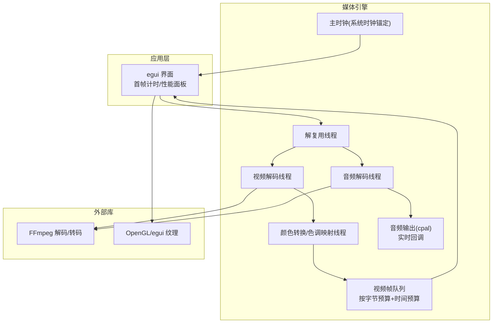
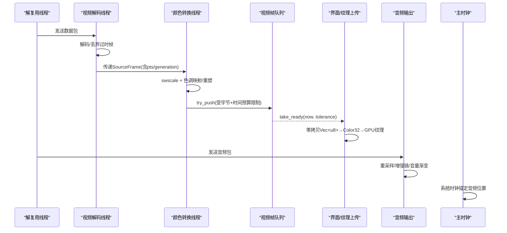
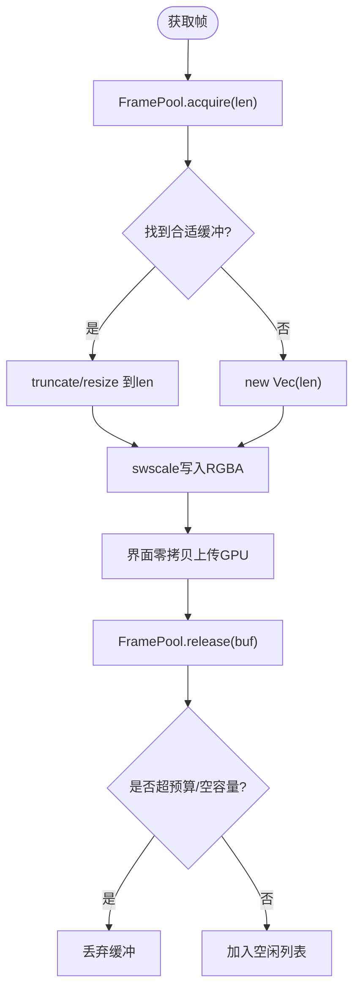
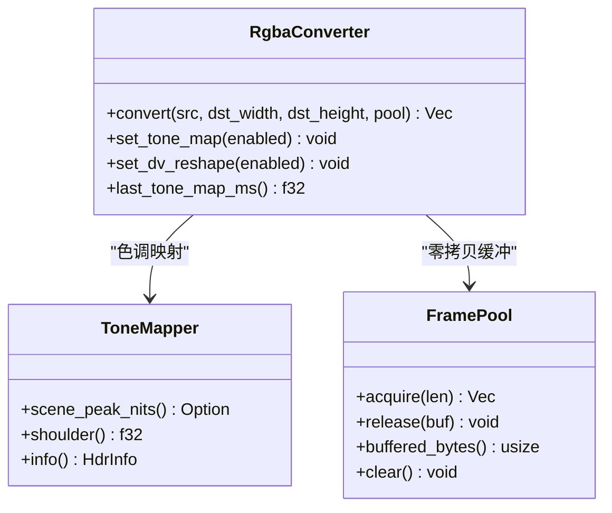
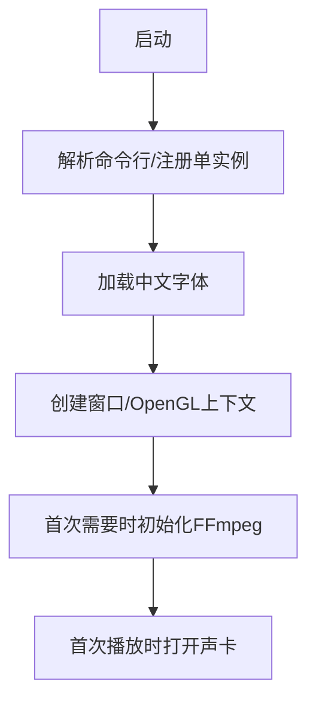
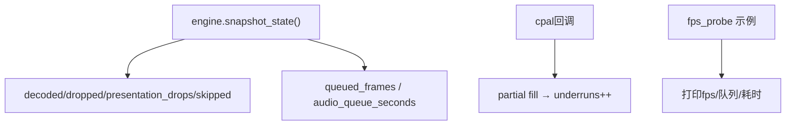
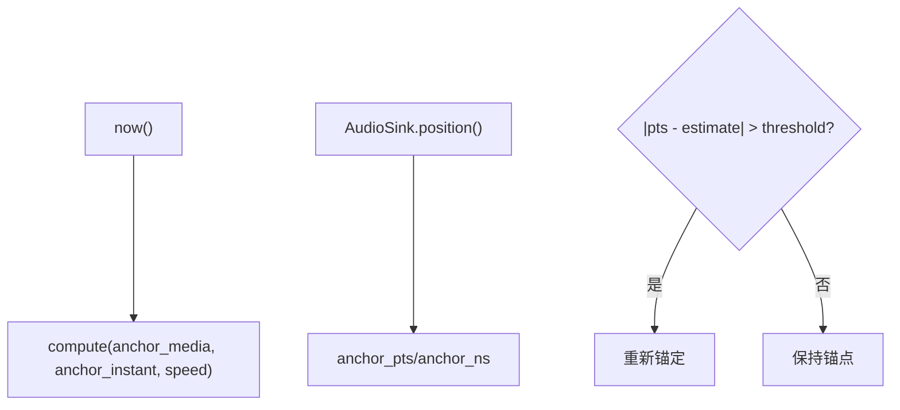
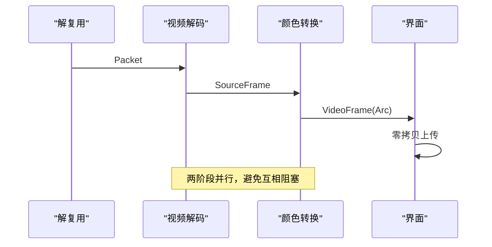
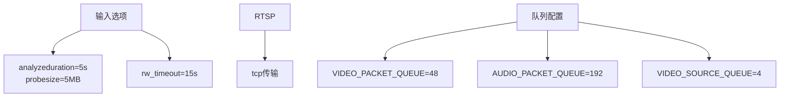
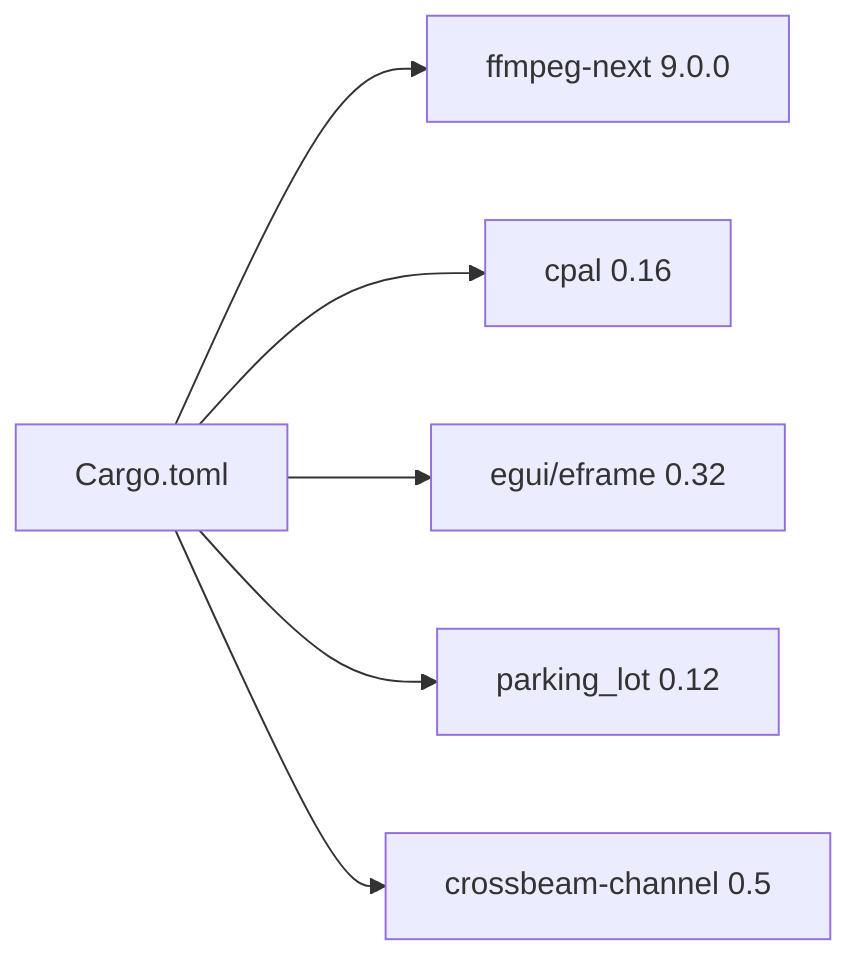

# 性能优化

<cite>
**本文引用的文件**   
- [README.md](file://README.md)
- [Cargo.toml](file://Cargo.toml)
- [lib.rs](file://crates/mvp-core/src/lib.rs)
- [video.rs](file://crates/mvp-core/src/video.rs)
- [hdr.rs](file://crates/mvp-core/src/hdr.rs)
- [clock.rs](file://crates/mvp-core/src/engine/clock.rs)
- [queue.rs](file://crates/mvp-core/src/engine/queue.rs)
- [workers.rs](file://crates/mvp-core/src/engine/workers.rs)
- [audio.rs](file://crates/mvp-core/src/audio.rs)
- [app.rs](file://crates/mvp-player/src/app.rs)
- [picture.rs](file://crates/mvp-player/src/picture.rs)
- [state.rs](file://crates/mvp-player/src/state.rs)
- [fps_probe.rs](file://crates/mvp-core/examples/fps_probe.rs)
- [player_loop.rs](file://crates/mvp-core/tests/player_loop.rs)
</cite>

## 目录
1. [引言](#引言)
2. [项目结构](#项目结构)
3. [核心组件](#核心组件)
4. [架构总览](#架构总览)
5. [详细组件分析](#详细组件分析)
6. [依赖关系分析](#依赖关系分析)
7. [性能考量与基准](#性能考量与基准)
8. [故障排查指南](#故障排查指南)
9. [结论](#结论)
10. [附录：调优清单](#附录：调优清单)

## 引言
本文件面向 MVP-Versatile-Player 的性能优化，覆盖内存管理、渲染优化、启动速度、运行时监控、时钟同步、多线程负载均衡、I/O 缓冲策略，以及性能分析与调优实践。该项目以 Rust 编写，直接集成 FFmpeg 内核，采用解复用、视频解码、音频解码、字幕处理与界面渲染分离的多线程管线，并通过硬件加速、帧池化、零拷贝纹理上传、GPU 着色器画面调节等机制实现低延迟与高吞吐。

## 项目结构
仓库由四个 crate 组成：媒体引擎（mvp-core）、Windows 集成（mvp-platform）、字幕解析（mvp-subtitle）与 egui 界面应用（mvp-player）。播放管线在 mvp-core 中实现，界面与性能统计面板在 mvp-player 中呈现。

**图示来源**
- [workers.rs:133-189](file://crates/mvp-core/src/engine/workers.rs#L133-L189)
- [workers.rs:906-1106](file://crates/mvp-core/src/engine/workers.rs#L906-L1106)
- [workers.rs:1289-1447](file://crates/mvp-core/src/engine/workers.rs#L1289-L1447)
- [audio.rs:172-318](file://crates/mvp-core/src/audio.rs#L172-L318)
- [clock.rs:1-159](file://crates/mvp-core/src/engine/clock.rs#L1-L159)
- [queue.rs:67-253](file://crates/mvp-core/src/engine/queue.rs#L67-L253)

**章节来源**
- [README.md:315-357](file://README.md#L315-L357)
- [README.md:425-453](file://README.md#L425-L453)

## 核心组件
- 帧池与零拷贝渲染：RgbaConverter 将 YUV 转换为 RGBA 并写入 FramePool 分配的缓冲区；界面通过重新解释 Vec<u8> 为 Color32 完成零拷贝上传。
- 视频队列：VideoQueue 同时使用字节预算和时间预算控制缓存深度，避免“只按帧数”导致的内存暴涨和跳转延迟。
- 音频输出：AudioSink 基于 cpal，实时回调无锁访问参数，提供欠载计数、队列深度与位置估计。
- 主时钟：Clock 使用系统时钟作为主时间源，结合音频设备状态进行锚定，避免设备计数器漂移导致画面狂奔或冻结。
- 硬件解码：优先 D3D11VA，回退 DXVA2；硬件帧在解码线程下载至系统内存，再进入转换阶段。
- HDR/杜比视界：ToneMapper 与 RPU 重塑曲线按需重建，支持亮度范围平滑与场景峰值量化，默认关闭重塑以避免不可验证的色彩偏差。

**章节来源**
- [video.rs:18-55](file://crates/mvp-core/src/video.rs#L18-L55)
- [video.rs:57-142](file://crates/mvp-core/src/video.rs#L57-L142)
- [video.rs:548-706](file://crates/mvp-core/src/video.rs#L548-L706)
- [queue.rs:67-253](file://crates/mvp-core/src/engine/queue.rs#L67-L253)
- [audio.rs:1-26](file://crates/mvp-core/src/audio.rs#L1-L26)
- [audio.rs:172-318](file://crates/mvp-core/src/audio.rs#L172-L318)
- [clock.rs:1-159](file://crates/mvp-core/src/engine/clock.rs#L1-L159)
- [workers.rs:1449-1586](file://crates/mvp-core/src/engine/workers.rs#L1449-L1586)
- [hdr.rs:23-58](file://crates/mvp-core/src/hdr.rs#L23-L58)
- [video.rs:720-749](file://crates/mvp-core/src/video.rs#L720-L749)

## 架构总览
下图展示从解复用到显示的关键路径，包括丢帧、队列等待、下载与转换耗时、色调映射耗时等关键指标采集点。

**图示来源**
- [workers.rs:906-1106](file://crates/mvp-core/src/engine/workers.rs#L906-L1106)
- [workers.rs:1289-1447](file://crates/mvp-core/src/engine/workers.rs#L1289-L1447)
- [queue.rs:180-253](file://crates/mvp-core/src/engine/queue.rs#L180-L253)
- [app.rs:707-739](file://crates/mvp-player/src/app.rs#L707-L739)
- [audio.rs:320-461](file://crates/mvp-core/src/audio.rs#L320-L461)
- [clock.rs:122-159](file://crates/mvp-core/src/engine/clock.rs#L122-L159)

## 详细组件分析

### 内存管理：帧池化、纹理缓存、零拷贝、泄漏防护
- 帧池化：FramePool 维护空闲列表与预算上限，best-fit 分配避免浪费大缓冲；释放时跳过超预算或空容量缓冲，防止内存膨胀。
- 零拷贝渲染：RgbaConverter.convert 直接写入池化缓冲区；界面将 u8 向量重新解释为 Color32 并交给 egui，不复制像素。
- 纹理缓存：图片胶片条缩略图通过 ThumbCache 后台线程解码并缓存，失败结果被记忆以避免重复解码。
- 泄漏防护：工作线程捕获 panic；停止时不清理积压数据，直接丢弃，避免解码/转换/丢弃的额外开销；pool.clear 在解码结束清理。

**图示来源**
- [video.rs:69-142](file://crates/mvp-core/src/video.rs#L69-L142)
- [app.rs:707-739](file://crates/mvp-player/src/app.rs#L707-L739)
- [state.rs:335-392](file://crates/mvp-player/src/state.rs#L335-L392)

**章节来源**
- [video.rs:69-142](file://crates/mvp-core/src/video.rs#L69-L142)
- [video.rs:683-706](file://crates/mvp-core/src/video.rs#L683-L706)
- [app.rs:707-739](file://crates/mvp-player/src/app.rs#L707-L739)
- [state.rs:335-392](file://crates/mvp-player/src/state.rs#L335-L392)
- [workers.rs:1105-1106](file://crates/mvp-core/src/engine/workers.rs#L1105-L1106)

### 渲染优化：GPU 着色器、硬件加速、批处理
- GPU 着色器：画面调节（亮度/对比度/饱和度/色温/色调/锐度/Gamma）与画质增强全部在 GPU 着色器内完成，一次采样一个 pass，不重传纹理。
- 硬件加速：优先 D3D11VA，其次 DXVA2；通过 get_format 回调选择硬件像素格式，必要时 extra_hw_frames 缓解高帧率下显存池枯竭。
- 批处理渲染：界面每帧仅更新必要纹理；缩略图后台解码，避免阻塞主循环；视频帧序列通过 serial 去重上传。

**图示来源**
- [video.rs:548-706](file://crates/mvp-core/src/video.rs#L548-L706)
- [hdr.rs:398-445](file://crates/mvp-core/src/hdr.rs#L398-L445)
- [video.rs:69-142](file://crates/mvp-core/src/video.rs#L69-L142)

**章节来源**
- [README.md:53-69](file://README.md#L53-L69)
- [workers.rs:1449-1586](file://crates/mvp-core/src/engine/workers.rs#L1449-L1586)
- [picture.rs:24-45](file://crates/mvp-player/src/picture.rs#L24-L45)

### 启动速度优化：懒加载、资源预取、FFmpeg 初始化时机
- 懒加载：窗口出现前只做命令行解析、单实例互斥体、字体读取；FFmpeg 表在首次使用时初始化，声卡在首次播放时打开。
- 资源预取：图片缩略图后台线程解码，避免阻塞主循环。
- FFmpeg 初始化时机：init() 使用 OnceLock 确保进程内唯一初始化，日志级别设为 Error，减少无关输出。

**图示来源**
- [README.md:425-433](file://README.md#L425-L433)
- [lib.rs:48-66](file://crates/mvp-core/src/lib.rs#L48-L66)
- [state.rs:335-392](file://crates/mvp-player/src/state.rs#L335-L392)

**章节来源**
- [README.md:425-433](file://README.md#L425-L433)
- [lib.rs:48-66](file://crates/mvp-core/src/lib.rs#L48-L66)
- [state.rs:335-392](file://crates/mvp-player/src/state.rs#L335-L392)

### 运行时性能监控：解码帧数、丢帧、队列深度、音频欠载
- 解码帧数与丢帧：workers 记录 decoded_frames/dropped_frames/presentation_drops/skipped_frames。
- 队列深度：snapshot_state 暴露 queued_frames 与 audio_queue_seconds。
- 音频欠载：AudioSink 在回调中检测 partial fill 并累加 underruns。
- 工具示例：fps_probe 定期打印 fps、队列均值/最大值、download/convert/tone_map/wait 耗时。

**图示来源**
- [fps_probe.rs:106-176](file://crates/mvp-core/examples/fps_probe.rs#L106-L176)
- [audio.rs:424-455](file://crates/mvp-core/src/audio.rs#L424-L455)
- [player_loop.rs:134-188](file://crates/mvp-core/tests/player_loop.rs#L134-L188)

**章节来源**
- [fps_probe.rs:106-176](file://crates/mvp-core/examples/fps_probe.rs#L106-L176)
- [audio.rs:424-455](file://crates/mvp-core/src/audio.rs#L424-L455)
- [player_loop.rs:134-188](file://crates/mvp-core/tests/player_loop.rs#L134-L188)

### 时钟同步优化：系统时钟锚定、音频驱动、跳变阈值
- 主时钟：Clock 使用系统时钟，避免设备计数器不准确；音频 sink 提供 position() 用于锚定。
- 跳变阈值：AudioSink 使用 DISCONTINUITY_THRESHOLD 判断是否需要重新锚定，避免缓冲超前导致时钟漂移。
- 暂停/恢复：暂停时冻结时钟，恢复时补偿暂停时长，保证连续性。

**图示来源**
- [clock.rs:122-159](file://crates/mvp-core/src/engine/clock.rs#L122-L159)
- [audio.rs:519-575](file://crates/mvp-core/src/audio.rs#L519-L575)

**章节来源**
- [clock.rs:122-159](file://crates/mvp-core/src/engine/clock.rs#L122-L159)
- [audio.rs:519-575](file://crates/mvp-core/src/audio.rs#L519-L575)

### 多线程负载均衡：解码/转换/显示流水线
- 解复用线程负责分发包，视频/音频分别解码，避免慢视频拖垮音频。
- 视频解码与颜色转换分离：SourceFrame 跨线程传递，避免解码线程等待转换。
- 队列背压：视频队列满时 demuxer 可丢弃落后帧，音频保持背压避免断音。

**图示来源**
- [workers.rs:945-957](file://crates/mvp-core/src/engine/workers.rs#L945-L957)
- [workers.rs:1235-1266](file://crates/mvp-core/src/engine/workers.rs#L1235-L1266)

**章节来源**
- [workers.rs:945-957](file://crates/mvp-core/src/engine/workers.rs#L945-L957)
- [workers.rs:1235-1266](file://crates/mvp-core/src/engine/workers.rs#L1235-L1266)

### I/O 缓冲策略：网络超时、探测大小、队列深度
- 网络选项：analyzeduration/probesize 设为 5s/5MB，rw_timeout 15s，RTSP 使用 TCP，启用自动重连。
- 队列深度：VIDEO_PACKET_QUEUE=48，AUDIO_PACKET_QUEUE=192；VIDEO_SOURCE_QUEUE=4 桥接解码与转换抖动。
- 控制轮询：CONTROL_POLL=50ms，WORKER_POLL=25ms，平衡响应性与 CPU 占用。

**图示来源**
- [workers.rs:164-189](file://crates/mvp-core/src/engine/workers.rs#L164-L189)
- [workers.rs:25-57](file://crates/mvp-core/src/engine/workers.rs#L25-L57)

**章节来源**
- [workers.rs:164-189](file://crates/mvp-core/src/engine/workers.rs#L164-L189)
- [workers.rs:25-57](file://crates/mvp-core/src/engine/workers.rs#L25-L57)

## 依赖关系分析
- 编译优化：发布构建启用 LTO fat、codegen-units=1、strip=symbols，提升启动速度与二进制体积。
- 依赖版本：ffmpeg-next 9.0.0，cpal 0.16，egui/eframe 0.32，parking_lot 0.12，crossbeam-channel 0.5。

**图示来源**
- [Cargo.toml:17-51](file://Cargo.toml#L17-L51)
- [Cargo.toml:53-78](file://Cargo.toml#L53-L78)

**章节来源**
- [Cargo.toml:17-51](file://Cargo.toml#L17-L51)
- [Cargo.toml:53-78](file://Cargo.toml#L53-L78)

## 性能考量与基准
- 首帧渲染耗时：应用记录 first_frame_painted 时的 process_start.elapsed()，并在日志中输出。
- 解码/转换/色调映射/队列等待：workers 记录 convert_ms/tone_map_ms/queue_wait_ms，fps_probe 定期打印。
- 丢帧与跳过：dropped_frames（解码后丢弃）、presentation_drops（队列消费时丢弃）、skipped_frames（seek 前丢弃）。
- 音频欠载：underruns 计数，测试要求 2 秒内欠载次数 ≤5。

建议基准流程：
1. 运行 fps_probe 示例，观察 fps、队列均值/最大值、各阶段耗时。
2. 在播放中切换分辨率/开启 HDR 色调映射/杜比视界重塑，比较 tone_map_ms 变化。
3. 使用 player_loop 测试验证音频队列深度与欠载次数。

**章节来源**
- [app.rs:2417-2447](file://crates/mvp-player/src/app.rs#L2417-L2447)
- [fps_probe.rs:106-176](file://crates/mvp-core/examples/fps_probe.rs#L106-L176)
- [workers.rs:1356-1369](file://crates/mvp-core/src/engine/workers.rs#L1356-L1369)
- [player_loop.rs:134-188](file://crates/mvp-core/tests/player_loop.rs#L134-L188)

## 故障排查指南
- 解码无输出：demuxer 喂包但解码器长时间无帧输出，12 秒后报“解码无输出”，需检查容器/编码是否受支持。
- 硬件解码卡顿：extra_hw_frames 不足可能导致 EAGAIN，适当增加显存帧缓冲。
- 音频欠载频繁：检查设备采样率偏好设置，确保 48kHz/44.1kHz 原生支持；查看 underruns 计数。
- 首帧慢：确认 FFmpeg 初始化与声卡打开时机，避免 UI 构建前执行昂贵操作。

**章节来源**
- [workers.rs:1094-1103](file://crates/mvp-core/src/engine/workers.rs#L1094-L1103)
- [workers.rs:1566-1580](file://crates/mvp-core/src/engine/workers.rs#L1566-L1580)
- [audio.rs:698-743](file://crates/mvp-core/src/audio.rs#L698-L743)
- [README.md:425-433](file://README.md#L425-L433)

## 结论
MVP-Versatile-Player 通过帧池化、零拷贝渲染、GPU 着色器、硬件解码、多阶段流水线与系统时钟锚定，实现了低延迟、高吞吐且稳定的播放体验。配合详细的运行时监控与测试用例，开发者可精准定位瓶颈并进行针对性调优。未来可将 HDR 色调映射迁移至着色器，进一步提升性能与色彩准确性。

## 附录：调优清单
- 内存管理
  - 调整 FramePool.budget 以平衡内存占用与复用效率。
  - 启用缩略图缓存，避免大图重复解码。
- 渲染优化
  - 根据设备能力启用/禁用 HDR 色调映射与杜比视界重塑。
  - 调整 extra_hw_frames 缓解高帧率卡顿。
- 启动速度
  - 保持 FFmpeg 懒初始化与声卡延迟打开。
  - 预加载必要字体与主题。
- 运行时监控
  - 使用 fps_probe 定期采样队列与耗时。
  - 关注 dropped_frames、presentation_drops、underruns。
- 时钟同步
  - 确保 AudioSink 正确锚定，避免设备计数器漂移。
- I/O 缓冲
  - 调整 analyzeduration/probesize/rw_timeout 以适应不同网络条件。
  - 合理设置 VIDEO/AUDIO_PACKET_QUEUE 与 VIDEO_SOURCE_QUEUE。