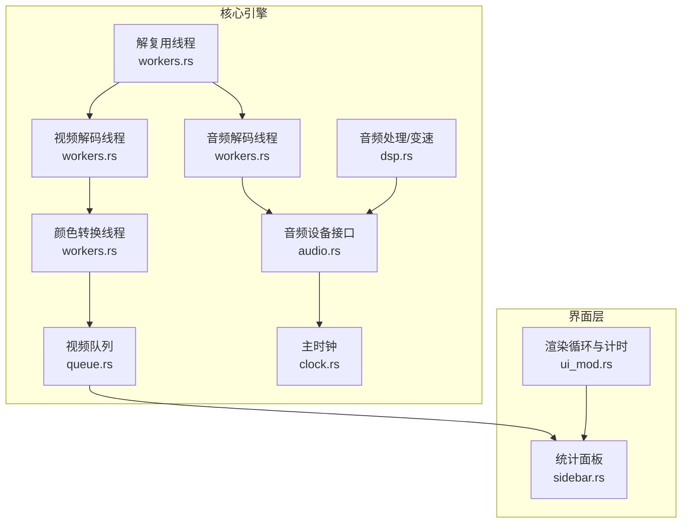
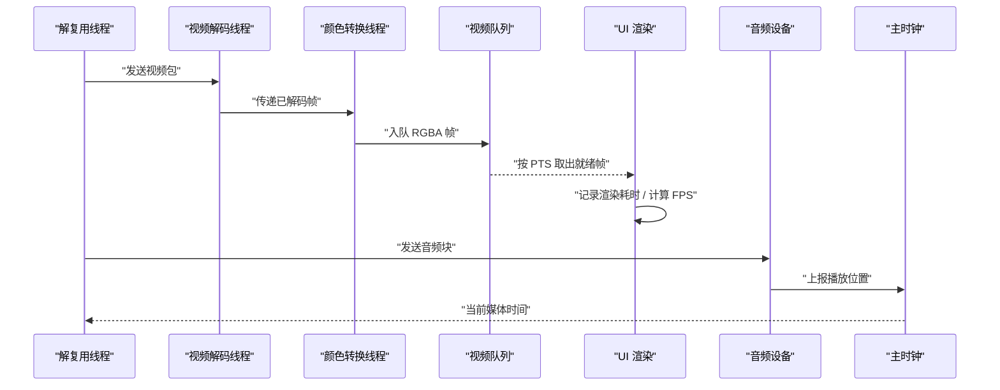
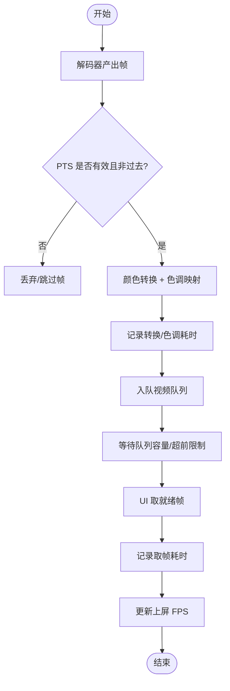
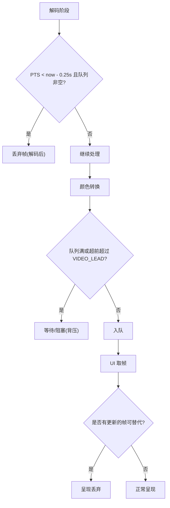
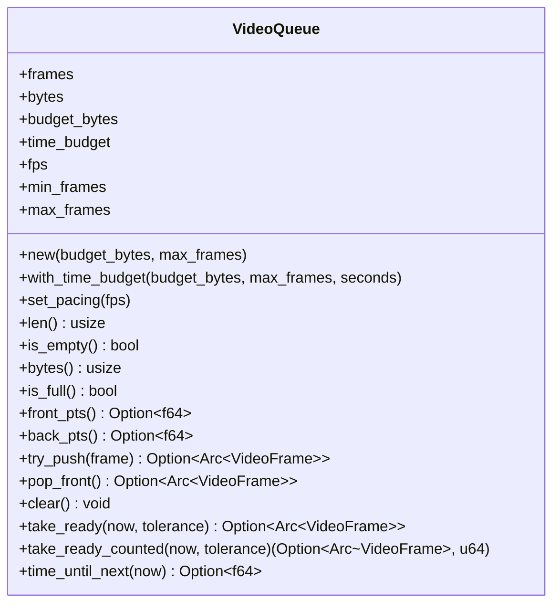
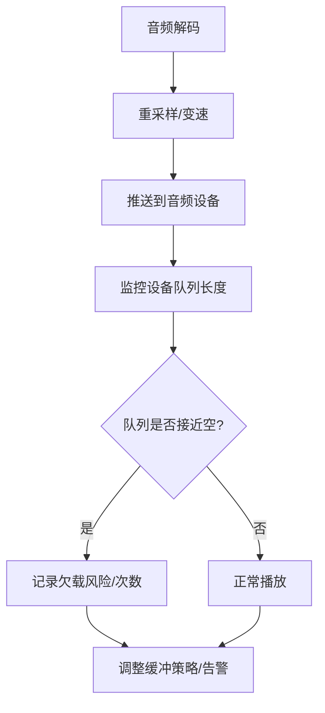
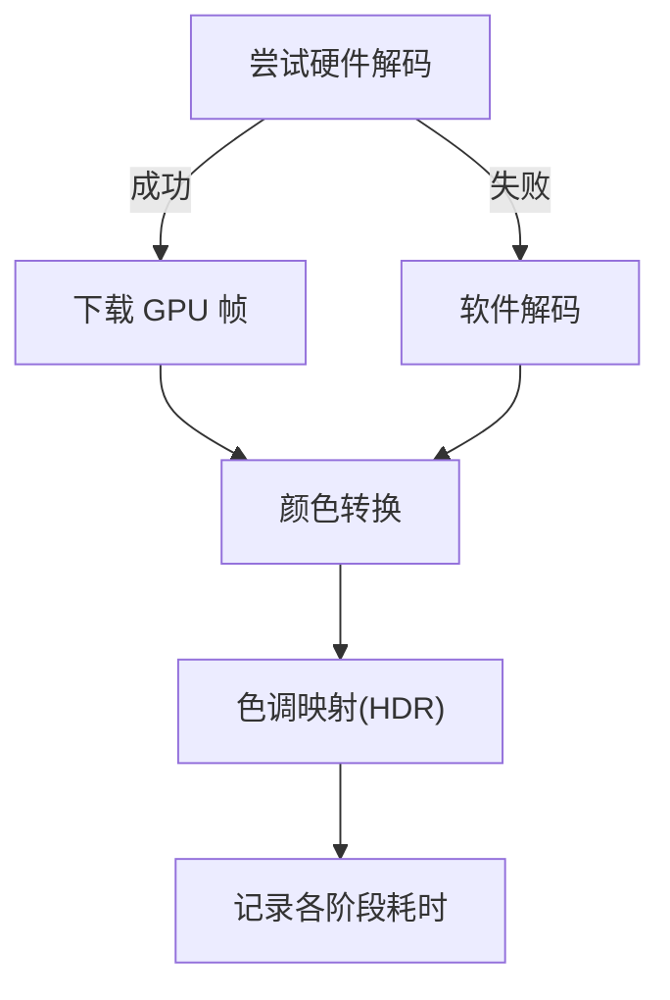
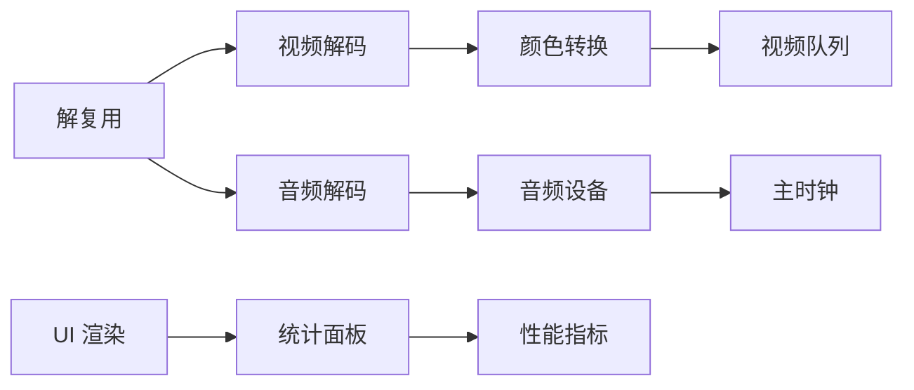

# 性能监控

<cite>
**本文引用的文件**   
- [workers.rs](file://crates/mvp-core/src/engine/workers.rs)
- [queue.rs](file://crates/mvp-core/src/engine/queue.rs)
- [clock.rs](file://crates/mvp-core/src/engine/clock.rs)
- [sidebar.rs](file://crates/mvp-player/src/ui/sidebar.rs)
- [ui_mod.rs](file://crates/mvp-player/src/ui/mod.rs)
- [fps_probe.rs](file://crates/mvp-core/examples/fps_probe.rs)
- [audio.rs](file://crates/mvp-core/src/audio.rs)
- [dsp.rs](file://crates/mvp-core/src/dsp.rs)
- [player_loop.rs](file://crates/mvp-core/tests/player_loop.rs)
</cite>

## 目录
1. [简介](#简介)
2. [项目结构](#项目结构)
3. [核心组件](#核心组件)
4. [架构总览](#架构总览)
5. [详细组件分析](#详细组件分析)
6. [依赖关系分析](#依赖关系分析)
7. [性能考量](#性能考量)
8. [故障排查指南](#故障排查指南)
9. [结论](#结论)
10. [附录：指标与面板对照](#附录指标与面板对照)

## 简介
本文面向 MVP Versatile Player 的性能监控体系，围绕以下目标展开：
- 解码帧数统计：实时 FPS、解码耗时测量、编码效率分析。
- 丢帧检测机制：时间戳连续性检查、队列深度监控、缓冲区溢出预警。
- 队列深度监控：视频/音频队列长度、内存占用跟踪、背压处理。
- 音频欠载处理：缓冲区水位监控、重采样优化、延迟补偿。
- 性能指标收集、实时监控面板、历史数据分析。
- 性能分析工具使用指南与常见问题诊断方法。

该播放器采用“解复用 + 视频解码 + 颜色转换 + 呈现”的多线程流水线，配合主时钟（音频优先）控制播放节奏；UI 侧提供实时统计面板，并通过示例程序输出端到端 FPS 与阶段耗时。

## 项目结构
与性能监控直接相关的代码分布在核心引擎与 UI 层：
- 核心引擎负责解码、队列、时钟、音视频工作线程以及性能指标采集。
- UI 层负责渲染计时、统计面板展示和刷新调度。
- 示例程序用于离线或基准测试场景下的 FPS 探测与指标打印。

**图表来源**
- [workers.rs:134-416](file://crates/mvp-core/src/engine/workers.rs#L134-L416)
- [queue.rs:67-253](file://crates/mvp-core/src/engine/queue.rs#L67-L253)
- [clock.rs:1-159](file://crates/mvp-core/src/engine/clock.rs#L1-L159)
- [ui_mod.rs:48-144](file://crates/mvp-player/src/ui/mod.rs#L48-L144)
- [sidebar.rs:775-888](file://crates/mvp-player/src/ui/sidebar.rs#L775-L888)

**章节来源**
- [workers.rs:134-416](file://crates/mvp-core/src/engine/workers.rs#L134-L416)
- [ui_mod.rs:48-144](file://crates/mvp-player/src/ui/mod.rs#L48-L144)

## 核心组件
- 主时钟：以音频设备位置为参考，无音频时回退到系统时钟，保证 A/V 同步与平滑过渡。
- 视频队列：字节预算 + 时间预算双重限制，避免高码率/高分辨率下内存失控，同时控制“超前量”。
- 工作线程：解复用、视频解码、颜色转换、音频解码各自独立，通过通道与共享状态协作。
- 性能指标：解码帧数、丢弃帧、跳过帧、呈现丢弃、下载/转换/色调映射耗时、队列等待耗时、取帧耗时、音频缓冲秒数、欠载次数等。
- UI 统计面板：实时显示上述指标，并计算上屏 FPS。

**章节来源**
- [clock.rs:1-159](file://crates/mvp-core/src/engine/clock.rs#L1-L159)
- [queue.rs:67-253](file://crates/mvp-core/src/engine/queue.rs#L67-L253)
- [workers.rs:906-1447](file://crates/mvp-core/src/engine/workers.rs#L906-L1447)
- [sidebar.rs:775-888](file://crates/mvp-player/src/ui/sidebar.rs#L775-L888)

## 架构总览
下图展示了从解复用到呈现的完整数据流，以及关键监控点：

**图表来源**
- [workers.rs:906-1447](file://crates/mvp-core/src/engine/workers.rs#L906-L1447)
- [queue.rs:180-253](file://crates/mvp-core/src/engine/queue.rs#L180-L253)
- [clock.rs:122-159](file://crates/mvp-core/src/engine/clock.rs#L122-L159)
- [ui_mod.rs:192-226](file://crates/mvp-player/src/ui/mod.rs#L192-L226)

## 详细组件分析

### 解码帧数统计与实时 FPS
- 已解码帧计数：在颜色转换阶段完成有效帧后递增。
- 上屏 FPS：由 UI 侧统计实际呈现的帧数与时间间隔得出。
- 阶段耗时：下载 GPU 帧、颜色转换、HDR 色调映射、等待队列分别计时。
- 取帧耗时：UI 从引擎取帧并上传纹理的时间。

**图表来源**
- [workers.rs:1138-1447](file://crates/mvp-core/src/engine/workers.rs#L1138-L1447)
- [ui_mod.rs:192-226](file://crates/mvp-player/src/ui/mod.rs#L192-L226)
- [sidebar.rs:806-833](file://crates/mvp-player/src/ui/sidebar.rs#L806-L833)

**章节来源**
- [workers.rs:1138-1447](file://crates/mvp-core/src/engine/workers.rs#L1138-L1447)
- [ui_mod.rs:192-226](file://crates/mvp-player/src/ui/mod.rs#L192-L226)
- [sidebar.rs:806-833](file://crates/mvp-player/src/ui/sidebar.rs#L806-L833)
- [fps_probe.rs:137-167](file://crates/mvp-core/examples/fps_probe.rs#L137-L167)

### 丢帧检测机制
丢帧分为三类：
- 解码前丢弃：跳过头部关键帧之前的旧帧，不计像素成本。
- 解码后丢弃：解码出但已过时的帧，计入像素成本。
- 呈现丢弃：已转换并在队列中，但被更新的帧替代而未被呈现。

检测依据：
- 时间戳连续性：解码阶段对无效/回退 PTS 进行修正与保护。
- 队列深度监控：视频队列根据字节预算和时间预算拒绝新帧，触发背压。
- 缓冲区溢出预警：当队列已满且前端落后于时钟时，解复用阶段会丢弃后续包以避免进一步滞后。

**图表来源**
- [workers.rs:1205-1233](file://crates/mvp-core/src/engine/workers.rs#L1205-L1233)
- [workers.rs:1332-1340](file://crates/mvp-core/src/engine/workers.rs#L1332-L1340)
- [workers.rs:1382-1444](file://crates/mvp-core/src/engine/workers.rs#L1382-L1444)
- [workers.rs:201-262](file://crates/mvp-core/src/engine/workers.rs#L201-L262)

**章节来源**
- [workers.rs:1205-1233](file://crates/mvp-core/src/engine/workers.rs#L1205-L1233)
- [workers.rs:1332-1340](file://crates/mvp-core/src/engine/workers.rs#L1332-L1340)
- [workers.rs:1382-1444](file://crates/mvp-core/src/engine/workers.rs#L1382-L1444)
- [workers.rs:201-262](file://crates/mvp-core/src/engine/workers.rs#L201-L262)

### 队列深度监控
视频队列特性：
- 字节预算：防止高码率/高分辨率导致内存暴涨。
- 时间预算：限制解码器超前播放的时间窗口，降低跳转/变速响应延迟。
- 最小帧数：确保至少保留两帧，避免抖动导致卡顿。
- 内存占用跟踪：维护当前队列字节数，供统计面板展示。
- 背压处理：队列满时生产者等待，不丢弃已有帧；若前端落后则解复用丢弃包。

**图表来源**
- [queue.rs:67-253](file://crates/mvp-core/src/engine/queue.rs#L67-L253)

**章节来源**
- [queue.rs:67-253](file://crates/mvp-core/src/engine/queue.rs#L67-L253)
- [workers.rs:1382-1444](file://crates/mvp-core/src/engine/workers.rs#L1382-L1444)

### 音频欠载处理
音频路径的关键点：
- 缓冲区水位监控：通过音频设备的队列长度估算“音频缓冲秒数”，用于统计面板。
- 重采样优化：当输入采样率与设备不一致时，需进行重采样；测试用例验证不会因截断导致频繁欠载。
- 延迟补偿：时钟锚定音频位置，避免驱动报告写入而非播放位置导致的漂移；必要时回退系统时钟。
- 欠载计数：统计音频欠载次数，辅助定位声音断续问题。

**图表来源**
- [audio.rs:534-561](file://crates/mvp-core/src/audio.rs#L534-L561)
- [player_loop.rs:171-188](file://crates/mvp-core/tests/player_loop.rs#L171-L188)
- [clock.rs:133-159](file://crates/mvp-core/src/engine/clock.rs#L133-L159)

**章节来源**
- [audio.rs:534-561](file://crates/mvp-core/src/audio.rs#L534-L561)
- [player_loop.rs:171-188](file://crates/mvp-core/tests/player_loop.rs#L171-L188)
- [clock.rs:133-159](file://crates/mvp-core/src/engine/clock.rs#L133-L159)

### 编码效率分析
- 硬件加速：启用硬件解码可减少 CPU 压力，提升整体吞吐；若不可用则回退软件路径。
- 下载与转换分离：GPU 帧下载到系统内存后再转换，避免解码线程阻塞。
- 色调映射与 HDR：单独计时色调映射耗时，便于识别 HDR 处理瓶颈。
- 帧池管理：为硬件解码预留额外帧槽，避免在高帧率/高分辨率下池耗尽导致停顿。

**图表来源**
- [workers.rs:1505-1586](file://crates/mvp-core/src/engine/workers.rs#L1505-L1586)
- [workers.rs:1235-1265](file://crates/mvp-core/src/engine/workers.rs#L1235-L1265)
- [workers.rs:1356-1369](file://crates/mvp-core/src/engine/workers.rs#L1356-L1369)

**章节来源**
- [workers.rs:1505-1586](file://crates/mvp-core/src/engine/workers.rs#L1505-L1586)
- [workers.rs:1235-1265](file://crates/mvp-core/src/engine/workers.rs#L1235-L1265)
- [workers.rs:1356-1369](file://crates/mvp-core/src/engine/workers.rs#L1356-L1369)

## 依赖关系分析
- 解复用线程依赖 FFmpeg 上下文与中断回调，负责选择流、分发包、处理跳转与轨道切换。
- 视频解码线程依赖解码器与颜色转换线程，负责解码、PTS 校正、丢弃过时帧。
- 颜色转换线程依赖转换器与视频队列，负责格式转换、HDR 处理、入队与背压。
- 音频解码线程依赖音频设备与 DSP，负责解码、变速、重采样、推送与欠载监测。
- UI 层依赖引擎快照与呈现统计，负责渲染计时与面板展示。

**图表来源**
- [workers.rs:134-416](file://crates/mvp-core/src/engine/workers.rs#L134-L416)
- [ui_mod.rs:48-144](file://crates/mvp-player/src/ui/mod.rs#L48-L144)

**章节来源**
- [workers.rs:134-416](file://crates/mvp-core/src/engine/workers.rs#L134-L416)
- [ui_mod.rs:48-144](file://crates/mvp-player/src/ui/mod.rs#L48-L144)

## 性能考量
- 渲染半帧计时：记录最近、平均、最慢渲染耗时，并统计连续慢帧日志，帮助定位图形驱动或 UI 瓶颈。
- 刷新调度：根据媒体类型与状态动态请求刷新，避免后台空转与高频唤醒。
- 队列等待：精确计算等待时长，减少轮询开销与抖动。
- 硬件加速：合理设置额外帧槽，避免解码池耗尽导致的停顿。
- 音频延迟：通过锚定音频位置与缓冲水位监控，降低欠载与音画不同步风险。

**章节来源**
- [ui_mod.rs:192-226](file://crates/mvp-player/src/ui/mod.rs#L192-L226)
- [ui_mod.rs:228-283](file://crates/mvp-player/src/ui/mod.rs#L228-L283)
- [workers.rs:1382-1444](file://crates/mvp-core/src/engine/workers.rs#L1382-L1444)
- [workers.rs:1505-1586](file://crates/mvp-core/src/engine/workers.rs#L1505-L1586)
- [clock.rs:133-159](file://crates/mvp-core/src/engine/clock.rs#L133-L159)

## 故障排查指南
常见问题与定位方法：
- 画面卡顿：查看“渲染耗时”“下载/转换/色调映射耗时”“队列等待耗时”，判断瓶颈在 UI、GPU 下载、CPU 转换还是队列背压。
- 声音断续：检查“音频缓冲秒数”“音频欠载次数”，结合重采样与设备队列长度分析。
- 解码无输出：若解码器持续接收包但无帧输出，引擎会报“解码无输出”，可能是容器误判或损坏。
- 跳转后黑屏：确认 PTS 校正与 seek 目标逻辑，避免旧帧污染新会话。
- 高帧率源掉帧：区分“解码后丢弃”与“呈现丢弃”，前者是过时帧，后者是更快源导致的替换。

建议步骤：
1. 打开统计面板，观察各项指标变化趋势。
2. 使用 fps_probe 示例程序运行基准测试，获取端到端 FPS 与阶段耗时。
3. 针对异常指标定位具体阶段（解码、转换、色调映射、队列、UI）。
4. 调整硬件加速、队列预算、HDR 设置，观察改善效果。
5. 如仍存在问题，结合日志与测试用例约束进行回归验证。

**章节来源**
- [sidebar.rs:775-888](file://crates/mvp-player/src/ui/sidebar.rs#L775-L888)
- [fps_probe.rs:137-167](file://crates/mvp-core/examples/fps_probe.rs#L137-L167)
- [workers.rs:1092-1103](file://crates/mvp-core/src/engine/workers.rs#L1092-L1103)

## 结论
本项目的性能监控体系以多线程流水线为基础，通过主时钟协调音视频节奏，利用视频队列实现背压与内存控制，并在 UI 层提供丰富的实时统计。通过对解码、转换、色调映射、队列等待、取帧、音频缓冲与欠载等关键指标的采集与分析，能够快速定位性能瓶颈并指导优化方向。示例程序与测试用例进一步保障了监控数据的可靠性与可重复性。

## 附录：指标与面板对照
- 已解码帧：引擎累计解码的有效帧数。
- 丢弃帧：解码后但过时的帧。
- 跳过帧：解码前丢弃的旧帧。
- 呈现丢弃：已转换但在呈现时被更新的帧。
- 上屏帧/FPS：UI 实际呈现的帧数与频率。
- 视频耗时：下载、转换、色调映射、队列等待耗时。
- 取帧耗时：UI 从引擎取帧并上传的耗时。
- 队列帧数：视频队列当前帧数。
- 音频缓冲：音频设备队列长度换算的秒数。
- 音频欠载：音频欠载次数。
- 丢弃音频块：音频通道发送失败的块数。
- 输出增益：实际输出音量百分比。
- 可回退帧：单帧步进可回退的历史帧数与内存占用。
- 启动耗时：应用启动耗时。
- 渲染耗时：最近/平均/最慢渲染耗时。

**章节来源**
- [sidebar.rs:775-888](file://crates/mvp-player/src/ui/sidebar.rs#L775-L888)
- [ui_mod.rs:192-226](file://crates/mvp-player/src/ui/mod.rs#L192-L226)
- [fps_probe.rs:137-167](file://crates/mvp-core/examples/fps_probe.rs#L137-L167)