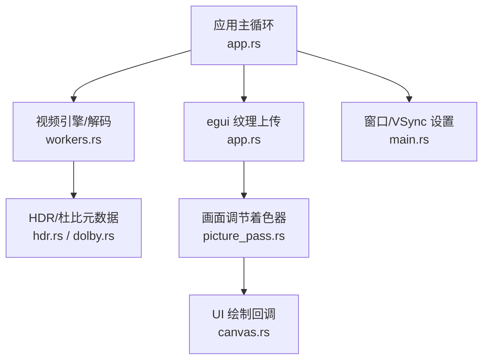
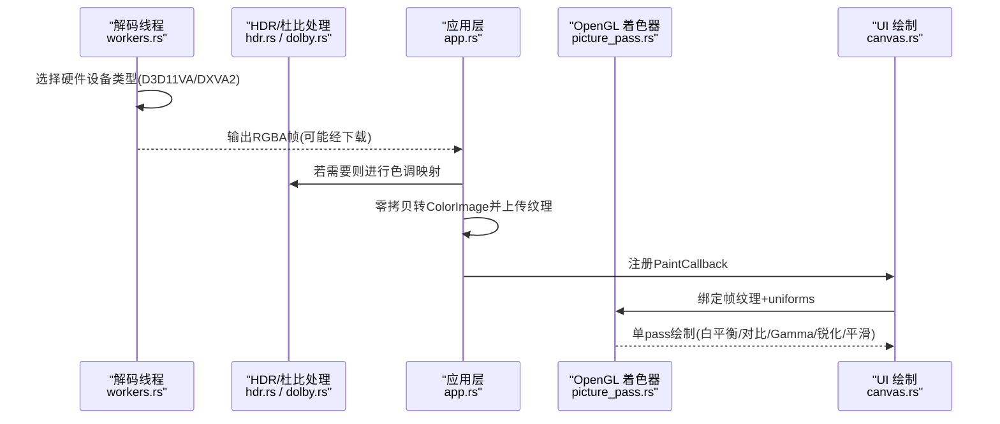
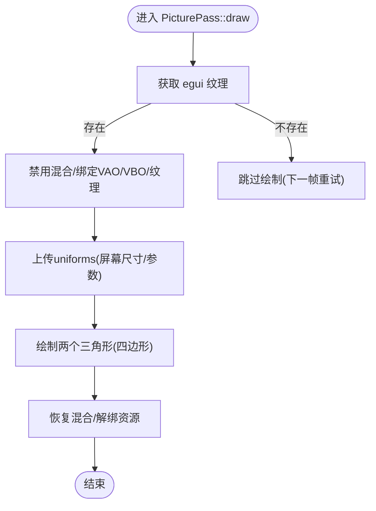
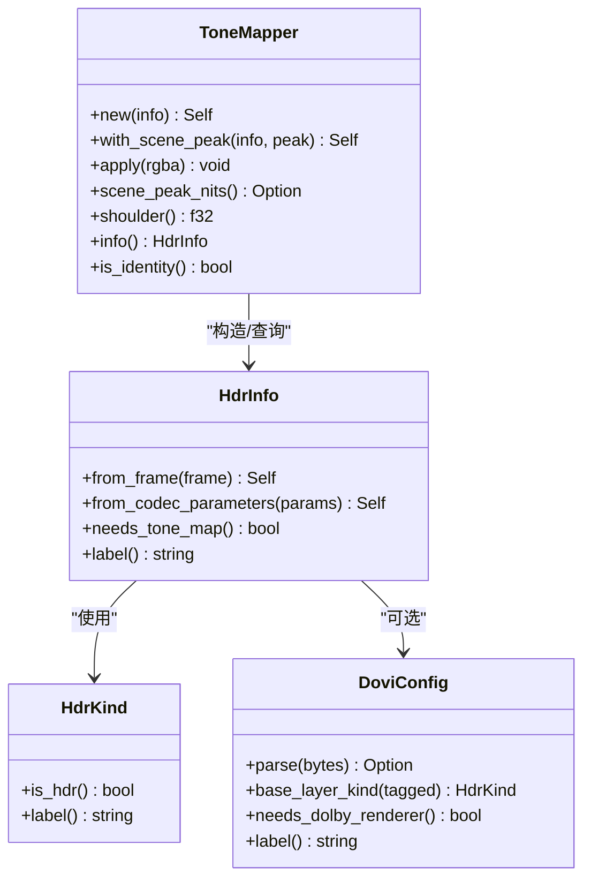
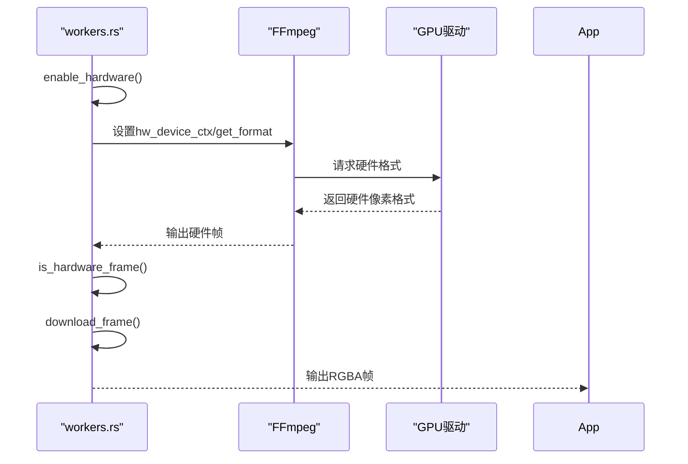
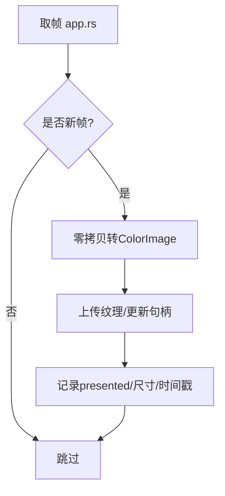
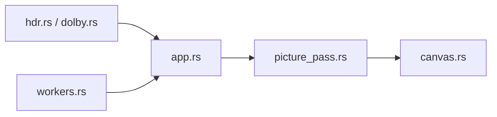

# 渲染优化

<cite>
**本文引用的文件**
- [crates/mvp-player/src/gl/picture_pass.rs](file://crates/mvp-player/src/gl/picture_pass.rs)
- [crates/mvp-player/src/gl/mod.rs](file://crates/mvp-player/src/gl/mod.rs)
- [crates/mvp-core/src/hdr.rs](file://crates/mvp-core/src/hdr.rs)
- [crates/mvp-core/src/dolby.rs](file://crates/mvp-core/src/dolby.rs)
- [crates/mvp-core/src/engine/workers.rs](file://crates/mvp-core/src/engine/workers.rs)
- [crates/mvp-player/src/app.rs](file://crates/mvp-player/src/app.rs)
- [crates/mvp-player/src/ui/canvas.rs](file://crates/mvp-player/src/ui/canvas.rs)
- [crates/mvp-player/src/main.rs](file://crates/mvp-player/src/main.rs)
- [crates/mvp-core/tests/player_loop.rs](file://crates/mvp-core/tests/player_loop.rs)
- [crates/mvp-core/tests/dolby_vision.rs](file://crates/mvp-core/tests/dolby_vision.rs)
- [README.md](file://README.md)
</cite>

## 目录
1. [简介](#简介)
2. [项目结构](#项目结构)
3. [核心组件](#核心组件)
4. [架构总览](#架构总览)
5. [详细组件分析](#详细组件分析)
6. [依赖关系分析](#依赖关系分析)
7. [性能考量](#性能考量)
8. [故障排查指南](#故障排查指南)
9. [结论](#结论)
10. [附录：基准与案例](#附录：基准与案例)

## 简介
本文件聚焦于该播放器在渲染与显示路径上的优化实践，覆盖以下主题：
- GPU 着色器优化：OpenGL ES/桌面 OpenGL 着色器编写、单通道处理、状态最小化。
- 硬件加速技术：D3D11VA/DXVA2 解码、色彩空间转换（BT.2020→BT.709）、HDR 色调映射（PQ/HLG）。
- 渲染管线优化：多通道取舍、纹理上传策略、异步工作流。
- 帧率同步机制：VSync 控制、自适应刷新率思路、丢帧检测与回退。
- 渲染性能监控：GPU 利用率、着色器编译失败回退、CPU/GPU 耗时权衡。
- 具体优化案例与基准测试：HDR 色调映射的 CPU 近似实现与未来 GPU 迁移目标。

## 项目结构
本项目将“渲染相关”的代码集中在 mvp-player 的 gl 模块中，核心 HDR 与杜比视界元数据处理位于 mvp-core；解码与硬件加速在 workers 中实现；UI 通过 egui_glow 将帧以纹理形式交给着色器绘制。

图表来源
- [crates/mvp-player/src/app.rs:708-828](file://crates/mvp-player/src/app.rs#L708-L828)
- [crates/mvp-core/src/engine/workers.rs:1450-1649](file://crates/mvp-core/src/engine/workers.rs#L1450-L1649)
- [crates/mvp-core/src/hdr.rs:1-770](file://crates/mvp-core/src/hdr.rs#L1-L770)
- [crates/mvp-player/src/gl/picture_pass.rs:1-622](file://crates/mvp-player/src/gl/picture_pass.rs#L1-L622)
- [crates/mvp-player/src/ui/canvas.rs:643-693](file://crates/mvp-player/src/ui/canvas.rs#L643-L693)
- [crates/mvp-player/src/main.rs:159](file://crates/mvp-player/src/main.rs#L159)

章节来源
- [crates/mvp-player/src/gl/mod.rs:1-9](file://crates/mvp-player/src/gl/mod.rs#L1-L9)
- [crates/mvp-player/src/gl/picture_pass.rs:1-622](file://crates/mvp-player/src/gl/picture_pass.rs#L1-L622)
- [crates/mvp-core/src/hdr.rs:1-770](file://crates/mvp-core/src/hdr.rs#L1-L770)
- [crates/mvp-core/src/engine/workers.rs:1450-1649](file://crates/mvp-core/src/engine/workers.rs#L1450-L1649)
- [crates/mvp-player/src/app.rs:708-828](file://crates/mvp-player/src/app.rs#L708-L828)
- [crates/mvp-player/src/ui/canvas.rs:643-693](file://crates/mvp-player/src/ui/canvas.rs#L643-L693)
- [crates/mvp-player/src/main.rs:159](file://crates/mvp-player/src/main.rs#L159)

## 核心组件
- 画面调节着色器（PicturePass）：单 pass 完成白平衡、亮度对比度、Gamma、饱和度、锐化、边缘感知平滑等效果；直接复用 egui 已上传的帧纹理，避免二次上传与拷贝。
- HDR 色调映射（ToneMapper）：CPU 侧近似实现，包含 PQ/HLG 到 SDR 的曲线映射与 BT.2020→BT.709 色域矩阵；为后续 GPU 迁移提供算法基础。
- 硬件解码（D3D11VA/DXVA2）：优先使用现代硬件解码路径，必要时回退至软件解码；通过 get_format 回调选择硬件像素格式并配置额外显存缓冲。
- 纹理上传与呈现：将解码后的 RGBA 帧零拷贝重解释为 egui ColorImage 并上传为纹理；图片模式缓存已上传图像以避免重复上传。
- VSync 与呈现：窗口创建时启用 vsync；呈现计数用于统计展示帧率。

章节来源
- [crates/mvp-player/src/gl/picture_pass.rs:1-622](file://crates/mvp-player/src/gl/picture_pass.rs#L1-L622)
- [crates/mvp-core/src/hdr.rs:1-770](file://crates/mvp-core/src/hdr.rs#L1-L770)
- [crates/mvp-core/src/engine/workers.rs:1450-1649](file://crates/mvp-core/src/engine/workers.rs#L1450-L1649)
- [crates/mvp-player/src/app.rs:708-828](file://crates/mvp-player/src/app.rs#L708-L828)
- [crates/mvp-player/src/main.rs:159](file://crates/mvp-player/src/main.rs#L159)

## 架构总览
下图展示了从解码到显示的完整链路，包括硬件解码、CPU 色调映射、纹理上传、着色器绘制与 UI 回调。

图表来源
- [crates/mvp-core/src/engine/workers.rs:1450-1649](file://crates/mvp-core/src/engine/workers.rs#L1450-L1649)
- [crates/mvp-core/src/hdr.rs:1-770](file://crates/mvp-core/src/hdr.rs#L1-L770)
- [crates/mvp-player/src/app.rs:708-828](file://crates/mvp-player/src/app.rs#L708-L828)
- [crates/mvp-player/src/gl/picture_pass.rs:1-622](file://crates/mvp-player/src/gl/picture_pass.rs#L1-L622)
- [crates/mvp-player/src/ui/canvas.rs:643-693](file://crates/mvp-player/src/ui/canvas.rs#L643-L693)

## 详细组件分析

### 组件A：画面调节着色器（单通道优化）
- 设计要点
  - 单 pass：所有效果在一个片段着色器中顺序执行，避免中间缓冲与多次全屏采样。
  - 零二次上传：直接读取 egui 已存在的帧纹理，减少带宽与同步开销。
  - 状态最小化：仅禁用混合，绘制后恢复混合；不改变视口裁剪，交由 egui 管理。
  - 失败回退：着色器编译/链接失败时标记 failed，调用方回退到原始绘制路径，保证画面可见性。
- 关键流程
  - 构建程序、查找 uniform、建立顶点数组与缓冲区。
  - draw：获取当前回调视口，计算四边形顶点与 UV，绑定纹理与 uniforms，绘制三角形。
  - render_offscreen：为截图需求创建临时 FBO，按帧分辨率绘制并读回像素，翻转行序后返回。

图表来源
- [crates/mvp-player/src/gl/picture_pass.rs:316-381](file://crates/mvp-player/src/gl/picture_pass.rs#L316-L381)
- [crates/mvp-player/src/gl/picture_pass.rs:518-622](file://crates/mvp-player/src/gl/picture_pass.rs#L518-L622)

章节来源
- [crates/mvp-player/src/gl/picture_pass.rs:1-622](file://crates/mvp-player/src/gl/picture_pass.rs#L1-L622)

### 组件B：HDR 色调映射（CPU 近似实现）
- 功能范围
  - 识别 PQ/HLG 传输函数与 BT.2020 色域。
  - 基于 LUT 的线性光转换、增益曲线与 sRGB 编码。
  - BT.2020→BT.709 色域矩阵变换。
  - 支持动态元数据（杜比视界 RPU Level 1）调整肩部曲线，使高光更自然。
- 复杂度与性能
  - 每像素一次查表+少量乘加；测试断言 1080p/4K 单帧耗时在可接受范围内，但明确标注应迁移到 GPU 着色器以获得更高精度与更低延迟。
- 错误与边界
  - SDR 内容直接跳过映射。
  - 对非有限或负值 nits 做安全处理。

图表来源
- [crates/mvp-core/src/hdr.rs:30-271](file://crates/mvp-core/src/hdr.rs#L30-L271)
- [crates/mvp-core/src/hdr.rs:352-495](file://crates/mvp-core/src/hdr.rs#L352-L495)

章节来源
- [crates/mvp-core/src/hdr.rs:1-770](file://crates/mvp-core/src/hdr.rs#L1-L770)

### 组件C：硬件解码（D3D11VA/DXVA2）
- 设备选择
  - 优先尝试 D3D11VA，其次 DXVA2；若不可用则回退软件解码。
- 像素格式选择
  - 通过 get_format 回调选择硬件格式；若无匹配则取第一个软件格式。
- 显存缓冲
  - 设置 extra_hw_frames 以缓解高码率/高分辨率下解码池耗尽导致的卡顿。
- 下载与转换
  - 硬件帧通过 av_hwframe_transfer_data 下载到系统内存，再转换为 RGBA 供纹理上传。

图表来源
- [crates/mvp-core/src/engine/workers.rs:1450-1649](file://crates/mvp-core/src/engine/workers.rs#L1450-L1649)

章节来源
- [crates/mvp-core/src/engine/workers.rs:1450-1649](file://crates/mvp-core/src/engine/workers.rs#L1450-L1649)

### 组件D：纹理上传与呈现
- 零拷贝上传
  - 将解码得到的 RGBA Vec<u8> 直接 reinterpret 为 egui ColorImage（相同布局与对齐），避免复制。
- 去抖与缓存
  - 记录 uploaded_serial 与 displayed，避免重复上传未变化的帧。
  - 图片模式缓存已上传图像键，防止频繁重绘导致的大图重复上传。
- 呈现统计
  - 每次上传成功记录 presented，用于界面统计展示帧率。

图表来源
- [crates/mvp-player/src/app.rs:708-828](file://crates/mvp-player/src/app.rs#L708-L828)

章节来源
- [crates/mvp-player/src/app.rs:708-828](file://crates/mvp-player/src/app.rs#L708-L828)

### 组件E：UI 集成与着色器绘制
- 当画面调节开启时，UI 在 canvas 中注册 PaintCallback，将帧纹理与 uniforms 传递给 PicturePass 进行着色器绘制。
- 当调节关闭时，走 egui 原生 image 路径，无额外开销。

章节来源
- [crates/mvp-player/src/ui/canvas.rs:643-693](file://crates/mvp-player/src/ui/canvas.rs#L643-L693)
- [crates/mvp-player/src/gl/picture_pass.rs:1-622](file://crates/mvp-player/src/gl/picture_pass.rs#L1-L622)

## 依赖关系分析
- 渲染路径强耦合点
  - PicturePass 依赖 egui 提供的纹理与 Painter；若驱动不支持着色器，需回退到原路径。
  - HDR 色调映射依赖 ffmpeg 的 AVColorTransferCharacteristic/AVColorPrimaries 与杜比视界元数据解析。
  - 硬件解码依赖 FFmpeg 的 hwdevice 与 get_format 回调，且受平台驱动能力影响。
- 外部依赖
  - FFmpeg（解码、HDR/杜比元数据）
  - egui/egui_glow（UI 与纹理管理）
  - glow（OpenGL 绑定）

图表来源
- [crates/mvp-core/src/hdr.rs:1-770](file://crates/mvp-core/src/hdr.rs#L1-L770)
- [crates/mvp-core/src/dolby.rs:151-183](file://crates/mvp-core/src/dolby.rs#L151-L183)
- [crates/mvp-core/src/engine/workers.rs:1450-1649](file://crates/mvp-core/src/engine/workers.rs#L1450-L1649)
- [crates/mvp-player/src/app.rs:708-828](file://crates/mvp-player/src/app.rs#L708-L828)
- [crates/mvp-player/src/gl/picture_pass.rs:1-622](file://crates/mvp-player/src/gl/picture_pass.rs#L1-L622)
- [crates/mvp-player/src/ui/canvas.rs:643-693](file://crates/mvp-player/src/ui/canvas.rs#L643-L693)

章节来源
- [crates/mvp-core/src/dolby.rs:151-183](file://crates/mvp-core/src/dolby.rs#L151-L183)
- [crates/mvp-core/src/engine/workers.rs:1450-1649](file://crates/mvp-core/src/engine/workers.rs#L1450-L1649)
- [crates/mvp-player/src/gl/picture_pass.rs:1-622](file://crates/mvp-player/src/gl/picture_pass.rs#L1-L622)
- [crates/mvp-player/src/app.rs:708-828](file://crates/mvp-player/src/app.rs#L708-L828)

## 性能考量
- 着色器单通道优化
  - 将所有效果合并到一个片段着色器，避免中间缓冲与多次全屏采样，降低带宽与同步成本。
  - 直接复用 egui 纹理，避免二次上传与拷贝。
- 纹理上传去抖
  - 通过序列号与显示缓存避免重复上传未变化帧；图片模式缓存已上传图像键，防止大图重复上传。
- 硬件解码与显存缓冲
  - 优先使用 D3D11VA/DXVA2，设置 extra_hw_frames 缓解高帧率/高分辨率下的解码池耗尽问题。
- HDR 色调映射
  - CPU 近似实现满足实时性，但明确建议迁移到 GPU 着色器以提升精度与性能。
- VSync 与呈现
  - 窗口创建时启用 vsync；呈现计数用于统计展示帧率。
- 丢帧检测与回退
  - 着色器编译/链接失败时标记 failed，调用方回退到原始绘制路径，确保画面可见性。
  - 测试用例验证在稳定播放期间丢帧情况与队列行为。

章节来源
- [crates/mvp-player/src/gl/picture_pass.rs:1-622](file://crates/mvp-player/src/gl/picture_pass.rs#L1-L622)
- [crates/mvp-player/src/app.rs:708-828](file://crates/mvp-player/src/app.rs#L708-L828)
- [crates/mvp-core/src/engine/workers.rs:1450-1649](file://crates/mvp-core/src/engine/workers.rs#L1450-L1649)
- [crates/mvp-core/src/hdr.rs:1-770](file://crates/mvp-core/src/hdr.rs#L1-L770)
- [crates/mvp-player/src/main.rs:159](file://crates/mvp-player/src/main.rs#L159)
- [crates/mvp-core/tests/player_loop.rs:69-107](file://crates/mvp-core/tests/player_loop.rs#L69-L107)

## 故障排查指南
- 着色器不可用
  - 现象：画面调节无效或回退到原始路径。
  - 原因：驱动拒绝编译/链接着色器。
  - 处理：检查日志中的编译/链接错误；确认 egui_glow 上下文可用；必要时禁用画面调节。
- 硬件解码失败
  - 现象：无法启用硬件解码或出现卡顿。
  - 原因：驱动不支持或设备类型不可用；解码池耗尽。
  - 处理：回退软件解码；增加 extra_hw_frames；检查驱动版本。
- 纹理上传失败
  - 现象：画面黑屏或无更新。
  - 原因：帧尚未到达 egui 纹理映射；尺寸异常。
  - 处理：等待下一帧；检查帧尺寸与数据长度；确保唯一所有权。
- HDR 色调映射偏差
  - 现象：HDR 内容在 SDR 显示器上偏灰或过曝。
  - 原因：CPU 近似实现限制；RPU Level 2 与非线性重塑未参与。
  - 处理：计划迁移到 GPU 着色器；关注信息面板提示。

章节来源
- [crates/mvp-player/src/gl/picture_pass.rs:191-205](file://crates/mvp-player/src/gl/picture_pass.rs#L191-L205)
- [crates/mvp-core/src/engine/workers.rs:1588-1624](file://crates/mvp-core/src/engine/workers.rs#L1588-L1624)
- [crates/mvp-player/src/app.rs:708-769](file://crates/mvp-player/src/app.rs#L708-L769)
- [README.md:548-571](file://README.md#L548-L571)

## 结论
该项目在渲染路径上实现了多项高效优化：单通道着色器、零拷贝纹理上传、硬件解码与显存缓冲、以及稳健的回退机制。HDR 色调映射目前采用 CPU 近似实现，具备实时性但精度有限，建议下一步迁移到 GPU 着色器以获得更佳效果与性能。整体架构清晰，模块化良好，便于持续优化与扩展。

## 附录：基准与案例
- HDR 色调映射基准
  - 测试断言：1080p 与 4K 单帧色调映射耗时在可接受范围内；若超过阈值则需迁移至 GPU。
  - 参考路径：[crates/mvp-core/src/hdr.rs:746-767](file://crates/mvp-core/src/hdr.rs#L746-L767)
- 杜比视界硬件解码测试
  - 验证软件与硬件路径均可正常解码杜比视界样本，并输出有效帧。
  - 参考路径：[crates/mvp-core/tests/dolby_vision.rs:226-281](file://crates/mvp-core/tests/dolby_vision.rs#L226-L281)
- 播放稳定性与丢帧
  - 验证稳定播放期间丢帧情况与队列行为，确保界面不会因后台任务阻塞而冻结。
  - 参考路径：[crates/mvp-core/tests/player_loop.rs:92-107](file://crates/mvp-core/tests/player_loop.rs#L92-L107)

章节来源
- [crates/mvp-core/src/hdr.rs:746-767](file://crates/mvp-core/src/hdr.rs#L746-L767)
- [crates/mvp-core/tests/dolby_vision.rs:226-281](file://crates/mvp-core/tests/dolby_vision.rs#L226-L281)
- [crates/mvp-core/tests/player_loop.rs:92-107](file://crates/mvp-core/tests/player_loop.rs#L92-L107)