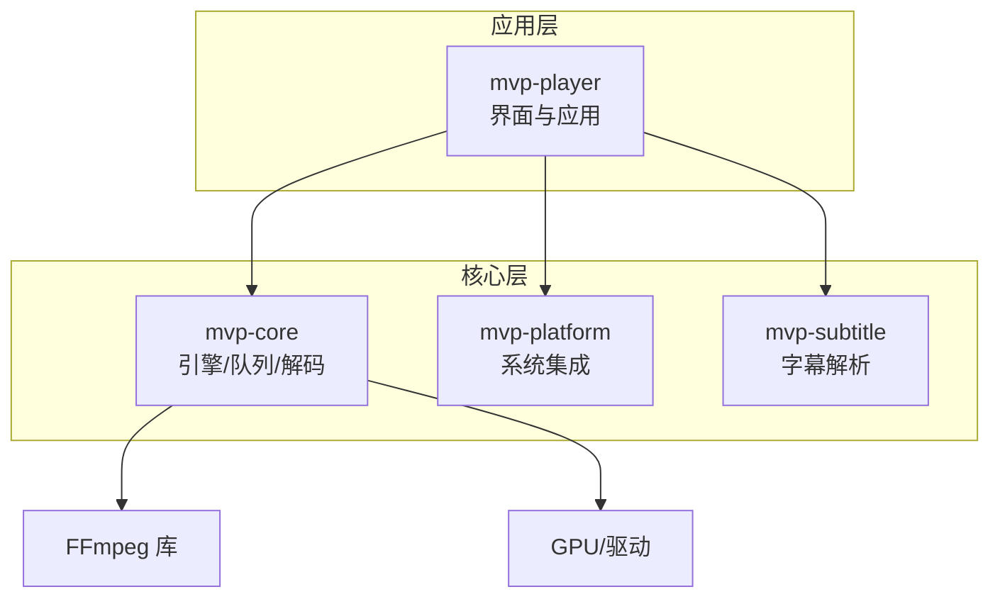
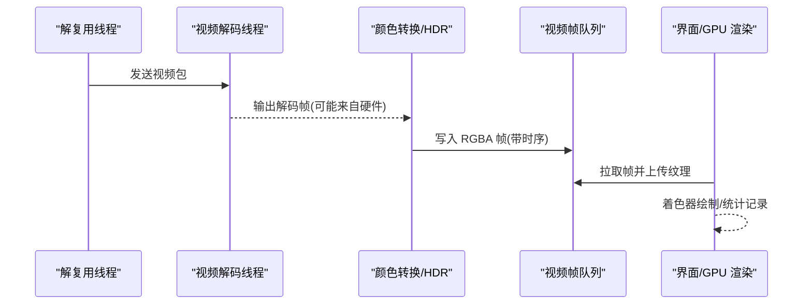
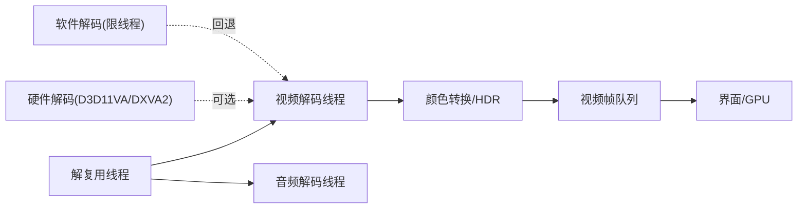

# 性能问题

<cite>
**本文引用的文件**   
- [README.md](file://README.md)
- [Cargo.toml](file://Cargo.toml)
- [workers.rs](file://crates/mvp-core/src/engine/workers.rs)
- [video.rs](file://crates/mvp-core/src/video.rs)
- [hdr.rs](file://crates/mvp-core/src/hdr.rs)
- [dolby/reshape.rs](file://crates/mvp-core/src/dolby/reshape.rs)
- [fps_probe.rs](file://crates/mvp-core/examples/fps_probe.rs)
- [mod.rs](file://crates/mvp-player/src/ui/mod.rs)
- [sidebar.rs](file://crates/mvp-player/src/ui/sidebar.rs)
- [picture.rs](file://crates/mvp-player/src/picture.rs)
- [surface.rs](file://crates/mvp-player/src/ui/surface.rs)
- [app.rs](file://crates/mvp-player/src/app.rs)
- [settings.rs](file://crates/mvp-player/src/settings.rs)
</cite>

## 目录
1. [引言](#引言)
2. [项目结构](#项目结构)
3. [核心组件](#核心组件)
4. [架构总览](#架构总览)
5. [详细组件分析](#详细组件分析)
6. [依赖关系分析](#依赖关系分析)
7. [性能注意事项](#性能注意事项)
8. [故障排查指南](#故障排查指南)
9. [结论](#结论)
10. [附录：调优参数与最佳实践](#附录：调优参数与最佳实践)

## 引言
本指南面向 MVP-Versatile-Player 的性能问题排查与优化，覆盖 CPU 占用过高、内存增长、帧率下降、启动缓慢四大类问题，并给出可操作的监控方法与调优建议。该项目是一个基于 FFmpeg 的 Windows 桌面播放器，采用多工作线程解复用与解码、GPU 渲染界面、硬件解码优先并回退软件解码的设计；同时提供内置统计面板与示例工具辅助诊断。

## 项目结构
仓库按 crate 分层组织：
- mvp-core：媒体引擎（FFmpeg 绑定、时钟、队列、图片查看器）
- mvp-platform：Windows 集成（文件关联、单实例、电源等）
- mvp-subtitle：字幕解析
- mvp-player：egui 界面与应用主循环

图表来源
- [README.md:315-323](file://README.md#L315-L323)
- [Cargo.toml:1-8](file://Cargo.toml#L1-L8)

章节来源
- [README.md:315-323](file://README.md#L315-L323)
- [Cargo.toml:1-8](file://Cargo.toml#L1-L8)

## 核心组件
- 解复用与解码管线：解复用线程将包分发给视频/音频/字幕解码线程，音视频分别解码，避免慢视频拖垮声卡。
- 队列与时钟：视频/音频队列按字节预算与时间预算控制深度；系统时钟作为主时钟，保证稳定性。
- 缓冲池与纹理：RGBA 帧通过池化缓冲区零拷贝上传至 GPU；大分辨率下严格控制缓存上限。
- 硬件加速：优先 D3D11VA/DXVA2，失败回退软件解码；软件解码启用多线程但限制核数。
- 画质增强与 HDR：画面调节走 GPU 着色器；HDR 色调映射当前为 CPU 近似实现，默认关闭重塑以保性能。
- 统计面板：展示上屏帧率、下载/转换/色调映射耗时、丢帧、队列深度等关键指标。

章节来源
- [README.md:325-357](file://README.md#L325-L357)
- [README.md:425-453](file://README.md#L425-L453)
- [workers.rs:25-131](file://crates/mvp-core/src/engine/workers.rs#L25-L131)
- [video.rs:18-55](file://crates/mvp-core/src/video.rs#L18-L55)
- [workers.rs:1675-1696](file://crates/mvp-core/src/engine/workers.rs#L1675-L1696)
- [sidebar.rs:801-831](file://crates/mvp-player/src/ui/sidebar.rs#L801-L831)

## 架构总览
下图展示了从解复用到呈现的关键路径，以及各阶段的耗时拆分，便于定位瓶颈。

图表来源
- [workers.rs:281-687](file://crates/mvp-core/src/engine/workers.rs#L281-L687)
- [video.rs:1-200](file://crates/mvp-core/src/video.rs#L1-L200)
- [sidebar.rs:801-831](file://crates/mvp-player/src/ui/sidebar.rs#L801-L831)

## 详细组件分析

### 1. CPU 占用过高：原因分析与定位
常见原因
- 软件解码启用且未合理分配线程：当硬件解码不可用时，软件解码会承担全部解码压力。
- 线程配置不当：解码线程过多会与界面、音频、解复用争抢 CPU，导致整体卡顿。
- 渲染效率低：HDR 色调映射在 CPU 上做逐像素处理；画质增强若开启也会增加开销。

定位方法
- 使用内置统计面板观察“视频耗时”拆分为“下载/转换/色调映射/等队列”，区分是显存拷贝、颜色转换还是 HDR 映射导致的 CPU 峰值。
- 使用 fps_probe 示例工具测量真实帧率与每阶段耗时，确认是否因软件解码或高分辨率导致。

优化建议
- 确保硬件解码可用；若不可用，保持软件解码线程数上限，避免独占所有核心。
- 关闭不必要的 HDR 色调映射或杜比视界重塑，降低 CPU 负载。
- 降低分辨率或关闭画质增强，减少每帧计算量。

章节来源
- [workers.rs:1675-1696](file://crates/mvp-core/src/engine/workers.rs#L1675-L1696)
- [video.rs:144-155](file://crates/mvp-core/src/video.rs#L144-L155)
- [hdr.rs:23-65](file://crates/mvp-core/src/hdr.rs#L23-L65)
- [sidebar.rs:801-831](file://crates/mvp-player/src/ui/sidebar.rs#L801-L831)
- [fps_probe.rs:1-32](file://crates/mvp-core/examples/fps_probe.rs#L1-L32)

### 2. 内存增长：诊断与修复
典型症状
- 长时间播放后内存持续上涨。
- 切换轨道/跳转后仍有残留帧或位图字幕占用。
- 大图加载后显存/内存飙升。

根因分析
- 帧缓存泄漏：帧队列与缓冲池未按字节预算释放，或停止时未清理空闲缓冲。
- 纹理未释放：界面侧纹理更新与上传未正确回收旧纹理。
- 缓冲区管理不当：FramePool 的预算与 free-list 长度限制被绕过，或超大缓冲未被丢弃。

定位方法
- 观察 FramePool.buffered_bytes() 与队列 bytes() 是否持续增长。
- 检查图形字幕窗口大小与 Cues 数量是否超过硬上限。
- 使用系统任务管理器/性能监视器跟踪进程内存曲线，结合日志中的“首帧渲染耗时”“释放播放引擎耗时”。

修复要点
- 播放停止时调用缓冲池 clear()，清空空闲列表与持有计数。
- 对图形字幕窗口设置 BITMAP_WINDOW_BEHIND 与 BITMAP_WINDOW_BYTES/CUES 上限，及时修剪历史。
- 确保队列按字节预算与最小帧数双重判定 is_full()，避免高码率/高分辨率瞬间膨胀。

章节来源
- [video.rs:57-142](file://crates/mvp-core/src/video.rs#L57-L142)
- [workers.rs:120-131](file://crates/mvp-core/src/engine/workers.rs#L120-L131)
- [workers.rs:120-131](file://crates/mvp-core/src/engine/workers.rs#L120-L131)
- [README.md:439-453](file://README.md#L439-L453)

### 3. 帧率下降：优化策略
关键路径
- 硬件解码 → 下载/转换 → 色调映射 → 队列等待 → 界面渲染。

优化手段
- 启用硬件加速：优先 D3D11VA/DXVA2，失败自动回退软件解码。
- 分辨率适配：根据目标窗口尺寸进行缩放，避免无谓的高分辨率转换。
- 滤镜效果调优：关闭画质增强或不必要的 HDR 色调映射，减少每帧 CPU/GPU 开销。
- 渲染节流：界面渲染半程统计与调度 repaint，避免空转。

章节来源
- [workers.rs:1456-1487](file://crates/mvp-core/src/engine/workers.rs#L1456-L1487)
- [workers.rs:1649-1671](file://crates/mvp-core/src/engine/workers.rs#L1649-L1671)
- [video.rs:144-155](file://crates/mvp-core/src/video.rs#L144-L155)
- [mod.rs:166-229](file://crates/mvp-player/src/ui/mod.rs#L166-L229)

### 4. 启动缓慢：改进方向
现状
- 启动前仅做命令行解析、单实例互斥体、字体加载；FFmpeg 表懒初始化，声卡首次播放才打开。
- 发布构建使用 LTO、strip 等优化，首帧渲染耗时可观测。

改进点
- 懒加载策略：继续延迟非必要资源加载（如高级滤镜、非活跃字幕）。
- 资源预取：对常用字体/图标按需预取，避免首帧阻塞。
- 初始化优化：减少 OpenGL 上下文创建与驱动初始化抖动；必要时预热一次轻量资源。

章节来源
- [README.md:425-437](file://README.md#L425-L437)
- [app.rs:2417-2447](file://crates/mvp-player/src/app.rs#L2417-L2447)

### 5. 性能监控工具
- 内置统计面板：显示上屏帧率、丢帧、队列深度、视频耗时拆分（下载/转换/色调映射/等队列）、取帧耗时等。
- 系统性能监视器：观察 CPU/内存/磁盘/网络与 GPU 利用率，定位瓶颈阶段。
- 第三方分析工具：配合 FPS 示例工具 fps_probe 输出实际帧率与阶段耗时，辅助对比不同配置。

章节来源
- [sidebar.rs:801-831](file://crates/mvp-player/src/ui/sidebar.rs#L801-L831)
- [fps_probe.rs:1-32](file://crates/mvp-core/examples/fps_probe.rs#L1-L32)
- [fps_probe.rs:137-176](file://crates/mvp-core/examples/fps_probe.rs#L137-L176)

## 依赖关系分析
- 引擎与工作线程：解复用线程负责 IO 与分发，视频/音频解码线程各自独立，字幕解码共享通道。
- 队列与预算：视频/音频队列按时间与字节预算控制深度，防止内存暴涨。
- 硬件与软件解码：通过 get_format 回调选择硬件格式，失败回退软件解码；软件解码启用多线程但限制核数。
- 渲染与统计：界面侧记录渲染耗时与慢帧告警，统计面板汇总关键指标。

图表来源
- [workers.rs:281-687](file://crates/mvp-core/src/engine/workers.rs#L281-L687)
- [workers.rs:1456-1487](file://crates/mvp-core/src/engine/workers.rs#L1456-L1487)
- [workers.rs:1675-1696](file://crates/mvp-core/src/engine/workers.rs#L1675-L1696)

章节来源
- [workers.rs:281-687](file://crates/mvp-core/src/engine/workers.rs#L281-L687)
- [workers.rs:1456-1487](file://crates/mvp-core/src/engine/workers.rs#L1456-L1487)
- [workers.rs:1675-1696](file://crates/mvp-core/src/engine/workers.rs#L1675-L1696)

## 性能注意事项
- 队列按字节预算而非仅帧数：4K RGBA 一帧约 33 MB，仅按帧数缓存极易爆内存。
- 主时钟使用系统时钟：避免设备计数器不准导致的快进/冻结。
- 色彩矩阵按元数据选择：HD/SD 不同矩阵，避免饱和度偏差。
- 像素只拷贝一次：swscale 直接写池化缓冲区，界面零拷贝解释为 Vec<Color32> 上传 GPU。
- 工作线程捕获 panic：损坏文件不会拖垮整个播放器。

章节来源
- [README.md:340-357](file://README.md#L340-L357)

## 故障排查指南
常见问题与对策
- 软件解码导致 CPU 飙高
  - 现象：CPU 占用高，视频卡顿，统计面板“转换/色调映射”耗时高。
  - 排查：确认硬件解码是否启用；使用 fps_probe 对比软硬解差异。
  - 解决：启用硬件解码；若必须软解，限制线程数，关闭 HDR 重塑。
- 内存持续增长
  - 现象：播放一段时间后内存不断上涨。
  - 排查：检查 FramePool.buffered_bytes()、队列 bytes()、图形字幕窗口大小。
  - 解决：停止时清理缓冲池；限制字幕窗口大小；确保队列预算生效。
- 帧率下降
  - 现象：上屏帧率低，丢帧增多。
  - 排查：观察“视频耗时”拆分，定位下载/转换/色调映射瓶颈。
  - 解决：启用硬件加速；降低分辨率；关闭画质增强/HDR 映射。
- 启动缓慢
  - 现象：首帧渲染耗时长。
  - 排查：查看“首帧渲染耗时”日志；检查 OpenGL 上下文与驱动初始化。
  - 解决：延迟非必要初始化；预热常用资源；使用发布构建优化。

章节来源
- [sidebar.rs:801-831](file://crates/mvp-player/src/ui/sidebar.rs#L801-L831)
- [video.rs:57-142](file://crates/mvp-core/src/video.rs#L57-L142)
- [README.md:425-453](file://README.md#L425-L453)

## 结论
MVP-Versatile-Player 的播放管线在设计上已考虑了多核、队列预算与硬件加速，但在 HDR 色调映射、画质增强与软件解码场景下仍可能出现 CPU/内存压力。通过内置统计面板与 fps_probe 工具，可以准确定位瓶颈阶段；结合硬件解码启用、分辨率适配、滤镜调优与缓冲池管理，可显著提升性能与稳定性。

## 附录：调优参数与最佳实践
- 硬件解码
  - 优先 D3D11VA/DXVA2；失败自动回退软件解码。
  - 参考位置：[workers.rs:1456-1487](file://crates/mvp-core/src/engine/workers.rs#L1456-L1487)
- 软件解码线程数
  - 设置为 available_parallelism() - 2，上限 4，避免抢占界面与其他线程。
  - 参考位置：[workers.rs:1675-1696](file://crates/mvp-core/src/engine/workers.rs#L1675-L1696)
- 色调映射与重塑
  - HDR 色调映射为 CPU 近似实现，默认关闭重塑以降低开销。
  - 参考位置：[video.rs:144-155](file://crates/mvp-core/src/video.rs#L144-L155), [hdr.rs:23-65](file://crates/mvp-core/src/hdr.rs#L23-L65), [dolby/reshape.rs:1-23](file://crates/mvp-core/src/dolby/reshape.rs#L1-L23)
- 队列与缓冲
  - 视频/音频队列按时间与字节预算控制深度；帧池有预算与 free-list 长度限制。
  - 参考位置：[workers.rs:25-131](file://crates/mvp-core/src/engine/workers.rs#L25-L131), [video.rs:57-142](file://crates/mvp-core/src/video.rs#L57-L142)
- 界面渲染
  - 渲染半程统计与慢帧告警；避免透明/模糊表面带来的额外开销。
  - 参考位置：[mod.rs:166-229](file://crates/mvp-player/src/ui/mod.rs#L166-L229), [surface.rs:1-34](file://crates/mvp-player/src/ui/surface.rs#L1-L34)
- 启动与关闭
  - 启动前只做必要初始化；关闭时快速退出，不等积压与声卡超时。
  - 参考位置：[README.md:425-453](file://README.md#L425-L453), [app.rs:2417-2447](file://crates/mvp-player/src/app.rs#L2417-L2447)