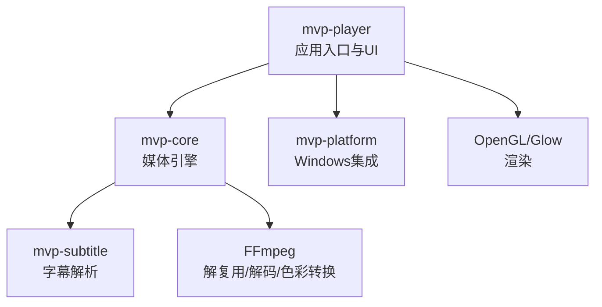
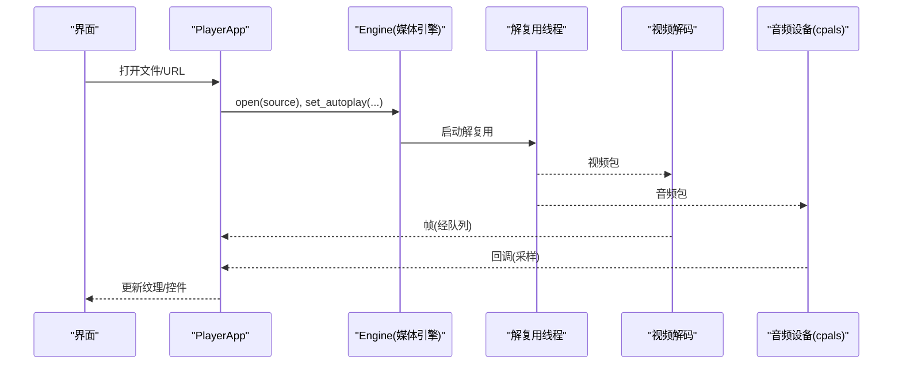
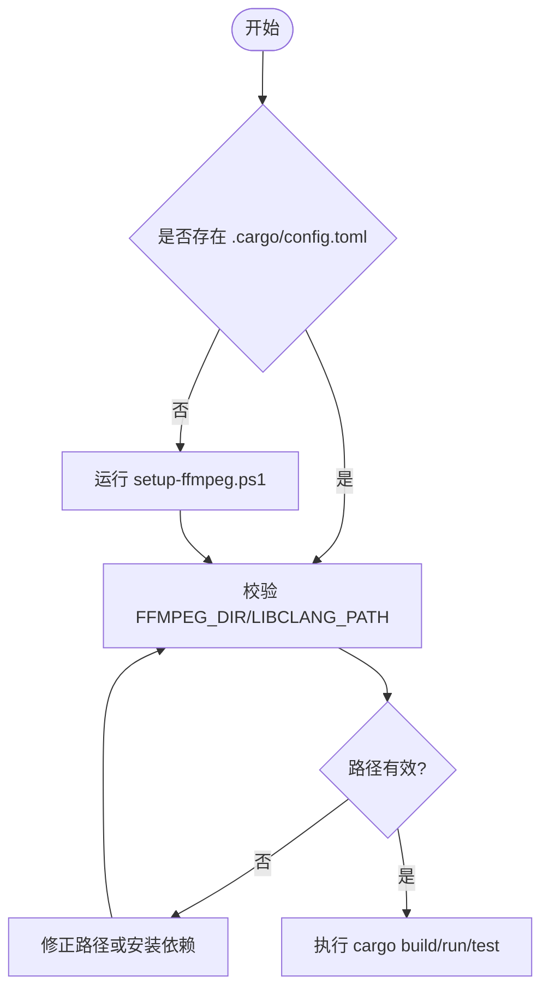
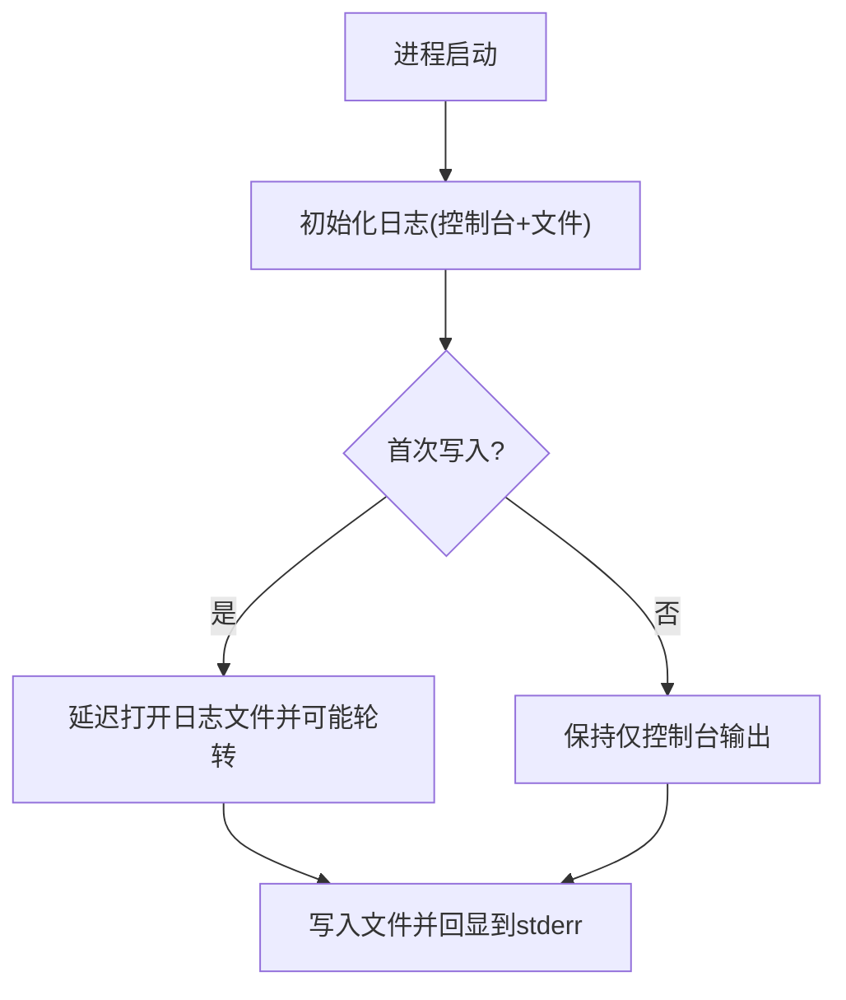
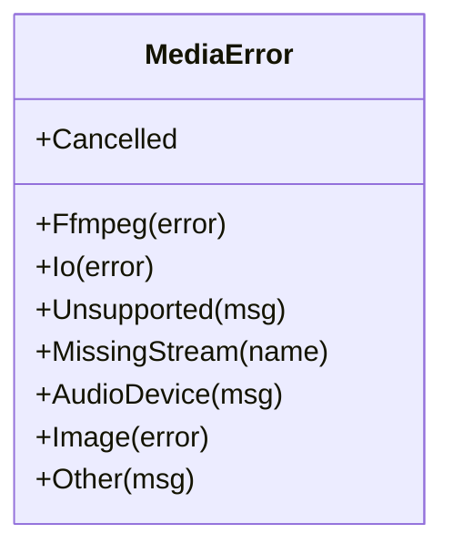
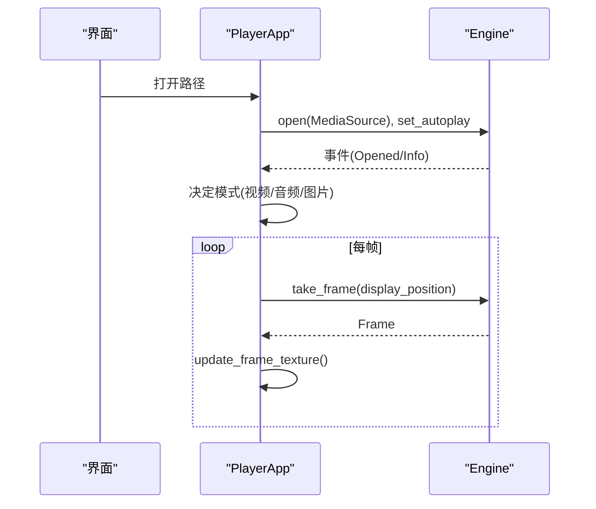
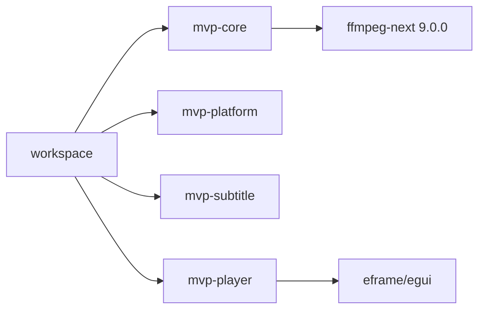

# 故障排除

<cite>
**本文引用的文件**
- [README.md](file://README.md)
- [Cargo.toml](file://Cargo.toml)
- [setup-ffmpeg.ps1](file://scripts/setup-ffmpeg.ps1)
- [mvp-core/lib.rs](file://crates/mvp-core/src/lib.rs)
- [mvp-core/error.rs](file://crates/mvp-core/src/error.rs)
- [mvp-player/main.rs](file://crates/mvp-player/src/main.rs)
- [mvp-player/app.rs](file://crates/mvp-player/src/app.rs)
- [mvp-core/audio.rs](file://crates/mvp-core/src/audio.rs)
- [mvp-core/bitmap_subtitle.rs](file://crates/mvp-core/src/bitmap_subtitle.rs)
- [mvp-core/dolby/reshape.rs](file://crates/mvp-core/src/dolby/reshape.rs)
- [mvp-core/examples/seek_probe.rs](file://crates/mvp-core/examples/seek_probe.rs)
</cite>

## 目录
1. [简介](#简介)
2. [项目结构](#项目结构)
3. [核心组件](#核心组件)
4. [架构总览](#架构总览)
5. [详细组件分析](#详细组件分析)
6. [依赖关系分析](#依赖关系分析)
7. [性能注意事项](#性能注意事项)
8. [故障排除指南](#故障排除指南)
9. [结论](#结论)
10. [附录](#附录)

## 简介
本指南面向 MVP-Versatile-Player 的编译、运行与排障，覆盖常见构建失败（FFmpeg 链接、libclang 配置、依赖版本冲突）、运行时问题（播放失败、音画不同步、HDR 显示异常、字幕乱码）、日志分析方法、调试技巧、性能问题定位以及已知限制与替代方案。文档中的步骤均基于仓库内脚本、日志机制与错误类型设计，确保可操作且可追溯。

## 项目结构
本项目采用多 crate 工作区：
- mvp-core：媒体引擎（FFmpeg 绑定、A/V 时钟、队列、图片查看器）
- mvp-platform：Windows 集成（单实例、电源、外壳）
- mvp-subtitle：字幕解析（SRT/ASS/VTT/MicroDVD + 编码识别）
- mvp-player：egui 界面与应用入口（窗口、设置、渲染管线）

**图表来源**
- [README.md:315-323](file://README.md#L315-L323)
- [Cargo.toml:1-8](file://Cargo.toml#L1-L8)

**章节来源**
- [README.md:315-323](file://README.md#L315-L323)
- [Cargo.toml:1-8](file://Cargo.toml#L1-L8)

## 核心组件
- 应用入口与日志：主程序负责参数解析、单实例、窗口创建与日志初始化；日志同时输出到控制台与本地文件，发布版无控制台时以文件为主排查渠道。
- 媒体引擎：直接链接 FFmpeg，懒初始化；音视频分别解码，队列按字节数限长；工作线程捕获 panic，避免损坏文件拖垮进程。
- 音频子系统：设备选择、格式协商、流启动与暂停/恢复；错误统一为 MediaError::AudioDevice。
- 字幕系统：文本与图形字幕（PGS/VobSub/DVB）支持；自动加载同名字幕并优先匹配中文后缀；编码自动识别（UTF-8/16 BOM/GBK/Big5/Shift_JIS/Windows-1252）。
- HDR/杜比视界：基底层传输函数按兼容层 ID 选择；RPU Level 1 亮度范围用于色调曲线瞄准；重塑默认关闭，色度对齐仍在验证中。

**章节来源**
- [mvp-player/main.rs:184-207](file://crates/mvp-player/src/main.rs#L184-L207)
- [mvp-core/lib.rs:52-69](file://crates/mvp-core/src/lib.rs#L52-L69)
- [mvp-core/audio.rs:202-308](file://crates/mvp-core/src/audio.rs#L202-L308)
- [mvp-core/bitmap_subtitle.rs:400-443](file://crates/mvp-core/src/bitmap_subtitle.rs#L400-L443)
- [README.md:359-414](file://README.md#L359-L414)

## 架构总览
播放管线由解复用线程分发至视频/音频/字幕解码线程，帧与采样通过有界队列传递，主线程负责 UI 呈现与调度。控制指令不走包队列，避免过时指令堆积导致卡顿或死锁。

**图表来源**
- [README.md:325-357](file://README.md#L325-L357)
- [mvp-player/app.rs:484-544](file://crates/mvp-player/src/app.rs#L484-L544)

## 详细组件分析

### 构建与依赖准备（FFmpeg 链接与 libclang）
- 使用共享库开发包（含 include/lib/bin），并通过 setup-ffmpeg.ps1 写入本机 .cargo/config.toml。
- 若未找到 libclang，bindgen 阶段会失败；脚本会提示安装 LLVM 或使用 pip 提供的 libclang。
- 推荐固定 FFmpeg 9.0 发行分支，避免 master 分支枚举不兼容导致编译失败。

**图表来源**
- [setup-ffmpeg.ps1:152-205](file://scripts/setup-ffmpeg.ps1#L152-L205)
- [README.md:164-231](file://README.md#L164-L231)

**章节来源**
- [setup-ffmpeg.ps1:152-205](file://scripts/setup-ffmpeg.ps1#L152-L205)
- [README.md:164-231](file://README.md#L164-L231)

### 运行时日志与级别
- 日志目标：stderr + 本地文件（%APPDATA%\MVP-Versatile-Player\mvp.log），超过 2MB 自动轮转。
- 默认过滤：info；可通过环境变量调整模块级别（例如示例中将 mvp_core 设为 debug）。
- FFmpeg 内部日志在引擎初始化时被设置为 Error，避免噪音。

**图表来源**
- [mvp-player/main.rs:184-207](file://crates/mvp-player/src/main.rs#L184-L207)
- [mvp-player/main.rs:221-294](file://crates/mvp-player/src/main.rs#L221-L294)
- [mvp-core/lib.rs:52-69](file://crates/mvp-core/src/lib.rs#L52-L69)
- [mvp-core/examples/seek_probe.rs:29-31](file://crates/mvp-core/examples/seek_probe.rs#L29-L31)

**章节来源**
- [mvp-player/main.rs:184-207](file://crates/mvp-player/src/main.rs#L184-L207)
- [mvp-player/main.rs:221-294](file://crates/mvp-player/src/main.rs#L221-L294)
- [mvp-core/lib.rs:52-69](file://crates/mvp-core/src/lib.rs#L52-L69)
- [mvp-core/examples/seek_probe.rs:29-31](file://crates/mvp-core/examples/seek_probe.rs#L29-L31)

### 错误模型与关键错误信息
- 统一错误类型 MediaError，涵盖 FFmpeg 错误、I/O 失败、不支持的媒体、缺失轨道、音频设备错误等。
- 音频相关错误集中在 AudioDevice 分支；图像解码错误使用 Image 分支；通用错误使用 Other。

**图表来源**
- [mvp-core/error.rs:6-40](file://crates/mvp-core/src/error.rs#L6-L40)

**章节来源**
- [mvp-core/error.rs:6-40](file://crates/mvp-core/src/error.rs#L6-L40)

### 播放流程与常见问题定位
- 打开文件：PlayerApp.open_engine 设置 autoplay 后调用 Engine.open；随后根据探测结果决定模式（视频/音频/图片）。
- 帧上传：update_frame_texture 从引擎取帧，零拷贝重解释为 ColorImage 并上传 GPU。
- 外部字幕：load_subtitle_file 先判断是否图形字幕，再走文本解析或直接解码位图。

**图表来源**
- [mvp-player/app.rs:484-544](file://crates/mvp-player/src/app.rs#L484-L544)
- [mvp-player/app.rs:715-769](file://crates/mvp-player/src/app.rs#L715-L769)

**章节来源**
- [mvp-player/app.rs:484-544](file://crates/mvp-player/src/app.rs#L484-L544)
- [mvp-player/app.rs:715-769](file://crates/mvp-player/src/app.rs#L715-L769)

## 依赖关系分析
- 工作区成员与依赖版本在 Cargo.toml 中集中声明；FFmpeg 绑定使用 ffmpeg-next 9.0.0。
- 构建优化：release 开启 LTO、codegen-units=1、strip=symbols；dev 对依赖提升 opt-level 以加速迭代。

**图表来源**
- [Cargo.toml:1-8](file://Cargo.toml#L1-L8)
- [Cargo.toml:17-51](file://Cargo.toml#L17-L51)
- [Cargo.toml:53-78](file://Cargo.toml#L53-L78)

**章节来源**
- [Cargo.toml:1-8](file://Cargo.toml#L1-L8)
- [Cargo.toml:17-51](file://Cargo.toml#L17-L51)
- [Cargo.toml:53-78](file://Cargo.toml#L53-L78)

## 性能注意事项
- 启动速度：窗口出现前只做必要初始化；FFmpeg 表懒初始化，声卡首次播放才打开。
- 关闭速度：丢弃积压包，避免解码浪费；停止前先标记声卡关闭，避免阻塞。
- 队列与内存：所有队列按字节数设上限，防止 4K RGBA 帧占用过大内存。
- 渲染：画面调节与增强尽量在着色器中完成，减少 CPU 与复制开销。

[本节提供通用指导，无需特定文件引用]

## 故障排除指南

### 一、常见编译错误与解决

1) FFmpeg 链接失败（找不到 avcodec.lib 或 DLL）
- 现象：链接阶段报找不到导入库或运行时找不到 DLL。
- 原因：FFmpeg 开发包路径不正确或未使用 shared 构建；build.rs 会将 DLL 复制到 target 目录，但需确保路径正确。
- 处理：
  - 运行 scripts/setup-ffmpeg.ps1 指定已有目录或重新下载 n9.0 共享库。
  - 确认 .cargo/config.toml 中 FFMPEG_DIR 指向包含 include/lib/bin 的目录。
  - 若手动配置，确保使用正斜杠路径以避免重复触发 bindgen。
- 参考：
  - [setup-ffmpeg.ps1:115-150](file://scripts/setup-ffmpeg.ps1#L115-L150)
  - [setup-ffmpeg.ps1:178-205](file://scripts/setup-ffmpeg.ps1#L178-L205)
  - [README.md:194-228](file://README.md#L194-L228)

2) libclang 配置问题（bindgen 无法找到 libclang.dll）
- 现象：构建时报 Unable to find libclang 或 bindgen 失败。
- 原因：未安装 LLVM 或未设置 LIBCLANG_PATH；脚本会尝试多种路径但仍失败。
- 处理：
  - 安装 LLVM 到 C:\Program Files\LLVM，或 pip install libclang。
  - 再次运行 setup-ffmpeg.ps1 自动写入配置。
  - 也可通过环境变量 LIBCLANG_PATH 指定。
- 参考：
  - [setup-ffmpeg.ps1:152-170](file://scripts/setup-ffmpeg.ps1#L152-L170)
  - [README.md:212-228](file://README.md#L212-L228)

3) 依赖版本冲突（FFmpeg 头文件与 ffmpeg-next 不匹配）
- 现象：编译失败，提示未知编解码器枚举。
- 原因：使用了 master 分支而非 n9.0 发行分支。
- 处理：
  - 使用 BtbN 的 ffmpeg-n9.0-latest-win64-gpl-shared-9.0.zip。
  - 通过 setup-ffmpeg.ps1 下载或指定已有目录。
- 参考：
  - [README.md:198-201](file://README.md#L198-L201)
  - [setup-ffmpeg.ps1:120-149](file://scripts/setup-ffmpeg.ps1#L120-L149)

### 二、运行时问题诊断

1) 播放失败（无法打开/无可用轨道）
- 可能原因：容器/编码不被支持、缺少轨道、I/O 失败。
- 定位：
  - 检查 MediaError 分支（Unsupported/MissingStream/Io）。
  - 查看日志中“无法打开”“没有可用内容”等提示。
  - 对于网络串流，确认协议与可达性。
- 参考：
  - [mvp-core/error.rs:6-40](file://crates/mvp-core/src/error.rs#L6-L40)
  - [mvp-player/app.rs:484-491](file://crates/mvp-player/src/app.rs#L484-L491)

2) 音画不同步
- 可能原因：时钟漂移、音频欠载、队列背压不当。
- 定位：
  - 观察性能统计面板（丢帧、音频欠载、队列深度）。
  - 检查音频设备协商与流启动日志。
  - 确认主时钟为系统时钟，避免设备计数器不准导致的跳变。
- 参考：
  - [README.md:348-357](file://README.md#L348-L357)
  - [mvp-core/audio.rs:202-308](file://crates/mvp-core/src/audio.rs#L202-L308)

3) HDR 显示异常（发灰/过曝/颜色不对）
- 可能原因：基底层传输函数选错、RPU Level 1 未参与映射、重塑未启用或色度未对齐。
- 定位：
  - 检查设置中「HDR 色调映射」与「杜比视界重塑」开关。
  - 使用 dv_probe 示例查看 RPU 与兼容层信息。
  - 注意 Profile 8.4 HLG 按 PQ 映射会发灰，应依据兼容层 ID 选择传输函数。
- 参考：
  - [README.md:359-414](file://README.md#L359-L414)
  - [mvp-core/dolby/reshape.rs:263](file://crates/mvp-core/src/dolby/reshape.rs#L263)

4) 字幕乱码（外挂字幕中文显示异常）
- 可能原因：编码识别失败或文件编码非 UTF-8。
- 定位：
  - 确认自动识别 GBK/Big5/Shift_JIS/Windows-1252 的路径生效。
  - 检查外部字幕文件编码与命名（同目录同名优先）。
  - 查看日志中“无法读取字幕文件”“字幕文件没有可用内容”。
- 参考：
  - [README.md:94-104](file://README.md#L94-L104)
  - [mvp-core/bitmap_subtitle.rs:400-443](file://crates/mvp-core/src/bitmap_subtitle.rs#L400-L443)
  - [mvp-player/app.rs:614-641](file://crates/mvp-player/src/app.rs#L614-L641)

### 三、日志分析方法

- 日志位置：%APPDATA%\MVP-Versatile-Player\mvp.log，超过 2MB 自动轮转为 .log.1。
- 日志级别：
  - 默认 info；可通过环境变量设置模块级别（如 mvp_core=debug）。
  - 示例 seek_probe 演示如何设置模块过滤。
- 关键信息：
  - 启动耗时、窗口尺寸、FFmpeg 版本与配置。
  - 音频设备名称、采样率、声道数与格式。
  - 打开失败、设备错误、字幕加载失败的明确提示。
- 建议：
  - 复现问题时开启 debug 级别，收集完整日志。
  - 关注“音频输出错误”“无法打开”“未找到可用设备”等关键词。

**章节来源**
- [mvp-player/main.rs:184-207](file://crates/mvp-player/src/main.rs#L184-L207)
- [mvp-player/main.rs:221-294](file://crates/mvp-player/src/main.rs#L221-L294)
- [mvp-core/examples/seek_probe.rs:29-31](file://crates/mvp-core/examples/seek_probe.rs#L29-L31)
- [mvp-core/audio.rs:202-308](file://crates/mvp-core/src/audio.rs#L202-L308)

### 四、调试技巧

- 断点设置：
  - 在 PlayerApp::open_engine、update_frame_texture、音频回调处设置断点，观察数据流。
  - 在 FFmpeg 初始化与日志写入处设置断点，确认懒初始化与文件轮转行为。
- 变量检查：
  - 检查 Engine 配置（硬件解码、HDR 映射、音量、速度、循环）。
  - 检查队列长度与帧序列号，确认无重复上传或空帧。
- 内存泄漏检测：
  - 关注大帧上传与历史帧缓存；确保旧帧释放。
  - 使用性能统计面板观察内存增长与丢帧情况。
- 工具辅助：
  - 使用 seek_probe 示例进行逐阶段时间戳记录。
  - 使用 dv_probe 示例分析杜比视界元数据。

**章节来源**
- [mvp-player/app.rs:484-544](file://crates/mvp-player/src/app.rs#L484-L544)
- [mvp-player/app.rs:715-769](file://crates/mvp-player/src/app.rs#L715-L769)
- [README.md:538-545](file://README.md#L538-L545)

### 五、性能问题排查

- CPU 占用过高：
  - 检查画质增强与 HDR 映射是否开启；这些路径可能带来额外计算。
  - 降低分辨率或关闭不必要的增强项。
- 内存增长：
  - 检查帧历史与缩略图缓存；确认未无限累积。
  - 观察大分辨率图片与动画 GIF/WebP 的处理。
- 帧率下降：
  - 检查队列深度与丢帧；确认音频欠载与背压策略。
  - 检查驱动拒绝着色器时的回退路径是否正常。

[本节提供通用指导，无需特定文件引用]

### 六、已知限制与替代方案

- 仅支持 Windows；其他平台功能为空实现。
- 图形字幕坐标基于源画布，分辨率差异较大时可能有轻微偏差。
- HDR 色调映射为 CPU 近似实现，Level 2 与非线性重塑未参与；真正解法为着色器实现。
- 杜比视界增强层未接通；重塑默认关闭，色度对齐仍在验证。
- 硬件解码取回画面经过一次显存→内存拷贝；零拷贝需后续改进。
- 不能切换视频轨道；多视频流只解码第一条。
- 不记忆窗口尺寸与位置；旋转元数据不生效。

**章节来源**
- [README.md:548-583](file://README.md#L548-L583)

### 七、社区支持与反馈

- 问题反馈：
  - 提供完整日志（mvp.log）与 FFmpeg 版本/配置信息。
  - 描述复现步骤、媒体文件类型、设置项与期望行为。
- 社区渠道：
  - 仓库 Issues 与讨论区（遵循 GPL 许可说明）。
  - 使用示例工具（dv_probe、seek_probe）输出辅助定位。

[本节提供通用指导，无需特定文件引用]

## 结论
本指南围绕构建环境、运行时行为与日志机制，提供了针对 FFmpeg 链接、libclang 配置、依赖版本、播放失败、音画同步、HDR 显示与字幕编码等问题的系统化排查方法。结合错误模型、日志级别与示例工具，可在大多数场景下快速定位根因并采取修复措施。对于已知限制，建议通过设置调整或等待后续着色器与零拷贝路径的改进。

## 附录

### 常用命令与脚本
- 准备 FFmpeg：.\scripts\setup-ffmpeg.ps1
- 开发与测试：.\scripts\dev.ps1 build/run/test
- 打包分发：.\scripts\package.ps1
- 示例工具：
  - seek_probe：逐阶段时间戳记录
  - dv_probe：杜比视界元数据分析

**章节来源**
- [README.md:164-259](file://README.md#L164-L259)
- [README.md:538-545](file://README.md#L538-L545)