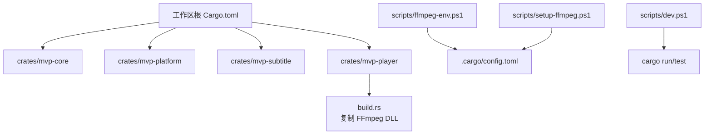
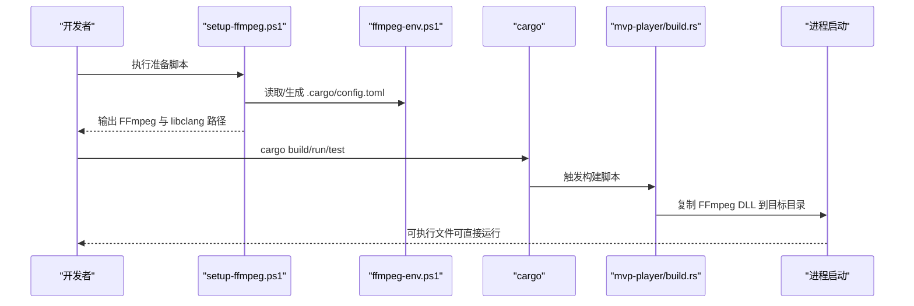
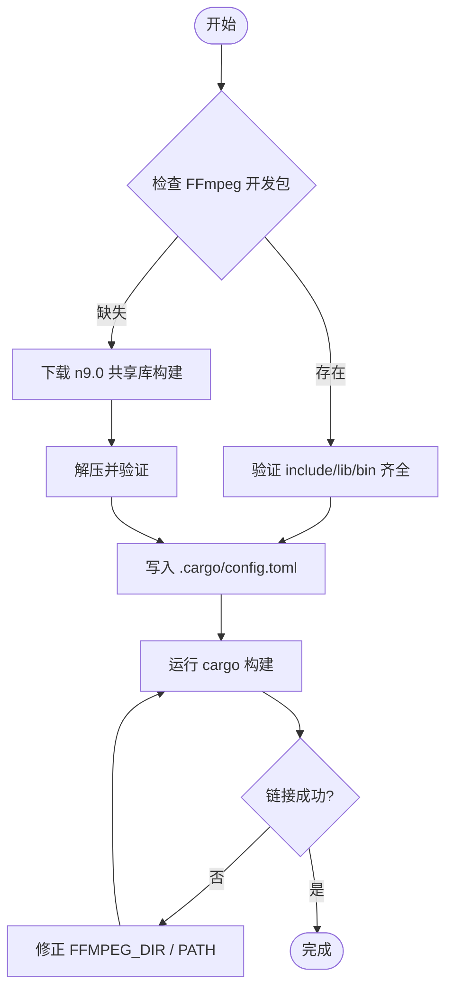
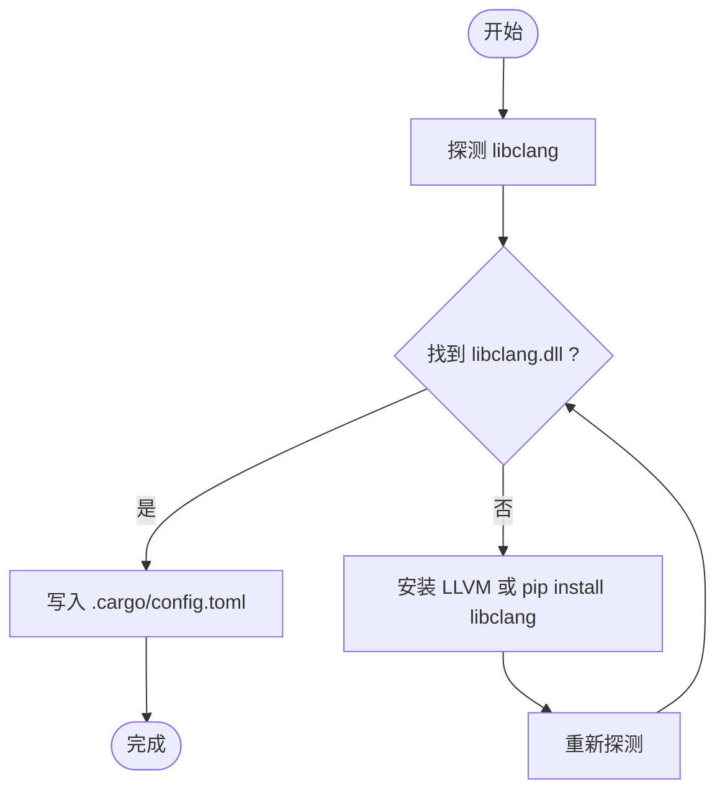
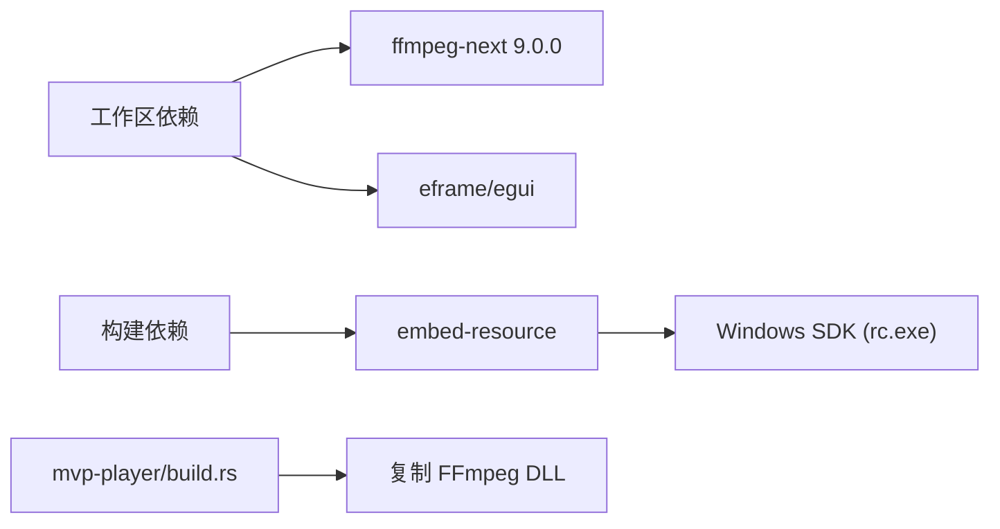

# 编译问题

<cite>
**本文引用的文件**
- [Cargo.toml](file://Cargo.toml)
- [README.md](file://README.md)
- [scripts/ffmpeg-env.ps1](file://scripts/ffmpeg-env.ps1)
- [scripts/setup-ffmpeg.ps1](file://scripts/setup-ffmpeg.ps1)
- [scripts/dev.ps1](file://scripts/dev.ps1)
- [crates/mvp-player/build.rs](file://crates/mvp-player/build.rs)
- [crates/mvp-player/Cargo.toml](file://crates/mvp-player/Cargo.toml)
</cite>

## 目录
1. [简介](#简介)
2. [项目结构](#项目结构)
3. [核心组件](#核心组件)
4. [架构总览](#架构总览)
5. [详细组件分析](#详细组件分析)
6. [依赖关系分析](#依赖关系分析)
7. [性能与构建特性](#性能与构建特性)
8. [故障排查指南](#故障排查指南)
9. [结论](#结论)
10. [附录：错误对照表与修复步骤](#附录错误对照表与修复步骤)

## 简介
本指南聚焦于该 Rust 多媒体播放器在 Windows 平台上的编译与链接问题，覆盖 FFmpeg 链接失败、libclang 配置、Cargo 构建错误以及 Windows 工具链相关问题。内容基于仓库中的脚本与构建逻辑，提供可操作的逐步修复方案与错误信息对照表。

## 项目结构
- 工作区包含四个 crate：mvp-core（媒体引擎）、mvp-platform（Windows 集成）、mvp-subtitle（字幕解析）、mvp-player（应用与 UI）。
- 构建相关的关键脚本位于 scripts 目录，负责准备本机环境（FFmpeg 开发包与 libclang）并生成 .cargo/config.toml。
- mvp-player 的 build.rs 会在构建时复制 FFmpeg 运行时 DLL 到目标目录，以便直接运行二进制无需额外 PATH。

**图表来源**
- [Cargo.toml:1-15](file://Cargo.toml#L1-L15)
- [scripts/ffmpeg-env.ps1:1-22](file://scripts/ffmpeg-env.ps1#L1-L22)
- [scripts/setup-ffmpeg.ps1:1-22](file://scripts/setup-ffmpeg.ps1#L1-L22)
- [scripts/dev.ps1:1-15](file://scripts/dev.ps1#L1-L15)
- [crates/mvp-player/build.rs:1-12](file://crates/mvp-player/build.rs#L1-L12)

**章节来源**
- [Cargo.toml:1-15](file://Cargo.toml#L1-L15)
- [README.md:153-189](file://README.md#L153-L189)

## 核心组件
- FFmpeg 绑定与链接：通过 ffmpeg-next 9.0.0 与共享库开发包进行链接；需要 include、lib/*.lib、bin/*.dll。
- libclang：由 ffmpeg-sys-next 的 bindgen 阶段使用，用于生成 C 头文件的 Rust 绑定。
- 构建脚本：setup-ffmpeg.ps1 自动下载或复用 FFmpeg 开发包，探测 libclang，写入 .cargo/config.toml；dev.ps1 为 cargo 命令注入 PATH 并转发参数；build.rs 将 FFmpeg DLL 复制到输出目录。

**章节来源**
- [Cargo.toml:36-38](file://Cargo.toml#L36-L38)
- [scripts/ffmpeg-env.ps1:23-72](file://scripts/ffmpeg-env.ps1#L23-L72)
- [scripts/setup-ffmpeg.ps1:94-150](file://scripts/setup-ffmpeg.ps1#L94-L150)
- [scripts/dev.ps1:44-64](file://scripts/dev.ps1#L44-L64)
- [crates/mvp-player/build.rs:183-210](file://crates/mvp-player/build.rs#L183-L210)

## 架构总览
下图展示了从脚本准备环境到 cargo 构建再到运行时加载 FFmpeg DLL 的流程。

**图表来源**
- [scripts/setup-ffmpeg.ps1:172-213](file://scripts/setup-ffmpeg.ps1#L172-L213)
- [scripts/ffmpeg-env.ps1:59-72](file://scripts/ffmpeg-env.ps1#L59-L72)
- [crates/mvp-player/build.rs:60-79](file://crates/mvp-player/build.rs#L60-L79)
- [crates/mvp-player/build.rs:183-210](file://crates/mvp-player/build.rs#L183-L210)

## 详细组件分析

### FFmpeg 链接失败排查
- 现象：链接阶段找不到 avcodec.lib 等导入库，或报未解析符号。
- 原因：
  - 未安装或路径不正确：缺少 include/lib/bin 三件套。
  - 使用了静态构建而非共享库构建。
  - .cargo/config.toml 中 FFMPEG_DIR 指向错误或环境变量冲突。
- 处理要点：
  - 使用 BtbN 的 FFmpeg 9.0 共享库构建（n9.0 分支），确保 include、lib/*.lib、bin/*.dll 齐全。
  - 运行 setup-ffmpeg.ps1 自动下载/复用并写入 .cargo/config.toml。
  - 若已有本地开发包，可通过 -FfmpegDir 指定。
  - dev.ps1 会将 FFmpeg bin 加入 PATH，便于 cargo run/test 找到 DLL。

**图表来源**
- [scripts/setup-ffmpeg.ps1:94-150](file://scripts/setup-ffmpeg.ps1#L94-L150)
- [scripts/setup-ffmpeg.ps1:172-213](file://scripts/setup-ffmpeg.ps1#L172-L213)
- [scripts/dev.ps1:44-64](file://scripts/dev.ps1#L44-L64)

**章节来源**
- [scripts/setup-ffmpeg.ps1:94-150](file://scripts/setup-ffmpeg.ps1#L94-L150)
- [scripts/setup-ffmpeg.ps1:172-213](file://scripts/setup-ffmpeg.ps1#L172-L213)
- [scripts/dev.ps1:44-64](file://scripts/dev.ps1#L44-L64)
- [README.md:198-228](file://README.md#L198-L228)

### libclang 配置问题排查
- 现象：bindgen 阶段报错无法找到 libclang，提示设置 LIBCLANG_PATH。
- 原因：
  - 未安装 LLVM 或未安装 pip 的 libclang。
  - clang-sys 搜索顺序未命中实际 DLL 位置。
- 处理要点：
  - 优先尝试安装 LLVM 到 C:\Program Files\LLVM（clang-sys 会自行查找）。
  - 或通过 pip install libclang，脚本会自动探测 Python 安装的 native 目录。
  - 也可手动设置 LIBCLANG_PATH 指向包含 libclang.dll 的目录或 DLL 本身。
  - 重新运行 setup-ffmpeg.ps1 以更新 .cargo/config.toml。

**图表来源**
- [scripts/ffmpeg-env.ps1:74-143](file://scripts/ffmpeg-env.ps1#L74-L143)
- [scripts/setup-ffmpeg.ps1:152-170](file://scripts/setup-ffmpeg.ps1#L152-L170)
- [scripts/setup-ffmpeg.ps1:172-213](file://scripts/setup-ffmpeg.ps1#L172-L213)

**章节来源**
- [scripts/ffmpeg-env.ps1:74-143](file://scripts/ffmpeg-env.ps1#L74-L143)
- [scripts/setup-ffmpeg.ps1:152-170](file://scripts/setup-ffmpeg.ps1#L152-L170)
- [README.md:212-228](file://README.md#L212-L228)

### Cargo 构建错误排查
- 常见类型：
  - 依赖版本不兼容：工作区统一声明了 ffmpeg-next、eframe、egui 等版本，升级需保持兼容。
  - 平台特定依赖缺失：Windows SDK（rc.exe）缺失会导致资源编译失败。
  - 交叉编译问题：当前项目面向 x86_64-pc-windows-msvc，跨平台需额外工具链与依赖。
- 处理要点：
  - 使用工作区定义的 Rust 版本（1.85+）与 MSVC 工具链（VS 2022）。
  - 确保 Windows SDK 可用（embed-resource 依赖 rc.exe）。
  - 避免混用不同分隔符的 FFMPEG_DIR（脚本已标准化为正斜杠以避免重复 bindgen）。

**章节来源**
- [Cargo.toml:10-14](file://Cargo.toml#L10-L14)
- [crates/mvp-player/build.rs:119-128](file://crates/mvp-player/build.rs#L119-L128)
- [scripts/dev.ps1:53-64](file://scripts/dev.ps1#L53-L64)
- [README.md:153-163](file://README.md#L153-L163)

### Windows 平台特定问题
- Visual Studio 工具链：需要 VS 2022 及 link.exe、Windows SDK。
- PowerShell 执行权限：若脚本被阻止，需在管理员或用户策略下允许执行本地脚本。
- PATH 与 DLL 加载：dev.ps1 会为 cargo run/test 注入 FFmpeg bin 到 PATH；发布产物由 build.rs 复制 DLL 到目标目录，因此分发时无需 PATH。

**章节来源**
- [README.md:153-163](file://README.md#L153-L163)
- [scripts/dev.ps1:1-15](file://scripts/dev.ps1#L1-L15)
- [crates/mvp-player/build.rs:183-210](file://crates/mvp-player/build.rs#L183-L210)

## 依赖关系分析
- 工作区统一依赖管理：ffmpeg-next 9.0.0 与 eframe/egui 等 GUI 依赖在工作区集中声明，减少版本漂移。
- 构建期依赖：embed-resource 用于嵌入图标与清单，依赖 Windows SDK。
- 运行时依赖：FFmpeg 共享库 DLL 由 build.rs 复制到目标目录，保证直接运行。

**图表来源**
- [Cargo.toml:17-51](file://Cargo.toml#L17-L51)
- [crates/mvp-player/Cargo.toml:36-38](file://crates/mvp-player/Cargo.toml#L36-L38)
- [crates/mvp-player/build.rs:119-128](file://crates/mvp-player/build.rs#L119-L128)
- [crates/mvp-player/build.rs:183-210](file://crates/mvp-player/build.rs#L183-L210)

**章节来源**
- [Cargo.toml:17-51](file://Cargo.toml#L17-L51)
- [crates/mvp-player/Cargo.toml:36-38](file://crates/mvp-player/Cargo.toml#L36-L38)
- [crates/mvp-player/build.rs:119-128](file://crates/mvp-player/build.rs#L119-L128)

## 性能与构建特性
- 发布构建启用 LTO、strip、优化等级提升，减小体积并提高启动速度。
- 开发构建保留调试信息与增量编译，便于迭代。
- 构建脚本避免重复拷贝大体积 FFmpeg DLL，仅在必要时更新。

**章节来源**
- [Cargo.toml:53-78](file://Cargo.toml#L53-L78)
- [crates/mvp-player/build.rs:212-233](file://crates/mvp-player/build.rs#L212-L233)

## 故障排查指南
- 先确认是否已运行 setup-ffmpeg.ps1，且 .cargo/config.toml 存在且正确。
- 若遇到 libclang 相关错误，优先安装 LLVM 或 pip install libclang，再重跑脚本。
- 若链接失败，检查 FFMPEG_DIR 指向的目录是否包含 include、lib/*.lib、bin/*.dll。
- 若 cargo run/test 找不到 DLL，确认 dev.ps1 已将 FFmpeg bin 加入 PATH，或直接运行 target 下的可执行文件（build.rs 已复制 DLL）。
- 若资源编译失败，检查 Windows SDK 是否安装（rc.exe 可用）。

**章节来源**
- [scripts/setup-ffmpeg.ps1:172-213](file://scripts/setup-ffmpeg.ps1#L172-L213)
- [scripts/ffmpeg-env.ps1:59-72](file://scripts/ffmpeg-env.ps1#L59-L72)
- [scripts/dev.ps1:44-64](file://scripts/dev.ps1#L44-L64)
- [crates/mvp-player/build.rs:119-128](file://crates/mvp-player/build.rs#L119-L128)

## 结论
本项目的编译与链接高度依赖本机环境配置。通过统一的脚本与构建逻辑，可以自动化准备 FFmpeg 与 libclang，并在构建时将运行时 DLL 复制到目标目录，简化开发与分发流程。遇到问题时，优先检查脚本生成的 .cargo/config.toml 与 PATH，再根据错误信息定位具体环节。

## 附录：错误对照表与修复步骤

### FFmpeg 链接失败
- 错误特征：找不到 avcodec.lib 或链接阶段报未解析符号。
- 可能原因：
  - 未安装 FFmpeg 共享库开发包。
  - FFMPEG_DIR 指向错误或环境变量冲突。
  - 使用了静态构建而非共享库构建。
- 修复步骤：
  1. 运行 setup-ffmpeg.ps1 自动下载/复用 FFmpeg 9.0 共享库。
  2. 如已有本地开发包，使用 -FfmpegDir 指定路径。
  3. 确认 .cargo/config.toml 中 FFMPEG_DIR 正确。
  4. 使用 dev.ps1 运行 cargo 命令以注入 PATH。

**章节来源**
- [scripts/setup-ffmpeg.ps1:94-150](file://scripts/setup-ffmpeg.ps1#L94-L150)
- [scripts/setup-ffmpeg.ps1:172-213](file://scripts/setup-ffmpeg.ps1#L172-L213)
- [scripts/dev.ps1:44-64](file://scripts/dev.ps1#L44-L64)
- [README.md:198-228](file://README.md#L198-L228)

### libclang 配置问题
- 错误特征：bindgen 阶段提示无法找到 libclang，要求设置 LIBCLANG_PATH。
- 可能原因：
  - 未安装 LLVM 或 pip 的 libclang。
  - clang-sys 搜索顺序未命中 DLL。
- 修复步骤：
  1. 安装 LLVM 到 C:\Program Files\LLVM，或 pip install libclang。
  2. 重新运行 setup-ffmpeg.ps1 以探测并写入配置。
  3. 如需手动指定，设置 LIBCLANG_PATH 指向包含 libclang.dll 的目录或 DLL 本身。

**章节来源**
- [scripts/ffmpeg-env.ps1:74-143](file://scripts/ffmpeg-env.ps1#L74-L143)
- [scripts/setup-ffmpeg.ps1:152-170](file://scripts/setup-ffmpeg.ps1#L152-L170)
- [README.md:212-228](file://README.md#L212-L228)

### Cargo 构建错误
- 错误特征：依赖版本不兼容、平台依赖缺失、交叉编译失败。
- 可能原因：
  - Rust 版本或工具链不匹配。
  - Windows SDK 缺失导致资源编译失败。
  - 非目标平台构建缺少必要依赖。
- 修复步骤：
  1. 使用 Rust 1.85+ 与 x86_64-pc-windows-msvc 工具链。
  2. 安装 VS 2022 及 Windows SDK（确保 rc.exe 可用）。
  3. 避免混用不同分隔符的 FFMPEG_DIR（脚本已标准化）。

**章节来源**
- [Cargo.toml:10-14](file://Cargo.toml#L10-L14)
- [crates/mvp-player/build.rs:119-128](file://crates/mvp-player/build.rs#L119-L128)
- [scripts/dev.ps1:53-64](file://scripts/dev.ps1#L53-L64)
- [README.md:153-163](file://README.md#L153-L163)

### Windows 平台特定问题
- 错误特征：PowerShell 脚本执行失败、资源编译失败、运行时找不到 DLL。
- 可能原因：
  - PowerShell 执行策略限制。
  - Windows SDK 缺失。
  - PATH 未包含 FFmpeg bin。
- 修复步骤：
  1. 允许执行本地 PowerShell 脚本（必要时调整执行策略）。
  2. 安装 VS 2022 与 Windows SDK。
  3. 使用 dev.ps1 运行 cargo 命令，或确保目标目录下已有 FFmpeg DLL（build.rs 已复制）。

**章节来源**
- [scripts/dev.ps1:1-15](file://scripts/dev.ps1#L1-L15)
- [crates/mvp-player/build.rs:119-128](file://crates/mvp-player/build.rs#L119-L128)
- [crates/mvp-player/build.rs:183-210](file://crates/mvp-player/build.rs#L183-L210)