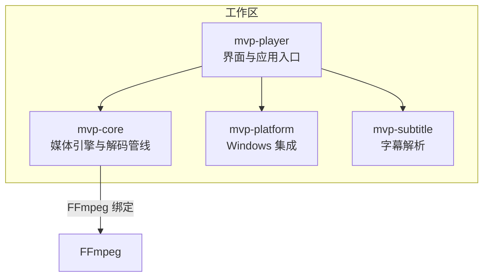
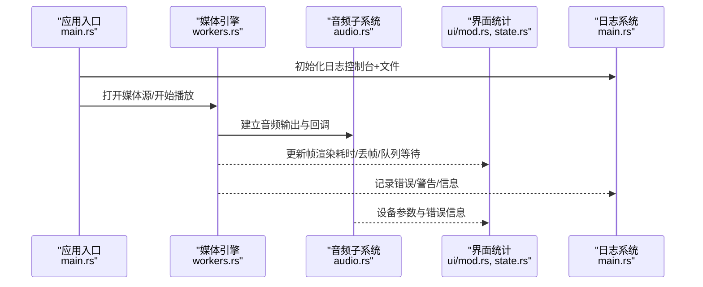
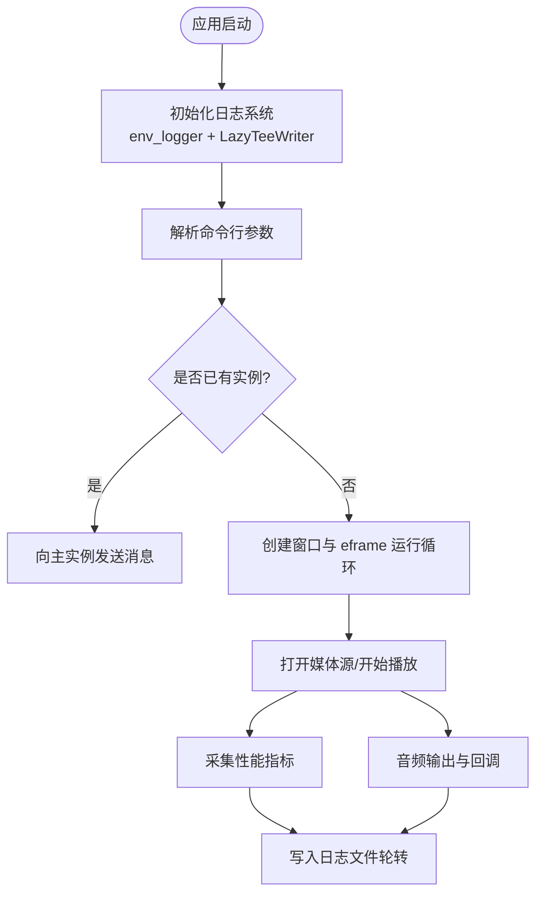
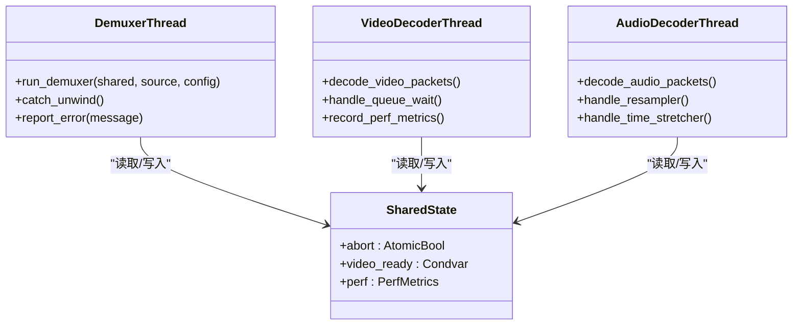
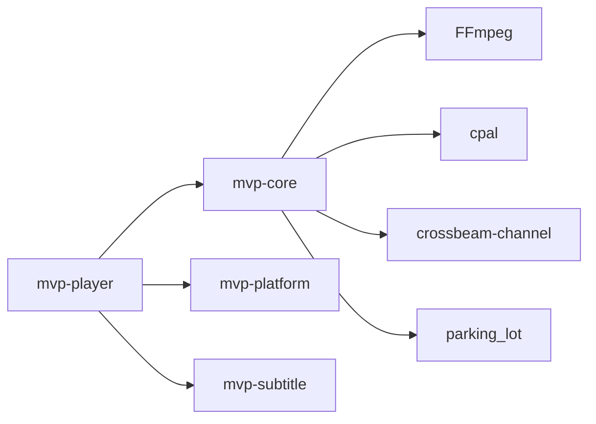

# 调试指南

<cite>
**本文引用的文件**   
- [Cargo.toml](file://Cargo.toml)
- [README.md](file://README.md)
- [scripts/dev.ps1](file://scripts/dev.ps1)
- [crates/mvp-player/src/main.rs](file://crates/mvp-player/src/main.rs)
- [crates/mvp-core/src/lib.rs](file://crates/mvp-core/src/lib.rs)
- [crates/mvp-core/examples/seek_probe.rs](file://crates/mvp-core/examples/seek_probe.rs)
- [crates/mvp-core/examples/fps_probe.rs](file://crates/mvp-core/examples/fps_probe.rs)
- [crates/mvp-core/src/engine/workers.rs](file://crates/mvp-core/src/engine/workers.rs)
- [crates/mvp-core/src/audio.rs](file://crates/mvp-core/src/audio.rs)
- [crates/mvp-player/src/ui/mod.rs](file://crates/mvp-player/src/ui/mod.rs)
- [crates/mvp-player/src/state.rs](file://crates/mvp-player/src/state.rs)
- [crates/mvp-platform/src/single_instance.rs](file://crates/mvp-platform/src/single_instance.rs)
</cite>

## 目录
1. [简介](#简介)
2. [项目结构](#项目结构)
3. [核心组件](#核心组件)
4. [架构总览](#架构总览)
5. [详细组件分析](#详细组件分析)
6. [依赖关系分析](#依赖关系分析)
7. [性能与可观测性](#性能与可观测性)
8. [故障排查指南](#故障排查指南)
9. [结论](#结论)
10. [附录：常用命令与工具清单](#附录常用命令与工具清单)

## 简介
本调试指南面向 MVP-Versatile-Player 的开发者与维护者，覆盖以下主题：
- 开发环境搭建：Rust 调试工具、VS Code 调试配置、断点调试技巧。
- 日志分析方法：日志级别、关键信息提取、性能指标收集。
- 内存泄漏检测：Valgrind 使用建议、Rust 内存分析工具、常见泄漏模式识别。
- 多线程调试：线程状态检查、死锁检测、竞态条件分析。
- 远程调试与崩溃转储：核心转储生成、符号文件配置、堆栈跟踪解读。
- 常用调试命令与工具推荐。

本项目是 Windows 桌面多媒体播放器，直接链接 FFmpeg，包含媒体引擎、平台集成、字幕解析与 egui 界面四个 crate。工程采用 Cargo workspace 组织，提供脚本简化构建与测试流程。

## 项目结构
仓库根目录为 Rust workspace，包含四个主要 crate：
- mvp-core：FFmpeg 绑定、播放引擎、图片查看器、播放列表等。
- mvp-platform：Windows 集成（文件关联、单实例 IPC、外壳、电源）。
- mvp-subtitle：字幕解析（SRT / ASS / VTT / MicroDVD 与编码识别）。
- mvp-player：egui 界面与应用程序入口。

图表来源
- [README.md:315-323](file://README.md#L315-L323)
- [Cargo.toml:1-8](file://Cargo.toml#L1-L8)

章节来源
- [README.md:315-323](file://README.md#L315-L323)
- [Cargo.toml:1-8](file://Cargo.toml#L1-L8)

## 核心组件
- 应用入口与日志系统：main.rs 负责命令行解析、单实例控制、窗口创建与日志初始化；日志同时输出到控制台与轮转日志文件。
- 媒体引擎：workers.rs 实现解复用与音视频解码工作线程，统一捕获 panic 并上报错误状态；audio.rs 管理音频输出与回调。
- 性能统计：ui/mod.rs 与 state.rs 维护帧渲染耗时、丢帧、队列等待等指标。
- 单实例 IPC：single_instance.rs 通过命名互斥体与隐藏窗口消息实现进程间通信。

章节来源
- [crates/mvp-player/src/main.rs:40-182](file://crates/mvp-player/src/main.rs#L40-L182)
- [crates/mvp-core/src/engine/workers.rs:1-24](file://crates/mvp-core/src/engine/workers.rs#L1-L24)
- [crates/mvp-core/src/audio.rs:350-377](file://crates/mvp-core/src/audio.rs#L350-L377)
- [crates/mvp-player/src/ui/mod.rs:166-194](file://crates/mvp-player/src/ui/mod.rs#L166-L194)
- [crates/mvp-platform/src/single_instance.rs:94-146](file://crates/mvp-platform/src/single_instance.rs#L94-L146)

## 架构总览
下图展示从应用入口到媒体引擎的关键调用链，以及日志与性能指标的流向。

图表来源
- [crates/mvp-player/src/main.rs:189-207](file://crates/mvp-player/src/main.rs#L189-L207)
- [crates/mvp-core/src/engine/workers.rs:134-152](file://crates/mvp-core/src/engine/workers.rs#L134-L152)
- [crates/mvp-core/src/audio.rs:350-377](file://crates/mvp-core/src/audio.rs#L350-L377)
- [crates/mvp-player/src/ui/mod.rs:166-194](file://crates/mvp-player/src/ui/mod.rs#L166-L194)
- [crates/mvp-player/src/state.rs:646-685](file://crates/mvp-player/src/state.rs#L646-L685)

## 详细组件分析

### 开发环境与调试工具配置
- Rust 工具链与版本：workspace 指定 rust-version 与 edition，确保本地工具链一致。
- 构建与运行脚本：scripts/dev.ps1 自动准备 FFmpeg 运行时路径，转发 cargo 命令，便于在 PowerShell 中一键构建、运行与测试。
- VS Code 调试配置：建议使用默认 Rust 扩展提供的 launch.json 模板，选择 cargo run 目标为 mvp-player，并在环境变量中设置 RUST_LOG 以启用日志。

章节来源
- [Cargo.toml:10-14](file://Cargo.toml#L10-L14)
- [scripts/dev.ps1:1-16](file://scripts/dev.ps1#L1-L16)
- [scripts/dev.ps1:30-71](file://scripts/dev.ps1#L30-L71)

### 断点调试技巧
- 在 main.rs 的 main() 函数入口设置断点，观察命令行解析、单实例获取、窗口创建流程。
- 在 workers.rs 的 demuxer 与解码线程入口设置断点，验证解复用与解码流程是否按预期进入。
- 在 audio.rs 的 cpal 输出回调处设置断点，检查音频缓冲大小、采样率、声道数与实时路径是否无分配与加锁。
- 在 ui/mod.rs 的性能统计更新处设置断点，确认帧耗时、平均耗时、最坏耗时与慢帧计数是否正确采集。

章节来源
- [crates/mvp-player/src/main.rs:40-182](file://crates/mvp-player/src/main.rs#L40-L182)
- [crates/mvp-core/src/engine/workers.rs:134-152](file://crates/mvp-core/src/engine/workers.rs#L134-L152)
- [crates/mvp-core/src/audio.rs:350-377](file://crates/mvp-core/src/audio.rs#L350-L377)
- [crates/mvp-player/src/ui/mod.rs:166-194](file://crates/mvp-player/src/ui/mod.rs#L166-L194)

### 日志分析方法
- 日志级别配置：main.rs 使用 env_logger，默认过滤级别为 info，并通过 LazyTeeWriter 将日志写入文件与 stderr。可通过环境变量 RUST_LOG 调整模块级别。
- 关键信息提取：
  - 启动阶段：窗口尺寸、屏幕可用区域、启动耗时。
  - 音频阶段：设备名称、采样率、声道数、格式。
  - 错误与警告：音频输出错误、无法暂停/恢复音频流、未知映射方式、动画帧过多截断、播放列表读取失败等。
- 性能指标收集：ui/mod.rs 暴露 last_frame_ms、average_frame_ms、worst_frame_ms、slow_frames；state.rs 提供 handoff_ms、presented 等指标。

图表来源
- [crates/mvp-player/src/main.rs:189-294](file://crates/mvp-player/src/main.rs#L189-L294)
- [crates/mvp-core/src/audio.rs:350-377](file://crates/mvp-core/src/audio.rs#L350-L377)
- [crates/mvp-player/src/ui/mod.rs:166-194](file://crates/mvp-player/src/ui/mod.rs#L166-L194)

章节来源
- [crates/mvp-player/src/main.rs:189-294](file://crates/mvp-player/src/main.rs#L189-L294)
- [crates/mvp-core/src/audio.rs:350-377](file://crates/mvp-core/src/audio.rs#L350-L377)
- [crates/mvp-player/src/ui/mod.rs:166-194](file://crates/mvp-player/src/ui/mod.rs#L166-L194)
- [crates/mvp-player/src/state.rs:646-685](file://crates/mvp-player/src/state.rs#L646-L685)

### 内存泄漏检测
- Valgrind：本项目为 Windows 平台，Valgrind 通常不直接适用；若需要在 Linux 上复现问题，可使用 Valgrind 的 memcheck 与 helgrind 检测内存与线程问题。
- Rust 内存分析工具：
  - cargo-memprof：采样堆分配热点，定位高频分配与潜在泄漏。
  - heaptrack：可视化内存增长曲线，结合符号文件分析具体分配位置。
  - AddressSanitizer（ASan）：启用 debug_assertions 或自定义 profile 编译，捕获越界访问、重复释放等内存错误。
- 常见泄漏模式识别：
  - 长生命周期全局缓存未清理（如静态 HashMap 持续增长）。
  - 闭包捕获大对象导致引用环（Arc/RwLock 组合不当）。
  - 第三方库（FFmpeg）句柄未释放（需检查 FFI 封装的 drop 逻辑）。
  - 音频回调中的临时缓冲区未重用（应预分配 scratch buffer）。

章节来源
- [crates/mvp-core/src/audio.rs:350-377](file://crates/mvp-core/src/audio.rs#L350-L377)
- [crates/mvp-core/src/lib.rs:57-69](file://crates/mvp-core/src/lib.rs#L57-L69)

### 多线程调试
- 线程模型：workers.rs 实现解复用线程与音视频解码线程，所有入口均用 catch_unwind 捕获 panic，避免损坏文件导致整个播放器崩溃。
- 线程状态检查：
  - 通过 shared.abort 标志位判断线程是否应退出。
  - 通过 channel 接收超时（WORKER_POLL）检查线程阻塞情况。
- 死锁检测：
  - 关注共享状态的 Mutex/RwLock 使用顺序，避免跨线程嵌套加锁。
  - single_instance.rs 的 IPC 线程与主线程之间通过消息传递，避免直接共享可变状态。
- 竞态条件分析：
  - 音频回调中使用原子变量与 seqlock 发布参数，保证实时路径无锁。
  - 视频与音频队列按字节上限限制，防止背压不足导致数据积压。

图表来源
- [crates/mvp-core/src/engine/workers.rs:134-152](file://crates/mvp-core/src/engine/workers.rs#L134-L152)
- [crates/mvp-core/src/engine/workers.rs:1424-1460](file://crates/mvp-core/src/engine/workers.rs#L1424-L1460)

章节来源
- [crates/mvp-core/src/engine/workers.rs:1-24](file://crates/mvp-core/src/engine/workers.rs#L1-L24)
- [crates/mvp-core/src/engine/workers.rs:134-152](file://crates/mvp-core/src/engine/workers.rs#L134-L152)
- [crates/mvp-core/src/engine/workers.rs:1424-1460](file://crates/mvp-core/src/engine/workers.rs#L1424-L1460)
- [crates/mvp-platform/src/single_instance.rs:94-146](file://crates/mvp-platform/src/single_instance.rs#L94-L146)

### 远程调试与崩溃转储
- 核心转储生成：
  - Windows 下可使用 WinDbg 或 Visual Studio 附加到进程后生成 dump 文件。
  - 在生产环境中，可配置任务计划程序或崩溃钩子自动生成 minidump。
- 符号文件配置：
  - 确保保留 PDB 符号文件（debug build 默认生成），发布构建可能 strip symbols，需单独保留符号。
  - 在 WinDbg 中设置符号服务器路径，加载对应 PDB 文件进行堆栈跟踪。
- 堆栈跟踪解读：
  - 关注 FFmpeg 相关调用栈，定位解码或转换阶段的异常。
  - 注意 Rust panic 与 C++ 异常的差异，必要时启用 unwind 而非 abort。

章节来源
- [Cargo.toml:53-78](file://Cargo.toml#L53-L78)
- [crates/mvp-core/src/lib.rs:57-69](file://crates/mvp-core/src/lib.rs#L57-L69)

## 依赖关系分析
- 内部依赖：
  - mvp-player 依赖 mvp-core、mvp-platform、mvp-subtitle。
  - mvp-core 依赖 ffmpeg-next、cpal、crossbeam-channel、parking_lot 等。
- 外部依赖：
  - FFmpeg：直接链接，避免子进程开销。
  - eframe/egui：GUI 框架。
  - rfd：文件对话框。
  - windows：Windows API 绑定。

图表来源
- [Cargo.toml:17-52](file://Cargo.toml#L17-L52)
- [README.md:315-323](file://README.md#L315-L323)

章节来源
- [Cargo.toml:17-52](file://Cargo.toml#L17-L52)
- [README.md:315-323](file://README.md#L315-L323)

## 性能与可观测性
- 帧渲染性能：
  - ui/mod.rs 维护 last_frame_ms、average_frame_ms、worst_frame_ms、slow_frames。
  - state.rs 提供 handoff_ms、presented 等指标。
- 解码与转换性能：
  - workers.rs 记录 convert_ms、tone_map_ms、queue_wait_ms 等指标。
- 音频性能：
  - audio.rs 在回调中避免分配与加锁，使用预分配 scratch buffer。
- 启动与关闭性能：
  - README.md 提到启动自有代码耗时 6–8 ms，关闭约 46 ms。

章节来源
- [crates/mvp-player/src/ui/mod.rs:166-194](file://crates/mvp-player/src/ui/mod.rs#L166-L194)
- [crates/mvp-player/src/state.rs:646-685](file://crates/mvp-player/src/state.rs#L646-L685)
- [crates/mvp-core/src/engine/workers.rs:1365-1445](file://crates/mvp-core/src/engine/workers.rs#L1365-L1445)
- [crates/mvp-core/src/audio.rs:350-377](file://crates/mvp-core/src/audio.rs#L350-L377)
- [README.md:425-453](file://README.md#L425-L453)

## 故障排查指南
- 常见问题定位：
  - 音频输出错误：检查 audio.rs 中的 warn 日志，确认设备参数与回调是否正常。
  - 解码无输出：workers.rs 中 DECODE_STALL 超时机制会在 12 秒内报错，避免空转。
  - 单实例通信失败：single_instance.rs 中记录 warn 日志，确认 IPC 线程是否正常运行。
- 日志分析步骤：
  - 使用 RUST_LOG=mvp_core=debug 提高日志级别，观察内部细节。
  - 查看 %APPDATA%\MVP-Versatile-Player\mvp.log 文件，确认日志轮转是否正常。
- 性能瓶颈定位：
  - 使用 fps_probe 示例测量实际帧率与每帧耗时。
  - 使用 seek_probe 示例定位跳转卡顿位置。

章节来源
- [crates/mvp-core/src/audio.rs:211-230](file://crates/mvp-core/src/audio.rs#L211-L230)
- [crates/mvp-core/src/engine/workers.rs:93-99](file://crates/mvp-core/src/engine/workers.rs#L93-L99)
- [crates/mvp-platform/src/single_instance.rs:113-124](file://crates/mvp-platform/src/single_instance.rs#L113-L124)
- [crates/mvp-core/examples/fps_probe.rs:1-32](file://crates/mvp-core/examples/fps_probe.rs#L1-L32)
- [crates/mvp-core/examples/seek_probe.rs:29-31](file://crates/mvp-core/examples/seek_probe.rs#L29-L31)

## 结论
本调试指南基于项目源码与实际实现，提供了从环境搭建到多线程调试、从日志分析到性能优化的完整流程。通过合理利用 Rust 生态工具与项目内置的可观测性能力，开发者可以快速定位问题、优化性能并确保稳定性。

## 附录：常用命令与工具清单
- 构建与运行：
  - .\scripts\dev.ps1 build -p mvp-player
  - .\scripts\dev.ps1 run -p mvp-player
  - .\scripts\dev.ps1 test --workspace
- 日志与环境：
  - 设置 RUST_LOG=mvp_core=debug 提高日志级别。
  - 查看 %APPDATA%\MVP-Versatile-Player\mvp.log 日志文件。
- 性能分析：
  - cargo run -p mvp-core --example fps_probe <file> [seconds] [screen-hz] [WxH] [--software]
  - cargo run -p mvp-core --example seek_probe <file> [time]
- 内存与线程分析：
  - cargo install cargo-memprof
  - 安装 heaptrack 并配合符号文件分析。
  - 启用 ASan 编译选项进行内存错误检测。
- 远程调试：
  - 使用 WinDbg 或 Visual Studio 附加进程生成 dump。
  - 配置符号服务器路径加载 PDB 文件。

章节来源
- [README.md:233-247](file://README.md#L233-L247)
- [README.md:435-437](file://README.md#L435-L437)
- [crates/mvp-core/examples/fps_probe.rs:1-32](file://crates/mvp-core/examples/fps_probe.rs#L1-L32)
- [crates/mvp-core/examples/seek_probe.rs:29-31](file://crates/mvp-core/examples/seek_probe.rs#L29-L31)
- [Cargo.toml:53-78](file://Cargo.toml#L53-L78)