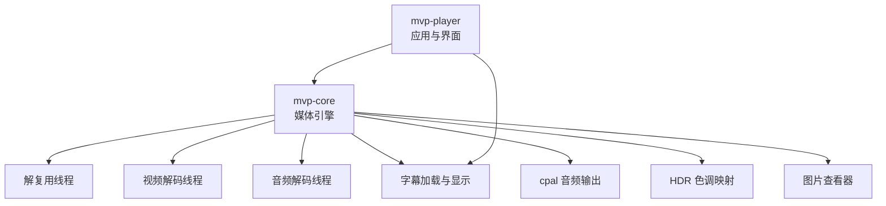
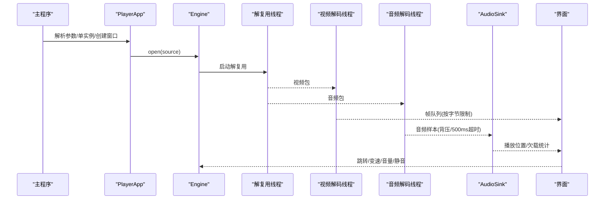
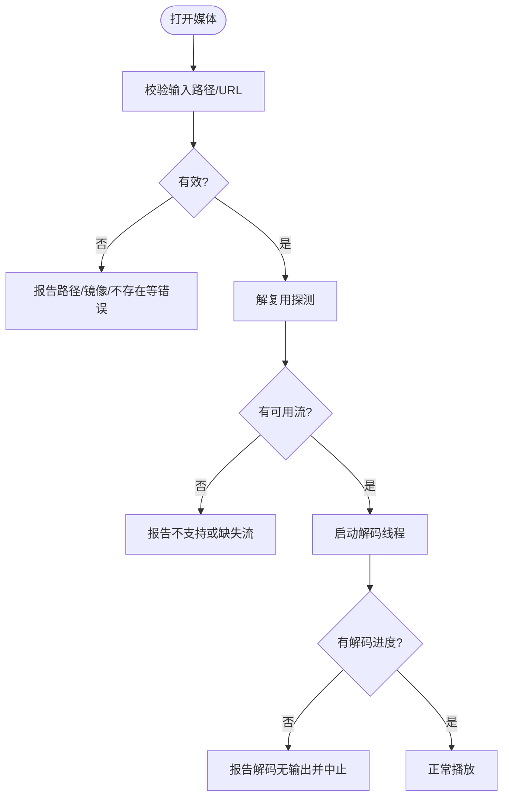
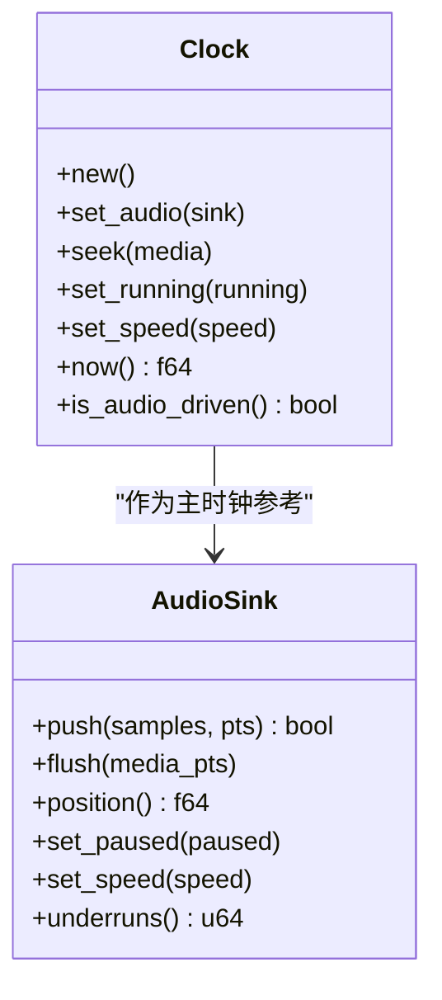
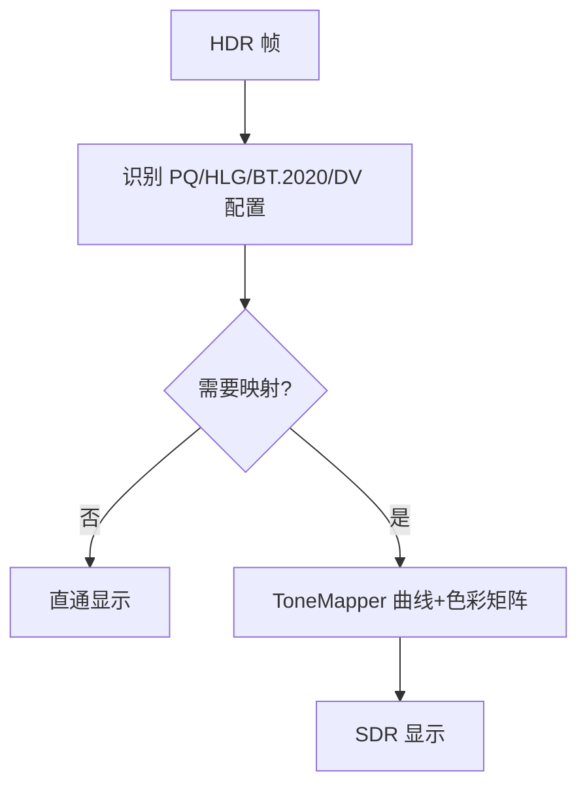
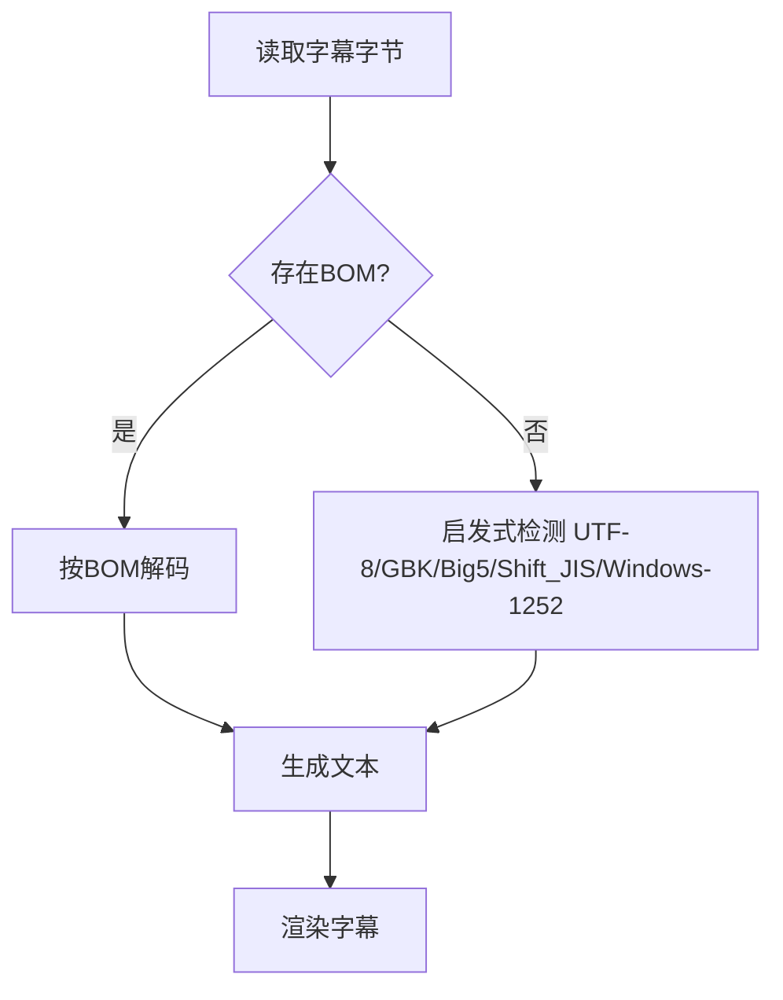
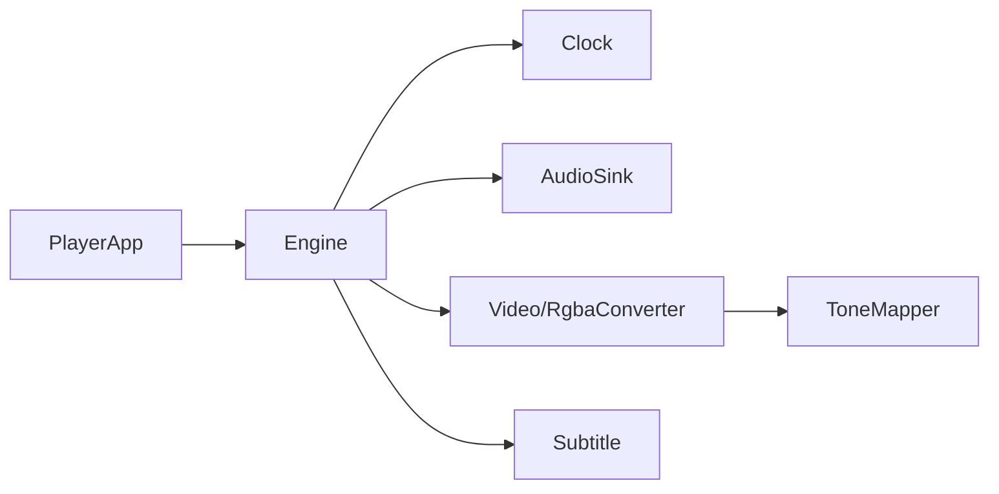

# 运行时问题

<cite>
**本文引用的文件**   
- [README.md](file://README.md)
- [Cargo.toml](file://Cargo.toml)
- [main.rs](file://crates/mvp-player/src/main.rs)
- [app.rs](file://crates/mvp-player/src/app.rs)
- [engine.rs](file://crates/mvp-core/src/engine.rs)
- [workers.rs](file://crates/mvp-core/src/engine/workers.rs)
- [clock.rs](file://crates/mvp-core/src/engine/clock.rs)
- [audio.rs](file://crates/mvp-core/src/audio.rs)
- [hdr.rs](file://crates/mvp-core/src/hdr.rs)
- [encoding.rs](file://crates/mvp-subtitle/src/encoding.rs)
- [error.rs](file://crates/mvp-core/src/error.rs)
- [info.rs](file://crates/mvp-core/src/info.rs)
- [video.rs](file://crates/mvp-core/src/video.rs)
- [image_view.rs](file://crates/mvp-core/src/image_view.rs)
- [02-调研分析.md](file://docs/02-调研分析.md)
- [04-用户使用指南.md](file://docs/04-用户使用指南.md)
</cite>

## 目录
1. [引言](#引言)
2. [项目结构](#项目结构)
3. [核心组件](#核心组件)
4. [架构总览](#架构总览)
5. [详细组件分析](#详细组件分析)
6. [依赖关系分析](#依赖关系分析)
7. [性能与稳定性考量](#性能与稳定性考量)
8. [故障排查指南](#故障排查指南)
9. [结论](#结论)
10. [附录：错误日志速查](#附录错误日志速查)

## 引言
本指南面向“播放失败、音画不同步、HDR 显示异常、字幕乱码、音频设备问题”等常见运行时问题，给出基于代码实现的诊断思路与可操作解决方案。文档同时提供架构图、时序图与流程图，帮助非技术读者快速定位问题所在。

## 项目结构
本项目采用多 crate 分层组织：
- mvp-core：媒体引擎（FFmpeg 绑定、时钟、队列、音频输出、HDR、图片查看器、播放列表）。
- mvp-platform：Windows 集成（单实例、外壳、电源等）。
- mvp-subtitle：字幕解析与编码识别。
- mvp-player：egui 界面与应用主流程。

**图示来源**
- [engine.rs:1-21](file://crates/mvp-core/src/engine.rs#L1-L21)
- [README.md:315-357](file://README.md#L315-L357)

**章节来源**
- [README.md:315-357](file://README.md#L315-L357)
- [Cargo.toml:1-8](file://Cargo.toml#L1-L8)

## 核心组件
- 播放引擎：封装解复用、音视频解码、字幕处理、帧队列、时钟同步与事件分发。
- 音频子系统：基于 cpal 的实时输出，带无锁参数发布、缓冲背压、欠载统计与采样率优选。
- HDR 模块：识别 PQ/HLG/BT.2020/Dolby Vision 配置记录，做 CPU 近似色调映射与色彩空间转换。
- 字幕模块：自动检测 UTF-8/UTF-16 BOM/GBK/Big5/Shift_JIS/Windows-1252，并容错解码。
- 错误模型：统一 MediaError 类型，区分 FFmpeg/Io/Unsupported/MissingStream/AudioDevice/Image/Cancelled/Other。

**章节来源**
- [engine.rs:1-21](file://crates/mvp-core/src/engine.rs#L1-L21)
- [audio.rs:1-26](file://crates/mvp-core/src/audio.rs#L1-L26)
- [hdr.rs:1-25](file://crates/mvp-core/src/hdr.rs#L1-L25)
- [encoding.rs:1-8](file://crates/mvp-subtitle/src/encoding.rs#L1-L8)
- [error.rs:1-53](file://crates/mvp-core/src/error.rs#L1-L53)

## 架构总览
播放器启动后，UI 层通过 Engine 打开媒体；解复用线程将包分发给视频/音频/字幕解码线程；视频帧进入帧队列供 UI 渲染，音频样本经 AudioSink 输出到系统声卡；时钟以系统单调时间为主源，结合音频设备状态进行同步。

**图示来源**
- [engine.rs:1-21](file://crates/mvp-core/src/engine.rs#L1-L21)
- [audio.rs:519-575](file://crates/mvp-core/src/audio.rs#L519-L575)
- [main.rs:40-181](file://crates/mvp-player/src/main.rs#L40-L181)
- [app.rs:484-544](file://crates/mvp-player/src/app.rs#L484-L544)

## 详细组件分析

### 播放失败原因分析与解决
- 文件格式不支持或容器不可用
  - 现象：打开即报错，或提示“不是受支持的媒体格式”。
  - 根因：解复用阶段无法识别容器/流；或光盘镜像 ISO/UDF 被直接丢给解复用器。
  - 处理：
    - 对路径先做 validate_input，拒绝空路径、文件夹、不存在文件与光盘镜像。
    - 对 ISO/UDF 明确提示用户先装载为虚拟盘再打开。
  - 参考：
    - [info.rs:708-728](file://crates/mvp-core/src/info.rs#L708-L728)
    - [README.md:36-41](file://README.md#L36-L41)
    - [04-用户使用指南.md:161-162](file://docs/04-用户使用指南.md#L161-L162)

- 解码器不可用或解码无输出
  - 现象：解复用持续喂包但长时间没有解码帧输出，随后报“解码无输出”。
  - 根因：编解码器缺失、损坏文件或硬件解码回退失败。
  - 处理：
    - 工作线程捕获 panic 并上报错误；当满足“已喂包且超过阈值仍无进度”时主动停止，避免空转。
    - 检查 FFmpeg 版本与构建是否包含所需编解码器；必要时关闭硬件解码回退软件解码。
  - 参考：
    - [workers.rs:140-152](file://crates/mvp-core/src/engine/workers.rs#L140-L152)
    - [workers.rs:1092-1103](file://crates/mvp-core/src/engine/workers.rs#L1092-L1103)
    - [README.md:27-29](file://README.md#L27-L29)

- 资源加载失败（文件/网络）
  - 现象：无法读取本地文件或网络串流。
  - 根因：路径无效、权限不足、网络不可达或协议不被支持。
  - 处理：
    - 使用 validate_input 提前校验本地路径；URL 由 util::is_url 判定。
    - 网络协议需由 FFmpeg 支持；日志中会记录底层错误。
  - 参考：
    - [info.rs:710-728](file://crates/mvp-core/src/info.rs#L710-L728)
    - [util.rs:138-148](file://crates/mvp-core/src/util.rs#L138-L148)

**图示来源**
- [info.rs:708-728](file://crates/mvp-core/src/info.rs#L708-L728)
- [workers.rs:1092-1103](file://crates/mvp-core/src/engine/workers.rs#L1092-L1103)

**章节来源**
- [info.rs:708-728](file://crates/mvp-core/src/info.rs#L708-L728)
- [workers.rs:140-152](file://crates/mvp-core/src/engine/workers.rs#L140-L152)
- [workers.rs:1092-1103](file://crates/mvp-core/src/engine/workers.rs#L1092-L1103)
- [README.md:36-41](file://README.md#L36-L41)

### 音画不同步的诊断与修复
- 时钟同步调整
  - 原理：主时钟使用系统单调时间，避免直接使用声卡计数导致速度漂移；首次音频数据到达时建立锚点，暂停时冻结时钟。
  - 建议：
    - 若出现长片漂移，优先检查系统时间与驱动行为；不要手动修改音频设备采样率以外的时钟相关设置。
    - 在设置中微调“音频延迟”补偿固定偏移。
  - 参考：
    - [clock.rs:1-15](file://crates/mvp-core/src/engine/clock.rs#L1-L15)
    - [clock.rs:133-158](file://crates/mvp-core/src/engine/clock.rs#L133-L158)
    - [settings_window.rs:505-521](file://crates/mvp-player/src/ui/settings_window.rs#L505-L521)

- 缓冲区大小优化
  - 原理：音频队列按 chunk 限制，push 阻塞最多 500 ms 实现背压；欠载会被统计。
  - 建议：
    - 观察“音频欠载”统计；若频繁欠载，降低音效增强强度或关闭增强链。
    - 避免在回调线程做重 IO；当前实现已在回调外完成 DSP 参数发布。
  - 参考：
    - [audio.rs:37-52](file://crates/mvp-core/src/audio.rs#L37-L52)
    - [audio.rs:519-575](file://crates/mvp-core/src/audio.rs#L519-L575)
    - [audio.rs:498-506](file://crates/mvp-core/src/audio.rs#L498-L506)

- 硬件加速配置
  - 原理：优先尝试硬件解码，失败回退软件解码；硬件取回画面有一次显存→内存拷贝。
  - 建议：
    - 若卡顿或黑屏，尝试关闭硬件解码；确认 FFmpeg 共享库与驱动支持。
    - 关注信息面板中的动态范围与解码器信息。
  - 参考：
    - [README.md:27-29](file://README.md#L27-L29)
    - [engine.rs:155-188](file://crates/mvp-core/src/engine.rs#L155-L188)

**图示来源**
- [clock.rs:44-158](file://crates/mvp-core/src/engine/clock.rs#L44-L158)
- [audio.rs:519-618](file://crates/mvp-core/src/audio.rs#L519-L618)

**章节来源**
- [clock.rs:1-15](file://crates/mvp-core/src/engine/clock.rs#L1-L15)
- [clock.rs:133-158](file://crates/mvp-core/src/engine/clock.rs#L133-L158)
- [audio.rs:37-52](file://crates/mvp-core/src/audio.rs#L37-L52)
- [audio.rs:519-575](file://crates/mvp-core/src/audio.rs#L519-L575)
- [settings_window.rs:505-521](file://crates/mvp-player/src/ui/settings_window.rs#L505-L521)

### HDR 显示异常的处理
- 色彩空间转换问题
  - 现象：HDR 画面发灰或过饱和。
  - 根因：未正确识别 PQ/HLG/BT.2020 或 Dolby Vision 兼容层；SDR 显示器需要色调映射。
  - 处理：
    - 开启“HDR 色调映射”，让 ToneMapper 把 BT.2020/PQ/HLG 映射到 SDR。
    - 杜比视界 Profile 5 基底层为 IPT，需要专用渲染器；当前播放器会提示颜色可能不正确。
  - 参考：
    - [hdr.rs:30-58](file://crates/mvp-core/src/hdr.rs#L30-L58)
    - [hdr.rs:124-141](file://crates/mvp-core/src/hdr.rs#L124-L141)
    - [hdr.rs:352-479](file://crates/mvp-core/src/hdr.rs#L352-L479)

- 显示器兼容性
  - 说明：Windows 上 OpenGL 窗口无法向显示器传递杜比视界元数据；关闭色调映射仅保证基底层信号未被改动。
  - 建议：
    - 在 SDR 显示器上启用“HDR 色调映射”；在 HDR 显示器上根据需求关闭/开启对比效果。
  - 参考：
    - [README.md:359-414](file://README.md#L359-L414)

- 色调映射设置
  - 原理：ToneMapper 按亮度曲线+BT.2020→BT.709 矩阵逐像素换算；Dolby Vision 场景峰值用于调整肩部曲线。
  - 建议：
    - 若高光溢出或画面偏灰，切换“HDR 色调映射”开关对比；查看信息面板的动态范围与杜比视界描述。
  - 参考：
    - [hdr.rs:373-479](file://crates/mvp-core/src/hdr.rs#L373-L479)
    - [app.rs:1225-1235](file://crates/mvp-player/src/app.rs#L1225-L1235)

**图示来源**
- [hdr.rs:175-270](file://crates/mvp-core/src/hdr.rs#L175-L270)
- [hdr.rs:352-479](file://crates/mvp-core/src/hdr.rs#L352-L479)

**章节来源**
- [hdr.rs:30-58](file://crates/mvp-core/src/hdr.rs#L30-L58)
- [hdr.rs:124-141](file://crates/mvp-core/src/hdr.rs#L124-L141)
- [hdr.rs:352-479](file://crates/mvp-core/src/hdr.rs#L352-L479)
- [README.md:359-414](file://README.md#L359-L414)
- [app.rs:1225-1235](file://crates/mvp-player/src/app.rs#L1225-L1235)

### 字幕乱码问题的诊断与修复
- 编码识别错误
  - 现象：中文外挂字幕显示为乱码。
  - 根因：默认只认 UTF-8，而大量中文字幕使用 GBK/Big5/Shift_JIS/Windows-1252。
  - 处理：
    - 使用 decode_text 自动检测 BOM 与内容启发式编码；必要时通过 EncodingHint 强制指定。
  - 参考：
    - [encoding.rs:11-35](file://crates/mvp-subtitle/src/encoding.rs#L11-L35)
    - [encoding.rs:124-178](file://crates/mvp-subtitle/src/encoding.rs#L124-L178)

- 字体缺失
  - 现象：字幕可见但字形异常或空白。
  - 处理：
    - 确保系统安装 CJK 字体；播放器启动时会预取字体栈。
  - 参考：
    - [main.rs:101-109](file://crates/mvp-player/src/main.rs#L101-L109)

- 字符集配置
  - 现象：特定语言字幕显示异常。
  - 处理：
    - 检查字幕文件的实际编码；必要时转换为 UTF-8 或在加载时指定编码。
  - 参考：
    - [encoding.rs:1-8](file://crates/mvp-subtitle/src/encoding.rs#L1-L8)
    - [encoding.rs:150-178](file://crates/mvp-subtitle/src/encoding.rs#L150-L178)

**图示来源**
- [encoding.rs:60-71](file://crates/mvp-subtitle/src/encoding.rs#L60-L71)
- [encoding.rs:124-178](file://crates/mvp-subtitle/src/encoding.rs#L124-L178)

**章节来源**
- [encoding.rs:1-8](file://crates/mvp-subtitle/src/encoding.rs#L1-L8)
- [encoding.rs:124-178](file://crates/mvp-subtitle/src/encoding.rs#L124-L178)
- [main.rs:101-109](file://crates/mvp-player/src/main.rs#L101-L109)

### 音频设备问题的排查
- 设备选择
  - 现象：无声或声音从错误设备输出。
  - 处理：
    - 在设置中选择目标音频设备；播放器会匹配友好名称。
  - 参考：
    - [audio.rs:179-202](file://crates/mvp-core/src/audio.rs#L179-L202)

- 格式支持
  - 现象：设备拒绝格式或启动失败。
  - 处理：
    - 播放器会尝试首选采样率（48 kHz/44.1 kHz），若设备原生支持则切换；否则回退默认配置。
  - 参考：
    - [audio.rs:698-743](file://crates/mvp-core/src/audio.rs#L698-L743)

- 权限问题
  - 现象：无法打开设备或流。
  - 处理：
    - 检查系统音频服务与权限；查看日志中的“音频输出错误”。
  - 参考：
    - [audio.rs:226-231](file://crates/mvp-core/src/audio.rs#L226-L231)
    - [audio.rs:304-308](file://crates/mvp-core/src/audio.rs#L304-L308)

**章节来源**
- [audio.rs:179-202](file://crates/mvp-core/src/audio.rs#L179-L202)
- [audio.rs:698-743](file://crates/mvp-core/src/audio.rs#L698-L743)
- [audio.rs:226-231](file://crates/mvp-core/src/audio.rs#L226-L231)
- [audio.rs:304-308](file://crates/mvp-core/src/audio.rs#L304-L308)

## 依赖关系分析
- 组件耦合
  - Engine 聚合 demuxer、decoder、queue、clock、audio；UI 通过 Engine 控制播放。
  - AudioSink 与 Clock 协作，Clock 以 AudioSink 的 primed 状态判断是否进入音频驱动模式。
  - HDR 模块在视频渲染前对 RGBA 缓冲做色调映射。
  - 字幕模块独立于引擎，通过外部字幕 API 注入。

**图示来源**
- [engine.rs:1-21](file://crates/mvp-core/src/engine.rs#L1-L21)
- [audio.rs:1-26](file://crates/mvp-core/src/audio.rs#L1-L26)
- [hdr.rs:352-479](file://crates/mvp-core/src/hdr.rs#L352-L479)

**章节来源**
- [engine.rs:1-21](file://crates/mvp-core/src/engine.rs#L1-L21)
- [audio.rs:1-26](file://crates/mvp-core/src/audio.rs#L1-L26)
- [hdr.rs:352-479](file://crates/mvp-core/src/hdr.rs#L352-L479)

## 性能与稳定性考量
- 所有队列按字节数设上限，防止 4K 帧占用过多内存。
- 控制指令不走数据队列，避免跳转滞后；视频队列满时丢弃帧，音频保持背压。
- 关闭时立即放弃积压数据，不等声卡超时，提升退出速度。
- 音效增强链在 cpal 回调线程内运行，参数通过原子发布，避免加锁与分配。

**章节来源**
- [README.md:339-357](file://README.md#L339-L357)
- [README.md:439-453](file://README.md#L439-L453)
- [audio.rs:37-52](file://crates/mvp-core/src/audio.rs#L37-L52)

## 故障排查指南
- 播放失败
  - 检查路径有效性、是否为文件夹或光盘镜像。
  - 查看“解码无输出”日志，确认是否损坏文件或解码器缺失。
  - 临时关闭硬件解码，改用软件解码验证。
  - 参考：[info.rs:708-728](file://crates/mvp-core/src/info.rs#L708-L728)、[workers.rs:1092-1103](file://crates/mvp-core/src/engine/workers.rs#L1092-L1103)

- 音画不同步
  - 在设置中微调“音频延迟”；观察音频欠载统计。
  - 若长片漂移，检查系统时钟与驱动行为。
  - 参考：[clock.rs:133-158](file://crates/mvp-core/src/engine/clock.rs#L133-L158)、[audio.rs:498-506](file://crates/mvp-core/src/audio.rs#L498-L506)

- HDR 异常
  - 在 SDR 显示器上启用“HDR 色调映射”；在 HDR 显示器上按需关闭。
  - 查看信息面板的动态范围与杜比视界描述。
  - 参考：[hdr.rs:352-479](file://crates/mvp-core/src/hdr.rs#L352-L479)、[app.rs:1225-1235](file://crates/mvp-player/src/app.rs#L1225-L1235)

- 字幕乱码
  - 确认字幕编码；必要时转换为 UTF-8 或指定编码。
  - 检查系统字体是否包含 CJK 字形。
  - 参考：[encoding.rs:124-178](file://crates/mvp-subtitle/src/encoding.rs#L124-L178)、[main.rs:101-109](file://crates/mvp-player/src/main.rs#L101-L109)

- 音频设备问题
  - 选择正确的输出设备；观察“音频输出错误”日志。
  - 若设备默认采样率异常，播放器会尝试切换到 48 kHz/44.1 kHz。
  - 参考：[audio.rs:179-202](file://crates/mvp-core/src/audio.rs#L179-L202)、[audio.rs:698-743](file://crates/mvp-core/src/audio.rs#L698-L743)

**章节来源**
- [info.rs:708-728](file://crates/mvp-core/src/info.rs#L708-L728)
- [workers.rs:1092-1103](file://crates/mvp-core/src/engine/workers.rs#L1092-L1103)
- [clock.rs:133-158](file://crates/mvp-core/src/engine/clock.rs#L133-L158)
- [audio.rs:498-506](file://crates/mvp-core/src/audio.rs#L498-L506)
- [hdr.rs:352-479](file://crates/mvp-core/src/hdr.rs#L352-L479)
- [app.rs:1225-1235](file://crates/mvp-player/src/app.rs#L1225-L1235)
- [encoding.rs:124-178](file://crates/mvp-subtitle/src/encoding.rs#L124-L178)
- [main.rs:101-109](file://crates/mvp-player/src/main.rs#L101-L109)
- [audio.rs:179-202](file://crates/mvp-core/src/audio.rs#L179-L202)
- [audio.rs:698-743](file://crates/mvp-core/src/audio.rs#L698-L743)

## 结论
本播放器通过明确的错误模型、可控的队列与背压、系统单调时钟与音频锚点、以及鲁棒的 HDR 与字幕处理，覆盖了大多数运行时问题。遇到播放失败、音画不同步、HDR 异常、字幕乱码或音频设备问题时，应优先依据日志与设置项逐项验证，并在必要时切换硬件/软件解码、调整色调映射与音频延迟。

## 附录：错误日志速查
- FFmpeg 初始化失败
  - 含义：底层库初始化异常。
  - 处理：检查 FFmpeg 共享库与 libclang 配置。
  - 参考：[lib.rs:57-69](file://crates/mvp-core/src/lib.rs#L57-L69)

- 音频设备不可用
  - 含义：找不到设备、默认格式读取失败或流启动失败。
  - 处理：选择可用设备；查看“音频输出错误”日志。
  - 参考：[audio.rs:179-202](file://crates/mvp-core/src/audio.rs#L179-L202)、[audio.rs:304-308](file://crates/mvp-core/src/audio.rs#L304-L308)

- 解码无输出
  - 含义：解复用持续喂包但解码器长时间无帧输出。
  - 处理：检查文件完整性、编解码器支持；关闭硬件解码重试。
  - 参考：[workers.rs:1092-1103](file://crates/mvp-core/src/engine/workers.rs#L1092-L1103)

- 路径/资源错误
  - 含义：路径为空、不存在、是文件夹或光盘镜像。
  - 处理：修正路径；ISO/UDF 先装载为虚拟盘。
  - 参考：[info.rs:708-728](file://crates/mvp-core/src/info.rs#L708-L728)

- 图像错误
  - 含义：图片解码失败或尺寸超限。
  - 处理：检查图片格式与尺寸；播放器会对超大图自动缩小。
  - 参考：[image_view.rs:554-587](file://crates/mvp-core/src/image_view.rs#L554-L587)

- 视频帧转换错误
  - 含义：像素格式未知或转换失败。
  - 处理：检查解码器输出与色彩空间；必要时禁用硬件解码。
  - 参考：[video.rs:776-811](file://crates/mvp-core/src/video.rs#L776-L811)、[video.rs:868-881](file://crates/mvp-core/src/video.rs#L868-L881)

**章节来源**
- [lib.rs:57-69](file://crates/mvp-core/src/lib.rs#L57-L69)
- [audio.rs:179-202](file://crates/mvp-core/src/audio.rs#L179-L202)
- [audio.rs:304-308](file://crates/mvp-core/src/audio.rs#L304-L308)
- [workers.rs:1092-1103](file://crates/mvp-core/src/engine/workers.rs#L1092-L1103)
- [info.rs:708-728](file://crates/mvp-core/src/info.rs#L708-L728)
- [image_view.rs:554-587](file://crates/mvp-core/src/image_view.rs#L554-L587)
- [video.rs:776-811](file://crates/mvp-core/src/video.rs#L776-L811)
- [video.rs:868-881](file://crates/mvp-core/src/video.rs#L868-L881)