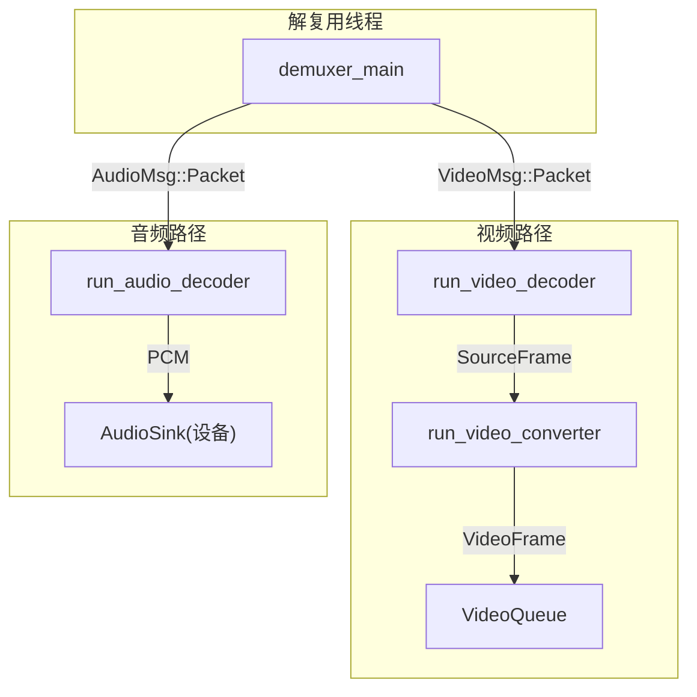
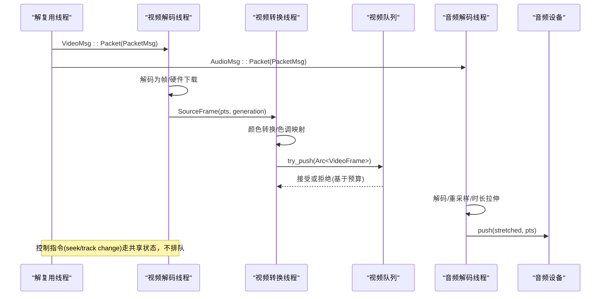
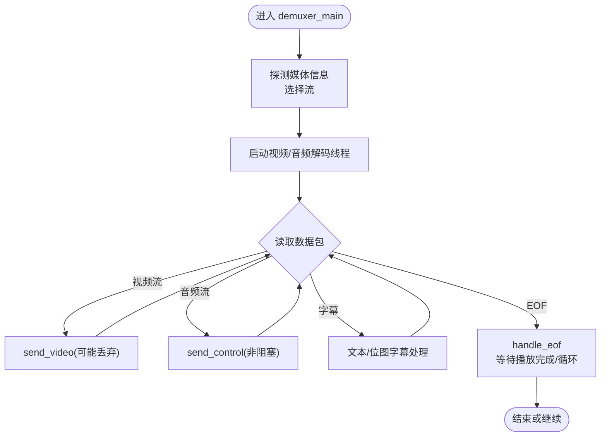
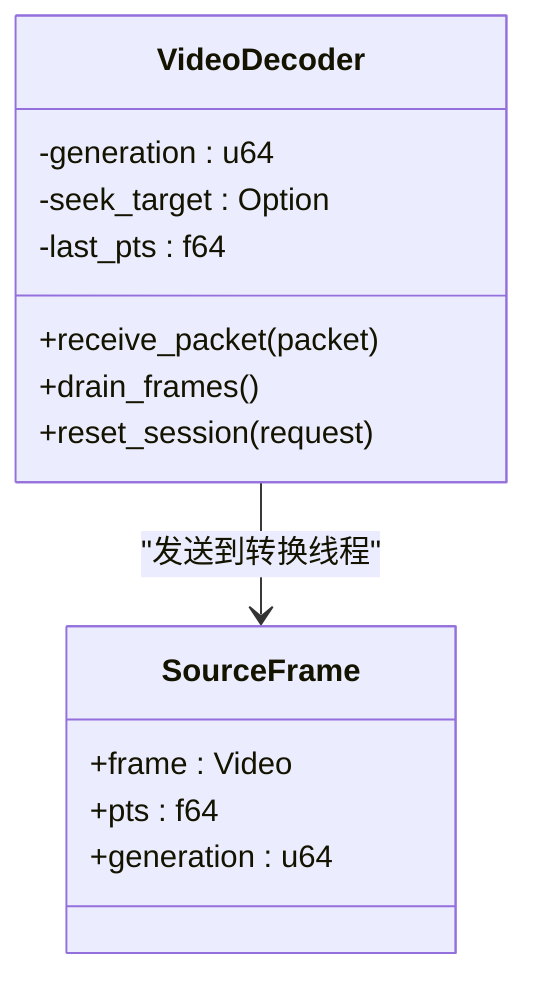
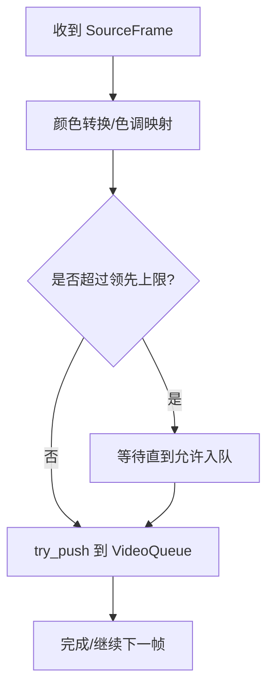
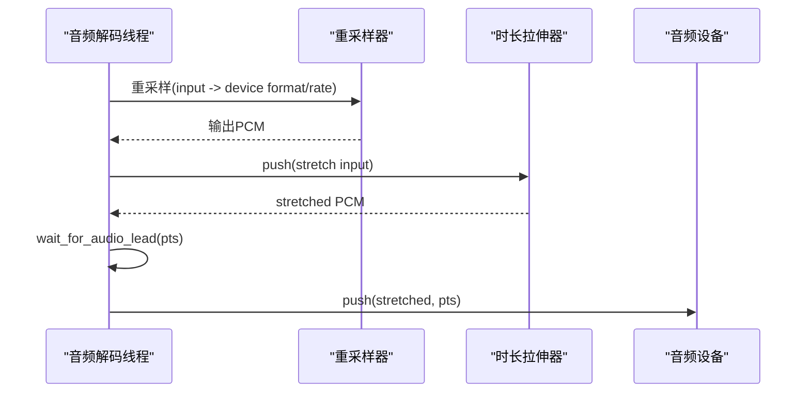
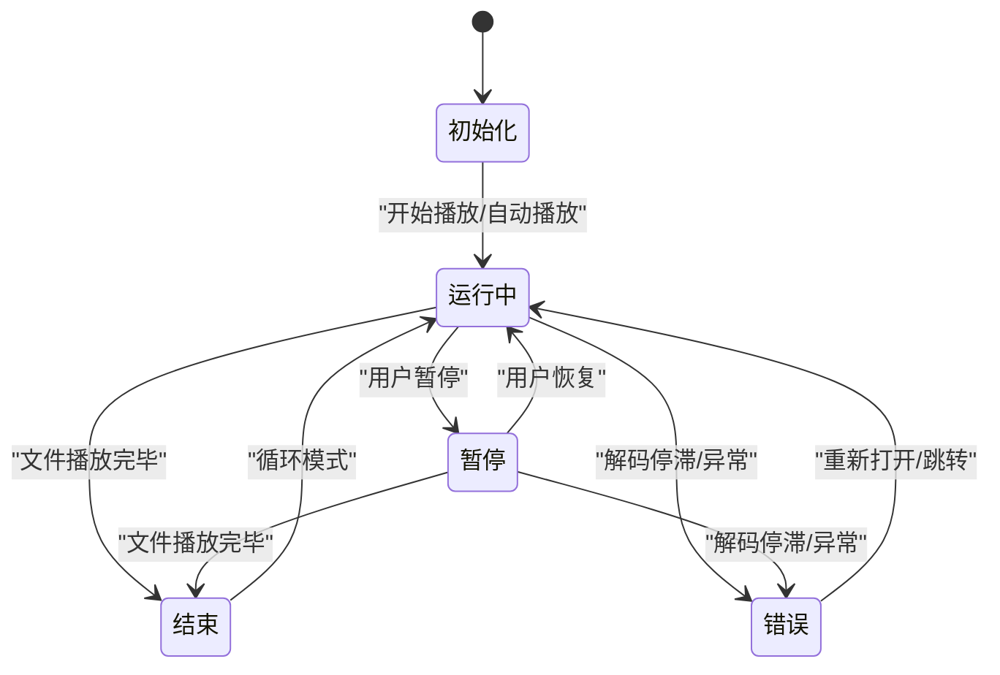
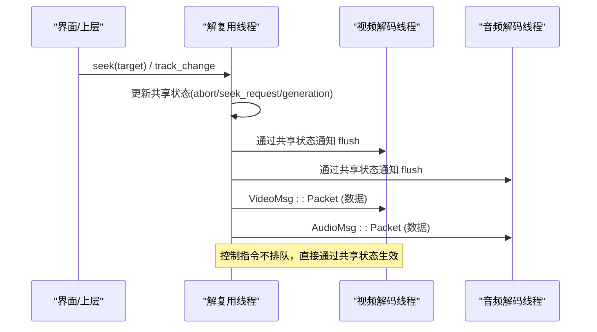
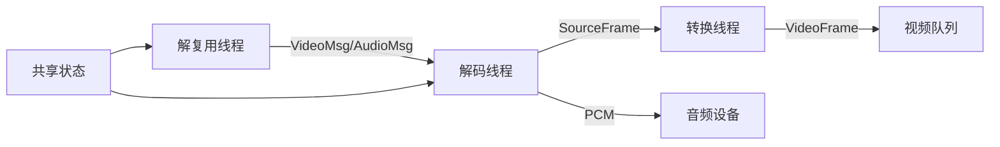

# 多线程模型

<cite>
**本文引用的文件**
- [workers.rs](file://crates/mvp-core/src/engine/workers.rs)
- [queue.rs](file://crates/mvp-core/src/engine/queue.rs)
- [lib.rs](file://crates/mvp-core/src/lib.rs)
</cite>

## 目录
1. [简介](#简介)
2. [项目结构](#项目结构)
3. [核心组件](#核心组件)
4. [架构总览](#架构总览)
5. [详细组件分析](#详细组件分析)
6. [依赖关系分析](#依赖关系分析)
7. [性能考量](#性能考量)
8. [故障排查指南](#故障排查指南)
9. [结论](#结论)
10. [附录](#附录)

## 简介
本设计文档聚焦于媒体引擎的多线程模型，围绕三个工作线程的职责与协作展开：解复用线程负责容器格式解析与数据分发；视频解码线程负责视频帧解码；音频解码线程负责音频采样点解码。文档重点说明：
- 线程间通信机制：使用有界队列传递数据包/帧，控制指令通过共享状态直接发送，避免阻塞。
- 错误处理策略：每个工作线程捕获 panic 并转换为错误状态，确保损坏文件的鲁棒性。
- 生命周期管理与资源清理：线程启动、停止、刷新（flush）与退出流程，以及队列、解码器、重采样器等资源的释放。
- 可视化表达：包含线程状态图与关键通信时序图，帮助理解整体行为。

## 项目结构
该多线程模型位于 mvp-core 的 engine 模块中，核心实现集中在 workers.rs 与 queue.rs：
- workers.rs：定义并运行解复用线程、视频解码线程、音频解码线程及视频转换线程；管理线程生命周期、错误上报、控制流与同步。
- queue.rs：定义消息类型（VideoMsg/AudioMsg/PacketMsg）与有界视频帧队列 VideoQueue，提供时间预算与内存预算控制。
- lib.rs：库入口，声明“每个工作线程捕获 panic”的设计原则，并导出公共 API。

图表来源
- [workers.rs:281-687](file://crates/mvp-core/src/engine/workers.rs#L281-L687)
- [workers.rs:906-1106](file://crates/mvp-core/src/engine/workers.rs#L906-L1106)
- [workers.rs:1297-1447](file://crates/mvp-core/src/engine/workers.rs#L1297-L1447)
- [workers.rs:1719-1879](file://crates/mvp-core/src/engine/workers.rs#L1719-L1879)
- [queue.rs:11-65](file://crates/mvp-core/src/engine/queue.rs#L11-L65)
- [queue.rs:67-253](file://crates/mvp-core/src/engine/queue.rs#L67-L253)

章节来源
- [workers.rs:1-162](file://crates/mvp-core/src/engine/workers.rs#L1-L162)
- [queue.rs:1-65](file://crates/mvp-core/src/engine/queue.rs#L1-L65)
- [lib.rs:1-18](file://crates/mvp-core/src/lib.rs#L1-L18)

## 核心组件
- 解复用线程（Demuxer）
  - 职责：打开输入、探测媒体信息、选择音视频/字幕流、读取数据包并按流分发到对应解码线程；处理跳转、A-B 循环、音轨/字幕切换、结束等待与重启。
  - 关键常量：VIDEO_PACKET_QUEUE、AUDIO_PACKET_QUEUE、CONTROL_POLL、RESYNC_LAG 等用于限流与响应性。
- 视频解码线程（Video Decoder）
  - 职责：接收 PacketMsg，调用 FFmpeg 解码为视频帧；支持硬件/软件解码；将帧交给转换线程；丢弃过时或超前的帧；检测解码停滞。
  - 关键常量：VIDEO_LEAD、DECODE_STALL、STALL_MIN_PACKETS 等。
- 视频转换线程（Video Converter）
  - 职责：将解码后的帧转换为 RGBA，应用色调映射/Dolby Vision 重映射；按播放头时间窗口推入展示队列；控制“领先”上限以保障响应性。
- 音频解码线程（Audio Decoder）
  - 职责：接收 AudioMsg，解码音频帧；进行重采样与时长拉伸；按“真实秒数”的领先限制推送至音频设备；处理音轨切换与 flush。
  - 关键常量：AUDIO_LEAD、RESAMPLE_MARGIN。
- 有界队列（VideoQueue）
  - 职责：维护待展示的视频帧 FIFO；同时受“字节预算”和“时间预算”约束；提供取帧、丢弃过期帧、统计等功能。

章节来源
- [workers.rs:25-132](file://crates/mvp-core/src/engine/workers.rs#L25-L132)
- [workers.rs:281-687](file://crates/mvp-core/src/engine/workers.rs#L281-L687)
- [workers.rs:906-1106](file://crates/mvp-core/src/engine/workers.rs#L906-L1106)
- [workers.rs:1297-1447](file://crates/mvp-core/src/engine/workers.rs#L1297-L1447)
- [workers.rs:1719-1879](file://crates/mvp-core/src/engine/workers.rs#L1719-L1879)
- [queue.rs:67-253](file://crates/mvp-core/src/engine/queue.rs#L67-L253)

## 架构总览
下图展示了三线程之间的数据与控制流，以及它们如何协同保证低延迟、可响应且鲁棒的播放体验。

图表来源
- [workers.rs:281-687](file://crates/mvp-core/src/engine/workers.rs#L281-L687)
- [workers.rs:906-1106](file://crates/mvp-core/src/engine/workers.rs#L906-L1106)
- [workers.rs:1297-1447](file://crates/mvp-core/src/engine/workers.rs#L1297-L1447)
- [workers.rs:1719-1879](file://crates/mvp-core/src/engine/workers.rs#L1719-L1879)
- [queue.rs:180-253](file://crates/mvp-core/src/engine/queue.rs#L180-L253)

## 详细组件分析

### 解复用线程（Demuxer）
- 职责
  - 初始化输入上下文、探测媒体信息、选择音视频/字幕流。
  - 创建并启动视频/音频解码线程，建立有界通道。
  - 主循环读取数据包，按流分发到对应解码线程；处理跳转、A-B 循环、音轨/字幕切换。
  - 到达 EOF 时通知两端解码器，并在所有缓冲播放完毕后报告结束。
- 通信与限流
  - 视频通道容量 VIDEO_PACKET_QUEUE；音频通道容量 AUDIO_PACKET_QUEUE。
  - send_video 在队列落后于时钟时丢弃视频包以避免进一步滞后；send_control 对音频控制使用超时轮询，确保控制及时生效。
- 错误与健壮性
  - 入口包裹 panic 捕获，异常转为错误状态并通过事件上报。
  - 对损坏/误识别的文件，设置解码停滞阈值 DECODE_STALL 与最小包数 STALL_MIN_PACKETS，触发错误并中止。

图表来源
- [workers.rs:281-687](file://crates/mvp-core/src/engine/workers.rs#L281-L687)
- [workers.rs:689-793](file://crates/mvp-core/src/engine/workers.rs#L689-L793)

章节来源
- [workers.rs:281-687](file://crates/mvp-core/src/engine/workers.rs#L281-L687)
- [workers.rs:689-793](file://crates/mvp-core/src/engine/workers.rs#L689-L793)

### 视频解码线程（Video Decoder）
- 职责
  - 接收 PacketMsg，调用 FFmpeg 解码；支持硬件解码（D3D11VA/DXVA2）与软件解码回退。
  - 将解码出的帧交给转换线程；丢弃早于 seek 目标或过旧的帧；检测解码停滞并上报错误。
- 关键逻辑
  - 生成号 generation：每次 flush/seek 递增，旧世代的数据被忽略，避免乱序影响。
  - 硬件帧下载：GPU 内存帧需拷贝到系统内存后再转换。
  - 停滞检测：若持续收到包但无输出超过 DECODE_STALL，判定文件不可用或格式错误。

图表来源
- [workers.rs:906-1106](file://crates/mvp-core/src/engine/workers.rs#L906-L1106)
- [workers.rs:1137-1266](file://crates/mvp-core/src/engine/workers.rs#L1137-L1266)

章节来源
- [workers.rs:906-1106](file://crates/mvp-core/src/engine/workers.rs#L906-L1106)
- [workers.rs:1137-1266](file://crates/mvp-core/src/engine/workers.rs#L1137-L1266)

### 视频转换线程（Video Converter）
- 职责
  - 将解码帧转换为 RGBA，应用 HDR 色调映射与 Dolby Vision 重映射。
  - 根据播放头与“领先”上限（VIDEO_LEAD）决定是否入队；队列满则等待而非丢弃。
- 队列交互
  - 使用 VideoQueue 的 try_push；队列受字节预算与时间预算双重限制，保证内存与延迟可控。

图表来源
- [workers.rs:1297-1447](file://crates/mvp-core/src/engine/workers.rs#L1297-L1447)
- [queue.rs:180-253](file://crates/mvp-core/src/engine/queue.rs#L180-L253)

章节来源
- [workers.rs:1297-1447](file://crates/mvp-core/src/engine/workers.rs#L1297-L1447)
- [queue.rs:180-253](file://crates/mvp-core/src/engine/queue.rs#L180-L253)

### 音频解码线程（Audio Decoder）
- 职责
  - 接收 AudioMsg，解码音频帧；进行重采样与时长拉伸；按“真实秒数”的领先限制（AUDIO_LEAD）推送至音频设备。
  - 处理音轨切换与 flush：重建重采样器、重置时长拉伸器、清空设备缓冲。
- 关键逻辑
  - wait_for_audio_lead：计算媒体秒数领先并换算为真实时间等待，避免速率变化感知延迟。
  - 重采样：按设备率与布局分配输出缓冲，考虑 RESAMPLE_MARGIN 避免截断。

图表来源
- [workers.rs:1719-1879](file://crates/mvp-core/src/engine/workers.rs#L1719-L1879)
- [workers.rs:1909-2104](file://crates/mvp-core/src/engine/workers.rs#L1909-L2104)

章节来源
- [workers.rs:1719-1879](file://crates/mvp-core/src/engine/workers.rs#L1719-L1879)
- [workers.rs:1909-2104](file://crates/mvp-core/src/engine/workers.rs#L1909-L2104)

### 线程状态图

图表来源
- [workers.rs:451-457](file://crates/mvp-core/src/engine/workers.rs#L451-L457)
- [workers.rs:689-793](file://crates/mvp-core/src/engine/workers.rs#L689-L793)
- [workers.rs:1094-1103](file://crates/mvp-core/src/engine/workers.rs#L1094-L1103)

### 通信时序图（含控制指令）

图表来源
- [workers.rs:474-535](file://crates/mvp-core/src/engine/workers.rs#L474-L535)
- [workers.rs:971-1014](file://crates/mvp-core/src/engine/workers.rs#L971-L1014)
- [workers.rs:1767-1823](file://crates/mvp-core/src/engine/workers.rs#L1767-L1823)

## 依赖关系分析
- 线程耦合
  - 解复用线程与解码线程通过有界通道耦合；控制指令通过共享状态耦合，避免通道阻塞导致控制延迟。
  - 视频解码与转换线程通过 SourceFrame 通道耦合，形成流水线，提高吞吐。
- 外部依赖
  - FFmpeg：解复用、解码、重采样、硬件加速。
  - crossbeam_channel：有界通道与超时收发。
  - 音频设备：AudioSink 负责输出与音量/静音控制。
- 潜在环路与死锁规避
  - 跳转时使用作用域块取出请求，避免在 FFmpeg 中断回调中持锁造成死锁。
  - 控制指令不进入通道，防止“控制消息被积压”。

图表来源
- [workers.rs:281-687](file://crates/mvp-core/src/engine/workers.rs#L281-L687)
- [workers.rs:906-1106](file://crates/mvp-core/src/engine/workers.rs#L906-L1106)
- [workers.rs:1297-1447](file://crates/mvp-core/src/engine/workers.rs#L1297-L1447)
- [workers.rs:1719-1879](file://crates/mvp-core/src/engine/workers.rs#L1719-L1879)

章节来源
- [workers.rs:281-687](file://crates/mvp-core/src/engine/workers.rs#L281-L687)
- [workers.rs:906-1106](file://crates/mvp-core/src/engine/workers.rs#L906-L1106)
- [workers.rs:1297-1447](file://crates/mvp-core/src/engine/workers.rs#L1297-L1447)
- [workers.rs:1719-1879](file://crates/mvp-core/src/engine/workers.rs#L1719-L1879)

## 性能考量
- 队列预算
  - 视频队列：字节预算与时间预算共同限制，避免高码率/高分辨率下内存爆炸与延迟过大。
  - 音频领先：以“真实秒数”限制，保证速率变化即时感知。
- 解码并行
  - 软件解码启用多核（thread_count），但限制最大线程数以避免与界面/其他线程争抢。
- 硬件加速
  - 优先尝试 D3D11VA/DXVA2，失败回退软件解码；硬件帧下载到系统内存后转换。
- 丢帧策略
  - 视频：当队列落后于时钟一定阈值时丢弃，避免进一步滞后；暂停时不丢帧。
  - 音频：通过 wait_for_audio_lead 控制输出节奏，避免设备欠载。

[本节为通用性能讨论，无需特定文件引用]

## 故障排查指南
- 常见症状
  - 画面卡住：检查解码停滞阈值 DECODE_STALL 与最小包数 STALL_MIN_PACKETS；确认是否有大量无效包输入。
  - 声音断续：检查音频设备可用性与重采样配置；关注 wait_for_audio_lead 导致的等待。
  - 跳转卡顿：确认控制指令通过共享状态生效，未因通道满载而阻塞。
- 定位步骤
  - 查看日志中的“解码无输出”“无法打开解码器”“音频输出不可用”等提示。
  - 检查队列长度与字节占用，确认是否达到预算上限。
  - 验证硬件解码是否启用，必要时回退软件解码。
- 恢复策略
  - 遇到错误状态，重新打开文件或执行跳转；清理队列与解码器内部缓冲。

章节来源
- [workers.rs:1094-1103](file://crates/mvp-core/src/engine/workers.rs#L1094-L1103)
- [workers.rs:1719-1740](file://crates/mvp-core/src/engine/workers.rs#L1719-L1740)
- [workers.rs:373-398](file://crates/mvp-core/src/engine/workers.rs#L373-L398)

## 结论
该多线程模型通过明确的职责分工与严格的边界控制，实现了高效、稳定且响应迅速的媒体播放：
- 解复用线程专注数据分发与流程控制；
- 视频/音频解码线程专注解码与预处理；
- 视频转换线程独立承担 CPU 密集的颜色转换；
- 有界队列与“领先”上限保障内存与延迟；
- 控制指令走共享状态，确保实时性；
- 每个工作线程捕获 panic，提升鲁棒性。

[本节为总结，无需特定文件引用]

## 附录
- 关键常量参考
  - 视频：VIDEO_PACKET_QUEUE=48，VIDEO_SOURCE_QUEUE=4，VIDEO_LEAD=0.5s，DECODE_STALL=12s，STALL_MIN_PACKETS=24，RESYNC_LAG=0.25s。
  - 音频：AUDIO_PACKET_QUEUE=192，AUDIO_LEAD=0.5s，RESAMPLE_MARGIN=4096。
  - 控制轮询：CONTROL_POLL=50ms，WORKER_POLL=25ms。
- 数据结构
  - PacketMsg：携带数据包、所属会话 generation、时间戳。
  - VideoMsg/AudioMsg：Packet/Eof/Stop。
  - VideoQueue：FIFO，支持 try_push/pop_front/take_ready/counted。

章节来源
- [workers.rs:25-132](file://crates/mvp-core/src/engine/workers.rs#L25-L132)
- [queue.rs:11-65](file://crates/mvp-core/src/engine/queue.rs#L11-L65)
- [queue.rs:67-253](file://crates/mvp-core/src/engine/queue.rs#L67-L253)