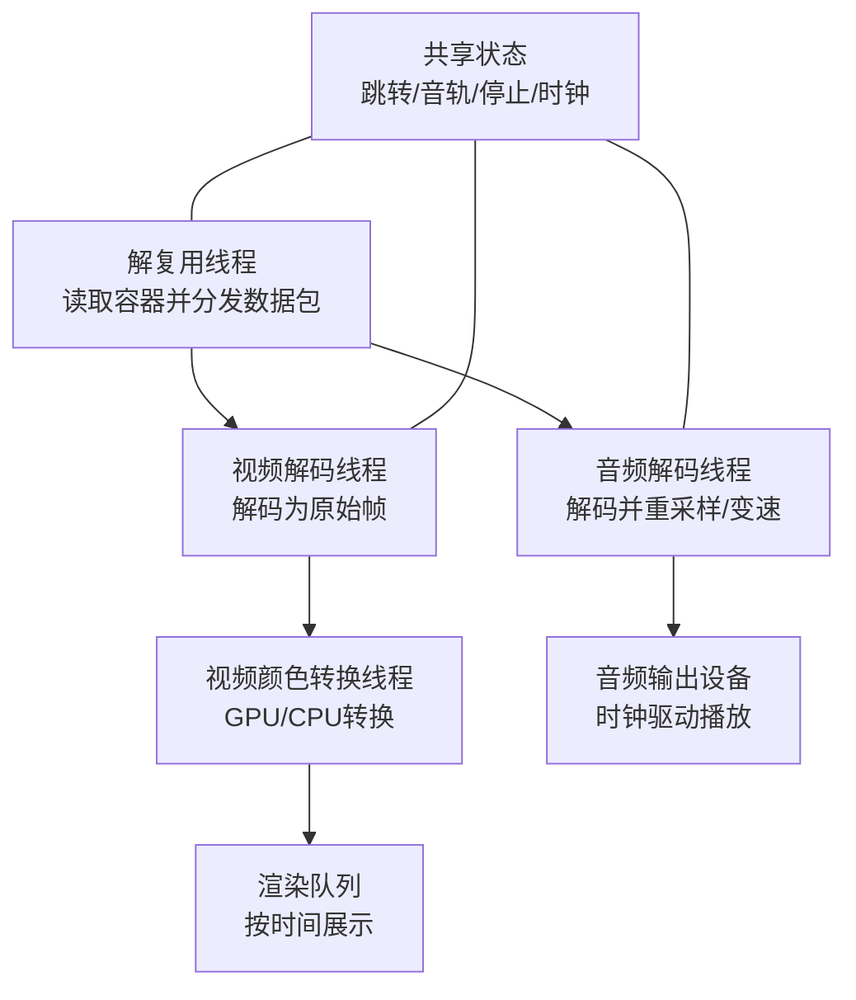
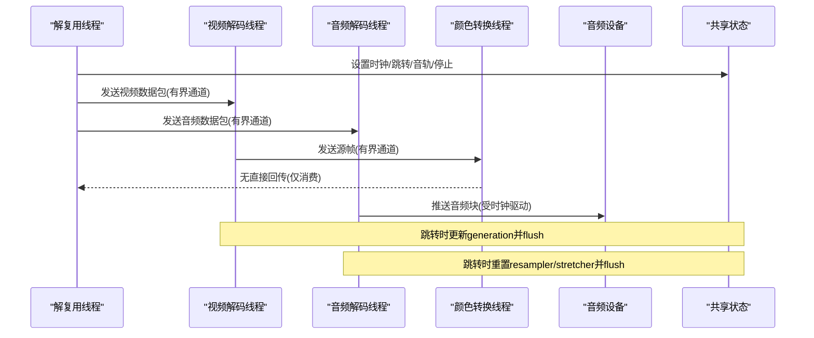
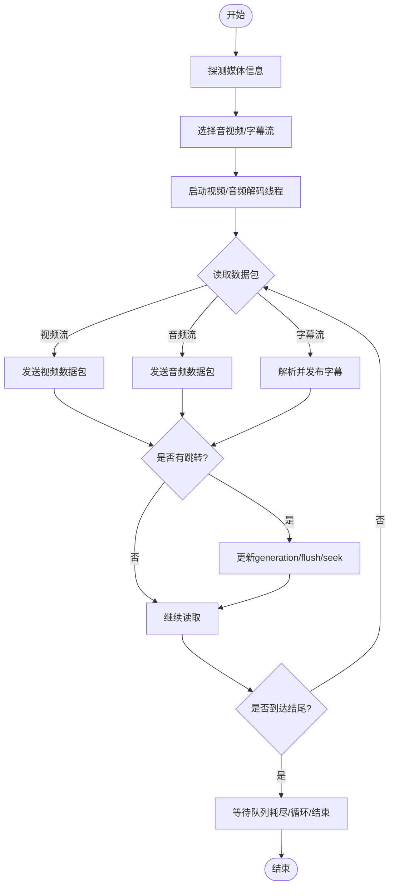
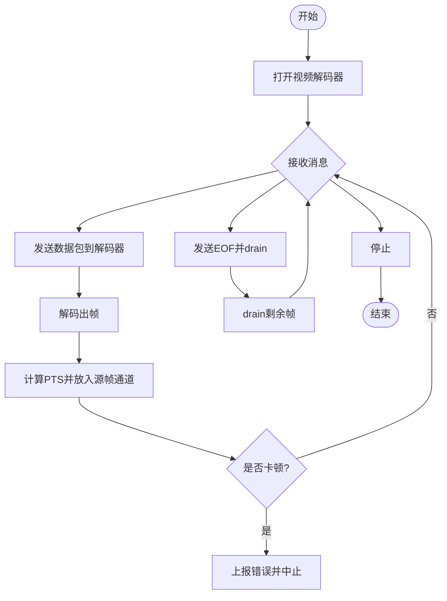
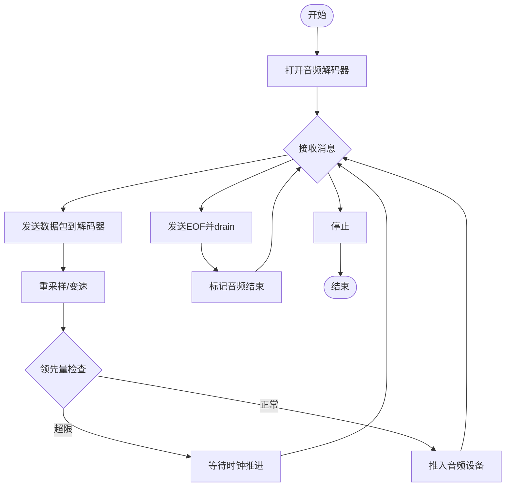
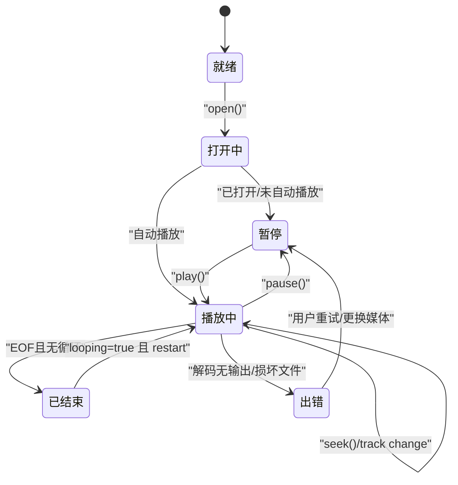
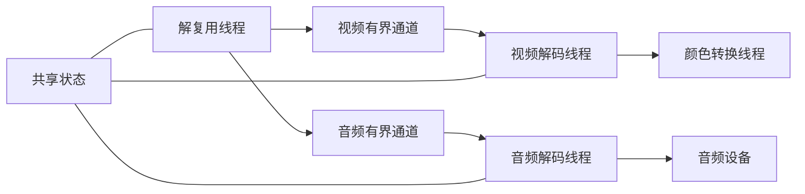

# 多线程模型

<cite>
**本文引用的文件**
- [workers.rs](file://crates/mvp-core/src/engine/workers.rs)
- [queue.rs](file://crates/mvp-core/src/engine/queue.rs)
- [lib.rs](file://crates/mvp-core/src/lib.rs)
- [audio.rs](file://crates/mvp-core/src/audio.rs)
</cite>

## 目录
1. [简介](#简介)
2. [项目结构](#项目结构)
3. [核心组件](#核心组件)
4. [架构总览](#架构总览)
5. [详细组件分析](#详细组件分析)
6. [依赖关系分析](#依赖关系分析)
7. [性能考量](#性能考量)
8. [故障排查指南](#故障排查指南)
9. [结论](#结论)
10. [附录](#附录)

## 简介
本文件聚焦于播放管线中的多线程模型，围绕解复用线程、视频解码线程、音频解码线程的职责分工与协作机制展开。重点说明：
- 使用有界通道（bounded channel）在解复用与解码之间传递数据包，避免内存膨胀与背压失控。
- 通过共享状态（原子变量、受保护队列、请求槽）传递控制信号（跳转、音轨切换、停止等）。
- 线程生命周期管理：优雅启动、停止与资源清理。
- 异常处理：每个入口捕获 panic，将崩溃转化为错误状态，确保单个线程崩溃不影响整个播放器。
- 线程状态转换图与错误传播机制的详细说明。

## 项目结构
播放引擎的核心位于 mvp-core 的 engine 模块，其中：
- workers.rs 实现了解复用线程、视频解码线程、音频解码线程以及视频颜色转换线程。
- queue.rs 提供有界视频帧队列与消息类型定义。
- lib.rs 提供引擎初始化与全局 FFmpeg 初始化策略。
- audio.rs 提供音频输出设备抽象与共享状态，用于时钟同步与音量/静音控制。

图表来源
- [workers.rs:133-146](file://crates/mvp-core/src/engine/workers.rs#L133-L146)
- [workers.rs:906-1106](file://crates/mvp-core/src/engine/workers.rs#L906-L1106)
- [workers.rs:1719-1879](file://crates/mvp-core/src/engine/workers.rs#L1719-L1879)
- [queue.rs:11-65](file://crates/mvp-core/src/engine/queue.rs#L11-L65)

章节来源
- [workers.rs:133-146](file://crates/mvp-core/src/engine/workers.rs#L133-L146)
- [queue.rs:11-65](file://crates/mvp-core/src/engine/queue.rs#L11-L65)
- [lib.rs:1-18](file://crates/mvp-core/src/lib.rs#L1-L18)

## 核心组件
- 解复用线程：负责打开媒体源、探测流信息、选择音视频/字幕流，并将数据包通过有界通道发送给对应解码线程；同时处理跳转、A-B循环、音轨/字幕切换、结束等待与循环重播。
- 视频解码线程：接收数据包，解码为原始帧，计算 PTS，放入“源帧”有界通道交给颜色转换线程；处理跳转刷新、EOF、卡顿检测与丢弃策略。
- 音频解码线程：接收数据包，解码并重采样到设备格式，进行变速处理，按“领先量”限制推入音频设备；处理跳转刷新、EOF、音轨切换。
- 视频颜色转换线程：从“源帧”通道取出帧，完成 GPU/CPU 的颜色空间转换与下载，最终进入渲染队列。
- 共享状态：包含时钟、跳转请求、生成号 generation、丢弃计数、事件通道、音轨/字幕选择、音频设备引用等，作为跨线程控制信号与状态同步点。
- 有界队列：视频帧队列按字节预算与时间预算限制容量，防止高码率/高分辨率导致内存暴涨；音频侧通过“领先量”限制缓冲深度。

章节来源
- [workers.rs:25-131](file://crates/mvp-core/src/engine/workers.rs#L25-L131)
- [workers.rs:281-687](file://crates/mvp-core/src/engine/workers.rs#L281-L687)
- [workers.rs:906-1106](file://crates/mvp-core/src/engine/workers.rs#L906-L1106)
- [workers.rs:1719-1879](file://crates/mvp-core/src/engine/workers.rs#L1719-L1879)
- [queue.rs:67-253](file://crates/mvp-core/src/engine/queue.rs#L67-L253)

## 架构总览
下图展示了三线程（解复用、视频解码、音频解码）及颜色转换线程之间的数据与控制流。数据包通过有界通道传递，控制信号通过共享状态传递。

图表来源
- [workers.rs:281-687](file://crates/mvp-core/src/engine/workers.rs#L281-L687)
- [workers.rs:906-1106](file://crates/mvp-core/src/engine/workers.rs#L906-L1106)
- [workers.rs:1719-1879](file://crates/mvp-core/src/engine/workers.rs#L1719-L1879)

## 详细组件分析

### 解复用线程职责与流程
- 打开媒体源并探测流信息，选择视频/音频/字幕流。
- 创建视频与音频的有界通道，并启动对应的解码线程。
- 主循环中读取数据包，根据流索引发送到相应解码线程；对字幕进行文本或位图解析并发布。
- 处理跳转：更新 generation、清空视频队列、唤醒视频线程、调用容器 seek、通知解码器 flush。
- 处理 A-B 循环：到达 b 点时自动跳转到 a。
- 处理结束：等待音视频队列耗尽后报告结束；若启用循环则自动重启。
- 异常处理：入口捕获 panic，转为错误状态并通过事件通道上报。

图表来源
- [workers.rs:281-687](file://crates/mvp-core/src/engine/workers.rs#L281-L687)
- [workers.rs:689-793](file://crates/mvp-core/src/engine/workers.rs#L689-L793)

章节来源
- [workers.rs:281-687](file://crates/mvp-core/src/engine/workers.rs#L281-L687)
- [workers.rs:689-793](file://crates/mvp-core/src/engine/workers.rs#L689-L793)

### 视频解码线程职责与流程
- 打开视频解码器，创建“源帧”有界通道并启动颜色转换线程。
- 接收数据包，检查 generation 以丢弃旧会话数据；发送数据包给解码器。
- 解码出帧后计算 PTS，放入“源帧”通道；遇到 EOF 时 drain 剩余帧。
- 处理跳转：收到 flush 请求后 reset 解码器、清空队列、唤醒消费者。
- 卡顿检测：若在最小包数阈值后仍无输出超过超时，上报错误并中止。
- 丢弃策略：当队列落后于时钟一定阈值时，跳过后续数据包以避免进一步滞后。

图表来源
- [workers.rs:906-1106](file://crates/mvp-core/src/engine/workers.rs#L906-L1106)

章节来源
- [workers.rs:906-1106](file://crates/mvp-core/src/engine/workers.rs#L906-L1106)

### 音频解码线程职责与流程
- 打开音频解码器，必要时重建重采样上下文与变速器。
- 接收数据包，检查 generation；发送数据包到解码器。
- 解码出帧后进行重采样与变速，按“领先量”限制缓冲深度，再推入音频设备。
- 处理跳转：reset 解码器、重采样器、变速器，并 flush 音频设备。
- 处理 EOF：标记音频结束，供结束判断使用。

图表来源
- [workers.rs:1719-1879](file://crates/mvp-core/src/engine/workers.rs#L1719-L1879)

章节来源
- [workers.rs:1719-1879](file://crates/mvp-core/src/engine/workers.rs#L1719-L1879)

### 视频颜色转换线程职责与流程
- 从“源帧”有界通道取出帧，执行颜色空间转换与可能的 GPU→CPU 下载。
- 将转换后的帧送入渲染队列，由 UI/渲染线程按 PTS 展示。
- 该线程与解码线程并行，避免解码等待转换造成的瓶颈。

章节来源
- [workers.rs:945-957](file://crates/mvp-core/src/engine/workers.rs#L945-L957)

### 线程间通信方式
- 数据包传递：使用 crossbeam_channel 的有界通道（VideoMsg/AudioMsg），限制队列深度，避免内存膨胀。
- 控制信号：通过共享状态（跳转请求、音轨切换、停止标志、时钟、generation）传递，确保控制消息不会阻塞在数据包队列之后。
- 同步与唤醒：跳转时清空队列并唤醒视频线程；音频端通过“领先量”与 sleep 轮询控制缓冲深度。

章节来源
- [queue.rs:11-65](file://crates/mvp-core/src/engine/queue.rs#L11-L65)
- [workers.rs:215-279](file://crates/mvp-core/src/engine/workers.rs#L215-L279)
- [workers.rs:971-1014](file://crates/mvp-core/src/engine/workers.rs#L971-L1014)
- [workers.rs:1769-1823](file://crates/mvp-core/src/engine/workers.rs#L1769-L1823)

### 线程生命周期管理
- 启动：解复用线程在打开媒体后按需启动视频/音频解码线程；颜色转换线程随视频解码线程启动。
- 停止：解复用线程结束时向视频/音频通道发送 Stop；各线程检查 abort 标志并退出。
- 清理：视频线程退出时清理帧池；音频线程退出前 flush 变速器尾部数据；共享状态中的工作句柄被收集以便 join。

章节来源
- [workers.rs:683-687](file://crates/mvp-core/src/engine/workers.rs#L683-L687)
- [workers.rs:1105-1106](file://crates/mvp-core/src/engine/workers.rs#L1105-L1106)
- [workers.rs:1881-1907](file://crates/mvp-core/src/engine/workers.rs#L1881-L1907)
- [workers.rs:879-900](file://crates/mvp-core/src/engine/workers.rs#L879-L900)

### 异常处理机制
- 每个入口点（解复用、视频解码、音频解码、通用 worker）均使用 catch_unwind 捕获 panic。
- 捕获后将 panic 信息转换为错误状态，并通过事件通道上报，UI 可显示错误并允许用户恢复。
- 单线程崩溃不会影响整个播放器，其他线程仍可继续运行或安全退出。

章节来源
- [workers.rs:133-162](file://crates/mvp-core/src/engine/workers.rs#L133-L162)
- [workers.rs:879-900](file://crates/mvp-core/src/engine/workers.rs#L879-L900)

### 线程状态转换图

图表来源
- [workers.rs:451-457](file://crates/mvp-core/src/engine/workers.rs#L451-L457)
- [workers.rs:689-793](file://crates/mvp-core/src/engine/workers.rs#L689-L793)
- [workers.rs:1094-1103](file://crates/mvp-core/src/engine/workers.rs#L1094-L1103)

### 错误传播机制
- 解码无输出：视频线程检测到持续无帧输出超过阈值，上报错误并设置 abort。
- 音频设备不可用：解复用阶段记录警告并继续静音播放。
- 跳转失败：记录警告并继续播放，不中断整体流程。
- 所有错误通过 shared.event_tx 发送 EngineEvent::Error，UI 可订阅并提示。

章节来源
- [workers.rs:1094-1103](file://crates/mvp-core/src/engine/workers.rs#L1094-L1103)
- [workers.rs:391-398](file://crates/mvp-core/src/engine/workers.rs#L391-L398)
- [workers.rs:527-529](file://crates/mvp-core/src/engine/workers.rs#L527-L529)

## 依赖关系分析
- 解复用线程依赖 FFmpeg 输入上下文与流选择逻辑。
- 视频解码线程依赖视频解码器与颜色转换线程。
- 音频解码线程依赖音频解码器、重采样器、变速器与音频设备。
- 共享状态贯穿所有线程，提供时钟、跳转、音轨/字幕选择、事件通道等能力。
- 有界通道作为数据管道，确保背压与内存可控。

图表来源
- [workers.rs:281-687](file://crates/mvp-core/src/engine/workers.rs#L281-L687)
- [workers.rs:906-1106](file://crates/mvp-core/src/engine/workers.rs#L906-L1106)
- [workers.rs:1719-1879](file://crates/mvp-core/src/engine/workers.rs#L1719-L1879)

章节来源
- [workers.rs:281-687](file://crates/mvp-core/src/engine/workers.rs#L281-L687)
- [workers.rs:906-1106](file://crates/mvp-core/src/engine/workers.rs#L906-L1106)
- [workers.rs:1719-1879](file://crates/mvp-core/src/engine/workers.rs#L1719-L1879)

## 性能考量
- 有界队列：视频帧队列按字节与时间预算限制容量，防止 4K/高分辨率导致内存暴涨。
- 领先量控制：音频解码线程通过 AUDIO_LEAD 限制缓冲深度，确保速度变化即时响应。
- 解码与转换并行：视频解码与颜色转换分离，避免 GPU/CPU 瓶颈串行化。
- 丢帧策略：当视频队列落后于时钟一定阈值时，跳过数据包以避免进一步滞后。
- 卡顿检测：视频线程在最小包数阈值后仍无输出则上报错误，避免无限等待。

章节来源
- [queue.rs:67-253](file://crates/mvp-core/src/engine/queue.rs#L67-L253)
- [workers.rs:67-98](file://crates/mvp-core/src/engine/workers.rs#L67-L98)
- [workers.rs:215-262](file://crates/mvp-core/src/engine/workers.rs#L215-L262)
- [workers.rs:1094-1103](file://crates/mvp-core/src/engine/workers.rs#L1094-L1103)

## 故障排查指南
- 解码无输出：检查是否误判容器格式或文件损坏；查看错误事件与日志。
- 音频设备不可用：确认系统音频设备可用；播放器会记录警告并继续静音播放。
- 跳转失败：记录警告并继续播放；检查媒体是否支持 seek。
- 卡顿与丢帧：观察视频队列是否落后时钟；调整 VIDEO_LEAD 或检查渲染性能。
- 内存占用过高：检查视频帧队列预算与分辨率；确认颜色转换是否及时消费。

章节来源
- [workers.rs:1094-1103](file://crates/mvp-core/src/engine/workers.rs#L1094-L1103)
- [workers.rs:391-398](file://crates/mvp-core/src/engine/workers.rs#L391-L398)
- [workers.rs:527-529](file://crates/mvp-core/src/engine/workers.rs#L527-L529)

## 结论
该播放管线采用三线程模型（解复用、视频解码、音频解码）加颜色转换线程，通过有界通道与共享状态实现高效、稳定的数据与控制流。设计强调：
- 有界队列与领先量控制，确保内存与延迟可控。
- 共享状态传递控制信号，避免控制消息阻塞。
- 异常捕获与错误上报，保证单线程崩溃不影响整体。
- 清晰的线程生命周期管理与优雅停止机制。

## 附录
- 全局初始化：FFmpeg 仅在首次需要时初始化，避免启动开销。
- 版本与配置查询：提供 FFmpeg 版本与构建配置查询接口。

章节来源
- [lib.rs:50-103](file://crates/mvp-core/src/lib.rs#L50-L103)